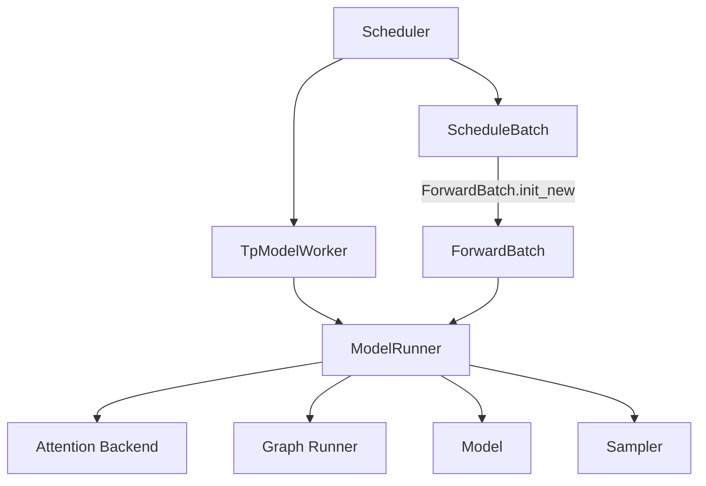
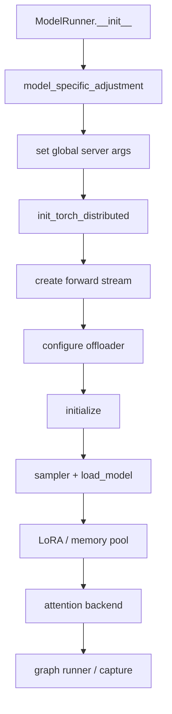
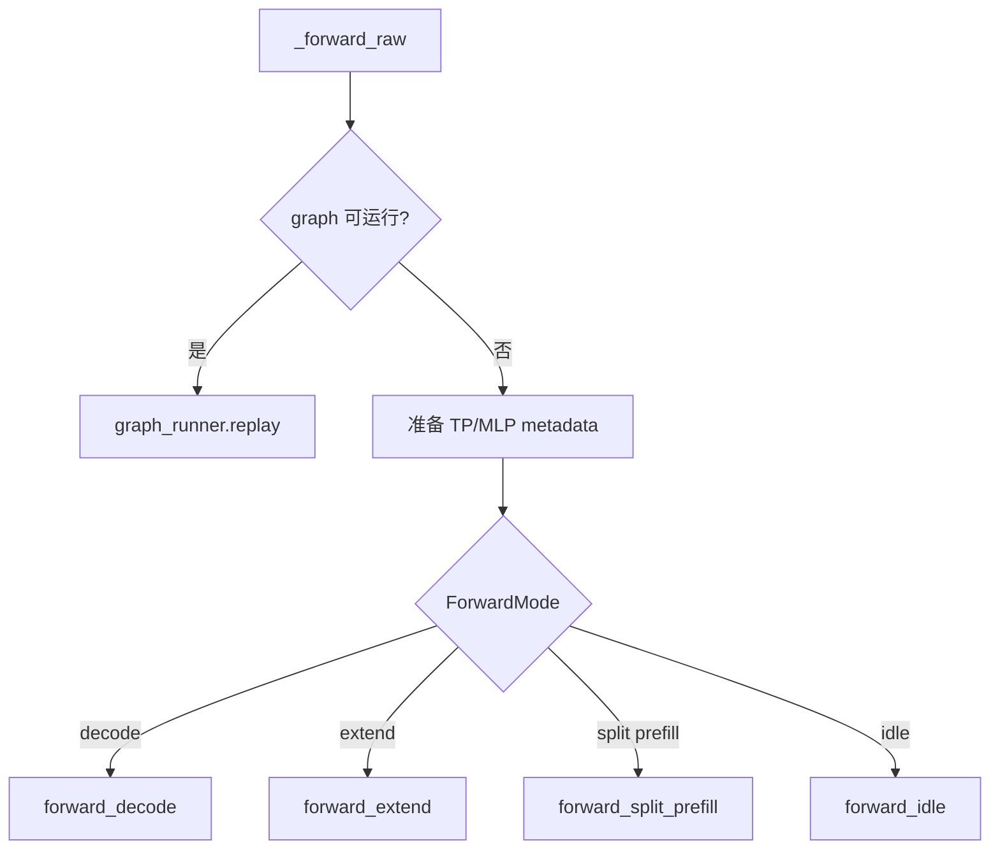

# 05. ModelRunner、ForwardBatch 与设备输入缓冲区

本讲聚焦模型执行前最后一段通用链路：`ScheduleBatch` 如何转换为 `ForwardBatch`，ModelRunner 如何初始化 backend、选择 graph/eager 分支，以及输入 buffer 为什么在 NPU 上有专门的正确性保护。

## 本讲目标

- 理解 ModelRunner 构造和 `initialize()` 的顺序。
- 按字段类别解释 `ForwardBatch.init_new()`。
- 说明 positions、extend metadata 和 sampling info 的来源。
- 理解 eager/graph 分支选择。
- 解释 `ForwardInputBuffers.share_buffers()` 为何在 NPU 上直接返回。
- 建立 ForwardBatch 字段错误到现象的映射。

## 1. 对象关系



生命周期：

- `ModelRunner`：scheduler rank 启动时创建，跨请求长期存在。
- `ScheduleBatch`：调度过程中创建并持续变更。
- `ForwardBatch`：为一次 model forward 创建或为 graph replay 准备。

## 2. TpModelWorker 创建 ModelRunner

`TpModelWorker.__init__()`：

```text
解析 rank 和 ServerArgs
  -> _init_model_config
  -> _init_model_runner
  -> 可选 draft/MTP runners
  -> 初始化 tokenizer/processor
  -> 读取 model_runner device 和 capacity
  -> 同步 random seed
```

`_init_model_runner()` 把以下状态传给 ModelRunner：

- model config。
- mem fraction。
- gpu id。
- TP/PP/EP/DP rank 和 size。
- server args。
- KV pool（若已存在）。
- draft worker 标志。

ModelRunner 因而是“模型 + 设备 + 并行 + backend”的聚合点。

## 3. ModelRunner 构造顺序

构造函数先保存配置并识别模型特征：

```text
device / gpu_id
TP/PP/EP/DP ranks
generation vs embedding
multimodal
page_size
MLA / MRoPE / hybrid SWA
speculative algorithm
```

随后关键步骤：



注意：实际 `initialize()` 还包含 MoE、speculative、remote weights 等分支。这里先保留阶段一主线。

## 4. ModelRunner 初始化中的 NPU 接入

### 4.1 模块级 backend 初始化

导入 `model_runner.py` 时：

```text
is_npu()
  -> init_npu_backend()
  -> import sgl_kernel_npu / torch_npu
```

### 4.2 Distributed

`init_torch_distributed()` 根据 device 建立 NPU/HCCL group，并返回加载模型前可用显存。

### 4.3 Forward stream

```python
self.forward_stream = torch.get_device_module(self.device).Stream()
```

当 device 为 `npu` 时，设备模块对应 `torch.npu`，因此创建 NPU stream。

### 4.4 Attention backend

NPU 默认参数已把 backend 字符串设为 `ascend`。ModelRunner 通过 registry 创建 backend，并保存到 `self.attn_backend`。

### 4.5 Graph runner

如果 graph 没禁用，初始化阶段会构造 runner 并 capture 支持的 batch shape。请求期只判断能否 replay。

## 5. ForwardBatch 的字段分类

当前 `ForwardBatch` 的字段可分六类：

| 类别 | 例子 | 来源 |
|---|---|---|
| 核心设备输入 | input_ids、seq_lens、pool indices、cache loc | ScheduleBatch tensor |
| 配置/标志 | forward_mode、return_logprob、prefill-only | ScheduleBatch value |
| host metadata | seq_lens_cpu、top logprob ids、MM inputs | Scheduler/Req |
| 复合对象 | sampling_info、spec_info | ScheduleBatch |
| 从 req 派生 | lora_ids、rids | `batch.reqs` |
| forward 派生 | positions、extend start、global token tensor | `init_new()` |

模型层主要读取 `ForwardBatch`，不应反向依赖 scheduler 内部队列状态。

## 6. `ForwardBatch.init_new()` 分步讲解

### 6.1 消费一次性 override

函数先读取并重置：

- `capture_hidden_mode`。
- `seq_lens_cpu_cache`。
- `return_hidden_states_before_norm`。

这是 one-shot 语义。若不重置，同一个 ScheduleBatch 下一次 forward 可能错误复用旧配置。

### 6.2 区分 decode 和 extend 字段

```text
decode/idle:
  extend_seq_lens = None
  extend_prefix_lens = None

extend:
  extend_seq_lens = batch.extend_lens
  extend_prefix_lens = batch.prefix_lens
```

这防止 prefill 元数据泄漏进 decode。

### 6.3 Sampling grammar

若 batch 有 grammar，`sampling_info.grammars` 从各 request 提取；否则清空。grammar mask 最终在 logits preprocess 阶段应用。

### 6.4 构造核心对象

核心字段：

```text
forward_mode
batch_size
input_ids
req_pool_indices
seq_lens
out_cache_loc
seq_lens_sum
sampling_info
spec_info
```

部分 tensor 是对 ScheduleBatch tensor 的引用，不做深拷贝，因此 stream 和生命周期管理非常重要。

### 6.5 Host-to-device metadata

例如：

```python
torch.tensor(global_num_tokens, dtype=torch.int64).to(device, non_blocking=True)
```

NPU 和 GPU 一样需要把 host list/mirror 转成设备 tensor。`non_blocking=True` 是否真正异步还取决于源内存和 runtime。

### 6.6 Position

decode/target verify：

```text
positions = clamp_position(seq_lens)
```

extend：

```text
compute_position(
  attention_backend,
  extend_prefix_lens,
  extend_seq_lens,
  extend_num_tokens
)
```

position 的计算显式接收 backend 名称，说明不同 attention backend 可能需要不同位置布局或 dtype。

DLLM、speculative 和 MRoPE 会覆盖普通 position 路径。

### 6.7 LoRA

开启 LoRA 时：

```text
从 req 提取 lora_ids
  -> fetch_new_loras（非 overlap loading）
  -> lora_manager.prepare_lora_batch
```

所以 LoRA batch metadata 在进入模型前已准备好。

## 7. NPU position dtype

代码中部分路径把 NPU 和 HIP 一起使用 int64 position，例如 diffusion LLM。普通路径还要继续查看 `compute_position()` 和 Ascend backend 对 dtype 的要求。

精度问题若只在长上下文或特殊模型出现，应比较：

- position 值。
- dtype。
- prefix offset。
- MRoPE sections。

## 8. ModelRunner.forward 的模式选择

`forward()` 建立调试/profiler context 后进入 `_forward_raw()`：



### 8.1 Graph 判断

需要同时满足：

- 当前 `ForwardMode` 是 graph mode。
- `self.graph_runner` 已存在。
- runner 的 `can_run(forward_batch)` 为真。

命中后直接 replay，不走普通 model forward。

### 8.2 Eager 路径

未命中 graph 时：

- 准备 attention TP scatter 或 MLP sync。
- 初始化 attention metadata。
- 调用具体 forward mode。
- 最后返回 logits output。

## 9. `ForwardInputBuffers` 与 NPU 正确性保护

`input_buffers.py` 提供全局 buffer pool，其他平台可共享同名 tensor storage，减少反复分配：

```text
新 buffer
  -> 查找旧 buffer
  -> 校验 dtype/device
  -> 选择容量更大的 storage
  -> as_strided 成新 view
```

但 `share_buffers()` 开头明确：

```python
if is_npu():
    return
```

注释说明：NPU 因精度问题禁用共享 input buffer。

### 9.1 为什么 buffer 共享可能影响精度

潜在风险包括：

- 不同 forward 对同一 storage 的异步读写重叠。
- graph replay 固定地址与动态 view 组合。
- stream 同步不完整。
- stride/shape 变化但旧数据残留。
- NPU runtime 对某些 view/地址复用的语义差异。

当前策略选择正确性优先：NPU 不进入这项内存复用优化。

### 9.2 不要擅自删掉 return

如果要重新启用，至少需要：

- batch1/混 batch/长短请求精度测试。
- graph on/off。
- overlap on/off。
- TP1/TPN。
- 地址、stride 和 stream event 验证。
- 性能收益数据。

## 10. ForwardBatch 字段到问题现象

| 字段错误 | 典型现象 |
|---|---|
| `input_ids` | 首 token 起就错。 |
| `positions` | 长上下文、RoPE 模型错误。 |
| `seq_lens` | batch/attention mask 错。 |
| `req_pool_indices` | 请求读取别人的 KV。 |
| `out_cache_loc` | 后续 decode 分叉。 |
| `extend_prefix_lens` | prefix cache 命中后错误。 |
| `sampling_info` | top-k/top-p/grammar 行为错误。 |
| `lora_ids` | adapter 混用。 |
| `spec_info` | draft/verify 位置错误。 |

## 11. 调试策略

### 11.1 先打印摘要

在 `ForwardBatch.init_new()` 之后记录：

```text
forward_mode
batch_size
input_ids.shape
seq_lens
positions 前后若干值
req_pool_indices
out_cache_loc 前后若干值
extend prefix/seq lens
```

不要直接打印完整 KV 或长 prompt tensor。

### 11.2 建立对照矩阵

```text
batch 1 vs batch 2
短 prompt vs 长 prompt
graph off vs graph on
overlap off vs overlap on
TP1 vs TP2
prefix cache miss vs hit
```

每次只改变一个变量。

### 11.3 首个分叉边界

依次比较：

```text
token ids
  -> ForwardBatch metadata
  -> embedding output
  -> layer hidden states
  -> logits
  -> sampled token
```

找到第一个不一致边界后再深入。

## 12. 性能观测

ForwardBatch 构造位于每次 forward 热路径，关注：

- CPU list 到 device tensor 的次数。
- stream synchronize。
- metadata 重建。
- input buffer 分配。
- graph replay 前的 copy。

但 NPU 上输入 buffer 共享当前因精度风险禁用，优化时不能只比较分配次数，必须把正确性矩阵一起提交。

## 13. 检查题

1. `ForwardBatch` 哪些字段直接借用 ScheduleBatch tensor？
2. decode 和 extend 的 positions 怎样产生？
3. graph replay 的选择发生在模型 forward 之前还是之后？
4. NPU 为什么不执行 `ForwardInputBuffers.share_buffers()`？
5. 首 token 正确、第二个 token 开始错误时应优先比较哪些字段？

## 本讲小结

ModelRunner 聚合模型、设备、并行组、attention backend、graph runner 和 sampler；ForwardBatch 则把一次调度结果收敛成模型可执行的数据结构。Ascend NPU 的许多问题并不是 kernel 本身错误，而是 positions、KV index、stream 或 buffer 生命周期在进入 kernel 前已经不正确。阶段一的核心能力，就是先证明输入边界正确，再进入后续 attention 和 kernel 深挖。
