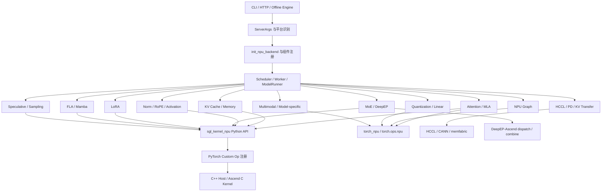

# SGLang Ascend NPU 源码串讲

本目录按“组件”而不是“执行阶段”组织 SGLang Ascend NPU 源码教程。

主线问题只有三个：

1. SGLang 在哪里识别 NPU、完成能力分支并选择组件？
2. 请求执行时，通用 SGLang 代码如何调用 Ascend 专用实现？
3. 组件内部由哪些 Python、PyTorch Custom Op、C++/Ascend C 与通信实现组成？

第一讲先建立完整组件地图；后续每一讲选择一个组件，从 SGLang 分支入口一路追到 `sgl-kernel-npu`、`torch_npu`、CANN 或 HCCL 的实际实现。

## 1. 两个仓库的职责边界

### 1.1 SGLang 仓库

SGLang 是推理运行时和控制面，主要负责：

- CLI、`ServerArgs`、平台识别和能力校验；
- 请求调度、batch 组织、模型加载和 `ModelRunner`；
- attention、graph、量化、MoE、LoRA 等 backend 的选择与生命周期；
- KV cache、分布式并行、PD 分离和 speculative decoding 的编排；
- 将 shape、dtype、layout、stream、process group 等运行时上下文交给底层算子。

Ascend 专用代码主要位于：

```text
python/sglang/srt/hardware_backend/npu/
├── attention/
├── graph_runner/
├── modules/
├── moe/
├── quantization/
├── allocator_npu.py
├── cmo.py
├── memory_pool_npu.py
└── utils.py
```

但 NPU 接入点并不只在这个目录。attention registry、LoRA、distributed、PD、sampler、speculative、模型实现等通用目录中同样存在 Ascend 分支。

### 1.2 sgl-kernel-npu 仓库

官方 `sgl-kernel-npu` 仓库提供两类底层能力：

1. 面向推理的 SGLang NPU kernels；
2. 面向 MoE Expert Parallel 的 DeepEP-Ascend。

其主要结构是：

```text
sgl-kernel-npu/
├── python/
│   ├── sgl_kernel_npu/
│   │   └── sgl_kernel_npu/
│   │       ├── activation/
│   │       ├── attention/
│   │       ├── fla/
│   │       ├── mamba/
│   │       ├── mem_cache/
│   │       ├── moe/
│   │       ├── norm/
│   │       ├── sample/
│   │       ├── utils/
│   │       ├── kvcacheio.py
│   │       └── speculative.py
│   └── deep_ep/
├── csrc/
├── include/
├── benchmark/
├── tests/
├── cmake/
├── scripts/
└── build.sh
```

这里的 Python 模块负责用户态 API、参数检查和算子包装；`csrc/` 负责算子注册、host 侧逻辑和 device kernel；DeepEP-Ascend 负责 MoE token dispatch/combine 及低时延通信。

官方参考：

- [sgl-kernel-npu 仓库](https://github.com/sgl-project/sgl-kernel-npu)
- [SGLang 仓库](https://github.com/sgl-project/sglang)

## 2. 组件驱动的总调用模型



读图时要区分四层：

| 层次 | 主要职责 | 常见定位方式 |
|---|---|---|
| SGLang 通用控制面 | 参数、调度、batch、模型执行 | `ServerArgs`、`Scheduler`、`ModelRunner` |
| SGLang NPU adapter | 平台分支、backend、metadata、NPU 专用对象 | `hardware_backend/npu/` 及各 registry |
| NPU Python/算子层 | Python wrapper、`torch.ops.npu`、`torch_npu.npu_*` | `sgl_kernel_npu`、`torch_npu` |
| Device/通信层 | C++ host、Ascend C kernel、CANN、HCCL、DeepEP | `csrc/`、CANN/HCCL API |

## 3. 主课程目录

### 第一讲：组件地图

#### 01. SGLang NPU 全组件与双仓目录总览

已完成：[01-sglang-npu-component-map.md](./01-sglang-npu-component-map.md)

本讲从 SGLang 与 `sgl-kernel-npu` 两个项目结构出发，定义所有主要组件、责任边界、分支入口、调用目标和后续课程归属。后续阅读任何一段 NPU 代码，都应先回到这张组件地图判断它属于哪一层。

### 逐组件前必读：端到端模型样例

#### GLM-4.7-Flash 完整执行路径

已完成：[examples/00-glm-4.7-flash-end-to-end.md](./examples/00-glm-4.7-flash-end-to-end.md)

这篇样例位于第一讲和第二讲之间。它以 BF16、TP=4 的 GLM-4.7-Flash 为主线，从模型注册、权重加载和请求调度开始，完整追踪纯 prefill 的 `MHA_NPU`、decode 的 `MLA_NPU`、压缩 paged KV cache、dense/MoE layers、logits 与 sampling；随后展开 prefix cache、NPU Graph、DeepEP/FuseEP 和内置 NextN/EAGLE 变体。

先读端到端样例的目的，是让后续每个组件都能放回一条真实模型执行路径中，而不是把 backend、metadata 和 custom op 当成互不相干的文件。

### 第二讲至第十八讲：逐组件追踪

| 讲次 | 计划文件 | 组件 | 核心追踪目标 |
|---|---|---|---|
| 02 | `02-platform-runtime-and-kernel-bootstrap.md` | 平台与运行时接入 | `is_npu`、默认参数、动态导入、`sgl_kernel_npu` 注册 |
| 03 | `03-ascend-attention-and-mla.md` | Attention / MLA | registry、prefill/decode、paged KV、MLA、attention kernel |
| 04 | `04-kv-cache-memory-and-allocator.md` | KV cache 与内存 | pool、allocator、cache location、assign/update、KVCacheIO |
| 05 | `05-npu-graph-and-compilation.md` | NPU Graph | graph runner 选择、capture、replay、静态输入、piecewise compile |
| 06 | `06-norm-rope-and-activation.md` | Norm / RoPE / Activation | 通用 layer 分支、融合算子、residual 与 dtype 语义 |
| 07 | `07-quantization-and-linear.md` | 量化与 Linear | quant method 选择、W8A8、AWQ、GPTQ、动态量化与 matmul |
| 08 | `08-moe-routing-and-fused-expert.md` | MoE 计算 | top-k、dispatch 前处理、expert compute、fused MoE、量化 MoE |
| 09 | `09-deepep-ascend-and-expert-parallel.md` | DeepEP-Ascend | EP 分支、buffer 初始化、normal/low-latency dispatch/combine |
| 10 | `10-ascend-lora.md` | LoRA | backend registry、adapter batch、SGMV/BGMV expand/shrink |
| 11 | `11-fla-mamba-and-hybrid-linear-attention.md` | FLA / Mamba | GDN、hybrid backend、gating、causal conv1d、state update |
| 12 | `12-speculative-decoding.md` | Speculative decoding | EAGLE/MTP、draft graph、tree build、verify、cache location |
| 13 | `13-sampling-and-constrained-decoding.md` | Sampling / Constraint | top-k/top-p、greedy verify、token bitmask、grammar 分支 |
| 14 | `14-model-specific-and-multimodal-components.md` | 模型与多模态适配 | Qwen/GLM/DeepSeek、processor、ViT graph、模型专用融合算子 |
| 15 | [15-distributed-hccl-and-communication.md](./15-distributed-hccl-and-communication.md) | 分布式通信 | `LayerCommunicator`、TP/EP group、HCCL、NPUCommunicator、collective 与压缩通信 |
| 16 | `16-pd-disaggregation-and-kv-transfer.md` | PD 与 KV 传输 | backend registry、transfer engine、sender/receiver、SDMA/RDMA |
| 17 | `17-utility-kernels-and-memory-optimization.md` | 工具与内存优化 | lightning indexer、tri-inv、batch matmul、CMO/prefetch |
| 18 | `18-build-registration-tests-and-cross-repo-development.md` | 构建与开发闭环 | wheel、custom op 注册、tests、benchmark、双仓联调与 PR 边界 |

## 4. 每讲的固定分析模板

第二讲起，每个组件都按以下结构展开：

1. **组件边界**：解决什么问题，不负责什么问题。
2. **双仓目录树**：SGLang 与 `sgl-kernel-npu` 中的对应文件。
3. **分支入口**：平台判断、registry、参数、模型类型或 capability check。
4. **初始化调用链**：对象何时创建，持有哪些状态，依赖哪些组件。
5. **请求调用链**：prefill、decode 或特定请求怎样进入组件。
6. **内部代码组成**：Python class/function、wrapper、custom op、host、device kernel。
7. **数据契约**：tensor shape、dtype、layout、metadata、stream 与 process group。
8. **后端边界**：`sgl_kernel_npu`、`torch_npu`、CANN、HCCL、DeepEP 的分工。
9. **fallback 与限制**：禁用路径、native fallback、能力矩阵和版本条件。
10. **验证方式**：最小调用、测试目录、benchmark、日志和 profiling 位置。
11. **修改影响面**：改 SGLang 还是 kernel 仓，可能破坏哪些调用者。
12. **检查题**：要求读者独立复述分支和调用关系。

## 5. 基础链路补充材料

旧版 00～05 讲保留在 `foundation/`。它们不再作为主课程的组件编号，而是帮助初学者先理解 SGLang 的公共运行链：

- [源码阅读方法与 Ascend 分支搜索法](./foundation/00-reading-method-and-branch-search.md)
- [NPU 平台识别与进程启动](./foundation/01-platform-detection-and-process-startup.md)
- [ServerArgs 校验与 NPU 默认参数](./foundation/02-server-args-and-npu-defaults.md)
- [请求主链路中的 NPU 接入点](./foundation/03-request-lifecycle-npu-branch-points.md)
- [模型加载、权重放置与 dtype/layout](./foundation/04-model-loading-dtype-and-layout.md)
- [ModelRunner、ForwardBatch 与输入缓冲区](./foundation/05-model-runner-forward-batch-and-input-buffers.md)

推荐阅读顺序：第一讲组件地图 → GLM-4.7-Flash 端到端样例 → 按需补充 `foundation/` → 进入对应组件讲次。

## 6. 版本记录要求

SGLang 与 `sgl-kernel-npu` 都在快速演进。学习或排障时必须记录：

```text
SGLang commit:
sgl-kernel-npu commit:
torch / torch_npu version:
CANN version:
NPU 型号:
模型与启动参数:
```

源码目录和符号必须结合具体 commit 阅读。若新版移动了实现，应记录“旧路径 → 新路径”和 commit，避免把不同版本的调用关系混在一起。

## 7. 学完后的能力标准

完成本系列后，读者应能：

- 从一个启动参数或模型特性找到 SGLang 的 NPU 分支条件；
- 从 registry 或工厂函数定位实际 backend class；
- 从 backend 方法追踪到 `sgl_kernel_npu` 或 `torch_npu` 算子；
- 继续定位到 custom op 注册和 `csrc/` 实现；
- 判断问题属于控制面、adapter、kernel、CANN/HCCL 还是通信环境；
- 为一个组件设计最小测试、精度对比和性能 benchmark；
- 判断修改应提交到 SGLang、`sgl-kernel-npu`，还是需要双仓配套变更。
