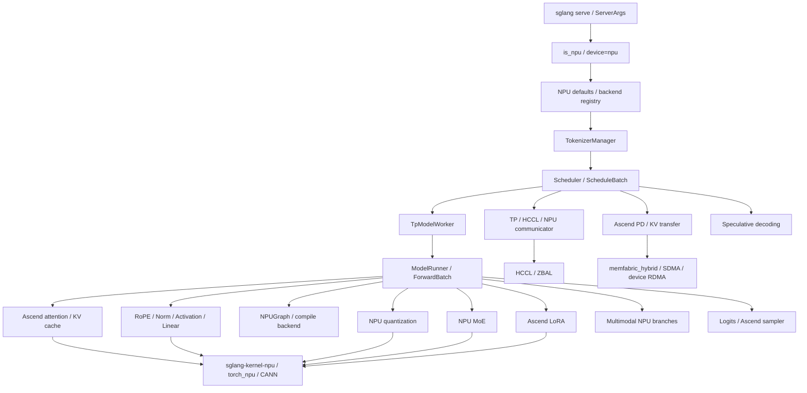

# SGLang Ascend NPU 源码串讲

本目录用于逐讲拆解 SGLang 各项能力在 Ascend NPU 上实际经过的代码分支。重点不是孤立介绍某个文件，而是从用户参数或请求入口开始，沿注册、初始化、调度、模型执行、NPU backend、kernel 和结果返回一路追踪。

本专题与上一级教程的区别：

- 上一级教程回答“怎样安装、运行、测试和优化”。
- 本目录回答“运行时为什么会进入这条 Ascend 分支、对象怎样初始化、数据怎样流动、最终调用了哪个 NPU 实现”。
- 遇到实现在 `sglang-kernel-npu`、`torch_npu` 或 CANN 中的情况，会明确标出仓库边界，不把外部 kernel 当成黑盒。

## 学习目标

完成本专题后，应能够：

1. 从一个 SGLang 启动参数定位到 Ascend NPU 的默认值、注册表和具体实现。
2. 从一个请求定位 `TokenizerManager -> Scheduler -> TpModelWorker -> ModelRunner -> model forward` 主链路中的 NPU 分叉点。
3. 解释 attention、KV cache、graph、TP/HCCL、PD、量化、MoE、LoRA、采样等特性在 NPU 上走哪条代码路径。
4. 判断一段能力属于 SGLang 控制面、SGLang NPU adapter、`sglang-kernel-npu`、`torch_npu` 还是 CANN/HCCL。
5. 面对精度或性能问题时，根据调用链快速选择日志点、tensor 对比点和 profiling 范围。

## 源码版本约定

源码会持续变化，因此每一讲都必须在开头记录：

```text
SGLang commit:
sglang-kernel-npu commit:
torch_npu / CANN version:
涉及的模型与启动参数:
```

文件路径和类名以当前学习仓库中的源码为起点。后续版本如果移动了实现，应保留“旧路径 -> 新路径”的迁移说明，而不是直接覆盖历史调用链。

## 什么算 Ascend NPU 分支

源码中不一定会直接出现 `if device == "npu"`。本专题会同时检查六类接入方式：

| 类型 | 典型形式 | 阅读重点 |
|---|---|---|
| 平台判断 | `is_npu()`、`args.device == "npu"` | 何时判断、判断结果影响哪些对象。 |
| 注册表选择 | `attention_backend="ascend"`、LoRA backend registry | 字符串怎样映射到具体类。 |
| NPU 默认参数 | `set_default_server_args()` | 哪些通用参数在 NPU 上被改写。 |
| 动态导入 | `import torch_npu`、按平台导入 Ascend 类 | 避免其他平台加载 NPU 依赖的机制。 |
| 专用算子调用 | `torch_npu.npu_*`、`torch.ops.npu.*`、`sgl_kernel_npu` | 输入 dtype、shape、layout 和输出语义。 |
| 禁用与 fallback | NPU 下关闭 CUDA/Triton 路径或回退 PyTorch | 是正确性兜底还是性能降级。 |

## 总体调用图



## 阅读顺序


不建议直接从一个两千行的 Ascend attention backend 开始读。先理解平台识别、默认参数、注册表和 `ForwardBatch`，后面看到 mask、KV index、graph input 时才知道它们从哪里产生。

## 课程目录

下面是本目录计划包含的各讲。文件会按此顺序逐步创建。

### 阶段一：入口、初始化与通用主链路

#### 00. 源码阅读方法与 Ascend 分支搜索法

计划文件：`00-reading-method-and-branch-search.md`

内容：

- 建立 SGLang 与 `sglang-kernel-npu` 的版本对应关系。
- 使用 `rg` 搜索 `is_npu`、`ascend`、`torch_npu`、`torch.ops.npu`、registry 和 fallback。
- 区分通用 runtime、平台 adapter、kernel wrapper 和外部算子实现。
- 建立“入口参数 -> 分支条件 -> 类 -> kernel -> 测试”的阅读记录模板。

#### 01. NPU 平台识别与进程启动

计划文件：`01-platform-detection-and-process-startup.md`

关键源码：

- `python/sglang/srt/utils/common.py`
- `python/sglang/srt/platforms/device_mixin.py`
- `python/sglang/srt/server_args.py`
- `python/sglang/srt/hardware_backend/npu/utils.py`

内容：`is_npu()` 如何判断设备；`torch_npu` 何时导入；device count、current device、显存查询如何适配；server 启动时怎样进入 NPU 初始化。

#### 02. ServerArgs 校验与 NPU 默认参数

计划文件：`02-server-args-and-npu-defaults.md`

关键对象：`ServerArgs`、`init_npu_backend()`、`set_default_server_args()`。

内容：

- `--device npu` 如何影响参数校验。
- attention backend 为什么被改为 `ascend`。
- page size、chunked prefill、graph batch size、custom all-reduce、HiCache 等默认值的来源。
- 用户显式参数与 NPU 默认值的优先级。

#### 03. 请求主链路中的 NPU 接入点

计划文件：`03-request-lifecycle-npu-branch-points.md`

调用链：

```text
HTTP API
  -> TokenizerManager
  -> Scheduler / ScheduleBatch
  -> TpModelWorker
  -> ModelRunner
  -> ForwardBatch
  -> model forward
  -> logits / sampler
```

内容：哪些部分完全复用通用 SGLang，哪些位置开始读取 NPU device、stream、graph、attention metadata 和 distributed group。

#### 04. 模型加载、权重放置与 dtype/layout

计划文件：`04-model-loading-dtype-and-layout.md`

关键源码：

- `python/sglang/srt/model_loader/loader.py`
- `python/sglang/srt/model_executor/`
- `python/sglang/srt/layers/linear.py`
- `python/sglang/srt/layers/vocab_parallel_embedding.py`

内容：权重怎样加载到 NPU；dtype 与参数分片如何确定；何时需要 format cast；TP 权重加载与普通加载的差异；模型加载错误如何表现为精度或启动问题。

#### 05. ModelRunner、ForwardBatch 与设备输入缓冲区

计划文件：`05-model-runner-forward-batch-and-input-buffers.md`

关键源码：

- `python/sglang/srt/model_executor/model_runner.py`
- `python/sglang/srt/model_executor/input_buffers.py`
- `python/sglang/srt/managers/tp_worker.py`
- `python/sglang/srt/managers/schedule_batch.py`

内容：prefill/decode batch 如何转成设备 tensor；seq length、position、KV index、sampling info 怎样进入 forward；graph replay 为什么依赖稳定的输入 buffer。

### 阶段二：模型核心算子与 KV 路径

#### 06. Attention Registry 与 AscendAttnBackend 初始化

计划文件：`06-attention-registry-and-ascend-backend-init.md`

关键源码：

- `python/sglang/srt/layers/attention/attention_registry.py`
- `python/sglang/srt/hardware_backend/npu/attention/ascend_backend.py`
- `python/sglang/srt/model_executor/model_runner_kv_cache_mixin.py`

内容：`attention_backend="ascend"` 如何映射到 `AscendAttnBackend`；backend 初始化需要哪些 ModelRunner 状态；MHA、MLA、hybrid linear attention 如何选择不同分支。

#### 07. Ascend Prefill / Extend Attention

计划文件：`07-ascend-prefill-extend-attention.md`

内容：

- prefill/extend metadata 怎样构造。
- causal mask、padding、actual seq length 的 NPU 处理。
- chunked prefill 如何改变 attention 和 KV 写入。
- 调用 `sglang-kernel-npu` 或 `torch_npu` attention 算子前后的 tensor shape/layout。

#### 08. Ascend Decode Attention 与 Paged KV Cache

计划文件：`08-ascend-decode-attention-and-paged-kv.md`

内容：decode 每步的 KV index、page table、slot mapping；KV cache 初始化与读写；page size 对 Ascend backend 的影响；batch 变化时 decode metadata 如何更新；首 token 正确但后续分叉时该看哪里。

#### 09. RoPE、RMSNorm、Activation 与基础 NPU 算子

计划文件：`09-rope-norm-activation-and-basic-npu-ops.md`

关键源码：

- `python/sglang/srt/layers/rotary_embedding/`
- `python/sglang/srt/layers/layernorm.py`
- `python/sglang/srt/layers/activation.py`

内容：`npu_rotary_mul`、NPU RMSNorm、SwiGLU/GeGLU/FastGELU 分支；fused 与 native fallback；dtype、广播和 residual 语义；这些基础算子为何也可能造成端到端精度差异。

#### 10. LogitsProcessor、约束解码与 Ascend Sampler

计划文件：`10-logits-constrained-decoding-and-sampler.md`

关键源码：

- `python/sglang/srt/layers/logits_processor.py`
- `python/sglang/srt/layers/sampler.py`
- `python/sglang/srt/constrained/`

内容：Ascend sampler 为何可直接处理 logits；softmax、top-k/top-p/min-p、greedy 和 penalty 如何进入 NPU 分支；`npu_top_k_top_p` 的约束；输出 token 分叉如何定位。

### 阶段三：Graph、编译、内存与分布式

#### 11. NPU Graph Capture、Replay 与 Piecewise Compile

计划文件：`11-npu-graph-capture-replay-and-compile.md`

关键源码：

- `python/sglang/srt/compilation/backend.py`
- `python/sglang/srt/compilation/npu_piecewise_backend.py`
- `python/sglang/srt/model_executor/cuda_graph_runner.py`
- `python/sglang/srt/compilation/weak_ref_tensor.py`

内容：通用类名为何仍含 CUDA；NPU 如何切到 `torch.npu.NPUGraph`；warmup、capture、replay、graph pool、static buffer、shape 覆盖；graph on 才出现精度问题时的检查点。

#### 12. TP、HCCL、NPUCommunicator 与 ZBAL

计划文件：`12-tp-hccl-npu-communicator-and-zbal.md`

关键源码：

- `python/sglang/srt/distributed/parallel_state.py`
- `python/sglang/srt/distributed/communication_op.py`
- `python/sglang/srt/distributed/device_communicators/npu_communicator.py`

内容：process group 怎样选择 `hccl`；TP group 初始化；all-reduce/all-gather/reduce-scatter 的 NPU 路径；quant communication；ZBAL 本地内存分支；单卡正确但 TP 错误时怎样分层检查。

#### 13. KV Cache 内存池、HiCache 与 NPU 存储后端

计划文件：`13-kv-memory-pool-hicache-and-storage.md`

关键源码：

- `python/sglang/srt/mem_cache/`
- `python/sglang/srt/mem_cache/hicache_storage.py`
- `python/sglang/srt/model_executor/model_runner_kv_cache_mixin.py`

内容：token-to-KV 映射、内存池和 radix cache；HiCache 的设备/主机/外部层级；NPU layout 和 IO backend；cache 命中、换入换出对性能与正确性的影响。

### 阶段四：高级特性分支

#### 14. Ascend 量化 Linear、AWQ、GPTQ 与 W8A8

计划文件：`14-ascend-quantization-linear-awq-gptq-w8a8.md`

关键源码：

- `python/sglang/srt/hardware_backend/npu/quantization/`
- `python/sglang/srt/layers/quantization/`
- `python/sglang/srt/layers/linear.py`

内容：quant config 怎样选择 Ascend method；权重、scale、zero point 怎样加载；动态 per-token quant；AWQ/GPTQ/CompressedTensors 的 NPU 分支；量化 kernel 与 `sglang-kernel-npu` 的边界。

#### 15. Ascend MoE、Expert Routing 与 Fused EP

计划文件：`15-ascend-moe-routing-fused-ep.md`

关键源码：

- `python/sglang/srt/layers/moe/`
- `python/sglang/srt/hardware_backend/npu/quantization/fused_moe_method_npu.py`
- `python/sglang/srt/hardware_backend/npu/utils.py`

内容：top-k routing、token dispatch、expert compute、combine；shared/routed expert stream；fused EP 和 TP/EP size；MoE 量化分支；expert id 正确但输出错误时的定位方法。

#### 16. Ascend LoRA Backend

计划文件：`16-ascend-lora-backend.md`

关键源码：

- `python/sglang/srt/lora/backend/lora_registry.py`
- `python/sglang/srt/lora/backend/ascend_backend.py`
- `python/sglang/srt/lora/lora.py`

内容：registry 如何选择 `AscendLoRABackend`；adapter 加载、batch info、segment 和 weight index；`sgmv_shrink`/`sgmv_expand`；多 adapter batch、graph 和 TP 的组合路径。

#### 17. Ascend PD Disaggregation 与 KV Transfer

计划文件：`17-ascend-pd-disaggregation-kv-transfer.md`

关键源码：

- `python/sglang/srt/disaggregation/utils.py`
- `python/sglang/srt/disaggregation/ascend/transfer_engine.py`
- `python/sglang/srt/disaggregation/ascend/conn.py`
- `python/sglang/srt/disaggregation/prefill.py`
- `python/sglang/srt/disaggregation/decode.py`

内容：transfer backend registry 如何选择 Ascend 类；`AscendTransferEngine` 初始化；manager/sender/receiver/bootstrap server 的关系；SDMA 与 device RDMA；prefill KV 怎样交给 decode。

#### 18. Speculative Decoding 在 NPU 上的分支

计划文件：`18-speculative-decoding-on-npu.md`

关键源码：

- `python/sglang/srt/speculative/`
- `python/sglang/srt/speculative/draft_utils.py`
- `python/sglang/srt/hardware_backend/npu/attention/ascend_backend.py`

内容：EAGLE/MTP/ngram 等能力哪些复用通用代码；`AscendAttnMultiStepDraftBackend` 的创建；draft/verify batch 和 KV 位置；NPU 下被禁用或 fallback 的 Triton op。

#### 19. 多模态模型的 Ascend 分支

计划文件：`19-multimodal-models-on-ascend.md`

关键源码：

- `python/sglang/srt/managers/mm_utils.py`
- `python/sglang/srt/multimodal/processors/`
- `python/sglang/multimodal_gen/runtime/platforms/npu.py`
- `python/sglang/multimodal_gen/runtime/layers/attention/backends/ascend_fa.py`

内容：图片/视频 processor 到 input embedding；Ascend reshape/dims 限制；NPU stream synchronize；ViT/视觉 attention；多模态 graph 和输入 shape。

#### 20. 模型专用分支：DeepSeek、Qwen、Hybrid Attention

计划文件：`20-model-specific-ascend-branches.md`

关键源码：

- `python/sglang/srt/models/deepseek_common/attention_backend_handler.py`
- `python/sglang/srt/hardware_backend/npu/attention/ascend_hybrid_linear_attn_backend.py`
- `python/sglang/srt/hardware_backend/npu/attention/ascend_gdn_backend.py`

内容：模型结构为何会绕开通用 MHA 路径；MLA、Mamba2、GDN、hybrid linear attention 的 backend 选择；模型专用 patch 与通用 Ascend backend 的边界。

### 阶段五：Kernel 边界、可观测性与开发闭环

#### 21. SGLang 到 sglang-kernel-npu 的调用边界

计划文件：`21-sglang-to-kernel-npu-boundary.md`

内容：

- Python wrapper 如何导入 `sgl_kernel_npu`。
- `torch.ops.npu`、`torch_npu.npu_*` 与自定义 kernel 的区别。
- 从 Python 调用点追到 kernel 注册、shape/dtype 校验和算子实现。
- 哪类修改应该进入 SGLang，哪类修改应该进入 `sglang-kernel-npu`。
- kernel 缺失时 import error、fallback 和 capability check 如何表现。

#### 22. NPU Profiling、日志与精度观测点

计划文件：`22-npu-profiling-logging-and-accuracy-probes.md`

关键源码：

- `python/sglang/srt/utils/profile_utils.py`
- `python/sglang/srt/managers/scheduler_components/profiler_manager.py`

内容：`torch_npu.profiler` patch；服务端 profile 控制；在请求、ForwardBatch、attention、KV、MoE、sampler 放置观测点；如何避免同步和 dump 改变性能结论。

#### 23. Fallback、能力矩阵与不支持路径

计划文件：`23-fallback-capability-and-unsupported-paths.md`

内容：系统梳理 NPU 下关闭的 CUDA/Triton 特性、CPU/native fallback、参数校验报错和 capability check；区分“明确不支持”“正确性 fallback”“可运行但性能差”。

#### 24. Ascend 特性的测试与 PR 实践

计划文件：`24-ascend-feature-tests-and-pr-workflow.md`

内容：为每条分支建立单元测试、模型 smoke、精度测试、性能测试和 profiling 证据；SGLang 与 kernel 仓联动提交；版本兼容矩阵；PR 描述模板和回归清单。

## 每一讲的固定结构

后续每个文件都按以下模板编写：

1. **本讲目标**：读完能回答哪些问题。
2. **运行场景**：用什么模型和启动参数进入该分支。
3. **入口与分支条件**：从 CLI/API 到选择逻辑。
4. **初始化调用链**：对象在什么时候创建，依赖什么状态。
5. **请求执行调用链**：prefill/decode 或特性请求怎样流动。
6. **关键类与函数逐段讲解**：强调输入、输出、副作用和状态。
7. **Kernel 边界**：进入 `sglang-kernel-npu`、`torch_npu`、CANN/HCCL 的位置。
8. **数据结构**：tensor shape、dtype、layout、metadata。
9. **NPU 与 CUDA/CPU 的差异**：说明复用、替换、禁用和 fallback。
10. **调试实践**：日志、断点、tensor dump、最小复现。
11. **精度风险与性能风险**：哪些修改容易出问题。
12. **练习与检查题**：确保读者能独立追踪分支。

## 第一轮建议阅读任务

在开始第 01 讲前，先完成以下搜索：

```bash
cd /sgl-workspace/sglang

rg "def is_npu|is_npu\(" python/sglang/srt
rg "attention_backend.*ascend|register_attention_backend\(\"ascend\"" python/sglang/srt
rg "torch_npu|torch\.ops\.npu|torch\.npu" python/sglang/srt
rg "AscendKV|AscendTransferEngine" python/sglang/srt/disaggregation
rg "AscendLoRABackend|GPTQLinearAscendMethod" python/sglang/srt
```

建议把搜索结果按下面格式记录：

| 接入点 | 分支条件 | 进入的类/函数 | 外部依赖 | 所属课程 |
|---|---|---|---|---|
| Attention | `attention_backend == "ascend"` | `AscendAttnBackend` | `sglang-kernel-npu` / `torch_npu` | 06-08 |
| Graph | `is_npu()` | `NpuPiecewiseBackend` / `NPUGraph` | `torch.npu` | 11 |
| Distributed | device type `npu` | HCCL / `NPUCommunicator` | HCCL / `torch_npu` | 12 |
| PD | transfer backend `ascend` | `AscendTransferEngine` | `memfabric_hybrid` | 17 |
| LoRA | LoRA backend `ascend` | `AscendLoRABackend` | NPU SGMV op | 16 |

## 本目录的完成标准

当全部课程完成后，本目录应形成三类产物：

- 一张覆盖主要特性的 Ascend NPU 分支知识图谱。
- 一套从启动命令到 kernel 的逐特性调用链文档。
- 一套能复现、调试和验证每条分支的最小实践脚本与检查清单。

阅读者最终不应只知道“Ascend 用 `attention_backend=ascend`”，而应能说明这个参数在哪里被设置、怎样进入 registry、`AscendAttnBackend` 如何初始化、metadata 从何而来、KV cache 如何组织，以及最后调用了哪个 NPU kernel。
