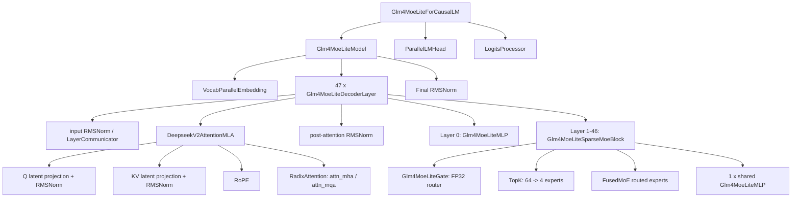
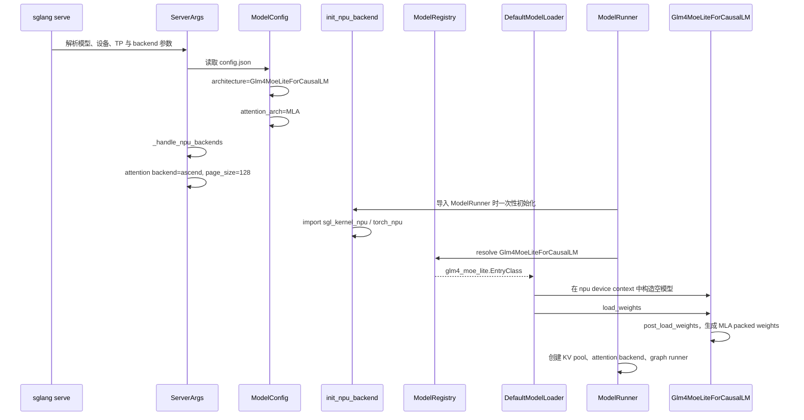
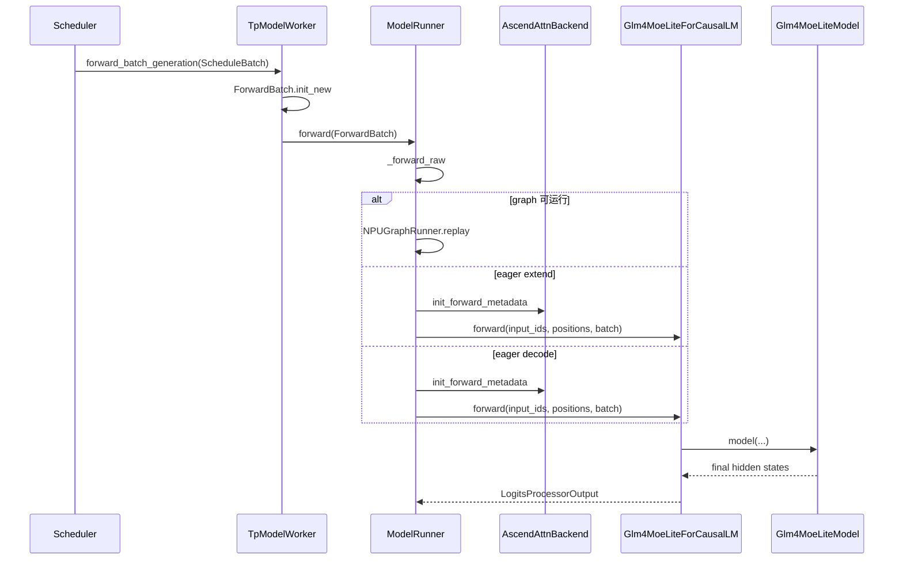
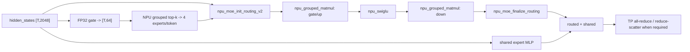
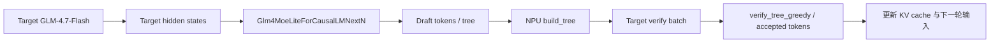
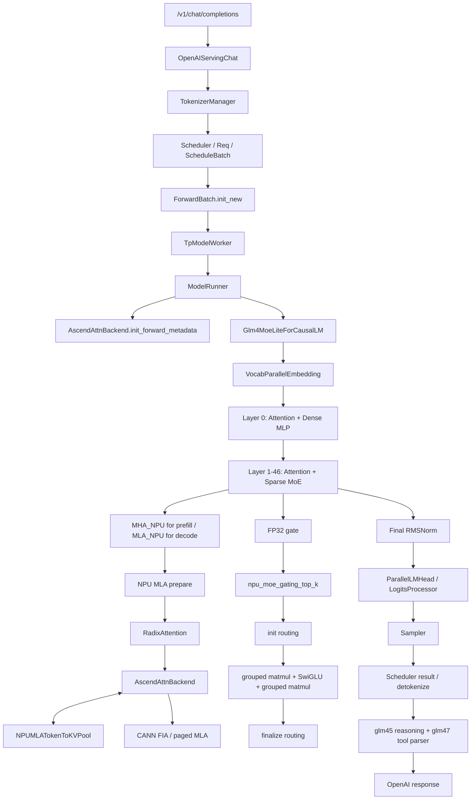

# 端到端样例：GLM-4.7-Flash 在 SGLang Ascend NPU 中的完整执行路径

本讲位于“组件地图”和“逐组件源码串讲”之间。它不先按 attention、MoE、KV cache 等组件拆开，而是选择一个真实模型，从启动命令开始一路追踪到输出 token，再把沿途遇到的组件标回课程地图。

样例模型选择 `GLM-4.7-Flash`，因为它在一条模型路径中同时覆盖：

- SGLang 原生模型注册与 Hugging Face 权重加载；
- Multi-Latent Attention（MLA）；
- 纯 prefill 的 MHA 计算和 decode 的 absorbed MLA 计算；
- Ascend paged KV cache；
- dense MLP、稀疏 MoE 和 shared expert；
- TP/HCCL、NPU Graph、prefix cache；
- 可选的 DeepEP/FuseEP；
- 模型内置 NextN 层和 EAGLE speculative decoding。

## 1. 阅读范围与基线场景

### 1.1 为什么要先固定一条基线

没有一条请求会同时经过 eager、graph、普通 MoE、DeepEP、FuseEP 和 speculative 的所有分支。为了避免画出一条实际不存在的“万能调用链”，本讲先跟踪一条基线，再单独展开变体。

基线约定：

| 项目 | 取值 |
|---|---|
| 模型 | `GLM-4.7-Flash` 原始 BF16 checkpoint |
| 模型路径 | `/home/{myspace}/models/GLM-4.7-Flash` |
| 设备 | Ascend NPU |
| 并行 | 单机 TP=4，PP=1，DP=1，EP 未单独启用 |
| 请求 | 文本在线请求，单请求，第一次请求无 prefix cache 命中 |
| 执行 | 先关闭 NPU Graph，观察 eager 调用链 |
| speculative | 基线关闭，后文单独启用 NextN/EAGLE |
| 量化 | 无，权重和激活以 BF16 为主 |
| attention backend | `ascend` |
| page size | NPU 默认 128 |

用于源码跟踪的启动命令可以写成：

```bash
sglang serve \
  --model-path /home/{myspace}/models/GLM-4.7-Flash \
  --device npu \
  --tp-size 4 \
  --attention-backend ascend \
  --sampling-backend ascend \
  --disable-cuda-graph \
  --tool-call-parser glm47 \
  --reasoning-parser glm45 \
  --served-model-name glm-4.7-flash \
  --host 0.0.0.0 \
  --port 8000
```

这里的 `--disable-cuda-graph` 名称保留了 SGLang 的跨平台历史命名，在 NPU 上表示先不进入 `NPUGraphRunner` replay。完成 eager 跟踪后，移除此参数即可继续观察 NPU Graph 分支。

### 1.2 版本与资料来源

模型和 SGLang 都在快速演进，实际阅读前先记录：

```text
SGLang commit:
sgl-kernel-npu commit:
GLM-4.7-Flash model revision:
torch / torch_npu / CANN version:
NPU 型号与卡数:
启动参数:
```

本讲使用的外部资料：

- [GLM-4.7-Flash 官方模型卡](https://huggingface.co/zai-org/GLM-4.7-Flash)
- [GLM-4.7-Flash 官方 config.json](https://huggingface.co/zai-org/GLM-4.7-Flash/blob/main/config.json)
- [ModelScope 模型入口](https://modelscope.cn/models/ZhipuAI/GLM-4.7-Flash)
- [SGLang 的 GLM-4.7-Flash 实现](https://github.com/sgl-project/sglang/blob/main/python/sglang/srt/models/glm4_moe_lite.py)
- [sgl-kernel-npu](https://github.com/sgl-project/sgl-kernel-npu)

官方模型卡将它描述为 30B-A3B MoE 模型。教程中的结构参数以模型 `config.json` 和当前 SGLang 源码为准。

## 2. 先看清模型本身

### 2.1 配置指纹

`config.json` 中最关键的字段如下：

| 字段 | 值 | 对执行路径的影响 |
|---|---:|---|
| `architectures` | `Glm4MoeLiteForCausalLM` | 决定 SGLang 原生模型类 |
| `model_type` | `glm4_moe_lite` | Transformers 配置类型 |
| `dtype` | `bfloat16` | 基线权重和激活 dtype |
| `vocab_size` | 154880 | embedding 和 LM head 规模 |
| `hidden_size` | 2048 | 主干 hidden state 宽度 |
| `num_hidden_layers` | 47 | decoder layer 数量 |
| `first_k_dense_replace` | 1 | 第 0 层 dense，第 1～46 层 MoE |
| `intermediate_size` | 10240 | dense MLP 中间维度 |
| `n_routed_experts` | 64 | 每个 MoE 层的 routed experts |
| `n_shared_experts` | 1 | 每个 MoE 层的 shared expert |
| `num_experts_per_tok` | 4 | 每个 token 选择 4 个 routed experts |
| `moe_intermediate_size` | 1536 | 单个 expert 的中间维度 |
| `topk_method` | `noaux_tc` | grouped top-k 路由语义 |
| `routed_scaling_factor` | 1.8 | routed expert 输出缩放 |
| `num_attention_heads` | 20 | Q heads 总数 |
| `q_lora_rank` | 768 | Q 的低秩 latent 宽度 |
| `kv_lora_rank` | 512 | 压缩 KV latent 宽度 |
| `qk_nope_head_dim` | 192 | 非 RoPE Q/K head 维度 |
| `qk_rope_head_dim` | 64 | RoPE Q/K head 维度 |
| `v_head_dim` | 256 | V head 维度 |
| `max_position_embeddings` | 202752 | 配置中的最大位置长度 |
| `num_nextn_predict_layers` | 1 | checkpoint 内含一个 NextN/MTP 层 |

由这些字段可以立即得到：

```text
qk_head_dim = qk_nope_head_dim + qk_rope_head_dim
              = 192 + 64
              = 256

TP=4 时：
num_local_heads = 20 / 4 = 5
```

### 2.2 模型对象树



### 2.3 为什么它叫 Lite，但不是普通小型 dense 模型

`Lite` 对应的是 `Glm4MoeLiteForCausalLM` 架构分支，不代表执行路径简单。模型包含 64 个 routed experts，但每个 token 只激活 4 个，再叠加一个 shared expert，因此活跃参数量远小于总参数量。

它也不是普通 GQA 模型。虽然配置中 `num_attention_heads` 与 `num_key_value_heads` 都是 20，SGLang 仍依据架构名和 `kv_lora_rank` 将其识别为 MLA，并使用压缩 latent KV cache。

## 3. 本模型涉及的源码地图

| 阶段 | 关键文件 | 关键对象 |
|---|---|---|
| 配置识别 | `configs/model_config.py` | `ModelConfig`、`AttentionArch.MLA` |
| 模型注册 | `models/registry.py` | `ModelRegistry`、`EntryClass` |
| 模型选择 | `model_loader/utils.py` | `get_model_architecture()` |
| 模型加载 | `model_loader/loader.py` | `DefaultModelLoader` |
| 模型实现 | `models/glm4_moe_lite.py` | `Glm4MoeLiteForCausalLM` 等 |
| NextN 实现 | `models/glm4_moe_lite_nextn.py` | `Glm4MoeLiteForCausalLMNextN` |
| MLA 通用主体 | `models/deepseek_v2.py` | `DeepseekV2AttentionMLA` |
| NPU MLA prepare/core | `hardware_backend/npu/modules/deepseek_v2_attention_mla_npu.py` | `forward_mha_*_npu`、`forward_mla_*_npu` |
| Attention backend | `hardware_backend/npu/attention/ascend_backend.py` | `AscendAttnBackend` |
| Attention 注册 | `layers/attention/attention_registry.py` | `ATTENTION_BACKENDS["ascend"]` |
| Radix 调用层 | `layers/radix_attention.py` | `RadixAttention` |
| NPU KV pool | `hardware_backend/npu/memory_pool_npu.py` | `NPUMLATokenToKVPool` |
| NPU allocator | `hardware_backend/npu/allocator_npu.py` | `NPUPagedTokenToKVPoolAllocator` |
| MoE top-k | `hardware_backend/npu/moe/topk.py` | `fused_topk_npu()` |
| MoE 计算 | `layers/quantization/unquant.py` | `UnquantizedFusedMoEMethod.forward_npu()` |
| NPU Graph | `hardware_backend/npu/graph_runner/npu_graph_runner.py` | `NPUGraphRunner` |
| 请求入口 | `entrypoints/openai/serving_chat.py` | `OpenAIServingChat` |
| Tokenize | `managers/tokenizer_manager.py` | `TokenizerManager` |
| 调度 | `managers/scheduler.py` | `Scheduler`、`ScheduleBatch` |
| Worker | `managers/tp_worker.py` | `TpModelWorker` |
| 模型执行 | `model_executor/model_runner.py` | `ModelRunner` |
| 采样 | `layers/sampler.py` | `Sampler` |

## 4. 服务启动：模型怎样变成运行时对象

### 4.1 总初始化链



### 4.2 NPU 默认参数

`ServerArgs._handle_npu_backends()` 在 `device == "npu"` 时调用 `hardware_backend/npu/utils.py::set_default_server_args()`。当前源码会设置：

```text
attention_backend         = "ascend"
prefill_attention_backend = "ascend"
decode_attention_backend  = "ascend"
page_size                 = 128（用户未显式设置时）
disable_custom_all_reduce = True
```

它还会根据设备内存和 TP size 设置 chunked prefill、graph batch size，并在启用 HiCache 时选择 `kernel_ascend`。

注意：`sampling_backend` 是独立配置。为了让样例明确进入 Ascend sampler，启动命令显式使用了 `--sampling-backend ascend`。

### 4.3 `init_npu_backend()` 做了什么

`ModelRunner` 模块在检测到 NPU 时调用 `init_npu_backend()`：

```text
init_npu_backend
  -> import sgl_kernel_npu
  -> import torch_npu
  -> import torch_npu.contrib.transfer_to_npu
  -> allow_internal_format = True
  -> set_compile_mode(jit_compile=False)
```

这里有两个重要结论：

1. 导入 `sgl_kernel_npu` 可能完成 custom op 注册；
2. `transfer_to_npu` 会兼容一部分通用代码中的 `torch.cuda.*` 调用，因此在 `glm4_moe_lite.py` 中看到 `torch.cuda.Stream()` 不应立刻判定它走了 CUDA。

### 4.4 架构名怎样映射到模型类

模型注册路径为：

```text
config.json
  architectures = ["Glm4MoeLiteForCausalLM"]
    -> ModelRegistry 扫描 sglang.srt.models
    -> 导入 glm4_moe_lite.py
    -> 读取 EntryClass = [Glm4MoeLiteForCausalLM]
    -> get_model_architecture()
    -> 返回 Glm4MoeLiteForCausalLM class
```

这是 SGLang 原生实现，不是 Transformers backend fallback。

### 4.5 为什么会选择 MLA

`ModelConfig` 对 `Glm4MoeLiteForCausalLM` 有显式判断：

```text
architecture 命中 Glm4MoeLiteForCausalLM
  -> head_dim = 256
  -> attention_arch = AttentionArch.MLA
  -> kv_lora_rank = 512
  -> qk_nope_head_dim = 192
  -> qk_rope_head_dim = 64
  -> v_head_dim = 256
```

这个判断影响后续三件事：

- `ModelRunner.use_mla_backend = True`；
- 创建 `NPUMLATokenToKVPool`；
- `AscendAttnBackend.use_mla = True`。

### 4.6 模型对象初始化

`DefaultModelLoader.load_model()` 的核心步骤：

```text
get_model_architecture
  -> _initialize_model
  -> Glm4MoeLiteForCausalLM(config, quant_config=None)
  -> load_weights
  -> quant_method.process_weights_after_loading
  -> model.eval()
```

`Glm4MoeLiteForCausalLM.__init__()` 创建：

```text
self.model = Glm4MoeLiteModel(...)
self.lm_head = ParallelLMHead(...)
self.logits_processor = LogitsProcessor(config)
```

`Glm4MoeLiteModel` 再创建 embedding、47 个 decoder layers 和最终 RMSNorm。

### 4.7 47 层是怎样组成的

模型构造函数把 `config.moe_layer_freq` 固定为 1。每层通过 `_is_layer_sparse()` 判断：

```text
layer_id >= first_k_dense_replace
and layer_id % moe_layer_freq == 0
```

对于当前配置：

```text
layer 0     -> Glm4MoeLiteMLP
layer 1-46  -> Glm4MoeLiteSparseMoeBlock
```

每层都包含相同的 `DeepseekV2AttentionMLA`，区别只在 MLP/MoE 部分。

### 4.8 权重加载和 MLA 权重重组

`Glm4MoeLiteForCausalLM.load_weights()` 不只是逐 tensor 复制，还会完成几类映射：

1. `gate_proj` 与 `up_proj` 合入 `gate_up_proj`；
2. expert checkpoint 权重映射到 FusedMoE 的 `w13_weight` 和 `w2_weight`；
3. `q_a_proj` 与 `kv_a_proj_with_mqa` 合入 `fused_qkv_a_proj_with_mqa`；
4. 普通 target model 跳过第 47 层的 NextN 权重；
5. 最后调用 `post_load_weights()` 处理每层 MLA 的 `kv_b_proj`。

`post_load_weights()` 将 `kv_b_proj.weight` 按 head 和维度拆成：

```text
w_kc: 用于把 q_nope 吸收到 512 维 latent 空间
w_vc: 用于把 attention 的 512 维 latent 输出恢复到 256 维 V head
```

Ascend 路径会额外保证 `w_vc` contiguous，因为后面将进入 `torch.ops.npu.batch_matmul_transpose`。

## 5. NPU runtime 组件初始化

### 5.1 Attention backend

```text
ModelRunner.init_attention_backend
  -> _get_attention_backend
  -> ATTENTION_BACKENDS["ascend"]
  -> create_ascend_backend(runner)
  -> AscendAttnBackend(runner)
```

`AscendAttnBackend` 持有：

- `req_to_token_pool` 和 `token_to_kv_pool`；
- page size、模型 dtype 和最大上下文；
- MLA 维度；
- mask builder；
- graph metadata；
- 当前 forward 的 `ForwardMetadata`。

### 5.2 MLA KV pool

对于本模型，`ModelRunner` 创建 `NPUMLATokenToKVPool`。其主要 buffer 形状是：

```text
k_buffer:
[layer_num, num_pages + 1, page_size, 1, kv_lora_rank]
[47,        P + 1,       128,       1, 512]

v_buffer:
[layer_num, num_pages + 1, page_size, 1, qk_rope_head_dim]
[47,        P + 1,       128,       1, 64]
```

这里的 `k_buffer` 存压缩后的 KV latent，`v_buffer` 实际存 RoPE key 部分。名称继承自通用 KV pool，不能按普通 MHA 的 K/V 语义理解。

写缓存时调用：

```text
NPUMLATokenToKVPool.set_kv_buffer
  -> torch_npu.npu_scatter_nd_update_(latent cache)
  -> torch_npu.npu_scatter_nd_update_(k_rope cache)
```

### 5.3 Paged allocator

Ascend attention 使用 `NPUPagedTokenToKVPoolAllocator`。Scheduler 为请求分配逻辑 token 位置，allocator 将它们映射成 `out_cache_loc`，attention backend 再根据 `req_to_token` 构造 page/block table。

### 5.4 Graph runner

基线关闭 graph，因此 `ModelRunner._forward_raw()` 会进入 eager `forward_extend()` 或 `forward_decode()`。启用 graph 时则由 `NPUGraphRunner` 使用：

```text
torch.npu.NPUGraph
torch.npu.graph(...)
torch.compile(..., backend="npugraph_ex")  # 启用 compile 时
```

第 12 节会单独解释 replay 路径。

## 6. 一个 OpenAI 请求怎样进入 Scheduler

以请求为例：

```bash
curl http://127.0.0.1:8000/v1/chat/completions \
  -H 'Content-Type: application/json' \
  -d '{
    "model": "glm-4.7-flash",
    "messages": [{"role": "user", "content": "用一句话解释 paged KV cache。"}],
    "temperature": 0,
    "max_tokens": 32
  }'
```

### 6.1 API 与 chat template

```text
/v1/chat/completions
  -> openai_v1_chat_completions
  -> OpenAIServingChat.handle_request
  -> _convert_to_internal_request
  -> _process_messages
  -> tokenizer / chat template
  -> GenerateReqInput
```

`_convert_to_internal_request()` 同时构造 sampling parameters、stop 条件、reasoning/tool 配置。对于纯文本 GLM-4.7-Flash，处理结果通常直接包含 `input_ids`。

### 6.2 TokenizerManager

```text
TokenizerManager.generate_request
  -> normalize_batch_and_arguments
  -> _tokenize_one_request
  -> _send_one_request
  -> 等待 Scheduler 输出
```

如果 OpenAI 层已经提供 token ids，这里仍负责请求状态、长度校验、通信和响应等待。

### 6.3 Scheduler

Scheduler 收到 `TokenizedGenerateReqInput` 后执行：

```text
Scheduler.handle_generate_request
  -> Req(...)
  -> 等待队列
  -> radix cache 前缀匹配
  -> KV slot 分配
  -> ScheduleBatch
```

主循环为：

```text
event_loop_normal / event_loop_overlap
  -> recv_requests
  -> process_input_requests
  -> get_next_batch_to_run
  -> run_batch
  -> process_batch_result
```

### 6.4 ScheduleBatch 到 ForwardBatch

`Scheduler.run_batch()` 调用 `TpModelWorker.forward_batch_generation()`，后者首先执行：

```text
ForwardBatch.init_new(schedule_batch, model_runner)
```

本模型最关注的字段：

| 字段 | 含义 | 被谁使用 |
|---|---|---|
| `input_ids` | 当前要计算的 token | embedding、LM forward |
| `positions` | RoPE 位置 | MLA prepare |
| `forward_mode` | extend/decode/verify 等 | ModelRunner 和 attention 双重分支 |
| `req_pool_indices` | 请求在 request pool 的行号 | block table 构造 |
| `seq_lens` | 当前完整序列长度 | attention metadata |
| `extend_seq_lens` | 本轮新增 token 数 | prefill attention |
| `extend_prefix_lens` | 已命中前缀长度 | prefix cache 分支 |
| `out_cache_loc` | 本轮 token 的 KV 写入位置 | NPU KV pool |
| `sampling_info` | temperature/top-k/top-p/grammar | Sampler |
| `spec_info` | speculative metadata | NextN/EAGLE 分支 |

## 7. ModelRunner 怎样进入 GLM 模型



基线首轮是 extend/prefill：

```text
ModelRunner._forward_raw
  -> forward_extend
  -> AscendAttnBackend.init_forward_metadata
  -> self.model.forward
```

后续每生成一个 token，通常进入：

```text
ModelRunner._forward_raw
  -> forward_decode
  -> AscendAttnBackend.init_forward_metadata
  -> self.model.forward
```

## 8. 顶层模型 forward

`Glm4MoeLiteForCausalLM.forward()`：

```text
get_attn_tp_context().maybe_input_scattered
  -> Glm4MoeLiteModel.forward
  -> ParallelLMHead + LogitsProcessor
```

`Glm4MoeLiteModel.forward()` 的执行顺序：

1. 第一 PP rank 执行 `VocabParallelEmbedding(input_ids)`，得到 `[T, 2048]`；
2. 创建 `BumpAllocator`，为各层临时 zero buffer 提供复用空间；
3. 循环执行本 PP rank 持有的 decoder layers；
4. 如果启用 TBO，部分 MoE layers 进入 `model_forward_maybe_tbo()`；
5. 最后一 PP rank 执行最终 RMSNorm；
6. 返回 hidden states 或 speculative 所需的 auxiliary hidden states。

基线 PP=1，所以 embedding、47 层和最终 norm 都在同一组 TP ranks 上完成。

## 9. 单个 Decoder Layer 的执行路径

每层主路径：

```text
Glm4MoeLiteDecoderLayer.forward
  -> LayerCommunicator.prepare_attn
  -> DeepseekV2AttentionMLA.forward
  -> LayerCommunicator.prepare_mlp
  -> dense MLP 或 sparse MoE
  -> LayerCommunicator.postprocess_layer
```

`LayerCommunicator` 负责把 RMSNorm、residual、TP scatter/gather、all-reduce/reduce-scatter 的时机统一起来。对于本模型，它还持有 `self_attn.prepare_qkv_latent`，可以提前计算并缓存 Q/KV latent；NPU prepare 函数通过 `get_attn_tp_context().fetch_qkv_latent()` 取回结果。

### 9.1 RMSNorm

`RMSNorm` 是 `MultiPlatformOp`。NPU 分支：

```text
无 residual:
  torch_npu.npu_rms_norm

有 residual:
  torch_npu.npu_add_rms_norm
```

输出仍是 `[T, 2048]`。

### 9.2 第 0 层 dense MLP

```text
Glm4MoeLiteMLP.forward
  -> MergedColumnParallelLinear gate_up_proj
  -> SiluAndMul.forward_npu
  -> torch_npu.npu_swiglu
  -> RowParallelLinear down_proj
  -> 必要时 TP collective
```

未量化 BF16 路径的 linear method 最终使用 PyTorch `F.linear`，由 PyTorch/`torch_npu` 下沉到 NPU matmul 实现。

### 9.3 第 1～46 层 sparse MoE



#### Router

`Glm4MoeLiteGate.forward()` 强制使用 FP32：

```text
hidden_states BF16 -> FP32
F.linear(weight=[64,2048])
router_logits=[T,64]
```

gate 权重的 FP32 副本被缓存，避免每次 forward 重复 cast。

#### Top-k

`TopK.forward_npu()` 调用 `fused_topk_npu()`。本模型带 correction bias 且使用 grouped top-k，因此通常进入：

```text
torch.ops.npu.npu_moe_gating_top_k
```

输出：

```text
topk_weights: [T,4]
topk_ids:     [T,4]
```

#### Routed experts

未启用 EP A2A 时，`FusedMoE` 的未量化 method 由 `MultiPlatformOp` 分发到 `UnquantizedFusedMoEMethod.forward_npu()`：

```text
npu_moe_init_routing_v2
  -> 按 expert 重排 token
npu_grouped_matmul
  -> 计算 expert gate/up projection
npu_swiglu
npu_grouped_matmul
  -> 计算 expert down projection
npu_moe_finalize_routing
  -> 乘 top-k 权重并恢复 token 顺序
```

单个 routed expert 的逻辑结构为：

```text
2048 -> gate/up: 2 x 1536 -> SwiGLU: 1536 -> down: 2048
```

#### Shared expert

当前实现的 shared-expert fusion 只在特定 CUDA 平台条件下开启。Ascend NPU 基线会关闭该融合，因此一个 shared expert 单独走 `Glm4MoeLiteMLP`，中间维度为 1536，再与 routed expert 输出相加。

## 10. Prefill：为什么 GLM-4.7-Flash 在 NPU 上先走 MHA_NPU

### 10.1 第一层分支：选择模型 attention forward method

`DeepseekV2AttentionMLA.dispatch_attn_forward_method()` 先读取当前 prefill/decode backend，再交给 `AttentionBackendRegistry`。

Ascend handler 的规则：

```text
普通 extend/prefill，且不是 target verify/draft extend
  -> 没有 DSA indexer
  -> AttnForwardMethod.MHA_NPU

decode、target verify、draft extend，或其他非普通 extend
  -> AttnForwardMethod.MLA_NPU
```

GLM-4.7-Flash 没有 DSA indexer，因此首轮纯 prefill 走 `MHA_NPU`。

### 10.2 Prefill prepare

```text
DeepseekV2AttentionMLA.forward_prepare
  -> forward_mha_prepare_npu
```

以总 token 数 `T`、TP=4 为例：

1. 从 attn TP context 取 fused latent：

```text
q latent:  [T, 768]
kv latent: [T, 512 + 64]
```

2. Q 路径：

```text
q latent
  -> q_a_layernorm
  -> q_b_proj
  -> q [T, 5, 256]
  -> split q_nope [T,5,192] + q_pe [T,5,64]
```

3. KV 路径：

```text
latent_cache
  -> split kv_a [T,512] + k_pe [T,64]
  -> kv_a_layernorm
  -> RoPE(q_pe, k_pe)
  -> NPUMLATokenToKVPool.set_kv_buffer(kv_a, k_pe)
```

4. 为 prefill attention 临时展开 MHA K/V：

```text
kv_b_proj(kv_a)
  -> [T, 5, 192 + 256]
  -> k_nope [T,5,192]
  -> v      [T,5,256]
  -> k = concat(k_nope, k_pe) [T,5,256]
```

### 10.3 Prefill core

```text
forward_mha_core_npu
  -> attn_mha(q, k, v, save_kv_cache=False)
  -> RadixAttention.forward
  -> AscendAttnBackend.forward_extend
```

`save_kv_cache=False` 是因为压缩的 `kv_a + k_pe` 已经在 prepare 阶段写入 MLA KV pool，不能再把展开后的普通 MHA K/V 当作长期缓存保存。

对于无 prefix 命中的基线请求：

```text
layer.qk_head_dim == layer.v_head_dim == 256
  -> torch.ops.npu.npu_fused_infer_attention_score
  -> attention output [T,5,256]
  -> reshape [T,1280]
  -> o_proj
  -> [T,2048]
```

这解释了一个看似矛盾的现象：模型架构是 MLA，但首轮 prefill 为了吞吐会临时展开 K/V，并使用 MHA 风格的 fused attention；长期缓存仍然是压缩 MLA latent。

## 11. Prefix cache 命中时的特殊分支

第二个请求如果命中相同前缀，`extend_prefix_lens` 大于 0。`AscendAttnBackend.init_forward_metadata()` 会：

```text
req_to_token
  -> 取命中前缀的 token locations
  -> 每 page 取一个位置
  -> flatten_prefix_block_tables
```

GLM-4.7-Flash 在 `AscendAttnBackend.forward_extend()` 中有显式 prefix cache 支持分支：

```text
sum(extend_prefix_lens_cpu) > 0
and qk_head_dim == v_head_dim
  -> 从 NPUMLATokenToKVPool 读取 prefix 的 kv latent 和 k_rope
  -> kv_b_proj(kv latent)，恢复 prefix k_nope 与 v
  -> 拼接 prefix K/V 和本轮新增 K/V
  -> npu_fused_infer_attention_score
```

所以 prefix 命中时不是直接从缓存取普通 K/V；它先读取压缩 latent，再通过每层 `kv_b_proj` 恢复 attention 所需的 K/V。

这是定位 GLM-4.7-Flash“首请求正确、前缀复用请求错误”时最关键的分支。

## 12. Decode：从 MHA_NPU 切换到 MLA_NPU

首 token 采样完成后，Scheduler 把新 token 放入下一轮 batch。此时 `forward_mode.is_decode()`，每个请求通常只输入一个新 token。

### 12.1 ModelRunner 分支

```text
ModelRunner._forward_raw
  -> graph 可用？基线为否
  -> forward_decode
  -> AscendAttnBackend.init_forward_metadata
  -> model.forward
```

metadata 中最重要的是：

- `block_tables`：每个请求的 paged KV block；
- `seq_lens`：包含历史上下文的当前长度；
- `out_cache_loc`：本轮新 token 的写入位置。

### 12.2 MLA prepare

```text
DeepseekV2AttentionMLA.forward_prepare
  -> AttnForwardMethod.MLA_NPU
  -> forward_mla_prepare_npu
```

默认路径执行：

```text
q latent -> q_a_layernorm -> q_b_proj
  -> q_nope [B,5,192]
  -> q_pe   [B,5,64]

q_nope x w_kc
  -> absorbed q_nope [B,5,512]

kv latent
  -> kv_a_layernorm
  -> k_nope/cache latent [B,1,512]

RoPE(q_pe, k_pe)
```

如果当前版本启用了 `NPUFusedMLAPreprocess`，上述 projection、norm、RoPE 和 cache 写入的一部分会合并到 `mla_preprocess` custom op；分支入口是 `is_mla_preprocess_enabled()`。

### 12.3 MLA attention

```text
forward_mla_core_npu
  -> attn_mqa(
       q_nope=[B,5,512],
       k_nope=[B,1,512],
       v=k_nope,
       q_rope=[B,5,64],
       k_rope=[B,1,64]
     )
  -> RadixAttention
  -> AscendAttnBackend.forward_decode
```

基线未设置 `ASCEND_USE_FIA`，eager decode 通常进入：

```text
torch_npu._npu_paged_attention_mla
```

其历史缓存来自：

```text
kv_c cache: [pages,128,1,512]
k_pe cache: [pages,128,1,64]
block_table + context_lens
```

attention 输出仍在 latent value 空间：

```text
[B,5,512]
```

### 12.4 从 latent value 恢复模型 hidden

`forward_mla_core_npu()` 接着执行：

```text
torch.ops.npu.batch_matmul_transpose(attn_output, w_vc)
  -> [B,5,256]
reshape
  -> [B,1280]
o_proj
  -> [B,2048]
```

因此 decode 的关键优化是：attention 读取和计算主要停留在 512 维 latent KV 空间，直到 attention 完成后才通过 `w_vc` 恢复到每头 256 维。

### 12.5 Prefill 与 decode 对照

| 项目 | Prefill | Decode |
|---|---|---|
| forward method | `MHA_NPU` | `MLA_NPU` |
| Q/K/V 形态 | 展开的 MHA heads | absorbed latent Q/KV |
| 长期 KV cache | 512 latent + 64 RoPE | 继续追加同一压缩 cache |
| 主 attention op | `npu_fused_infer_attention_score` | `_npu_paged_attention_mla` 或 FIA graph path |
| attention 输出 | 每头 256 | 每头 latent 512 |
| 后处理 | 直接 `o_proj` | `batch_matmul_transpose(w_vc)` 后 `o_proj` |

## 13. NPU Graph 开启后的 decode 路径

移除 `--disable-cuda-graph` 后，ModelRunner 会创建 `NPUGraphRunner`。当 batch size、forward mode 和功能组合满足 `can_run()` 时：

```text
ModelRunner._forward_raw
  -> graph_runner.can_run(forward_batch)
  -> NPUGraphRunner.replay
  -> replay_prepare
  -> 更新 input_ids / positions / seq_lens / block tables
  -> NPUGraph.replay
```

capture 阶段：

```text
NPUGraphRunner._create_device_graph
  -> torch.npu.NPUGraph()

NPUGraphRunner._capture_graph
  -> torch.npu.graph(auto_dispatch_capture=True)
  -> model.forward
```

对 MLA，graph runner 需要在 replay 前更新 `actual_seq_lengths_kv`。`AscendAttnBackend` 则提前分配固定大小的 block table、head padding 和 attention 输出 buffer。

Graph 模式的关键变化不是模型 class 变了，而是：

- 输入 tensor 地址保持稳定；
- batch 被 padding 到捕获规格；
- attention metadata 写入静态 buffer；
- `AscendAttnBackend.forward_decode_graph()` 使用 graph-compatible op；
- 每轮只更新内容并 replay。

如果 eager 正确、graph 错误，优先比较：

1. raw batch size 与 graph batch size；
2. `seq_lens`/`actual_seq_lengths_kv`；
3. `block_tables`；
4. padded heads 和 padded tokens；
5. `out_cache_loc` 是否在 replay 前更新。

## 14. Logits、采样与响应返回

### 14.1 Final norm 和 LM head

47 层结束后：

```text
final RMSNorm
  -> hidden_states [B,2048]（decode）
  -> ParallelLMHead
  -> LogitsProcessor
  -> next_token_logits [B,154880]
```

LM head 是 vocab parallel 的。TP ranks 需要按实现要求完成局部 logits 计算和同步，最终形成 Sampler 可使用的 logits。

### 14.2 Sampler

```text
TpModelWorker.forward_batch_generation
  -> ModelRunner.sample
  -> Sampler.forward
```

本例 `temperature=0`，因此走 greedy：

```text
torch.argmax(logits, dim=-1)
```

非 greedy 且使用 `--sampling-backend ascend` 时，满足 top-k 范围要求可进入：

```text
torch_npu.npu_top_k_top_p
  -> softmax
  -> optional min-p mask
  -> torch.multinomial
```

### 14.3 Scheduler 继续 decode

采样出的 token id 返回 Scheduler：

```text
GenerationBatchResult.next_token_ids
  -> Scheduler.process_batch_result
  -> 更新 Req.output_ids / finish reason
  -> 未完成：进入下一轮 decode
  -> 已完成：发送 detokenize/output
```

### 14.4 文本、reasoning 和 tool call

TokenizerManager 收到 detokenized 输出后，`OpenAIServingChat` 组装 OpenAI response。

启动参数中的：

```text
--reasoning-parser glm45
--tool-call-parser glm47
```

作用在文本输出层：

- `Glm45Detector` 拆分 reasoning 与最终 answer；
- `Glm47MoeDetector` 识别 GLM-4.7 的 tool call 格式。

它们不参与 transformer forward，也不会改变 attention 或 MoE 数值。

## 15. 内置 NextN/EAGLE speculative 路径

GLM-4.7-Flash 配置包含 `num_nextn_predict_layers=1`，官方 checkpoint 在 47 个 target layers 之后还包含一个 NextN 层。普通 target 模型加载时跳过它；启用 speculative 后，它被加载为 draft model。

### 15.1 架构切换

创建 draft `ModelConfig` 时：

```text
Glm4MoeLiteForCausalLM
  -> Glm4MoeLiteForCausalLMNextN
  -> models/glm4_moe_lite_nextn.py
```

对应对象：

```text
Glm4MoeLiteForCausalLMNextN
  -> Glm4MoeLiteModelNextN
     -> embed_tokens
     -> enorm / hnorm
     -> eh_proj
     -> 1 x Glm4MoeLiteDecoderLayer(is_nextn=True)
     -> shared_head.norm
  -> shared LM head
```

### 15.2 NextN forward

```text
draft token embedding
  -> enorm
target model hidden state
  -> hnorm
concat([embedding, target_hidden])
  -> eh_proj: 4096 -> 2048
  -> one Glm4MoeLiteDecoderLayer
  -> shared_head.norm
  -> LM head / logits
```

NextN decoder 继续复用 `DeepseekV2AttentionMLA`，因此 NPU 上仍会经过 Ascend attention 和 NPU KV cache。

### 15.3 EAGLE 循环

启用示例：

```bash
sglang serve \
  --model-path /home/{myspace}/models/GLM-4.7-Flash \
  --device npu \
  --tp-size 4 \
  --speculative-algorithm EAGLE \
  --speculative-num-steps 3 \
  --speculative-eagle-topk 1 \
  --speculative-num-draft-tokens 4 \
  --tool-call-parser glm47 \
  --reasoning-parser glm45 \
  --host 0.0.0.0 \
  --port 8000
```

运行关系：



NPU 专用对象包括：

- `EAGLEDraftNpuGraphRunner`；
- `EAGLEDraftExtendNpuGraphRunner`；
- `torch.ops.npu.build_tree_kernel_efficient`；
- `sgl_kernel_npu.sample.verify_tree_greedy`；
- NPU cache-location update。

此时 attention forward mode 会出现 `draft_extend` 和 `target_verify`，`handle_attention_ascend()` 不再把它们当普通 prefill，而会选择 `MLA_NPU` 或 speculative 专用 metadata。

## 16. 多卡 MoE：普通 TP、DeepEP 和 FuseEP

### 16.1 基线：普通 TP MoE

`moe_a2a_backend == none` 时：

```text
Glm4MoeLiteSparseMoeBlock.forward
  -> forward_normal
  -> TopK.forward_npu
  -> FusedMoE / UnquantizedFusedMoEMethod.forward_npu
  -> shared expert
  -> tensor_model_parallel_all_reduce（需要时）
```

expert 计算仍使用 NPU grouped matmul，但没有独立 token all-to-all dispatcher。

### 16.2 DeepEP-Ascend

启用 DeepEP 类 A2A backend 后，`get_moe_impl_class()` 返回 `DeepEPMoE`，`Glm4MoeLiteSparseMoeBlock.forward()` 进入 `forward_deepep()`：

```text
gate + top-k
  -> DeepEP dispatch
  -> 每 rank 的 local expert compute
  -> DeepEP combine
  -> shared expert 合并
```

更细粒度的 TBO/overlap 状态机会拆成：

```text
op_gate
op_shared_experts
op_select_experts
op_dispatch_a / op_dispatch_b
op_experts
op_combine_a / op_combine_b
op_output
```

DeepEP 负责 token 跨 rank 路由，不负责 QKV、attention 或最终 sampling。

### 16.3 Ascend FuseEP

`moe_a2a_backend == ascend_fuseep` 时仍使用 `FusedMoE` 对象，但 forward 会转到：

```text
hardware_backend/npu/moe/fuseep.py::forward_fuseep
```

该路径持有 FuseEP buffer，并对 expert 权重进行 reshape、permute 和 cache 处理。具体模式由进程级配置决定；如果通过环境变量设置，应只在启动该服务的 shell 或命令前缀中设置，不写入全局 profile。

## 17. 整个模型的一张调用图



## 18. 组件课程索引

| 本模型中的问题 | 对应组件讲次 |
|---|---|
| 为什么加载 `Glm4MoeLiteForCausalLM` | 第 02 讲：平台、运行时与 kernel bootstrap |
| Prefill MHA_NPU 与 decode MLA_NPU | 第 03 讲：Ascend Attention / MLA |
| 512+64 的 paged latent cache | 第 04 讲：KV cache、memory pool 与 allocator |
| eager 和 NPUGraph replay | 第 05 讲：NPU Graph 与编译 |
| RMSNorm、RoPE、SwiGLU | 第 06 讲：Norm / RoPE / Activation |
| BF16 linear 或量化变体 | 第 07 讲：Quantization / Linear |
| 64 experts、top-4 和 grouped matmul | 第 08 讲：MoE 路由与 Expert 计算 |
| DeepEP dispatch/combine | 第 09 讲：DeepEP-Ascend |
| NextN/EAGLE tree build 与 verify | 第 12 讲：Speculative decoding |
| logits 与 Ascend sampler | 第 13 讲：Sampling / constrained decoding |
| TP collective 与 HCCL | 第 15 讲：Distributed / HCCL |
| prefix cache 和 PD 传输的 cache layout | 第 04、16 讲 |
| `batch_matmul_transpose` 等 custom op | 第 17 讲：工具算子 |
| custom op 注册、测试和 benchmark | 第 18 讲：构建与双仓开发 |

## 19. 推荐断点与日志顺序

第一次跟踪不要在 47 层里到处下断点。按以下顺序逐步缩小：

### 19.1 启动与加载

```text
model_loader/utils.py::get_model_architecture
model_loader/loader.py::_initialize_model
glm4_moe_lite.py::Glm4MoeLiteForCausalLM.__init__
glm4_moe_lite.py::load_weights
deepseek_weight_loader.py::post_load_weights
```

确认：

- resolved architecture 是 `Glm4MoeLiteForCausalLM`；
- attention arch 是 MLA；
- 47 层中只有第 0 层是 dense；
- `w_kc`、`w_vc` 已生成；
- KV pool 是 `NPUMLATokenToKVPool`。

### 19.2 首轮 prefill

```text
ModelRunner.forward_extend
AscendAttnBackend.init_forward_metadata
DeepseekV2AttentionMLA.dispatch_attn_forward_method
forward_mha_prepare_npu
AscendAttnBackend.forward_extend
Glm4MoeLiteSparseMoeBlock.forward_normal
fused_topk_npu
UnquantizedFusedMoEMethod.forward_npu
```

确认：

- method 是 `MHA_NPU`；
- `extend_prefix_lens` 为 0；
- cache 写入的是 `[512] latent + [64] k_rope`；
- pure prefill attention 进入 FIA；
- router logits 是 FP32 `[T,64]`。

### 19.3 单步 decode

```text
ModelRunner.forward_decode
forward_mla_prepare_npu
AscendAttnBackend.forward_decode
torch_npu._npu_paged_attention_mla
torch.ops.npu.batch_matmul_transpose
ModelRunner.sample
```

确认：

- method 是 `MLA_NPU`；
- Q 被吸收到 `[B,5,512]`；
- block table 指向正确请求；
- attention 输出经 `w_vc` 恢复成 `[B,5,256]`；
- LM head 输出没有 NaN/Inf。

## 20. 精度和性能问题的模型级定位表

| 现象 | 首查位置 | 常见原因 |
|---|---|---|
| 启动时报 unsupported architecture | model registry / Transformers 版本 | `config.json` 架构名与 SGLang checkout 不匹配 |
| load 完成但首次 forward 失败 | `post_load_weights()` | `w_kc/w_vc` 未生成或 layout 错误 |
| prefill 错、decode 也错 | fused latent projection、RoPE、RMSNorm | 权重融合、dtype、位置编码错误 |
| prefill 正确、decode 错 | MLA_NPU、block table、latent cache | `w_kc/w_vc`、cache location、paged attention 错误 |
| 首请求正确、prefix 命中错误 | GLM prefix branch | prefix block table 或 latent 恢复 K/V 错误 |
| layer 0 正确、layer 1 开始错误 | MoE gate/top-k/expert | correction bias、expert 权重映射、routing 错误 |
| 单卡正确、TP=4 错误 | TP shard / HCCL | head 分片、row-parallel reduce、expert shard 错误 |
| eager 正确、graph 错误 | NPUGraph replay metadata | 静态 buffer、padding、seq lens 或 block table 未更新 |
| 普通解码正确、EAGLE 错误 | NextN / tree / verify | draft hidden、cache location、accept length 错误 |
| 输出 token 正确但文本格式错 | reasoning/tool parser | parser 配置，不是模型 kernel 精度问题 |
| TTFT 高 | prefill FIA、MoE GMM、权重带宽 | 长 prompt、未命中 prefix、kernel/layout 问题 |
| TPOT 高 | paged MLA、MoE、HCCL、graph | decode graph 未命中、batch 小、通信占比高 |

## 21. 本讲检查题

1. 为什么 GLM-4.7-Flash 的 `num_key_value_heads=20` 仍然被 SGLang 识别为 MLA？
2. 为什么 pure prefill 使用 `MHA_NPU`，但长期 KV cache 仍只有 512+64 维？
3. `w_kc` 和 `w_vc` 分别在 decode 的哪个阶段使用？
4. TP=4 时，Q 的 local head 数为什么是 5？这对 FIA head padding 有什么影响？
5. 为什么第 0 层走 dense MLP，而第 1～46 层走 sparse MoE？
6. NPU 上 routed expert 的五个主要算子步骤是什么？
7. prefix cache 命中后，为什么需要再次执行 `kv_b_proj`？
8. eager 正确但 graph 错误时，哪些 metadata 必须逐项比较？
9. `Glm4MoeLiteForCausalLMNextN` 如何同时使用 token embedding 和 target hidden state？
10. `glm45` reasoning parser 与 `glm47` tool parser 位于模型 forward 之前还是之后？

能够不看图复述“请求入口 → Scheduler → ForwardBatch → ModelRunner → GLM layer → MHA_NPU/MLA_NPU → MoE → logits → sampling → response”，再开始逐组件阅读，后面的每个 backend 和算子就不再是孤立文件。
