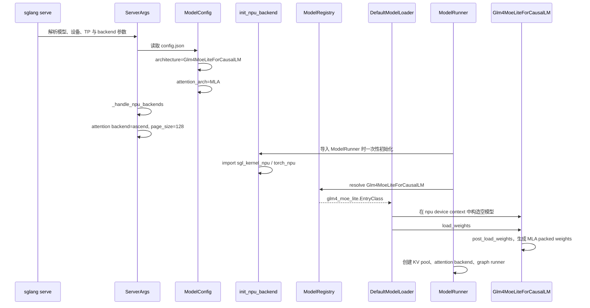
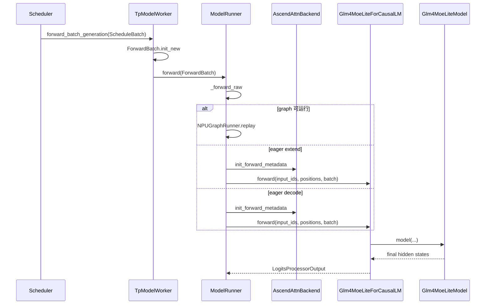
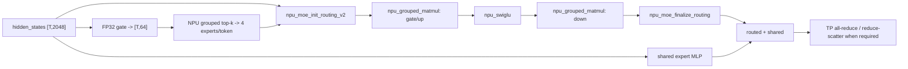

# 端到端样例：GLM-4.7-Flash 在 SGLang Ascend NPU 中的完整执行路径

本讲以一个真实模型为主线，从启动命令一路追踪到输出 token，完整串联 attention、MoE、KV cache 等组件及其 Ascend NPU 分支。

样例模型选择 `GLM-4.7-Flash`，因为它在一条模型路径中同时覆盖：

- SGLang 原生模型注册与 Hugging Face 权重加载；
- Multi-Latent Attention（MLA）；
- 纯 prefill 的 MHA 计算和 decode 的 absorbed MLA 计算；
- Ascend paged KV cache；
- dense MLP、稀疏 MoE 和 shared expert；
- TP/HCCL、NPU Graph、prefix cache；
- 可选的 DeepEP/FuseEP；
- 模型内置 NextN 层和 EAGLE speculative decoding。

## 1. 阅读范围与基线场景

### 1.1 为什么要先固定一条基线

eager、graph、普通 MoE、DeepEP、FuseEP 和 speculative 中存在互斥分支，一条请求不会同时经过所有路径。因此先固定一条可复现的基线调用链，再分别分析其他运行配置。

基线约定：

| 项目 | 取值 |
|---|---|
| 模型 | `GLM-4.7-Flash` 原始 BF16 checkpoint |
| 模型路径 | `/home/{myspace}/models/GLM-4.7-Flash` |
| 设备 | Ascend NPU |
| 并行 | 单机 TP=4，PP=1，DP=1，EP 未单独启用 |
| 请求 | 文本在线请求，单请求，第一次请求无 prefix cache 命中 |
| 执行 | 先关闭 NPU Graph，观察 eager 调用链 |
| speculative | 基线关闭，后文单独启用 NextN/EAGLE |
| 量化 | 无，权重和激活以 BF16 为主 |
| attention backend | `ascend` |
| page size | NPU 默认 128 |

用于源码跟踪的启动命令可以写成：

```bash
sglang serve \
  --model-path /home/{myspace}/models/GLM-4.7-Flash \
  --device npu \
  --tp-size 4 \
  --attention-backend ascend \
  --sampling-backend ascend \
  --disable-cuda-graph \
  --tool-call-parser glm47 \
  --reasoning-parser glm45 \
  --served-model-name glm-4.7-flash \
  --host 0.0.0.0 \
  --port 8000
```

这里的 `--disable-cuda-graph` 名称保留了 SGLang 的跨平台历史命名，在 NPU 上表示先不进入 `NPUGraphRunner` replay。完成 eager 跟踪后，移除此参数即可继续观察 NPU Graph 分支。

### 1.2 版本与资料来源

模型和 SGLang 都在快速演进，实际阅读前先记录：

```text
SGLang commit:
sgl-kernel-npu commit:
GLM-4.7-Flash model revision:
torch / torch_npu / CANN version:
NPU 型号与卡数:
启动参数:
```

本讲使用的外部资料：

- [GLM-4.7-Flash 官方模型卡](https://huggingface.co/zai-org/GLM-4.7-Flash)
- [GLM-4.7-Flash 官方 config.json](https://huggingface.co/zai-org/GLM-4.7-Flash/blob/main/config.json)
- [ModelScope 模型入口](https://modelscope.cn/models/ZhipuAI/GLM-4.7-Flash)
- [SGLang 的 GLM-4.7-Flash 实现](https://github.com/sgl-project/sglang/blob/main/python/sglang/srt/models/glm4_moe_lite.py)
- [sgl-kernel-npu](https://github.com/sgl-project/sgl-kernel-npu)

官方模型卡将它描述为 30B-A3B MoE 模型。教程中的结构参数以模型 `config.json` 和当前 SGLang 源码为准。

## 2. 先看清模型本身

### 2.1 配置指纹

`config.json` 中最关键的字段如下：

| 字段 | 值 | 对执行路径的影响 |
|---|---:|---|
| `architectures` | `Glm4MoeLiteForCausalLM` | 决定 SGLang 原生模型类 |
| `model_type` | `glm4_moe_lite` | Transformers 配置类型 |
| `dtype` | `bfloat16` | 基线权重和激活 dtype |
| `vocab_size` | 154880 | embedding 和 LM head 规模 |
| `hidden_size` | 2048 | 主干 hidden state 宽度 |
| `num_hidden_layers` | 47 | decoder layer 数量 |
| `first_k_dense_replace` | 1 | 第 0 层 dense，第 1～46 层 MoE |
| `intermediate_size` | 10240 | dense MLP 中间维度 |
| `n_routed_experts` | 64 | 每个 MoE 层的 routed experts |
| `n_shared_experts` | 1 | 每个 MoE 层的 shared expert |
| `num_experts_per_tok` | 4 | 每个 token 选择 4 个 routed experts |
| `moe_intermediate_size` | 1536 | 单个 expert 的中间维度 |
| `topk_method` | `noaux_tc` | grouped top-k 路由语义 |
| `routed_scaling_factor` | 1.8 | routed expert 输出缩放 |
| `num_attention_heads` | 20 | Q heads 总数 |
| `q_lora_rank` | 768 | Q 的低秩 latent 宽度 |
| `kv_lora_rank` | 512 | 压缩 KV latent 宽度 |
| `qk_nope_head_dim` | 192 | 非 RoPE Q/K head 维度 |
| `qk_rope_head_dim` | 64 | RoPE Q/K head 维度 |
| `v_head_dim` | 256 | V head 维度 |
| `max_position_embeddings` | 202752 | 配置中的最大位置长度 |
| `num_nextn_predict_layers` | 1 | checkpoint 内含一个 NextN/MTP 层 |

由这些字段可以立即得到：

```text
qk_head_dim = qk_nope_head_dim + qk_rope_head_dim
              = 192 + 64
              = 256

TP=4 时：
num_local_heads = 20 / 4 = 5
```

### 2.2 先统一维度符号

后文所有 shape 都遵循下面这套符号。若不先区分“全局逻辑维度”“当前 TP rank 的本地维度”和“NPU 算子实际保存的物理布局”，很容易把同一份权重误认为三份不同权重。

| 符号 | 本讲取值 | 含义 |
|---|---:|---|
| `T` | 运行时变化 | 当前 TP rank 在一次 prefill/extend 中处理的 token 总数；单请求时等于本轮 prompt token 数 |
| `B` | 运行时变化 | decode batch 中的请求数；普通 decode 每个请求本轮只有 1 个 query token |
| `D` | 2048 | 模型主干 hidden size |
| `V` | 154880 | 全局词表大小 |
| `L` | 47 | target decoder layer 数 |
| `H` | 20 | 全局 attention head 数 |
| `TP` | 4 | tensor parallel rank 数 |
| `Htp` | 5 | 当前 rank 的 local heads，`H / TP = 20 / 4` |
| `Rq` | 768 | Q LoRA/latent rank |
| `Rkv` | 512 | KV latent rank，也是压缩 KV cache 的主体宽度 |
| `Dnope` | 192 | 每个 head 不使用 RoPE 的 Q/K 维度 |
| `Drope` | 64 | 每个 head 使用 RoPE 的 Q/K 维度 |
| `Dh` | 256 | 完整 Q/K head 维度，`Dnope + Drope = 192 + 64`；也等于 V head 维度 |
| `Idense` | 10240 | 第 0 层 dense MLP 的全局中间维度 |
| `Iexpert` | 1536 | 单个 routed/shared expert 的全局中间维度 |
| `E` | 64 | 每个 MoE 层的 routed expert 数 |
| `K` | 4 | 每个 token 选中的 routed expert 数 |
| `P` | 运行时确定 | KV cache page 数，不包括额外 sentinel page |
| `S` | 运行时变化 | 单个请求当前完整序列长度 |
| `Td` | 运行时变化 | NextN draft/verify 本轮处理的 token 数 |

三个必须牢记的阅读约定：

1. PyTorch `Linear` 权重保存为 `[out_features, in_features]`。若 `X` 为 `[N, in_features]`，计算是 `Y = X @ W.T`，输出为 `[N, out_features]`。
2. “global shape”描述完整数学模型；“TP4 local shape”描述每个 rank 实际持有的分片。比如 LM head 全局是 `[154880,2048]`，TP=4 后每个 rank 是 `[38720,2048]`。
3. “NPU physical shape”是加载完成后为算子调整过的存储布局。例如 MoE 的 `w2` 逻辑形状是 `[E,D,Iexpert/TP]`，在 NPU 上转置后保存为 `[E,Iexpert/TP,D]`；数值没有改变，只是内存轴顺序变了。

本讲默认 token 维在前。于是：

```text
prefill hidden_states: [T, D] = [T, 2048]
decode  hidden_states: [B, D] = [B, 2048]
prefill local Q heads: [T, Htp, Dh] = [T, 5, 256]
decode absorbed Q:     [B, Htp, Rkv] = [B, 5, 512]
```

注意，`T` 和 `B` 不是模型配置常量。NPU Graph 中可能把它们 padding 到捕获规格，但有效 token 数仍由 metadata 指明。

### 2.3 GLM-4.7-Flash 完整架构图

下图展示模型对象树、单层 decoder 的内部结构、TP=4 的关键权重形状，以及 prefill/decode 两条不同的 MLA 执行路径。


建议按下面顺序阅读图：

1. **从最左侧看模型级数据流。** `input_ids [T]` 经过词嵌入得到 `hidden_states [T,2048]`，依次通过 47 层，最终由 LM head 产生 `[B,154880]` logits。
2. **再看 decoder layer 放大图。** 每层先做 attention，再做 dense MLP 或 sparse MoE，两处都通过 residual 保持主干维度始终为 `2048`。
3. **沿蓝色 prefill 路径阅读。** 当前 token 的压缩 latent 被写入 KV cache，同时临时展开成 `[T,5,256]` 的 K/V，交给 fused attention。
4. **沿紫色 decode 路径阅读。** 历史 KV 不再展开为完整 K/V；Q 被吸收到 512 维 latent 空间，paged MLA 的输出最后才经 `w_vc` 恢复为 256 维 V head。
5. **最后看橙色 MoE 路径。** Router 为每个 token 从 64 个 expert 中选 4 个；routed expert 和始终执行的 shared expert 最终都回到 `[T,2048]` 后相加。

图中的每个方框回答“这一层是什么”，后文则继续回答“它为什么这样实现、真实代码怎样分支，以及每一步张量怎样变化”。

### 2.4 为什么它叫 Lite，但不是普通小型 dense 模型

`Lite` 对应的是 `Glm4MoeLiteForCausalLM` 架构分支，不代表执行路径简单。模型包含 64 个 routed experts，但每个 token 只激活 4 个，再叠加一个 shared expert，因此活跃参数量远小于总参数量。

它也不是普通 GQA 模型。虽然配置中 `num_attention_heads` 与 `num_key_value_heads` 都是 20，SGLang 仍依据架构名和 `kv_lora_rank` 将其识别为 MLA，并使用压缩 latent KV cache。

## 3. 本模型涉及的源码地图

| 阶段 | 关键文件 | 关键对象 |
|---|---|---|
| 配置识别 | `configs/model_config.py` | `ModelConfig`、`AttentionArch.MLA` |
| 模型注册 | `models/registry.py` | `ModelRegistry`、`EntryClass` |
| 模型选择 | `model_loader/utils.py` | `get_model_architecture()` |
| 模型加载 | `model_loader/loader.py` | `DefaultModelLoader` |
| 模型实现 | `models/glm4_moe_lite.py` | `Glm4MoeLiteForCausalLM` 等 |
| NextN 实现 | `models/glm4_moe_lite_nextn.py` | `Glm4MoeLiteForCausalLMNextN` |
| MLA 通用主体 | `models/deepseek_v2.py` | `DeepseekV2AttentionMLA` |
| NPU MLA prepare/core | `hardware_backend/npu/modules/deepseek_v2_attention_mla_npu.py` | `forward_mha_*_npu`、`forward_mla_*_npu` |
| Attention backend | `hardware_backend/npu/attention/ascend_backend.py` | `AscendAttnBackend` |
| Attention 注册 | `layers/attention/attention_registry.py` | `ATTENTION_BACKENDS["ascend"]` |
| Radix 调用层 | `layers/radix_attention.py` | `RadixAttention` |
| NPU KV pool | `hardware_backend/npu/memory_pool_npu.py` | `NPUMLATokenToKVPool` |
| NPU allocator | `hardware_backend/npu/allocator_npu.py` | `NPUPagedTokenToKVPoolAllocator` |
| MoE top-k | `hardware_backend/npu/moe/topk.py` | `fused_topk_npu()` |
| MoE 计算 | `layers/quantization/unquant.py` | `UnquantizedFusedMoEMethod.forward_npu()` |
| NPU Graph | `hardware_backend/npu/graph_runner/npu_graph_runner.py` | `NPUGraphRunner` |
| 请求入口 | `entrypoints/openai/serving_chat.py` | `OpenAIServingChat` |
| Tokenize | `managers/tokenizer_manager.py` | `TokenizerManager` |
| 调度 | `managers/scheduler.py` | `Scheduler`、`ScheduleBatch` |
| Worker | `managers/tp_worker.py` | `TpModelWorker` |
| 模型执行 | `model_executor/model_runner.py` | `ModelRunner` |
| 采样 | `layers/sampler.py` | `Sampler` |

## 4. 服务启动：模型怎样变成运行时对象

### 4.1 总初始化链



### 4.2 NPU 默认参数

`ServerArgs._handle_npu_backends()` 在 `device == "npu"` 时调用 `hardware_backend/npu/utils.py::set_default_server_args()`。当前源码会设置：

```text
attention_backend         = "ascend"
prefill_attention_backend = "ascend"
decode_attention_backend  = "ascend"
page_size                 = 128（用户未显式设置时）
disable_custom_all_reduce = True
```

它还会根据设备内存和 TP size 设置 chunked prefill、graph batch size，并在启用 HiCache 时选择 `kernel_ascend`。

注意：`sampling_backend` 是独立配置。为了让样例明确进入 Ascend sampler，启动命令显式使用了 `--sampling-backend ascend`。

### 4.3 `init_npu_backend()` 做了什么

`ModelRunner` 模块在检测到 NPU 时调用 `init_npu_backend()`：

```text
init_npu_backend
  -> import sgl_kernel_npu
  -> import torch_npu
  -> import torch_npu.contrib.transfer_to_npu
  -> allow_internal_format = True
  -> set_compile_mode(jit_compile=False)
```

这里有两个重要结论：

1. 导入 `sgl_kernel_npu` 可能完成 custom op 注册；
2. `transfer_to_npu` 会兼容一部分通用代码中的 `torch.cuda.*` 调用，因此在 `glm4_moe_lite.py` 中看到 `torch.cuda.Stream()` 不应立刻判定它走了 CUDA。

### 4.4 架构名怎样映射到模型类

模型注册路径为：

```text
config.json
  architectures = ["Glm4MoeLiteForCausalLM"]
    -> ModelRegistry 扫描 sglang.srt.models
    -> 导入 glm4_moe_lite.py
    -> 读取 EntryClass = [Glm4MoeLiteForCausalLM]
    -> get_model_architecture()
    -> 返回 Glm4MoeLiteForCausalLM class
```

这是 SGLang 原生实现，不是 Transformers backend fallback。

### 4.5 为什么会选择 MLA

`ModelConfig` 对 `Glm4MoeLiteForCausalLM` 有显式判断：

```text
architecture 命中 Glm4MoeLiteForCausalLM
  -> head_dim = 256
  -> attention_arch = AttentionArch.MLA
  -> kv_lora_rank = 512
  -> qk_nope_head_dim = 192
  -> qk_rope_head_dim = 64
  -> v_head_dim = 256
```

这个判断影响后续三件事：

- `ModelRunner.use_mla_backend = True`；
- 创建 `NPUMLATokenToKVPool`；
- `AscendAttnBackend.use_mla = True`。

### 4.6 模型对象初始化

`DefaultModelLoader.load_model()` 的核心步骤：

```text
get_model_architecture
  -> _initialize_model
  -> Glm4MoeLiteForCausalLM(config, quant_config=None)
  -> load_weights
  -> quant_method.process_weights_after_loading
  -> model.eval()
```

`Glm4MoeLiteForCausalLM.__init__()` 创建：

```text
self.model = Glm4MoeLiteModel(...)
self.lm_head = ParallelLMHead(...)
self.logits_processor = LogitsProcessor(config)
```

`Glm4MoeLiteModel` 再创建 embedding、47 个 decoder layers 和最终 RMSNorm。

### 4.7 47 层是怎样组成的

模型构造函数把 `config.moe_layer_freq` 固定为 1。每层通过 `_is_layer_sparse()` 判断：

```text
layer_id >= first_k_dense_replace
and layer_id % moe_layer_freq == 0
```

对于当前配置：

```text
layer 0     -> Glm4MoeLiteMLP
layer 1-46  -> Glm4MoeLiteSparseMoeBlock
```

每层都包含相同的 `DeepseekV2AttentionMLA`，区别只在 MLP/MoE 部分。

### 4.8 权重加载和 MLA 权重重组

这一节先给一句结论：**外部权重文件中的参数名字和数学结构偏向“便于训练和发布”，运行时参数偏向“少发起算子、适合 TP 分片、适合 NPU kernel 读取”。`load_weights(weights)` 负责完成二者之间的结构化搬运。**

这里的“融合”“合入”都不是训练，也不是把数值相加。它们通常是：

- 把两个矩阵沿某个轴连续存进一个更大的 `Parameter`；
- forward 时用一次大矩阵乘法同时算出两组结果；
- 随后按已知边界把结果切回两组，数学意义与两个独立 `Linear` 完全相同。

#### 4.8.1 先区分模型构造和权重加载

服务启动时经历两个不同阶段：

```text
阶段 A：__init__ 构造空的运行时参数容器
  例如创建 gate_up_proj.weight，TP4 local shape = [5120, 2048]

阶段 B：load_weights(weights) 遍历输入的权重迭代器
  先把 gate_proj 的 local shard 写入前 2560 行
  再把 up_proj   的 local shard 写入后 2560 行
```

阶段 A 决定“运行时对象长什么样”，阶段 B 才决定“这个对象里装哪些数值”。因此在调试加载错误时应同时查看：

| 要检查的对象 | 检查内容 |
|---|---|
| `weights` 中的 `(name, loaded_weight)` | 输入权重名、global shape、dtype |
| SGLang parameter | 运行时名字、local shape、所属 TP rank |
| parameter 的 `weight_loader` | 取 `loaded_weight` 的哪一片、写到目标参数的哪一段 |
| load 后 parameter | shape、dtype、是否有 NaN/Inf、首尾小块数值 |

#### 4.8.2 `gate_proj` 和 `up_proj` 的“合入”到底是什么

第 0 层 dense MLP 的数学表达式是：

```text
gate = X @ W_gate.T
up   = X @ W_up.T
mid  = SiLU(gate) * up
out  = mid @ W_down.T
```

其中全局 shape 为：

| 变量 | 全局 shape | 说明 |
|---|---:|---|
| `X` | `[T,2048]` | attention 后、MLP 前的 hidden states |
| `W_gate` | `[10240,2048]` | `gate_proj.weight` |
| `W_up` | `[10240,2048]` | `up_proj.weight` |
| `gate`、`up` | `[T,10240]` | 两个投影结果 |
| `mid` | `[T,10240]` | 逐元素 SwiGLU 结果 |
| `W_down` | `[2048,10240]` | `down_proj.weight` |
| `out` | `[T,2048]` | 回到模型 hidden size |

`gate_proj` 和 `up_proj` 都是 column-parallel。TP=4 时沿输出行切分，每个 rank 分别持有：

```text
W_gate_local: [10240 / 4, 2048] = [2560,2048]
W_up_local:   [10240 / 4, 2048] = [2560,2048]
```

“合入 `gate_up_proj`”具体指沿第 0 维拼接：

```python
W_gate_up_local = torch.cat(
    [W_gate_local, W_up_local],
    dim=0,
)
# [2560 + 2560, 2048] = [5120,2048]
```

不是下面这些操作：

```text
不是 W_gate + W_up         # 这样会丢失两条分支
不是把两个 decoder layer 合成一层
不是修改或回写原始权重文件
不是把中间维度从 10240 改成 20480
```

用一个省略 token 维度的小例子看得更直观。假设输入宽度为 3，gate/up 各有 2 个输出：

```text
W_gate = [[g00,g01,g02],       W_up = [[u00,u01,u02],
          [g10,g11,g12]]               [u10,u11,u12]]

W_gate_up = cat(dim=0)
          = [[g00,g01,g02],
             [g10,g11,g12],
             [u00,u01,u02],
             [u10,u11,u12]]
```

对输入 `x [1,3]` 做一次 `x @ W_gate_up.T`，输出依次是：

```text
[gate_0, gate_1, up_0, up_1]
```

运行时只需按中点切开，就恢复成原来的 gate 和 up。真实模型在 TP rank 上执行：

```text
X [T,2048]
  -> F.linear(weight=gate_up_proj.weight [5120,2048])
  -> gate_up [T,5120]
  -> chunk(2, dim=-1)
     gate_local [T,2560]
     up_local   [T,2560]
  -> SiLU(gate_local) * up_local
  -> mid_local [T,2560]
```

这一融合有三个直接收益：

1. 两次 GEMM 变成一次更大的 GEMM，减少一次 kernel launch；
2. 输入 `X [T,2048]` 只需进入一次投影算子，改善读带宽复用；
3. 输出布局正好是 `[gate | up]`，`SiluAndMul`/`npu_swiglu` 可以按连续两半读取。

融合之后，**从数学上看仍然是两条投影分支**；从 Python 对象上看，则是一层：

```text
MergedColumnParallelLinear(
  in_features=2048,
  output_sizes=[10240,10240]
)

global logical weight: [20480,2048]
TP4 local parameter:   [5120,2048]
local forward output:  [T,5120]
```

`down_proj` 是 row-parallel：它沿输入列持有 `W_down_local [2048,2560]`。每个 rank 先产生一个 `[T,2048]` 的 partial output，再通过 TP all-reduce 求和，得到完整 `[T,2048]`。这里之所以需要“求和”，是因为矩阵乘法的输入维 `10240` 被拆到了 4 个 rank；这与 gate/up 的“拼接”是两个完全不同的概念。

#### 4.8.3 `weights` 中的名字怎样落入融合参数

源码中的函数签名可以简化为：

```python
def load_weights(
    self,
    weights: Iterable[Tuple[str, torch.Tensor]],
    ...,
):
    params_dict = dict(self.named_parameters())
    for name, loaded_weight in weights:
        ...
```

这里需要区分五个概念：

| 名称 | 源码中的形态 | 含义 |
|---|---|---|
| 权重文件/checkpoint | `safetensors`、PyTorch bin 等 | 磁盘或远端存储中的权重来源，不是该函数内的变量 |
| `weights` | `Iterable[Tuple[str, Tensor]]` | loader 交给模型的权重迭代器 |
| `name` | `str` | 当前输入权重的名字，通常来自权重文件中的 tensor key |
| `loaded_weight` | `torch.Tensor` | 当前已经读取出来、等待装入模型的源 tensor |
| `params_dict` | `dict(self.named_parameters())` | 当前 SGLang 模型中可接收权重的运行时参数表 |

因此，“checkpoint”只能说明 `weights` 的上游来源；在分析 `load_weights()` 函数内部时，应使用源码变量名 `weights`、`name` 和 `loaded_weight`。

当迭代器给出：

```text
name = ...mlp.gate_proj.weight, loaded_weight.shape = [10240,2048]
name = ...mlp.up_proj.weight,   loaded_weight.shape = [10240,2048]
```

`stacked_params_mapping` 中与这两个名字有关的映射为：

```text
(param_name="gate_up_proj", weight_name="gate_proj", shard_id=0)
(param_name="gate_up_proj", weight_name="up_proj",   shard_id=1)
```

循环通过字符串替换，把两个输入 `name` 都转换为同一个运行时参数名：

```text
...mlp.gate_up_proj.weight [5120,2048]  # 当前 TP rank
```

然后从 `params_dict` 中取出这个目标 parameter，并把不同的 `shard_id` 交给它绑定的 `weight_loader`：

```text
gate_proj -> shard_id 0 -> 写入 gate_up_proj 的前半段
up_proj   -> shard_id 1 -> 写入 gate_up_proj 的后半段
```

每次加载还会先从 global `loaded_weight` 中取当前 TP rank 对应的 2560 行。以 rank 2 为例，概念上取全局输出行 `[5120:7680]`；然后分别写入 local packed parameter 的 `[0:2560]` 和 `[2560:5120]`。实际 TP 切片和目标区间写入由 parameter 绑定的 `weight_loader` 完成，不应在模型代码外手工切权重。

#### 4.8.4 Q latent 和 KV latent 为什么也要融合

attention 的两条 A projection 都读取相同的归一化 hidden states `X [T,2048]`：

```text
q_a_proj.weight:            [Rq, D]         = [768,2048]
kv_a_proj_with_mqa.weight:  [Rkv+Drope, D]  = [576,2048]
```

因此加载时沿输出行合入：

```text
fused_qkv_a_proj_with_mqa.weight
  = cat([q_a_proj.weight, kv_a_proj_with_mqa.weight], dim=0)
  = [768 + 576, 2048]
  = [1344,2048]
```

这组 projection 不按 Q head 做 TP 切分，当前基线中每个 TP rank 都需要得到本 rank attention 所需的 latent 输入，因此运行时每个 rank 的该参数仍为 `[1344,2048]`。一次投影后：

```text
X [T,2048]
  -> fused_qkv_a_proj_with_mqa
  -> qkv_a [T,1344]
  -> split([768,576], dim=-1)
     q_a       [T,768]
     kv_a_mqa  [T,576]
  -> split kv_a_mqa
     kv_latent [T,512]
     k_rope    [T,64]
```

它与 MLP gate/up 融合是同一种工程手法：相同输入、独立输出、沿输出维拼接、一次 GEMM、随后切开。

Q 的 B projection 才沿 head 切分：

```text
q_b_proj global weight:
  [H * Dh, Rq] = [20 * 256,768] = [5120,768]

q_b_proj TP4 local weight:
  [Htp * Dh, Rq] = [5 * 256,768] = [1280,768]

q_a [T,768] -> q_local [T,1280] -> view [T,5,256]
```

#### 4.8.5 expert 权重怎样打包成 `w13_weight` 和 `w2_weight`

`weights` 中每个 routed expert 仍对应三块独立权重：

```text
expert[e].gate_proj.weight: [1536,2048]
expert[e].up_proj.weight:   [1536,2048]
expert[e].down_proj.weight: [2048,1536]
```

其中 `e` 的范围是 `0..63`。普通 TP=4、未启用独立 EP 时，每个 rank 保留 64 个 expert，但每个 expert 的中间维被切成 `1536 / 4 = 384`。加载器将 64 个 expert 堆叠，并把 gate/up 打包为 `w13`：

| 阶段 | `w13` shape | `w2` shape | 轴含义 |
|---|---:|---:|---|
| 数学上的 local expert | `[64,2,384,2048]` | `[64,2048,384]` | expert、gate/up、local intermediate、hidden |
| 合并 gate/up 轴后 | `[64,768,2048]` | `[64,2048,384]` | 每个 expert 连续保存 384 gate + 384 up |
| NPU post-load 物理布局 | `[64,2048,768]` | `[64,384,2048]` | 为 grouped matmul 交换最后两个轴 |

最后一行是 `UnquantizedFusedMoEMethod.process_weights_after_loading()` 转置并转为 NPU 友好格式后的实际参数形状。这个转置只改变存储布局，算子仍然表达：

```text
输入 routed token:      [R,2048]
第一组 grouped matmul:  [R,768]
切为 gate/up:           [R,384] + [R,384]
SwiGLU:                 [R,384]
第二组 grouped matmul:  [R,2048]
```

`R` 是路由展开后的 token-expert 对数量。若本轮 `T` 个 token 每个都选 4 个 expert，则理论上 `R = T * 4`；具体 NPU op 可能因 capacity、padding 或分布式 dispatch 使用更大的物理 buffer，但有效路由项由 expert counts/indices 描述。

shared expert 不参与 routed expert 的 64 路打包。Ascend 基线中它单独保持一个普通 MLP：

```text
shared gate_up TP4 local weight: [2 * (1536/4),2048] = [768,2048]
shared mid local:                 [T,384]
shared down TP4 local weight:    [2048,384]
shared output after TP reduce:   [T,2048]
```

#### 4.8.6 `kv_b_proj` 怎样派生出 `w_kc` 和 `w_vc`

`kv_b_proj` 的工作是把 512 维 KV latent 展开为每个 local head 的 K-noPE 和 V。其 global 输出宽度为：

```text
H * (Dnope + Dh)
= 20 * (192 + 256)
= 8960
```

TP=4 时，每个 rank 的权重和输出为：

```text
kv_b_proj.weight local: [Htp * (Dnope + Dh), Rkv]
                        = [5 * 448,512]
                        = [2240,512]

kv_latent [T,512]
  -> kv_b_local [T,2240]
  -> view [T,5,448]
  -> split
     k_nope [T,5,192]
     v       [T,5,256]
```

上面是 prefill 需要的“展开路径”。decode 若每个历史 token 都这样展开，KV cache 和读带宽会大幅增加，所以 `post_load_weights()` 从同一份 `kv_b_proj.weight` 派生两个矩阵，使用 MLA 的矩阵结合律改变计算顺序。

先把 local 权重 reshape：

```text
kv_b_proj.weight [2240,512]
  -> [Htp, Dnope + Dh, Rkv]
  -> [5,448,512]
```

再沿第二维切开：

```text
w_kc_raw: [5,192,512]
w_vc_raw: [5,256,512]
```

NPU runtime 中保留：

```text
w_kc: [5,192,512]
w_vc: [5,512,256]  # w_vc_raw 转置最后两维并 contiguous
```

它们分别做两件事：

```text
1. 把 Q-noPE 吸收到 latent K 空间
q_nope [B,5,192] x w_kc [5,192,512]
  -> q_absorbed [B,5,512]

2. attention 完成后恢复 V head
attn_latent [B,5,512] x w_vc [5,512,256]
  -> attn_v [B,5,256]
```

所谓“吸收”就是利用矩阵结合律，把原本发生在每个历史 KV 上的投影改放到 query 和 attention 输出两侧。长期 cache 因而只存 `[512 latent + 64 RoPE]`，不必存每头 `[192 K-noPE + 256 V]`。

`kv_b_proj` 本身并没有被删除：pure prefill 需要临时展开当前 K/V，prefix cache 命中时也要把缓存的 latent 恢复为 MHA K/V。`w_kc/w_vc` 是从它派生的 decode 加速副本。

Ascend 路径把 `w_vc` 做成 contiguous，是因为后续 `torch.ops.npu.batch_matmul_transpose` 期望连续的 `[Htp,Rkv,Dh] = [5,512,256]` 物理输入；若只做 `transpose()` 而不连续化，stride 与 shape 虽看似正确，算子仍可能触发额外拷贝或不支持的布局。

#### 4.8.7 本模型加载完成后的关键参数清单

| 运行时参数 | TP4 local / NPU physical shape | 对应的输入权重 | 使用位置 |
|---|---:|---|---|
| `embed_tokens.weight` | `[38720,2048]` | embedding | 输入 token embedding |
| `fused_qkv_a_proj_with_mqa.weight` | `[1344,2048]` | `q_a` + `kv_a_with_mqa` | 每层 attention latent prepare |
| `q_b_proj.weight` | `[1280,768]` | Q B projection | 产生 5 个 local Q heads |
| `kv_b_proj.weight` | `[2240,512]` | KV B projection | prefill/prefix 展开 K/V |
| `w_kc` | `[5,192,512]` | 从 `kv_b_proj` 派生 | decode 吸收 Q-noPE |
| `w_vc` | `[5,512,256]` | 从 `kv_b_proj` 派生 | decode 恢复 V heads |
| `o_proj.weight` | `[2048,1280]` | attention output projection | local heads 回到 hidden |
| dense `gate_up_proj.weight` | `[5120,2048]` | gate + up | layer 0 MLP |
| dense `down_proj.weight` | `[2048,2560]` | down | layer 0 MLP |
| MoE `gate.weight` | `[64,2048]` | router | 每 token 的 64 路 logits |
| MoE `w13_weight` | `[64,2048,768]` | 64 个 expert 的 gate + up | NPU grouped matmul |
| MoE `w2_weight` | `[64,384,2048]` | 64 个 expert 的 down | NPU grouped matmul |
| shared `gate_up_proj.weight` | `[768,2048]` | shared gate + up | 每个 MoE 层的 shared expert |
| shared `down_proj.weight` | `[2048,384]` | shared down | shared expert 输出 |
| `lm_head.weight` | `[38720,2048]` | output embedding/head | local vocab logits |

普通 target model 遍历 `weights` 时会跳过第 47 层的 NextN 权重；启用 speculative decoding 后，它们由 `Glm4MoeLiteForCausalLMNextN` 作为 draft model 单独加载。这样 target 的 47 层和 NextN 的 1 层不会落入错误的对象。

## 5. NPU runtime 组件初始化

### 5.1 Attention backend

```text
ModelRunner.init_attention_backend
  -> _get_attention_backend
  -> ATTENTION_BACKENDS["ascend"]
  -> create_ascend_backend(runner)
  -> AscendAttnBackend(runner)
```

`AscendAttnBackend` 持有：

- `req_to_token_pool` 和 `token_to_kv_pool`；
- page size、模型 dtype 和最大上下文；
- MLA 维度；
- mask builder；
- graph metadata；
- 当前 forward 的 `ForwardMetadata`。

这一步不是在执行 attention，而是在为“这一轮所有层都要重复使用的索引信息”建立统一入口。47 层拥有不同的权重和不同层号，但同一轮请求的 `seq_lens`、`block_tables`、有效 token 数相同；backend 把这些 metadata 准备一次，各层只传入本层 Q/K/V 和 `layer_id`。

基线场景下最重要的 metadata shape 是：

| 变量 | Prefill | Decode | 作用 |
|---|---:|---:|---|
| `seq_lens` | `[B]` | `[B]` | 每个请求包含历史和本轮 token 的完整长度 |
| `req_pool_indices` | `[B]` | `[B]` | 每个请求在 request-to-token pool 中的行号 |
| `out_cache_loc` | `[T]` | `[B]` | 本轮每个新 token 写入 KV pool 的逻辑 slot |
| `positions` | `[T]` | `[B]` | 每个新 token 的 RoPE 位置 |
| `block_tables` | `[B,max_blocks]` | `[B,max_blocks]` | 每个请求的逻辑序列怎样映射到物理 KV pages |

单请求 prefill 时 `B=1`，但 `T` 可以是几千；decode 时 `T` 的角色由 `B` 承担，因为每个请求本轮通常只有一个 token。

### 5.2 MLA KV pool

对于本模型，`ModelRunner` 创建 `NPUMLATokenToKVPool`。其主要 buffer 形状是：

```text
k_buffer:
[layer_num, num_pages + 1, page_size, 1, kv_lora_rank]
[47,        P + 1,       128,       1, 512]

v_buffer:
[layer_num, num_pages + 1, page_size, 1, qk_rope_head_dim]
[47,        P + 1,       128,       1, 64]
```

这里的 `k_buffer` 存压缩后的 KV latent，`v_buffer` 实际存 RoPE key 部分。名称继承自通用 KV pool，不能按普通 MHA 的 K/V 语义理解。

每个轴的含义是：

```text
47      : decoder layer id，每层有独立 KV cache
P + 1   : 物理 page id；额外 1 页用于 padding/sentinel
128     : page 内 token offset
1       : MLA 的共享 KV head 数
512/64  : compressed latent / RoPE key 宽度
```

因此一个历史 token 在某一层只长期保存 `512 + 64 = 576` 个元素，而不是保存 20 组完整 K/V。以 BF16 粗略计算，不计对齐与元数据，每层每 token 的缓存主体为 `576 * 2 = 1152` 字节。

写缓存时调用：

```text
NPUMLATokenToKVPool.set_kv_buffer
  -> torch_npu.npu_scatter_nd_update_(latent cache)
  -> torch_npu.npu_scatter_nd_update_(k_rope cache)
```

这里“scatter update”做的是：根据 `out_cache_loc [T]` 或 `[B]` 把每个 token 的 `[1,512]` latent 和 `[1,64]` RoPE key 写到离散 page 位置。它不是按请求顺序简单 append，所以调试 cache 时必须同时打印 token 到 slot 的映射，不能只看 buffer 前几行。

### 5.3 Paged allocator

Ascend attention 使用 `NPUPagedTokenToKVPoolAllocator`。Scheduler 为请求分配逻辑 token 位置，allocator 将它们映射成 `out_cache_loc`，attention backend 再根据 `req_to_token` 构造 page/block table。

假设 page size 为 128、某请求当前长度 `S=300`，它至少占 `ceil(300/128)=3` 个 page。`block_tables[b,0:3]` 保存这三个物理 page id；token 位置 260 落在请求内第 2 个 page（从 0 计数）的 offset 4。paged attention 由 block table 恢复地址，不要求这三个物理 page 在内存中连续。

### 5.4 Graph runner

基线关闭 graph，因此 `ModelRunner._forward_raw()` 会进入 eager `forward_extend()` 或 `forward_decode()`。启用 graph 时则由 `NPUGraphRunner` 使用：

```text
torch.npu.NPUGraph
torch.npu.graph(...)
torch.compile(..., backend="npugraph_ex")  # 启用 compile 时
```

第 12 节会单独解释 replay 路径。

## 6. 一个 OpenAI 请求怎样进入 Scheduler

以请求为例：

```bash
curl http://127.0.0.1:8000/v1/chat/completions \
  -H 'Content-Type: application/json' \
  -d '{
    "model": "glm-4.7-flash",
    "messages": [{"role": "user", "content": "用一句话解释 paged KV cache。"}],
    "temperature": 0,
    "max_tokens": 32
  }'
```

### 6.1 API 与 chat template

```text
/v1/chat/completions
  -> openai_v1_chat_completions
  -> OpenAIServingChat.handle_request
  -> _convert_to_internal_request
  -> _process_messages
  -> tokenizer / chat template
  -> GenerateReqInput
```

`_convert_to_internal_request()` 同时构造 sampling parameters、stop 条件、reasoning/tool 配置。对于纯文本 GLM-4.7-Flash，处理结果通常直接包含 `input_ids`。

### 6.2 TokenizerManager

```text
TokenizerManager.generate_request
  -> normalize_batch_and_arguments
  -> _tokenize_one_request
  -> _send_one_request
  -> 等待 Scheduler 输出
```

如果 OpenAI 层已经提供 token ids，这里仍负责请求状态、长度校验、通信和响应等待。

### 6.3 Scheduler

Scheduler 收到 `TokenizedGenerateReqInput` 后执行：

```text
Scheduler.handle_generate_request
  -> Req(...)
  -> 等待队列
  -> radix cache 前缀匹配
  -> KV slot 分配
  -> ScheduleBatch
```

主循环为：

```text
event_loop_normal / event_loop_overlap
  -> recv_requests
  -> process_input_requests
  -> get_next_batch_to_run
  -> run_batch
  -> process_batch_result
```

### 6.4 ScheduleBatch 到 ForwardBatch

`Scheduler.run_batch()` 调用 `TpModelWorker.forward_batch_generation()`，后者首先执行：

```text
ForwardBatch.init_new(schedule_batch, model_runner)
```

本模型最关注的字段：

| 字段 | Prefill / Decode shape | 含义 | 被谁使用 |
|---|---:|---|---|
| `input_ids` | `[T]` / `[B]` | 当前要计算的 token id | embedding、LM forward |
| `positions` | `[T]` / `[B]` | RoPE 位置 | MLA prepare |
| `forward_mode` | 控制枚举 | `extend`/`decode`/`verify` 等 | ModelRunner 和 attention 双重分支 |
| `req_pool_indices` | `[B]` / `[B]` | 请求在 request pool 的行号 | block table 构造 |
| `seq_lens` | `[B]` / `[B]` | 当前完整序列长度 | attention metadata |
| `extend_seq_lens` | `[B]` / 通常不用 | 每个请求本轮新增 token 数，元素和为 `T` | prefill attention |
| `extend_prefix_lens` | `[B]` / 通常不用 | 每个请求已命中前缀长度 | prefix cache 分支 |
| `out_cache_loc` | `[T]` / `[B]` | 本轮 token 的 KV 写入位置 | NPU KV pool |
| `sampling_info` | 控制对象 | temperature/top-k/top-p/grammar | Sampler |
| `spec_info` | 控制对象或 `None` | speculative metadata | NextN/EAGLE 分支 |

表中 `forward_mode`、`sampling_info`、`spec_info` 是控制对象，不是固定二维 tensor，因此不强行写 tensor shape。`ForwardBatch` 的作用是把 Scheduler 侧面向请求的对象，转换成 ModelRunner 可以直接送上 NPU 的批量 tensor 和控制信息。

## 7. ModelRunner 怎样进入 GLM 模型



基线首轮是 extend/prefill：

```text
ModelRunner._forward_raw
  -> forward_extend
  -> AscendAttnBackend.init_forward_metadata
  -> self.model.forward
```

后续每生成一个 token，通常进入：

```text
ModelRunner._forward_raw
  -> forward_decode
  -> AscendAttnBackend.init_forward_metadata
  -> self.model.forward
```

## 8. 顶层模型 forward

`Glm4MoeLiteForCausalLM.forward()`：

```text
get_attn_tp_context().maybe_input_scattered
  -> Glm4MoeLiteModel.forward
  -> ParallelLMHead + LogitsProcessor
```

这一层 wrapper 的职责不是重复做 transformer 计算，而是处理三件模型级工作：把输入交给 backbone、在最后一个 PP rank 上把 hidden states 投影成词表 logits、在 speculative 模式下携带额外 hidden states。

`Glm4MoeLiteModel.forward()` 的执行顺序：

1. 第一 PP rank 执行 `VocabParallelEmbedding(input_ids)`，prefill 从 `input_ids [T]` 得到 `[T,2048]`，decode 从 `[B]` 得到 `[B,2048]`；
2. 创建 `BumpAllocator`，为各层临时 zero buffer 提供复用空间；
3. 循环执行本 PP rank 持有的 decoder layers；
4. 如果启用 TBO，部分 MoE layers 进入 `model_forward_maybe_tbo()`；
5. 最后一 PP rank 执行最终 RMSNorm；
6. 返回 hidden states 或 speculative 所需的 auxiliary hidden states。

基线 PP=1，所以 embedding、47 层和最终 norm 都在同一组 TP ranks 上完成。

TP=4 时每个 rank 的 embedding 参数为 `[V/TP,D] = [38720,2048]`。一次 lookup 的输出依然是完整 `D=2048`，不是 `[T,512]`：各 rank 只对自己词表区间内的 token 产生 embedding，随后通过 TP 通信组合为 `[T,2048]`。这与按 hidden 维切分的 linear 不能混为一谈。

整个 backbone 的主干 shape 很稳定：

| 位置 | Prefill | Decode |
|---|---:|---:|
| 输入 token ids | `[T]` | `[B]` |
| embedding 后 | `[T,2048]` | `[B,2048]` |
| 任一 attention 后 | `[T,2048]` | `[B,2048]` |
| 任一 MLP/MoE 后 | `[T,2048]` | `[B,2048]` |
| final RMSNorm 后 | `[T,2048]` | `[B,2048]` |

attention 和 MLP 内部可以扩到 5120、10240 或路由到 64 个 expert，但 residual 边界始终回到 `D=2048`，这样 47 层才能首尾相接。

## 9. 单个 Decoder Layer 的执行路径

每层主路径：

```text
Glm4MoeLiteDecoderLayer.forward
  -> LayerCommunicator.prepare_attn
  -> DeepseekV2AttentionMLA.forward
  -> LayerCommunicator.prepare_mlp
  -> dense MLP 或 sparse MoE
  -> LayerCommunicator.postprocess_layer
```

把它翻成普通语言就是：

1. 先把上一层输出与 residual 按需要相加并做 attention 前 RMSNorm；
2. 计算本层 MLA attention，输出仍为 hidden size；
3. 再做 attention residual 和 MLP 前 RMSNorm；
4. 第 0 层执行 dense MLP，其余层执行 sparse MoE；
5. 根据 TP/TBO 策略完成 collective，并把 `[N,2048]` 交给下一层，其中 prefill `N=T`、decode `N=B`。

`LayerCommunicator` 负责把 RMSNorm、residual、TP scatter/gather、all-reduce/reduce-scatter 的时机统一起来。对于本模型，它还持有 `self_attn.prepare_qkv_latent`，可以提前计算并缓存 Q/KV latent；NPU prepare 函数通过 `get_attn_tp_context().fetch_qkv_latent()` 取回结果。

`prepare_qkv_latent` 的缓存不是 KV cache。它只是在当前 layer forward 内复用本轮刚算出的 `q_a [N,768]` 和 `kv_a_with_mqa [N,576]`，生命周期很短；长期跨 decode step 保存的是第 5.2 节的 paged KV pool。

### 9.1 RMSNorm

`RMSNorm` 是 `MultiPlatformOp`。NPU 分支：

```text
无 residual:
  torch_npu.npu_rms_norm

有 residual:
  torch_npu.npu_add_rms_norm
```

输出仍是 `[T, 2048]`。

更一般地写成 `[N,2048]`，其中 prefill `N=T`、decode `N=B`。RMSNorm 的 scale 参数为 `[2048]`，它按每个 token 的最后一维计算均方根，所以不会混合不同 token，也不会改变 token 数或 hidden 宽度。融合的 `npu_add_rms_norm` 只是把 residual add 与 norm 合为一个 NPU op，数学上仍是：

```text
residual_out [N,2048] = hidden [N,2048] + residual [N,2048]
normed       [N,2048] = RMSNorm(residual_out, weight [2048])
```

### 9.2 第 0 层 dense MLP

```text
Glm4MoeLiteMLP.forward
  -> MergedColumnParallelLinear gate_up_proj
  -> SiluAndMul.forward_npu
  -> torch_npu.npu_swiglu
  -> RowParallelLinear down_proj
  -> 必要时 TP collective
```

未量化 BF16 路径的 linear method 最终使用 PyTorch `F.linear`，由 PyTorch/`torch_npu` 下沉到 NPU matmul 实现。

结合第 4.8 节，TP=4 的完整 shape trace 是：

```text
mlp_input       [N,2048]
gate_up_weight  [5120,2048]
gate_up_local   [N,5120]
gate_local      [N,2560]
up_local        [N,2560]
mid_local       [N,2560]      # SiLU(gate) * up
down_weight     [2048,2560]
partial_out     [N,2048]      # 每个 TP rank 的部分和
TP all-reduce
dense_mlp_out   [N,2048]
```

这一步的功能是给每个 token 做逐 token 的非线性特征变换；它不在 token 之间做 attention，也不改变序列长度。`N` 在 prefill/decode 中分别替换为 `T`/`B`。

### 9.3 第 1～46 层 sparse MoE



#### Router

`Glm4MoeLiteGate.forward()` 强制使用 FP32：

```text
hidden_states BF16 -> FP32
F.linear(weight=[64,2048])
router_logits=[T,64]
```

gate 权重的 FP32 副本被缓存，避免每次 forward 重复 cast。

这一步是在回答“当前 token 更适合交给哪些 expert”，不是在计算 expert 输出。输入 `moe_input [N,2048]` 被投影到 64 个标量分数：

```text
router_weight [64,2048]
router_logits [N,64] FP32
```

这里 `N=T` 或 `B`。FP32 router 的目的，是避免 64 路分数非常接近时 BF16 舍入改变 top-k 次序；expert 主体仍可使用 BF16。

#### Top-k

`TopK.forward_npu()` 调用 `fused_topk_npu()`。本模型带 correction bias 且使用 grouped top-k，因此通常进入：

```text
torch.ops.npu.npu_moe_gating_top_k
```

输出：

```text
topk_weights: [T,4]
topk_ids:     [T,4]
```

更一般地为 `[N,4]`。`topk_ids[n,k]` 是第 `n` 个 token 的第 `k` 个 expert id，取值范围 `0..63`；`topk_weights[n,k]` 是对应组合权重。它们的元素位置一一对应，后续 finalize routing 正是靠这两张表把 expert 输出乘权并加回原 token。

#### Routed experts

未启用 EP A2A 时，`FusedMoE` 的未量化 method 由 `MultiPlatformOp` 分发到 `UnquantizedFusedMoEMethod.forward_npu()`：

```text
npu_moe_init_routing_v2
  -> 按 expert 重排 token
npu_grouped_matmul
  -> 计算 expert gate/up projection
npu_swiglu
npu_grouped_matmul
  -> 计算 expert down projection
npu_moe_finalize_routing
  -> 乘 top-k 权重并恢复 token 顺序
```

单个 routed expert 的逻辑结构为：

```text
2048 -> gate/up: 2 x 1536 -> SwiGLU: 1536 -> down: 2048
```

在 TP=4 的当前 rank 上，中间宽度是 `384`。若忽略 padding，`N` 个 token 每个选择 `K=4` 个 expert，会形成 `R=N*K` 个 token-expert 对。NPU 路径的 shape/语义可以按下表阅读：

| 步骤 | 主要输入 | 主要输出 | 在做什么 |
|---|---:|---:|---|
| `npu_moe_init_routing_v2` | hidden `[N,2048]`、ids `[N,4]` | routed hidden `[R,2048]`、映射索引 | 复制并按 expert 排列 token，使同一 expert 的 token 连续 |
| 第一次 grouped matmul | routed `[R,2048]`、`w13 [64,2048,768]` | packed gate/up `[R,768]` | 每段 token 使用自己的 expert 权重 |
| `npu_swiglu` | `[R,768]` | `[R,384]` | 切成 `[R,384]` gate/up 并做 `SiLU(gate)*up` |
| 第二次 grouped matmul | `[R,384]`、`w2 [64,384,2048]` | expert out `[R,2048]` | 每个路由项恢复 hidden size |
| `npu_moe_finalize_routing` | expert out、weights/映射 | routed result `[N,2048]` | 乘 top-k 权重，按原 token 聚合 4 路结果 |

这里 grouped matmul 的“group”就是 expert。它避免循环 64 次调用独立 GEMM，并允许每组 token 数不同。

#### Shared expert

当前实现的 shared-expert fusion 只在特定 CUDA 平台条件下开启。Ascend NPU 基线会关闭该融合，因此一个 shared expert 单独走 `Glm4MoeLiteMLP`，中间维度为 1536，再与 routed expert 输出相加。

shared expert 不经过 top-k，每个 token 都执行。TP4 local shape 为：

```text
moe_input [N,2048]
  -> shared gate_up [N,768]
  -> shared SwiGLU [N,384]
  -> shared down + TP reduce [N,2048]

final_moe_out [N,2048]
  = routed_result [N,2048] + shared_result [N,2048]
```

因此“每 token 激活 4 个 expert”准确说是 4 个 routed experts，外加 1 个始终执行的 shared expert。

## 10. Prefill：为什么 GLM-4.7-Flash 在 NPU 上先走 MHA_NPU

### 10.1 第一层分支：选择模型 attention forward method

`DeepseekV2AttentionMLA.dispatch_attn_forward_method()` 先读取当前 prefill/decode backend，再交给 `AttentionBackendRegistry`。

Ascend handler 的规则：

```text
普通 extend/prefill，且不是 target verify/draft extend
  -> 没有 DSA indexer
  -> AttnForwardMethod.MHA_NPU

decode、target verify、draft extend，或其他非普通 extend
  -> AttnForwardMethod.MLA_NPU
```

GLM-4.7-Flash 没有 DSA indexer，因此首轮纯 prefill 走 `MHA_NPU`。

这一步只是在选择“当前 forward 应使用哪套 attention 计算公式和 backend 准备函数”，还没有做矩阵乘法。选择依据是 `forward_mode`，而不是模型在启动时永久固定为 MHA 或 MLA。同一个 `DeepseekV2AttentionMLA` 对象在首轮可走 `MHA_NPU`，下一轮立即走 `MLA_NPU`。

### 10.2 Prefill prepare

```text
DeepseekV2AttentionMLA.forward_prepare
  -> forward_mha_prepare_npu
```

以总 token 数 `T`、TP=4 为例：

1. **一次计算两条 A projection。** 从 attn TP context 取 fused latent：

```text
normed hidden X:                 [T,2048]
fused A weight:                 [1344,2048]
fused output:                   [T,1344]
q latent:                       [T,768]
kv latent + unrotated k_rope:   [T,512 + 64] = [T,576]
```

这一步把 2048 维 hidden 压到 Q/KV latent。Q latent 和 KV latent 的语义不同，但因为输入相同，加载时把两块权重打包后可用一次 linear 同时产生。

2. **把 Q latent 展开为当前 rank 的 5 个 query heads。**

```text
q latent                    [T,768]
  -> q_a_layernorm.weight   [768]
  -> normalized q_a         [T,768]
  -> q_b_proj.weight        [1280,768]
  -> q flat                 [T,1280]
  -> view q                 [T,5,256]
  -> split
     q_nope                 [T,5,192]
     q_pe                   [T,5,64]
```

`q_nope` 不参与旋转位置编码，负责内容匹配；`q_pe` 参与 RoPE，负责位置关系。二者最后仍属于同一个 256 维 Q head。

3. **规范化 latent、应用 RoPE，并先写长期压缩 cache。**

```text
kv_a_mqa                    [T,576]
  -> split
     kv_latent              [T,512]
     k_pe                   [T,64]
  -> kv_a_layernorm.weight  [512]
  -> normalized kv_latent   [T,512]
  -> RoPE(q_pe [T,5,64], k_pe [T,1,64], positions [T])
  -> rotated q_pe           [T,5,64]
  -> rotated k_pe           [T,1,64]
  -> NPUMLATokenToKVPool.set_kv_buffer(
       kv_latent [T,1,512],
       k_pe      [T,1,64],
       out_cache_loc [T]
     )
```

`k_pe` 只有 1 个共享 KV head，计算 attention 时会按需要供 5 个 local Q heads 使用。cache 在这里先写，是因为无论 prefill 临时采用什么 K/V 形态，未来 decode 都只需要这份 512+64 的压缩表示。

4. **只为本轮 prefill 临时展开 MHA K/V。**

```text
normalized kv_latent       [T,512]
kv_b_proj.weight local     [2240,512]
  -> kv_b flat             [T,2240]
  -> view                  [T,5,448]
  -> split
     k_nope                [T,5,192]
     v                     [T,5,256]
  -> broadcast k_pe        [T,5,64]
  -> k = concat(k_nope, k_pe) [T,5,256]
  -> q = concat(q_nope, q_pe) [T,5,256]
```

“临时”意味着这些 `[T,5,256]` 的 K/V 只活到本层 prefill attention 结束，不作为历史 cache 跨 step 保存。47 层会各自重复该过程，因为每层的 projection 权重不同。

### 10.3 Prefill core

```text
forward_mha_core_npu
  -> attn_mha(q, k, v, save_kv_cache=False)
  -> RadixAttention.forward
  -> AscendAttnBackend.forward_extend
```

`save_kv_cache=False` 是因为压缩的 `kv_a + k_pe` 已经在 prepare 阶段写入 MLA KV pool，不能再把展开后的普通 MHA K/V 当作长期缓存保存。

对于无 prefix 命中的基线请求：

```text
layer.qk_head_dim == layer.v_head_dim == 256
  -> torch.ops.npu.npu_fused_infer_attention_score
  -> attention output [T,5,256]
  -> reshape [T,1280]
  -> o_proj.weight [2048,1280]
  -> [T,2048]
```

attention 算子的逻辑是每个 local head 用 Q 与可见历史 K 计算分数，再对 V 加权求和。对第 `t` 个 token，causal mask 只允许看到当前位置及之前的 token。逻辑 score 可理解为 `[5,T,T]`，但 fused NPU op 不一定把完整 score tensor 写回显存；它可以边计算边完成 softmax 和 V 累加。

最后的 `o_proj` 是 row-parallel。每个 rank 只拥有 5 个 heads，即输入宽度 `5*256=1280`，产生 `[T,2048]` partial output；TP collective 求和后才是完整 attention 输出。

这解释了一个看似矛盾的现象：模型架构是 MLA，但首轮 prefill 为了吞吐会临时展开 K/V，并使用 MHA 风格的 fused attention；长期缓存仍然是压缩 MLA latent。

把整个 pure prefill 压缩成一行 shape trace：

```text
[T,2048]
 -> fused A [T,1344]
 -> Q [T,5,256] + compressed KV [T,1,512+64]
 -> temporary K/V [T,5,256]
 -> FIA [T,5,256]
 -> flatten [T,1280]
 -> o_proj + TP reduce [T,2048]
```

## 11. Prefix cache 命中时的特殊分支

第二个请求如果命中相同前缀，`extend_prefix_lens` 大于 0。`AscendAttnBackend.init_forward_metadata()` 会：

```text
req_to_token
  -> 取命中前缀的 token locations
  -> 每 page 取一个位置
  -> flatten_prefix_block_tables
```

设一个请求命中 `Sp` 个 prefix tokens、本轮新增 `Se` 个 tokens，则单请求时：

```text
extend_prefix_lens [1] = [Sp]
extend_seq_lens    [1] = [Se]
T = Se
完整 attention key length = Sp + Se
```

`flatten_prefix_block_tables` 保存 prefix 对应的 page ids，而不是 K/V 数值本身。backend 先用 page ids 从第 5.2 节的 buffer 取回：

```text
prefix kv_latent [Sp,1,512]
prefix k_rope    [Sp,1,64]
```

GLM-4.7-Flash 在 `AscendAttnBackend.forward_extend()` 中有显式 prefix cache 支持分支：

```text
sum(extend_prefix_lens_cpu) > 0
and qk_head_dim == v_head_dim
  -> 从 NPUMLATokenToKVPool 读取 prefix 的 kv latent 和 k_rope
  -> kv_b_proj(kv latent)，恢复 prefix k_nope 与 v
  -> 拼接 prefix K/V 和本轮新增 K/V
  -> npu_fused_infer_attention_score
```

恢复和拼接后的逻辑 shape 为：

```text
prefix K/V: [Sp,5,256]
new K/V:    [Se,5,256]
all K/V:    [Sp+Se,5,256]
query:      [Se,5,256]
output:     [Se,5,256] -> [Se,2048]
```

这一步是在让“只计算新增 `Se` 个 query”的请求仍然能看到已有 `Sp` 个 prefix tokens。它避免重新运行 prefix 的 47 层，但本层仍需把该层压缩 prefix latent 展开为 attention 所需 K/V。

所以 prefix 命中时不是直接从缓存取普通 K/V；它先读取压缩 latent，再通过每层 `kv_b_proj` 恢复 attention 所需的 K/V。

这是定位 GLM-4.7-Flash“首请求正确、前缀复用请求错误”时最关键的分支。

## 12. Decode：从 MHA_NPU 切换到 MLA_NPU

首 token 采样完成后，Scheduler 把新 token 放入下一轮 batch。此时 `forward_mode.is_decode()`，每个请求通常只输入一个新 token。

### 12.1 ModelRunner 分支

```text
ModelRunner._forward_raw
  -> graph 可用？基线为否
  -> forward_decode
  -> AscendAttnBackend.init_forward_metadata
  -> model.forward
```

metadata 中最重要的是：

- `block_tables`：每个请求的 paged KV block；
- `seq_lens`：包含历史上下文的当前长度；
- `out_cache_loc`：本轮新 token 的写入位置。

对应 shape 为 `block_tables [B,max_blocks]`、`seq_lens [B]`、`out_cache_loc [B]`。decode 中每个请求只有一个新 query，所以 token 维与 batch 维都写作 `B`；历史长度 `S_b` 则保存在每个 `seq_lens[b]` 中。

### 12.2 MLA prepare

```text
DeepseekV2AttentionMLA.forward_prepare
  -> AttnForwardMethod.MLA_NPU
  -> forward_mla_prepare_npu
```

默认路径执行：

```text
normed hidden [B,2048]
  -> fused A projection [B,1344]
  -> q latent [B,768] + kv_a_mqa [B,576]

q latent [B,768] -> q_a_layernorm -> q_b_proj [1280,768]
  -> q flat [B,1280]
  -> q [B,5,256]
  -> q_nope [B,5,192]
  -> q_pe   [B,5,64]

q_nope [B,5,192] x w_kc [5,192,512]
  -> absorbed q_nope [B,5,512]

kv latent [B,512]
  -> kv_a_layernorm
  -> k_nope/cache latent [B,1,512]

RoPE(q_pe [B,5,64], k_pe [B,1,64], positions [B])
  -> rotated q_pe [B,5,64]
  -> rotated k_pe [B,1,64]

cache write:
  latent [B,1,512] + k_pe [B,1,64]
  -> out_cache_loc [B]
```

这里最关键的不是 shape 从 192 “莫名变成” 512，而是 `w_kc` 把 query 投影到 latent K 所在的坐标系。这样每个 query head 可以直接与历史 cache 中的 512 维 latent 做点积，无需把每个历史 token 展开成 192 维 K-noPE。

如果当前版本启用了 `NPUFusedMLAPreprocess`，上述 projection、norm、RoPE 和 cache 写入的一部分会合并到 `mla_preprocess` custom op；分支入口是 `is_mla_preprocess_enabled()`。

### 12.3 MLA attention

```text
forward_mla_core_npu
  -> attn_mqa(
       q_nope=[B,5,512],
       k_nope=[B,1,512],
       v=k_nope,
       q_rope=[B,5,64],
       k_rope=[B,1,64]
     )
  -> RadixAttention
  -> AscendAttnBackend.forward_decode
```

基线未设置 `ASCEND_USE_FIA`，eager decode 通常进入：

```text
torch_npu._npu_paged_attention_mla
```

其历史缓存来自：

```text
kv_c cache: [pages,128,1,512]
k_pe cache: [pages,128,1,64]
block_table + context_lens
```

attention 输出仍在 latent value 空间：

```text
[B,5,512]
```

对第 `b` 个请求，paged MLA 根据 `block_tables[b]` 找到 `seq_lens[b]` 个历史 token 的：

```text
latent K/V cache: [S_b,1,512]
RoPE K cache:     [S_b,1,64]
```

再与当前 `q_absorbed [1,5,512]` 和 `q_rope [1,5,64]` 计算 attention。不同请求的 `S_b` 可以不同，这正是 paged metadata 存在的原因。

### 12.4 从 latent value 恢复模型 hidden

`forward_mla_core_npu()` 接着执行：

```text
torch.ops.npu.batch_matmul_transpose(
  attn_output [B,5,512],
  w_vc        [5,512,256]
)
  -> [B,5,256]
reshape
  -> [B,1280]
o_proj.weight [2048,1280]
  -> [B,2048]
```

这一步做的是“把 latent value 坐标系中的 attention 结果还原成模型定义的 V head”，随后把 5 个 local heads 展平并映射回 hidden size。`batch_matmul_transpose` 名称中的 transpose 来自算子接口/权重布局约定；从本讲 shape 视角，只需确认收缩轴是 `Rkv=512`，输出轴是 `Dh=256`。

因此 decode 的关键优化是：attention 读取和计算主要停留在 512 维 latent KV 空间，直到 attention 完成后才通过 `w_vc` 恢复到每头 256 维。

整个单步 decode 的 shape trace 是：

```text
[B,2048]
 -> fused A [B,1344]
 -> q [B,5,256] + new compressed KV [B,1,512+64]
 -> absorbed q [B,5,512] + q_rope [B,5,64]
 -> paged MLA over each request's S_b history
 -> latent attention output [B,5,512]
 -> w_vc [B,5,256]
 -> flatten [B,1280]
 -> o_proj + TP reduce [B,2048]
```

### 12.5 Prefill 与 decode 对照

| 项目 | Prefill | Decode |
|---|---|---|
| forward method | `MHA_NPU` | `MLA_NPU` |
| 输入 hidden | `[T,2048]` | `[B,2048]` |
| Q 形态 | `[T,5,256]` | absorbed `[B,5,512]` + RoPE `[B,5,64]` |
| 当前 K/V 形态 | 临时展开 K/V，各 `[T,5,256]` | latent `[B,1,512]` + RoPE K `[B,1,64]` |
| 长期 KV cache | 每层 `[P+1,128,1,512]` + `[P+1,128,1,64]` | 继续追加同一压缩 cache |
| 主 attention op | `npu_fused_infer_attention_score` | `_npu_paged_attention_mla` 或 FIA graph path |
| attention 输出 | `[T,5,256]` | latent `[B,5,512]` |
| 后处理 | flatten `[T,1280]` 后 `o_proj` | `w_vc` 得 `[B,5,256]`，flatten `[B,1280]` 后 `o_proj` |
| 最终输出 | `[T,2048]` | `[B,2048]` |

## 13. NPU Graph 开启后的 decode 路径

移除 `--disable-cuda-graph` 后，ModelRunner 会创建 `NPUGraphRunner`。当 batch size、forward mode 和功能组合满足 `can_run()` 时：

```text
ModelRunner._forward_raw
  -> graph_runner.can_run(forward_batch)
  -> NPUGraphRunner.replay
  -> replay_prepare
  -> 更新 input_ids / positions / seq_lens / block tables
  -> NPUGraph.replay
```

capture 阶段：

```text
NPUGraphRunner._create_device_graph
  -> torch.npu.NPUGraph()

NPUGraphRunner._capture_graph
  -> torch.npu.graph(auto_dispatch_capture=True)
  -> model.forward
```

对 MLA，graph runner 需要在 replay 前更新 `actual_seq_lengths_kv`。`AscendAttnBackend` 则提前分配固定大小的 block table、head padding 和 attention 输出 buffer。

Graph 模式的关键变化不是模型 class 变了，而是：

- 输入 tensor 地址保持稳定；
- batch 被 padding 到捕获规格；
- attention metadata 写入静态 buffer；
- `AscendAttnBackend.forward_decode_graph()` 使用 graph-compatible op；
- 每轮只更新内容并 replay。

例如 capture 规格为 `Bg=8`、当前真实 decode batch 为 `B=3` 时，graph 输入 buffer 仍保持：

```text
input_ids      [8]
positions      [8]
seq_lens       [8]
block_tables   [8,max_blocks]
hidden_states  [8,2048]
```

前 3 行是有效请求，后 5 行是 padding。有效 batch size/sequence metadata 必须让 attention 和 sampler 忽略 padding 行。这样做的目的，是让 tensor 地址和 shape 与 capture 时一致，从而重放已捕获的 NPU 执行图；模型数学维度并未从 `B=3` 真正变成 8 个有效请求。

如果 eager 正确、graph 错误，优先比较：

1. raw batch size 与 graph batch size；
2. `seq_lens`/`actual_seq_lengths_kv`；
3. `block_tables`；
4. padded heads 和 padded tokens；
5. `out_cache_loc` 是否在 replay 前更新。

## 14. Logits、采样与响应返回

### 14.1 Final norm 和 LM head

47 层结束后：

```text
final RMSNorm
  -> hidden_states [B,2048]（decode）
  -> ParallelLMHead
  -> LogitsProcessor
  -> next_token_logits [B,154880]
```

LM head 是 vocab parallel 的。TP ranks 需要按实现要求完成局部 logits 计算和同步，最终形成 Sampler 可使用的 logits。

具体到 TP=4：

```text
decode hidden              [B,2048]
lm_head.weight local       [38720,2048]
local logits               [B,38720]
4 ranks 按 vocab 轴 gather
global logits              [B,154880]
```

prefill backbone 虽输出 `[T,2048]`，生成接口通常只需要每个请求最后一个有效 token 的 logits。`LogitsProcessor` 根据 batch metadata 选择需要的 hidden rows，避免无条件为全部 `T` 个 prompt tokens 物化 `[T,154880]` 的完整词表结果。若开启返回 prompt logprobs 等功能，所选行和 logits shape 会相应扩大。

### 14.2 Sampler

```text
TpModelWorker.forward_batch_generation
  -> ModelRunner.sample
  -> Sampler.forward
```

本例 `temperature=0`，因此走 greedy：

```text
torch.argmax(logits, dim=-1)
```

输入 `logits [B,154880]`，输出 `next_token_ids [B]`。每个元素是 `0..154879` 的词表 id。greedy 不需要概率采样；argmax 只在最后一维词表轴上比较，不会在 batch 之间混合。

非 greedy 且使用 `--sampling-backend ascend` 时，满足 top-k 范围要求可进入：

```text
torch_npu.npu_top_k_top_p
  -> softmax
  -> optional min-p mask
  -> torch.multinomial
```

非 greedy 时常见中间 shape 仍以 batch 为首维：`topk_values/topk_indices [B,k]`、过滤后概率 `[B,k]`、采样结果 `[B,1]`，最后整理为 `next_token_ids [B]`。实际 `k` 由请求 sampling parameters 和 Ascend backend 支持范围共同决定。

### 14.3 Scheduler 继续 decode

采样出的 token id 返回 Scheduler：

```text
GenerationBatchResult.next_token_ids
  -> Scheduler.process_batch_result
  -> 更新 Req.output_ids / finish reason
  -> 未完成：进入下一轮 decode
  -> 已完成：发送 detokenize/output
```

### 14.4 文本、reasoning 和 tool call

TokenizerManager 收到 detokenized 输出后，`OpenAIServingChat` 组装 OpenAI response。

启动参数中的：

```text
--reasoning-parser glm45
--tool-call-parser glm47
```

作用在文本输出层：

- `Glm45Detector` 拆分 reasoning 与最终 answer；
- `Glm47MoeDetector` 识别 GLM-4.7 的 tool call 格式。

它们不参与 transformer forward，也不会改变 attention 或 MoE 数值。

## 15. 内置 NextN/EAGLE speculative 路径

GLM-4.7-Flash 配置包含 `num_nextn_predict_layers=1`，官方 checkpoint 在 47 个 target layers 之后还包含一个 NextN 层。普通 target 模型加载时跳过它；启用 speculative 后，它被加载为 draft model。

### 15.1 架构切换

创建 draft `ModelConfig` 时：

```text
Glm4MoeLiteForCausalLM
  -> Glm4MoeLiteForCausalLMNextN
  -> models/glm4_moe_lite_nextn.py
```

对应对象：

```text
Glm4MoeLiteForCausalLMNextN
  -> Glm4MoeLiteModelNextN
     -> embed_tokens
     -> enorm / hnorm
     -> eh_proj
     -> 1 x Glm4MoeLiteDecoderLayer(is_nextn=True)
     -> shared_head.norm
  -> shared LM head
```

### 15.2 NextN forward

```text
draft token embedding
  -> enorm
target model hidden state
  -> hnorm
concat([embedding, target_hidden])
  -> eh_proj: 4096 -> 2048
  -> one Glm4MoeLiteDecoderLayer
  -> shared_head.norm
  -> LM head / logits
```

NextN decoder 继续复用 `DeepseekV2AttentionMLA`，因此 NPU 上仍会经过 Ascend attention 和 NPU KV cache。

逐步 shape 如下，其中 `Td` 是本轮 draft/verify token 数：

```text
draft input_ids [Td]
  -> embed_tokens
  -> token_embedding [Td,2048]
  -> enorm(weight [2048])
  -> normalized_embedding [Td,2048]

target_hidden [Td,2048]
  -> hnorm(weight [2048])
  -> normalized_hidden [Td,2048]

concat(dim=-1)
  -> fused_input [Td,4096]
eh_proj.weight [2048,4096]
  -> projected_hidden [Td,2048]
one decoder layer
  -> draft_hidden [Td,2048]
shared_head.norm
  -> [Td,2048]
shared LM head
  -> draft logits [Td,154880]
```

`concat` 没有把 token 数翻倍，它只把每个 token 的两份 2048 维表征在最后一维拼成 4096，再由 `eh_proj` 压回主干宽度。这里的“拼接”与第 4.8 节权重拼接发生在不同对象上：前者拼激活，后者拼参数，但都明确沿最后/输出特征轴进行，并不是相加。

### 15.3 EAGLE 循环

启用示例：

```bash
sglang serve \
  --model-path /home/{myspace}/models/GLM-4.7-Flash \
  --device npu \
  --tp-size 4 \
  --speculative-algorithm EAGLE \
  --speculative-num-steps 3 \
  --speculative-eagle-topk 1 \
  --speculative-num-draft-tokens 4 \
  --tool-call-parser glm47 \
  --reasoning-parser glm45 \
  --host 0.0.0.0 \
  --port 8000
```

运行关系：


NPU 专用对象包括：

- `EAGLEDraftNpuGraphRunner`；
- `EAGLEDraftExtendNpuGraphRunner`；
- `torch.ops.npu.build_tree_kernel_efficient`；
- `sgl_kernel_npu.sample.verify_tree_greedy`；
- NPU cache-location update。

此时 attention forward mode 会出现 `draft_extend` 和 `target_verify`，`handle_attention_ascend()` 不再把它们当普通 prefill，而会选择 `MLA_NPU` 或 speculative 专用 metadata。

## 16. 多卡 MoE：普通 TP、DeepEP 和 FuseEP

### 16.1 基线：普通 TP MoE

`moe_a2a_backend == none` 时：

```text
Glm4MoeLiteSparseMoeBlock.forward
  -> forward_normal
  -> TopK.forward_npu
  -> FusedMoE / UnquantizedFusedMoEMethod.forward_npu
  -> shared expert
  -> tensor_model_parallel_all_reduce（需要时）
```

expert 计算仍使用 NPU grouped matmul，但没有独立 token all-to-all dispatcher。

### 16.2 DeepEP-Ascend

启用 DeepEP 类 A2A backend 后，`get_moe_impl_class()` 返回 `DeepEPMoE`，`Glm4MoeLiteSparseMoeBlock.forward()` 进入 `forward_deepep()`：

```text
gate + top-k
  -> DeepEP dispatch
  -> 每 rank 的 local expert compute
  -> DeepEP combine
  -> shared expert 合并
```

更细粒度的 TBO/overlap 状态机会拆成：

```text
op_gate
op_shared_experts
op_select_experts
op_dispatch_a / op_dispatch_b
op_experts
op_combine_a / op_combine_b
op_output
```

DeepEP 负责 token 跨 rank 路由，不负责 QKV、attention 或最终 sampling。

### 16.3 Ascend FuseEP

`moe_a2a_backend == ascend_fuseep` 时仍使用 `FusedMoE` 对象，但 forward 会转到：

```text
hardware_backend/npu/moe/fuseep.py::forward_fuseep
```

该路径持有 FuseEP buffer，并对 expert 权重进行 reshape、permute 和 cache 处理。具体模式由进程级配置决定；如果通过环境变量设置，应只在启动该服务的 shell 或命令前缀中设置，不写入全局 profile。

## 17. 从架构图映射到源码调用链

第 2.3 节的[模型架构图](../assets/glm-4.7-flash-architecture.svg)可以进一步映射到以下代码入口。

### 17.1 请求和模型主干

| 图中区域 | 入口对象/方法 | 输入 | 输出 |
|---|---|---:|---:|
| API 请求 | `OpenAIServingChat.handle_request()` | messages/parameters | `GenerateReqInput` |
| Tokenize | `TokenizerManager.generate_request()` | 文本或 token ids | `input_ids [T]` |
| 调度 | `Scheduler.run_batch()` | `ScheduleBatch` | `ForwardBatch` |
| Worker | `TpModelWorker.forward_batch_generation()` | `ForwardBatch` | generation result |
| 模型入口 | `ModelRunner._forward_raw()` | ids、positions、metadata | logits/hidden |
| GLM wrapper | `Glm4MoeLiteForCausalLM.forward()` | `[N]` ids | logits |
| Backbone | `Glm4MoeLiteModel.forward()` | hidden `[N,2048]` | hidden `[N,2048]` |

这里 `N=T` 表示 prefill，`N=B` 表示 decode。沿调用栈向下时先观察 `forward_mode`，再把文档中的 `N` 替换成当前模式的真实首维。

### 17.2 Attention 分叉点

```text
DeepseekV2AttentionMLA.forward
  -> dispatch_attn_forward_method
     -> ordinary prefill: MHA_NPU
     -> decode/verify:    MLA_NPU
  -> forward_prepare
     -> forward_mha_prepare_npu / forward_mla_prepare_npu
  -> RadixAttention
  -> AscendAttnBackend.forward_extend / forward_decode
  -> CANN fused attention / paged MLA op
```

读代码时不要从底层 NPU op 反向猜 shape。先在 `forward_*_prepare_npu` 记录 Q、latent KV、RoPE K 的 shape，再在 `AscendAttnBackend` 核对 block table 和 sequence lengths，最后进入 op。这样能把“模型投影错误”和“paged metadata 错误”分开。

### 17.3 MoE 分叉点

```text
Glm4MoeLiteSparseMoeBlock.forward
  -> Glm4MoeLiteGate.forward          [N,2048] -> [N,64]
  -> TopK.forward_npu                 [N,64] -> ids/weights [N,4]
  -> UnquantizedFusedMoEMethod.forward_npu
     -> init routing                  -> [R,2048]
     -> grouped matmul + SwiGLU       -> [R,384]
     -> grouped matmul                -> [R,2048]
     -> finalize routing              -> [N,2048]
  -> shared Glm4MoeLiteMLP            -> [N,2048]
  -> add                              -> [N,2048]
```

### 17.4 一条最小可复述调用链

```text
/v1/chat/completions
 -> TokenizerManager
 -> Scheduler / ForwardBatch
 -> TpModelWorker / ModelRunner
 -> VocabParallelEmbedding [N,2048]
 -> 47 x DecoderLayer
    -> prefill MHA_NPU 或 decode MLA_NPU
    -> layer 0 dense / layer 1-46 sparse MoE
 -> final RMSNorm [N,2048]
 -> local LM logits [B,38720]
 -> global logits [B,154880]
 -> Sampler -> next_token_ids [B]
 -> Scheduler / detokenize / parsers
 -> OpenAI response
```

## 18. 组件课程索引

| 本模型中的问题 | 对应组件讲次 |
|---|---|
| 为什么加载 `Glm4MoeLiteForCausalLM` | 第 02 讲：平台、运行时与 kernel bootstrap |
| Prefill MHA_NPU 与 decode MLA_NPU | 第 03 讲：Ascend Attention / MLA |
| 512+64 的 paged latent cache | 第 04 讲：KV cache、memory pool 与 allocator |
| eager 和 NPUGraph replay | 第 05 讲：NPU Graph 与编译 |
| RMSNorm、RoPE、SwiGLU | 第 06 讲：Norm / RoPE / Activation |
| BF16 linear 或量化变体 | 第 07 讲：Quantization / Linear |
| 64 experts、top-4 和 grouped matmul | 第 08 讲：MoE 路由与 Expert 计算 |
| DeepEP dispatch/combine | 第 09 讲：DeepEP-Ascend |
| NextN/EAGLE tree build 与 verify | 第 12 讲：Speculative decoding |
| logits 与 Ascend sampler | 第 13 讲：Sampling / constrained decoding |
| TP collective 与 HCCL | 第 15 讲：Distributed / HCCL |
| prefix cache 和 PD 传输的 cache layout | 第 04、16 讲 |
| `batch_matmul_transpose` 等 custom op | 第 17 讲：工具算子 |
| custom op 注册、测试和 benchmark | 第 18 讲：构建与双仓开发 |

## 19. 推荐断点与日志顺序

第一次跟踪不要在 47 层里到处下断点。按以下顺序逐步缩小：

### 19.1 启动与加载

```text
model_loader/utils.py::get_model_architecture
model_loader/loader.py::_initialize_model
glm4_moe_lite.py::Glm4MoeLiteForCausalLM.__init__
glm4_moe_lite.py::load_weights
deepseek_weight_loader.py::post_load_weights
```

确认：

- resolved architecture 是 `Glm4MoeLiteForCausalLM`；
- attention arch 是 MLA；
- 47 层中只有第 0 层是 dense；
- `w_kc`、`w_vc` 已生成；
- KV pool 是 `NPUMLATokenToKVPool`。

### 19.2 首轮 prefill

```text
ModelRunner.forward_extend
AscendAttnBackend.init_forward_metadata
DeepseekV2AttentionMLA.dispatch_attn_forward_method
forward_mha_prepare_npu
AscendAttnBackend.forward_extend
Glm4MoeLiteSparseMoeBlock.forward_normal
fused_topk_npu
UnquantizedFusedMoEMethod.forward_npu
```

确认：

- method 是 `MHA_NPU`；
- `extend_prefix_lens` 为 0；
- cache 写入的是 `[512] latent + [64] k_rope`；
- pure prefill attention 进入 FIA；
- router logits 是 FP32 `[T,64]`。

### 19.3 单步 decode

```text
ModelRunner.forward_decode
forward_mla_prepare_npu
AscendAttnBackend.forward_decode
torch_npu._npu_paged_attention_mla
torch.ops.npu.batch_matmul_transpose
ModelRunner.sample
```

确认：

- method 是 `MLA_NPU`；
- Q 被吸收到 `[B,5,512]`；
- block table 指向正确请求；
- attention 输出经 `w_vc` 恢复成 `[B,5,256]`；
- LM head 输出没有 NaN/Inf。

## 20. 精度和性能问题的模型级定位表

| 现象 | 首查位置 | 常见原因 |
|---|---|---|
| 启动时报 unsupported architecture | model registry / Transformers 版本 | `config.json` 架构名与 SGLang checkout 不匹配 |
| load 完成但首次 forward 失败 | `post_load_weights()` | `w_kc/w_vc` 未生成或 layout 错误 |
| prefill 错、decode 也错 | fused latent projection、RoPE、RMSNorm | 权重融合、dtype、位置编码错误 |
| prefill 正确、decode 错 | MLA_NPU、block table、latent cache | `w_kc/w_vc`、cache location、paged attention 错误 |
| 首请求正确、prefix 命中错误 | GLM prefix branch | prefix block table 或 latent 恢复 K/V 错误 |
| layer 0 正确、layer 1 开始错误 | MoE gate/top-k/expert | correction bias、expert 权重映射、routing 错误 |
| 单卡正确、TP=4 错误 | TP shard / HCCL | head 分片、row-parallel reduce、expert shard 错误 |
| eager 正确、graph 错误 | NPUGraph replay metadata | 静态 buffer、padding、seq lens 或 block table 未更新 |
| 普通解码正确、EAGLE 错误 | NextN / tree / verify | draft hidden、cache location、accept length 错误 |
| 输出 token 正确但文本格式错 | reasoning/tool parser | parser 配置，不是模型 kernel 精度问题 |
| TTFT 高 | prefill FIA、MoE GMM、权重带宽 | 长 prompt、未命中 prefix、kernel/layout 问题 |
| TPOT 高 | paged MLA、MoE、HCCL、graph | decode graph 未命中、batch 小、通信占比高 |

## 21. 本讲检查题

1. 为什么 GLM-4.7-Flash 的 `num_key_value_heads=20` 仍然被 SGLang 识别为 MLA？
2. 为什么 pure prefill 使用 `MHA_NPU`，但长期 KV cache 仍只有 512+64 维？
3. `w_kc` 和 `w_vc` 分别在 decode 的哪个阶段使用？
4. TP=4 时，Q 的 local head 数为什么是 5？这对 FIA head padding 有什么影响？
5. 为什么第 0 层走 dense MLP，而第 1～46 层走 sparse MoE？
6. NPU 上 routed expert 的五个主要算子步骤是什么？
7. prefix cache 命中后，为什么需要再次执行 `kv_b_proj`？
8. eager 正确但 graph 错误时，哪些 metadata 必须逐项比较？
9. `Glm4MoeLiteForCausalLMNextN` 如何同时使用 token embedding 和 target hidden state？
10. `glm45` reasoning parser 与 `glm47` tool parser 位于模型 forward 之前还是之后？

能够不看图复述“请求入口 → Scheduler → ForwardBatch → ModelRunner → GLM layer → MHA_NPU/MLA_NPU → MoE → logits → sampling → response”，再开始逐组件阅读，后面的每个 backend 和算子就不再是孤立文件。
