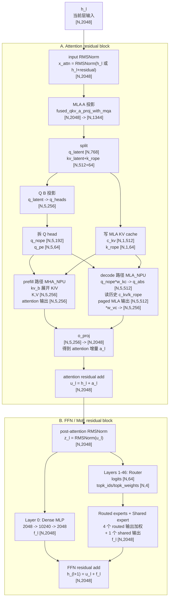
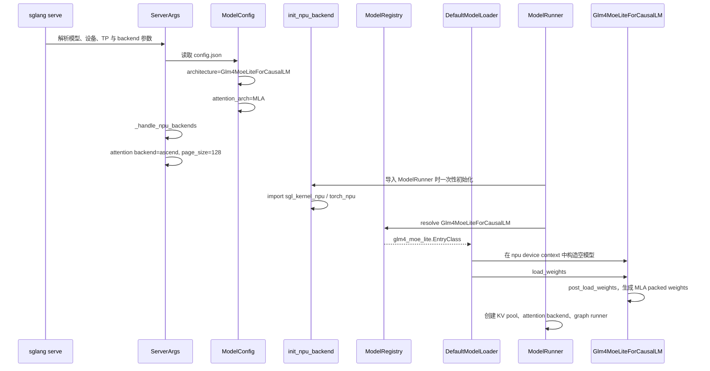
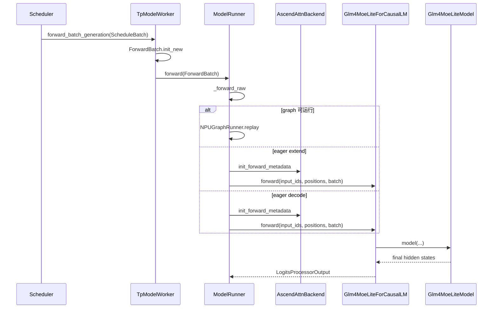
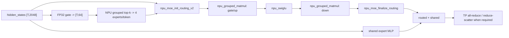

**中文** | [English](./00-glm-4.7-flash-end-to-end_EN.md)

# 端到端样例：GLM-4.7-Flash 在 SGLang Ascend NPU 中的完整执行路径

本讲以一个真实模型为主线，从启动命令一路追踪到输出 token，完整串联 attention、MoE、KV cache 等组件及其 Ascend NPU 分支。

样例模型选择 `GLM-4.7-Flash`，因为它在一条模型路径中同时覆盖：

- SGLang 原生模型注册与 Hugging Face 权重加载；
- Multi-Latent Attention（MLA）；
- 纯 prefill 的 MHA 计算和 decode 的 absorbed MLA 计算；
- Ascend paged KV cache；
- dense MLP、稀疏 MoE 和 shared expert；
- TP/HCCL、NPU Graph、prefix cache；
- 可选的 DeepEP/FuseEP；
- 模型内置 NextN 层和 EAGLE speculative decoding。

## 1. 阅读范围与基线场景

### 1.1 为什么要先固定一条基线

eager、graph、普通 MoE、DeepEP、FuseEP 和 speculative 中存在互斥分支，一条请求不会同时经过所有路径。因此先固定一条可复现的基线调用链，再分别分析其他运行配置。

基线约定：

| 项目 | 取值 |
|---|---|
| 模型 | `GLM-4.7-Flash` 原始 BF16 checkpoint |
| 模型路径 | `/home/{myspace}/models/GLM-4.7-Flash` |
| 设备 | Ascend NPU |
| 并行 | 单机 TP=4，PP=1，DP=1，EP 未单独启用 |
| 请求 | 文本在线请求，单请求，第一次请求无 prefix cache 命中 |
| 执行 | 先关闭 NPU Graph，观察 eager 调用链 |
| speculative | 基线关闭，后文单独启用 NextN/EAGLE |
| 量化 | 无，权重和激活以 BF16 为主 |
| attention backend | `ascend` |
| page size | NPU 默认 128 |

用于源码跟踪的启动命令可以写成：

```bash
sglang serve \
  --model-path /home/{myspace}/models/GLM-4.7-Flash \
  --device npu \
  --tp-size 4 \
  --attention-backend ascend \
  --sampling-backend ascend \
  --disable-cuda-graph \
  --tool-call-parser glm47 \
  --reasoning-parser glm45 \
  --served-model-name glm-4.7-flash \
  --host 0.0.0.0 \
  --port 8000
```

这里的 `--disable-cuda-graph` 名称保留了 SGLang 的跨平台历史命名，在 NPU 上表示先不进入 `NPUGraphRunner` replay。完成 eager 跟踪后，移除此参数即可继续观察 NPU Graph 分支。

### 1.2 版本与资料来源

模型和 SGLang 都在快速演进，实际阅读前先记录：

```text
SGLang commit:
sgl-kernel-npu commit:
GLM-4.7-Flash model revision:
torch / torch_npu / CANN version:
NPU 型号与卡数:
启动参数:
```

本讲使用的外部资料：

- [GLM-4.7-Flash 官方模型卡](https://huggingface.co/zai-org/GLM-4.7-Flash)
- [GLM-4.7-Flash 官方 config.json](https://huggingface.co/zai-org/GLM-4.7-Flash/blob/main/config.json)
- [ModelScope 模型入口](https://modelscope.cn/models/ZhipuAI/GLM-4.7-Flash)
- [SGLang 的 GLM-4.7-Flash 实现](https://github.com/sgl-project/sglang/blob/main/python/sglang/srt/models/glm4_moe_lite.py)
- [sgl-kernel-npu](https://github.com/sgl-project/sgl-kernel-npu)

官方模型卡将它描述为 30B-A3B MoE 模型。教程中的结构参数以模型 `config.json` 和当前 SGLang 源码为准。

## 2. 先看清模型本身

### 2.1 配置指纹

`config.json` 中最关键的字段如下：

| 字段 | 值 | 对执行路径的影响 |
|---|---:|---|
| `architectures` | `Glm4MoeLiteForCausalLM` | 决定 SGLang 原生模型类 |
| `model_type` | `glm4_moe_lite` | Transformers 配置类型 |
| `dtype` | `bfloat16` | 基线权重和激活 dtype |
| `vocab_size` | 154880 | embedding 和 LM head 规模 |
| `hidden_size` | 2048 | 主干 hidden state 宽度 |
| `num_hidden_layers` | 47 | decoder layer 数量 |
| `first_k_dense_replace` | 1 | 第 0 层 dense，第 1～46 层 MoE |
| `intermediate_size` | 10240 | dense MLP 中间维度 |
| `n_routed_experts` | 64 | 每个 MoE 层的 routed experts |
| `n_shared_experts` | 1 | 每个 MoE 层的 shared expert |
| `num_experts_per_tok` | 4 | 每个 token 选择 4 个 routed experts |
| `moe_intermediate_size` | 1536 | 单个 expert 的中间维度 |
| `topk_method` | `noaux_tc` | grouped top-k 路由语义 |
| `routed_scaling_factor` | 1.8 | routed expert 输出缩放 |
| `num_attention_heads` | 20 | Q heads 总数 |
| `q_lora_rank` | 768 | Q 的低秩 latent 宽度 |
| `kv_lora_rank` | 512 | 压缩 KV latent 宽度 |
| `qk_nope_head_dim` | 192 | 非 RoPE Q/K head 维度 |
| `qk_rope_head_dim` | 64 | RoPE Q/K head 维度 |
| `v_head_dim` | 256 | V head 维度 |
| `max_position_embeddings` | 202752 | 配置中的最大位置长度 |
| `num_nextn_predict_layers` | 1 | checkpoint 内含一个 NextN/MTP 层 |

由这些字段可以立即得到：

```text
qk_head_dim = qk_nope_head_dim + qk_rope_head_dim
              = 192 + 64
              = 256

TP=4 时：
num_local_heads = 20 / 4 = 5
```

### 2.2 先统一维度符号

后文所有 shape 都遵循下面这套符号。若不先区分“全局逻辑维度”“当前 TP rank 的本地维度”和“NPU 算子实际保存的物理布局”，很容易把同一份权重误认为三份不同权重。

| 符号 | 本讲取值 | 含义 |
|---|---:|---|
| `T` | 运行时变化 | 当前 TP rank 在一次 prefill/extend 中处理的 token 总数；单请求时等于本轮 prompt token 数 |
| `B` | 运行时变化 | decode batch 中的请求数；普通 decode 每个请求本轮只有 1 个 query token |
| `D` | 2048 | 模型主干 hidden size |
| `V` | 154880 | 全局词表大小 |
| `L` | 47 | target decoder layer 数 |
| `H` | 20 | 全局 attention head 数 |
| `TP` | 4 | tensor parallel rank 数 |
| `Htp` | 5 | 当前 rank 的 local heads，`H / TP = 20 / 4` |
| `Rq` | 768 | Q LoRA/latent rank |
| `Rkv` | 512 | KV latent rank，也是压缩 KV cache 的主体宽度 |
| `Dnope` | 192 | 每个 head 不使用 RoPE 的 Q/K 维度 |
| `Drope` | 64 | 每个 head 使用 RoPE 的 Q/K 维度 |
| `Dh` | 256 | 完整 Q/K head 维度，`Dnope + Drope = 192 + 64`；也等于 V head 维度 |
| `Idense` | 10240 | 第 0 层 dense MLP 的全局中间维度 |
| `Iexpert` | 1536 | 单个 routed/shared expert 的全局中间维度 |
| `E` | 64 | 每个 MoE 层的 routed expert 数 |
| `K` | 4 | 每个 token 选中的 routed expert 数 |
| `P` | 运行时确定 | KV cache page 数，不包括额外 sentinel page |
| `S` | 运行时变化 | 单个请求当前完整序列长度 |
| `Td` | 运行时变化 | NextN draft/verify 本轮处理的 token 数 |

三个必须牢记的阅读约定：

1. PyTorch `Linear` 权重保存为 `[out_features, in_features]`。若 `X` 为 `[N, in_features]`，计算是 `Y = X @ W.T`，输出为 `[N, out_features]`。
2. “global shape”描述完整数学模型；“TP4 local shape”描述每个 rank 实际持有的分片。比如 LM head 全局是 `[154880,2048]`，TP=4 后每个 rank 是 `[38720,2048]`。
3. “NPU physical shape”是加载完成后为算子调整过的存储布局。例如 MoE 的 `w2` 逻辑形状是 `[E,D,Iexpert/TP]`，在 NPU 上转置后保存为 `[E,Iexpert/TP,D]`；数值没有改变，只是内存轴顺序变了。

本讲默认 token 维在前。于是：

```text
prefill hidden_states: [T, D] = [T, 2048]
decode  hidden_states: [B, D] = [B, 2048]
prefill local Q heads: [T, Htp, Dh] = [T, 5, 256]
decode absorbed Q:     [B, Htp, Rkv] = [B, 5, 512]
```

注意，`T` 和 `B` 不是模型配置常量。NPU Graph 中可能把它们 padding 到捕获规格，但有效 token 数仍由 metadata 指明。

#### 2.2.1 图解：一个 Decoder Layer 里向量到底怎么流动

先不要把 `Glm4MoeLiteDecoderLayer` 想成“47 层里的某个黑盒”。它内部其实只有一条主干向量流：输入是 `[N,2048]`，输出还是 `[N,2048]`。MLA、Dense MLP、MoE、RMSNorm、residual add 都是在这条主干上做“增量变换”。

下面这张图只追踪向量 shape，不画 TP/EP/Graph 的所有调度细节。`N` 表示本轮真实 token 行数：prefill 时可理解为 `T`，decode 时可理解为 `B`。



读这张图时抓住三条“不会变”的线索：

1. 主干 hidden width 一直是 `2048`。MLA 内部会临时变成 `[N,5,256]`、`[N,5,512]`，MoE 内部会临时变成 expert 中间维度，但离开 attention block 或 FFN/MoE block 时都会回到 `[N,2048]`。
2. `prefill` 和 `decode` 是同一个 attention 对象的两种执行方式，不是两套模型层。prefill 为了吞吐临时展开 K/V；decode 为了省 KV cache 带宽使用压缩 latent。
3. Layer 0 和 Layer 1～46 的 attention 部分一样，差别只在第二个 residual block：Layer 0 是 dense MLP；Layer 1～46 是 Router + routed experts + shared expert。

#### 2.2.2 图中变量与源码名的对应关系

源码里同一个变量名有时会在不同阶段复用，特别是 `q`：刚 split 出来时它是 Q latent，过了 `q_b_proj` 后它又变成 Q heads。读源码时建议在脑子里给它们换成更明确的名字。

| 图中名字 | 常见源码变量 | Shape | 含义 |
|---|---|---:|---|
| `h_l` | `hidden_states` | `[N,2048]` | 当前 Decoder Layer 的输入主干向量。 |
| `x_attn` | `hidden_states` after `prepare_attn()` | `[N,2048]` | attention 前 RMSNorm 之后的输入。源码仍可能叫 `hidden_states`，但语义已经变成 normed attention input。 |
| `q_latent` | split 后的 `q` | `[N,768]` | Q 的低秩 latent 表示，还不是 attention head。 |
| `latent_cache` | `latent_cache` | `[N,576]` | KV A 投影输出，包含 `kv_a [N,512]` 和 `k_pe [N,64]`。 |
| `c_kv` / `kv_a` | `kv_a`、`k_nope` 在 MLA 路径中也可能指它 | `[N,512]` 或 `[N,1,512]` | 压缩 KV latent，是 MLA KV cache 的主体。名字里出现 `k_nope` 时要看上下文：在 MLA decode 里它常指 compressed KV latent，不是普通 MHA 的 192 维 K-noPE。 |
| `k_rope` / `k_pe` | `k_pe` | `[N,1,64]` | K 的 RoPE 位置分量，会和 `c_kv` 一起写入 MLA KV cache。 |
| `q_heads` | `q` after `q_b_proj(...).view(...)` | `[N,5,256]` | 当前 TP rank 的 5 个 Q heads。 |
| `q_nope` | `q_nope` | `[N,5,192]` | Q head 中不做 RoPE 的部分。 |
| `q_pe` | `q_pe` | `[N,5,64]` | Q head 中做 RoPE 的部分。 |
| `K,V` | `k`、`v` | `[N,5,256]` | prefill MHA_NPU 临时展开出的普通 K/V heads。它们用于本轮 attention 计算，但长期 cache 仍保存压缩 latent。 |
| `q_abs` | `q_nope_out` | `[N,5,512]` | decode MLA_NPU 中，`q_nope` 乘 `w_kc` 后进入 KV latent 空间的 Q。 |
| `a_l` | attention `output` | `[N,2048]` | attention block 产生的增量，经过 `o_proj` 后回到 hidden size。 |
| `u_l` | `residual` 或 `hidden_states + residual` 的语义结果 | `[N,2048]` | attention residual add 之后的中间主干状态。 |
| `z_l` | MLP/MoE 输入 `hidden_states` | `[N,2048]` | post-attention RMSNorm 后送入 Dense MLP 或 MoE 的向量。 |
| `f_l` | MLP/MoE 输出 | `[N,2048]` | FFN 或 MoE 产生的增量。 |
| `h_(l+1)` | layer 返回的 `hidden_states, residual` 组合语义 | `[N,2048]` | 当前层最终输出，下一层只接收这一条主干语义，不会接收 expert 分支或 top-k 细节。 |

这张表也解释了为什么源码看起来“同一个 tensor 名字一直变”：SGLang 为了减少 Python 对象和中间变量，经常复用 `hidden_states`、`q`、`k_nope` 这些名字。学习时先按上表给变量改一个语义名，理解会轻松很多。

### 2.3 GLM-4.7-Flash 整体架构与输入流转

GLM-4.7-Flash 是一个 **decoder-only、causal、MoE 语言模型**。对普通生成请求而言，它的 target model 可以先看成下面五部分：

```text
Glm4MoeLiteForCausalLM
  |
  |-- model.embed_tokens
  |     token id -> 2048 维向量
  |
  |-- model.layers[0]                         # Layer 0
  |     MLA Attention + Dense MLP
  |
  |-- model.layers[1] ... model.layers[46]    # Layer 1～46
  |     MLA Attention + Sparse MoE
  |
  |-- model.norm
  |     最终 RMSNorm
  |
  `-- lm_head
        2048 维 hidden state -> 154880 维词表 logits
```

其中 `model.layers` 是包含 47 个 `Glm4MoeLiteDecoderLayer` 的顺序容器。**47 层在逻辑上串行执行：Layer 0 的输出是 Layer 1 的输入，Layer 1 的输出是 Layer 2 的输入，依此类推，最后 Layer 46 的输出进入 final RMSNorm。** 它们不是 47 条并行分支。

模型配置还包含一个 NextN/MTP layer，但它属于 speculative decoding 的 draft 路径，不会插入普通 target model 的 Layer 0～46 主链。第 15 节会单独讲解它。

下图展示模型对象树、单层 decoder 的内部结构、TP=4 的关键权重形状，以及 prefill/decode 两条 MLA 执行路径。


#### 2.3.1 先把 MLA 看成“压缩 KV cache 的 attention”

MLA 全称是 Multi-head Latent Attention。这里的 `latent` 可以先理解成“压缩表示”。普通 attention 会把每个历史 token 的 K/V 都保存成完整 head 维度；GLM-4.7-Flash 的 MLA 不这样做，它把历史 token 的 KV 主要保存成：

```text
compressed KV latent: c_kv   [S, 1, 512]
K 的 RoPE 分量:        k_rope [S, 1, 64]
```

这里 `S` 是某个请求当前已经积累的完整序列长度。为什么 head 维中间是 `1`？因为 compressed KV latent 是共享的，decode 时通过 MQA/MLA 方式被本 rank 的 5 个 Q heads 共同读取；不是每个 Q head 都保存一份完整 KV cache。

从普通 attention 的视角看，计算大概是：

```text
Q [N,Htp,256]  和  K [S,Htp,256] 做点积
再用权重聚合 V [S,Htp,256]
```

从 MLA 的视角看，decode 更像是：

```text
Q 的 noPE 部分先投到 512 维 latent 空间
再与历史 c_kv [S,1,512] 和 k_rope [S,1,64] 计算 attention
最后把 512 维 latent 输出恢复成 256 维 V head 输出
```

所以 MLA 的核心收益是：**历史 cache 不存完整 `K [S,5,256]` 和 `V [S,5,256]`，而是存更窄的 `c_kv [S,1,512]` 加 `k_rope [S,1,64]`。** 对 decode 来说，历史 KV cache 读带宽非常关键，因此这种压缩很有价值。

#### 2.3.2 MLA 里的每个变量到底是什么

下面把 `DeepseekV2AttentionMLA` 和 NPU prepare/core 中最容易混淆的变量按“产生顺序”拆开。这里仍使用 TP=4，因此本 rank local heads 为 `Htp=5`。

| 变量 | 来源代码/对象 | Shape | 含义 |
|---|---|---:|---|
| `hidden_states` | Decoder Layer 传给 attention | `[N,2048]` | attention 前的 hidden 向量，已经经过 input RMSNorm。 |
| `qkv_latent` | `fused_qkv_a_proj_with_mqa(hidden_states)` | `[N,1344]` | 一次 A projection 的输出，1344 = 768 + 512 + 64。源码里通常通过 `get_attn_tp_context().fetch_qkv_latent()` 延迟取得。 |
| `q` / `q_latent` | `qkv_latent.split([768,576])` 的前半段 | `[N,768]` | Q 的低秩 latent，还不是多头 Q。源码变量名常叫 `q`。 |
| `latent_cache` | `qkv_latent.split([768,576])` 的后半段 | `[N,576]` | KV 相关 latent，576 = 512 维 compressed KV + 64 维 K RoPE。 |
| `kv_a` / `c_kv` | `latent_cache[..., :512]` | `[N,512]` | compressed KV latent。写入 KV cache 的主体。 |
| `k_pe` / `k_rope` | `latent_cache[..., 512:]` | `[N,64]`，unsqueeze 后 `[N,1,64]` | K 的 RoPE 位置分量。它不经过 `kv_b_proj`，而是和 `q_pe` 一起做 RoPE。 |
| `q_heads` | `q_b_proj(RMSNorm(q_latent))` 后 reshape | `[N,5,256]` | 本 rank 的 5 个 Q heads。源码里投影后仍常叫 `q`。 |
| `q_nope` | `q_heads[..., :192]` | `[N,5,192]` | Q 中不带 RoPE 的部分，用于内容相似度。 |
| `q_pe` | `q_heads[..., 192:]` | `[N,5,64]` | Q 中带 RoPE 的部分，用于位置相关相似度。 |
| `k_nope` 在 prefill MHA 路径 | `kv_b_proj(kv_a)` 的 K 部分 | `[N,5,192]` | 临时展开出的普通 K-noPE。 |
| `v` 在 prefill MHA 路径 | `kv_b_proj(kv_a)` 的 V 部分 | `[N,5,256]` | 临时展开出的普通 V。 |
| `k` 在 prefill MHA 路径 | `concat(k_nope, k_pe)` | `[N,5,256]` | 临时完整 K head。 |
| `q_nope_out` / `q_abs` 在 decode MLA 路径 | `q_nope @ w_kc` | `[N,5,512]` | Q-noPE 被吸收到 KV latent 空间后的表示。 |
| `attn_output` 在 decode MLA 路径 | `attn_mqa(...)` 输出 | `[N,5,512]` | attention 聚合后的 latent 输出，还不是 V head 维度。 |
| `attn_bmm_output` | `attn_output @ w_vc` | `[N,5,256]` | latent 输出恢复到每个 head 的 V 维度。 |
| `output` | `o_proj(...)` | `[N,2048]` | attention 最终增量，回到主干 hidden size。 |

上表主要是 activation tensor。还有一类变量是“权重或算子对象”，它们不沿 token 维流动，但决定 activation 怎样变形：

| 权重/对象 | 类型 | TP4 下可理解的形状 | 作用 |
|---|---|---:|---|
| `fused_qkv_a_proj_with_mqa.weight` | `ReplicatedLinear` 权重 | `[1344,2048]` | A projection。一次从 hidden 生成 `q_latent [N,768]` 与 `latent_cache [N,576]`。每个 TP rank 都有完整副本。 |
| `q_a_layernorm.weight` | RMSNorm scale | `[768]` | 归一化 Q latent。 |
| `q_b_proj.weight` | `ColumnParallelLinear` 本地权重 | `[1280,768]`，因为 `5 * 256 = 1280` | 把 Q latent 展开成本 rank 的 5 个 Q heads。 |
| `kv_a_layernorm.weight` | RMSNorm scale | `[512]` | 归一化 compressed KV latent。 |
| `kv_b_proj.weight` | `ColumnParallelLinear` 本地权重 | `[2240,512]`，因为 `5 * (192+256)=2240` | prefill 时把 compressed KV latent 临时展开成 K-noPE 与 V；权重加载后也用于派生 `w_kc/w_vc`。 |
| `w_kc` | 从 `kv_b_proj.weight` 派生的 tensor | 概念上 `[5,192,512]` | decode MLA 中把 `q_nope [N,5,192]` 映射到 `q_abs [N,5,512]`。 |
| `w_vc` | 从 `kv_b_proj.weight` 派生的 tensor | 概念上 `[5,512,256]`，实际保存 layout 以 NPU kernel 需要为准 | decode MLA 中把 latent attention 输出 `[N,5,512]` 恢复成 V head 输出 `[N,5,256]`。 |
| `rotary_emb` | RoPE 对象 | 不保存成普通矩阵 | 给 `q_pe` 和 `k_pe` 注入位置信息。 |
| `attn_mha` | `RadixAttention` | Q/K/V head 维度都是 256 | prefill MHA_NPU 路径使用，吃展开后的 Q/K/V。 |
| `attn_mqa` | `RadixAttention` | Q/K latent 维度 512，RoPE 额外 64 | decode MLA_NPU 路径使用，吃 compressed KV latent 与 RoPE 分量。 |
| `o_proj.weight` | `RowParallelLinear` 本地权重 | `[2048,1280]` | 把本 rank 的 5 个 attention head 输出拼成的 `[N,1280]` 投回 `[N,2048]`；TP 汇总由 layer 通信边界处理。 |

要特别注意源码变量名 `k_nope` 的上下文差异：

- 在 prefill MHA_NPU 里，`k_nope` 通常表示 `kv_b_proj(kv_a)` 展开的 `[N,5,192]` K-noPE。
- 在 decode MLA_NPU 里，NPU prepare 代码中传给 `attn_mqa` 的 `k_nope` 往往是 normalized compressed KV latent，shape 是 `[N,1,512]`。它不是 192 维普通 K-noPE，只是复用了名字。

这也是初读 MLA 源码很容易晕的地方：**同名变量在不同 forward method 里可以代表不同数学对象。** 判断方法很简单：看 shape。如果最后一维是 `192`，它是普通 K/Q 的 noPE 部分；如果最后一维是 `512`，它是 compressed KV latent 空间。

#### 2.3.3 Prefill 为什么还会走 MHA_NPU

你可能会问：既然模型是 MLA，为什么 prefill 里还要展开成 MHA？

原因是 prefill 的主要压力和 decode 不一样。prefill 一次处理很多 prompt token，attention 是大块 dense 计算，更适合使用高吞吐的 fused attention kernel。因此 SGLang Ascend backend 会在 pure prefill 中选择：

```text
q_latent [T,768]
  -> q_b_proj
  -> Q [T,5,256]

kv_a [T,512]
  -> kv_b_proj
  -> K-noPE [T,5,192] 和 V [T,5,256]

k_pe [T,1,64]
  -> 与 K-noPE 拼成 K [T,5,256]

Q,K,V
  -> MHA_NPU / FIA
  -> attention heads [T,5,256]
  -> o_proj
  -> attention output [T,2048]
```

但是，prefill 阶段写入长期 KV cache 的仍是压缩形式：

```text
c_kv   [T,1,512]
k_rope [T,1,64]
```

因此“prefill 走 MHA_NPU”和“模型使用 MLA KV cache”并不矛盾。前者描述本轮 attention 怎样高效计算；后者描述历史上下文怎样长期保存。

#### 2.3.4 Decode 为什么要走 absorbed MLA

decode 每个请求通常只新增一个 query token，但要读取这个请求已经积累的全部历史 KV。若每层每步都读取完整：

```text
K cache [S,5,256]
V cache [S,5,256]
```

带宽压力会很大。MLA 的 decode 路径把这件事改写成：

```text
q_nope [B,5,192]
  -> 乘 w_kc
  -> q_abs [B,5,512]

历史 cache:
  c_kv   [S,1,512]
  k_rope [S,1,64]

paged MLA:
  q_abs + q_pe
  attend to c_kv + k_rope
  -> attn_output [B,5,512]

attn_output
  -> 乘 w_vc
  -> [B,5,256]
  -> o_proj
  -> [B,2048]
```

这里 `w_kc` 和 `w_vc` 是权重加载后从 `kv_b_proj.weight` 派生出来的矩阵。它们利用矩阵乘法结合律，把“先展开历史 K/V 再 attention”改写成“先改写当前 Q 和最终输出，再直接在 latent cache 上 attention”。

可以用一句话记住：

```text
prefill: 为了吞吐，临时展开 K/V 做 dense attention。
decode : 为了省历史 cache 读带宽，不展开历史 K/V，而在 512 维 latent 空间里做 attention。
```

这就是 2.2 图里蓝色/紫色两条 attention 路径的本质差异。

#### 2.3.5 一个输入怎样依次经过整个模型

用 `N` 表示当前 forward 中实际送入模型的 token 数：prefill 时通常 `N=T`，普通 decode 时通常 `N=B`。模型主干的数据流为：

```text
input_ids [N]
  |
  v
VocabParallelEmbedding
  |
  v
h_0 [N,2048]
  |
  v
Layer 0: MLA Attention + Dense MLP
  |
  v
h_1 [N,2048]
  |
  v
Layer 1: MLA Attention + Sparse MoE
  |
  v
h_2 [N,2048]
  |
  v
Layer 2: MLA Attention + Sparse MoE
  |
  v
...
  |
  v
Layer 46: MLA Attention + Sparse MoE
  |
  v
h_47 [N,2048]
  |
  v
Final RMSNorm
  |
  v
final_hidden [N,2048]
  |
  v
LM Head
  |
  v
logical_logits [N,154880]
```

忽略 PP、TBO 和算子融合后，`Glm4MoeLiteModel.forward()` 可以用下面的等价伪代码理解：

```python
hidden_states = embed_tokens(input_ids)          # h_0 [N, 2048]
residual = None

for layer_id, layer in enumerate(layers):
    hidden_states, residual = layer(
        positions=positions,
        hidden_states=hidden_states,
        forward_batch=forward_batch,
        residual=residual,
        zero_allocator=zero_allocator,
    )                                            # 语义上得到 h_(layer_id + 1)

hidden_states = final_norm(hidden_states, residual)  # [N, 2048]
logits = lm_head(hidden_states)                       # logical [N, 154880]
```

这段伪代码保留了真实 layer 调用中的主要参数。`forward_batch` 携带请求和 cache metadata，当前 attention module 再依据自己的 `layer_id` 访问对应层的 KV cache。真实源码还会处理 PP stage、TBO 和 TP 通信，但循环依赖关系就是这里表达的顺序。

各个 `h_l` 的含义如下：

| 状态 | 从哪里来 | 送到哪里 | Shape |
|---|---|---|---:|
| `h_0` | token embedding | Layer 0 | `[N,2048]` |
| `h_1` | Layer 0 输出 | Layer 1 | `[N,2048]` |
| `h_2` | Layer 1 输出 | Layer 2 | `[N,2048]` |
| `...` | 上一层输出 | 下一层 | `[N,2048]` |
| `h_46` | Layer 45 输出 | Layer 46 | `[N,2048]` |
| `h_47` | Layer 46 输出 | final RMSNorm | `[N,2048]` |

因此，一层可以抽象成保持主干 shape 不变的函数：

```text
h_(l+1) = DecoderLayer_l(h_l, positions, KV_cache_l)

[N,2048] -> [N,2048]
```

这里的 `KV_cache_l` 也带有层编号。每一层 attention 都有自己独立的投影权重和 KV cache 区域；Layer 5 不会读取 Layer 4 的 KV 权重或把 Layer 4 的 KV tensor 当成本层 cache。

以一个被 tokenizer 切成 6 个 token 的 prompt 为例：

```text
input_ids                  [6]
embedding 得到 h_0         [6,2048]
Layer 0 处理 h_0，得到 h_1 [6,2048]
Layer 1 处理 h_1，得到 h_2 [6,2048]
...
Layer 46 得到 h_47         [6,2048]
```

token 数始终是 6，变化的是每个 token 对应的 2048 维表示。经过更深的层后，这个表示逐渐融合了当前位置、前文语义、attention 结果和 FFN/MoE 特征。

prefill 中，causal attention 让第 `i` 个 token 只能关注位置 `0..i`；decode 中通常只为每个请求输入一个新 query token，但每层都可以读取该层已经保存的历史 KV cache。无论是哪一种模式，Layer `l+1` 都必须等待 Layer `l` 产出当前 hidden states。TP/EP 可以并行计算同一层内部的不同分片或 experts，PP 可以把不同层放到不同设备 stage，但都不会改变 47 层的逻辑先后顺序。

推理服务通常不需要保留所有 `[N,V]` logits。`LogitsProcessor` 会选择需要采样的位置，例如每个请求的最后一个有效 token，因而最终常见输出是 `[B,154880]`。这一步是对逻辑 logits 的选取，不会改变前面 47 层的串行关系。

#### 2.3.6 每个 Decoder Layer 内部做什么

47 层都先执行 MLA attention，再执行 FFN。把 NPU 中融合的 residual-add、RMSNorm 和通信还原成数学语义后，第 `l` 层可以写成：

```text
输入：h_l [N,2048]

a_l = MLA_l(
        RMSNorm_attn_l(h_l),
        positions,
        KV_cache_l
      )                                      # [N,2048]

u_l = h_l + a_l                              # [N,2048]

f_l = FFN_l(RMSNorm_ffn_l(u_l))              # [N,2048]

h_(l+1) = u_l + f_l                          # [N,2048]
```

四个状态不能混淆：

| 状态 | 含义 |
|---|---|
| `h_l` | 上一层交给当前层的 residual stream |
| `a_l` | 当前层 attention 提取出的上下文增量 |
| `u_l` | 把 attention 增量加回主干后的中间状态 |
| `f_l` | 当前层 dense MLP 或 MoE 产生的特征增量 |
| `h_(l+1)` | 当前层最终输出，也是下一层唯一接收的主干输入 |

attention 会沿序列维读取当前 token 允许看到的历史信息；dense MLP 和 expert MLP 则对每个 token 的 2048 维向量分别做非线性变换，不在 MLP 内让不同 token 互相 attention。

SGLang 的 `LayerCommunicator` 可能为了融合算子或通信，把 `hidden_states` 和 `residual` 暂时分开携带，并使用 `npu_add_rms_norm` 合并 residual add 与 RMSNorm。运行顺序看起来比上面的公式复杂，但数学上的输入输出关系不变。

#### 2.3.7 Layer 0 和 Layer 1～46 的区别

所有 47 层使用同一个 `Glm4MoeLiteDecoderLayer` 类，也都有独立的 MLA attention、两组 RMSNorm 和 residual。模型配置给出 `first_k_dense_replace=1`，SGLang 的 Decoder Layer 构造函数再固定设置 `moe_layer_freq=1`，共同决定 `self.mlp` 的具体类型：

```text
first_k_dense_replace = 1
moe_layer_freq = 1

layer_id = 0
  -> layer_id < first_k_dense_replace
  -> self.mlp = Glm4MoeLiteMLP

layer_id = 1..46
  -> layer_id >= first_k_dense_replace
  -> 每层都命中 moe_layer_freq
  -> self.mlp = Glm4MoeLiteSparseMoeBlock
```

两类层的对比如下：

| 项目 | Layer 0 | Layer 1～46 中的每一层 |
|---|---|---|
| Attention | 本层独立 MLA | 本层独立 MLA |
| FFN 类型 | Dense MLP | Sparse MoE |
| Router | 没有 | 本层独立 Router |
| Routed experts | 没有 | 本层独立的 64 个 |
| Shared expert | 没有 | 本层独立的 1 个 |
| 每个 token 执行的 FFN | 同一个 dense MLP | top-4 routed experts + 1 shared expert |
| 输入/输出主干 shape | `[N,2048] -> [N,2048]` | `[N,2048] -> [N,2048]` |

**Layer 0 的完整流转：**

```text
h_0 [N,2048]
  -> Layer 0 MLA
  -> attention residual 得到 u_0 [N,2048]
  -> RMSNorm
  -> Dense SwiGLU MLP
       2048 -> gate/up 2 x 10240
       SiLU(gate) * up -> 10240
       down projection -> 2048
  -> MLP residual
  -> h_1 [N,2048]
```

Layer 0 中的所有 token 使用同一套 dense MLP 权重。它没有 Router，也不存在“选择哪个 expert”。

**任意一个 Layer 1～46 的完整流转：**

```text
h_l [N,2048]
  -> Layer l MLA
  -> attention residual 得到 u_l [N,2048]
  -> RMSNorm 得到 z_l [N,2048]
  |
  |-- Router_l(z_l) -> logits [N,64]
  |     -> 每个 token 选择 4 个 routed expert ids 和 4 个权重
  |     -> 4 个 routed expert 输出按路由权重聚合
  |
  |-- SharedExpert_l(z_l)
  |     -> 每个 token 都执行，不参与 top-k
  |
  `-- routed_result + shared_result -> f_l [N,2048]

u_l + f_l
  -> h_(l+1) [N,2048]
```

MoE 内部虽然临时产生 4 条 routed expert 分支和 1 条 shared expert 分支，但这些分支会在**当前层内部**合并回一个 `[N,2048]` tensor。下一层不会收到 5 份输入，也不会直接看到上一层的 expert id。

对第 `n` 个 token，当前 MoE 层的数学语义可以概括为：

```text
top4_ids, top4_weights = TopK4(Router_l(z_l[n]))

routed_l[n]
  = routed_scaling_factor
  * sum(top4_weights[j] * RoutedExpert_l_top4_ids[j](z_l[n]), j=0..3)

shared_l[n]
  = SharedExpert_l(z_l[n])

f_l[n]
  = routed_l[n] + shared_l[n]
```

本模型的 `routed_scaling_factor=1.8`。不同 backend 可以把这个缩放融合进 top-k 权重或 expert 输出，但最终表达的仍是四个 routed expert 的加权结果再与 shared expert 相加。

#### 2.3.8 每个 MoE 层是否都有 65 个专家和独立 Router

答案是：**从模型架构和权重语义看，是的。Layer 1～46 的每一层都有自己的 64 个 routed experts、1 个 shared expert，以及自己的 Router；但 shared expert 不是 Router 的第 65 个候选项。**

以第 `l` 个 MoE 层为例，它拥有：

```text
Router_l
  weight:                  [64,2048]
  e_score_correction_bias: [64]

RoutedExpert_l_0
RoutedExpert_l_1
...
RoutedExpert_l_63
  每个都是独立 SwiGLU MLP：2048 -> 1536 -> 2048

SharedExpert_l
  独立 SwiGLU MLP：2048 -> 1536 -> 2048
```

需要抓住下面五点：

1. **Router 是逐层独立的。** `Layer 1 Router`、`Layer 2 Router` 一直到 `Layer 46 Router` 各有自己的 `[64,2048]` 权重和 `[64]` correction bias。
2. **expert 权重也是逐层独立的。** `Layer 1 Expert 7` 与 `Layer 2 Expert 7` 只是编号相同，参数完全不同，没有共享权重。
3. **64 个 routed experts 才参与 top-4。** 对每个 token，Router 产生 64 个分数，并选择其中 4 个 expert。
4. **shared expert 始终执行。** 它接收同一个 `z_l [N,2048]`，但不参与 64 路打分，也不会占用 top-4 的名额。
5. **路由结果不会传给下一层。** 下一层只接收聚合后的 `h_(l+1) [N,2048]`，然后用自己的 Router 重新计算 top-4。

因此，46 个 MoE 层在逻辑上一共包含：

```text
routed expert 实例数 = 46 x 64 = 2944
shared expert 实例数 = 46 x 1  = 46
MoE expert MLP 总数  = 2990
Router 实例数        = 46
```

这里的“实例”表示不同层、不同 expert id 对应的独立参数集合。启用 EP 后，这些权重可以被分散到不同 NPU；启用 TP 后，单个 expert 还可能继续切分。但并行部署只改变物理放置，不改变“每个 MoE 层逻辑上有 64 routed + 1 shared”的模型结构。

下面用一个 token 的假想路由结果说明“每层重新路由”：

```text
Layer 0
  token 向量经过 dense MLP
  -> h_1[token] [2048]

Layer 1
  Router_1(h_1[token])
  -> 选择本层 experts {3, 11, 27, 58}
  -> 四个结果加权，再加 SharedExpert_1
  -> h_2[token] [2048]

Layer 2
  Router_2(h_2[token])
  -> 可能选择本层 experts {0, 9, 33, 61}
  -> 四个结果加权，再加 SharedExpert_2
  -> h_3[token] [2048]
```

Layer 2 的选择可以与 Layer 1 完全不同，因为输入 hidden state 已经变化，Router 权重也不同。即便两层都选中了 expert 3，它们调用的也是两套不同权重。

在当前 Ascend NPU 基线中，shared expert 保持为独立 `Glm4MoeLiteMLP`。某些后端可以在物理实现上把 shared expert 融入 fused MoE，但这不会改变上述数学语义。

#### 2.3.9 怎样阅读完整架构图

1. **先看模型级串行主链。** `input_ids` 经过 embedding 后形成 `h_0`，47 层依次产生 `h_1..h_47`，再由 final norm 和 LM head 产生 logits。
2. **再看单层的两个 residual block。** 每层先做 attention residual，再做 dense MLP 或 sparse MoE residual；两个边界都保持 hidden width 为 `2048`。
3. **对比 Layer 0 和 MoE layers。** 它们的 attention 结构相同，差异集中在第二个 residual block 使用 dense MLP 还是 sparse MoE。
4. **沿蓝色 prefill 路径阅读。** 当前 token 的压缩 latent 被写入 KV cache，同时临时展开成 `[T,5,256]` 的 K/V，交给 fused attention。
5. **沿紫色 decode 路径阅读。** 历史 KV 不再展开为完整 K/V；Q 被吸收到 512 维 latent 空间，paged MLA 的输出最后才经 `w_vc` 恢复为 256 维 V head。
6. **最后看橙色 MoE 路径。** 每个 MoE 层的 Router 从该层 64 个 routed experts 中为每个 token 选 4 个；4 路结果与该层始终执行的 shared expert 合并后，才交给下一层。

后文第 8 节会把这条模型级主链映射到 `Glm4MoeLiteModel.forward()`，第 9 节继续拆解单个 Decoder Layer、dense MLP 和 sparse MoE 的 NPU 执行过程。

### 2.4 为什么它叫 Lite，但不是普通小型 dense 模型

`Lite` 对应的是 `Glm4MoeLiteForCausalLM` 架构分支，不代表执行路径简单。每个 MoE 层包含 64 个 routed experts，但每个 token 在该层只激活其中 4 个，再叠加一个 shared expert，因此活跃参数量远小于总参数量。

它也不是普通 GQA 模型。虽然配置中 `num_attention_heads` 与 `num_key_value_heads` 都是 20，SGLang 仍依据架构名和 `kv_lora_rank` 将其识别为 MLA，并使用压缩 latent KV cache。

## 3. 本模型涉及的源码地图

| 阶段 | 关键文件 | 关键对象 |
|---|---|---|
| 配置识别 | `configs/model_config.py` | `ModelConfig`、`AttentionArch.MLA` |
| 模型注册 | `models/registry.py` | `ModelRegistry`、`EntryClass` |
| 模型选择 | `model_loader/utils.py` | `get_model_architecture()` |
| 模型加载 | `model_loader/loader.py` | `DefaultModelLoader` |
| 模型实现 | `models/glm4_moe_lite.py` | `Glm4MoeLiteForCausalLM` 等 |
| NextN 实现 | `models/glm4_moe_lite_nextn.py` | `Glm4MoeLiteForCausalLMNextN` |
| MLA 通用主体 | `models/deepseek_v2.py` | `DeepseekV2AttentionMLA` |
| NPU MLA prepare/core | `hardware_backend/npu/modules/deepseek_v2_attention_mla_npu.py` | `forward_mha_*_npu`、`forward_mla_*_npu` |
| NPU MLA 融合预处理 | `hardware_backend/npu/attention/mla_preprocess.py` | `NPUFusedMLAPreprocess` |
| Attention backend | `hardware_backend/npu/attention/ascend_backend.py` | `AscendAttnBackend` |
| Attention 注册 | `layers/attention/attention_registry.py` | `ATTENTION_BACKENDS["ascend"]` |
| Radix 调用层 | `layers/radix_attention.py` | `RadixAttention` |
| 层通信与 residual | `layers/communicator.py` | `LayerCommunicator` |
| RMSNorm | `layers/layernorm.py` | `RMSNorm.forward_npu()` |
| SwiGLU | `layers/activation.py` | `SiluAndMul.forward_npu()` |
| RoPE | `layers/rotary_embedding/base.py` | `RotaryEmbedding.forward_npu()` |
| NPU KV pool | `hardware_backend/npu/memory_pool_npu.py` | `NPUMLATokenToKVPool` |
| NPU allocator | `hardware_backend/npu/allocator_npu.py` | `NPUPagedTokenToKVPoolAllocator` |
| MoE top-k | `hardware_backend/npu/moe/topk.py` | `fused_topk_npu()` |
| MoE 计算 | `layers/quantization/unquant.py` | `UnquantizedFusedMoEMethod.forward_npu()` |
| NPU Graph | `hardware_backend/npu/graph_runner/npu_graph_runner.py` | `NPUGraphRunner` |
| Logits | `layers/logits_processor.py` | `LogitsProcessor` |
| 请求入口 | `entrypoints/openai/serving_chat.py` | `OpenAIServingChat` |
| Tokenize | `managers/tokenizer_manager.py` | `TokenizerManager` |
| 调度 | `managers/scheduler.py` | `Scheduler`、`ScheduleBatch` |
| Worker | `managers/tp_worker.py` | `TpModelWorker` |
| 模型执行 | `model_executor/model_runner.py` | `ModelRunner` |
| 采样 | `layers/sampler.py` | `Sampler` |

本讲还会追踪 `sgl-kernel-npu` 中的三个自定义 kernel：

| Kernel | Python/注册入口 | 核心实现 |
|---|---|---|
| fused split + Q/K RMSNorm | `python/sgl_kernel_npu/sgl_kernel_npu/norm/fused_split_qk_norm.py` | NPU Triton kernel |
| MLA preprocess | `torch.ops.npu.mla_preprocess` | `csrc/mla_preprocess/op_host`、`op_kernel` |
| batch matmul transpose | `torch.ops.npu.batch_matmul_transpose` | `csrc/batch_matmul_transpose/op_host`、`op_kernel` |

## 4. 服务启动：模型怎样变成运行时对象

### 4.1 总初始化链



### 4.2 NPU 默认参数

`ServerArgs._handle_npu_backends()` 在 `device == "npu"` 时调用 `hardware_backend/npu/utils.py::set_default_server_args()`。当前源码会设置：

```text
attention_backend         = "ascend"
prefill_attention_backend = "ascend"
decode_attention_backend  = "ascend"
page_size                 = 128（用户未显式设置时）
disable_custom_all_reduce = True
```

它还会根据设备内存和 TP size 设置 chunked prefill、graph batch size，并在启用 HiCache 时选择 `kernel_ascend`。

注意：`sampling_backend` 是独立配置。为了让样例明确进入 Ascend sampler，启动命令显式使用了 `--sampling-backend ascend`。

### 4.3 `init_npu_backend()` 做了什么

`ModelRunner` 模块在检测到 NPU 时调用 `init_npu_backend()`：

```text
init_npu_backend
  -> import sgl_kernel_npu
  -> import torch_npu
  -> import torch_npu.contrib.transfer_to_npu
  -> allow_internal_format = True
  -> set_compile_mode(jit_compile=False)
```

这里有两个重要结论：

1. 导入 `sgl_kernel_npu` 可能完成 custom op 注册；
2. `transfer_to_npu` 会兼容一部分通用代码中的 `torch.cuda.*` 调用，因此在 `glm4_moe_lite.py` 中看到 `torch.cuda.Stream()` 不应立刻判定它走了 CUDA。

### 4.4 架构名怎样映射到模型类

模型注册路径为：

```text
config.json
  architectures = ["Glm4MoeLiteForCausalLM"]
    -> ModelRegistry 扫描 sglang.srt.models
    -> 导入 glm4_moe_lite.py
    -> 读取 EntryClass = [Glm4MoeLiteForCausalLM]
    -> get_model_architecture()
    -> 返回 Glm4MoeLiteForCausalLM class
```

这是 SGLang 原生实现，不是 Transformers backend fallback。

### 4.5 为什么会选择 MLA

`ModelConfig` 对 `Glm4MoeLiteForCausalLM` 有显式判断：

```text
architecture 命中 Glm4MoeLiteForCausalLM
  -> head_dim = 256
  -> attention_arch = AttentionArch.MLA
  -> kv_lora_rank = 512
  -> qk_nope_head_dim = 192
  -> qk_rope_head_dim = 64
  -> v_head_dim = 256
```

这个判断影响后续三件事：

- `ModelRunner.use_mla_backend = True`；
- 创建 `NPUMLATokenToKVPool`；
- `AscendAttnBackend.use_mla = True`。

### 4.6 模型对象初始化

`DefaultModelLoader.load_model()` 的核心步骤：

```text
get_model_architecture
  -> _initialize_model
  -> Glm4MoeLiteForCausalLM(config, quant_config=None)
  -> load_weights
  -> quant_method.process_weights_after_loading
  -> model.eval()
```

`Glm4MoeLiteForCausalLM.__init__()` 创建：

```text
self.model = Glm4MoeLiteModel(...)
self.lm_head = ParallelLMHead(...)
self.logits_processor = LogitsProcessor(config)
```

`Glm4MoeLiteModel` 再创建 embedding、47 个 decoder layers 和最终 RMSNorm。

### 4.7 47 层是怎样组成的

模型构造函数把 `config.moe_layer_freq` 固定为 1。每层通过 `_is_layer_sparse()` 判断：

```text
layer_id >= first_k_dense_replace
and layer_id % moe_layer_freq == 0
```

对于当前配置：

```text
layer 0     -> Glm4MoeLiteMLP
layer 1-46  -> Glm4MoeLiteSparseMoeBlock
```

每层都包含相同的 `DeepseekV2AttentionMLA`，区别只在 MLP/MoE 部分。

### 4.8 权重加载和 MLA 权重重组

这一节先给一句结论：**外部权重文件中的参数名字和数学结构偏向“便于训练和发布”，运行时参数偏向“少发起算子、适合 TP 分片、适合 NPU kernel 读取”。`load_weights(weights)` 负责完成二者之间的结构化搬运。**

对应源码入口：

| 文件 | 需要跟踪的方法 |
|---|---|
| `entrypoints/engine.py` | `Engine._launch_scheduler_processes()`、`_compute_parallelism_ranks()` |
| `managers/tp_worker.py` | `TpModelWorker._init_model_runner()` |
| `model_executor/model_runner.py` | `ModelRunner.init_torch_distributed()`、`load_model()` |
| `distributed/parallel_state.py` | `initialize_model_parallel()` |
| `model_loader/loader.py` | `DefaultModelLoader._get_weights_iterator()`、`load_weights_and_postprocess()` |
| `models/glm4_moe_lite.py` | `Glm4MoeLiteForCausalLM.load_weights()` |
| `models/deepseek_common/deepseek_weight_loader.py` | `DeepseekV2WeightLoaderMixin.post_load_weights()` |
| `layers/linear.py` | column/row/merged linear parameter 的 `weight_loader` |
| `layers/vocab_parallel_embedding.py` | `VocabParallelEmbedding.weight_loader()` |
| `layers/moe/fused_moe_triton/layer.py` | `FusedMoE.make_expert_params_mapping()`、`weight_loader()`、`_load_w13()`、`_load_w2()` |
| `layers/quantization/unquant.py` | `UnquantizedFusedMoEMethod.process_weights_after_loading()` |

这里的“融合”“合入”都不是训练，也不是把数值相加。它们通常是：

- 把两个矩阵沿某个轴连续存进一个更大的 `Parameter`；
- forward 时用一次大矩阵乘法同时算出两组结果；
- 随后按已知边界把结果切回两组，数学意义与两个独立 `Linear` 完全相同。

#### 4.8.1 先区分权重加载中的四类对象

服务启动时经历两个不同阶段：

```text
阶段 A：__init__ 构造空的运行时参数容器
  例如创建 gate_up_proj.weight，TP4 local shape = [5120, 2048]

阶段 B：load_weights(weights) 遍历输入的权重迭代器
  先把 gate_proj 的 local shard 写入前 2560 行
  再把 up_proj   的 local shard 写入后 2560 行
```

阶段 A 决定“运行时对象长什么样”，阶段 B 才决定“这个对象里装哪些数值”。因此在调试加载错误时应同时查看：

| 要检查的对象 | 检查内容 |
|---|---|
| `weights` 中的 `(name, loaded_weight)` | 输入权重名、global shape、dtype |
| SGLang parameter | 运行时名字、local shape、所属 TP rank |
| parameter 的 `weight_loader` | 取 `loaded_weight` 的哪一片、写到目标参数的哪一段 |
| load 后 parameter | shape、dtype、是否有 NaN/Inf、首尾小块数值 |

权重加载中实际存在四个层次：

| 层次 | 典型对象 | 生命周期 | 作用 |
|---|---|---|---|
| 外部存储 | `model-00001-of-*.safetensors`、index JSON | 服务启动前已经存在 | 保存全局模型权重和 tensor key |
| 输入数据流 | `weights`、`name`、`loaded_weight` | 加载期间逐项产生 | 把外部 tensor 送入模型的 `load_weights()` |
| 运行时参数 | `params_dict[name]`、`nn.Parameter` | 模型对象创建后一直存在 | 保存当前 PP/TP rank 真正参与 forward 的参数 |
| 派生执行权重 | `w_kc`、`w_vc`、NPU format-cast MoE 权重 | 原始参数加载完成后产生 | 改变计算结合顺序或物理布局，直接服务于 kernel |

这四层不能混用。`loaded_weight` 是“本次读到的源 tensor”，`param` 是“要写入的目标参数”，`w_kc/w_vc` 则是“根据已加载参数再次计算出来的执行权重”。

#### 4.8.2 从模型初始化到可执行权重的完整时间线

基线 `DefaultModelLoader` 的固定控制流如下：

```text
DefaultModelLoader.load_model
  |
  |-- 1. _initialize_model
  |     创建空的 Glm4MoeLiteForCausalLM 和全部 local Parameters
  |
  |-- 2. _get_all_weights / _get_weights_iterator
  |     选择 safetensors/PT reader，形成惰性的 weights 迭代器
  |
  |-- 3. model.load_weights(weights)
  |     |-- 建立名称映射和 params_dict
  |     |-- 对每个 (name, loaded_weight) 依次做过滤、映射、TP/EP 分片和写入
  |     |-- post_load_weights：从 kv_b_proj 派生 w_kc/w_vc
  |
  |-- 4. 遍历 model.named_modules()
  |     quant_method.process_weights_after_loading(module)
  |     NPU MoE 权重在这里转置并做 format cast
  |
  `-- 5. model.eval()
        权重加载结束，模型进入推理状态
```

每个阶段解决的问题不同：

| 阶段 | 在做什么 | 为什么必须在这个位置做 |
|---|---|---|
| 构造空模型 | 根据 config、TP、PP、量化配置确定目标参数 shape | 不先知道目标 shape，就无法判断源 tensor 应切哪一片、写到哪里 |
| 创建 `weights` | 按 load format 打开文件并逐项 yield tensor | 避免一次性把 30B 模型全部放进 CPU 内存 |
| `load_weights()` | 把发布格式名称映射到 SGLang 运行格式 | 训练侧通常分开保存 gate/up 和每个 expert，推理侧使用 packed 参数 |
| `post_load_weights()` | 从已经完整装载的参数派生 MLA 执行权重 | `w_kc/w_vc` 依赖完整 `kv_b_proj`，不能在它尚未加载完时生成 |
| quant/method post-process | 转置、重排、量化或转换设备物理格式 | 这些操作依赖最终权重值，并且必须匹配实际 NPU kernel 的输入布局 |

这里还要区分“控制流顺序”和“tensor 出现顺序”：

- 上面 1～5 的控制流顺序固定；
- `weights` 内部不保证严格按 embedding → layer 0 → layer 1 → LM head 排列；
- safetensors 分片顺序、多线程 reader、预取和 `SGLANG_SORT_WEIGHT_FILES` 都可能改变下一个出现的 `name`；
- 所以 `load_weights()` 按名称识别 tensor，不能依赖“上一项是谁”。唯一需要两项配对的 Q/KV A projection 使用 `cached_a_proj` 显式等待另一项。

#### 4.8.3 `weights` 迭代器从哪里来

`DefaultModelLoader._get_weights_iterator()` 先确定模型目录和权重文件，再根据 load format 选择 reader：

```text
LoadFormat.AUTO / SAFETENSORS
  -> safetensors_weights_iterator
  -> 或 buffered_multi_thread_safetensors_weights_iterator

PyTorch .bin
  -> pt_weights_iterator
  -> 或 multi_thread_pt_weights_iterator

NPCACHE / FASTSAFETENSORS
  -> 对应的专用 iterator
```

reader 向下游提供统一接口：

```python
Iterable[Tuple[str, torch.Tensor]]
```

无论源文件格式是什么，模型类只看到：

```text
name:          当前 tensor 的字符串 key
loaded_weight: 当前 tensor 的全局权重数据
```

`_get_all_weights()` 先 yield 主模型权重，再 yield 可选的 secondary weights；`source.prefix` 会在进入模型前加到 `name` 上。整个过程是惰性的：只有 `for name, loaded_weight in weights` 向前迭代时，reader 才继续提供后续 tensor。

以普通 TP=4 为例，源文件仍保存数学意义上的全局权重。每个 TP rank 都根据自己的目标 parameter 和 `weight_loader` 取得所需分片：

```text
global gate_proj.weight [10240,2048]
  rank 0 -> rows [0:2560]
  rank 1 -> rows [2560:5120]
  rank 2 -> rows [5120:7680]
  rank 3 -> rows [7680:10240]
```

这样发布物不需要为每一种 TP size 保存一套文件，同一组权重可以在 TP=1、2、4 等配置下由运行时重新分片。

#### 4.8.4 进入 `load_weights()` 后先准备哪些规则

在读取第一个 tensor 前，函数先构造后面所有分支需要的规则和索引。

**第一步：确定 target 还是 NextN。**

`is_nextn=False` 表示加载 47 层 target model；`is_nextn=True` 表示加载第 47 层之后的一个 NextN/draft layer。两者使用同一批发布权重，但保留和重命名的范围不同。

**第二步：建立普通 packed 参数映射。**

```text
(运行时参数片段, 输入权重片段, shard_id)
qkv_proj      <- q_proj, shard "q"
qkv_proj      <- k_proj, shard "k"
qkv_proj      <- v_proj, shard "v"
gate_up_proj  <- gate_proj, shard 0
gate_up_proj  <- up_proj,   shard 1
```

前三项是通用 QKV packed-linear 兼容规则。GLM-4.7-Flash 的 MLA A projection 不使用这三项，而是在后面的 `cached_a_proj` 分支中处理；dense/shared MLP 的 gate/up 会使用最后两项。

**第三步：决定是否把 shared expert 作为额外 expert。**

若 `num_fused_shared_experts > 0`，迭代器 wrapper 会把：

```text
model.layers.L.mlp.shared_experts.*
```

改名为：

```text
model.layers.L.mlp.experts.64.*
```

即把 shared expert 当作第 65 个 expert 交给 fused MoE。Ascend NPU 基线会关闭这项 CUDA 平台专用融合，因此 `num_fused_shared_experts=0`，shared expert 保持独立 `Glm4MoeLiteMLP`。

**第四步：建立 expert 参数映射。**

`FusedMoE.make_expert_params_mapping()` 为每个 expert 生成 gate/down/up 到 `w13_weight/w2_weight` 的映射，并携带：

```text
expert_id: 0..63
shard_id:  gate/up/down 中的哪一块
```

**第五步：准备 MLA A projection 配对缓存。**

```text
fuse_qkv_a_proj = q_lora_rank is not None
cached_a_proj = {}
```

Q A projection 与 KV A projection 在 `weights` 中可能相隔很远，所以不能假定两者连续出现。字典按完整参数名缓存先到的一块，等同一层的另一块到达后再融合。

**第六步：建立目标参数表。**

```python
params_dict = dict(self.named_parameters())
```

`params_dict` 只包含当前进程实际持有的 parameter。PP 下不属于当前 stage 的层会是 `PPMissingLayer`。FusedMoE 的情况稍有不同：每个 rank 的 `params_dict` 都有本地聚合参数 `w13_weight/w2_weight`，但它们的第一维只包含 local experts；某个 global expert 是否属于本 rank，由后续 `FusedMoE.weight_loader()` 再判断。

#### 4.8.5 配置 TP/EP 后，权重怎样进入不同 ModelRunner 和 NPU

先给出核心结论：**在 `DefaultModelLoader + 未预切分发布权重` 的基线路径中，没有一个中心 ModelRunner 把切好的权重发送给其他 ModelRunner。每个 scheduler rank 都创建自己的 `TpModelWorker → ModelRunner → model`，绑定自己的 NPU，独立遍历全局权重，然后由本地 parameter 的 `weight_loader` 只复制属于本 rank 的切片。**

完整决策链为：

```text
ServerArgs(tp_size, ep_size, pp_size, moe_dp_size)
  -> Engine._launch_scheduler_processes
     计算 tp_rank / moe_ep_rank / pp_rank / gpu_id
  -> 每个子进程创建 TpModelWorker
  -> 每个 TpModelWorker 创建一个 ModelRunner
  -> ModelRunner.init_torch_distributed
     set_device(gpu_id)
     initialize_model_parallel(...)
  -> 当前 NPU 上构造 local model Parameters
  -> 当前进程执行 model.load_weights(weights)
  -> parameter.weight_loader 根据本进程 rank 取片并 copy_
```

##### 4.8.5.1 第一步：为每个 rank 创建独立进程和 ModelRunner

`Engine._launch_scheduler_processes()` 遍历 `pp_rank` 和 `tp_rank`，计算物理/逻辑设备编号：

```text
gpu_id = base_gpu_id
       + (pp_rank % pp_size_per_node) * tp_size_per_node
       + (tp_rank % tp_size_per_node) * gpu_id_step
```

同时调用 `_compute_parallelism_ranks(server_args, tp_rank)` 计算 `moe_ep_rank`。在 `moe_dp_size=1` 的常见场景中：

```text
moe_tp_size = tp_size / ep_size
moe_ep_rank = tp_rank / moe_tp_size       # 整数除法
moe_tp_rank = tp_rank % moe_tp_size
```

更一般的关系为：

```text
tp_size = moe_dp_size * ep_size * moe_tp_size
```

随后每个子进程收到：

```text
(gpu_id, tp_rank, moe_ep_rank, pp_rank, ...)
```

并创建：

```text
TpModelWorker(
  gpu_id=...,
  tp_rank=...,
  moe_ep_rank=...,
  pp_rank=...,
)
  -> ModelRunner(
       gpu_id=...,
       tp_rank=...,
       tp_size=...,
       moe_ep_rank=...,
       moe_ep_size=ep_size,
       ...
     )
```

单机 TP4、`base_gpu_id=0`、`gpu_id_step=1` 时：

| scheduler 进程 | `tp_rank` | `gpu_id` | 持有的主要对象 |
|---:|---:|---:|---|
| 0 | 0 | 0 | ModelRunner 0、local model、local KV cache |
| 1 | 1 | 1 | ModelRunner 1、local model、local KV cache |
| 2 | 2 | 2 | ModelRunner 2、local model、local KV cache |
| 3 | 3 | 3 | ModelRunner 3、local model、local KV cache |

它们是四个独立进程，不是一个 Python 模型对象跨四张 NPU。每个进程都有自己的 `params_dict` 和自己的参数存储。

##### 4.8.5.2 第二步：先绑定设备，再构造和加载参数

`ModelRunner.init_torch_distributed()` 首先执行：

```python
torch.get_device_module(self.device).set_device(self.gpu_id)
```

在 Ascend 上 `self.device="npu"`，因此当前进程之后创建的 device tensor 都落在逻辑 `npu:gpu_id`。随后：

```text
init_distributed_environment(
  world_size = tp_size * pp_size,
  rank       = tp_size * pp_rank + tp_rank,
  local_rank = gpu_id,
)

initialize_model_parallel(
  tensor_model_parallel_size = tp_size,
  expert_model_parallel_size = ep_size,
  moe_data_model_parallel_size = moe_dp_size,
  ...
)
```

`initialize_model_parallel()` 建立 TP、MoE-EP 和 MoE-TP process groups。之后任意模型组件调用：

```text
get_parallel().tp_rank / tp_size
get_parallel().moe_ep_rank / moe_ep_size
get_parallel().moe_tp_rank / moe_tp_size
```

得到的都是当前 ModelRunner 所属 group 的本地 rank 信息。

`DefaultModelLoader.load_model()` 在当前 target device context 中调用 `_initialize_model()`。因此 parameter 从创建时就已经是 local shape，并位于当前 NPU；不是先在 NPU 0 创建全模型再搬运。

若改用预切分的 `sharded_state`、远端分片或其他专用 loader，“每个进程是否读取完整 global tensor”会由该 loader 改变；但当前 rank 应持有哪些 local shape、expert 和 intermediate slice，仍由并行组以及各组件的 parameter/`weight_loader` 规则决定。

##### 4.8.5.3 第三步：TP Linear 的构造函数决定 local shape

以 `ColumnParallelLinear` 为例，构造时读取：

```text
self.tp_rank = get_parallel().tp_rank
self.tp_size = get_parallel().tp_size
output_size_per_partition = output_size / tp_size
```

所以全局 `q_b_proj [5120,768]` 在四个 ModelRunner 中一开始就分别创建为 `[1280,768]`。加载器到来后执行的核心逻辑是：

```text
shard_size = param.shape[output_dim]
start_idx  = tp_rank * shard_size
local = loaded_weight.narrow(output_dim, start_idx, shard_size)
param.copy_(local)
```

TP4 的结果为：

| ModelRunner | `tp_rank` | 从 global `[5120,768]` 取出的行 | local `q_b_proj` |
|---|---:|---:|---:|
| MR0 / NPU0 | 0 | `[0:1280, :]` | `[1280,768]` |
| MR1 / NPU1 | 1 | `[1280:2560, :]` | `[1280,768]` |
| MR2 / NPU2 | 2 | `[2560:3840, :]` | `[1280,768]` |
| MR3 / NPU3 | 3 | `[3840:5120, :]` | `[1280,768]` |

不同并行层的决定位置如下：

| 组件 | 决定 local shape 的代码 | 决定源 tensor 切片的代码 | 切分轴 |
|---|---|---|---|
| `ColumnParallelLinear` | `output_size_per_partition` | `ColumnParallelLinear.weight_loader()` | 权重 `output_dim` |
| `MergedColumnParallelLinear` | 每个 `output_sizes[i]/tp_size` | `MergedColumnParallelLinear.weight_loader(..., shard_id)` | 每个 packed 子矩阵各自沿 output 切 |
| `RowParallelLinear` | `input_size_per_partition` | `RowParallelLinear.weight_loader()` | 权重 `input_dim` |
| `VocabParallelEmbedding` | `_get_indices(..., tp_rank, tp_size)` | `VocabParallelEmbedding.weight_loader()` | vocab rows，考虑 padding |
| `ParallelLMHead` | 继承 embedding 的 vocab partition | 同一 vocab weight loader | vocab/logit rows |

以 dense MLP 为例，rank 2 的 `gate_proj` 不能先和完整 `up_proj` 拼起来再随意四等分。`MergedColumnParallelLinear.weight_loader()` 对 gate 和 up 分别计算 TP slice，再写入 local packed parameter：

```text
global gate [10240,2048] -> rank 2 rows [5120:7680] -> [2560,2048]
global up   [10240,2048] -> rank 2 rows [5120:7680] -> [2560,2048]

local gate_up_proj [5120,2048]
  [0:2560]    <- local gate
  [2560:5120] <- local up
```

`RowParallelLinear` 则沿输入列取片。例如 `down_proj [2048,10240]` 在 rank 2 取得：

```text
loaded_weight[:, 5120:7680] -> local [2048,2560]
```

forward 时四个 rank 分别算出 `[N,2048]` partial output，再通过 TP all-reduce 求和。这正对应：

```text
X @ W.T
= X0 @ W0.T + X1 @ W1.T + X2 @ W2.T + X3 @ W3.T
```

##### 4.8.5.4 第四步：EP 先选 expert，MoE-TP 再切单个 expert

MoE 使用独立的三维并行分解：

```text
TP group
  = MoE-DP replicas
  x EP expert partitions
  x MoE-TP partitions inside one expert
```

`FusedMoE.__init__()` 读取当前 rank 的：

```text
moe_ep_size, moe_ep_rank
moe_tp_size, moe_tp_rank
```

并计算：

```text
num_local_routed = 64 / moe_ep_size
intermediate_size_per_partition = 1536 / moe_tp_size
```

因此 local parameter 创建为：

```text
w13 before NPU format:
  [num_local_routed, 2 * intermediate_size_per_partition, 2048]

w2 before NPU format:
  [num_local_routed, 2048, intermediate_size_per_partition]
```

当 `Glm4MoeLiteForCausalLM.load_weights()` 遇到：

```text
model.layers.L.mlp.experts.E.gate_proj.weight
```

它先通过 `expert_params_mapping` 取得 `expert_id=E` 和 `shard_id="w1"`，随后调用 `FusedMoE.weight_loader()`。

基线静态 expert 排布中，`FusedMoE._map_global_expert_id_to_local_expert_id()` 使用连续区间：

```text
start = moe_ep_rank * num_local_routed
end   = start + num_local_routed

if start <= global_expert_id < end:
    local_expert_id = global_expert_id - start
else:
    local_expert_id = -1
```

返回 `-1` 时，该 ModelRunner 直接跳过这个 expert 的 `loaded_weight`。命中本地 expert 后，`_load_w13/_load_w2` 再使用 `moe_tp_rank` 切分：

```text
w1/w3 (gate/up): 沿输出行切 intermediate
w2 (down):       沿输入列切 intermediate
```

所以 EP 和 MoE-TP 做的是两层不同选择：

```text
EP：      64 个 experts 中，本 rank 保存哪些 expert ids？
MoE-TP：  对选中的每个 expert，本 rank 保存其中哪一段 intermediate channels？
```

若启用 EPLB、冗余 expert 或 elastic EP，global logical expert 到 physical expert 的映射会先经过 `global_expert_location_metadata`；此时不再假设永远是简单连续区间，但最终仍由 `FusedMoE.weight_loader()` 决定写入或跳过。

##### 4.8.5.5 三种配置下每个 NPU 最终保存什么

下面忽略 MoE-DP，设 `moe_dp_size=1`。

**配置 A：TP=4，EP=1。**

```text
moe_tp_size = 4 / 1 = 4
num_local_experts = 64
Iexpert_local = 1536 / 4 = 384
```

每个 NPU 都保存 64 个 experts，但每个 expert 只保存 1/4 中间维：

```text
NPU physical w13 [64,2048,768]
NPU physical w2  [64,384,2048]
```

这就是本讲原始 TP4 基线。

**配置 B：TP=4，EP=4。**

```text
moe_tp_size = 4 / 4 = 1
num_local_experts = 64 / 4 = 16
Iexpert_local = 1536
```

| `tp_rank` / NPU | `moe_ep_rank` | 保存的 global experts | 每个 expert 是否再做 TP 切分 |
|---:|---:|---|---|
| 0 | 0 | 0～15 | 否，保存完整 1536 中间维 |
| 1 | 1 | 16～31 | 否 |
| 2 | 2 | 32～47 | 否 |
| 3 | 3 | 48～63 | 否 |

每个 NPU 的 routed-expert 权重变为：

```text
w13 [16,2048,3072]
w2  [16,1536,2048]
```

attention、embedding、LM head 和第 0 层 dense MLP 仍按全局 TP=4 切分；只有 routed experts 改为 EP=4 放置。Router `[64,2048]` 仍在每个 rank 完整保留，因为所有 rank 都必须知道 token 选中了哪些 global expert ids。当前 Ascend 基线中 shared expert 仍是独立的普通 MLP，也按全局 TP=4 切分，不参与上述 64 个 routed experts 的 EP 分配。

**配置 C：TP=8，EP=4。**

```text
moe_tp_size = 8 / 4 = 2
num_local_experts = 16
Iexpert_local = 1536 / 2 = 768
```

| TP ranks | `moe_ep_rank` | experts | `moe_tp_rank` |
|---|---:|---|---|
| 0、1 | 0 | 0～15 | 0、1，各保存 expert 的一半 intermediate |
| 2、3 | 1 | 16～31 | 0、1 |
| 4、5 | 2 | 32～47 | 0、1 |
| 6、7 | 3 | 48～63 | 0、1 |

每个 NPU 最终保存：

```text
w13 [16,2048,1536]
w2  [16,768,2048]
```

这里同一 EP rank 内的两个 ModelRunner 持有相同 16 个 expert ids，但分别保存这些 experts 的不同 intermediate 切片。

##### 4.8.5.6 谁决定“读文件”，谁决定“留下哪一片”

| 问题 | 决策代码 |
|---|---|
| 启动多少个 rank 进程 | `entrypoints/engine.py::Engine._launch_scheduler_processes()` |
| rank 使用哪张 NPU | 同一方法计算 `gpu_id`，`ModelRunner.init_torch_distributed()` 调用 `set_device(gpu_id)` |
| TP/EP/MoE-TP group 怎样组成 | `distributed/parallel_state.py::initialize_model_parallel()` |
| 每个进程在哪张设备上创建参数 | `DefaultModelLoader.load_model()` 的 target device context |
| Column/Row/Merged Linear 切哪一段 | `layers/linear.py` 中各自的 `weight_loader()` |
| embedding/head 保存哪些词表行 | `layers/vocab_parallel_embedding.py::VocabParallelEmbedding.weight_loader()` |
| global expert 是否属于当前 EP rank | `FusedMoE._map_global_expert_id_to_local_expert_id()` |
| 本地 expert 还要切哪段 intermediate | `FusedMoE._load_w13()`、`_load_w2()`，依据 `moe_tp_rank` |
| 权重复制到哪张 NPU | 当前进程的 local parameter 已位于 `npu:gpu_id`，最终由 `param.data.copy_()` 写入 |

因此调试“某张卡权重不对”时，应同时打印：

```text
gpu_id / world rank / tp_rank / pp_rank
moe_ep_rank / moe_ep_size
moe_tp_rank / moe_tp_size
name / loaded_weight.shape
目标 param.shape
TP start_idx / shard_size
global expert id / local expert id
```

只打印 `tp_rank` 不足以定位 EP 权重，因为同一 `tp_rank` 还会被解释成不同的 `moe_ep_rank` 和 `moe_tp_rank`。

#### 4.8.6 每个输入 tensor 的真实分支优先级

对于每个 `(name, loaded_weight)`，判断顺序如下。前面的分支一旦完成并 `break/continue`，就不会再进入后面的普通加载。

| 顺序 | 分支条件 | 动作 | 背后的原因 |
|---:|---|---|---|
| 1 | target/NextN 层范围 | 跳过不属于当前模型角色的层，或重写 NextN 名称 | target 与 draft 共享发布物，但运行时对象不同 |
| 2 | `rotary_emb.inv_freq` | 直接跳过 | RoPE 频率可由 config 重新计算，不需要作为可训练 parameter 装载 |
| 3 | 命中 `stacked_params_mapping` 且不是 expert | 改写 `name`，调用 packed parameter 的 `weight_loader(..., shard_id)` | gate/up 或普通 Q/K/V 需要写入同一大参数的不同区段 |
| 4 | 命中 `expert_params_mapping` | 按 `expert_id` 和 `shard_id` 写入 FusedMoE 参数 | 64 个独立 expert 要堆叠为 grouped-matmul 可消费的权重 |
| 5 | 多余 bias | 若目标模型无该 bias，则跳过 | 兼容量化发布格式中额外保存的 bias |
| 6 | `q_a_proj` 或 `kv_a_proj_with_mqa` | 暂存；配对后 `cat(dim=0)` 并写入 fused A parameter | 两个投影共享输入，可合为一次 GEMM；文件顺序不可靠，必须显式配对 |
| 7 | `k_scale/v_scale` 名称不匹配 | 尝试改写到 `attn_mqa` scale 名称 | 兼容 ModelOpt 等量化命名差异 |
| 8 | 普通参数 | 取 `params_dict[name]`，调用其 `weight_loader` 或 `default_weight_loader` | embedding、norm、router、q_b、kv_b、o_proj、LM head 等走各自参数加载器 |

可以把源码控制流压缩成下面的等价伪代码：

```python
for name, loaded_weight in weights:
    if not_belong_to_target_or_draft(name):
        continue
    if is_recomputable_rope_frequency(name):
        continue

    if load_non_expert_stacked_parameter(name, loaded_weight):
        continue
    if load_fused_moe_expert_parameter(name, loaded_weight):
        continue
    if is_unsupported_extra_bias(name):
        continue

    if is_q_or_kv_a_projection(name):
        cache_until_pair_then_load_fused_parameter(name, loaded_weight)
        continue

    name = normalize_quant_scale_name_if_needed(name)
    load_direct_or_parallel_parameter(name, loaded_weight)

post_load_weights()  # 生成每层 w_kc/w_vc
```

Python 代码中的两层 `for ... else` 很关键：

```text
先尝试 stacked mapping
  命中并 break -> 当前 tensor 处理结束
  未命中        -> 进入 expert mapping

再尝试 expert mapping
  命中并 break -> 当前 tensor 处理结束
  未命中        -> 进入 MLA A projection 或普通参数分支
```

expert 必须在普通 `gate_up_proj` 映射之外单独处理。若先把：

```text
mlp.experts.0.gate_proj
```

替换为：

```text
mlp.experts.0.gate_up_proj
```

后续 expert 映射可能再次替换出错误名称。源码因此在 stacked 分支中显式跳过包含 `mlp.experts` 的名字，让它只进入 expert mapping。

普通参数也不是都使用同一种复制方式：

| 参数类别 | global shape 示例 | TP4 local shape | 加载时的数学分片 |
|---|---:|---:|---|
| embedding / LM head | `[154880,2048]` | `[38720,2048]` | 沿 vocab/output rows 切分 |
| RMSNorm scale | `[2048]` | `[2048]` | 每个 rank 复制完整向量 |
| router gate | `[64,2048]` | `[64,2048]` | 每个 rank 需要完整 64 路路由分数 |
| `q_b_proj` | `[5120,768]` | `[1280,768]` | 沿 20 个 Q heads 切成每 rank 5 heads |
| `kv_b_proj` | `[8960,512]` | `[2240,512]` | 沿 20 个 KV 展开 heads 切分 |
| `o_proj` | `[2048,5120]` | `[2048,1280]` | 沿输入 head 维切分，forward 后做 TP 求和 |
| final norm | `[2048]` | `[2048]` | 每个 rank 复制完整向量 |

这说明 `default_weight_loader` 的“直接加载”只适合源 shape 与目标 shape 已一致的参数；并行 linear、embedding 和 FusedMoE 会把专用 `weight_loader` 绑定到 parameter 上，以完成 TP/EP 切片或 packed 写入。

这些分片方式直接来自模型公式的可分解性：

1. **embedding 和 LM head 沿词表切。** 每一行对应一个独立 token id，切行不会拆散单个 token 的 2048 维表征。
2. **Q B、KV B 沿 head/output 切。** 不同 attention heads 在 output projection 前可以独立计算，所以每个 rank 只负责 5 个 heads。
3. **O projection 沿输入列切。** 完整输出等于 4 个 rank 对各自 heads 的线性贡献之和，因此 forward 末尾执行 all-reduce。
4. **RMSNorm scale 不切。** 每个 rank 处理的 hidden token 都需要完整 2048 维归一化系数；切开会使单 rank 无法独立完成 RMSNorm。
5. **router 不切。** 所有 rank 必须对同一 token 得到一致的 64 路 logits 和 top-4 expert ids，否则各 rank 会把同一 token 送往不同 experts，TP 部分结果无法正确相加。

按模型架构看，BF16 target model 的输入权重可以分为下面几组：

| 模型位置 | 输入权重 | 加载后的变化 | 架构作用 |
|---|---|---|---|
| 模型入口 | embedding `[154880,2048]` | vocab TP 分片为 `[38720,2048]` | token id 映射到 2048 维 hidden |
| 每层 residual 边界 | input/post-attention RMSNorm，各 `[2048]` | 各 rank 完整复制 | 保持 47 层残差流的数值尺度 |
| 每层 MLA A projection | Q A `[768,2048]`、KV A `[576,2048]` | 合为 `[1344,2048]` | 共享输入的一次低秩投影 |
| 每层 MLA latent norm | Q `[768]`、KV `[512]` | 各 rank 完整复制 | 分别规范化 Q latent 和 KV latent |
| 每层 MLA B/output projection | Q B `[5120,768]`、KV B `[8960,512]`、O `[2048,5120]` | 按 head/input 维做 TP 分片 | latent 与 20 个 attention heads 之间转换 |
| 第 0 层 dense MLP | gate/up 各 `[10240,2048]`，down `[2048,10240]` | gate/up packed；column/row TP 分片 | 所有 token 经过同一个 dense FFN |
| 第 1～46 层 router | gate `[64,2048]`、correction bias `[64]` | 各 rank 保留路由信息 | 每 token 从 64 个 routed experts 中选 4 个 |
| 第 1～46 层 routed experts | 每个 expert 三块权重，共 `64*3` 块/层 | 堆叠为 `w13/w2` 并按 TP/EP 放置 | grouped matmul 执行稀疏 FFN |
| 第 1～46 层 shared expert | gate/up/down 三块 | Ascend 基线保持独立 MLP | 每个 token 都经过共享 FFN |
| 模型出口 | final RMSNorm `[2048]`、LM head `[154880,2048]` | norm 复制；head 做 vocab TP 分片 | hidden 转为全词表 logits |
| 第 47 层之后 | NextN 专用 norm、`eh_proj` 和 decoder 权重 | target 跳过；draft 单独重命名加载 | speculative decoding 产生 draft tokens |

所以“整个模型权重加载”并不只是处理 gate/up：它同时承担模型角色过滤、PP/TP/EP 放置、普通参数复制、packed linear、MoE 堆叠、MLA 数学吸收和 NPU 物理布局转换。

#### 4.8.7 `gate_proj` 和 `up_proj` 的“合入”到底是什么

第 0 层 dense MLP 的数学表达式是：

```text
gate = X @ W_gate.T
up   = X @ W_up.T
mid  = SiLU(gate) * up
out  = mid @ W_down.T
```

其中全局 shape 为：

| 变量 | 全局 shape | 说明 |
|---|---:|---|
| `X` | `[T,2048]` | attention 后、MLP 前的 hidden states |
| `W_gate` | `[10240,2048]` | `gate_proj.weight` |
| `W_up` | `[10240,2048]` | `up_proj.weight` |
| `gate`、`up` | `[T,10240]` | 两个投影结果 |
| `mid` | `[T,10240]` | 逐元素 SwiGLU 结果 |
| `W_down` | `[2048,10240]` | `down_proj.weight` |
| `out` | `[T,2048]` | 回到模型 hidden size |

`gate_proj` 和 `up_proj` 都是 column-parallel。TP=4 时沿输出行切分，每个 rank 分别持有：

```text
W_gate_local: [10240 / 4, 2048] = [2560,2048]
W_up_local:   [10240 / 4, 2048] = [2560,2048]
```

“合入 `gate_up_proj`”具体指沿第 0 维拼接：

```python
W_gate_up_local = torch.cat(
    [W_gate_local, W_up_local],
    dim=0,
)
# [2560 + 2560, 2048] = [5120,2048]
```

不是下面这些操作：

```text
不是 W_gate + W_up         # 这样会丢失两条分支
不是把两个 decoder layer 合成一层
不是修改或回写原始权重文件
不是把中间维度从 10240 改成 20480
```

用一个省略 token 维度的小例子看得更直观。假设输入宽度为 3，gate/up 各有 2 个输出：

```text
W_gate = [[g00,g01,g02],       W_up = [[u00,u01,u02],
          [g10,g11,g12]]               [u10,u11,u12]]

W_gate_up = cat(dim=0)
          = [[g00,g01,g02],
             [g10,g11,g12],
             [u00,u01,u02],
             [u10,u11,u12]]
```

对输入 `x [1,3]` 做一次 `x @ W_gate_up.T`，输出依次是：

```text
[gate_0, gate_1, up_0, up_1]
```

运行时只需按中点切开，就恢复成原来的 gate 和 up。真实模型在 TP rank 上执行：

```text
X [T,2048]
  -> F.linear(weight=gate_up_proj.weight [5120,2048])
  -> gate_up [T,5120]
  -> chunk(2, dim=-1)
     gate_local [T,2560]
     up_local   [T,2560]
  -> SiLU(gate_local) * up_local
  -> mid_local [T,2560]
```

这一融合有三个直接收益：

1. 两次 GEMM 变成一次更大的 GEMM，减少一次 kernel launch；
2. 输入 `X [T,2048]` 只需进入一次投影算子，改善读带宽复用；
3. 输出布局正好是 `[gate | up]`，`SiluAndMul`/`npu_swiglu` 可以按连续两半读取。

融合之后，**从数学上看仍然是两条投影分支**；从 Python 对象上看，则是一层：

```text
MergedColumnParallelLinear(
  in_features=2048,
  output_sizes=[10240,10240]
)

global logical weight: [20480,2048]
TP4 local parameter:   [5120,2048]
local forward output:  [T,5120]
```

`down_proj` 是 row-parallel：它沿输入列持有 `W_down_local [2048,2560]`。每个 rank 先产生一个 `[T,2048]` 的 partial output，再通过 TP all-reduce 求和，得到完整 `[T,2048]`。这里之所以需要“求和”，是因为矩阵乘法的输入维 `10240` 被拆到了 4 个 rank；这与 gate/up 的“拼接”是两个完全不同的概念。

#### 4.8.8 `weights` 中的名字怎样落入融合参数

源码中的函数签名可以简化为：

```python
def load_weights(
    self,
    weights: Iterable[Tuple[str, torch.Tensor]],
    ...,
):
    params_dict = dict(self.named_parameters())
    for name, loaded_weight in weights:
        ...
```

这里需要区分五个概念：

| 名称 | 源码中的形态 | 含义 |
|---|---|---|
| 权重文件/checkpoint | `safetensors`、PyTorch bin 等 | 磁盘或远端存储中的权重来源，不是该函数内的变量 |
| `weights` | `Iterable[Tuple[str, Tensor]]` | loader 交给模型的权重迭代器 |
| `name` | `str` | 当前输入权重的名字，通常来自权重文件中的 tensor key |
| `loaded_weight` | `torch.Tensor` | 当前已经读取出来、等待装入模型的源 tensor |
| `params_dict` | `dict(self.named_parameters())` | 当前 SGLang 模型中可接收权重的运行时参数表 |

因此，“checkpoint”只能说明 `weights` 的上游来源；在分析 `load_weights()` 函数内部时，应使用源码变量名 `weights`、`name` 和 `loaded_weight`。

当迭代器给出：

```text
name = ...mlp.gate_proj.weight, loaded_weight.shape = [10240,2048]
name = ...mlp.up_proj.weight,   loaded_weight.shape = [10240,2048]
```

`stacked_params_mapping` 中与这两个名字有关的映射为：

```text
(param_name="gate_up_proj", weight_name="gate_proj", shard_id=0)
(param_name="gate_up_proj", weight_name="up_proj",   shard_id=1)
```

循环通过字符串替换，把两个输入 `name` 都转换为同一个运行时参数名：

```text
...mlp.gate_up_proj.weight [5120,2048]  # 当前 TP rank
```

然后从 `params_dict` 中取出这个目标 parameter，并把不同的 `shard_id` 交给它绑定的 `weight_loader`：

```text
gate_proj -> shard_id 0 -> 写入 gate_up_proj 的前半段
up_proj   -> shard_id 1 -> 写入 gate_up_proj 的后半段
```

每次加载还会先从 global `loaded_weight` 中取当前 TP rank 对应的 2560 行。以 rank 2 为例，概念上取全局输出行 `[5120:7680]`；然后分别写入 local packed parameter 的 `[0:2560]` 和 `[2560:5120]`。实际 TP 切片和目标区间写入由 parameter 绑定的 `weight_loader` 完成，不应在模型代码外手工切权重。

#### 4.8.9 Q latent 和 KV latent 为什么也要融合

attention 的两条 A projection 都读取相同的归一化 hidden states `X [T,2048]`：

```text
q_a_proj.weight:            [Rq, D]         = [768,2048]
kv_a_proj_with_mqa.weight:  [Rkv+Drope, D]  = [576,2048]
```

因此加载时沿输出行合入：

```text
fused_qkv_a_proj_with_mqa.weight
  = cat([q_a_proj.weight, kv_a_proj_with_mqa.weight], dim=0)
  = [768 + 576, 2048]
  = [1344,2048]
```

这组 projection 不按 Q head 做 TP 切分，当前基线中每个 TP rank 都需要得到本 rank attention 所需的 latent 输入，因此运行时每个 rank 的该参数仍为 `[1344,2048]`。一次投影后：

```text
X [T,2048]
  -> fused_qkv_a_proj_with_mqa
  -> qkv_a [T,1344]
  -> split([768,576], dim=-1)
     q_a       [T,768]
     kv_a_mqa  [T,576]
  -> split kv_a_mqa
     kv_latent [T,512]
     k_rope    [T,64]
```

它与 MLP gate/up 融合是同一种工程手法：相同输入、独立输出、沿输出维拼接、一次 GEMM、随后切开。

Q 的 B projection 才沿 head 切分：

```text
q_b_proj global weight:
  [H * Dh, Rq] = [20 * 256,768] = [5120,768]

q_b_proj TP4 local weight:
  [Htp * Dh, Rq] = [5 * 256,768] = [1280,768]

q_a [T,768] -> q_local [T,1280] -> view [T,5,256]
```

#### 4.8.10 expert 权重怎样打包成 `w13_weight` 和 `w2_weight`

`weights` 中每个 routed expert 仍对应三块独立权重：

```text
expert[e].gate_proj.weight: [1536,2048]
expert[e].up_proj.weight:   [1536,2048]
expert[e].down_proj.weight: [2048,1536]
```

其中 `e` 的范围是 `0..63`。普通 TP=4、未启用独立 EP 时，每个 rank 保留 64 个 expert，但每个 expert 的中间维被切成 `1536 / 4 = 384`。加载器将 64 个 expert 堆叠，并把 gate/up 打包为 `w13`：

| 阶段 | `w13` shape | `w2` shape | 轴含义 |
|---|---:|---:|---|
| 数学上的 local expert | `[64,2,384,2048]` | `[64,2048,384]` | expert、gate/up、local intermediate、hidden |
| 合并 gate/up 轴后 | `[64,768,2048]` | `[64,2048,384]` | 每个 expert 连续保存 384 gate + 384 up |
| NPU post-load 物理布局 | `[64,2048,768]` | `[64,384,2048]` | 为 grouped matmul 交换最后两个轴 |

最后一行是 `model.load_weights(weights)` 返回后，由 `UnquantizedFusedMoEMethod.process_weights_after_loading()` 转置并转换得到的 NPU 实际参数形状。这个转置只改变存储布局，算子仍然表达：

```text
输入 routed token:      [R,2048]
第一组 grouped matmul:  [R,768]
切为 gate/up:           [R,384] + [R,384]
SwiGLU:                 [R,384]
第二组 grouped matmul:  [R,2048]
```

`R` 是路由展开后的 token-expert 对数量。若本轮 `T` 个 token 每个都选 4 个 expert，则理论上 `R = T * 4`；具体 NPU op 可能因 capacity、padding 或分布式 dispatch 使用更大的物理 buffer，但有效路由项由 expert counts/indices 描述。

shared expert 不参与 routed expert 的 64 路打包。Ascend 基线中它单独保持一个普通 MLP：

```text
shared gate_up TP4 local weight: [2 * (1536/4),2048] = [768,2048]
shared mid local:                 [T,384]
shared down TP4 local weight:    [2048,384]
shared local partial output:      [T,2048]
routed + shared 后统一 TP reduce:  [T,2048]
```

#### 4.8.11 target 与 NextN 权重怎样分流

GLM-4.7-Flash 的发布权重同时包含 47 个 target layers 和 1 个 NextN layer。加载时不能把 NextN 当作 target backbone 的普通第 48 层，因为两者的对象结构和职责不同。

**加载 target model：**

```text
is_nextn = False
config.num_hidden_layers = 47

model.layers.0.*  ... model.layers.46.*
  -> 正常加载到 target backbone

model.layers.47.*
  -> layer id >= 47，跳过
```

target forward 只执行 0～46 层。如果把第 47 层误装入 target，一方面 `params_dict` 没有目标对象，另一方面模型语义也会错误地多执行一层。

**加载 NextN/draft model：**

```text
is_nextn = True
nextn_layer_id = config.num_hidden_layers = 47
```

此时只保留名字以 `model.layers.47` 开头的输入权重，其余 target layers 全部跳过。保留下来的名字分两类重写：

| 输入名字类别 | 运行时目标 | 原因 |
|---|---|---|
| `model.layers.47.enorm/hnorm/eh_proj/shared_head.norm` | `model.enorm/hnorm/eh_proj/shared_head.norm` | 这些是 NextN 顶层专用模块，不属于 decoder 内部 |
| `model.layers.47.<decoder weights>` | `model.decoder.<decoder weights>` | draft 对象只创建一个 `Glm4MoeLiteDecoderLayer` |
| `model.layers.47.embed_tokens` | 跳过 | draft 复用 target embedding，不重复装载 |
| `model.layers.47.shared_head.head` | 跳过 | draft 复用 target LM head，保持词表投影一致 |

NextN 的激活结构为：

```text
token embedding [Td,2048]
target hidden   [Td,2048]
  -> 分别 RMSNorm
  -> concat [Td,4096]
  -> eh_proj.weight [2048,4096]
  -> draft hidden [Td,2048]
  -> 一个 decoder layer
  -> shared target LM head
```

权重重命名的目的，是把“发布格式中挂在 `model.layers.47` 下的数据”装入“运行时 draft object 的真实模块路径”，而不是改变权重数值。

#### 4.8.12 `kv_b_proj` 怎样派生出 `w_kc` 和 `w_vc`

当 `for name, loaded_weight in weights` 完成后，`Glm4MoeLiteForCausalLM.load_weights()` 会立即调用：

```text
self.post_load_weights(is_nextn=is_nextn, weight_names=None)
```

`weight_names=None` 表示处理当前 PP rank 持有的全部 layers，而不是依赖输入权重名推断哪些层需要处理。这样即使不同发布格式对 `kv_b_proj` 使用了不同名称，运行时必需的 `w_kc/w_vc` 也不会漏建。

对 BF16 基线，每层直接读取已经加载好的：

```text
self_attn.kv_b_proj.weight [2240,512]
```

AWQ、FP8 或 INT8 模型会先在这里反量化、转换 scale 或重新量化，再执行同样的拆分。原因是 `w_kc/w_vc` 必须表达 `kv_b_proj` 的真实数学权重，不能直接把量化整数 bit pattern 当成浮点矩阵拆开。

`kv_b_proj` 的工作是把 512 维 KV latent 展开为每个 local head 的 K-noPE 和 V。其 global 输出宽度为：

```text
H * (Dnope + Dh)
= 20 * (192 + 256)
= 8960
```

TP=4 时，每个 rank 的权重和输出为：

```text
kv_b_proj.weight local: [Htp * (Dnope + Dh), Rkv]
                        = [5 * 448,512]
                        = [2240,512]

kv_latent [T,512]
  -> kv_b_local [T,2240]
  -> view [T,5,448]
  -> split
     k_nope [T,5,192]
     v       [T,5,256]
```

上面是 prefill 需要的“展开路径”。decode 若每个历史 token 都这样展开，KV cache 和读带宽会大幅增加，所以 `post_load_weights()` 从同一份 `kv_b_proj.weight` 派生两个矩阵，使用 MLA 的矩阵结合律改变计算顺序。

先把 local 权重 reshape：

```text
kv_b_proj.weight [2240,512]
  -> [Htp, Dnope + Dh, Rkv]
  -> [5,448,512]
```

再沿第二维切开：

```text
w_kc_raw: [5,192,512]
w_vc_raw: [5,256,512]
```

NPU runtime 中保留：

```text
w_kc: [5,192,512]
w_vc: [5,512,256]  # w_vc_raw 转置最后两维并 contiguous
```

它们分别做两件事：

```text
1. 把 Q-noPE 吸收到 latent K 空间
q_nope [B,5,192] x w_kc [5,192,512]
  -> q_absorbed [B,5,512]

2. attention 完成后恢复 V head
attn_latent [B,5,512] x w_vc [5,512,256]
  -> attn_v [B,5,256]
```

下面用单个 head 推导“吸收”为什么与原模型数学等价。定义：

```text
C:   历史 token 的 KV latent       [S,Rkv]    = [S,512]
Wk:  从 latent 展开 K-noPE 的权重 [Dnope,Rkv] = [192,512]
Wv:  从 latent 展开 V 的权重      [Dh,Rkv]    = [256,512]
Q:   当前 query 的 noPE 部分       [B,Dnope]   = [B,192]
```

未吸收的普通计算先为所有历史 token 展开 K 和 V：

```text
K_nope = C @ Wk.T       -> [S,192]
V       = C @ Wv.T       -> [S,256]

score_nope = Q @ K_nope.T
             = Q @ (C @ Wk.T).T
             = Q @ Wk @ C.T
             -> [B,S]
```

利用矩阵乘法结合律，先计算：

```text
Q_absorbed = Q @ Wk     -> [B,512]
score_nope = Q_absorbed @ C.T
```

因此 decode 不需要为 `S` 个历史 token 生成 `[S,192]` 的 K-noPE，只需把本轮很少的 query 从 192 维投影到 512 维。这就是 `w_kc [192,512]` 的来源。

value 路径同理。设 softmax 后的 attention 权重为 `A [B,S]`：

```text
原式：
output = A @ V
       = A @ (C @ Wv.T)

结合后：
latent_output = A @ C             -> [B,512]
output        = latent_output @ Wv.T -> [B,256]
```

运行时保存的 `w_vc [512,256]` 就是便于执行最后一个矩阵乘法的 `Wv.T` 布局。扩展到 TP4 的 5 个 local heads 后，分别得到：

```text
w_kc [5,192,512]
w_vc [5,512,256]
```

RoPE 维度不能和 noPE 部分一起按上述方式完全吸收。RoPE 会根据 token position 对 Q/K 做旋转，历史 token 的位置相关 K 必须单独保留，因此 cache 仍包含 `k_rope [S,1,64]`。最终 attention score 是 latent noPE score 与 RoPE score 的组合。

所谓“吸收”就是利用矩阵结合律，把原本发生在每个历史 KV 上的投影改放到 query 和 attention 输出两侧。长期 cache 因而只存 `[512 latent + 64 RoPE]`，不必存每头 `[192 K-noPE + 256 V]`。

`kv_b_proj` 本身并没有被删除：pure prefill 需要临时展开当前 K/V，prefix cache 命中时也要把缓存的 latent 恢复为 MHA K/V。`w_kc/w_vc` 是从它派生的 decode 加速副本。

Ascend 路径把 `w_vc` 做成 contiguous，是因为后续 `torch.ops.npu.batch_matmul_transpose` 期望连续的 `[Htp,Rkv,Dh] = [5,512,256]` 物理输入；若只做 `transpose()` 而不连续化，stride 与 shape 虽看似正确，算子仍可能触发额外拷贝或不支持的布局。

#### 4.8.13 `quant_method.process_weights_after_loading()` 做什么

模型自己的 `post_load_weights()` 返回后，控制权回到 `DefaultModelLoader.load_weights_and_postprocess()`。loader 随后遍历所有 modules：

```python
for _, module in model.named_modules():
    quant_method = getattr(module, "quant_method", None)
    if quant_method is not None:
        quant_method.process_weights_after_loading(module)
```

这与上一节的 `model.post_load_weights()` 是两个不同层次的 hook：

| Hook | 所属对象 | GLM BF16 基线的主要工作 |
|---|---|---|
| `model.post_load_weights()` | 整个模型/MLA mixin | 从每层 `kv_b_proj` 派生 `w_kc/w_vc` |
| `quant_method.process_weights_after_loading(module)` | 每个 linear/MoE module | 按具体执行 method 转置、重排、量化或 format cast 权重 |

对未量化 Ascend MoE，`UnquantizedFusedMoEMethod` 在参数创建阶段先分配便于 weight loader 写入的布局：

```text
w13_weight: [E, 2 * Iexpert/TP, D]
            = [64,768,2048]

w2_weight:  [E, D, Iexpert/TP]
            = [64,2048,384]
```

前面的 expert mapping 已经把 64 个 expert 的 gate/up/down 数值装入这些 parameter。NPU post-process 再交换最后两个轴：

```text
w13: [64,768,2048]
  -> transpose(1,2)
  -> contiguous
  -> npu_format_cast
  -> [64,2048,768]

w2: [64,2048,384]
  -> transpose(1,2)
  -> contiguous
  -> npu_format_cast
  -> [64,384,2048]
```

这样 grouped matmul 可以按 `[expert,K,N]` 读取：

```text
routed hidden [R,2048]
  x w13[e] [2048,768]
  -> packed gate/up [R,768]

activated [R,384]
  x w2[e] [384,2048]
  -> expert output [R,2048]
```

转置没有改变线性层函数，只把物理内存布局从“方便按输入权重行写入”转换成“方便 NPU grouped matmul 沿 K 维连续读取”。`npu_format_cast` 还可能把普通 ND tensor 转成 CANN/NPU kernel 更合适的内部格式。

量化模型会在同一 hook 中处理 packed qweight、scale、zero point 或在线量化。它必须晚于 `model.load_weights()`，因为只有源权重和量化参数全部到齐后，才能进行完整的重排或重新量化。

#### 4.8.14 本模型加载完成后的关键参数清单

| 运行时参数 | TP4 local / NPU physical shape | 对应的输入权重 | 使用位置 |
|---|---:|---|---|
| `embed_tokens.weight` | `[38720,2048]` | embedding | 输入 token embedding |
| `fused_qkv_a_proj_with_mqa.weight` | `[1344,2048]` | `q_a` + `kv_a_with_mqa` | 每层 attention latent prepare |
| `q_b_proj.weight` | `[1280,768]` | Q B projection | 产生 5 个 local Q heads |
| `kv_b_proj.weight` | `[2240,512]` | KV B projection | prefill/prefix 展开 K/V |
| `w_kc` | `[5,192,512]` | 从 `kv_b_proj` 派生 | decode 吸收 Q-noPE |
| `w_vc` | `[5,512,256]` | 从 `kv_b_proj` 派生 | decode 恢复 V heads |
| `o_proj.weight` | `[2048,1280]` | attention output projection | local heads 回到 hidden |
| dense `gate_up_proj.weight` | `[5120,2048]` | gate + up | layer 0 MLP |
| dense `down_proj.weight` | `[2048,2560]` | down | layer 0 MLP |
| MoE `gate.weight` | `[64,2048]` | router | 每 token 的 64 路 logits |
| MoE `w13_weight` | `[64,2048,768]` | 64 个 expert 的 gate + up | NPU grouped matmul |
| MoE `w2_weight` | `[64,384,2048]` | 64 个 expert 的 down | NPU grouped matmul |
| shared `gate_up_proj.weight` | `[768,2048]` | shared gate + up | 每个 MoE 层的 shared expert |
| shared `down_proj.weight` | `[2048,384]` | shared down | shared expert 输出 |
| `lm_head.weight` | `[38720,2048]` | output embedding/head | local vocab logits |

到这里，输入权重、当前 rank 的运行时 parameter、MLA 派生权重和 NPU 物理布局才全部就绪。后续 graph capture 和第一次 forward 只读取这些最终对象，不再重新执行权重名称映射。

#### 4.8.15 用具体 `name` 走一遍完整加载过程

下面按模型结构列出代表性权重，但不假设它们在文件中严格按此顺序出现。每一行都可以独立套用第 4.8.6 节的分支优先级。

| 输入 `name` | 命中的分支 | TP4 rank 上的目标 | 这一步完成的模型语义 |
|---|---|---|---|
| `model.embed_tokens.weight [154880,2048]` | 普通参数 + vocab parallel loader | `embed_tokens.weight [38720,2048]` | 当前 rank 负责 1/4 词表 embedding |
| `model.layers.0.input_layernorm.weight [2048]` | 普通参数 | 同名 `[2048]` | 第 0 层 attention 前 RMSNorm |
| `model.layers.0.self_attn.q_a_proj.weight [768,2048]` | MLA A projection | 先放入 `cached_a_proj` | 等待同一层 KV A 权重，不立即写 parameter |
| `model.layers.0.self_attn.kv_a_proj_with_mqa.weight [576,2048]` | MLA A projection | 与 Q A 拼成 fused `[1344,2048]` | 一次 GEMM 同时产生 Q latent 和 KV latent+RoPE K |
| `model.layers.0.self_attn.q_a_layernorm.weight [768]` | 普通参数 | 同名 `[768]` | 规范化 Q latent |
| `model.layers.0.self_attn.q_b_proj.weight [5120,768]` | column-parallel loader | local `[1280,768]` | 当前 rank 产生 5 个 Q heads |
| `model.layers.0.self_attn.kv_a_layernorm.weight [512]` | 普通参数 | 同名 `[512]` | 规范化 compressed KV latent |
| `model.layers.0.self_attn.kv_b_proj.weight [8960,512]` | column-parallel loader | local `[2240,512]` | prefill 时展开 5 个 local K/V heads，也是 `w_kc/w_vc` 的数学来源 |
| `model.layers.0.self_attn.o_proj.weight [2048,5120]` | row-parallel loader | local `[2048,1280]` | 5 个 local heads 形成对 hidden 的部分贡献 |
| `model.layers.0.mlp.gate_proj.weight [10240,2048]` | stacked mapping，`shard_id=0` | `gate_up_proj [0:2560,:]` | 写入 local SwiGLU gate 分支 |
| `model.layers.0.mlp.up_proj.weight [10240,2048]` | stacked mapping，`shard_id=1` | `gate_up_proj [2560:5120,:]` | 写入 local SwiGLU up 分支 |
| `model.layers.0.mlp.down_proj.weight [2048,10240]` | row-parallel loader | local `[2048,2560]` | local intermediate 映射回 hidden，forward 时 TP 求和 |
| `model.layers.1.mlp.gate.weight [64,2048]` | 普通参数 | `[64,2048]` | layer 1 router 产生 64 个 expert logits |
| `model.layers.1.mlp.gate.e_score_correction_bias [64]` | 普通参数 | `[64]` FP32 | `noaux_tc` grouped top-k 的路由校正 |
| `model.layers.1.mlp.experts.0.gate_proj.weight [1536,2048]` | expert mapping，`expert_id=0`、gate shard | `w13_weight` 中 expert 0 的 gate 区段 | expert 0 的 SwiGLU gate |
| `model.layers.1.mlp.experts.0.up_proj.weight [1536,2048]` | expert mapping，`expert_id=0`、up shard | `w13_weight` 中 expert 0 的 up 区段 | expert 0 的 SwiGLU up |
| `model.layers.1.mlp.experts.0.down_proj.weight [2048,1536]` | expert mapping，`expert_id=0`、down shard | `w2_weight` 中 expert 0 | expert 0 从中间维返回 hidden |
| `model.layers.1.mlp.shared_experts.gate_proj.weight [1536,2048]` | 非 expert stacked mapping | shared `gate_up_proj` 前半 | 每个 token 都执行的 shared gate |
| `model.layers.1.mlp.shared_experts.up_proj.weight [1536,2048]` | 非 expert stacked mapping | shared `gate_up_proj` 后半 | 每个 token 都执行的 shared up |
| `model.layers.1.mlp.shared_experts.down_proj.weight [2048,1536]` | row-parallel loader | shared local `[2048,384]` | shared expert 返回 hidden |
| `model.norm.weight [2048]` | 普通参数 | `[2048]` | 47 层结束后的 final RMSNorm |
| `lm_head.weight [154880,2048]` | vocab parallel loader | local `[38720,2048]` | 当前 rank 产生 1/4 词表 logits |
| `model.layers.47.*`，加载 target 时 | target/NextN 过滤 | 不写入 target | 防止 draft layer 混入 47 层主干 |

layer 1 的 expert 0 处理方式会扩展到 expert 1～63，再扩展到 layer 2～46。输入侧共有大量独立小名字，运行时则把同一层的 experts 堆叠到少量大 parameter 中，这正是 grouped matmul 能一次处理多个 expert 的前提。

当最后一个输入 tensor 消费完后，还必须再观察两个阶段：

```text
模型级 post_load_weights
  47 个 kv_b_proj
    -> 47 组 w_kc [5,192,512]
    -> 47 组 w_vc [5,512,256]

module 级 process_weights_after_loading
  46 个 routed FusedMoE modules
    -> w13 [64,2048,768] NPU layout
    -> w2  [64,384,2048] NPU layout
```

加载完成的最低验收条件为：

1. target 的 `params_dict` 中不存在未初始化的必需 parameter；
2. 每层 fused A parameter 都同时包含 Q A 和 KV A，`cached_a_proj` 不应残留未配对项；
3. 47 层都生成 `w_kc/w_vc`；
4. 46 个 sparse MoE layers 的 `w13/w2` 已完成 NPU format cast；
5. embedding、LM head、Q/KV/O projection 和 dense/shared MLP 的 local shape 与当前 TP size 一致；
6. target 未误载 NextN，启用 speculative 时 draft 又能独立取得第 47 层权重。

## 5. NPU runtime 组件初始化

### 5.1 Attention backend

```text
ModelRunner.init_attention_backend
  -> _get_attention_backend
  -> ATTENTION_BACKENDS["ascend"]
  -> create_ascend_backend(runner)
  -> AscendAttnBackend(runner)
```

`AscendAttnBackend` 持有：

- `req_to_token_pool` 和 `token_to_kv_pool`；
- page size、模型 dtype 和最大上下文；
- MLA 维度；
- mask builder；
- graph metadata；
- 当前 forward 的 `ForwardMetadata`。

这一步不是在执行 attention，而是在为“这一轮所有层都要重复使用的索引信息”建立统一入口。47 层拥有不同的权重和不同层号，但同一轮请求的 `seq_lens`、`block_tables`、有效 token 数相同；backend 把这些 metadata 准备一次，各层只传入本层 Q/K/V 和 `layer_id`。

基线场景下最重要的 metadata shape 是：

| 变量 | Prefill | Decode | 作用 |
|---|---:|---:|---|
| `seq_lens` | `[B]` | `[B]` | 每个请求包含历史和本轮 token 的完整长度 |
| `req_pool_indices` | `[B]` | `[B]` | 每个请求在 request-to-token pool 中的行号 |
| `out_cache_loc` | `[T]` | `[B]` | 本轮每个新 token 写入 KV pool 的逻辑 slot |
| `positions` | `[T]` | `[B]` | 每个新 token 的 RoPE 位置 |
| `block_tables` | `[B,max_blocks]` | `[B,max_blocks]` | 每个请求的逻辑序列怎样映射到物理 KV pages |

单请求 prefill 时 `B=1`，但 `T` 可以是几千；decode 时 `T` 的角色由 `B` 承担，因为每个请求本轮通常只有一个 token。

### 5.2 MLA KV pool

对于本模型，`ModelRunner` 创建 `NPUMLATokenToKVPool`。其主要 buffer 形状是：

```text
k_buffer:
[layer_num, num_pages + 1, page_size, 1, kv_lora_rank]
[47,        P + 1,       128,       1, 512]

v_buffer:
[layer_num, num_pages + 1, page_size, 1, qk_rope_head_dim]
[47,        P + 1,       128,       1, 64]
```

这里的 `k_buffer` 存压缩后的 KV latent，`v_buffer` 实际存 RoPE key 部分。名称继承自通用 KV pool，不能按普通 MHA 的 K/V 语义理解。

每个轴的含义是：

```text
47      : decoder layer id，每层有独立 KV cache
P + 1   : 物理 page id；额外 1 页用于 padding/sentinel
128     : page 内 token offset
1       : MLA 的共享 KV head 数
512/64  : compressed latent / RoPE key 宽度
```

因此一个历史 token 在某一层只长期保存 `512 + 64 = 576` 个元素，而不是保存 20 组完整 K/V。以 BF16 粗略计算，不计对齐与元数据，每层每 token 的缓存主体为 `576 * 2 = 1152` 字节。

写缓存时调用：

```text
NPUMLATokenToKVPool.set_kv_buffer
  -> torch_npu.npu_scatter_nd_update_(latent cache)
  -> torch_npu.npu_scatter_nd_update_(k_rope cache)
```

这里“scatter update”做的是：根据 `out_cache_loc [T]` 或 `[B]` 把每个 token 的 `[1,512]` latent 和 `[1,64]` RoPE key 写到离散 page 位置。它不是按请求顺序简单 append，所以调试 cache 时必须同时打印 token 到 slot 的映射，不能只看 buffer 前几行。

### 5.3 Paged allocator

Ascend attention 使用 `NPUPagedTokenToKVPoolAllocator`。Scheduler 为请求分配逻辑 token 位置，allocator 将它们映射成 `out_cache_loc`，attention backend 再根据 `req_to_token` 构造 page/block table。

假设 page size 为 128、某请求当前长度 `S=300`，它至少占 `ceil(300/128)=3` 个 page。`block_tables[b,0:3]` 保存这三个物理 page id；token 位置 260 落在请求内第 2 个 page（从 0 计数）的 offset 4。paged attention 由 block table 恢复地址，不要求这三个物理 page 在内存中连续。

### 5.4 Graph runner

基线关闭 graph，因此 `ModelRunner._forward_raw()` 会进入 eager `forward_extend()` 或 `forward_decode()`。启用 graph 时则由 `NPUGraphRunner` 使用：

```text
torch.npu.NPUGraph
torch.npu.graph(...)
torch.compile(..., backend="npugraph_ex")  # 启用 compile 时
```

第 12 节会单独解释 replay 路径。

## 6. 一个 OpenAI 请求怎样进入 Scheduler

以请求为例：

```bash
curl http://127.0.0.1:8000/v1/chat/completions \
  -H 'Content-Type: application/json' \
  -d '{
    "model": "glm-4.7-flash",
    "messages": [{"role": "user", "content": "用一句话解释 paged KV cache。"}],
    "temperature": 0,
    "max_tokens": 32
  }'
```

### 6.1 API 与 chat template

```text
/v1/chat/completions
  -> openai_v1_chat_completions
  -> OpenAIServingChat.handle_request
  -> _convert_to_internal_request
  -> _process_messages
  -> tokenizer / chat template
  -> GenerateReqInput
```

`_convert_to_internal_request()` 同时构造 sampling parameters、stop 条件、reasoning/tool 配置。对于纯文本 GLM-4.7-Flash，处理结果通常直接包含 `input_ids`。

### 6.2 TokenizerManager

```text
TokenizerManager.generate_request
  -> normalize_batch_and_arguments
  -> _tokenize_one_request
  -> _send_one_request
  -> 等待 Scheduler 输出
```

如果 OpenAI 层已经提供 token ids，这里仍负责请求状态、长度校验、通信和响应等待。

### 6.3 Scheduler

Scheduler 收到 `TokenizedGenerateReqInput` 后执行：

```text
Scheduler.handle_generate_request
  -> Req(...)
  -> 等待队列
  -> radix cache 前缀匹配
  -> KV slot 分配
  -> ScheduleBatch
```

主循环为：

```text
event_loop_normal / event_loop_overlap
  -> recv_requests
  -> process_input_requests
  -> get_next_batch_to_run
  -> run_batch
  -> process_batch_result
```

### 6.4 ScheduleBatch 到 ForwardBatch

`Scheduler.run_batch()` 调用 `TpModelWorker.forward_batch_generation()`，后者首先执行：

```text
ForwardBatch.init_new(schedule_batch, model_runner)
```

本模型最关注的字段：

| 字段 | Prefill / Decode shape | 含义 | 被谁使用 |
|---|---:|---|---|
| `input_ids` | `[T]` / `[B]` | 当前要计算的 token id | embedding、LM forward |
| `positions` | `[T]` / `[B]` | RoPE 位置 | MLA prepare |
| `forward_mode` | 控制枚举 | `extend`/`decode`/`verify` 等 | ModelRunner 和 attention 双重分支 |
| `req_pool_indices` | `[B]` / `[B]` | 请求在 request pool 的行号 | block table 构造 |
| `seq_lens` | `[B]` / `[B]` | 当前完整序列长度 | attention metadata |
| `extend_seq_lens` | `[B]` / 通常不用 | 每个请求本轮新增 token 数，元素和为 `T` | prefill attention |
| `extend_prefix_lens` | `[B]` / 通常不用 | 每个请求已命中前缀长度 | prefix cache 分支 |
| `out_cache_loc` | `[T]` / `[B]` | 本轮 token 的 KV 写入位置 | NPU KV pool |
| `sampling_info` | 控制对象 | temperature/top-k/top-p/grammar | Sampler |
| `spec_info` | 控制对象或 `None` | speculative metadata | NextN/EAGLE 分支 |

表中 `forward_mode`、`sampling_info`、`spec_info` 是控制对象，不是固定二维 tensor，因此不强行写 tensor shape。`ForwardBatch` 的作用是把 Scheduler 侧面向请求的对象，转换成 ModelRunner 可以直接送上 NPU 的批量 tensor 和控制信息。

### 6.5 端到端推理中的 metadata 分层

理解 SGLang 的 forward 时，不能只盯着 `hidden_states`。`hidden_states` 只保存当前 token 的激活值，形状通常是 `[N, hidden_size]`，例如 `[T,2048]` 或 `[B,2048]`。它本身无法回答下面这些问题：

- 当前是 prefill、decode、verify，还是 draft extend？
- 每个请求的真实序列长度是多少，哪些 token 是本轮新增的？
- 本轮新 KV 应该写到 paged KV cache 的哪些位置？
- prefix cache 命中了多少 token，attention kernel 应该读哪些 page？
- logits 只需要最后一个 token，还是要返回 prompt logprobs？
- 当前 batch 是否处在 DP attention、CP、TBO、speculative decoding 或 graph replay 分支里？

这些信息由几层 metadata 共同携带：

| metadata 层级 | 典型对象 | 在哪里创建 | 生命周期 | 是否写在 NPU tensor 数据里 | 主要消费者 |
|---|---|---|---|---|---|
| 请求级 batch metadata | `ForwardBatch` | `ForwardBatch.init_new(schedule_batch, model_runner)` | 一次 model forward | 否。它是 Python dataclass，内部既有 NPU tensor，也有 CPU list/tensor 和控制对象 | `ModelRunner`、模型 `forward()`、每层、attention backend、logits、sampler |
| attention backend metadata | `AscendAttnBackend.forward_metadata` | `AscendAttnBackend.init_forward_metadata(forward_batch)` | 一次 attention backend forward，所有 layer 复用 | 否。它是 backend 内部状态，字段可能指向 NPU tensor | NPU attention 的 prefill/decode kernel |
| layer-local 通信 metadata | `LayerScatterModes`、`AttnTpContext`、`AttentionInputs` | layer 构造期和 `prepare_attn()` 运行期 | 一个 layer 或一个模型 forward 的局部范围 | 否。它们是 Python 控制态 | `LayerCommunicator`、MLA prepare、TP all-gather/reduce-scatter |
| tensor 临时标记 | 例如 `_sglang_needs_allreduce_fusion` | 某些优化分支直接挂到 `torch.Tensor` 对象上 | 通常只跨相邻 layer 边界 | 否。不是 tensor value、shape、stride、dtype，也不是 NPU 内存字段 | 下一层 `LayerCommunicator.prepare_attn()` |
| logits/sampling metadata | `LogitsMetadata`、`SamplingBatchInfo` | `LogitsMetadata.from_forward_batch()` 和 Scheduler 侧采样信息 | logits 与采样阶段 | 否。控制哪些 hidden row 参与 LM head，以及如何采样 | `LogitsProcessor`、`Sampler` |
| graph replay metadata | graph input buffers、attention replay metadata | graph capture/replay runner | 一次 graph replay 或被 capture 的静态 buffer | NPU buffer 里保存的是可复用输入，不是通用 tensor 元信息 | `NPUGraphRunner`、attention replay 接口 |

因此，“metadata 传递”并不等价于“每个 tensor 都自带一套通用 metadata”。主线是：

```text
ScheduleBatch
  -> ForwardBatch
  -> AscendAttnBackend.init_forward_metadata(forward_batch)
  -> model.forward(input_ids, positions, forward_batch)
  -> layer.forward(..., forward_batch)
  -> LayerCommunicator / attention / MLP-MoE
  -> LogitsMetadata.from_forward_batch(forward_batch)
  -> Sampler
```

`input_ids` 和 `positions` 会被单独传进模型，是因为它们是 embedding 和 RoPE 的热路径输入，代码读起来更直接；但它们的来源仍然是 `ForwardBatch`。模型 forward 继续携带 `forward_batch`，是因为后续每一层仍需要查询请求长度、KV cache 写入位置、prefix metadata、DP/CP/TBO 状态、speculative metadata、logprob 需求等上下文。

## 7. ModelRunner 怎样进入 GLM 模型



基线首轮是 extend/prefill：

```text
ModelRunner._forward_raw
  -> forward_extend
  -> AscendAttnBackend.init_forward_metadata
  -> self.model.forward
```

后续每生成一个 token，通常进入：

```text
ModelRunner._forward_raw
  -> forward_decode
  -> AscendAttnBackend.init_forward_metadata
  -> self.model.forward
```

这里容易产生一个误解：既然 `init_forward_metadata(forward_batch)` 已经准备了 attention metadata，为什么后面 `self.model.forward(...)` 还要继续带 `forward_batch`？

原因是 `init_forward_metadata()` 只把 attention kernel 需要的那部分上下文派生出来，例如 `block_tables`、`seq_lens`、`extend_seq_lens`、prefix page 映射等。它不会替代整个 `ForwardBatch`。进入 GLM 主干后，`forward_batch` 仍然要继续承担这些职责：

| 位置 | 继续读取的 metadata | 用途 |
|---|---|---|
| `Glm4MoeLiteForCausalLM.forward()` | `forward_mode`、`input_ids`、`can_run_tbo` | 判断是否允许 attention TP input scattered、是否进入 TBO 包装 |
| `Glm4MoeLiteModel.forward()` | `input_ids`、`positions`、`forward_mode`、TBO 字段 | embedding、逐层循环、TBO 子 batch 切分 |
| `LayerCommunicator` | `forward_mode`、`input_ids.shape[0]`、DP/CP/TBO 相关字段 | 决定 all-gather、all-reduce、reduce-scatter、all-reduce fusion 是否可用 |
| attention module/backend | `out_cache_loc`、`seq_lens`、`req_pool_indices`、`spec_info` | 写 KV cache、读取 block table、区分 prefill/decode/spec 分支 |
| `LogitsProcessor` | `return_logprob`、`extend_seq_lens_cpu`、`top_logprobs_nums`、`dp_local_*` | 裁剪需要投影的 hidden rows，处理 prompt logprobs 和 DP logits |

所以可以把它理解成：`AscendAttnBackend.forward_metadata` 是从 `ForwardBatch` 拆出来的 attention 专用索引表；`ForwardBatch` 自己则是贯穿整个 forward 的请求上下文。

## 8. 顶层模型 forward

第 7 节中的 `self.model.forward(...)` 并不会直接跳到某一个大而完整的“GLM NPU 算子”。它进入的是由 embedding、47 个 Decoder Layer、final norm 和 LM Head 组成的算子序列。每个组件再根据自己的实现选择通用 NPU kernel、CANN 融合算子或 `sgl-kernel-npu` 自定义算子。

### 8.1 先理解三种“调用到了 NPU”

`ModelRunner.init_torch_distributed()` 已经为当前进程执行 `set_device(gpu_id)`，模型参数也在对应的 `npu:gpu_id` 上创建。因此进入模型 forward 后，判断一个计算怎样落到 NPU，需要区分三种形式：

| 源码形式 | 示例 | 怎样落到 NPU | 能否从 SGLang 源码直接确定算子名 |
|---|---|---|---|
| 标准 PyTorch/ATen API | `F.linear`、`torch.matmul`、`F.embedding`、`torch.argmax` | 输入和权重是 NPU tensor，PyTorch dispatcher 选择 `torch_npu` 注册的 NPU kernel | 只能确定计算语义；底层 MatMul 等 kernel 可能随 `torch_npu`、CANN、dtype 和 shape 改变 |
| 显式 `torch_npu` 或 `torch.ops.npu` | `torch_npu.npu_rms_norm`、`torch.ops.npu.npu_grouped_matmul` | Python 直接调用 Ascend NPU operator binding | 可以确定绑定到哪个 NPU API |
| `sgl-kernel-npu` 自定义 kernel | `fused_split_qk_norm`、`torch.ops.npu.batch_matmul_transpose` | Python wrapper 或注册的 `torch.ops` 进入 sgl-kernel-npu 的 Triton/C++/AscendC kernel | 可以继续定位到 sgl-kernel-npu 的 Python、op_host 和 op_kernel |

因此，源码中出现 `F.linear` 并不表示回退 CPU。下面这段仍在当前 NPU stream 上执行：

```python
output = F.linear(
    npu_input,       # device=npu:gpu_id
    npu_weight,      # device=npu:gpu_id
)
```

但教学中不会把它武断地写成某个固定 `npu_mm` 符号，因为 SGLang 没有在这一层锁死具体 CANN MatMul kernel。只有源码显式调用 `npu_*` 时，才把具体算子名写入调用链。

NPU profiler 中显示的 task/op 名称还可能采用 `RmsNorm`、`FusedInferAttentionScore`、`GroupedMatmul` 等 CANN 命名，而 Python API 使用 `npu_rms_norm`、`npu_fused_infer_attention_score`、`npu_grouped_matmul`。二者名称形式可能不同，但调用语义一一对应。

### 8.2 顶层代码调用链

需要同时跟踪下面几个文件：

| 层级 | 文件 | 入口 |
|---|---|---|
| CausalLM wrapper | `models/glm4_moe_lite.py` | `Glm4MoeLiteForCausalLM.forward()` |
| Backbone | `models/glm4_moe_lite.py` | `Glm4MoeLiteModel.forward()` |
| Decoder Layer | `models/glm4_moe_lite.py` | `Glm4MoeLiteDecoderLayer.forward()` |
| Embedding | `layers/vocab_parallel_embedding.py` | `VocabParallelEmbedding.forward()` |
| Final logits | `layers/logits_processor.py` | `LogitsProcessor.forward()`、`_get_logits()` |

顶层 wrapper 的真实控制关系可以压缩为：

```python
# models/glm4_moe_lite.py
with get_attn_tp_context().maybe_input_scattered(forward_batch):
    hidden_states = self.model(
        input_ids,
        positions,
        forward_batch,
        input_embeds,
        pp_proxy_tensors,
    )

if self.pp_group.is_last_rank:
    return self.logits_processor(
        input_ids,
        hidden_states,
        self.lm_head,
        forward_batch,
        aux_hidden_states,
    )
```

`Glm4MoeLiteForCausalLM.forward()` 本身没有发起 attention 或 MoE kernel。它负责：

1. 建立当前 attention-TP 输入上下文；
2. 把输入交给 backbone；
3. 在最后一个 PP rank 上进入 `LogitsProcessor`；
4. 在 speculative 模式下携带 auxiliary hidden states。

这里的 `maybe_input_scattered(forward_batch)` 是 metadata 开始影响 layer 通信策略的第一个入口。它读取 `forward_batch.forward_mode`、`forward_batch.input_ids`、`forward_batch.can_run_tbo` 等字段，判断当前 batch 是否允许让 attention 的输入暂时保持 scattered 状态。判断结果不会写进 `hidden_states`，而是临时写到全局 `AttnTpContext.input_scattered_`：

```text
forward_batch
  -> maybe_input_scattered(forward_batch)
  -> AttnTpContext.input_scattered_
  -> LayerCommunicator.prepare_attn()
  -> AttentionInputs.fetch_qkv_latent() / fetch_hidden_states()
```

这说明 SGLang 的 metadata 有两类传递方式：

| 传递方式 | 示例 | 特点 |
|---|---|---|
| 显式参数传递 | `layer(..., forward_batch, ...)` | 最主要、最稳定。layer、attention、logits 都能直接读取同一个请求上下文。 |
| 上下文对象传递 | `AttnTpContext.input_scattered_`、`AttentionInputs` | 用于 layer 内或相邻模块之间的短生命周期状态，避免把很多通信细节塞进每个函数签名。 |

`input_ids`、`positions` 和 `forward_batch` 同时传入模型不是重复设计。`input_ids/positions` 是高频计算输入；`forward_batch` 是解释这些 tensor 属于哪些请求、哪些 cache slot、哪些采样需求的上下文。

更具体地说，`input_ids` 和 `positions` 是“数据本体”，而 `forward_batch` 是“运行说明书”。模型只拿到 `input_ids=[101, 205, ...]` 并不知道这些 token 是来自一个长 prompt、多个 decode 请求、speculative verify，还是某些 rank padding 出来的占位 token。`ForwardBatch` 把这些信息打包在一起，贯穿整个 forward。

源码里的 `ForwardBatch` 是一个 dataclass，核心字段可以按用途分成几组：

| 字段组 | 典型字段 | 解决的问题 |
|---|---|---|
| 当前模式 | `forward_mode`、`global_forward_mode` | 当前是 prefill/extend、decode、mixed、target verify、draft extend 还是 idle。attention、MoE、logits 都会据此选分支。 |
| token 与请求映射 | `input_ids`、`req_pool_indices`、`seq_lens`、`seq_lens_sum` | 说明一维 token tensor 里的行分别属于哪些请求，以及每个请求当前总长度是多少。 |
| KV cache 写入位置 | `out_cache_loc` | 本轮新 token 的 KV latent 要写到 paged KV pool 的哪些物理 slot。第 10～12 节写 cache 时会读它。 |
| prefill 专用范围 | `extend_num_tokens`、`extend_seq_lens`、`extend_prefix_lens`、`extend_start_loc` | 说明本轮新增 token 与命中 prefix 的边界，prefix cache、FIA mask、logprob 裁剪会读它。 |
| DP/CP/padding | `num_token_non_padded`、`dp_padding_mode`、`global_num_tokens_*`、`attn_cp_metadata` | 某些 rank 可能有 padding 或 CP 切分，需要知道真实 token 数、全局 token 数和本 rank token 范围。 |
| speculative/TBO | `spec_info`、`can_run_tbo`、`tbo_children`、`tbo_subbatch_index` | speculative decoding 与 two-batch overlap 会改变 forward 调度，但仍复用同一批 layer/attention/MoE 对象。 |
| logits/采样需求 | `return_logprob`、`top_logprobs_nums`、`sampling_info` | 决定 final hidden 中哪些行需要做 LM head，以及采样需要哪些温度/top-p/top-k 参数。 |

这也是为什么很多函数签名看起来像：

```python
def forward(
    self,
    positions: torch.Tensor,
    hidden_states: torch.Tensor,
    forward_batch: ForwardBatch,
    residual: Optional[torch.Tensor],
    zero_allocator: BumpAllocator,
):
    ...
```

`hidden_states` 只告诉当前模块“要算哪些行的 hidden 向量”；`forward_batch` 才告诉它“这些行在系统里代表什么”。例如同样是 `[N,2048]`：

| 场景 | `hidden_states.shape[0]` 的含义 | `forward_batch` 决定的额外语义 |
|---|---:|---|
| pure prefill | 本轮 prompt token 总数 `T` | 每个请求的 prompt 长度、prefix 命中长度、causal mask 边界、KV 写入 slot。 |
| decode | 当前 step 的请求数 `B`，通常每个请求 1 个新 token | 每个请求历史长度、paged block table、decode graph 能否 replay。 |
| speculative target verify | target model 要验证的候选 token 行数 | verify/draft attention mode、哪些候选 token 被接受或丢弃。 |
| DP padding | 可能包含 padding 后的静态长度 | `num_token_non_padded` 指出真实 token 数，MoE TopK/dispatch 不能把 padding 当真实 token 统计。 |
| idle / 空 micro-batch | 可能是 0 行 | 需要跳过实际计算，但 collective/graph 相关路径仍要返回合法空 tensor，避免分布式调用挂住。 |

所以，看到 `forward_batch` 不要把它理解成“又传了一份输入”。更准确的说法是：`input_ids/positions/hidden_states` 是 tensor 数据流，`forward_batch` 是请求状态、cache 状态和并行状态的数据流。

Backbone 的关键循环为：

```python
# models/glm4_moe_lite.py::Glm4MoeLiteModel.forward
hidden_states = self.embed_tokens(input_ids)
residual = None

for i in range(self.start_layer, self.end_layer):
    layer = self.layers[i]
    hidden_states, residual = layer(
        positions,
        hidden_states,
        forward_batch,
        residual,
        zero_allocator,
    )

hidden_states, _ = self.norm(hidden_states, residual)
```

基线 PP=1 时，`start_layer=0`、`end_layer=47`，所以当前 TP rank 依次执行全部 47 层。若 PP>1，单个进程只运行自己的层区间，但 stage 间仍按层序传递 hidden states。

### 8.3 Embedding 怎样在 NPU 上执行

第一 PP rank 的调用链为：

```text
Glm4MoeLiteModel.forward
  -> VocabParallelEmbedding.forward(input_ids)
     -> quant_method.embedding(self, masked_input.long())
        -> F.embedding(masked_input, local_weight)
     -> masked_fill_ 非本 rank 词表项
     -> tensor_model_parallel_all_reduce
```

未量化 BF16 模型中，`quant_method.embedding()` 最终调用：

```python
F.embedding(input_ids, layer.weight)
```

这是第一类 NPU 入口：`input_ids` 和 `layer.weight` 都在当前 NPU，ATen embedding lookup 由 `torch_npu` backend 执行。SGLang 没有在此处显式绑定一个名为 `npu_embedding` 的 API。

TP=4 时，每个 rank 只保存 `[38720,2048]` 的词表权重。对一个 token id：

1. 只有覆盖该 token 词表区间的 rank 用本地行号完成有效 lookup；
2. 其余 rank 把该位置 mask 为 0；
3. `tensor_model_parallel_all_reduce()` 通过 NPU 分布式 process group 执行 HCCL AllReduce；
4. 每个 rank 都得到完整 embedding `[N,2048]`。

HCCL AllReduce 是设备间通信，不是矩阵计算算子，但它仍在 NPU 执行链中，且决定下一层是否拿到正确的完整 hidden states。

### 8.4 顶层各阶段最终落到哪里

| 顶层步骤 | 直接调用 | NPU 执行方式 | 输出 |
|---|---|---|---:|
| token embedding | `F.embedding` | ATen → torch_npu embedding kernel | `[N,2048]` |
| 47 层循环 | `Glm4MoeLiteDecoderLayer.forward` | 进入第 9～12 节的显式 NPU 算子链 | `[N,2048]` |
| final norm | `RMSNorm.forward_npu` | `npu_rms_norm` 或 `npu_add_rms_norm` | `[N,2048]` |
| LM Head | `LogitsProcessor._compute_lm_head` | `torch.matmul` → torch_npu MatMul | local `[N,V/TP]` |
| logits 合并 | `_logits_gatherer` | HCCL AllGather | `[N,V]` |
| 采样 | `Sampler.forward` | NPU argmax 或 Ascend top-k/top-p 路径 | `[B]` |

`BumpAllocator` 在当前 NPU 上预分配临时 zero buffer；它管理内存复用，本身不是模型数学算子。TBO 路径会把部分 MoE layers 交给 `model_forward_maybe_tbo()` 交错执行，但最终仍调用相同的 attention、norm、MoE 和通信实现。

整个 backbone 的主干 shape 保持不变：

| 位置 | Prefill | Decode |
|---|---:|---:|
| 输入 token ids | `[T]` | `[B]` |
| embedding 后 | `[T,2048]` | `[B,2048]` |
| 任一 attention 后 | `[T,2048]` | `[B,2048]` |
| 任一 MLP/MoE 后 | `[T,2048]` | `[B,2048]` |
| final RMSNorm 后 | `[T,2048]` | `[B,2048]` |

attention 和 MLP 内部可以扩到 5120、10240 或路由到 64 个 expert，但 residual 边界始终回到 `D=2048`，这样 47 层才能首尾相接。

### 8.5 为什么源码经常判断 `hidden_states.shape[0] > 0`

在这条推理链路里，`hidden_states.shape[0]` 不是普通训练代码里固定的 batch size。它表示“当前 rank、当前 forward 子路径、当前这个 tensor 实际要处理多少行 token”。这个数可能为 0。

最小例子是一个空的二维 NPU tensor：

```text
hidden_states.shape = [0, 2048]
```

它不是 `None`，也不是错误 tensor。它仍然有 dtype、device、最后一维 hidden size，只是第一维没有 token 行。SGLang 会保留这种空 tensor，是因为分布式和 graph 场景下，每个 rank/每条分支都要走同一套 Python 调用结构；某个 rank 当前没有真实 token，也要返回形状合法的空结果，让上层调度继续对齐。

常见来源包括：

| 场景 | 为什么可能出现 0 行 |
|---|---|
| `ForwardMode.IDLE` | 某个 DP rank 或 graph replay slot 当前没有真实请求，但为了统一调度仍构造一个 idle batch。 |
| DP/CP 切分 | 全局 batch 有 token，但切到某个 rank 后，本 rank 本轮可能没有 token 或只有 padding。 |
| TBO/SBO 子 batch | two-batch overlap 把 batch 拆成子任务，某个子任务在某层可能为空。 |
| speculative decoding | draft/verify 会过滤候选 token；某些分支可能没有需要继续计算的 token。 |
| graph capture/replay | 为了保持静态形状和统一调用链，可能传入 padding 或空路径，再通过 `num_token_non_padded` 区分真实 token。 |

因此源码里的判断通常不是“懒得算”，而是在保护以下几类操作：

| 判断 | 保护什么 |
|---|---|
| `if hidden_states.shape[0] > 0:` | 只有有真实 token 时才做 gate、shared expert、TopK、RMSNorm 等数值计算。 |
| `if hidden_states.shape[0] == 0:` | 构造合法空输出或直接让 `residual = hidden_states`，避免后续 add/norm/collective 读无意义数据。 |
| `is_non_idle_and_non_empty(forward_mode, hidden_states)` | 同时要求不是 idle mode 且有 token；TBO/DeepEP 拆分 op 常用这个 guard。 |
| `num_token_non_padded` | 静态 padding 场景中，`shape[0]` 可能是 padded 长度，真实 token 数要看这个字段。 |

以 GLM 的 sparse MoE 为例，普通路径写成：

```python
if hidden_states.shape[0] > 0:
    shared_output = self._forward_shared_experts(hidden_states)
    router_logits = self.gate(hidden_states)
    topk_output = self.topk(hidden_states, router_logits)
else:
    shared_output = None
    topk_output = self.topk.empty_topk_output(hidden_states.device)

final_hidden_states = self.experts(hidden_states, topk_output)
```

这里不能简单地在空 batch 时 `return hidden_states`，原因有两个：

1. **下游专家对象仍可能需要看到一个格式正确的 `TopKOutput`。** `self.experts(...)` 的实现期望拿到 `topk_weights/topk_ids/router_logits` 这类结构。空 batch 时也要构造 `[0,K]` 的空 ids/weights，才能让后续代码按同一接口运行。
2. **分布式路径需要所有 rank 的调用序列一致。** 某些 collective 或 graph replay 要求各 rank 进入相同的阶段。空 rank 不能私自提前跳出整层，否则其他 rank 可能等待通信而挂住。

`TopK.empty_topk_output()` 因此会返回：

```text
topk_weights: [0, K] float32
topk_ids:     [0, K] int32，内容通常填 -1
router_logits:[0, K] float32，占位
```

这表示“本轮没有任何 token 需要路由”，不是“top-k 算错了”。后续 `npu_moe_init_routing_v2`、grouped matmul 或 DeepEP dispatch 可以根据 0 token 走空路径，最终仍返回 `[0,2048]`。

读源码时可以用一句话判断这类分支：只要看到 `shape[0] > 0`，先问“当前 rank 当前阶段有没有真实 token 行？”而不是问“模型 batch size 为什么为 0？”这会让第 9.5 节的 MoE 分支好理解很多。

## 9. 单个 Decoder Layer 的执行路径

每层主路径：

```text
Glm4MoeLiteDecoderLayer.forward
  -> LayerCommunicator.prepare_attn
  -> DeepseekV2AttentionMLA.forward
  -> LayerCommunicator.prepare_mlp
  -> dense MLP 或 sparse MoE
  -> LayerCommunicator.postprocess_layer
```

对应代码与 NPU 职责如下：

| 调用点 | 文件 | 主要 NPU 工作 |
|---|---|---|
| `prepare_attn()` | `layers/communicator.py`、`layers/layernorm.py` | residual add、RMSNorm、必要的 TP scatter/gather |
| `self.self_attn(...)` | `models/deepseek_v2.py` | 分发到第 10～12 节的 NPU MLA/MHA prepare 和 core |
| `prepare_mlp()` | `layers/communicator.py`、`layers/layernorm.py` | attention residual、MLP 前 RMSNorm |
| `self.mlp(...)` | `models/glm4_moe_lite.py` | Layer 0 dense MLP 或 Layer 1～46 FusedMoE |
| `postprocess_layer()` | `layers/communicator.py` | residual/collective 收尾并形成下一层输入 |

`Glm4MoeLiteDecoderLayer.forward()` 不直接写 `torch_npu` API，而是把 NPU 工作下放给 `RMSNorm`、attention backend、linear method 和 MoE method。平台分支发生在这些组件内部。

把它翻成普通语言就是：

1. 先把上一层输出与 residual 按需要相加并做 attention 前 RMSNorm；
2. 计算本层 MLA attention，输出仍为 hidden size；
3. 再做 attention residual 和 MLP 前 RMSNorm；
4. 第 0 层执行 dense MLP，其余层执行 sparse MoE；
5. 根据 TP/TBO 策略完成 collective，并把 `[N,2048]` 交给下一层，其中 prefill `N=T`、decode `N=B`。

`LayerCommunicator` 负责把 RMSNorm、residual、TP scatter/gather、all-reduce/reduce-scatter 的时机统一起来。对于本模型，它还持有 `self_attn.prepare_qkv_latent`，可以提前计算并缓存 Q/KV latent；NPU prepare 函数通过 `get_attn_tp_context().fetch_qkv_latent()` 取回结果。

`prepare_qkv_latent` 的缓存不是 KV cache。它只是在当前 layer forward 内复用本轮刚算出的 `q_a [N,768]` 和 `kv_a_with_mqa [N,576]`，生命周期很短；长期跨 decode step 保存的是第 5.2 节的 paged KV pool。

### 9.1 源码里的单层对象：`layer_communicator` 为什么存在

先不要急着看 NPU 算子。`Glm4MoeLiteDecoderLayer` 的关键不是“一个大 kernel”，而是把 attention、MLP/MoE、RMSNorm、residual 和多卡通信拼成一个可以被 eager、NPU Graph、TBO 复用的状态机。

本节只站在 GLM-4.7-Flash 这一条模型路径上解释 `layer_communicator`。如果要系统理解它作为通用层边界通信组件的设计、HCCL 调用链、`NpuCommunicator` 关系和 profiling 定位方法，可以继续阅读 [第十五讲：LayerCommunicator、HCCL 与层边界通信](../15-distributed-hccl-and-communication.md)。

构造函数里的主干代码可以压缩成下面这一段真实源码结构：

```python
class Glm4MoeLiteDecoderLayer(nn.Module):
    def __init__(self, config, layer_id, quant_config=None, is_nextn=False, ...):
        self.hidden_size = config.hidden_size
        self.layer_id = layer_id
        self.is_nextn = is_nextn

        self.self_attn = DeepseekV2AttentionMLA(
            config=config,
            hidden_size=config.hidden_size,
            num_heads=config.num_attention_heads,
            qk_nope_head_dim=config.qk_nope_head_dim,
            qk_rope_head_dim=config.qk_rope_head_dim,
            v_head_dim=config.v_head_dim,
            q_lora_rank=config.q_lora_rank,
            kv_lora_rank=config.kv_lora_rank,
            reduce_results=False,
            layer_id=layer_id,
            prefix=add_prefix("self_attn", prefix),
        )

        self.is_layer_sparse = self._is_layer_sparse(layer_id, is_nextn=is_nextn)
        is_previous_layer_sparse = self._is_layer_sparse(layer_id - 1, is_nextn=False)
        is_next_layer_sparse = self._is_layer_sparse(layer_id + 1, is_nextn=False)

        self.layer_scatter_modes = LayerScatterModes.init_new(
            layer_id=layer_id,
            num_layers=1 if is_nextn else config.num_hidden_layers,
            is_layer_sparse=self.is_layer_sparse,
            is_previous_layer_sparse=is_previous_layer_sparse,
            is_next_layer_sparse=is_next_layer_sparse,
        )

        if self.is_layer_sparse:
            self.mlp = Glm4MoeLiteSparseMoeBlock(...)
        else:
            self.mlp = Glm4MoeLiteMLP(...)

        self.input_layernorm = RMSNorm(config.hidden_size, eps=config.rms_norm_eps)
        self.post_attention_layernorm = RMSNorm(config.hidden_size, eps=config.rms_norm_eps)

        self.layer_communicator = LayerCommunicator(
            layer_scatter_modes=self.layer_scatter_modes,
            input_layernorm=self.input_layernorm,
            post_attention_layernorm=self.post_attention_layernorm,
            allow_reduce_scatter=True,
            is_last_layer=is_nextn or (self.layer_id == self.config.num_hidden_layers - 1),
            qkv_latent_func=self.self_attn.prepare_qkv_latent,
        )
```

这里每个字段都有实际用途：

| 字段 | 类型/对象 | 在本层中的作用 |
|---|---|---|
| `self.self_attn` | `DeepseekV2AttentionMLA` | 本层 MLA attention 对象；NPU 上会在 prefill 选择 `MHA_NPU`，decode 选择 `MLA_NPU`。 |
| `reduce_results=False` | `DeepseekV2AttentionMLA` 构造参数 | attention 的 `o_proj` 不在 attention 内部立即完成 TP all-reduce，而是把汇总时机交给 `LayerCommunicator.prepare_mlp()`。这样 residual add、all-reduce 和 post-attention RMSNorm 可以放在同一个边界统一处理。 |
| `self.is_layer_sparse` | `bool` | 决定第二个 residual block 是 dense MLP 还是 sparse MoE。GLM-4.7-Flash 中 `first_k_dense_replace=1` 且源码把 `moe_layer_freq=1`，所以 Layer 0 为 dense，Layer 1～46 为 MoE。 |
| `self.layer_scatter_modes` | `LayerScatterModes` dataclass | 描述本层各个边界上的 token/TP 分布形态。它不计算数值，但决定哪些地方需要 all-gather、all-reduce、reduce-scatter 或 no-op。 |
| `self.input_layernorm` | `RMSNorm` | attention 前的 norm。若 `residual is None`，只做 RMSNorm；否则做 residual add + RMSNorm。 |
| `self.post_attention_layernorm` | `RMSNorm` | MLP/MoE 前的 norm。它把 attention 输出加到 residual 上，再对合并结果做 RMSNorm。 |
| `self.layer_communicator` | `LayerCommunicator` | 本层通信和 residual 状态机。它拿到两组 RMSNorm、scatter mode 和 `prepare_qkv_latent`，在 forward 中负责三次边界处理。 |

最容易忽略的是 `reduce_results=False`。GLM 的 attention output projection 是 row-parallel 的：TP=4 时，每张卡只持有一部分 head 的输出贡献。若在 attention 里立刻 all-reduce，可以直接得到完整 `[N,2048]`；但 SGLang 这里选择把 attention partial 先返回，然后在 `prepare_mlp()` 边界统一 all-reduce，并立刻接上 `post_attention_layernorm`。这不是改变数学公式，而是移动通信位置，便于融合、调度和 TBO。

#### 9.1.1 `hidden_states` 与 `residual` 在源码里分别是什么

初学者读 `forward()` 时常会以为 `hidden_states` 永远表示“当前层完整输出”。在 SGLang 的 decoder layer 里不是这样。它更像两个寄存器：

| 时刻 | `hidden_states` 语义 | `residual` 语义 |
|---|---|---|
| 进入 Layer 0 | embedding 输出 `[N,2048]` | `None` |
| `prepare_attn()` 后 | attention 前 RMSNorm 结果，也就是 attention 输入 | 当前 residual；Layer 0 中会被设为原 embedding |
| `self.self_attn()` 后 | attention 产生的增量，可能还是 TP partial | attention 前的 residual |
| `prepare_mlp()` 后 | MLP/MoE 前 RMSNorm 结果 | attention residual block 的输出，即“旧 residual + attention 增量” |
| `self.mlp()` 后 | MLP/MoE 产生的增量 | attention residual block 的输出 |
| `postprocess_layer()` 后 | 传给下一层的 MLP/MoE 增量 | 传给下一层的 residual |

所以一层结束时通常没有急着物化：

```text
x_{l+1} = residual + hidden_states
```

而是继续把两者分开传下去。下一层的 `prepare_attn()` 再用 `npu_add_rms_norm` 一次性完成：

```text
normed_for_next_attn = RMSNorm(hidden_states + residual)
new_residual         = hidden_states + residual
```

这样做的好处是少一次单独的 add kernel，并且可以把 residual add 与 RMSNorm 合成 `torch_npu.npu_add_rms_norm`。

#### 9.1.2 `layer_scatter_modes`：五个字段，不是一个字段

`LayerScatterModes` 的源码定义是：

```python
@dataclass
class LayerScatterModes:
    layer_input_mode: ScatterMode
    attn_mode: ScatterMode
    mlp_mode: ScatterMode
    middle_residual_mode: ScatterMode
    layer_output_mode: ScatterMode
```

这里的 `ScatterMode` 描述的是“当前 rank 手里的 token 数据覆盖范围”。它不是 PyTorch dtype，也不是 tensor shape，而是多卡通信语义：

| `ScatterMode` | 可以怎样理解 | 典型用途 |
|---|---|---|
| `SCATTERED` | 每个 rank 只持有自己那一份 token，rank 之间合起来才是完整 token 集合。 | DP attention、CP、DeepEP/FuseEP 或 fully-DP dense MLP 等希望减少重复计算的路径。 |
| `TP_ATTN_FULL` | attention TP group 内的每个 rank 都持有该 attention group 需要的完整 token。 | attention 计算常用形态；每个 TP rank 算不同 head，但 token 序列对各 rank 可见。 |
| `FULL` | MLP/MoE 所在的 TP group 内持有完整 token；在没有 CP/DP 拆分时，它和 `TP_ATTN_FULL` 的物理范围常常一样，但语义上属于 MLP/MoE 边界。 | 普通 TP dense MLP、普通 TP MoE。 |
| `MOE_FULL` | 在 MoE CP group 内持有完整 token，主要用于 `attn_cp_size > moe_dp_size` 时先跨 CP rank all-gather 再做 MoE。 | MoE context parallel 特殊路径。 |

五个字段分别管五个边界：

| 字段 | 描述的边界 | 谁会读取它 |
|---|---|---|
| `layer_input_mode` | 本层刚进入时，上一层交来的 `hidden_states/residual` 是什么分布。 | `LayerCommunicator.prepare_attn()` |
| `attn_mode` | attention 希望拿到什么分布。源码中固定为 `TP_ATTN_FULL`。 | `prepare_attn()` 和 NPU MLA prepare |
| `mlp_mode` | MLP/MoE 希望拿到什么分布。 | `LayerCommunicator.prepare_mlp()`、MoE 分支 |
| `middle_residual_mode` | attention residual block 结束后，`residual` 保持什么分布。 | `prepare_mlp()`、`postprocess_layer()` |
| `layer_output_mode` | 当前层结束后，下一层会收到什么分布。 | `postprocess_layer()`，以及 TBO 的 `input_data_scatter_mode` |

`LayerScatterModes.init_new()` 会根据“当前层是否 MoE、上一层/下一层是否 MoE、是否启用 DeepEP/FuseEP、是否启用 MoE CP、dense MLP 是否 fully DP”等条件推导这五个字段：

```python
return LayerScatterModes(
    layer_input_mode=cls._compute_layer_input_mode(context),
    attn_mode=ScatterMode.TP_ATTN_FULL,
    mlp_mode=cls._compute_mlp_mode(context),
    middle_residual_mode=cls._compute_middle_residual_mode(context),
    layer_output_mode=cls._compute_layer_output_mode(context),
)
```

对本讲基线“TP=4、DP=1、PP=1、不开 DeepEP/FuseEP、不开 CP、`moe_dense_tp_size=None`”而言：

| 层 | `is_layer_sparse` | `layer_input_mode` | `attn_mode` | `mlp_mode` | `middle_residual_mode` | `layer_output_mode` |
|---|---:|---|---|---|---|---|
| Layer 0 | `False` | `TP_ATTN_FULL` | `TP_ATTN_FULL` | `FULL` | `TP_ATTN_FULL` | `TP_ATTN_FULL` |
| Layer 1～45 | `True` | `TP_ATTN_FULL` | `TP_ATTN_FULL` | `FULL` | `TP_ATTN_FULL` | `TP_ATTN_FULL` |
| Layer 46 | `True` | `TP_ATTN_FULL` | `TP_ATTN_FULL` | `FULL` | `TP_ATTN_FULL` | `TP_ATTN_FULL` |

你会发现基线中 `FULL` 和 `TP_ATTN_FULL` 看起来差别不大，因为没有 DP/CP，attention TP group 与普通 TP group 的大小都是 4。但源码仍保留两个名字，因为打开 DP attention、CP、MoE CP 或 A2A backend 后，它们的 group size 可能不同；同一段 layer 代码不需要重写，只要 `layer_scatter_modes` 推导出不同模式，`LayerCommunicator` 就会选择不同通信函数。

几个常见变体可以这样理解：

| 条件 | `mlp_mode` 常见变化 | 影响 |
|---|---|---|
| 启用 DeepEP、Mooncake 或 Ascend FuseEP 等 A2A MoE backend | sparse layer 的 `mlp_mode=SCATTERED` | token dispatch/combine 由 MoE backend 自己处理，`LayerCommunicator` 不再把所有 token gather 成普通 TP MoE 的输入。 |
| 设置 `moe_dense_tp_size=1` | dense layer 可变成 `SCATTERED` | dense MLP 不再按 TP 切分计算，而是每个 DP/局部 rank 处理自己的 token。 |
| `attn_cp_size > moe_dp_size` 且不是 DSA/MLA CP fallback | sparse layer 可变成 `MOE_FULL` | MoE 前需要跨一部分 CP ranks all-gather token，MoE 后再切回本 rank 对应部分。 |
| 启用 `enable_attn_tp_input_scattered` 且 `get_attn_tp_context().maybe_input_scattered()` 判定当前 batch 可用 | attention 输入可先按 scattered 方式处理 | 允许把 all-gather 延后到 Q/KV latent 阶段，减少通信的数据宽度；它与 `layer_scatter_modes` 一起影响 NPU attention prepare 的分支。 |

#### 9.1.3 `LayerCommunicator` 构造时预先选择三类通信函数

`LayerCommunicator.__init__()` 不是每次 forward 都临时判断所有组合。它会在构造期根据 `layer_scatter_modes` 选好三个函数：

```python
def _post_init_communicate(self):
    self._communicate_simple_fn = CommunicateSimpleFn.get_fn(
        input_mode=self.layer_scatter_modes.layer_input_mode,
        output_mode=self.layer_scatter_modes.attn_mode,
        context=self._context,
    )

    self._communicate_with_all_reduce_and_layer_norm_fn = (
        CommunicateWithAllReduceAndLayerNormFn.get_fn(
            hidden_states_input_mode=self.layer_scatter_modes.attn_mode,
            residual_input_mode=self.layer_scatter_modes.layer_input_mode,
            hidden_states_output_mode=self.layer_scatter_modes.mlp_mode,
            residual_output_mode=self.layer_scatter_modes.middle_residual_mode,
            context=self._context,
        )
    )

    self._communicate_summable_tensor_pair_fn = (
        CommunicateSummableTensorPairFn.get_fn(
            hidden_states_input_mode=self.layer_scatter_modes.mlp_mode,
            residual_input_mode=self.layer_scatter_modes.middle_residual_mode,
            output_mode=self.layer_scatter_modes.layer_output_mode,
            context=self._context,
        )
    )
```

三类函数分别对应 forward 里的三个边界：

| 预选函数 | forward 中的调用点 | 解决的问题 |
|---|---|---|
| `_communicate_simple_fn` | `prepare_attn()` 末尾 | 把 layer input 分布变成 attention 所需分布，例如 `SCATTERED -> TP_ATTN_FULL` 时做 all-gather。 |
| `_communicate_with_all_reduce_and_layer_norm_fn` | `prepare_mlp()` | 汇总 attention TP partial，执行 attention residual add，并做 MLP 前 RMSNorm。 |
| `_communicate_summable_tensor_pair_fn` | `postprocess_layer()` | 处理 MLP/MoE 输出和 residual 的输出分布，例如 scatter 回下一层需要的模式。 |

`CommunicateContext` 则记录各类 group size：

```python
process_group_sizes = {
    ScatterMode.SCATTERED: 1,
    ScatterMode.TP_ATTN_FULL: attn_tp_size,
    ScatterMode.FULL: tp_size // attn_cp_size,
    ScatterMode.MOE_FULL: tp_size // (attn_cp_size // moe_cp_size),
}
```

因此 `LayerCommunicator` 的核心不是“通信类”，而是一个小型边界编译器：构造期把 scatter mode 编译成具体函数，forward 期只执行已经选好的函数。

#### 9.1.4 `prepare_attn()`：attention 前 norm、必要 gather、注册 Q/KV latent 入口

源码主线可以简化为：

```python
def prepare_attn(self, hidden_states, residual, forward_batch, quant_format=""):
    if get_attn_tp_context().input_scattered:
        hidden_states, residual = self._tp_reduce_scatter(hidden_states, residual)

    if hidden_states.shape[0] == 0:
        residual = hidden_states
    elif residual is None:
        residual = hidden_states
        hidden_states = self.input_layernorm(hidden_states)
    else:
        hidden_states, residual = self.input_layernorm(hidden_states, residual)

    hidden_states = self._communicate_simple_fn(
        hidden_states=hidden_states,
        forward_batch=forward_batch,
        context=self._context,
    )

    if self.qkv_latent_func is not None:
        attn_inputs = AttentionInputs(hidden_states, forward_batch, self.qkv_latent_func)
        get_attn_tp_context().set_attn_inputs(attn_inputs)

    return hidden_states, residual
```

这里的 `if hidden_states.shape[0] == 0:` 就是第 8.5 节讲的空 token 保护。attention 前 RMSNorm 是逐 token 计算的；如果当前 rank 没有 token 行，就没有必要调用 `npu_rms_norm` 或 `npu_add_rms_norm`。但它仍要返回合法的 `(hidden_states, residual)` pair，所以源码把 `residual` 也设成同一个空 tensor。这样后续 attention、MLP/MoE、postprocess 都能沿着相同接口继续走空路径，而不是在某个 rank 上提前断开 layer 调用链。

对基线 Layer 0，进入时 `residual=None`：

```text
hidden_states = embedding [N,2048]
residual      = None

prepare_attn 后：
hidden_states = RMSNorm(embedding) [N,2048]
residual      = embedding          [N,2048]
```

对 Layer 1～46，进入时通常是上一层留下的 pair：

```text
hidden_states = 上一层 MLP/MoE 增量 [N,2048]
residual      = 上一层 attention residual block 输出 [N,2048]

prepare_attn 后：
hidden_states = RMSNorm(hidden_states + residual) [N,2048]
residual      = hidden_states + residual          [N,2048]
```

`_communicate_simple_fn` 在基线里通常是 no-op，因为输入和 attention 需要的 token 覆盖范围都是 `TP_ATTN_FULL`。如果某些配置让输入保持 `SCATTERED`，这里会调用 `attn_tp_all_gather_into_tensor()`，把每个 rank 的局部 token 拼成 attention TP group 内完整 token。

最后的 `AttentionInputs` 很关键。它把当前层 attention 输入和 `self_attn.prepare_qkv_latent` 绑定到模块级 `ATTN_TP_CONTEXT`：

```python
class AttentionInputs:
    def fetch_qkv_latent(self):
        if self.qkv_latent_ is not None:
            return self.qkv_latent_
        self.qkv_latent_ = self.qkv_latent_func(
            self.hidden_states_local,
            self.forward_batch,
        )
        if get_attn_tp_context().input_scattered:
            self.qkv_latent_ = self.tp_all_gather_hidden_states(
                self.qkv_latent_, self.forward_batch
            )
        return self.qkv_latent_
```

`qkv_latent_func` 对 GLM-4.7-Flash 来说就是：

```python
def prepare_qkv_latent(self, hidden_states, forward_batch):
    qkv_latent = self.fused_qkv_a_proj_with_mqa(hidden_states)[0]
    return qkv_latent
```

输出 shape 是 `[N,1344]`，随后 NPU attention prepare 再 split：

```python
q, latent_cache = get_attn_tp_context().fetch_qkv_latent().split(
    [m.q_lora_rank, m.kv_lora_rank + m.qk_rope_head_dim],
    dim=-1,
)
```

对于 GLM-4.7-Flash：

```text
q_lora_rank = 768
kv_lora_rank + qk_rope_head_dim = 512 + 64 = 576
768 + 576 = 1344
```

所以 `LayerCommunicator` 并不直接计算 attention，却决定了 attention prepare 从哪里拿 fused A projection 结果，以及是否需要在低秩 latent 阶段补 all-gather。

从 metadata 角度看，`prepare_attn()` 在这一刻产生了一个只服务当前 layer 的临时对象：

| 字段 | 来自哪里 | 作用 |
|---|---|---|
| `AttentionInputs.hidden_states_local` | `prepare_attn()` 输出的 attention 输入 | 保存本 rank 当前可见的 hidden states，可能是完整 token，也可能是 scattered token |
| `AttentionInputs.forward_batch` | 显式传入的 `ForwardBatch` | 让后续 `fetch_qkv_latent()` 知道本轮 token 总数、forward mode、TBO/spec/DP 等上下文 |
| `AttentionInputs.qkv_latent_func` | layer 构造时传入的 `self_attn.prepare_qkv_latent` | 延迟执行 fused A projection，避免在不需要时提前物化 Q/KV latent |
| `AttentionInputs.qkv_latent_` | 首次 `fetch_qkv_latent()` 后缓存 | 同一层内多次读取时复用结果，避免重复投影 |
| `AttnTpContext.input_scattered_` | 顶层 `maybe_input_scattered(forward_batch)` 设置 | 决定 `fetch_qkv_latent()` 或 `fetch_hidden_states()` 是否需要补 TP all-gather |

这个对象不是 checkpoint、不是模型结构参数，也不是 NPU tensor 的内置 metadata。它是 Python 层短生命周期执行上下文。attention 执行完后，decoder layer 立刻调用 `get_attn_tp_context().clear_attn_inputs()`，就是为了避免下一层误读上一层缓存的 `qkv_latent_`。

#### 9.1.5 NPU attention 为什么还要接收 `layer_scatter_modes`

`Glm4MoeLiteDecoderLayer.forward()` 调 attention 时会显式传入：

```python
hidden_states = self.self_attn(
    positions=positions,
    hidden_states=hidden_states,
    forward_batch=forward_batch,
    zero_allocator=zero_allocator,
    layer_scatter_modes=self.layer_scatter_modes,
)
```

`DeepseekV2AttentionMLA.forward_prepare()` 再把它传给 NPU prepare：

```python
elif attn_forward_method == AttnForwardMethod.MHA_NPU:
    inner_state = forward_mha_prepare_npu(..., layer_scatter_modes)
elif attn_forward_method == AttnForwardMethod.MLA_NPU:
    inner_state = forward_mla_prepare_npu(..., layer_scatter_modes)
```

在 `hardware_backend/npu/modules/deepseek_v2_attention_mla_npu.py` 中可以看到这样的分支：

```python
if (
    _use_ag_after_qlora
    and layer_scatter_modes.layer_input_mode == ScatterMode.SCATTERED
    and layer_scatter_modes.attn_mode == ScatterMode.TP_ATTN_FULL
):
    q = scattered_to_tp_attn_full(q, forward_batch)
    latent_cache = scattered_to_tp_attn_full(latent_cache, forward_batch)
```

含义是：如果配置允许把 all-gather 延后到 Q-LoRA/KV latent 阶段，就不在 `prepare_attn()` 里 gather 2048 维 hidden，而是在 split 出 `q [N,768]` 和 `latent_cache [N,576]` 后再 gather。这样通信宽度从 2048 降到 1344，代价是 attention prepare 的控制逻辑更复杂。基线默认不走这个分支，但它解释了为什么 `layer_scatter_modes` 必须继续传进 attention backend。

attention 返回后，decoder layer 立即清空上下文：

```python
get_attn_tp_context().clear_attn_inputs()
```

这是防止下一层误用上一层的 `qkv_latent`。`ATTN_TP_CONTEXT` 是模块级上下文，不清空就可能把 layer 0 的 latent 错当作 layer 1 的 latent；源码在每层 attention 结束后主动释放引用。

#### 9.1.6 `prepare_mlp()`：attention partial 汇总、attention residual、MLP 前 RMSNorm

attention core 返回后，`hidden_states` 表示 attention output。由于 `DeepseekV2AttentionMLA(... reduce_results=False)`，它可能还只是当前 TP rank 的 partial。`prepare_mlp()` 负责把它变成 MLP/MoE 需要的输入：

```python
def prepare_mlp(self, hidden_states, residual, forward_batch, cache=None):
    return self._communicate_with_all_reduce_and_layer_norm_fn(
        hidden_states=hidden_states,
        residual=residual,
        forward_batch=forward_batch,
        layernorm=self.post_attention_layernorm,
        context=self._context,
    )
```

基线 TP=4、DP=1 时，普通路径会进入 `_gather_hidden_states_and_residual()` 的 all-reduce + layernorm 逻辑：

```python
hidden_states = attention_tensor_model_parallel_all_reduce(hidden_states)
hidden_states, residual = layernorm(hidden_states, residual)
```

语义上就是：

```text
attention_full [N,2048] = all_reduce(attention_partial)
residual       [N,2048] = old_residual + attention_full
mlp_input      [N,2048] = RMSNorm(residual)
```

这里的 `layernorm(hidden_states, residual)` 在 NPU 上会进入第 9.3 节讲的 `torch_npu.npu_add_rms_norm`。因此 `prepare_mlp()` 同时完成三件事：

1. 把 attention TP partial 汇总成完整 hidden；
2. 完成 attention residual add；
3. 产生 dense MLP 或 sparse MoE 的 normed 输入。

这也是为什么 attention 的 `o_proj` 可以 `reduce_results=False`：并不是不做 all-reduce，而是把 all-reduce 移到更合适的 residual/norm 边界。

#### 9.1.7 `should_allreduce_fusion` 与 `use_reduce_scatter`

进入 MLP/MoE 前，源码还会算两个布尔值：

```python
should_allreduce_fusion = (
    self.layer_communicator.should_fuse_mlp_allreduce_with_next_layer(forward_batch)
)

use_reduce_scatter = self.layer_communicator.should_use_reduce_scatter(forward_batch)

hidden_states = self.mlp(
    hidden_states,
    forward_batch,
    should_allreduce_fusion,
    use_reduce_scatter,
)
```

它们控制的是 MLP/MoE 输出之后的跨 rank 汇总策略：

| 标志 | 为 `True` 时意味着什么 | 基线情况 |
|---|---|---|
| `should_allreduce_fusion` | 本层 MLP/MoE 可以先不在当前层末尾做 all-reduce，而是把“这个 MLP/MoE 输出仍是 TP partial，下一层 attention 前必须先汇总”的状态挂到返回的 `hidden_states` Python 对象上。 | Ascend NPU BF16 基线通常为 `False`；源码中的主要融合判断面向 FlashInfer/CUDA 或 Aiter/ROCm。 |
| `use_reduce_scatter` | 不产出每 rank 完整 `[N,2048]`，而是直接把汇总结果 reduce-scatter 成下一阶段需要的局部 token。 | 基线 DP=1、CP 关闭、`input_scattered=False`，通常为 `False`。DP padding、DSA/MLA CP 或 attn input scattered 时可能为 `True`。 |

如果 `should_allreduce_fusion=True`，源码不会调用 `postprocess_layer()`，而是在当前 `torch.Tensor` 对象上设置一个 Python 动态属性：

```python
hidden_states._sglang_needs_allreduce_fusion = True
```

这就是“把状态标在 tensor 上”的准确含义。它不是把一个字段写入 NPU 显存里的 tensor payload，也不是修改 shape、stride、dtype、storage，更不是 CANN/HCCL kernel 能直接看到的元数据。它只是 Python 层给当前 `torch.Tensor` 包装对象挂了一个普通属性。

这类标记的生命周期很短，依赖一条非常窄的调用链：

```text
当前 layer.mlp(...)
  -> 返回 hidden_states
  -> hidden_states._sglang_needs_allreduce_fusion = True
  -> 当前 layer.forward return hidden_states, residual
  -> Glm4MoeLiteModel.forward 的 for-loop 把同一个 hidden_states 传给下一层
  -> 下一层 layer.forward
  -> 下一层 LayerCommunicator.prepare_attn()
  -> hasattr(hidden_states, "_sglang_needs_allreduce_fusion")
```

下一层 `prepare_attn()` 的检查逻辑是：

```python
if (
    residual is not None
    and hasattr(hidden_states, "_sglang_needs_allreduce_fusion")
    and hidden_states._sglang_needs_allreduce_fusion
):
    hidden_states = moe_tensor_model_parallel_all_reduce(hidden_states)
    hidden_states, residual = self.input_layernorm(hidden_states, residual)
```

如果当前硬件/backend 还支持把 all-reduce 与 RMSNorm 进一步融合，源码会优先走 `forward_with_allreduce_fusion()`；否则就先调用 `moe_tensor_model_parallel_all_reduce(hidden_states)`，再做 `input_layernorm(hidden_states, residual)`。两条路径的数学语义都是：

```text
完整 MLP/MoE 输出 = TP ranks 上 partial output 的 all-reduce sum
下一层 attention 输入 = RMSNorm(完整 MLP/MoE 输出 + residual)
```

为什么下一层可以处理？因为 layer 之间传递的是 `(hidden_states, residual)` 这一对 Python 对象引用。只要中间没有创建一个新的 tensor 并丢弃旧对象，`_sglang_needs_allreduce_fusion` 这个 Python 属性就能被下一层看到。SGLang 只在这个受控路径里使用它；不要把它理解成“所有 tensor 在 layer 之间都会自动携带 metadata”。普通 PyTorch 算子如果返回新 tensor，通常不会保证复制自定义 Python 属性。

这里也能看出两类 metadata 的边界：

| metadata | 携带什么 | 谁消费 | 是否稳定跨模块 |
|---|---|---|---|
| `_sglang_needs_allreduce_fusion` | 这个 activation 仍需要 MLP/MoE TP all-reduce | 下一层 `prepare_attn()` | 只跨相邻 layer 的受控路径 |
| `forward_batch` | 当前 activation 属于哪个 batch、forward mode、cache slot、prefix/spec/DP/TBO 状态 | 几乎所有 forward 子模块 | 贯穿整个 forward |

所以，`_sglang_needs_allreduce_fusion` 回答的是“这个数值分布是否还欠一次 all-reduce”；`forward_batch` 回答的是“这些数值对应哪些请求、哪些位置、哪些缓存和哪些运行模式”。二者是不同层级的 metadata。

基线不走这条路，但理解这个标志有助于读 profiler：某一层 MLP 后面暂时没看到 all-reduce，不代表少算了，可能被挪到下一层 norm 边界。

#### 9.1.8 `postprocess_layer()`：为什么一层返回的是 pair

MLP/MoE 完成后，源码最后一步是：

```python
if should_allreduce_fusion:
    hidden_states._sglang_needs_allreduce_fusion = True
else:
    hidden_states, residual = self.layer_communicator.postprocess_layer(
        hidden_states,
        residual,
        forward_batch,
    )

return hidden_states, residual
```

`postprocess_layer()` 内部只调用前面预选的 `_communicate_summable_tensor_pair_fn`：

```python
def postprocess_layer(self, hidden_states, residual, forward_batch):
    return self._communicate_summable_tensor_pair_fn(
        hidden_states=hidden_states,
        residual=residual,
        forward_batch=forward_batch,
        context=self._context,
        allow_reduce_scatter=self.allow_reduce_scatter,
    )
```

基线中 MLP/MoE 已经自己完成必要的 TP all-reduce，`layer_output_mode` 仍是 `TP_ATTN_FULL`，因此这个函数通常是 no-op，继续返回 pair：

```text
hidden_states = mlp_or_moe_output [N,2048]
residual      = attention_residual_block_output [N,2048]
```

这对返回值也可以看成一种“由调用约定携带的 metadata”：`hidden_states` 表示下一层要先与 `residual` 相加的增量，`residual` 表示上一段 residual block 已经累计好的基底。这个语义不是写在 tensor 内部，而是由 `LayerCommunicator.prepare_attn()`、`prepare_mlp()`、`postprocess_layer()` 三个边界函数共同维护。

只要某个分支改变了 token 分布，例如 reduce-scatter 或 all-gather，它必须同时保证 pair 的两个成员仍然处在约定的分布模式上，否则下一层的 fused add+rmsnorm 会在错误的数据范围上计算。

下一层的 `prepare_attn()` 再把这两者相加并做 RMSNorm。只有在输出模式真的要改变时，`postprocess_layer()` 才会执行：

| 模式变化 | 典型函数 | 含义 |
|---|---|---|
| `FULL + TP_ATTN_FULL -> TP_ATTN_FULL` | `_scatter_hidden_states` | 把 MLP/MoE 的 full 输出切回 attention group 需要的 token 范围。 |
| `SCATTERED + SCATTERED -> TP_ATTN_FULL` | `_gather` | 先把 hidden/residual 相加，再 all-gather 给下一层 attention。 |
| `TP_ATTN_FULL + TP_ATTN_FULL -> SCATTERED` | `_scatter` | 下一层希望只拿本 rank token 时切片。 |
| `MOE_FULL + TP_ATTN_FULL -> TP_ATTN_FULL` | `_scatter_hidden_states_moe` | MoE CP all-gather 后切回本 CP rank 的 token。 |

#### 9.1.9 TBO / 分段执行为什么还有 `op_comm_*`

同一个 `Glm4MoeLiteDecoderLayer` 还定义了：

```python
op_comm_prepare_attn()
op_comm_prepare_mlp()
op_comm_postprocess_layer()
```

它们不是另一套数学逻辑，而是把普通 `forward()` 拆成可调度的小块，供 TBO/SBO 或流水式执行复用。例如：

```text
普通 forward:
  prepare_attn -> attention -> prepare_mlp -> mlp -> postprocess

拆分 op:
  op_comm_prepare_attn
  attention.op_prepare / attention.op_core
  op_comm_prepare_mlp
  moe.op_gate / op_select_experts / op_experts / ...
  op_comm_postprocess_layer
```

拆分后的每个 op 会把中间 tensor 放进 `state`，例如 `hidden_states_after_comm_pre_attn`、`residual_after_input_ln`、`hidden_states_mlp_input`、`residual_after_comm_pre_mlp`。这让调度器可以把不同 sub-batch、不同 layer 的 attention/MoE/通信交错起来，但每个 op 调用的仍是同一个 `LayerCommunicator`、同一个 attention 对象和同一个 MLP/MoE 对象。

读源码时可以把这一节作为单层 mental model：

```text
上一层 pair
  -> input RMSNorm / optional gather
  -> MLA prepare/core
  -> attention all-reduce + post-attn RMSNorm
  -> dense MLP 或 sparse MoE
  -> optional scatter / reduce-scatter / fusion marker
  -> 下一层 pair
```

下面先把 `DeepseekV2AttentionMLA` 这个 attention 对象本身拆开；后面的第 10～16 节再把其中的 `MHA_NPU/MLA_NPU prepare/core`、`dense MLP`、`sparse MoE`、DeepEP/FuseEP 分支继续放大。

### 9.2 `DeepseekV2AttentionMLA`：GLM 单层里的 MLA attention 主体

`Glm4MoeLiteDecoderLayer` 里使用的 attention 类名叫 `DeepseekV2AttentionMLA`，这容易让初学者误会：“GLM 模型为什么用了 DeepSeek 的 attention？”这里的关键是，SGLang 把 DeepSeek 系列里已经成熟的 MLA attention 实现抽成了一个通用类，GLM-4.7-Flash 的配置也符合 MLA 结构，所以直接复用这套代码。它不是把 GLM 模型改成 DeepSeek 模型；它只是复用了同一种“压缩 KV latent + RoPE 分量 + decode 吸收矩阵”的 attention 执行框架。

先给一句总览：

```text
Glm4MoeLiteDecoderLayer.self_attn
  = DeepseekV2AttentionMLA
  = fused Q/KV A projection
    + Q/KV latent RMSNorm
    + Q B projection
    + KV B projection / absorbed MLA weights
    + RoPE
    + RadixAttention(MHA or MQA/MLA backend)
    + output projection
```

这里的 MLA 是 Multi-head Latent Attention。直观理解是：普通 MHA/GQA 会在 KV cache 里保存每层每个 token 的 K/V head；MLA 则先把 K/V 压缩成较窄的 latent，再在需要计算 attention 时通过矩阵关系恢复或“吸收”到 Q/V 侧。这样 decode 时 KV cache 更省显存和带宽。

#### 9.2.1 构造参数先翻译成形状

GLM-4.7-Flash 基线配置里，这个 attention 的关键维度是：

```text
hidden_size          = 2048
num_attention_heads  = 20
TP size              = 4
num_local_heads      = 20 / 4 = 5

q_lora_rank          = 768
kv_lora_rank         = 512
qk_nope_head_dim     = 192
qk_rope_head_dim     = 64
qk_head_dim          = 192 + 64 = 256
v_head_dim           = 256
```

`nope` 可以读作 “no positional embedding”，即不做 RoPE 的那部分 Q/K 维度；`rope` 则是会做旋转位置编码的那部分 Q/K 维度。对每个 attention head 来说，Q/K 一共 256 维，其中 192 维不带 RoPE，64 维带 RoPE。

把 `DeepseekV2AttentionMLA.__init__()` 里的成员翻译成更容易读的表：

| 成员 | Python 对象类型 | GLM-4.7-Flash TP4 下的典型形状 | 作用 |
|---|---|---|---|
| `fused_qkv_a_proj_with_mqa` | `ReplicatedLinear` | `2048 -> 768 + 512 + 64 = 1344` | 一次线性投影同时产生 Q latent、KV latent、K 的 RoPE 分量。`Replicated` 表示每个 TP rank 都有完整输入投影权重副本。 |
| `q_a_layernorm` | `RMSNorm` | 作用在 `[N,768]` | 归一化 Q latent。 |
| `q_b_proj` | `ColumnParallelLinear` | `768 -> 20 * 256`，本 rank 得到 `5 * 256` | 把低秩 Q latent 展开成本 rank 的 5 个 Q heads。 |
| `kv_a_layernorm` | `RMSNorm` | 作用在 `[N,512]` | 归一化压缩 KV latent。 |
| `kv_b_proj` | `ColumnParallelLinear` | `512 -> 20 * (192 + 256)`，本 rank 得到 `5 * 448` | 在需要 materialize K/V 时，把 KV latent 展开成本 rank 的 K-noPE 与 V。 |
| `rotary_emb` | RoPE wrapper | 作用在 Q/K 的 64 维 RoPE 分量 | 给 token 位置编码，不改变 token 数。 |
| `attn_mha` | `RadixAttention` | Q/K head dim 256，V head dim 256，KV heads=5 | pure prefill 常走的展开式 MHA 路径。 |
| `attn_mqa` | `RadixAttention` | Q/K latent dim 512+64，V latent dim 512，KV heads=1 | decode 常走的 absorbed MLA/MQA 路径。 |
| `o_proj` | `RowParallelLinear` | `5 * 256 -> 2048` local partial | attention 输出投影。GLM 构造时传入 `reduce_results=False`，因此 TP all-reduce 延后交给 `LayerCommunicator.prepare_mlp()`。 |
| `w_kc` / `w_vc` | 权重加载后派生出的 tensor | 与 `kv_b_proj` 的 K/V 部分相关 | MLA decode 的“吸收矩阵”：`w_kc` 把 K 展开矩阵吸收到 Q 侧，`w_vc` 把 latent attention 输出还原到 V head 维度。 |

`N` 表示当前 rank 当前 forward 真正要处理的 token 行数。prefill 时通常是 prompt token 总数或本 rank 可见 token 数；decode 时通常接近 batch size；分布式/graph 场景下也可能是合法的 0。

#### 9.2.2 `forward()` 不是一个大 kernel，而是 prepare/core 状态机

源码里的入口非常短：

```python
def forward(
    self,
    positions: torch.Tensor,
    hidden_states: torch.Tensor,
    forward_batch: ForwardBatch,
    zero_allocator: BumpAllocator,
    layer_scatter_modes: LayerScatterModes = None,
    llama_4_scaling: Optional[torch.Tensor] = None,
    prev_topk_indices: Optional[torch.Tensor] = None,
):
    s = self.forward_prepare(
        positions=positions,
        hidden_states=hidden_states,
        forward_batch=forward_batch,
        zero_allocator=zero_allocator,
        layer_scatter_modes=layer_scatter_modes,
        llama_4_scaling=llama_4_scaling,
        prev_topk_indices=prev_topk_indices,
    )
    return self.forward_core(s)
```

这里每个参数的类型和含义是：

| 参数 | 类型 | 含义 |
|---|---|---|
| `positions` | `torch.Tensor`，通常整数 tensor | 当前 token 的 position id，用于 RoPE 和 KV cache 位置相关逻辑。 |
| `hidden_states` | `torch.Tensor` 或量化路径里的 tuple | 当前层 attention 的输入，典型 shape 为 `[N,2048]`。 |
| `forward_batch` | `ForwardBatch` | 当前批次的运行上下文：prefill/decode/spec 模式、seq lens、cache slot、block table、padding、DP/TP metadata 等。 |
| `zero_allocator` | `BumpAllocator` | graph/attention backend 用的临时 buffer 分配器。 |
| `layer_scatter_modes` | `LayerScatterModes` | 告诉 attention 当前 token 分布是否 scattered、是否需要延后 all-gather。 |
| `prev_topk_indices` | `Optional[torch.Tensor]` | 只给 DSA 稀疏 attention 复用上一层 top-k 索引用；GLM-4.7-Flash 基线不使用。 |

`forward_prepare()` 做三件事：

1. 处理空 tensor 短路：如果 `hidden_states.shape[0] == 0` 且当前不是 input-scattered，它会返回空输出，避免本 rank 在没有真实 token 时还启动 attention 计算。
2. 根据 `forward_batch.forward_mode` 和全局 backend 配置选择 `AttnForwardMethod`。
3. 调用对应 backend 的 prepare 函数，生成 `forward_core()` 需要的中间状态。

NPU 上最重要的三类分支是：

| `AttnForwardMethod` | 典型触发 | prepare/core 函数 | 本质 |
|---|---|---|---|
| `MHA_NPU` | GLM pure prefill、无 DSA indexer | `forward_mha_prepare_npu` / `forward_mha_core_npu` | 先把 K/V 展开成普通 MHA 形态，再调用 NPU attention。 |
| `MLA_NPU` | GLM decode、spec verify/draft 等 | `forward_mla_prepare_npu` / `forward_mla_core_npu` | 使用 MLA absorbed 形式，尽量围绕压缩 latent KV cache 计算。 |
| `DSA_NPU` | DeepSeek DSA 类模型 | `forward_dsa_prepare_npu` / `forward_dsa_core_npu` | 在 MLA 上再加动态稀疏 attention 的 top-k KV 位置选择。GLM 基线不走。 |

这也是为什么第 10 节看到 pure prefill 走 `MHA_NPU`，第 11 节看到 decode 走 `MLA_NPU`：同一个 `DeepseekV2AttentionMLA` 对象，会按当前 batch 模式选择不同执行公式。

#### 9.2.3 `MHA_NPU`：prefill 时先展开 K/V 再算 attention

`forward_mha_prepare_npu()` 的关键代码可以压缩成下面这段：

```python
q, latent_cache = (
    get_attn_tp_context()
    .fetch_qkv_latent()
    .split([m.q_lora_rank, m.kv_lora_rank + m.qk_rope_head_dim], dim=-1)
)

q = m.q_a_layernorm(q)
q = m.q_b_proj(q)[0].view(-1, m.num_local_heads, m.qk_head_dim)

_, q_pe = q.split([m.qk_nope_head_dim, m.qk_rope_head_dim], dim=-1)
kv_a, _ = latent_cache.split([m.kv_lora_rank, m.qk_rope_head_dim], dim=-1)
kv_a = m.kv_a_layernorm(kv_a)
k_pe = latent_cache[..., m.kv_lora_rank :].unsqueeze(1)
q_pe, k_pe = m.rotary_emb(positions, q_pe, k_pe)

kv = m.kv_b_proj(kv_a)[0]
kv = kv.view(-1, m.num_local_heads, m.qk_nope_head_dim + m.v_head_dim)
k_nope = kv[..., : m.qk_nope_head_dim]
k = m._concat_and_cast_mha_k(k_nope, k_pe, forward_batch)
v = kv[..., m.qk_nope_head_dim :]
```

逐个变量看 shape：

```text
hidden_states             [N,2048]
fetch_qkv_latent()         [N,1344]

q                         [N,768]
latent_cache              [N,576] = [kv_a 512 | k_pe 64]

q after q_b_proj/view      [N,5,256]
q_nope                    [N,5,192]
q_pe                      [N,5,64]

kv_a                      [N,512]
k_pe                      [N,1,64]

kv after kv_b_proj/view    [N,5,448] = [k_nope 192 | v 256]
k_nope                    [N,5,192]
k                         [N,5,256] = concat(k_nope, k_pe)
v                         [N,5,256]
```

这里的 `get_attn_tp_context().fetch_qkv_latent()` 很关键。前面的 `LayerCommunicator.prepare_attn()` 注册了一个延迟函数 `self_attn.prepare_qkv_latent`，attention prepare 真正需要 Q/KV latent 时才触发 fused A projection。这样可以让 “all-gather 2048 维 hidden” 与 “all-gather 1344 维 Q/KV latent” 之间有优化空间。

`forward_mha_core_npu()` 就比较直白：

```python
attn_output = m.attn_mha(q, k, v, forward_batch, save_kv_cache=False)
attn_output = attn_output.reshape(-1, m.num_local_heads * m.v_head_dim)
output, _ = m.o_proj(attn_output)
```

`attn_mha` 这一步的数学语义仍是标准 attention：

```text
softmax(Q K^T / sqrt(256)) V
```

只是在 Ascend NPU 上，真正下沉到 `RadixAttention -> AscendAttnBackend -> FIA/paged attention` 之类的 backend。prefill 选择 MHA 展开式，是因为长 prompt 的 dense attention 更适合用高吞吐的 prefill kernel；长期保存进 KV cache 的仍是压缩 latent，不会因此把 cache 永久膨胀成完整 K/V。

#### 9.2.4 `MLA_NPU`：decode 时用 `w_kc/w_vc` 做 absorbed MLA

decode 时每步只新增少量 token，但要读很长的历史 KV cache。MLA 的收益主要在这里：历史 cache 不保存完整 `K_nope/V`，而是保存压缩的 `kv_lora_rank=512` latent 和 `qk_rope_head_dim=64` 的 RoPE K 分量。

`forward_mla_prepare_npu()` 的核心逻辑是：

```python
q, latent_cache = (
    get_attn_tp_context()
    .fetch_qkv_latent()
    .split([m.q_lora_rank, m.kv_lora_rank + m.qk_rope_head_dim], dim=-1)
)

k_nope = latent_cache[..., : m.kv_lora_rank]
q = m.q_a_layernorm(q)
k_nope = m.kv_a_layernorm(k_nope)
k_nope = k_nope.unsqueeze(1)

q = m.q_b_proj(q)[0].view(-1, m.num_local_heads, m.qk_head_dim)
q_nope, q_pe = q.split([m.qk_nope_head_dim, m.qk_rope_head_dim], dim=-1)
k_pe = latent_cache[..., m.kv_lora_rank :].unsqueeze(1)

q_nope_out = torch.bmm(q_nope.transpose(0, 1), m.w_kc)
q_nope_out = q_nope_out.transpose(0, 1)

q_pe, k_pe = m.rotary_emb(positions, q_pe, k_pe)
```

对应 shape：

```text
q_nope                    [N,5,192]
m.w_kc                    [5,192,512]   # 概念上：每个本地 head 一个吸收矩阵
q_nope.transpose(0, 1)    [5,N,192]
q_nope_out                [N,5,512]

k_nope                    [N,1,512]
q_pe                      [N,5,64]
k_pe                      [N,1,64]
```

`w_kc/w_vc` 不是 checkpoint 里单独保存的一套权重，而是在权重加载后从 `kv_b_proj.weight` 派生出来的。源码位置是 `models/deepseek_common/deepseek_weight_loader.py::post_load_weights()`：它先把 `kv_b_proj.weight` 按 `[local_heads, qk_nope_head_dim + v_head_dim, kv_lora_rank]` 重新解释，再沿中间维度拆成 K 部分与 V 部分：

```python
w_kc, w_vc = w.unflatten(
    0, (-1, self_attn.qk_nope_head_dim + self_attn.v_head_dim)
).split([self_attn.qk_nope_head_dim, self_attn.v_head_dim], dim=1)
```

在 GLM-4.7-Flash TP4 下，可以把它理解为：

```text
kv_b_proj local weight      [5 * (192 + 256), 512]
after unflatten             [5,448,512]
w_kc                        [5,192,512]   # K-noPE 吸收到 Q 侧
w_vc                        [5,256,512]   # V 展开矩阵；实际计算前会转成 NPU kernel 需要的 layout
```

`torch.bmm` 是 batch matrix multiplication。这里 batch 维不是 token，而是本 rank 的 local heads：`[5,N,192] @ [5,192,512] -> [5,N,512]`。换句话说，每个 head 都用自己的 `w_kc` 把 Q 的 noPE 部分投到 KV latent 空间。这样后面 `attn_mqa` 可以直接拿 `q_nope_out [N,5,512]` 去和压缩 KV latent 做 attention，而不用显式 materialize 历史 token 的 `k_nope [history,5,192]`。

core 阶段继续：

```python
attn_output = m.attn_mqa(
    q_nope_out,
    k_nope,
    k_nope,
    forward_batch,
    q_rope=q_pe,
    k_rope=k_pe,
)

attn_output = attn_output.view(-1, m.num_local_heads, m.kv_lora_rank)
torch.ops.npu.batch_matmul_transpose(attn_output, m.w_vc, attn_bmm_output)
attn_bmm_output = attn_bmm_output.reshape(-1, m.num_local_heads * m.v_head_dim)
output, _ = m.o_proj(attn_bmm_output)
```

这里有两个看起来怪但非常重要的点：

1. `attn_mqa(q_nope_out, k_nope, k_nope, ..., q_rope=q_pe, k_rope=k_pe)` 的 K/V 主体都传 `k_nope`，因为在 absorbed MLA 里注意力分数和 value 聚合都先发生在 compressed KV latent 空间；RoPE 分量通过 `q_rope/k_rope` 额外传入。
2. `batch_matmul_transpose(attn_output, m.w_vc, attn_bmm_output)` 再把 `[N,5,512]` 的 latent attention 输出还原成 `[N,5,256]` 的 V head 输出。`w_vc` 概念上就是 `kv_b_proj` 里 V 展开矩阵的吸收/变形版本。

所以 decode 的主线可以记成：

```text
Q noPE 192 --w_kc--> Q latent 512
Q rope 64  ----------\
                      -> attn_mqa over compressed KV cache
K rope 64  ----------/
KV latent 512 --------

attn latent 512 --w_vc--> V head 256 --o_proj--> hidden 2048
```

这就是 MLA “省 cache 但多一些小矩阵变换”的核心权衡：decode 读历史 cache 的带宽降低了，代价是在每层每步多做 `w_kc/w_vc` 相关计算。对长上下文和大 batch decode 来说，KV cache 带宽通常很贵，所以这个交换很划算。

#### 9.2.5 为什么 `DeepseekV2AttentionMLA` 里面也有 top-k

源码里确实能看到 attention 类也有 `topk_indices`，例如：

```python
def forward(..., prev_topk_indices: Optional[torch.Tensor] = None):
    ...

if attn_forward_method == AttnForwardMethod.DSA_NPU:
    inner_state = forward_dsa_prepare_npu(..., prev_topk_indices)
```

以及 NPU DSA 分支：

```python
if m.skip_topk:
    topk_indices = prev_topk_indices
else:
    topk_indices = m.indexer(
        hidden_states,
        q_lora,
        positions,
        forward_batch,
        m.layer_id,
        layer_scatter_modes,
        dynamic_scale,
    )

attn_output = m.attn_mqa(
    q_nope_out.contiguous(),
    k_nope.contiguous(),
    k_nope.contiguous(),
    forward_batch,
    q_rope=q_pe.contiguous(),
    k_rope=k_pe.contiguous(),
    topk_indices=topk_indices,
)
```

但这里的 top-k 和 MoE 的 TopK 不是一回事。attention 里的 `topk_indices` 属于 DSA，也就是动态稀疏 attention indexer。它回答的问题是：

```text
当前 query token 应该重点看历史 KV cache 里的哪些 token/block 位置？
```

MoE 的 TopK 回答的问题则是：

```text
当前 token 应该交给哪些 routed experts 计算？
```

二者对比如下：

| 对比项 | MoE TopK | attention/DSA top-k |
|---|---|---|
| 代码位置 | `layers/moe/topk.py`、`hardware_backend/npu/moe/topk.py` | `layers/attention/dsa/dsa_indexer.py`、`deepseek_v2_attention_mla_npu.py` |
| 输入核心 | `router_logits [N,64]` | query/indexer 表示、positions、KV cache metadata |
| 输出 | `topk_ids [N,4]`、`topk_weights [N,4]` | `topk_indices`，通常表示每个 query 选中的历史 KV 位置/block 索引 |
| 选择对象 | 64 个 routed experts | 历史上下文里的 token/block |
| 后续消费者 | `npu_moe_init_routing_v2`、grouped matmul、`npu_moe_finalize_routing` | `RadixAttention/attn_mqa` 的稀疏 attention backend |
| 是否有 expert 权重 | 有，`topk_weights` 用来加权 expert 输出 | 没有 expert；`topk_indices` 只是告诉 attention 看哪些 KV 位置 |

为什么同一个 `DeepseekV2AttentionMLA` 类里会有这套逻辑？因为这个类同时服务多种 DeepSeek-family/MLA 模型。有的模型启用 DSA，有的模型只用普通 MLA。构造函数里先判断：

```python
self.use_dsa = is_deepseek_dsa(config)

if self.use_dsa:
    self.indexer = Indexer(
        ...,
        index_topk=get_dsa_index_topk(config),
        ...
    )
```

如果 `use_dsa=False`，就不会创建 `self.indexer`，`skip_topk/next_skip_topk` 也保持为 `None`。GLM-4.7-Flash 本讲基线按无 DSA indexer 处理，因此：

```text
GLM-4.7-Flash baseline:
  self.use_dsa = False
  forward_mla_prepare_npu() 中 topk_indices = None
  forward_mla_core_npu() 调 attn_mqa 时不会传 topk_indices
```

也就是说，你在 `DeepseekV2AttentionMLA` 源码里看到的 attention top-k 是“这个通用类支持 DSA 变体”的痕迹，不代表 GLM-4.7-Flash 的 attention 每层都在做 top-k 稀疏选择。

#### 9.2.6 `topk_indices` 是怎么传入和复用的

在启用 DSA 的模型里，`prev_topk_indices` 的传递通常发生在模型层循环里。DeepSeek 的 Decoder Layer forward 会接收上一层传来的索引：

```python
hidden_states = self.self_attn(
    positions=positions,
    hidden_states=hidden_states,
    forward_batch=forward_batch,
    zero_allocator=zero_allocator,
    prev_topk_indices=prev_topk_indices,
)

if isinstance(hidden_states, tuple):
    hidden_states, topk_indices = hidden_states
else:
    topk_indices = None
```

模型外层再把本层返回的 `topk_indices` 传给下一层：

```python
topk_indices = None
for layer in self.layers:
    hidden_states, residual, topk_indices = layer(
        positions,
        hidden_states,
        forward_batch,
        residual,
        zero_allocator,
        prev_topk_indices=topk_indices,
    )
```

`skip_topk` 与 `next_skip_topk` 就是在控制是否复用：

```text
skip_topk=True:
  当前层不重新跑 indexer，直接使用 prev_topk_indices

next_skip_topk=True:
  当前层把自己算出的 topk_indices 返回给下一层复用
```

这是一种“少跑几次 indexer”的优化。DSA indexer 本身要根据 query 与历史 KV 估计相关性，再选出 top-k 历史位置；如果相邻层的稀疏模式可以复用，就能减少一部分额外开销。

GLM 的 `Glm4MoeLiteDecoderLayer.forward()` 则没有把 `prev_topk_indices` 传给 `self_attn`：

```python
hidden_states = self.self_attn(
    positions=positions,
    hidden_states=hidden_states,
    forward_batch=forward_batch,
    zero_allocator=zero_allocator,
    layer_scatter_modes=self.layer_scatter_modes,
)

if isinstance(hidden_states, tuple):
    hidden_states = hidden_states[0]
```

这段代码也解释了两个现象：

1. GLM 基线 attention 不依赖 DSA top-k 结果，所以调用时没有 `prev_topk_indices`。
2. 为了兼容共享 attention 类可能返回 `(output, topk_indices)` 的情况，GLM 仍然写了 `isinstance(hidden_states, tuple)` 的防御式处理，但它只保留真正的 hidden output。

所以如果你读 GLM-4.7-Flash 端到端链路，应该把 “TopK” 分成两条完全不同的线：

```text
GLM sparse MoE TopK:
  active
  router_logits -> topk_ids/topk_weights -> experts

DeepseekV2AttentionMLA DSA top-k:
  present in shared source code
  inactive for this GLM baseline
  only when use_dsa=True: query/indexer -> topk_indices -> sparse attention
```

这个区分非常重要。否则看到 attention 类里也有 `topk`，很容易误以为它和 MoE router 共用一套选择结果。实际上一个选择 expert，一个选择历史 KV 位置，语义、shape、消费者都不同。

### 9.3 RMSNorm

`RMSNorm` 是 `MultiPlatformOp`。NPU 分支：

```text
无 residual:
  torch_npu.npu_rms_norm

有 residual:
  torch_npu.npu_add_rms_norm
```

源码中的 NPU 分支位于 `layers/layernorm.py::RMSNorm.forward_npu()`：

```python
if residual is not None:
    out, _, residual_out = torch_npu.npu_add_rms_norm(
        residual,
        x,
        self.weight.data,
        self.variance_epsilon,
    )
    return out, residual_out

return torch_npu.npu_rms_norm(
    x,
    self.weight.data,
    self.variance_epsilon,
)[0]
```

算子绑定关系为：

| Python API | NPU/CANN 语义 | 为什么使用 |
|---|---|---|
| `torch_npu.npu_rms_norm` | RMSNorm | 首层或没有待合并 residual 时只做归一化 |
| `torch_npu.npu_add_rms_norm` | Add + RMSNorm 融合 | 一次读取完成 residual add 和归一化，同时返回归一化结果与新的 residual |

`npu_add_rms_norm` 的三个主要数据输入顺序是 `residual, x, weight`。调试时不能只检查 `out`；`residual_out` 会沿 Decoder Layer 继续传递，错误的 residual 会在后续层持续累积。

输出仍是 `[T, 2048]`。

更一般地写成 `[N,2048]`，其中 prefill `N=T`、decode `N=B`。RMSNorm 的 scale 参数为 `[2048]`，它按每个 token 的最后一维计算均方根，所以不会混合不同 token，也不会改变 token 数或 hidden 宽度。融合的 `npu_add_rms_norm` 只是把 residual add 与 norm 合为一个 NPU op，数学上仍是：

```text
residual_out [N,2048] = hidden [N,2048] + residual [N,2048]
normed       [N,2048] = RMSNorm(residual_out, weight [2048])
```

### 9.4 第 0 层 dense MLP

```text
Glm4MoeLiteMLP.forward
  -> MergedColumnParallelLinear gate_up_proj
  -> SiluAndMul.forward_npu
  -> torch_npu.npu_swiglu
  -> RowParallelLinear down_proj
  -> 必要时 TP collective
```

这条路径涉及三类 NPU 执行：

| 阶段 | SGLang 调用 | NPU 入口 |
|---|---|---|
| gate/up projection | `UnquantizedLinearMethod.apply()` | `F.linear`，由 ATen/torch_npu 下沉到 MatMul |
| SwiGLU | `SiluAndMul.forward_npu()` | `torch_npu.npu_swiglu` |
| down projection | `UnquantizedLinearMethod.apply()` | `F.linear`，由 ATen/torch_npu 下沉到 MatMul |
| TP 结果汇总 | `RowParallelLinear.forward()` | `tensor_model_parallel_all_reduce` → HCCL AllReduce |

未量化 Linear 的实现没有额外包装：

```python
# layers/quantization/unquant.py::UnquantizedLinearMethod.apply
return F.linear(x, layer.weight, bias)
```

由于 `x` 与 `weight` 都是当前 NPU 上的 tensor，这个 `F.linear` 在 NPU 上执行。它表达：

```text
Y = X @ W.T + bias
```

实际采用哪个 MatMul tiling/kernel 由 `torch_npu + CANN` 根据 `[M,K,N]`、dtype、转置属性和硬件型号选择，不由 `Glm4MoeLiteMLP` 固定。

激活则显式绑定：

```python
# layers/activation.py::SiluAndMul.forward_npu
out = torch_npu.npu_swiglu(x)
```

输入最后一维被视为连续的 `[gate | up]` 两半，NPU 算子一次完成切分、`SiLU(gate)` 和逐元素乘法，输出宽度减半。

未量化 BF16 路径的 linear method 最终使用 PyTorch `F.linear`，由 PyTorch/`torch_npu` 下沉到 NPU matmul 实现。

结合第 4.8 节，TP=4 的完整 shape trace 是：

```text
mlp_input       [N,2048]
gate_up_weight  [5120,2048]
gate_up_local   [N,5120]
gate_local      [N,2560]
up_local        [N,2560]
mid_local       [N,2560]      # SiLU(gate) * up
down_weight     [2048,2560]
partial_out     [N,2048]      # 每个 TP rank 的部分和
TP all-reduce
dense_mlp_out   [N,2048]
```

这一步的功能是给每个 token 做逐 token 的非线性特征变换；它不在 token 之间做 attention，也不改变序列长度。`N` 在 prefill/decode 中分别替换为 `T`/`B`。

### 9.5 第 1～46 层 sparse MoE

先看 `Glm4MoeLiteSparseMoeBlock` 这个对象本身。它不是一个简单的“TopK + experts”封装，而是把 router、routed experts、shared expert、A2A/DeepEP 分支、Graph 双流分支和 TBO 拆分 op 都放在同一个模块里。

构造函数的骨架如下：

```python
class Glm4MoeLiteSparseMoeBlock(nn.Module):
    def __init__(self, config, layer_id, quant_config=None, prefix="", alt_stream=None, is_nextn=False):
        self.tp_size = get_tensor_model_parallel_world_size()
        self.routed_scaling_factor = config.routed_scaling_factor
        self.n_shared_experts = config.n_shared_experts
        self.num_fused_shared_experts = (
            0
            if get_global_server_args().disable_shared_experts_fusion
            else config.n_shared_experts
        )
        self.layer_id = layer_id
        self.alt_stream = alt_stream
        self.is_nextn = is_nextn

        self.gate = Glm4MoeLiteGate(config=config, prefix=add_prefix("gate", prefix))

        self.experts = get_moe_impl_class(quant_config)(
            num_experts=config.n_routed_experts
                + self.num_fused_shared_experts
                + get_global_server_args().ep_num_redundant_experts,
            num_fused_shared_experts=self.num_fused_shared_experts,
            top_k=config.num_experts_per_tok + self.num_fused_shared_experts,
            hidden_size=config.hidden_size,
            intermediate_size=config.moe_intermediate_size,
            layer_id=self.layer_id,
            quant_config=quant_config,
            routed_scaling_factor=self.routed_scaling_factor,
            prefix=add_prefix("experts", prefix),
        )

        self.topk = TopK(
            top_k=config.num_experts_per_tok + self.num_fused_shared_experts,
            layer_id=self.layer_id,
            renormalize=config.norm_topk_prob,
            use_grouped_topk=True,
            num_expert_group=config.n_group,
            topk_group=config.topk_group,
            correction_bias=self.gate.e_score_correction_bias,
            routed_scaling_factor=self.routed_scaling_factor,
            apply_routed_scaling_factor_on_output=(
                self.experts.should_fuse_routed_scaling_factor_in_topk
            ),
            output_format=TopKOutputFormat.STANDARD if quant_config is None else None,
        )

        if config.n_shared_experts is not None and self.num_fused_shared_experts == 0:
            self.shared_experts = Glm4MoeLiteMLP(
                hidden_size=config.hidden_size,
                intermediate_size=config.moe_intermediate_size * config.n_shared_experts,
                hidden_act=config.hidden_act,
                quant_config=quant_config,
                reduce_results=False,
                prefix=add_prefix("shared_experts", prefix),
            )

        self._enable_a2a_moe = (
            get_moe_a2a_backend().is_deepep()
            or get_moe_a2a_backend().is_mooncake()
        )
```

逐项解释：

| 成员 | 类型/对象 | 作用 |
|---|---|---|
| `self.gate` | `Glm4MoeLiteGate` | 一个 FP32 router linear，输入 `[N,2048]`，输出 `[N,64]`。它只给 64 个 routed experts 打分。 |
| `self.experts` | `get_moe_impl_class(quant_config)(...)` 返回的 MoE 实现 | routed experts 的实际执行器。未量化 Ascend 基线通常是 `FusedMoE` + `UnquantizedFusedMoEMethod.forward_npu()`，最终调用 NPU MoE routing/grouped matmul/finalize。 |
| `self.topk` | `TopK` | 根据 router logits 选择每个 token 的 top-4 routed experts，并输出 `topk_ids/topk_weights`。 |
| `self.shared_experts` | `Glm4MoeLiteMLP` | shared expert。它不参与 top-k，所有 token 都会执行。Ascend 基线不把它融合进 routed experts，因此是单独 MLP。 |
| `self.num_fused_shared_experts` | `int` | 如果 shared expert 被融合进 MoE TopK，它会作为额外 expert 出现在 `topk_ids` 里。Ascend 基线通常为 0。 |
| `self._enable_a2a_moe` | `bool` | 是否启用 DeepEP/Mooncake 这类 all-to-all MoE backend。为 `True` 时 forward 走 `forward_deepep()`。 |
| `self.alt_stream` | NPU/CUDA stream 对象或 `None` | graph capture 下可用于 dual-stream，把 shared expert 与 routed expert 的一部分工作重叠。基线 eager 通常不依赖它。 |

对 GLM-4.7-Flash 的未量化 Ascend 基线，可以把这个对象理解为：

```text
Glm4MoeLiteSparseMoeBlock
  gate:            FP32 Linear, 2048 -> 64
  topk:            grouped biased top-k, 每 token 选 4 个 routed experts
  experts:         64 个 routed experts 的 fused/grouped 执行器
  shared_experts:  1 个 always-on MLP，2048 -> 1536 -> 2048
```

#### 9.5.1 `forward()` 三条主分支

`Glm4MoeLiteSparseMoeBlock.forward()` 先看是否启用 A2A MoE，再看是否可以走 graph dual-stream：

```python
def forward(
    self,
    hidden_states,
    forward_batch=None,
    should_allreduce_fusion=False,
    use_reduce_scatter=False,
):
    if not self._enable_a2a_moe:
        if (
            self.alt_stream is not None
            and self.num_fused_shared_experts == 0
            and hidden_states.shape[0] > 0
            and get_is_capture_mode()
        ):
            return self.forward_normal_dual_stream(
                hidden_states,
                should_allreduce_fusion,
                use_reduce_scatter,
            )
        else:
            return self.forward_normal(
                hidden_states,
                should_allreduce_fusion,
                use_reduce_scatter,
            )
    else:
        return self.forward_deepep(hidden_states, forward_batch)
```

三条分支的含义：

| 分支 | 触发条件 | 本质 |
|---|---|---|
| `forward_normal()` | 未启用 DeepEP/Mooncake，或不满足 dual-stream 条件 | 普通 TP/FusedMoE 路径。基线主要看这条。 |
| `forward_normal_dual_stream()` | 非 A2A、`alt_stream` 存在、shared expert 未融合、token 数 > 0、正在 graph capture | 尝试让 shared expert 与 routed expert 的 gate/topk/experts 在不同 stream 上重叠，减少 graph decode 延迟。数学语义与 `forward_normal()` 一样。 |
| `forward_deepep()` | `get_moe_a2a_backend().is_deepep()` 或 Mooncake | A2A MoE 路径。TopK 后 token 会通过 dispatch/combine 发送到持有对应 expert 的 rank。 |

这里的 `should_allreduce_fusion` 和 `use_reduce_scatter` 来自上一节的 `LayerCommunicator`。SparseMoeBlock 不自己决定这些策略，它只根据传入的 flag 决定 MoE 后是否跳过普通 TP all-reduce：

```python
if self.tp_size > 1 and not should_skip_post_experts_all_reduce(
    is_tp_path=True,
    use_reduce_scatter=use_reduce_scatter,
    should_allreduce_fusion=should_allreduce_fusion,
):
    final_hidden_states = tensor_model_parallel_all_reduce(final_hidden_states)
```

也就是说，MoE block 只负责产出“本 rank 的 routed/shared expert partial”；是否马上跨 TP rank 求和，由 layer 边界通信策略决定。

#### 9.5.2 普通路径 `forward_normal()` 逐行读

基线最重要的是 `forward_normal()`：

```python
def forward_normal(self, hidden_states, should_allreduce_fusion=False, use_reduce_scatter=False):
    if hidden_states.shape[0] > 0:
        shared_output = self._forward_shared_experts(hidden_states)
        router_logits = self.gate(hidden_states)
        topk_output = self.topk(hidden_states, router_logits)
    else:
        shared_output = None
        topk_output = self.topk.empty_topk_output(hidden_states.device)

    final_hidden_states = self.experts(hidden_states, topk_output)

    if not _is_cuda and not _use_aiter:
        final_hidden_states *= self.routed_scaling_factor

    if shared_output is not None:
        final_hidden_states_out = torch.empty_like(final_hidden_states)
        torch.add(final_hidden_states, shared_output, out=final_hidden_states_out)
        final_hidden_states = final_hidden_states_out

    if self.tp_size > 1 and not should_skip_post_experts_all_reduce(...):
        final_hidden_states = tensor_model_parallel_all_reduce(final_hidden_states)

    return final_hidden_states
```

这段的顺序非常重要：

| 步骤 | 代码 | 输出 | 解释 |
|---|---|---|---|
| 1 | `_forward_shared_experts(hidden_states)` | `shared_output [N,2048]` 或 `None` | shared expert 对每个 token 都执行，不参与 top-k。 |
| 2 | `self.gate(hidden_states)` | `router_logits [N,64]` | 给 64 个 routed experts 打分。 |
| 3 | `self.topk(hidden_states, router_logits)` | `StandardTopKOutput` | 选出每 token 的 4 个 routed experts 及权重。 |
| 4 | `self.experts(hidden_states, topk_output)` | routed output `[N,2048]` | routed experts 的 grouped matmul 主体。 |
| 5 | `final_hidden_states *= routed_scaling_factor` | scaled routed output | Ascend 基线通常在 routed expert 输出后乘 `1.8`。某些 backend 可把这个缩放融合到 top-k 或 expert kernel 里。 |
| 6 | `torch.add(final_hidden_states, shared_output, out=...)` | routed + shared | 本 rank 先把两条 partial 分支相加。 |
| 7 | `tensor_model_parallel_all_reduce(...)` | 完整 MoE 输出 | 如果没有被 reduce-scatter/allreduce-fusion 接管，就在这里做 TP all-reduce。 |

空 token 分支也在这里出现。若 `hidden_states.shape[0] == 0`，就不运行 shared expert、gate、TopK，而是创建空的 `topk_output`，再让 `self.experts` 按同一接口返回空输出。这与第 8.5 节一致：空 batch 不是错误，而是分布式/graph 调度中的合法路径。

#### 9.5.3 `forward_deepep()` 与普通路径的差异

`forward_deepep()` 的前半段看起来相似，但它必须把更多 metadata 传给 TopK：

```python
topk_output = self.topk(
    hidden_states,
    router_logits,
    num_token_non_padded=forward_batch.num_token_non_padded,
    expert_location_dispatch_info=ExpertLocationDispatchInfo.init_new(
        layer_id=self.layer_id,
    ),
)
```

两个额外参数分别解决：

| 参数 | 为什么 DeepEP/A2A 需要 |
|---|---|
| `num_token_non_padded` | A2A dispatch 只应处理真实 token，不能把 padding token 也发送给 expert。 |
| `expert_location_dispatch_info` | EPLB、冗余 expert 或 elastic EP 可能让“逻辑 expert id”与“物理 expert id”不同。TopK 先选逻辑 expert，再映射到实际所在 rank/slot。 |

普通 TP MoE 中，一个 rank 通常已经持有本地需要的 expert 权重切片；DeepEP/Mooncake 中，token 需要跨设备 all-to-all 发送到 expert 所在 rank，所以 `self.experts(...)` 内部不再只是本地 grouped matmul，而是包含 dispatch、expert compute、combine 的通信流水。

`forward_deepep()` 末尾合并 shared/routed 的代码也不同：

```python
if shared_output is not None:
    x = shared_output
    if self.experts.should_fuse_routed_scaling_factor_in_topk:
        x.add_(final_hidden_states)
    else:
        x.add_(final_hidden_states, alpha=self.routed_scaling_factor)
    final_hidden_states = x
```

这段说明 routed scaling factor 有两种放置方式：

| 放置位置 | 含义 |
|---|---|
| TopK/expert backend 已融合 | `final_hidden_states` 已经带缩放，直接加到 shared expert。 |
| TopK/expert backend 未融合 | 加法时用 `alpha=self.routed_scaling_factor`，即 `shared + 1.8 * routed`。 |

基线 Ascend 普通路径不是 DeepEP，但读懂这条分支后，再看第 16 节 DeepEP/FuseEP 就不会觉得是另一套模型结构：它仍然是 router → top-k → routed experts → shared expert，只是 token 到 expert 的物理移动方式变了。

#### 9.5.4 TBO 拆分 op 与普通 forward 的对应关系

`Glm4MoeLiteSparseMoeBlock` 还定义了一组 `op_*` 方法：

```text
op_gate
op_shared_experts
op_select_experts
op_dispatch_a
op_dispatch_b
op_experts
op_combine_a
op_combine_b
op_output
```

这些方法是把普通 forward 拆成可调度阶段：

| 普通路径里的动作 | TBO/DeepEP 拆分 op |
|---|---|
| `self.gate(hidden_states)` | `op_gate` |
| `_forward_shared_experts(hidden_states)` | `op_shared_experts` |
| `self.topk(...)` | `op_select_experts` |
| A2A dispatch | `op_dispatch_a`、`op_dispatch_b` |
| expert grouped matmul | `op_experts` |
| A2A combine | `op_combine_a`、`op_combine_b` |
| routed scaling + shared add | `op_output` |

它们并没有改变 MoE 数学公式，只是把“一个函数体里的顺序代码”拆成调度器可以插队、重叠、流水化的阶段。源码里出现 `is_non_idle_and_non_empty(...)` 的判断，也主要是为了让这些拆分阶段在 idle/空 token 子 batch 时跳过无意义计算，同时仍给后续阶段留下结构正确的状态。



从模型类到 NPU 算子的完整调用关系为：

```text
Glm4MoeLiteSparseMoeBlock.forward_normal
  |
  |-- self.gate(hidden_states)
  |     -> Glm4MoeLiteGate.forward
  |     -> F.linear(... FP32 ...)
  |
  |-- self.topk(hidden_states, router_logits)
  |     -> TopK.forward_npu
  |     -> hardware_backend/npu/moe/topk.py::fused_topk_npu
  |     -> torch.ops.npu.npu_moe_gating_top_k
  |
  |-- self.experts(hidden_states, topk_output)
  |     -> UnquantizedFusedMoEMethod.forward_npu
  |     -> npu_moe_init_routing_v2
  |     -> npu_grouped_matmul
  |     -> npu_swiglu
  |     -> npu_grouped_matmul
  |     -> npu_moe_finalize_routing
  |
  |-- self.shared_experts(hidden_states)
  |     -> 普通 Linear + npu_swiglu + Linear
  |
  `-- routed + shared + 必要的 HCCL collective
```

#### Router

`Glm4MoeLiteGate.forward()` 强制使用 FP32：

```text
hidden_states BF16 -> FP32
F.linear(weight=[64,2048])
router_logits=[T,64]
```

gate 权重的 FP32 副本被缓存，避免每次 forward 重复 cast。

Router 没有调用专用 `npu_router` API，而是使用标准 `F.linear`。由于输入和缓存的 FP32 gate weight 位于 NPU，这个 FP32 GEMM 仍由 torch_npu 执行。它只生成分数，不移动 token，也不运行任何 expert。

这一步是在回答“当前 token 更适合交给哪些 expert”，不是在计算 expert 输出。输入 `moe_input [N,2048]` 被投影到 64 个标量分数：

```text
router_weight [64,2048]
router_logits [N,64] FP32
```

这里 `N=T` 或 `B`。FP32 router 的目的，是避免 64 路分数非常接近时 BF16 舍入改变 top-k 次序；expert 主体仍可使用 BF16。

#### Top-k

TopK 的输入不是 hidden 本身的数值，而是 router 已经算出的 `router_logits [N,64]`。`hidden_states` 仍会传入，是因为通用 TopK 接口和部分 backend 需要用它的 shape/device，或者在 bypass 格式中把 hidden 一起交给后端；真正决定 expert 选择的是 `router_logits`、`correction_bias` 和 TopK 配置。

GLM 构造 `TopK` 时传入的参数是：

```python
self.topk = TopK(
    top_k=config.num_experts_per_tok + self.num_fused_shared_experts,
    layer_id=self.layer_id,
    renormalize=config.norm_topk_prob,
    use_grouped_topk=True,
    num_expert_group=config.n_group,
    topk_group=config.topk_group,
    correction_bias=self.gate.e_score_correction_bias,
    routed_scaling_factor=self.routed_scaling_factor,
    apply_routed_scaling_factor_on_output=(
        self.experts.should_fuse_routed_scaling_factor_in_topk
    ),
    output_format=TopKOutputFormat.STANDARD if quant_config is None else None,
)
```

这些参数可以分成四类：

| 参数 | 直接来自 | 作用 |
|---|---|---|
| `top_k` | `num_experts_per_tok + num_fused_shared_experts` | 每个 token 最终返回多少个 expert id。Ascend 基线 shared expert 不融合，所以就是 4。 |
| `use_grouped_topk=True` | 模型实现固定 | 先按 expert group 选组，再在被选中的组内选 expert，避免 top-k 全局集中到少数 group。 |
| `num_expert_group=config.n_group` | 模型 config | 把 64 个 routed experts 切成多少组。每组大小是 `64 / n_group`，具体值以模型 `config.json` 为准。 |
| `topk_group=config.topk_group` | 模型 config | 每个 token 先选多少个 expert group，再在这些 group 中选 top-4 experts。 |
| `correction_bias` | `gate.e_score_correction_bias [64]` | 给“选择 expert 的分数”加偏置，用于校正/平衡 expert 选择。它影响选谁，但不等价于最终组合权重。 |
| `renormalize=config.norm_topk_prob` | 模型 config | 是否把选中的 top-k 权重归一化，使每个 token 的 4 个 routed 权重和为 1。 |
| `routed_scaling_factor=1.8` | 模型 config | routed expert 总输出的缩放系数。它可以在 TopK 权重里融合，也可以在 expert 输出后乘。 |
| `apply_routed_scaling_factor_on_output` | MoE backend 能力 | 如果 backend 已经把 `1.8` 融进 top-k 或输出，就后面不要重复乘。 |
| `output_format=STANDARD` | 未量化基线 | TopK 输出显式的 `topk_weights/topk_ids/router_logits`，供 NPU FusedMoE 使用。 |

#### TopKConfig 与 TopKOutput

`TopK.__init__()` 会把这些参数收进 `TopKConfig`：

```python
@dataclass
class TopKConfig:
    top_k: int
    use_grouped_topk: bool = False
    topk_group: Optional[int] = None
    num_expert_group: Optional[int] = None
    renormalize: bool = True
    num_fused_shared_experts: int = 0
    correction_bias: Optional[torch.Tensor] = None
    routed_scaling_factor: Optional[float] = None
    apply_routed_scaling_factor_on_output: bool = False
    output_format: Optional[TopKOutputFormat] = None
    scoring_func: str = "softmax"
```

NPU 基线返回的是 `StandardTopKOutput`：

```python
class StandardTopKOutput(NamedTuple):
    topk_weights: torch.Tensor
    topk_ids: torch.Tensor
    router_logits: torch.Tensor
```

对 `N` 个 token、每 token 选 4 个 routed experts：

```text
router_logits: [N,64]  # router 对 64 个 routed experts 的原始打分
topk_ids:      [N,4]   # 每个 token 被送到哪 4 个 routed experts
topk_weights:  [N,4]   # 这 4 个 expert 输出回来后分别乘多少权重
```

注意三者语义不同：

| Tensor | 是否参与选择 expert | 是否参与 expert 输出加权 | 是否送给 MoE finalize |
|---|---|---|---|
| `router_logits` | 是，作为原始打分输入 | 否 | 通常不直接送给 finalize，只保留用于调试/后处理 |
| `topk_ids` | 选择结果 | 间接决定哪些 expert 输出被聚合 | 是，routing/finalize 都要用 |
| `topk_weights` | 选择后得到 | 是，乘 expert output | 是，`npu_moe_finalize_routing(scales=topk_weights)` |

#### NPU 上 `fused_topk_npu()` 的真实分支

`TopK.forward_npu()` 调用 `hardware_backend/npu/moe/topk.py::fused_topk_npu()`：

```python
def forward_npu(self, hidden_states, router_logits, *, num_token_non_padded=None, expert_location_dispatch_info=None):
    return fused_topk_npu(
        hidden_states=hidden_states,
        router_logits=router_logits,
        topk_config=self.topk_config,
        num_token_non_padded=num_token_non_padded,
        expert_location_dispatch_info=expert_location_dispatch_info,
        layer_id=self.layer_id,
    )
```

`fused_topk_npu()` 有三条主要分支：

| 分支 | 条件 | 算子/实现 |
|---|---|---|
| 简单 top-k | 没有 grouped top-k，且没有 correction bias | `torch.ops.npu.npu_moe_gating_top_k_softmax` |
| grouped/correction/padding 路径 | 有 correction bias，或 sigmoid scoring，或 `num_token_non_padded` 不为 `None` | `torch.ops.npu.npu_moe_gating_top_k` |
| fallback | 其他 NPU 算子暂不支持的组合 | 回到通用 `select_experts(...)` |

GLM-4.7-Flash 使用 grouped top-k，并且 `correction_bias` 不为 `None`，所以进入第二条：

```text
torch.ops.npu.npu_moe_gating_top_k
```

对应源码位于 `hardware_backend/npu/moe/topk.py`：

```python
topk_weights, topk_ids, _ = torch.ops.npu.npu_moe_gating_top_k(
    router_logits.to(torch.float32),
    k=topk_config.top_k,
    bias=correction_bias.to(torch.float32),
    k_group=topk_config.topk_group,
    group_count=topk_config.num_expert_group,
    group_select_mode=1,
    renorm=0,
    norm_type=1,
    routed_scaling_factor=(
        1 if renormalize else topk_config.routed_scaling_factor
    ),
    eps=float(1e-20),
)
```

逐个参数看：

| NPU op 参数 | 来源 | 含义 |
|---|---|---|
| `router_logits.to(torch.float32)` | `Glm4MoeLiteGate.forward()` 输出 | NPU TopK 用 FP32 分数做选择，减少 BF16 舍入影响。 |
| `k` | `top_k` | 每 token 选几个 expert。基线为 4。 |
| `bias` | `e_score_correction_bias [64]` | 加到选择分数上，改变 expert 被选中的概率/优先级。 |
| `k_group` | `topk_group` | 每 token 先选几个 expert group。 |
| `group_count` | `num_expert_group` | 64 个 routed experts 被划分成多少组。 |
| `group_select_mode=1` | grouped TopK 策略 | 使用 grouped selection，而不是全局直接 top-k。 |
| `renorm=0` | SGLang 在外层配置 | 这里不让 op 再做另一套 renorm；权重语义由 `norm_type/routed_scaling_factor` 控制。 |
| `norm_type=1` | 当前 NPU op 约定 | NPU 算子内部的归一化/打分模式。源码注释写的是 “1 for sigmoid, 0 for softmax”；GLM 这条路径按该 NPU op 接口传 1。 |
| `routed_scaling_factor` | `1` 或 `1.8` | 如果 `renormalize=True`，先返回归一化 top-k 权重，routed scaling 后面做；否则可把 scaling 放进 TopK 权重。 |
| `eps` | `1e-20` | 防止归一化时除以 0 的数值保护。 |

#### grouped top-k 的直觉

普通 top-k 会对 64 个 expert 分数直接排序：

```text
64 个 expert -> 直接选最高的 4 个
```

grouped top-k 会先把专家分组：

```text
64 个 expert
  -> 分成 n_group 个 group
  -> 每组有 64 / n_group 个 experts
  -> 先选 topk_group 个 group
  -> 只在被选中的 group 内选最终 top-4 experts
```

它的目的不是改变“每 token 选 4 个 routed experts”这个模型语义，而是给路由加结构约束，避免所有 token 都挤到少数 expert/group 上，也更利于专家并行布局。`correction_bias` 则进一步给每个 expert 一个可学习/可加载的偏置，用来修正路由分布。

概念上可以这样理解单个 token 的 TopK：

```text
router_logits[n]                 [64]
scores_for_choice = score(logits) + correction_bias
按 group 汇总/筛选
只保留被选中 group 内的 experts
取 top-4 expert ids
topk_ids[n]                      [4]
topk_weights[n]                  [4]
如果 renormalize=True:
  topk_weights[n] /= sum(topk_weights[n])
```

源码中的 `select_experts()` 在非 NPU fallback 路径也体现了这个结构：

```python
if use_grouped_topk:
    if correction_bias is None:
        topk_weights, topk_ids = grouped_topk(...)
    else:
        topk_weights, topk_ids = biased_grouped_topk(...)
```

NPU 路径只是把这套逻辑融合进 `npu_moe_gating_top_k`，减少 Python/ATen 多步操作。

#### `num_token_non_padded` 和 `expert_location_dispatch_info`

普通基线调用：

```python
topk_output = self.topk(hidden_states, router_logits)
```

DeepEP/A2A 路径会多传：

```python
topk_output = self.topk(
    hidden_states,
    router_logits,
    num_token_non_padded=forward_batch.num_token_non_padded,
    expert_location_dispatch_info=ExpertLocationDispatchInfo.init_new(layer_id=self.layer_id),
)
```

这两个参数不是普通 top-k 数学的一部分，而是分布式运行时补充：

| 参数 | 解决的问题 |
|---|---|
| `num_token_non_padded` | 如果 batch 为 graph/DP 对齐做了 padding，TopK 和 A2A dispatch 只应该把真实 token 当作有效 token。 |
| `expert_location_dispatch_info` | 如果 EPLB/冗余 expert 改变了 logical expert 到 physical expert 的映射，需要把 `topk_ids` 从逻辑 id 映射到物理 id。 |

`fused_topk_npu()` 末尾也会做 expert 分布记录与可选 capture：

```python
if expert_location_dispatch_info is not None:
    topk_ids = topk_ids_logical_to_physical(topk_ids, expert_location_dispatch_info)
get_global_expert_distribution_recorder().on_select_experts(topk_ids=topk_ids)
```

所以 TopK 的输出不仅服务于当前 MoE 计算，也服务于 expert load-balance、profiling 和 capture。

最终输出仍是：

```text
topk_weights: [N,4]
topk_ids:     [N,4]
```

`topk_ids[n,k]` 是第 `n` 个 token 的第 `k` 个 expert id，取值范围通常是 `0..63`；启用 EPLB/冗余 expert/DeepEP 后，它可能被 remap 到物理 expert id。`topk_weights[n,k]` 是对应 expert 输出回到原 token 时的组合权重。它们的元素位置一一对应，后续 finalize routing 正是靠这两张表把 expert 输出乘权并加回原 token。

#### Routed experts

未启用 EP A2A 时，`FusedMoE` 的未量化 method 由 `MultiPlatformOp` 分发到 `UnquantizedFusedMoEMethod.forward_npu()`：

```text
npu_moe_init_routing_v2
  -> 按 expert 重排 token
npu_grouped_matmul
  -> 计算 expert gate/up projection
npu_swiglu
npu_grouped_matmul
  -> 计算 expert down projection
npu_moe_finalize_routing
  -> 乘 top-k 权重并恢复 token 顺序
```

核心源码位于 `layers/quantization/unquant.py`。第一步：

```python
hidden_states, expanded_row_idx, expert_tokens, _ = (
    torch.ops.npu.npu_moe_init_routing_v2(
        x,
        topk_ids.to(torch.int32),
        active_num=num_tokens * top_k,
        expert_num=num_experts,
        expert_tokens_num_flag=True,
    )
)
```

`npu_moe_init_routing_v2` 根据 `[N,4]` expert ids 把每个 token 展开为 4 个 token-expert 对，并按 expert 分组。`expanded_row_idx` 记录怎样恢复原 token 顺序，`expert_tokens` 记录各 expert 连续处理多少行。

两次 expert GEMM 都显式绑定到 grouped matmul：

```python
# gate/up
hidden_states = torch.ops.npu.npu_grouped_matmul(
    x=[hidden_states],
    weight=[layer.w13_weight],
    group_list=expert_tokens,
    group_list_type=1,
    group_type=0,
)[0]

hidden_states = torch.ops.npu.npu_swiglu(hidden_states)

# down
hidden_states = torch.ops.npu.npu_grouped_matmul(
    x=[hidden_states],
    weight=[layer.w2_weight],
    group_list=expert_tokens,
    group_list_type=1,
    group_type=0,
)[0]
```

`group_list=expert_tokens` 是 grouped matmul 知道“哪些连续行使用哪一个 expert weight”的依据。它避免 Python 循环 64 次调用 GEMM。

最后恢复 token 顺序并加权：

```python
final_hidden_states = torch.ops.npu.npu_moe_finalize_routing(
    hidden_states,
    scales=topk_weights,
    expanded_src_to_dst_row=expanded_row_idx,
    export_for_source_row=topk_ids,
    drop_pad_mode=2,
)
```

`npu_moe_finalize_routing` 把同一原 token 的 4 个 expert 输出乘以对应 `topk_weights` 后求和，输出重新变为 `[N,2048]`。

单个 routed expert 的逻辑结构为：

```text
2048 -> gate/up: 2 x 1536 -> SwiGLU: 1536 -> down: 2048
```

在 TP=4 的当前 rank 上，中间宽度是 `384`。若忽略 padding，`N` 个 token 每个选择 `K=4` 个 expert，会形成 `R=N*K` 个 token-expert 对。NPU 路径的 shape/语义可以按下表阅读：

| 步骤 | 主要输入 | 主要输出 | 在做什么 |
|---|---:|---:|---|
| `npu_moe_init_routing_v2` | hidden `[N,2048]`、ids `[N,4]` | routed hidden `[R,2048]`、映射索引 | 复制并按 expert 排列 token，使同一 expert 的 token 连续 |
| 第一次 grouped matmul | routed `[R,2048]`、`w13 [64,2048,768]` | packed gate/up `[R,768]` | 每段 token 使用自己的 expert 权重 |
| `npu_swiglu` | `[R,768]` | `[R,384]` | 切成 `[R,384]` gate/up 并做 `SiLU(gate)*up` |
| 第二次 grouped matmul | `[R,384]`、`w2 [64,384,2048]` | expert out `[R,2048]` | 每个路由项恢复 hidden size |
| `npu_moe_finalize_routing` | expert out、weights/映射 | routed result `[N,2048]` | 乘 top-k 权重，按原 token 聚合 4 路结果 |

这里 grouped matmul 的“group”就是 expert。它避免循环 64 次调用独立 GEMM，并允许每组 token 数不同。

#### Shared expert

当前实现的 shared-expert fusion 只在特定 CUDA 平台条件下开启。Ascend NPU 基线会关闭该融合，因此一个 shared expert 单独走 `Glm4MoeLiteMLP`，中间维度为 1536，再与 routed expert 输出相加。

shared expert 不经过 top-k，每个 token 都执行。TP4 local shape 为：

```text
moe_input [N,2048]
  -> shared gate_up [N,768]
  -> shared SwiGLU [N,384]
  -> shared down local partial [N,2048]

local_moe_partial [N,2048]
  = routed_partial [N,2048] + shared_partial [N,2048]

TP all-reduce / reduce-scatter
  -> final_moe_out [N,2048]
```

shared expert 在 Ascend 基线中复用第 9.4 节的 `F.linear → npu_swiglu → F.linear`，并以 `reduce_results=False` 构造。routed/shared partial 先使用普通 `torch.add` 的 NPU kernel 在本 rank 相加，再通过 HCCL AllReduce 或 reduce-scatter 统一完成跨 rank 汇总，避免两条分支分别通信。

启用 DeepEP 等 A2A backend 时，`UnquantizedFusedMoEMethod.forward_npu()` 会先识别 DeepEP 格式并转入 `_forward_npu_deepep()`；token dispatch/combine 的设备间通信链与这里的单 TP/普通 FusedMoE 基线不同，但本地 expert 计算仍围绕 grouped matmul 和激活展开。

因此“每 token 激活 4 个 expert”准确说是 4 个 routed experts，外加 1 个始终执行的 shared expert。

## 10. Prefill：为什么 GLM-4.7-Flash 在 NPU 上先走 MHA_NPU

### 10.1 第一层分支：选择模型 attention forward method

`DeepseekV2AttentionMLA.dispatch_attn_forward_method()` 先读取当前 prefill/decode backend，再交给 `AttentionBackendRegistry`。

完整代码指向为：

```text
models/deepseek_v2.py
  DeepseekV2AttentionMLA.forward
    -> dispatch_attn_forward_method
    -> AttnForwardMethod.MHA_NPU

hardware_backend/npu/modules/deepseek_v2_attention_mla_npu.py
  forward_mha_prepare_npu
  forward_mha_core_npu

layers/radix_attention.py
  RadixAttention.forward

hardware_backend/npu/attention/ascend_backend.py
  AscendAttnBackend.forward_extend
```

Ascend handler 的规则：

```text
普通 extend/prefill，且不是 target verify/draft extend
  -> 没有 DSA indexer
  -> AttnForwardMethod.MHA_NPU

decode、target verify、draft extend，或其他非普通 extend
  -> AttnForwardMethod.MLA_NPU
```

GLM-4.7-Flash 没有 DSA indexer，因此首轮纯 prefill 走 `MHA_NPU`。

这一步只是在选择“当前 forward 应使用哪套 attention 计算公式和 backend 准备函数”，还没有做矩阵乘法。选择依据是 `forward_mode`，而不是模型在启动时永久固定为 MHA 或 MLA。同一个 `DeepseekV2AttentionMLA` 对象在首轮可走 `MHA_NPU`，下一轮立即走 `MLA_NPU`。

### 10.2 Prefill prepare

```text
DeepseekV2AttentionMLA.forward_prepare
  -> forward_mha_prepare_npu
```

`forward_mha_prepare_npu()` 本身仍由多个算子组成。GLM-4.7-Flash BF16 基线的主要绑定关系如下：

| 计算 | 代码位置 | NPU 执行入口 |
|---|---|---|
| fused Q/KV A projection | attention TP context 中的 packed linear | `F.linear` → torch_npu MatMul |
| Q latent RMSNorm | `m.q_a_layernorm(q)` | `torch_npu.npu_rms_norm` |
| Q B projection | `m.q_b_proj(q)` | `F.linear` → torch_npu MatMul |
| KV latent RMSNorm | `m.kv_a_layernorm(kv_a)` | `torch_npu.npu_rms_norm` |
| Q/K RoPE | `m.rotary_emb(positions,q_pe,k_pe)` | `RotaryEmbedding.forward_npu`，优先 sgl-kernel-npu fused RoPE，条件不满足时走 NPU tensor fallback |
| 压缩 KV cache 写入 | `NPUMLATokenToKVPool.set_kv_buffer()` | `torch_npu.npu_scatter_nd_update_` |
| KV B projection | `m.kv_b_proj(kv_a)` | `F.linear` → torch_npu MatMul |

packed A projection 的结果通过 `get_attn_tp_context().fetch_qkv_latent()` 取回。它不是从 CPU 取数据，而是取当前 layer、当前 NPU stream 中提前计算好的 `[T,1344]` NPU tensor。

以总 token 数 `T`、TP=4 为例：

1. **一次计算两条 A projection。** 从 attn TP context 取 fused latent：

```text
normed hidden X:                 [T,2048]
fused A weight:                 [1344,2048]
fused output:                   [T,1344]
q latent:                       [T,768]
kv latent + unrotated k_rope:   [T,512 + 64] = [T,576]
```

这一步把 2048 维 hidden 压到 Q/KV latent。Q latent 和 KV latent 的语义不同，但因为输入相同，加载时把两块权重打包后可用一次 linear 同时产生。

2. **把 Q latent 展开为当前 rank 的 5 个 query heads。**

```text
q latent                    [T,768]
  -> q_a_layernorm.weight   [768]
  -> normalized q_a         [T,768]
  -> q_b_proj.weight        [1280,768]
  -> q flat                 [T,1280]
  -> view q                 [T,5,256]
  -> split
     q_nope                 [T,5,192]
     q_pe                   [T,5,64]
```

`q_nope` 不参与旋转位置编码，负责内容匹配；`q_pe` 参与 RoPE，负责位置关系。二者最后仍属于同一个 256 维 Q head。

RoPE 的 NPU 分支位于 `layers/rotary_embedding/base.py::RotaryEmbedding.forward_npu()`。对 BF16 且 key 为 3D 的 GLM 路径：

```text
sgl_kernel_npu.norm.fused_rope_qk_mqa 可用
and token 数 < 65535
  -> fused_rope_qk_mqa(query, key, cos_sin, ...)

否则
  -> forward_native
  -> index_select / sin / cos / mul / add 等标准 NPU tensor kernel
```

其他 shape/dtype 分支可调用 `torch_npu.npu_mrope`。因此不能只看到 `m.rotary_emb(...)` 就假定固定进入 `npu_mrope`；GLM BF16 基线通常优先尝试 sgl-kernel-npu 的 fused Q/K MQA RoPE。

3. **规范化 latent、应用 RoPE，并先写长期压缩 cache。**

```text
kv_a_mqa                    [T,576]
  -> split
     kv_latent              [T,512]
     k_pe                   [T,64]
  -> kv_a_layernorm.weight  [512]
  -> normalized kv_latent   [T,512]
  -> RoPE(q_pe [T,5,64], k_pe [T,1,64], positions [T])
  -> rotated q_pe           [T,5,64]
  -> rotated k_pe           [T,1,64]
  -> NPUMLATokenToKVPool.set_kv_buffer(
       kv_latent [T,1,512],
       k_pe      [T,1,64],
       out_cache_loc [T]
     )
```

`k_pe` 只有 1 个共享 KV head，计算 attention 时会按需要供 5 个 local Q heads 使用。cache 在这里先写，是因为无论 prefill 临时采用什么 K/V 形态，未来 decode 都只需要这份 512+64 的压缩表示。

普通 BF16 路径最终调用：

```python
# hardware_backend/npu/memory_pool_npu.py
torch_npu.npu_scatter_nd_update_(
    kv_latent_buffer,
    out_cache_loc.view(-1, 1),
    kv_latent.view(-1, 1, 512),
)
torch_npu.npu_scatter_nd_update_(
    k_rope_buffer,
    out_cache_loc.view(-1, 1),
    k_pe.view(-1, 1, 64),
)
```

`out_cache_loc` 是物理 slot 索引。该算子在 NPU 上原地更新当前 `layer_id` 对应的 paged buffer；不会把整块 KV cache 拷回 CPU，也不会重建整个 cache。

4. **只为本轮 prefill 临时展开 MHA K/V。**

```text
normalized kv_latent       [T,512]
kv_b_proj.weight local     [2240,512]
  -> kv_b flat             [T,2240]
  -> view                  [T,5,448]
  -> split
     k_nope                [T,5,192]
     v                     [T,5,256]
  -> broadcast k_pe        [T,5,64]
  -> k = concat(k_nope, k_pe) [T,5,256]
  -> q = concat(q_nope, q_pe) [T,5,256]
```

“临时”意味着这些 `[T,5,256]` 的 K/V 只活到本层 prefill attention 结束，不作为历史 cache 跨 step 保存。47 层会各自重复该过程，因为每层的 projection 权重不同。

### 10.3 Prefill core

```text
forward_mha_core_npu
  -> attn_mha(q, k, v, save_kv_cache=False)
  -> RadixAttention.forward
  -> AscendAttnBackend.forward_extend
```

`RadixAttention` 是统一调用层；真正绑定 FIA 的位置是 `hardware_backend/npu/attention/ascend_backend.py::AscendAttnBackend.forward_extend()`。pure prefill 且 `qk_head_dim == v_head_dim == 256` 时，核心调用可简化为：

```python
attn_output = torch.ops.npu.npu_fused_infer_attention_score(
    q[None, q_begin:q_end],
    k[None, q_begin:q_end],
    v[None, q_begin:q_end],
    num_heads=5,
    num_key_value_heads=5,
    input_layout="BSND",
    atten_mask=fia_mask,
    sparse_mode=3,
    scale=attention_scale,
    next_tokens=0,
)[0]
```

主要参数的计算意义为：

| 参数 | GLM TP4 取值/shape | 作用 |
|---|---|---|
| `q/k/v` | `[1,Se,5,256]` | 当前请求本轮的 Q/K/V |
| `num_heads` | 5 | 当前 TP rank 的 Q heads |
| `num_key_value_heads` | 5 | prefill 临时展开后的 K/V heads |
| `input_layout` | `BSND` | batch、sequence、head、head_dim |
| `atten_mask` | causal FIA mask | 禁止 token 看到未来位置 |
| `sparse_mode=3` | causal/triangular 模式 | 让 FIA 按因果 attention 解释 mask |
| `scale` | attention scale | softmax 前缩放 QK score |

该 NPU 融合算子在一次调用内完成 QK 点积、scale、mask、softmax 和对 V 的加权，不要求在显存中物化完整 `[5,Se,Se]` score matrix。

`save_kv_cache=False` 是因为压缩的 `kv_a + k_pe` 已经在 prepare 阶段写入 MLA KV pool，不能再把展开后的普通 MHA K/V 当作长期缓存保存。

对于无 prefix 命中的基线请求：

```text
layer.qk_head_dim == layer.v_head_dim == 256
  -> torch.ops.npu.npu_fused_infer_attention_score
  -> attention output [T,5,256]
  -> reshape [T,1280]
  -> o_proj.weight [2048,1280]
  -> [T,2048]
```

attention 算子的逻辑是每个 local head 用 Q 与可见历史 K 计算分数，再对 V 加权求和。对第 `t` 个 token，causal mask 只允许看到当前位置及之前的 token。逻辑 score 可理解为 `[5,T,T]`，但 fused NPU op 不一定把完整 score tensor 写回显存；它可以边计算边完成 softmax 和 V 累加。

最后的 `o_proj` 是 row-parallel。每个 rank 只拥有 5 个 heads，即输入宽度 `5*256=1280`，产生 `[T,2048]` partial output；TP collective 求和后才是完整 attention 输出。

这解释了一个看似矛盾的现象：模型架构是 MLA，但首轮 prefill 为了吞吐会临时展开 K/V，并使用 MHA 风格的 fused attention；长期缓存仍然是压缩 MLA latent。

把整个 pure prefill 压缩成一行 shape trace：

```text
[T,2048]
 -> fused A [T,1344]
 -> Q [T,5,256] + compressed KV [T,1,512+64]
 -> temporary K/V [T,5,256]
 -> FIA [T,5,256]
 -> flatten [T,1280]
 -> o_proj + TP reduce [T,2048]
```

## 11. Prefix cache 命中时的特殊分支

### 11.1 metadata 先把逻辑前缀映射到 NPU page

第二个请求如果命中相同前缀，`extend_prefix_lens` 大于 0。`AscendAttnBackend.init_forward_metadata()` 会：

```text
req_to_token
  -> 取命中前缀的 token locations
  -> 每 page 取一个位置
  -> flatten_prefix_block_tables
```

这里的 `extend_prefix_lens`、`extend_seq_lens`、`req_pool_indices` 都来自 `ForwardBatch`。它们不描述 hidden value，而是描述“本轮 attention 应该读哪些历史 KV page、哪些 token 是新增 token”。`AscendAttnBackend.forward_metadata` 会把这些请求级信息变成 attention kernel 更容易消费的索引：

| `ForwardBatch` 字段 | 派生到 `forward_metadata` | 含义 |
|---|---|---|
| `req_pool_indices` | `block_tables`、`flatten_prefix_block_tables` | 请求行号映射到 paged KV cache page id |
| `seq_lens` / `seq_lens_cpu` | `seq_lens`、`seq_lens_cpu_int` | 每个请求当前完整 KV 长度 |
| `extend_seq_lens` / `extend_seq_lens_cpu` | `extend_seq_lens`、`seq_lens_list_cumsum` | prefill 新增 token 的分段边界 |
| `extend_prefix_lens` / `extend_prefix_lens_cpu` | `prefix_lens`、`flatten_prefix_block_tables` | prefix cache 命中的历史 token/page 范围 |
| `out_cache_loc` | 写 KV cache 时直接读取 | 本轮新增 K/V 应该写入 token-to-KV pool 的位置 |

因此 prefix cache 的 metadata 不是“附着在某个 hidden tensor 上”的信息，而是在 attention backend 内部形成的一组 page/table/length 索引。后续 NPU attention kernel 通过这些索引去 paged KV cache 读取历史 K/V。

设一个请求命中 `Sp` 个 prefix tokens、本轮新增 `Se` 个 tokens，则单请求时：

```text
extend_prefix_lens [1] = [Sp]
extend_seq_lens    [1] = [Se]
T = Se
完整 attention key length = Sp + Se
```

`flatten_prefix_block_tables` 保存 prefix 对应的 page ids，而不是 K/V 数值本身。backend 先用 page ids 从第 5.2 节的 buffer 取回：

```text
prefix kv_latent [Sp,1,512]
prefix k_rope    [Sp,1,64]
```

这一步的代码仍在 `hardware_backend/npu/attention/ascend_backend.py`。`k_buffer` 和 `v_buffer` 已经是 NPU paged cache，下面的标准 PyTorch调用由 NPU backend 执行 gather：

```python
kv_cached = torch.index_select(
    k_buffer,
    0,
    flatten_prefix_block_tables,
)
k_rope_cached = torch.index_select(
    v_buffer,
    0,
    flatten_prefix_block_tables,
).flatten(0, 1)
```

`torch.index_select` 不是专用 `npu_*` API，但输入、索引和输出都在 NPU 上，因此不会把 prefix KV 搬回 CPU。它按 page/slot 索引把本层命中的压缩 cache 收集成连续 tensor。

### 11.2 恢复 prefix K/V 并调用 FIA

GLM-4.7-Flash 在 `AscendAttnBackend.forward_extend()` 中有显式 prefix cache 支持分支：

```text
sum(extend_prefix_lens_cpu) > 0
and qk_head_dim == v_head_dim
  -> 从 NPUMLATokenToKVPool 读取 prefix 的 kv latent 和 k_rope
  -> kv_b_proj(kv latent)，恢复 prefix k_nope 与 v
  -> 拼接 prefix K/V 和本轮新增 K/V
  -> npu_fused_infer_attention_score
```

该分支的关键代码关系为：

```python
# 1. 用本层 kv_b_proj 恢复 prefix 的 K-noPE 和 V
kv = layer.kv_b_proj(kv_cached)[0].view(
    -1, 5, 192 + 256
)
k_nope, v_prefix = kv.split([192, 256], dim=-1)

# 2. 把缓存的 64 维 RoPE K 扩到 5 个 local heads
k_rope = k_rope_cached.expand(-1, 5, -1)
k_prefix = torch.cat([k_nope, k_rope], dim=-1)

# 3. 与本轮新增 K/V 拼接，并执行 FIA
k_full = torch.cat([k_prefix, k_current], dim=1)
v_full = torch.cat([v_prefix, v_current], dim=1)

output = torch.ops.npu.npu_fused_infer_attention_score(
    q_current,
    k_full,
    v_full,
    num_heads=5,
    num_key_value_heads=5,
    input_layout="BSND",
    atten_mask=fia_mask,
    sparse_mode=3,
    scale=attention_scale,
)[0]
```

这里包含两种 NPU 入口：`kv_b_proj` 的 `F.linear`、`index_select`、`expand`、`cat` 由 ATen 自动分发到 NPU；最终 attention 明确绑定到 `torch.ops.npu.npu_fused_infer_attention_score`。

恢复和拼接后的逻辑 shape 为：

```text
prefix K/V: [Sp,5,256]
new K/V:    [Se,5,256]
all K/V:    [Sp+Se,5,256]
query:      [Se,5,256]
output:     [Se,5,256] -> [Se,2048]
```

这一步是在让“只计算新增 `Se` 个 query”的请求仍然能看到已有 `Sp` 个 prefix tokens。它避免重新运行 prefix 的 47 层，但本层仍需把该层压缩 prefix latent 展开为 attention 所需 K/V。

所以 prefix 命中时不是直接从缓存取普通 K/V；它先读取压缩 latent，再通过每层 `kv_b_proj` 恢复 attention 所需的 K/V。

这是定位 GLM-4.7-Flash“首请求正确、前缀复用请求错误”时最关键的分支。

### 11.3 prefix 路径的算子与数据边界

| 步骤 | NPU API/执行方式 | 输入 → 输出 |
|---|---|---|
| prefix page gather | `torch.index_select` 自动 NPU 分发 | paged cache → 连续 `[Sp,1,512/64]` |
| prefix latent 展开 | `F.linear` 自动 NPU MatMul | `[Sp,512] → [Sp,5,448]` |
| K 组合 | `expand` + `torch.cat` NPU kernel | `192 noPE + 64 RoPE → 256` |
| prefix/new 拼接 | `torch.cat` NPU kernel | `[Sp,...] + [Se,...] → [Sp+Se,...]` |
| causal attention | `npu_fused_infer_attention_score` | Q `[Se,5,256]`、KV `[Sp+Se,5,256]` → `[Se,5,256]` |
| output projection | `F.linear` + HCCL AllReduce | `[Se,1280] → [Se,2048]` |

该实现按请求循环构造 `k_full/v_full` 并调用 FIA。profiler 中如果 prefix 场景出现额外 `IndexSelect`、`Concat` 和 `MatMul`，它们正对应压缩 cache 的读取和恢复，不是重复执行整个 prefix backbone。

## 12. Decode：从 MHA_NPU 切换到 MLA_NPU

首 token 采样完成后，Scheduler 把新 token 放入下一轮 batch。此时 `forward_mode.is_decode()`，每个请求通常只输入一个新 token。

### 12.1 ModelRunner 分支

```text
ModelRunner._forward_raw
  -> graph 可用？基线为否
  -> forward_decode
  -> AscendAttnBackend.init_forward_metadata
  -> model.forward
```

这一层只决定 eager/graph 和构造 attention metadata，不直接计算 QK。eager decode 随后仍按第 8 节进入 47 个 Decoder Layer；每层的 `DeepseekV2AttentionMLA` 根据 `forward_mode.is_decode()` 选择 `MLA_NPU`。

metadata 中最重要的是：

- `block_tables`：每个请求的 paged KV block；
- `seq_lens`：包含历史上下文的当前长度；
- `out_cache_loc`：本轮新 token 的写入位置。

这三个字段共同回答 decode attention 的核心问题：当前只输入 `[B]` 个新 token，但每个 token 应该 attend 到自己完整历史的哪些 KV page。`hidden_states [B,2048]` 只表示这轮新 token 的激活，不能反推出历史 cache 页表；必须依赖 `ForwardBatch.req_pool_indices/seq_lens/out_cache_loc` 派生出的 attention metadata。

对应 shape 为 `block_tables [B,max_blocks]`、`seq_lens [B]`、`out_cache_loc [B]`。decode 中每个请求只有一个新 query，所以 token 维与 batch 维都写作 `B`；历史长度 `S_b` 则保存在每个 `seq_lens[b]` 中。

### 12.2 MLA prepare

```text
DeepseekV2AttentionMLA.forward_prepare
  -> AttnForwardMethod.MLA_NPU
  -> forward_mla_prepare_npu
```

源码入口为 `hardware_backend/npu/modules/deepseek_v2_attention_mla_npu.py::forward_mla_prepare_npu()`。默认 BF16 路径的 NPU 调用可拆为：

```text
fetch_qkv_latent [B,1344]
  -> fused_split_qk_norm                     # sgl-kernel-npu Triton NPU kernel
     q_lora [B,768]
     k_latent [B,1,512]
     k_pe [B,1,64]
  -> q_b_proj                                # F.linear -> NPU MatMul
  -> split q_nope/q_pe
  -> torch.bmm(q_nope.T, w_kc)               # ATen -> NPU batched MatMul
  -> RotaryEmbedding.forward_npu             # fused_rope_qk_mqa 或 NPU fallback
  -> 返回 q_absorbed、q_rope、new_k_latent、new_k_rope
```

当 token 数小于 65536 且未启用对应 prefill CP 分支时，代码调用：

```python
q, k_nope, k_pe = fused_split_qk_norm(
    qkv_latent,
    m.q_a_layernorm,
    m.kv_a_layernorm,
    q_lora_rank=768,
    kv_lora_rank=512,
    qk_rope_dim=64,
)
```

该函数来自 `sgl-kernel-npu/python/sgl_kernel_npu/sgl_kernel_npu/norm/fused_split_qk_norm.py`，一个 NPU Triton kernel 同时完成：

1. 从 `[q_lora | kv_lora | k_rope]` 切出三段；
2. 对 768 维 Q latent 做 RMSNorm；
3. 对 512 维 KV latent 做 RMSNorm；
4. 直接复制不做 RMSNorm 的 64 维 `k_pe`。

若条件不满足，代码退回 `split + RMSNorm.forward_npu`，其中 RMSNorm 仍调用 `torch_npu.npu_rms_norm`。

默认路径执行：

```text
normed hidden [B,2048]
  -> fused A projection [B,1344]
  -> q latent [B,768] + kv_a_mqa [B,576]

q latent [B,768] -> q_a_layernorm -> q_b_proj [1280,768]
  -> q flat [B,1280]
  -> q [B,5,256]
  -> q_nope [B,5,192]
  -> q_pe   [B,5,64]

q_nope [B,5,192] x w_kc [5,192,512]
  -> absorbed q_nope [B,5,512]

kv latent [B,512]
  -> kv_a_layernorm
  -> k_nope/cache latent [B,1,512]

RoPE(q_pe [B,5,64], k_pe [B,1,64], positions [B])
  -> rotated q_pe [B,5,64]
  -> rotated k_pe [B,1,64]

prepare 输出:
  latent [B,1,512] + k_pe [B,1,64]
  -> 交给 forward_mla_core_npu / AscendAttnBackend
```

这里最关键的不是 shape 从 192 “莫名变成” 512，而是 `w_kc` 把 query 投影到 latent K 所在的坐标系。这样每个 query head 可以直接与历史 cache 中的 512 维 latent 做点积，无需把每个历史 token 展开成 192 维 K-noPE。

默认非 MLAPO 路径在 prepare 阶段只产生本轮的新 latent/K-RoPE。真正的 cache 写入发生在 `m.attn_mqa(...) → AscendAttnBackend.forward_decode()` 开头：

```python
if save_kv_cache:
    self.token_to_kv_pool.set_kv_buffer(
        layer,
        forward_batch.out_cache_loc,
        k_nope,
        k_rope,
    )
```

`NPUMLATokenToKVPool.set_kv_buffer()` 再调用两次 `torch_npu.npu_scatter_nd_update_`，分别写 512 维 latent cache 和 64 维 RoPE cache。

可选环境变量 `SGLANG_NPU_USE_MLAPO` 会创建 `NPUFusedMLAPreprocess`，但它不是所有模型都无条件调用同一个 custom op：

| 权重/量化分支 | `NPUFusedMLAPreprocess.forward()` 去向 | 主要 NPU 算子 |
|---|---|---|
| GLM BF16/未量化 | `forward_absorb_prepare_npu_rms_norm_cache()` | 普通 Linear/MatMul + `npu_interleave_rope` + `npu_kv_rmsnorm_rope_cache` |
| ModelSlim W8A8 | `forward_mlapo()` | `torch.ops.npu.mla_preprocess` |
| 满足 MLA prolog 配置 | `forward_mlaprolog()` | `torch.ops.custom.npu_mla_prolog_v3` |

其中 `torch.ops.npu.mla_preprocess` 对应 sgl-kernel-npu 的 `csrc/mla_preprocess`，可以融合 RMSNorm、反量化、两次 MatMul、RoPE 和 reshape-and-cache。不能在 BF16 基线 profiler 中看不到 `mla_preprocess` 就判断没有走 NPU；BF16 分支使用的是另一组显式 NPU/ATen NPU kernels。

### 12.3 MLA attention

```text
forward_mla_core_npu
  -> attn_mqa(
       q_nope=[B,5,512],
       k_nope=[B,1,512],
       v=k_nope,
       q_rope=[B,5,64],
       k_rope=[B,1,64]
     )
  -> RadixAttention
  -> AscendAttnBackend.forward_decode
```

`m.attn_mqa` 是 `RadixAttention` 对象。它把 `q_nope/q_rope` 与新 KV 交给 `AscendAttnBackend.forward_decode()`；backend 先写 cache，再根据 eager/graph、FIA 开关和 head ratio 选择 attention kernel。

GLM TP4 的 eager 默认值是：

```text
tp_q_head_num = 5
tp_k_head_num = 1
q_nope width  = 512
q_rope width  = 64
page_size     = 128
```

未启用 FIA 时，backend 把两部分 query/cache 临时拼成算子接口需要的 576 维布局：

```python
query = torch.cat([q_absorbed, q_rope], dim=-1)
kv_cache = torch.cat([kv_c_cache, k_pe_cache], dim=-1)

torch_npu._npu_paged_attention_mla(
    query=query.view(-1, 5, 576),
    key_cache=kv_cache.view(-1, 128, 1, 576),
    num_kv_heads=1,
    num_heads=5,
    scale_value=attention_scale,
    block_table=block_tables,
    context_lens=seq_lens,
    mla_vheadsize=512,
    out=attn_output,
)
```

接口输入最后一维是 `512 latent + 64 RoPE`，但 `mla_vheadsize=512` 明确告诉算子输出 value 宽度是 512。该算子使用 `block_table` 将每个请求的逻辑 token 位置翻译为物理 page，并只读取 `context_lens[b]` 范围内的历史 cache。

基线未设置 `ASCEND_USE_FIA`，eager decode 通常进入：

```text
torch_npu._npu_paged_attention_mla
```

若设置 `ASCEND_USE_FIA=1` 且 `tp_q_head_num / tp_k_head_num >= 8`，eager MLA 可以改走 `torch.ops.npu.npu_fused_infer_attention_score` 的 paged KV 接口。GLM TP4 的比例是 `5/1=5`，所以不满足该 eager 快路径，仍进入 `_npu_paged_attention_mla`；Graph 模式会使用第 13 节的 head padding 和 FIA `.out` 路径。

其历史缓存来自：

```text
kv_c cache: [pages,128,1,512]
k_pe cache: [pages,128,1,64]
block_table + context_lens
```

attention 输出仍在 latent value 空间：

```text
[B,5,512]
```

对第 `b` 个请求，paged MLA 根据 `block_tables[b]` 找到 `seq_lens[b]` 个历史 token 的：

```text
latent K/V cache: [S_b,1,512]
RoPE K cache:     [S_b,1,64]
```

再与当前 `q_absorbed [1,5,512]` 和 `q_rope [1,5,64]` 计算 attention。不同请求的 `S_b` 可以不同，这正是 paged metadata 存在的原因。

### 12.4 从 latent value 恢复模型 hidden

`forward_mla_core_npu()` 接着执行：

```text
torch.ops.npu.batch_matmul_transpose(
  attn_output [B,5,512],
  w_vc        [5,512,256]
)
  -> [B,5,256]
reshape
  -> [B,1280]
o_proj.weight [2048,1280]
  -> [B,2048]
```

`batch_matmul_transpose` 不是 PyTorch 自带的普通 `torch.bmm`，它来自 `sgl-kernel-npu`：

```text
SGLang Python 调用
  hardware_backend/npu/modules/deepseek_v2_attention_mla_npu.py
  -> torch.ops.npu.batch_matmul_transpose(...)

sgl-kernel-npu 注册与实现
  csrc/batch_matmul_transpose/op_host/batch_matmul_transpose.cpp
  csrc/batch_matmul_transpose/op_kernel/batch_matmul_transpose_kernel.cpp
```

该 kernel 表达的批量矩阵乘法为：

```text
[M,Heads,K] x [Heads,K,N] -> [M,Heads,N]

[B,5,512] x [5,512,256] -> [B,5,256]
```

源码预先分配 `attn_bmm_output [B,5,256]` 并把它作为第三个 out 参数传入，避免算子内部重新分配输出 tensor。sgl-kernel-npu 当前说明要求 `M<=1024`，并支持 Ascend A2/A3 的 FP16/BF16 ND/NZ 权重布局。

这一步做的是“把 latent value 坐标系中的 attention 结果还原成模型定义的 V head”，随后把 5 个 local heads 展平并映射回 hidden size。`batch_matmul_transpose` 名称中的 transpose 来自算子接口/权重布局约定；从本讲 shape 视角，只需确认收缩轴是 `Rkv=512`，输出轴是 `Dh=256`。

因此 decode 的关键优化是：attention 读取和计算主要停留在 512 维 latent KV 空间，直到 attention 完成后才通过 `w_vc` 恢复到每头 256 维。

整个单步 decode 的 shape trace 是：

```text
[B,2048]
 -> fused A [B,1344]
 -> q [B,5,256] + new compressed KV [B,1,512+64]
 -> absorbed q [B,5,512] + q_rope [B,5,64]
 -> paged MLA over each request's S_b history
 -> latent attention output [B,5,512]
 -> w_vc [B,5,256]
 -> flatten [B,1280]
 -> o_proj + TP reduce [B,2048]
```

### 12.5 Prefill 与 decode 对照

| 项目 | Prefill | Decode |
|---|---|---|
| forward method | `MHA_NPU` | `MLA_NPU` |
| 输入 hidden | `[T,2048]` | `[B,2048]` |
| Q 形态 | `[T,5,256]` | absorbed `[B,5,512]` + RoPE `[B,5,64]` |
| 当前 K/V 形态 | 临时展开 K/V，各 `[T,5,256]` | latent `[B,1,512]` + RoPE K `[B,1,64]` |
| 长期 KV cache | 每层 `[P+1,128,1,512]` + `[P+1,128,1,64]` | 继续追加同一压缩 cache |
| 主 attention op | `npu_fused_infer_attention_score` | `_npu_paged_attention_mla` 或 FIA graph path |
| attention 输出 | `[T,5,256]` | latent `[B,5,512]` |
| 后处理 | flatten `[T,1280]` 后 `o_proj` | `w_vc` 得 `[B,5,256]`，flatten `[B,1280]` 后 `o_proj` |
| 最终输出 | `[T,2048]` | `[B,2048]` |

把第 12 节按“代码入口 → NPU API → 数学作用”汇总如下：

| 代码入口 | NPU API | 数学/数据作用 |
|---|---|---|
| `forward_mla_prepare_npu` | `fused_split_qk_norm` | 切分 Q/K latent，并融合两次 RMSNorm |
| `q_b_proj` | `F.linear` 自动 NPU MatMul | `768 → 5×256` local Q heads |
| Q absorb | `torch.bmm` 自动 NPU BatchedMatMul | `192 → 512` latent query |
| `RotaryEmbedding.forward_npu` | fused RoPE 或 NPU fallback | 为 64 维 Q/K 注入位置 |
| `NPUMLATokenToKVPool.set_kv_buffer` | `npu_scatter_nd_update_` | 把本轮 512+64 写到 paged cache slot |
| `AscendAttnBackend.forward_decode` | `_npu_paged_attention_mla` | 在历史 paged latent KV 上计算 attention |
| `forward_mla_core_npu` | `batch_matmul_transpose` | latent value `512 → 256` |
| `o_proj` | `F.linear` + HCCL AllReduce | local heads `1280 → hidden 2048` |

## 13. NPU Graph 开启后的 decode 路径

移除 `--disable-cuda-graph` 后，ModelRunner 会创建 `NPUGraphRunner`。Graph 不会替换 GLM 模型类，也不会把 47 层合成一个新的数学算子；它记录一次固定 shape/address 下的 NPU kernel 提交序列，之后重复提交同一序列。

### 13.1 Graph Runner 怎样进入 NPU Graph

代码入口位于：

| 文件 | 方法 | 职责 |
|---|---|---|
| `hardware_backend/npu/graph_runner/npu_graph_runner.py` | `NPUGraphRunner._create_device_graph()` | 创建 `torch.npu.NPUGraph` |
| 同上 | `_capture_graph()` | 在 `torch.npu.graph(...)` context 中执行一次 model forward |
| 同上 | replay 路径 | 更新静态输入和动态 sequence metadata |
| `hardware_backend/npu/attention/ascend_backend.py` | `forward_decode_graph()` | 调用 graph-compatible attention API |

capture 的核心源码为：

```python
graph = torch.npu.NPUGraph()

with torch.npu.graph(
    graph,
    pool=pool,
    stream=stream,
    auto_dispatch_capture=True,
):
    output = run_once_fn()   # 最终进入 model.forward
```

若启用 NPU `torch.compile`，`patch_model_npu()` 还会使用：

```python
torch.compile(
    torch.no_grad()(model.forward),
    fullgraph=True,
    dynamic=False,
    backend="npugraph_ex",
)
```

这里的 `run_once_fn()` 会真正经过 embedding、47 层、LM Head 等路径。capture context 记录其中的标准 ATen NPU kernels、显式 `npu_*` operators 和可捕获通信，而不是只记录一个 Python 函数名。

### 13.2 Replay 更新什么，不重新构造什么

当 `graph_runner.can_run(forward_batch)` 成立时：

```text
ModelRunner._forward_raw
  -> NPUGraphRunner replay prepare
     -> copy_ input_ids / positions / out_cache_loc
     -> copy_ block_tables / sampling metadata
     -> 准备真实 seq_lens
  -> backend.replay_with_input_update
     -> 更新 actual_seq_lengths_kv
     -> 重放已捕获 NPU Graph
  -> 截取 raw batch 对应的有效输出
```

MLA 的 sequence length 是动态值，不能只在 capture 时固定。`NPUGraphRunner` 为 GLM MLA 选择更新属性 `actual_seq_lengths_kv`，并调用 graph backend 的 `replay_with_input_update(...)`：

```python
output = self.backend.replay_with_input_update(
    graph_key,
    seq_lens=seq_lens,
    attr_name="actual_seq_lengths_kv",
    attr_type=list,
)
```

Graph 固定的是 tensor 地址、捕获规格和 kernel 拓扑；`input_ids`、position、cache slot、block table、有效序列长度等内容每轮仍会更新。

从 metadata 角度看，graph replay 把原本“每轮新建/派生”的部分字段改成“写入预分配静态 buffer”：

| 来自 `ForwardBatch` 的字段 | replay 时写入/更新到哪里 | 用途 |
|---|---|---|
| `input_ids` | graph input buffer | 当前 decode token |
| `positions` | graph input buffer | RoPE 位置 |
| `req_pool_indices` | graph input buffer / attention replay metadata | 从 request pool 找到对应 KV page |
| `seq_lens`、`seq_lens_cpu` | graph input buffer / `actual_seq_lengths_kv` | 告诉 attention 每个请求的真实历史长度 |
| `out_cache_loc` | graph input buffer | 新 K/V 写入 paged cache 的 token slot |
| `spec_info` | attention replay metadata | draft/verify 等特殊 decode 分支 |
| sampling/logprob 字段 | sampling/logits buffer | 让 logits 和 sampler 只处理有效请求 |

所以 graph 模式不是“跳过 `ForwardBatch`”。它仍然以 `ForwardBatch` 为源，只是把 metadata 更新拆成两步：先 copy 到固定地址的 graph buffer，再调用 attention backend 的 replay metadata 接口刷新 page table 和实际序列长度。这样 NPU Graph 可以复用提交序列，同时保留每轮请求的动态语义。

例如捕获规格为 `Bg=8`、当前真实 decode batch 为 `B=3`：

```text
input_ids      [8]
positions      [8]
seq_lens       [8]
block_tables   [8,max_blocks]
hidden_states  [8,2048]
```

前 3 行是有效请求，后 5 行是 padding。replay 返回后，`NPUGraphRunner` 只保留 `raw_num_token/raw_bs` 对应的有效 logits 或 hidden states。

### 13.3 为什么 Graph attention 不走 `_npu_paged_attention_mla`

第 12 节 eager 路径中有明确断言：

```text
_npu_paged_attention_mla not support graph mode
```

因此 `AscendAttnBackend.forward_decode()` 在：

```python
self.graph_mode and not self.enable_torch_compile
```

时提前进入 `forward_decode_graph()`。对 MLA，它改用 `npu_fused_infer_attention_score` 的预分配输出接口。

GLM TP4 每个 rank 有 5 个 Q heads，而当前 FIA graph kernel 要求 head 数采用支持的 2 的幂规格。backend 初始化时从：

```text
[1,2,4,8,16,32,64,128]
```

选择第一个不小于 5 的数，所以：

```text
真实 local heads: 5
graph FIA heads:   8
padding heads:     3
```

进入 FIA 前：

```text
q_nope [Bg,1,5,512]
  + nope_padding [Bg,1,3,512]
  -> [Bg,1,8,512]

q_rope [Bg,1,5,64]
  + rope_padding [Bg,1,3,64]
  -> [Bg,1,8,64]
```

attention 完成后再切回前 5 个 heads。padding heads 只是为了满足 kernel 规格，不属于模型参数，也不会进入最终 `o_proj`。

### 13.4 Graph 模式绑定的 attention 算子

`forward_decode_graph()` 先取得压缩 paged cache：

```text
c_kv_cache   [pages,128,1,512]
k_rope_cache [pages,128,1,64]
```

然后查询 workspace 并调用 out variant：

```python
workspace = torch_npu._npu_fused_infer_attention_score_get_max_workspace(
    q_nope_padded,
    c_kv_cache,
    c_kv_cache,
    query_rope=q_rope_padded,
    key_rope=k_rope_cache,
    num_heads=8,
    num_key_value_heads=1,
    block_table=block_tables,
    block_size=128,
    input_layout="BSND",
    actual_seq_lengths_kv=actual_seq_lengths_kv,
)

torch_npu.npu_fused_infer_attention_score.out(
    q_nope_padded,
    c_kv_cache,
    c_kv_cache,
    query_rope=q_rope_padded,
    key_rope=k_rope_cache,
    num_heads=8,
    num_key_value_heads=1,
    block_table=block_tables,
    block_size=128,
    input_layout="BSND",
    actual_seq_lengths_kv=actual_seq_lengths_kv,
    workspace=workspace,
    out=[output, softmax_lse],
)
```

`.out` 变体把 `output`、`softmax_lse` 和 workspace 都显式传入，避免 replay 时动态分配破坏 Graph 的固定地址约束。这个 FIA 调用直接读取 paged latent cache，输出 `[Bg,8,512]`，裁掉 padding heads 后回到 `[Bg,5,512]`，再进入第 12.4 节的 `batch_matmul_transpose`。

### 13.5 Graph 下哪些计算发生了变化

| 组件 | Eager decode | Graph decode |
|---|---|---|
| Projection/RMSNorm/MoE | 每轮逐个提交相同 NPU kernels | 同一批 kernels 被 capture 后 replay |
| KV cache 写入 | `npu_scatter_nd_update_` | 同一算子在 Graph 中重放，slot 内容每轮更新 |
| MLA attention | `_npu_paged_attention_mla` | `npu_fused_infer_attention_score.out` |
| Q heads | 5 | padding 到 8，算后裁回 5 |
| sequence length | eager 参数 | replay 前更新 `actual_seq_lengths_kv` |
| 输出 buffer | 可动态创建 | capture 前/期间固定并复用 |

如果 eager 正确、Graph 错误，优先比较：

1. raw batch size 与 graph batch size；
2. `seq_lens` 与 `actual_seq_lengths_kv`；
3. `block_tables` 和 `out_cache_loc` 是否在 replay 前更新；
4. 5→8 head padding 的 nope/rope buffer；
5. FIA workspace、输出 buffer 的 shape/dtype；
6. replay 后是否只截取有效 `raw_bs` 行。

## 14. Logits、采样与响应返回

### 14.1 Final norm 和 LM head

47 层结束后：

```text
final RMSNorm
  -> hidden_states [B,2048]（decode）
  -> ParallelLMHead
  -> LogitsProcessor
  -> next_token_logits [B,154880]
```

代码入口依次为：

```text
models/glm4_moe_lite.py
  Glm4MoeLiteModel.forward
    -> self.norm(hidden_states, residual)

  Glm4MoeLiteForCausalLM.forward
    -> self.logits_processor(
         input_ids,
         hidden_states,
         self.lm_head,
         forward_batch,
       )

layers/logits_processor.py
  LogitsProcessor.forward
    -> 选择需要计算 logits 的 hidden rows
    -> _get_logits
    -> _compute_lm_head
    -> TP logits gather
```

final norm 继续使用第 9.3 节的显式 NPU 算子：有 residual 时调用 `torch_npu.npu_add_rms_norm`，否则调用 `torch_npu.npu_rms_norm`。

`LogitsProcessor.forward()` 接到的第四个参数仍然是 `forward_batch`。函数入口会先判断类型，如果传入的是 `ForwardBatch`，就调用 `LogitsMetadata.from_forward_batch(forward_batch)`，把 logits 阶段真正需要的字段抽出来：

| `LogitsMetadata` 字段 | 来自 `ForwardBatch` | 用途 |
|---|---|---|
| `forward_mode` | `forward_batch.forward_mode` | 区分 decode、extend、verify、diffusion 等 logits 处理路径 |
| `extend_seq_lens` / `extend_seq_lens_cpu` | extend metadata | 找到每个请求最后一个有效 token，以及 prompt logprob 的 token 范围 |
| `extend_logprob_start_lens_cpu` | logprob metadata | 决定 prompt logprob 从哪一段开始返回 |
| `top_logprobs_nums`、`token_ids_logprobs` | 请求采样/logprob 配置 | 决定是否计算 top logprobs 或指定 token logprobs |
| `temperature`、`top_p` | runtime-filled sampling tensor | 后续 sampler 使用 |
| `global_num_tokens_gpu`、`dp_local_start_pos`、`dp_local_num_tokens` | DP attention metadata | DP attention 或 DP LM head 下定位当前 rank 负责的 hidden/logits 区间 |
| `is_prefill_only` | 请求模式 | 某些只评分不生成的请求不需要 next-token logits |

这一步再次说明：final hidden states 本身只是一批 `[N,2048]` 激活，不知道哪些 row 要做 next-token prediction。`LogitsMetadata` 才描述“哪些 row 需要投影到词表、哪些 row 只用于 logprob、哪些 row 是 padding 或其他 DP rank 的范围”。

`LogitsProcessor` 先裁剪 hidden rows，再做大词表投影。普通生成请求只保留每个请求最后一个有效 token 对应的 `[B,2048]`；请求 prompt logprobs 时才会保留更多行。裁剪通常由 NPU 上的 index/slice/cat 完成，目的是避免无条件执行 `[T,2048] × [2048,154880]`。

需要特别注意：`ParallelLMHead.forward()` 在源码中会直接抛出错误：

```python
raise RuntimeError("LMHead's weights should be used in the sampler.")
```

真正的 LM Head 计算由 `LogitsProcessor._compute_lm_head()` 直接使用 `lm_head.weight`：

```python
logits = torch.matmul(
    hidden_states.to(lm_head.weight.dtype),
    lm_head.weight.T,
)
```

这是标准 ATen API 的 NPU 分发。输入 `[B,2048]` 和本 rank 权重 `[38720,2048]` 都在 NPU，因此 torch_npu/CANN 执行 local vocab MatMul，得到 `[B,38720]`。

LM head 是 vocab parallel 的。TP ranks 需要按实现要求完成局部 logits 计算和同步，最终形成 Sampler 可使用的 logits。

具体到 TP=4：

```text
decode hidden              [B,2048]
lm_head.weight local       [38720,2048]
local logits               [B,38720]
4 ranks 按 vocab 轴 gather
global logits              [B,154880]
```

`LogitsProcessor._get_logits()` 在 local MatMul 后检查 `do_tensor_parallel_all_gather`，再通过 `_logits_gatherer` 或 attention-TP gather 路径执行 HCCL AllGather。gather 的方向是词表轴拼接，不是对 logits 求和：

```text
rank 0 vocab logits [0:38720]
rank 1 vocab logits [38720:77440]
rank 2 vocab logits [77440:116160]
rank 3 vocab logits [116160:154880]
  -> concat/all-gather
  -> global logits [B,154880]
```

最后 `_copy_logits_to_buffer()` 去掉 vocab padding，并把 Sampler 使用的 logits 转成 FP32 或复制到预分配 FP32 buffer。于是模型权重可以是 BF16，而 `next_token_logits` 通常是 FP32。

prefill backbone 虽输出 `[T,2048]`，生成接口通常只需要每个请求最后一个有效 token 的 logits。`LogitsProcessor` 根据 batch metadata 选择需要的 hidden rows，避免无条件为全部 `T` 个 prompt tokens 物化 `[T,154880]` 的完整词表结果。若开启返回 prompt logprobs 等功能，所选行和 logits shape 会相应扩大。

这里的“batch metadata”具体就是由 `ForwardBatch` 派生出的 `LogitsMetadata`。它与 attention metadata 的区别是：attention metadata 负责读写 KV cache 和计算 attention；logits metadata 负责从 backbone 输出中选择哪些 token 要进入 LM head 和采样。

### 14.2 Sampler

```text
TpModelWorker.forward_batch_generation
  -> ModelRunner.sample
  -> Sampler.forward
```

本例 `temperature=0`，因此走 greedy：

```text
torch.argmax(logits, dim=-1)
```

对应源码是 `layers/sampler.py::Sampler.forward()`：

```python
if sampling_info.is_all_greedy:
    batch_next_token_ids = torch.argmax(logits, -1)
```

`torch.argmax` 没有 `npu_` 前缀，但 `logits` 位于 NPU，所以由 ATen dispatcher 调用 NPU reduction kernel。它对每一行独立寻找最大词表下标，输出仍位于 NPU。

输入 `logits [B,154880]`，输出 `next_token_ids [B]`。每个元素是 `0..154879` 的词表 id。greedy 不需要概率采样；argmax 只在最后一维词表轴上比较，不会在 batch 之间混合。

非 greedy 且使用 `--sampling-backend ascend` 时，满足 top-k 范围要求可进入：

```text
torch_npu.npu_top_k_top_p
  -> softmax
  -> optional min-p mask
  -> torch.multinomial
```

完整分支为：

```text
Sampler.forward
  -> use_ascend_backend=True
  -> logits.div_(temperatures)                  # NPU elementwise
  -> _sample_from_logits
  -> top_k_top_p_min_p_sampling_from_logits_ascend
     |
     |-- 1 <= top_k <= 1024 且 torch_npu API 可用
     |     -> torch_npu.npu_top_k_top_p
     |     -> torch.softmax
     |     -> optional min-p masked_fill_
     |     -> torch.multinomial
     |
     `-- 否则
           -> torch.softmax / sort / cumsum / masked_fill_
           -> torch.multinomial
```

快速分支的源码调用是：

```python
filtered_logits = torch_npu.npu_top_k_top_p(
    logits,
    top_ps,
    top_ks,
)
probs = filtered_logits.softmax(dim=-1)
next_token_ids = torch.multinomial(probs, num_samples=1)
```

`npu_top_k_top_p` 负责在 NPU 上按每个请求的 `top_k/top_p` 过滤 logits；softmax 和 multinomial 仍是后续 NPU kernels，并不是全部融合进同一个算子。若启用 deterministic sampling seed，代码会转到 `multinomial_with_seed` 的确定性路径。

非 greedy 时常见中间 shape 仍以 batch 为首维：`topk_values/topk_indices [B,k]`、过滤后概率 `[B,k]`、采样结果 `[B,1]`，最后整理为 `next_token_ids [B]`。实际 `k` 由请求 sampling parameters 和 Ascend backend 支持范围共同决定。

Sampler 结束前可根据 `SYNC_TOKEN_IDS_ACROSS_TP` 或 grammar 状态执行：

```python
torch.distributed.all_reduce(
    next_token_ids,
    op=ReduceOp.MIN,
    group=tp_sync_group,
)
```

在 NPU process group 上该通信由 HCCL 执行，用于避免不同 TP ranks 因极小数值差异选择不同 token。默认出于性能考虑不一定每轮都同步。

### 14.3 Scheduler 继续 decode

采样出的 token id 返回 Scheduler：

```text
GenerationBatchResult.next_token_ids
  -> Scheduler.process_batch_result
  -> 更新 Req.output_ids / finish reason
  -> 未完成：进入下一轮 decode
  -> 已完成：发送 detokenize/output
```

NPU 计算的边界在这里开始收束：`next_token_ids` 先是 NPU tensor，Worker/Scheduler 在需要更新 Python 请求状态时才同步或复制对应 id。未完成请求把新 id 组成下一轮 NPU decode batch；已完成请求把 token ids 交给 CPU tokenizer/detokenizer。

下一轮 decode 并不是只计算 Layer 0 或只更新 LM Head，而是新 token 再完整经过：

```text
embedding
  -> Layer 0
  -> Layer 1 ... Layer 46
  -> final norm
  -> LM Head
  -> sampler
```

差别在于每层 attention 读取已有 paged KV cache，并只追加当前 token 的 512+64 压缩 KV。

### 14.4 文本、reasoning 和 tool call

TokenizerManager 收到 detokenized 输出后，`OpenAIServingChat` 组装 OpenAI response。

启动参数中的：

```text
--reasoning-parser glm45
--tool-call-parser glm47
```

作用在文本输出层：

- `Glm45Detector` 拆分 reasoning 与最终 answer；
- `Glm47MoeDetector` 识别 GLM-4.7 的 tool call 格式。

它们不参与 transformer forward，也不会改变 attention 或 MoE 数值。

reasoning parser、tool-call parser、JSON/OpenAI response 组装都属于 CPU 文本处理。profiler 中从 `next_token_ids` 回传之后不应再期待出现 attention、MatMul 或 MoE NPU kernel；下一批未完成请求被 Scheduler 重新送入 ModelRunner 时，才开始下一轮设备计算。

## 15. 内置 NextN/EAGLE speculative 路径

GLM-4.7-Flash 配置包含 `num_nextn_predict_layers=1`，官方 checkpoint 在 47 个 target layers 之后还包含一个 NextN 层。普通 target 模型加载时跳过它；启用 speculative 后，它被加载为 draft model。

### 15.1 架构切换

创建 draft `ModelConfig` 时：

```text
Glm4MoeLiteForCausalLM
  -> Glm4MoeLiteForCausalLMNextN
  -> models/glm4_moe_lite_nextn.py
```

对应对象：

```text
Glm4MoeLiteForCausalLMNextN
  -> Glm4MoeLiteModelNextN
     -> embed_tokens
     -> enorm / hnorm
     -> eh_proj
     -> 1 x Glm4MoeLiteDecoderLayer(is_nextn=True)
     -> shared_head.norm
  -> shared LM head
```

### 15.2 NextN forward

```text
draft token embedding
  -> enorm
target model hidden state
  -> hnorm
concat([embedding, target_hidden])
  -> eh_proj: 4096 -> 2048
  -> one Glm4MoeLiteDecoderLayer
  -> shared_head.norm
  -> LM head / logits
```

NextN decoder 继续复用 `DeepseekV2AttentionMLA`，因此 NPU 上仍会经过 Ascend attention 和 NPU KV cache。

逐步 shape 如下，其中 `Td` 是本轮 draft/verify token 数：

```text
draft input_ids [Td]
  -> embed_tokens
  -> token_embedding [Td,2048]
  -> enorm(weight [2048])
  -> normalized_embedding [Td,2048]

target_hidden [Td,2048]
  -> hnorm(weight [2048])
  -> normalized_hidden [Td,2048]

concat(dim=-1)
  -> fused_input [Td,4096]
eh_proj.weight [2048,4096]
  -> projected_hidden [Td,2048]
one decoder layer
  -> draft_hidden [Td,2048]
shared_head.norm
  -> [Td,2048]
shared LM head
  -> draft logits [Td,154880]
```

`concat` 没有把 token 数翻倍，它只把每个 token 的两份 2048 维表征在最后一维拼成 4096，再由 `eh_proj` 压回主干宽度。这里的“拼接”与第 4.8 节权重拼接发生在不同对象上：前者拼激活，后者拼参数，但都明确沿最后/输出特征轴进行，并不是相加。

### 15.3 EAGLE 循环

启用示例：

```bash
sglang serve \
  --model-path /home/{myspace}/models/GLM-4.7-Flash \
  --device npu \
  --tp-size 4 \
  --speculative-algorithm EAGLE \
  --speculative-num-steps 3 \
  --speculative-eagle-topk 1 \
  --speculative-num-draft-tokens 4 \
  --tool-call-parser glm47 \
  --reasoning-parser glm45 \
  --host 0.0.0.0 \
  --port 8000
```

运行关系：


NPU 专用对象包括：

- `EAGLEDraftNpuGraphRunner`；
- `EAGLEDraftExtendNpuGraphRunner`；
- `torch.ops.npu.build_tree_kernel_efficient`；
- `sgl_kernel_npu.sample.verify_tree_greedy`；
- NPU cache-location update。

此时 attention forward mode 会出现 `draft_extend` 和 `target_verify`，`handle_attention_ascend()` 不再把它们当普通 prefill，而会选择 `MLA_NPU` 或 speculative 专用 metadata。

## 16. 多卡 MoE：普通 TP、DeepEP 和 FuseEP

### 16.1 基线：普通 TP MoE

`moe_a2a_backend == none` 时：

```text
Glm4MoeLiteSparseMoeBlock.forward
  -> forward_normal
  -> TopK.forward_npu
  -> FusedMoE / UnquantizedFusedMoEMethod.forward_npu
  -> shared expert
  -> tensor_model_parallel_all_reduce（需要时）
```

expert 计算仍使用 NPU grouped matmul，但没有独立 token all-to-all dispatcher。

### 16.2 DeepEP-Ascend

启用 DeepEP 类 A2A backend 后，`get_moe_impl_class()` 返回 `DeepEPMoE`，`Glm4MoeLiteSparseMoeBlock.forward()` 进入 `forward_deepep()`：

```text
gate + top-k
  -> DeepEP dispatch
  -> 每 rank 的 local expert compute
  -> DeepEP combine
  -> shared expert 合并
```

更细粒度的 TBO/overlap 状态机会拆成：

```text
op_gate
op_shared_experts
op_select_experts
op_dispatch_a / op_dispatch_b
op_experts
op_combine_a / op_combine_b
op_output
```

DeepEP 负责 token 跨 rank 路由，不负责 QKV、attention 或最终 sampling。

### 16.3 Ascend FuseEP

`moe_a2a_backend == ascend_fuseep` 时仍使用 `FusedMoE` 对象，但 forward 会转到：

```text
hardware_backend/npu/moe/fuseep.py::forward_fuseep
```

该路径持有 FuseEP buffer，并对 expert 权重进行 reshape、permute 和 cache 处理。具体模式由进程级配置决定；如果通过环境变量设置，应只在启动该服务的 shell 或命令前缀中设置，不写入全局 profile。

## 17. 从架构图映射到源码调用链

第 2.3 节的[模型架构图](../assets/glm-4.7-flash-architecture.svg)可以进一步映射到以下代码入口。

### 17.1 请求和模型主干

| 图中区域 | 入口对象/方法 | 输入 | 输出 |
|---|---|---:|---:|
| API 请求 | `OpenAIServingChat.handle_request()` | messages/parameters | `GenerateReqInput` |
| Tokenize | `TokenizerManager.generate_request()` | 文本或 token ids | `input_ids [T]` |
| 调度 | `Scheduler.run_batch()` | `ScheduleBatch` | `ForwardBatch` |
| Worker | `TpModelWorker.forward_batch_generation()` | `ForwardBatch` | generation result |
| 模型入口 | `ModelRunner._forward_raw()` | ids、positions、metadata | logits/hidden |
| GLM wrapper | `Glm4MoeLiteForCausalLM.forward()` | `[N]` ids | logits |
| Backbone | `Glm4MoeLiteModel.forward()` | hidden `[N,2048]` | hidden `[N,2048]` |

这里 `N=T` 表示 prefill，`N=B` 表示 decode。沿调用栈向下时先观察 `forward_mode`，再把文档中的 `N` 替换成当前模式的真实首维。

### 17.2 Attention 分叉点

```text
DeepseekV2AttentionMLA.forward
  -> dispatch_attn_forward_method
     -> ordinary prefill: MHA_NPU
     -> decode/verify:    MLA_NPU
  -> forward_prepare
     -> forward_mha_prepare_npu / forward_mla_prepare_npu
  -> RadixAttention
  -> AscendAttnBackend.forward_extend / forward_decode
  -> CANN fused attention / paged MLA op
```

读代码时不要从底层 NPU op 反向猜 shape。先在 `forward_*_prepare_npu` 记录 Q、latent KV、RoPE K 的 shape，再在 `AscendAttnBackend` 核对 block table 和 sequence lengths，最后进入 op。这样能把“模型投影错误”和“paged metadata 错误”分开。

### 17.3 MoE 分叉点

```text
Glm4MoeLiteSparseMoeBlock.forward
  -> Glm4MoeLiteGate.forward          [N,2048] -> [N,64]
  -> TopK.forward_npu                 [N,64] -> ids/weights [N,4]
  -> UnquantizedFusedMoEMethod.forward_npu
     -> init routing                  -> [R,2048]
     -> grouped matmul + SwiGLU       -> [R,384]
     -> grouped matmul                -> [R,2048]
     -> finalize routing              -> [N,2048]
  -> shared Glm4MoeLiteMLP            -> [N,2048]
  -> add                              -> [N,2048]
```

### 17.4 一条最小可复述调用链

```text
/v1/chat/completions
 -> TokenizerManager
 -> Scheduler / ForwardBatch
 -> TpModelWorker / ModelRunner
 -> VocabParallelEmbedding [N,2048]
 -> 47 x DecoderLayer
    -> prefill MHA_NPU 或 decode MLA_NPU
    -> layer 0 dense / layer 1-46 sparse MoE
 -> final RMSNorm [N,2048]
 -> local LM logits [B,38720]
 -> global logits [B,154880]
 -> Sampler -> next_token_ids [B]
 -> Scheduler / detokenize / parsers
 -> OpenAI response
```

## 18. 组件课程索引

| 本模型中的问题 | 对应组件讲次 |
|---|---|
| 为什么加载 `Glm4MoeLiteForCausalLM` | 第 02 讲：平台、运行时与 kernel bootstrap |
| Prefill MHA_NPU 与 decode MLA_NPU | 第 03 讲：Ascend Attention / MLA |
| 512+64 的 paged latent cache | 第 04 讲：KV cache、memory pool 与 allocator |
| eager 和 NPUGraph replay | 第 05 讲：NPU Graph 与编译 |
| RMSNorm、RoPE、SwiGLU | 第 06 讲：Norm / RoPE / Activation |
| BF16 linear 或量化变体 | 第 07 讲：Quantization / Linear |
| 64 experts、top-4 和 grouped matmul | 第 08 讲：MoE 路由与 Expert 计算 |
| DeepEP dispatch/combine | 第 09 讲：DeepEP-Ascend |
| NextN/EAGLE tree build 与 verify | 第 12 讲：Speculative decoding |
| logits 与 Ascend sampler | 第 13 讲：Sampling / constrained decoding |
| TP collective 与 HCCL | 第 15 讲：Distributed / HCCL |
| prefix cache 和 PD 传输的 cache layout | 第 04、16 讲 |
| `batch_matmul_transpose` 等 custom op | 第 17 讲：工具算子 |
| custom op 注册、测试和 benchmark | 第 18 讲：构建与双仓开发 |

## 19. 推荐断点与日志顺序

第一次跟踪不要在 47 层里到处下断点。按以下顺序逐步缩小：

### 19.1 启动与加载

```text
model_loader/utils.py::get_model_architecture
model_loader/loader.py::_initialize_model
glm4_moe_lite.py::Glm4MoeLiteForCausalLM.__init__
glm4_moe_lite.py::load_weights
deepseek_weight_loader.py::post_load_weights
```

确认：

- resolved architecture 是 `Glm4MoeLiteForCausalLM`；
- attention arch 是 MLA；
- 47 层中只有第 0 层是 dense；
- `w_kc`、`w_vc` 已生成；
- KV pool 是 `NPUMLATokenToKVPool`。

### 19.2 首轮 prefill

```text
ModelRunner.forward_extend
AscendAttnBackend.init_forward_metadata
DeepseekV2AttentionMLA.dispatch_attn_forward_method
forward_mha_prepare_npu
AscendAttnBackend.forward_extend
Glm4MoeLiteSparseMoeBlock.forward_normal
fused_topk_npu
UnquantizedFusedMoEMethod.forward_npu
```

确认：

- method 是 `MHA_NPU`；
- `extend_prefix_lens` 为 0；
- cache 写入的是 `[512] latent + [64] k_rope`；
- pure prefill attention 进入 FIA；
- router logits 是 FP32 `[T,64]`。

### 19.3 单步 decode

```text
ModelRunner.forward_decode
forward_mla_prepare_npu
AscendAttnBackend.forward_decode
torch_npu._npu_paged_attention_mla
torch.ops.npu.batch_matmul_transpose
ModelRunner.sample
```

确认：

- method 是 `MLA_NPU`；
- Q 被吸收到 `[B,5,512]`；
- block table 指向正确请求；
- attention 输出经 `w_vc` 恢复成 `[B,5,256]`；
- LM head 输出没有 NaN/Inf。

## 20. 精度和性能问题的模型级定位表

| 现象 | 首查位置 | 常见原因 |
|---|---|---|
| 启动时报 unsupported architecture | model registry / Transformers 版本 | `config.json` 架构名与 SGLang checkout 不匹配 |
| load 完成但首次 forward 失败 | `post_load_weights()` | `w_kc/w_vc` 未生成或 layout 错误 |
| prefill 错、decode 也错 | fused latent projection、RoPE、RMSNorm | 权重融合、dtype、位置编码错误 |
| prefill 正确、decode 错 | MLA_NPU、block table、latent cache | `w_kc/w_vc`、cache location、paged attention 错误 |
| 首请求正确、prefix 命中错误 | GLM prefix branch | prefix block table 或 latent 恢复 K/V 错误 |
| layer 0 正确、layer 1 开始错误 | MoE gate/top-k/expert | correction bias、expert 权重映射、routing 错误 |
| 单卡正确、TP=4 错误 | TP shard / HCCL | head 分片、row-parallel reduce、expert shard 错误 |
| eager 正确、graph 错误 | NPUGraph replay metadata | 静态 buffer、padding、seq lens 或 block table 未更新 |
| 普通解码正确、EAGLE 错误 | NextN / tree / verify | draft hidden、cache location、accept length 错误 |
| 输出 token 正确但文本格式错 | reasoning/tool parser | parser 配置，不是模型 kernel 精度问题 |
| TTFT 高 | prefill FIA、MoE GMM、权重带宽 | 长 prompt、未命中 prefix、kernel/layout 问题 |
| TPOT 高 | paged MLA、MoE、HCCL、graph | decode graph 未命中、batch 小、通信占比高 |

## 21. 本讲检查题

1. 为什么 GLM-4.7-Flash 的 `num_key_value_heads=20` 仍然被 SGLang 识别为 MLA？
2. 为什么 pure prefill 使用 `MHA_NPU`，但长期 KV cache 仍只有 512+64 维？
3. `w_kc` 和 `w_vc` 分别在 decode 的哪个阶段使用？
4. TP=4 时，Q 的 local head 数为什么是 5？这对 FIA head padding 有什么影响？
5. 为什么第 0 层走 dense MLP，而第 1～46 层走 sparse MoE？
6. `LayerCommunicator.prepare_attn()`、`prepare_mlp()`、`postprocess_layer()` 分别处理哪一个 layer 边界？`layer_scatter_modes` 的五个字段分别会影响哪里？参考第 9.1 节。
7. 为什么源码里经常判断 `hidden_states.shape[0] > 0`？空的 `[0,2048]` tensor 在分布式/graph 推理里表示什么？
8. `forward_batch` 和 `input_ids/positions/hidden_states` 分别携带什么信息？为什么 forward 不能只传 tensor 输入？
9. GLM 的 TopK 中 `top_k`、`num_expert_group`、`topk_group`、`correction_bias`、`renormalize`、`routed_scaling_factor` 分别影响哪一步？
10. `DeepseekV2AttentionMLA` 里的 DSA `topk_indices` 和 `Glm4MoeLiteSparseMoeBlock` 里的 MoE TopK 分别选择什么对象？它们的输入、输出和后续消费者有什么不同？
11. `Glm4MoeLiteSparseMoeBlock.forward_normal()`、`forward_normal_dual_stream()`、`forward_deepep()` 的触发条件和本质区别是什么？
12. NPU 上 routed expert 的五个主要算子步骤是什么？
13. prefix cache 命中后，为什么需要再次执行 `kv_b_proj`？
14. eager 正确但 graph 错误时，哪些 metadata 必须逐项比较？
15. `Glm4MoeLiteForCausalLMNextN` 如何同时使用 token embedding 和 target hidden state？
16. `glm45` reasoning parser 与 `glm47` tool parser 位于模型 forward 之前还是之后？

能够不看图复述“请求入口 → Scheduler → ForwardBatch → ModelRunner → GLM layer → MHA_NPU/MLA_NPU → MoE → logits → sampling → response”，再开始逐组件阅读，后面的每个 backend 和算子就不再是孤立文件。
