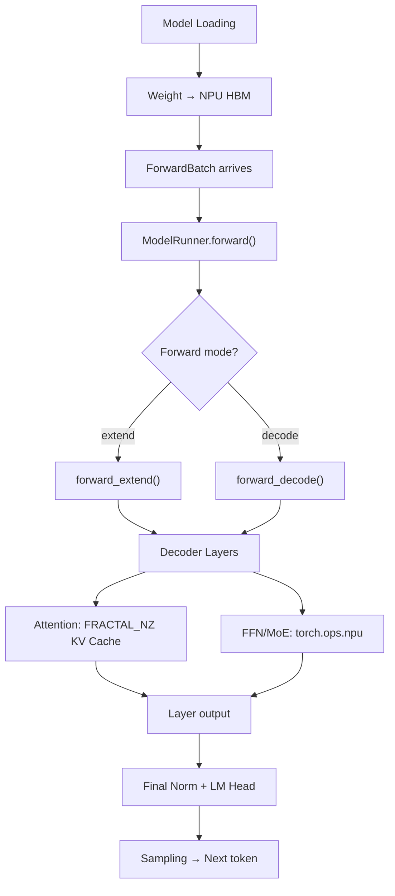

[中文](./00-glm-4.7-flash-end-to-end.md) | [English](./00-glm-4.7-flash-end-to-end_EN.md)

# GLM-4.7-Flash: End-to-End Model Execution on Ascend NPU

## 1. Model Overview

GLM-4.7-Flash is used as a concrete example to trace the complete model execution path on Ascend NPU, from model loading through attention to output.

## 2. Execution Path



## 3. Key Architecture Points

GLM-4.7-Flash architecture hits several NPU-specific paths:
- **Attention**: Uses Ascend backend with FRACTAL_NZ KV layout
- **RoPE**: Applied with NPU-specific implementation
- **RMSNorm**: Uses fused NPU norm kernels
- **FFN**: Uses `torch.ops.npu` for optimized matmul

## 4. Shape Flow

```text
Input: [B, S] token IDs
Embedding: [B, S, H]
Per layer:
  RMSNorm → [B, S, H]
  Attention → [B, S, H] (reads/writes FRACTAL_NZ KV Cache)
  RMSNorm → [B, S, H]
  FFN → [B, S, H]
Final RMSNorm → [B, S, H]
LM Head → [B, S, V] (or [B, V] for decode)
```

## 5. Architecture Diagram

See `assets/glm-4.7-flash-architecture.svg` for the detailed model architecture visualization.

## 6. Source Files

- Model definition: `python/sglang/srt/models/glm4.py`
- Attention: `python/sglang/srt/layers/attention/ascend/`
- Model loading: `python/sglang/srt/model_executor/model_runner.py`
