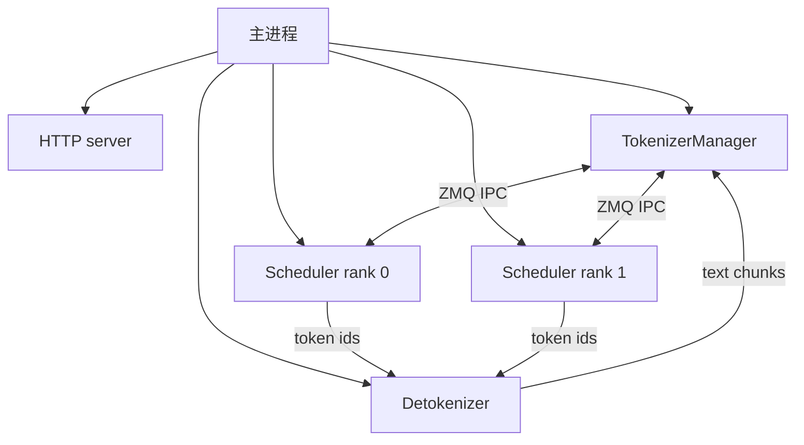
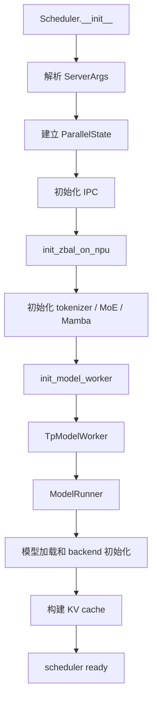

**中文** | [English](./01-platform-detection-and-process-startup_EN.md)

# 01. NPU 平台识别与进程启动

> 课程定位：本文件是公共启动链路补充材料；对应组件主课程的第 02 讲“平台、运行时与 kernel bootstrap”。主目录见[源码串讲 README](../README.md)。

本讲从 `sglang serve` 启动开始，解释 SGLang 怎样识别 Ascend NPU、何时导入 `torch_npu` 和 `sgl_kernel_npu`、怎样创建 scheduler 子进程，以及每个 TP rank 如何绑定 NPU。

## 本讲目标

- 理解 `is_npu()` 的三种结果。
- 区分“安装了 torch_npu”和“NPU 可见可用”。
- 说明 `ServerArgs.device` 如何自动确定。
- 画出 HTTP、scheduler、detokenizer 的进程关系。
- 说明 `gpu_id`、`tp_rank`、`pp_rank` 如何决定设备绑定。
- 找到 `init_npu_backend()` 的准确调用时机。

## 1. 启动入口

```bash
sglang serve \
  --model-path /workspace/sglang-npu/models/Qwen2.5-7B-Instruct \
  --device npu \
  --attention-backend ascend \
  --tp-size 1
```

兼容入口 `python -m sglang.launch_server` 最终也会进入 SRT `launch_server()`，但源码阅读以 `sglang serve` 为主。

关键文件：

```text
python/sglang/launch_server.py
python/sglang/srt/server_args.py
python/sglang/srt/entrypoints/http_server.py
python/sglang/srt/entrypoints/engine.py
python/sglang/srt/managers/scheduler.py
python/sglang/srt/managers/tp_worker.py
python/sglang/srt/model_executor/model_runner.py
```

## 2. `is_npu()` 的真实语义

核心实现位于 `python/sglang/srt/utils/common.py`：

```python
@lru_cache(maxsize=1)
def is_npu() -> bool:
    if not hasattr(torch, "npu"):
        return False

    if not torch.npu.is_available():
        raise RuntimeError(
            "torch_npu detected, but NPU device is not available or visible."
        )

    return True
```

| 环境 | 结果 | 含义 |
|---|---|---|
| `torch` 没有 `npu` 属性 | `False` | 不是 NPU Python 环境。 |
| 有 `torch.npu`，设备不可用 | 抛异常 | 依赖存在，但 driver、容器映射或可见性异常。 |
| `torch.npu.is_available()` 为真 | `True` | 可以进入 NPU 分支。 |

SGLang 故意不把“torch_npu 存在但设备不可见”当成 False，否则可能静默进入错误平台路径。

### 2.1 为什么缓存判断结果

大量模块在 import 阶段执行：

```python
_is_npu = is_npu()
```

`lru_cache(maxsize=1)` 避免重复探测，并把平台视为进程生命周期内不变。因此设备可见性必须在启动 Python 前设置；进程内后改变量不会可靠地改变已导入模块。

## 3. `ServerArgs.device` 怎样确定

`ServerArgs._handle_missing_default_values()` 执行：

```text
tokenizer_path is None -> model_path
served_model_name is None -> model_path
device is None -> get_device()
device = device.split(":")[0]
```

这里区分：

- `ServerArgs.device`：平台类型，如 `npu`。
- `gpu_id`：scheduler rank 绑定的逻辑设备编号。

即使用户传 `npu:3`，当前逻辑也会规范化成 `npu`；具体设备由 rank 映射和可见设备环境决定。

## 4. 服务进程拓扑

`http_server.launch_server()` 调用 `Engine._launch_subprocesses()`：



普通 `dp_size=1` 时，每个 TP/PP rank 启动一个 scheduler 进程。scheduler 不只是排队器，它还持有本 rank 的 `TpModelWorker`、`ModelRunner`、模型权重和 KV cache。

### 4.1 `_launch_subprocesses()` 顺序

```text
configure_logger
  -> _set_envs_and_config
  -> load_plugins
  -> server_args.check_server_args
  -> PortArgs.init_new
  -> _launch_scheduler_processes
  -> _launch_detokenizer_subprocesses
  -> init TokenizerManager
  -> 等待 scheduler ready
  -> 启动 HTTP server
```

多机时，非 0 节点一般只需要 scheduler ranks，不运行 tokenizer 和 detokenizer。

## 5. rank 到 NPU 的映射

`Engine._launch_scheduler_processes()` 计算：

```text
gpu_id = base_gpu_id
       + (pp_rank % pp_size_per_node) * tp_size_per_node
       + (tp_rank % tp_size_per_node) * gpu_id_step
```

然后启动：

```text
run_scheduler_process(
  server_args,
  port_args,
  gpu_id,
  tp_rank,
  attn_cp_rank,
  moe_dp_rank,
  moe_ep_rank,
  pp_rank,
  ...
)
```

### 5.1 单机 TP4 示例

假设：

```text
base_gpu_id = 0
gpu_id_step = 1
tp_size = 4
pp_size = 1
```

| tp_rank | gpu_id |
|---:|---:|
| 0 | 0 |
| 1 | 1 |
| 2 | 2 |
| 3 | 3 |

若外部设置：

```bash
export ASCEND_RT_VISIBLE_DEVICES=4,5,6,7
```

进程内部通常仍看到逻辑设备 0-3。因此源码里的 `gpu_id` 是当前进程设备命名空间内的编号。

## 6. Scheduler 初始化时序

`run_scheduler_process()` 创建 `Scheduler`。关键顺序：



`init_zbal_on_npu()` 在大量 torch 分配之前执行，因为 ZBAL 可能改变内存分配路径。

## 7. `init_npu_backend()` 的调用时机

`model_runner.py` 在模块 import 阶段执行：

```python
_is_npu = is_npu()

if _is_npu:
    from sglang.srt.hardware_backend.npu.utils import init_npu_backend
    init_npu_backend()
```

因此 scheduler 子进程首次导入 `ModelRunner` 时初始化 NPU backend，而不是每个请求执行一次。

`init_npu_backend()`：

1. 断言当前确实是 NPU。
2. 导入 `sgl_kernel_npu`，触发自定义 op 注册。
3. 导入 `torch_npu` 和 `transfer_to_npu`。
4. 修正 `torch.cuda.is_available()`。
5. 允许 internal format，关闭 JIT compile mode。

该函数由 `_call_once` 包装，同一进程内只真正执行一次。

### 7.1 为什么修正 `torch.cuda.is_available()`

`transfer_to_npu` 为兼容 CUDA 风格代码会 monkey patch 部分接口。SGLang 随后把 `torch.cuda.is_available` 重设为 False，防止通用分支把 NPU 误认成 CUDA。

所以看到 `cuda_graph`、`gpu_id` 等历史命名时，应继续追踪实际 platform，而不能只根据名字判断设备。

## 8. 设备内存查询

`get_available_gpu_memory()` 名字沿用 GPU 术语，但 NPU 分支调用：

```text
torch.npu.device_count
torch.npu.current_device
torch.npu.empty_cache
torch.npu.mem_get_info
```

启用 ZBAL 时可能改用 ZBAL memory info。`get_npu_memory_capacity()` 返回 MB，用于设置 chunked prefill 和 graph batch 默认值。

## 9. 启动问题映射

| 现象 | 代码阶段 | 优先检查 |
|---|---|---|
| NPU device not available/visible | `is_npu()` | 容器设备、driver、可见设备。 |
| `import sgl_kernel_npu` 失败 | `init_npu_backend()` | kernel 包和版本。 |
| scheduler 退出，HTTP 不 ready | `Scheduler`/`ModelRunner` | scheduler 子进程日志。 |
| TP rank 绑错卡 | `_launch_scheduler_processes()` | visible devices、base_gpu_id、step。 |
| 显存容量识别异常 | memory helper | `mem_get_info()`、ZBAL。 |

## 10. 最小调试实践

### 10.1 进程外检查

```bash
python3 - <<'PY'
import torch
import torch_npu

print("has torch.npu:", hasattr(torch, "npu"))
print("available:", torch.npu.is_available())
print("count:", torch.npu.device_count())
print("current:", torch.npu.current_device())
print("memory:", torch.npu.mem_get_info())
PY
```

### 10.2 SGLang 内部检查

```bash
python3 - <<'PY'
from sglang.srt.utils import get_device, get_npu_memory_capacity, is_npu

print("is_npu:", is_npu())
print("device:", get_device())
print("capacity_mb:", get_npu_memory_capacity())
PY
```

### 10.3 进程拓扑

```bash
ps -ef | grep -E "sglang|scheduler|detokenizer" | grep -v grep
npu-smi info
```

## 11. 检查题

1. 为什么 `hasattr(torch, "npu")` 为真仍可能无法启动？
2. 为什么 `ServerArgs.device` 不保留 `npu:3`？
3. TP4 时哪些对象在每个 rank 中各有一份？
4. `init_npu_backend()` 为什么在 scheduler 子进程中执行？
5. 为什么不能根据 `cuda_graph` 这个名字判断运行设备？

## 本讲小结

SGLang 的 NPU 启动不是单进程直接加载模型。主进程负责 HTTP 和 TokenizerManager，scheduler 子进程按 TP/PP rank 绑定逻辑 NPU，并在导入 ModelRunner 时初始化 `sgl_kernel_npu` 和 `torch_npu`。理解进程和设备边界，是定位“主进程正常但某个 rank 失败”的前提。
