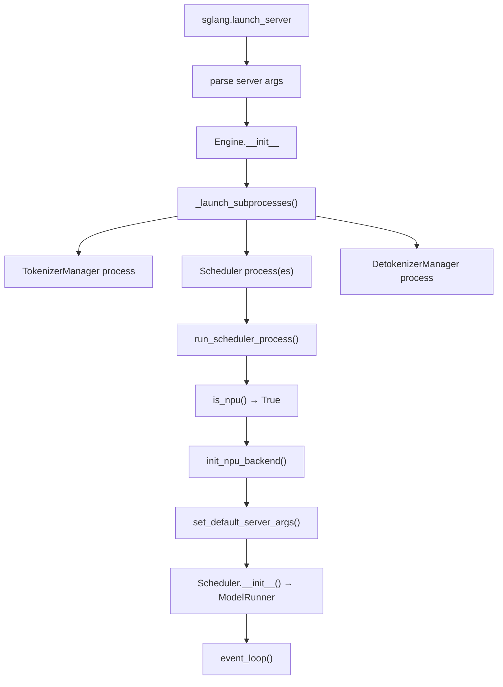

[中文](./01-platform-detection-and-process-startup.md) | [English](./01-platform-detection-and-process-startup_EN.md)

# Foundation 01: Platform Detection & Process Startup

## is_npu() Detection

```python
# srt/utils/common.py
def is_npu() -> bool:
    """Check if current device is Ascend NPU."""
    try:
        import torch_npu
        return torch_npu.npu.is_available()
    except ImportError:
        return False
```

Used throughout SGLang to branch between CUDA and NPU paths.

## Process Startup Flow



## Key Startup Checks

```python
# In Scheduler process startup
if is_npu():
    # 1. Initialize NPU runtime
    init_npu_backend()
    
    # 2. Override defaults for NPU
    set_default_server_args(args)
    
    # 3. Use Ascend-specific components
    args.attention_backend = "ascend"
    args.device = "npu"
```

## NPU Runtime Initialization

```python
def init_npu_backend():
    import torch_npu
    # Initialize NPU device
    torch_npu.npu.set_device(local_rank)
    # Set HCCL environment
    # Initialize ZBAL (Zero-Balance) memory
    init_zbal(...)
```
