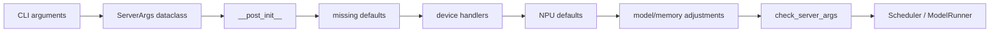
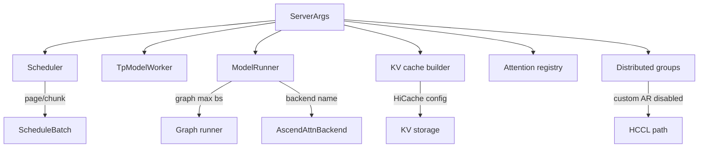

**中文** | [English](./02-server-args-and-npu-defaults_EN.md)

# 02. ServerArgs 校验与 NPU 默认参数

> 课程定位：本文件是公共参数链路补充材料；它将作为组件主课程第 02 讲的平台初始化前置知识。主目录见[源码串讲 README](../README.md)。

本讲拆解 `ServerArgs` 从 CLI 值变成最终运行配置的过程，重点解释 NPU 默认参数如何覆盖通用默认值，以及后续对象怎样使用这些结果。

## 本讲目标

- 理解 `ServerArgs.__post_init__()` 的处理顺序。
- 找到 `_handle_npu_backends()` 的调用位置。
- 逐项解释 `set_default_server_args()`。
- 区分无条件覆盖、空值补齐和特性联动。
- 学会观察 scheduler 实际收到的最终参数。

## 1. 参数生命周期



用户命令只是原始输入。传给 scheduler 的是多轮规范化和校验后的 `ServerArgs`。

## 2. `__post_init__()` 的关键顺序

当前主线：

```text
早期通用校验
  -> PD 参数校验
  -> deprecated 参数处理
  -> _handle_missing_default_values
  -> HPU/CPU/NPU/MPS/XPU handlers
  -> OOT platform defaults
  -> piecewise graph 处理
  -> 获取设备内存容量
  -> 通用显存/chunk/graph 配置
  -> 模型专用调整
  -> 特性联动和最终校验
```

顺序的重要性：

- 先确定 `device`，才能进入 `_handle_npu_backends()`。
- NPU handler 设置一批字段后，通用 memory/model handler 仍可能调整。
- 所以字段最终值不能只看 `set_default_server_args()`，还要继续搜索后续赋值。

## 3. `_handle_missing_default_values()`

与 NPU 相关的处理：

```text
tokenizer_path is None -> model_path
served_model_name is None -> model_path
device is None -> get_device()
device = device.split(":")[0]
random_seed is None -> 随机 seed
```

`_handle_npu_backends()` 判断 `self.device == "npu"`，所以 `npu:0` 必须先规范化。具体卡号交给 scheduler 的 rank 映射。

## 4. `_handle_npu_backends()`

核心逻辑：

```python
if self.device == "npu":
    from sglang.srt.hardware_backend.npu.utils import set_default_server_args
    set_default_server_args(self)

    if self.piecewise_cuda_graph_compiler != "eager":
        self.piecewise_cuda_graph_compiler = "eager"
```

它完成：

1. 调用 NPU utility 设置平台默认值。
2. 把当前 Ascend piecewise graph compiler 限制为 `eager`。

名称仍含 CUDA 不代表在 NPU 上无效，必须看 platform handler。

## 5. `set_default_server_args()` 逐项讲解

### 5.1 Attention backend：无条件覆盖

```python
args.attention_backend = "ascend"
args.prefill_attention_backend = "ascend"
args.decode_attention_backend = "ascend"
```

这是无条件赋值。当前 NPU 主路径要求 Ascend attention。

调用链：

```text
ServerArgs._handle_npu_backends
  -> set_default_server_args
  -> attention_backend = "ascend"
  -> ModelRunner.init_attention_backend
  -> ATTENTION_BACKENDS["ascend"]
  -> AscendAttnBackend
```

因此命令不写 `--attention-backend ascend` 也会进入 Ascend；显式写只是让意图更清晰。

### 5.2 Page size：只在空值时补齐

```python
if args.page_size is None:
    args.page_size = 128
```

page size 影响 KV page 粒度、slot mapping、page table、内存碎片和调度容量。

用户显式值会保留，但不代表任意值都被所有 Ascend kernel 支持；后续仍有 backend 和模型校验。

### 5.3 按 NPU 容量设置 chunked prefill

容量来源：

```text
get_npu_memory_capacity
  -> torch.npu.mem_get_info()[1]
  -> 转换为 MB
```

| NPU 容量 | chunked prefill 默认值 |
|---:|---:|
| `<= 32 GiB` | 4096 tokens |
| `<= 64 GiB` | 8192 tokens |

只有 `chunked_prefill_size is None` 时设置。大 chunk 提高单次工作量和峰值显存；小 chunk 更容易交错 decode，但会增加调度和 launch 次数。

### 5.4 Graph batch 上限

| 容量 | `tp_size < 4` | `tp_size >= 4` |
|---:|---:|---:|
| `<= 32 GiB` | 16 | 64 |
| `<= 64 GiB` | 64 | 256 |

字段名是 `cuda_graph_max_bs`，在 NPU 上映射到 NPU graph 语义。只有空值时补齐，可显式覆盖，但必须验证 capture 和显存。

### 5.5 禁用 CUDA CustomAllReduce

```python
args.disable_custom_all_reduce = True
```

这是无条件覆盖。它只禁用 CUDA 专用 custom implementation，不是禁用全部 all-reduce。Ascend TP 仍通过 HCCL/NPU communicator 通信。

### 5.6 HiCache 联动

开启 hierarchical cache 后：

```text
hicache_io_backend = kernel_ascend
MLA 模型  -> page_first_kv_split
非 MLA    -> page_first_direct
```

模型 attention 架构会影响 KV cache layout，说明这些参数不能孤立理解。

## 6. 三种覆盖语义

| 类型 | 例子 | 用户值是否保留 |
|---|---|---|
| 无条件覆盖 | attention backend、disable custom AR | 否 |
| 空值补齐 | page、chunked prefill、graph max bs | 是 |
| 特性联动 | HiCache backend/layout | 开启特性时覆盖 |

阅读默认值函数时，先判断属于哪种语义。

## 7. NPU handler 之后的继续处理

### 7.1 Piecewise graph

`_handle_piecewise_cuda_graph()` 把 NPU 列入自动禁用 piecewise CUDA graph 的非 CUDA 平台。不要把 NPU graph、piecewise CUDA graph 和 torch compile 当成一个开关。

### 7.2 模型专用覆盖

例如 diffusion LLM 在 NPU 上会再次确保 attention backend 为 `ascend`。量化、模型结构和特性组合也可能继续修改字段。

### 7.3 最终校验

`Engine._launch_subprocesses()` 还会调用：

```python
server_args.check_server_args()
```

dataclass 构造成功不等于运行配置最终有效。

## 8. 参数流向



## 9. 查看最终参数

### 9.1 直接构造

```bash
python3 - <<'PY'
from sglang.srt.server_args import ServerArgs

args = ServerArgs(
    model_path="/workspace/sglang-npu/models/Qwen2.5-7B-Instruct",
    device="npu",
    tp_size=1,
)

for name in [
    "device",
    "attention_backend",
    "prefill_attention_backend",
    "decode_attention_backend",
    "page_size",
    "chunked_prefill_size",
    "cuda_graph_max_bs",
    "disable_custom_all_reduce",
    "piecewise_cuda_graph_compiler",
]:
    print(name, getattr(args, name))
PY
```

构造过程可能读取模型 config 和设备内存，要在真实 NPU 环境执行。

### 9.2 启动日志

`Engine._launch_subprocesses()` 会打印完整 `server_args`。正式测试时保存这段日志，不要只保存命令行。

## 10. 参数对比实验

建议三组：

```text
A: 只传 --device npu
B: 显式传 page/chunk/graph 参数
C: 开启 hierarchical cache
```

```bash
grep -E "attention_backend|page_size|chunked_prefill_size|cuda_graph_max_bs|hicache" \
  /workspace/sglang-npu/logs/*.log
```

预期：attention backend 始终为 ascend；page/chunk/graph 显式值保留；HiCache 开启后 backend/layout 切为 Ascend 配置。

## 11. 常见误区

### 命令行没写，所以 backend 没设置

错误。NPU handler 会自动设置。

### `disable_custom_all_reduce=True` 表示 TP 不通信

错误。它只排除 CUDA custom implementation。

### 带 CUDA 名字的参数在 NPU 上无效

错误。很多通用接口沿用历史命名，要看实际 runner/platform 分支。

### `set_default_server_args()` 产生最终值

不一定。后续 model/memory/feature handler 仍可能调整。

## 12. 检查题

1. 哪三个 attention 字段会无条件设为 `ascend`？
2. page size 和 chunked prefill 的覆盖语义有何共同点？
3. 64 GiB NPU、TP4 时默认 graph max batch 是多少？
4. 为什么 HiCache layout 区分 MLA 和非 MLA？
5. 如何证明 scheduler 收到的参数不是原始命令行值？

## 本讲小结

NPU 参数不是静态默认值表，而是一条有顺序的处理流水线。先补齐 device，再进入 NPU handler，随后还有 graph、内存、模型和特性联动。阅读时必须区分无条件覆盖、空值补齐和条件联动，并以 scheduler 实际收到的最终 `ServerArgs` 为准。
