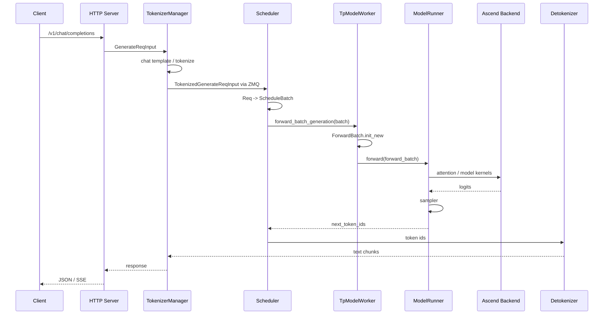
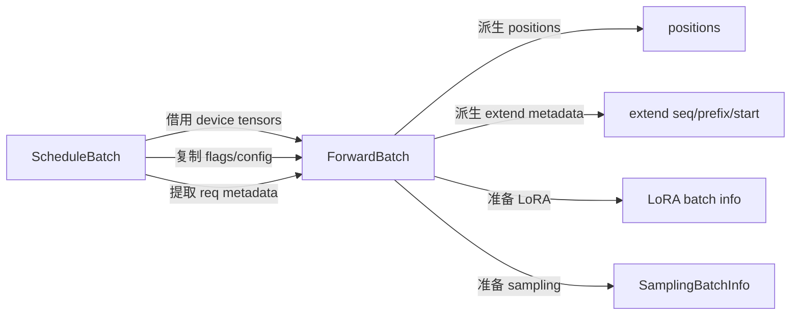
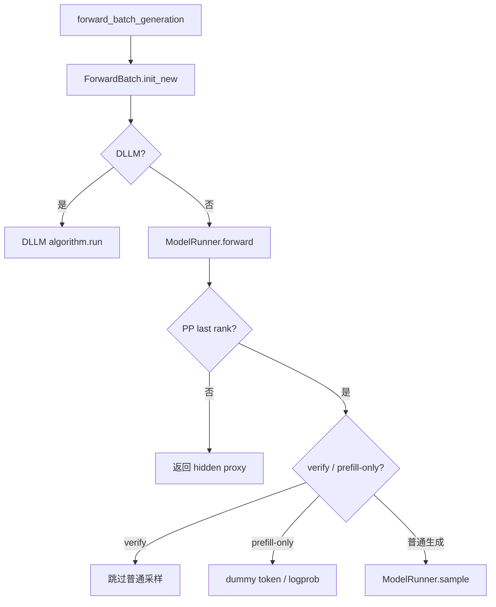

# 03. 请求主链路中的 NPU 接入点

> 课程定位：本文件是公共请求链路补充材料。组件主课程会从这里标出的分支点，继续深入各 backend 与 kernel。主目录见[源码串讲 README](../README.md)。

本讲从一个 OpenAI-compatible 请求开始，追踪它经过 TokenizerManager、Scheduler、ScheduleBatch、TpModelWorker、ForwardBatch、ModelRunner、sampler 和 detokenizer 的完整路径，并标出 Ascend NPU 真正接管执行的位置。

## 本讲目标

- 区分通用 serving 控制面和 NPU 数据面。
- 解释为什么 Scheduler 子进程持有模型 worker。
- 说明 `ScheduleBatch` 和 `ForwardBatch` 的职责差异。
- 找到 eager/graph、prefill/decode、generation/embedding 的分支点。
- 建立精度和性能问题对应的观测位置。

## 1. 请求全链路



主链路大部分是通用 SGLang。NPU 分支集中在：

- ServerArgs 和设备初始化。
- ModelRunner 的 device/stream/distributed/backend。
- attention、基础 layer、quant/MoE/LoRA kernel。
- graph replay。
- HCCL 和 NPU communicator。

## 2. HTTP 到 TokenizerManager

HTTP 层负责协议转换，不执行模型。它把 OpenAI 请求转换为 SGLang 内部 input object，再调用：

```text
TokenizerManager.generate_request(...)
```

TokenizerManager 处理：

- chat template。
- tokenizer encode。
- multimodal processor。
- sampling 参数规范化。
- request id 和流式状态。
- 向 scheduler 发送 tokenized object。

发送点：

```python
self.send_to_scheduler.send_pyobj(tokenized_obj)
```

这里使用 ZMQ IPC，说明 tokenization 和设备 forward 不在同一个进程。

### 2.1 这一层是否有 NPU 分支

普通文本 tokenization 基本与设备无关。多模态 processor 可能有 NPU 特殊处理，但语言模型的 input ids 仍先在 CPU 侧产生。

精度问题若在 token ids 阶段已经不一致，应先查 chat template/tokenizer，不要进入 NPU kernel 排查。

## 3. Scheduler 接收请求

Scheduler 维护：

- waiting queue。
- running batch。
- radix/prefix cache。
- token/KV 内存池。
- prefill/decode 调度策略。
- overlap stream 和 future map。
- PD、speculative、LoRA 等状态。

请求进入后先成为内部 `Req`，再被调度器组织为 `ScheduleBatch`。

### 3.1 Scheduler 为什么持有 worker

`Scheduler.__init__()` 依次建立 ParallelState、IPC、NPU 内存环境、ModelWorker 和 KV cache。因此每个 scheduler rank 同时是：

- 调度执行者。
- 本 rank 模型执行进程。
- 本 rank KV cache 所有者。

这解释了为什么设备 OOM、kernel error 通常出现在 scheduler 子进程日志。

## 4. `ScheduleBatch` 的职责

`ScheduleBatch` 定义在 `managers/schedule_batch.py`，属于调度层。它包含：

- `reqs`：请求对象列表。
- waiting/running 相关状态。
- prefix/extend/decode 长度。
- KV pool indices 和输出 cache location。
- sampling info。
- speculative/LoRA/multimodal 信息。
- overlap schedule 暂存状态。

它会经历：

```text
prepare_for_extend()  # prefill/extend
prepare_for_decode()  # 下一 token decode
filter_batch / merge_batch / retract
```

### 4.1 Prefill/extend

extend batch 需要准备：

- 每个请求已有 prefix 长度。
- 本次新输入 token 数。
- flattened input ids。
- extend start location。
- 新 KV slot。

### 4.2 Decode

decode batch 通常每个请求输入一个新 token，并更新：

- `seq_lens`。
- `input_ids`。
- `out_cache_loc`。
- request/KV pool mapping。

## 5. `ScheduleBatch -> ForwardBatch`

worker 边界调用：

```python
forward_batch = ForwardBatch.init_new(batch, self.model_runner)
```

这一步是控制面到模型执行面的关键转换。



### 5.1 为什么不让模型直接读取 ScheduleBatch

`ScheduleBatch` 包含大量调度期可变状态，不适合被 graph capture 和模型层长期引用。`ForwardBatch` 只暴露本次 forward 需要的字段，并建立设备 tensor。

### 5.2 `init_new()` 的重要行为

- 消费一次性的 hidden capture override。
- 区分 decode/idle 与 extend 字段。
- 更新 grammar 到 sampling info。
- 建立 CPU seq length mirror。
- 复制/借用 input ids、seq lens、pool indices、cache loc。
- 计算 position。
- 把 extend lens/prefix lens 搬到设备。
- 准备 LoRA batch。
- 构造 speculative/multimodal metadata。

## 6. TpModelWorker 分支

入口：

```text
TpModelWorker.forward_batch_generation
```

主要分支：



NPU 不改变这套高层逻辑。变化发生在 ModelRunner 内部 backend 和 sampler 实现。

## 7. ModelRunner 的执行分支

`ModelRunner.forward()` 先建立 profiler/canary/expert recorder context，再进入 `_forward_raw()`。

`_forward_raw()`：

```text
发布 ForwardContext(attn_backend)
  -> 判断 graph runner 是否可运行
  -> graph replay（若命中）
  -> 否则准备 TP/MLP metadata
  -> 按 forward_mode 分支
       decode -> forward_decode
       split prefill -> forward_split_prefill
       extend -> forward_extend
       idle -> forward_idle
```

### 7.1 graph 分支

```python
can_run_graph = mode_check() and self.graph_runner and self.graph_runner.can_run(...)
```

如果命中，模型不会走普通 eager forward，而是 `graph_runner.replay()`。因此“eager 正确、graph 错误”时，分叉点就在这里。

### 7.2 prefill/decode 分支

`ForwardMode` 决定：

- attention metadata 类型。
- position 和输入 token 形态。
- KV cache 读写方式。
- 是否可以 graph replay。

## 8. Ascend backend 在哪里接管

ModelRunner 初始化时已根据 registry 创建 `AscendAttnBackend`。请求期：

```text
ModelRunner.forward_extend/forward_decode
  -> attn_backend.init_forward_metadata
  -> model.forward(input_ids, positions, forward_batch)
  -> 每层 RadixAttention
  -> 当前 ForwardContext 中的 Ascend backend
  -> Ascend attention kernel
```

除此之外，模型层中的 RoPE、Norm、activation、quant linear、MoE、LoRA 也可能通过 `is_npu()` 或 method registry 进入专用 op。

## 9. Sampling 与结果返回

最后一个 PP rank 得到 logits 后：

```text
ModelRunner._preprocess_logits
  -> grammar mask / logits bias
  -> self.sampler(...)
  -> next_token_ids
```

Ascend sampler 可能直接处理 logits，并调用 NPU top-k/top-p 算子。

Scheduler 收到 `GenerationBatchResult` 后：

- 更新请求 output ids。
- 更新 cache 和 batch 状态。
- 把 token 发送到 detokenizer。
- 决定请求结束、继续 decode 或被调度出去。

## 10. Overlap schedule

开启 overlap 时：

- schedule stream 准备下一批。
- forward stream 执行当前 batch。
- `future_map` 传递下一 token 和未来 seq length。
- sampling 可能延迟执行。

NPU 问题定位时，若普通模式正确、overlap 模式错误，要重点看：

- stream wait。
- tensor 生命周期。
- ScheduleBatch 隔离与恢复。
- future_map 中 input ids/seq lens。

## 11. 问题到观测点的映射

| 现象 | 第一观测点 |
|---|---|
| prompt/token ids 不一致 | TokenizerManager 输出对象。 |
| 单请求正确、混 batch 错 | ScheduleBatch 和 ForwardBatch 字段。 |
| 首 token 错 | extend metadata、prefill attention、position。 |
| 后续 token 错 | decode KV slot、seq lens、sampler。 |
| graph off 正确 | `_forward_raw()` 的 graph 分支。 |
| TP1 正确、TPN 错 | ParallelState、rank tensor、collective。 |
| 输出 token 正确、文本错 | Detokenizer。 |

## 12. 最小追踪实践

使用固定 greedy 请求：

```bash
curl http://127.0.0.1:8000/v1/chat/completions \
  -H "Content-Type: application/json" \
  -d '{
    "model": "Qwen2.5-7B-Instruct",
    "messages": [{"role": "user", "content": "只输出数字 5：2+3 等于多少？"}],
    "temperature": 0,
    "max_tokens": 8,
    "stream": false
  }'
```

推荐断点顺序：

```text
TokenizerManager._send_one_request
Scheduler.run_batch
ForwardBatch.init_new
TpModelWorker.forward_batch_generation
ModelRunner._forward_raw
ModelRunner.sample
```

不要在所有 layer 同时打印 tensor；先确认在哪个边界开始不一致。

## 13. 检查题

1. `ScheduleBatch` 为什么不能直接作为模型 forward 参数？
2. `ForwardBatch.positions` 在哪里派生？
3. graph replay 在 ModelRunner 哪个分支决定？
4. sampling 为什么只在最后一个 PP rank 执行？
5. 单请求正确、并发错误时应先检查哪两个对象？

## 本讲小结

SGLang 的通用控制面负责把请求变成稳定的设备执行描述，Ascend backend 接管的是 ModelRunner 之后的设备路径。最关键的边界是 `ScheduleBatch -> ForwardBatch`：调度状态在这里被筛选、转换和搬到 NPU。精度和性能问题定位应先找出差异出现在哪个边界，再深入具体 kernel。
