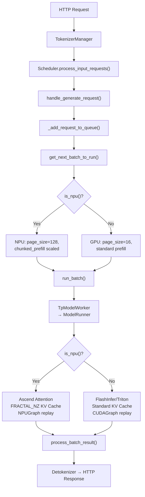

[中文](./03-request-lifecycle-npu-branch-points.md) | [English](./03-request-lifecycle-npu-branch-points_EN.md)

# Foundation 03: Request Lifecycle NPU Branch Points

## Annotated Lifecycle with NPU Branches



## Key NPU Branch Points

| Stage | What's NPU-Specific | Source |
|---|---|---|
| Startup | `is_npu()` detection, `init_npu_backend()` | `utils.py` |
| Config | `set_default_server_args()` overrides | `utils.py` |
| Scheduling | `page_size=128`, adjusted chunk sizes | `scheduler.py` |
| Attention | `AscendAttnBackend`, FRACTAL_NZ | `layers/attention/ascend/` |
| Graph | `NPUGraph` instead of `CUDAGraph` | `npu_piecewise_backend.py` |
| Communication | `hccl` instead of `nccl` | `parallel_state.py` |
| Kernels | `torch.ops.npu`, `sgl_kernel_npu` | Various |
| Transfer | `AscendTransferEngine` | `disaggregation/ascend/` |

## NPU Branch Detection Pattern

```python
# Pattern 1: Conditional import
if is_npu():
    from sglang.srt.hardware_backend.npu import init_npu_backend

# Pattern 2: Conditional execution
if is_npu():
    backend = "hccl"
else:
    backend = "nccl"

# Pattern 3: Feature toggle
self.use_npu_graph = is_npu() and args.enable_graph
```
