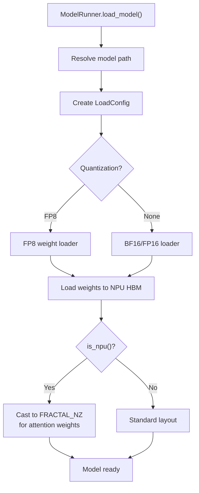

[中文](./04-model-loading-dtype-and-layout.md) | [English](./04-model-loading-dtype-and-layout_EN.md)

# Foundation 04: Model Loading, Dtype & Layout

## NPU Model Loading Flow



## Dtype Handling

| Stage | GPU | NPU |
|---|---|---|
| Weight storage | BF16/FP16 | BF16/FP16 (same) |
| KV Cache | BF16/FP8 | BF16/FP8 + FRACTAL_NZ layout |
| Attention compute | BF16/FP16 | BF16/FP16 (Cube Unit optimized) |
| Format conversion | Minimal | FRACTAL_NZ for matmul efficiency |

## Tensor Layout: FRACTAL_NZ

```text
Standard NCHW: [N, C, H, W] — channels, height, width in natural order
FRACTAL_NZ:    [N, C1, H, W, C0] — fractal-decomposed for Da Vinci Cube Unit

Why FRACTAL_NZ:
- Cube Unit computes 16×16 matrix blocks most efficiently
- FRACTAL_NZ arranges data so each 16×16 block is contiguous in memory
- Reshuffling happens once at load time, not per forward
```

## Format Cast Management

```python
# In hardware_backend/npu/utils.py
def npu_format_cast(tensor, target_format):
    """Cast tensor to target Ascend format."""
    if tensor.format == target_format:
        return tensor
    return torch_npu.npu_format_cast(tensor, target_format)
```

Format casts should be:
- Done once at model loading (not per forward)
- Used for weights that participate in Cube Unit matmuls
- Avoided for small tensors where overhead exceeds benefit
