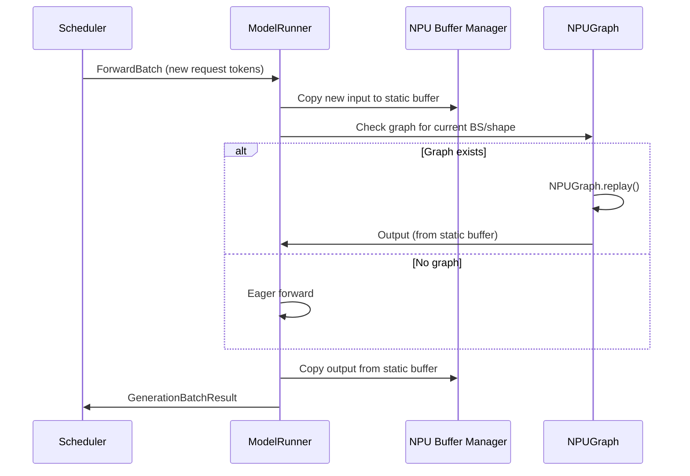

[中文](./05-model-runner-forward-batch-and-input-buffers.md) | [English](./05-model-runner-forward-batch-and-input-buffers_EN.md)

# Foundation 05: ModelRunner Forward, Batch & Input Buffers

## ForwardBatch on NPU

```python
class ForwardBatch:
    # NPU-specific fields
    input_ids: Tensor       # [T] packed token IDs
    positions: Tensor       # [T] position indices
    out_cache_loc: Tensor   # Where to write KV Cache (FRACTAL_NZ slots)
    seq_lens: Tensor        # Per-request sequence lengths
    req_to_token: Tensor    # Request → token slot mapping
    sampling_info: ...      # Temperature, top-p, etc.
```

## ModelRunner Forward Dispatch

```python
def forward(self, forward_batch):
    # Try NPU graph replay (fast path)
    if self.use_npu_graph:
        graph = self.get_npu_graph(forward_batch)
        if graph:
            return self._forward_via_npu_graph(forward_batch, graph)
    
    # Eager fallback
    return self._forward_raw(forward_batch)

def _forward_raw(self, forward_batch):
    if forward_batch.forward_mode.is_extend():
        return self.forward_extend(forward_batch)
    elif forward_batch.forward_mode.is_decode():
        return self.forward_decode(forward_batch)
    # ...
```

## NPU Input Buffer Management

```python
# Static buffers for graph replay
class NPUBufferManager:
    def __init__(self):
        self.input_buffers = {}    # Pinned NPU memory
        self.output_buffers = {}   # Pinned NPU memory
    
    def get_input_buffer(self, shape, dtype):
        key = (shape, dtype)
        if key not in self.input_buffers:
            self.input_buffers[key] = torch.empty(
                shape, dtype=dtype, device="npu"
            )
        return self.input_buffers[key]
```

## NPU Graph Replay With Buffers



## Performance Considerations

| Aspect | GPU (CUDA) | NPU (Ascend) |
|---|---|---|
| Buffer pinning | CUDA-pinned memory | NPU-pinned (ZBAL) |
| Graph memory | CUDAGraph pool | NPUGraph pool |
| Format overhead | None | FRACTAL_NZ cast (once at load) |
| Stream count | Multiple CUDA streams | Multiple NPU streams |
| Buffer reuse | Standard | FRACTAL_NZ-compatible shapes |
