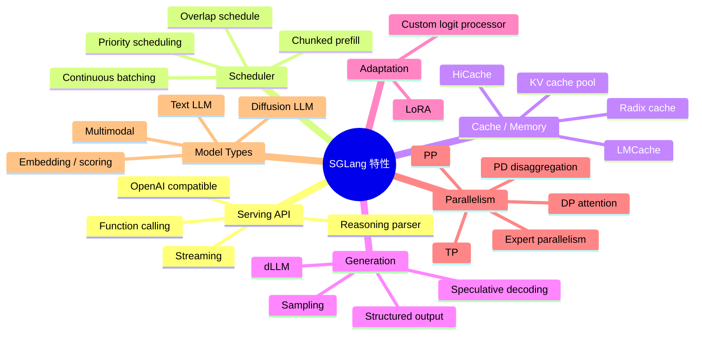
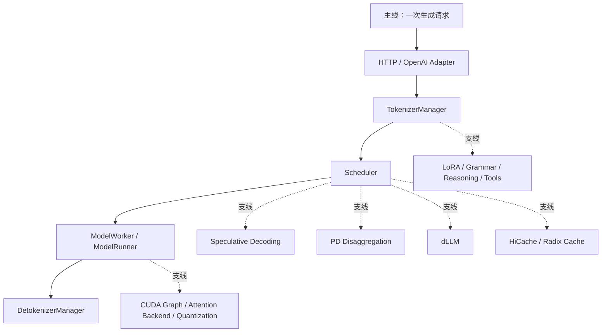
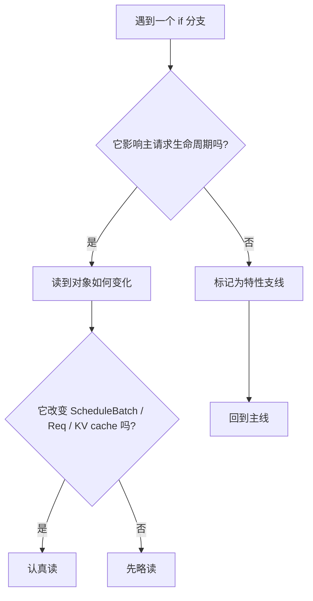

# SGLang 特性地图：读源码前先认识这些分支

这份文档不是用户手册，而是“读源码词典”。你在看 SGLang 源码时，经常会遇到 `dllm_config is not None`、`disaggregation_mode == PREFILL`、`enable_overlap`、`spec_algorithm`、`enable_hierarchical_cache` 这类分支。它们不是主链，但会频繁插进主链。

本讲目标：先知道这些特性分别解决什么问题、会影响哪条路径、第一次读源码时能不能先跳过。每个源码定位都给到具体函数、类或代码段，而不是只给文件。

## 总览图

## 主线与支线

第一次读源码时，先走实线。虚线分支先知道“它为什么存在”，不急着逐行读。

## 特性源码定位表

| 特性 | 解决的问题 | 具体源码定位 | 第一遍怎么读 |
|---|---|---|---|
| Continuous batching | 动态维护 `running_batch`，让新请求可插入 prefill | `python/sglang/srt/managers/scheduler.py` / `Scheduler.get_next_batch_to_run()`；`Scheduler.get_new_batch_prefill()`；`Scheduler.update_running_batch()`；`python/sglang/srt/managers/schedule_batch.py` / `ScheduleBatch.prepare_for_extend()`、`prepare_for_decode()` | 不能跳过，这是 Scheduler 骨架。 |
| Chunked prefill | 长 prompt 分块，降低一次性 KV 和 GPU 时间峰值 | `python/sglang/srt/server_args.py` / `ServerArgs` 中 `chunked_prefill_size`、`enable_dynamic_chunking` 字段；`python/sglang/srt/managers/scheduler.py` / `Scheduler.init_chunked_prefill()`、`Scheduler._get_new_batch_prefill_raw()`；`python/sglang/srt/managers/schedule_batch.py` / `Req.set_extend_input_len()`、`ScheduleBatch.prepare_for_extend()` | 先知道它会改变 `extend_input_len` 和 prefill batch 形态。 |
| Radix cache | 复用相同 prompt prefix 的 KV cache | `python/sglang/srt/mem_cache/registry.py` / `create_tree_cache()`、`default_radix_cache_factory()`；`python/sglang/srt/mem_cache/radix_cache.py` / `RadixCache.match_prefix()`、`insert()`、`cache_unfinished_req()`；`python/sglang/srt/managers/schedule_policy.py` / `match_prefix_for_req()` | 不能完全跳过，至少理解 `prefix_indices`。 |
| HiCache | 把 KV cache 扩展到 host/storage 层级 | `python/sglang/srt/server_args.py` / `enable_hierarchical_cache`、`hicache_*` 字段；`python/sglang/srt/mem_cache/registry.py` / `default_radix_cache_factory()`；`python/sglang/srt/mem_cache/hiradix_cache.py` / `HiRadixCache` 相关 match/load-back 方法；`python/sglang/srt/mem_cache/hybrid_cache/hybrid_cache_controller.py` / hybrid cache controller 的 load/evict 方法 | 可以先当成增强版 `tree_cache`。 |
| PD disaggregation | Prefill 和 decode 分离部署，中间传 KV | `python/sglang/srt/disaggregation/utils.py` / `DisaggregationMode`；`python/sglang/srt/server_args.py` / `disaggregation_mode`、`bootstrap_*` 字段；`python/sglang/srt/disaggregation/prefill.py` / prefill worker 处理入口；`python/sglang/srt/disaggregation/decode.py` / decode worker 处理入口；`python/sglang/srt/disaggregation/common/conn.py` 和 `base/conn.py` / KV transfer connection 抽象 | 非分布式阅读可先跳过。 |
| dLLM | 支持 diffusion-style LLM，不按普通 next-token loop 生成 | `python/sglang/srt/dllm/config.py` / `DllmConfig`；`python/sglang/srt/dllm/mixin/scheduler.py` / dLLM scheduler mixin 的 batch 构造和结果处理；`python/sglang/srt/models/sdar.py` / `SDARForCausalLM`、`SDARMoeForCausalLM`；`python/sglang/srt/managers/scheduler.py` / `dllm_config` 分支 | 普通 LLM 主线先跳过。 |
| Speculative decoding | draft 模型先猜 token，target 模型验证 | `python/sglang/srt/speculative/spec_info.py` / `SpeculativeAlgorithm`、spec info classes；`python/sglang/srt/speculative/eagle_worker.py` / EAGLE worker；`python/sglang/srt/speculative/eagle_worker_v2.py` / v2 worker；`python/sglang/srt/speculative/ngram_worker.py` / N-gram draft；`python/sglang/srt/managers/scheduler_components/batch_result_processor.py` / spec result acceptance 逻辑 | 读普通生成时沿 `spec_algorithm.is_none()` 分支走。 |
| Overlap schedule | CPU 调度/结果处理和 GPU forward 流水重叠 | `python/sglang/srt/server_args.py` / `disable_overlap_schedule`、`enable_two_batch_overlap` 字段；`python/sglang/srt/managers/scheduler.py` / `Scheduler.init_overlap()`、`event_loop_overlap()`、`record_batch_in_overlap()`；`python/sglang/srt/model_executor/model_runner.py` / `ModelRunner.update_decode_attn_backend()` | 先读 `event_loop_normal()`，再回来读 overlap。 |
| CUDA graph | 复用固定形状 GPU 执行图，降低 launch overhead | `python/sglang/srt/server_args.py` / `cuda_graph_max_bs` 等字段；`python/sglang/srt/model_executor/model_runner.py` / `ModelRunner.init_device_graphs()`、`init_piecewise_cuda_graphs()`、`_forward_raw()` 中 `graph_runner.replay` 分支 | 可以先跳过，保留“decode 优化路径”的印象。 |
| Structured output / Grammar | JSON schema、regex、EBNF 等约束输出 | `python/sglang/srt/server_args.py` / `grammar_backend` 字段；`python/sglang/srt/constrained/xgrammar_backend.py` / `XGrammarGrammarBackend` 的 compile/mask 逻辑；`python/sglang/srt/entrypoints/openai/protocol.py` / request 的 `response_format` 字段；`python/sglang/srt/sampling` / sampler 应用 grammar mask 的代码段 | 读 chat conversion 时会遇到，可以先理解为“采样前 mask 词表”。 |
| Reasoning parser | 分离 reasoning 内容和最终答案 | `python/sglang/srt/server_args.py` / `reasoning_parser` 字段；`python/sglang/srt/entrypoints/openai/serving_chat.py` / `_get_reasoning_from_request()`、`_process_reasoning_stream()`；`python/sglang/srt/parser/reasoning_parser.py` / reasoning parser 基类和实现 | 普通文本生成可先跳过。 |
| Function calling | 将模型输出解析成工具调用 | `python/sglang/srt/entrypoints/openai/serving_chat.py` / `_process_messages()`、`_process_tool_calls()`、`_process_tool_call_stream()`；`python/sglang/srt/function_call/function_call_parser.py` / parser 入口；`python/sglang/srt/function_call/*_detector.py` / 各模型 tool call detector | 读 `/v1/chat/completions` 时常见。 |
| LoRA | 同一个 base model 上动态加载 adapter | `python/sglang/srt/server_args.py` / `enable_lora`、`lora_*` 字段；`python/sglang/srt/lora/lora_manager.py` / LoRA manager；`python/sglang/srt/entrypoints/openai/serving_base.py` / `_resolve_lora_path()`；`python/sglang/srt/managers/scheduler.py` / `_can_schedule_lora_req()`、`load_lora_adapter()`、`unload_lora_adapter()` | 先理解为调度时多了 adapter 混批约束。 |
| Multimodal | 支持图片、视频、音频输入 | `python/sglang/srt/entrypoints/openai/serving_chat.py` / `_process_messages()`、`_encode_messages()`；`python/sglang/srt/managers/tokenizer_manager.py` / `_prepare_tokenizer_input()`、`_batch_tokenize_and_process()`；`python/sglang/srt/managers/schedule_batch.py` / `MultimodalInputs`、`MultimodalDataItem` | 纯文本主线可沿非 multimodal 分支走。 |
| Tensor parallel | 单层矩阵计算切到多卡 | `python/sglang/srt/managers/tp_worker.py` / `TpModelWorker.__init__()`、`_init_model_runner()`、`forward_batch_generation()`；`python/sglang/srt/model_executor/model_runner.py` / `ModelRunner.init_torch_distributed()` | 单卡阅读时只需知道 worker 边界。 |
| Pipeline parallel | 不同层放在不同 GPU/节点形成流水 | `python/sglang/srt/managers/scheduler_pp_mixin.py` / PP mixin 中 microbatch 调度方法；`python/sglang/srt/model_executor/model_runner.py` / PP 相关 forward 分支；`python/sglang/srt/model_executor/forward_batch_info.py` / `PPProxyTensors` | 可以跳过，除非专门读多卡。 |
| DP attention | Data parallel 下的 attention 同步和路由 | `python/sglang/srt/server_args.py` / `enable_dp_attention` 字段；`python/sglang/srt/managers/scheduler_components/dp_attn.py` / DP attention adapter；`python/sglang/srt/managers/scheduler.py` / `init_dp_attn_adapter()` | 可以跳过。 |
| Expert parallel / EPLB | MoE expert 分布与负载均衡 | `python/sglang/srt/server_args.py` / expert parallel 与 EPLB 字段；`python/sglang/srt/eplb` / expert load balance controller；`python/sglang/srt/layers/moe` / MoE layer 和 runner；`python/sglang/srt/model_executor/model_runner.py` / `update_expert_location()` | 读 dense LLM 时跳过。 |
| Quantization 与 kernel backend | 选择量化、attention backend、sampling backend、MoE backend | `python/sglang/srt/server_args.py` / `quantization`、`kv_cache_dtype`、`attention_backend` 字段；`python/sglang/srt/model_executor/model_runner.py` / `configure_kv_cache_dtype()`、`init_attention_backend()`、`_get_attention_backend_from_str()`；`python/sglang/srt/layers/quantization` / quant method classes；`python/sglang/srt/layers/attention` / backend classes | 性能专题再读。 |
| Embedding / scoring / rerank | 非生成式请求，不走完整 decode loop | `python/sglang/srt/entrypoints/openai/serving_embedding.py` / embedding serving handler；`python/sglang/srt/entrypoints/openai/serving_score.py` / score handler；`python/sglang/srt/entrypoints/openai/serving_rerank.py` / rerank handler；`python/sglang/srt/managers/scheduler.py` / `handle_embedding_request()`、`handle_batch_embedding_request()` | 只研究 chat completion 时先关注 `GenerateReqInput`。 |

## 常见分支速查表

| 代码标志 | 大概含义 | 第一遍读主线怎么处理 |
|---|---|---|
| `self.dllm_config is not None` | Diffusion LLM 特殊路径 | 跳过，走普通 LLM 分支 |
| `disaggregation_mode != NULL` | Prefill/Decode 分离部署 | 跳过，走 unified 模式 |
| `not spec_algorithm.is_none()` | Speculative decoding | 跳过，走 non-spec 分支 |
| `enable_hierarchical_cache` | HiCache 分层缓存 | 当成增强版 radix cache |
| `disable_radix_cache` | 关闭 prefix cache | 理解为不复用前缀 |
| `chunked_req is not None` | 长 prompt 被切块 | 先理解为 prefill 没做完 |
| `enable_overlap` | CPU/GPU 流水重叠 | 先读 non-overlap 分支 |
| `can_run_cuda_graph` | 可复用 CUDA graph | 先读普通 forward |
| `enable_lora` | adapter serving | 先理解为调度多一个约束 |
| `req.grammar is not None` | 结构化输出约束 | 先理解为采样前 mask 词表 |
| `model_config.is_multimodal` | 多模态模型 | 纯文本阅读时跳过 |
| `is_generation` | 生成 vs embedding/scoring | chat completion 走生成分支 |

## 推荐阅读策略

建议顺序：

1. 先读普通文本生成、非 spec、非 disagg、非 dLLM、非 LoRA、非 multimodal。
2. 第二遍读 Scheduler 和 KV cache。
3. 第三遍再逐个打开特性支线。

## 后续专题建议

1. KV cache / Radix cache / HiCache。
2. Speculative decoding。
3. PD disaggregation。
4. LoRA serving。
5. Structured output 与 function calling。
6. dLLM。

这样顺序比较自然：先掌握普通 LLM serving，再看性能优化，最后看特殊模型和特殊部署。
