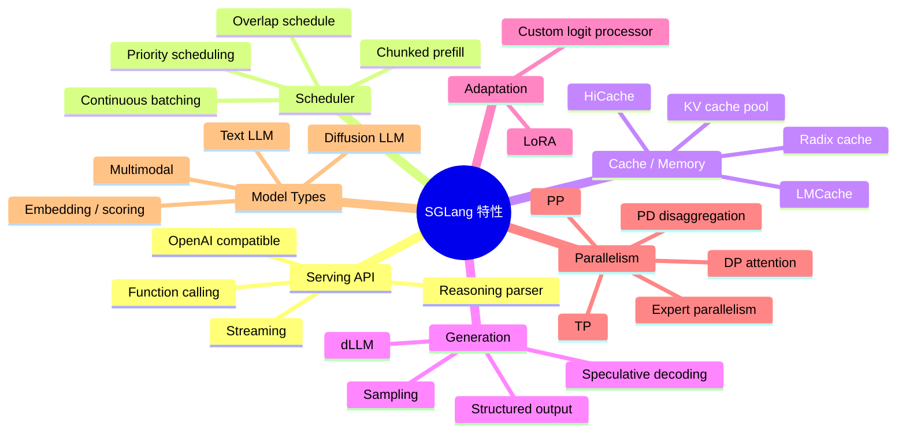
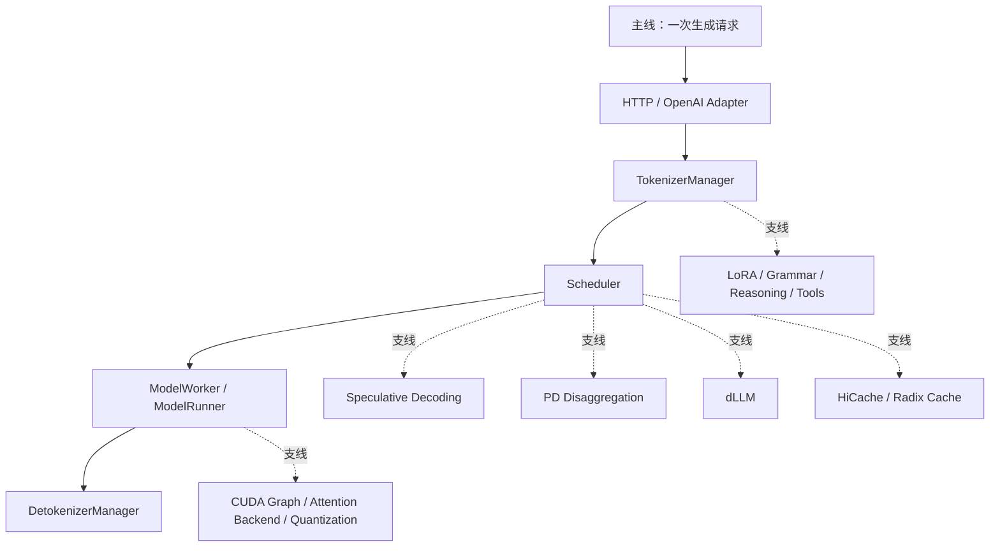
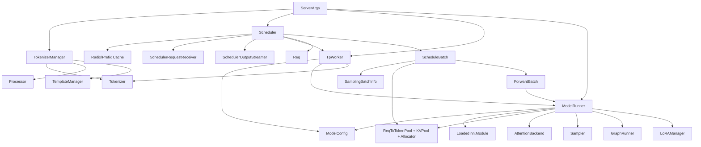
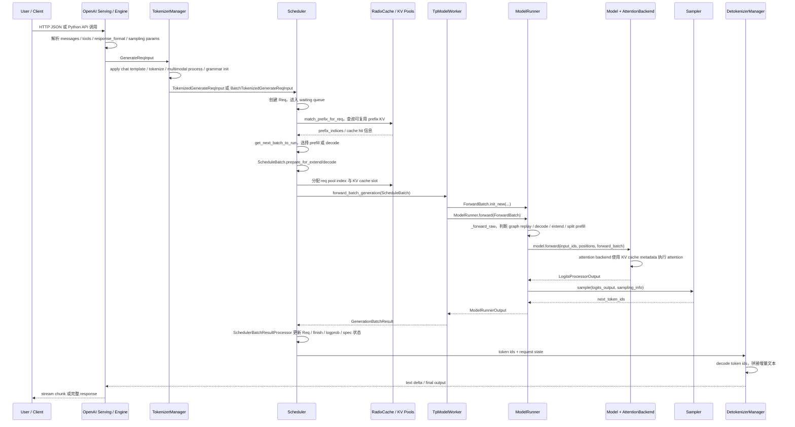
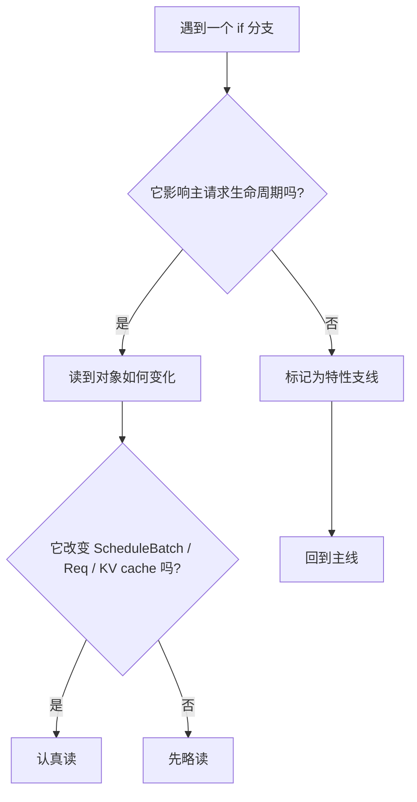

# SGLang 特性地图：读源码前先认识这些分支

这份文档不是用户手册，而是“读源码词典”。你在看 SGLang 源码时，经常会遇到 `dllm_config is not None`、`disaggregation_mode == PREFILL`、`enable_overlap`、`spec_algorithm`、`enable_hierarchical_cache` 这类分支。它们不是主链，但会频繁插进主链。

本讲目标：先知道这些特性分别解决什么问题、会影响哪条路径、第一次读源码时能不能先跳过。每个源码定位都给到具体函数、类或代码段，而不是只给文件。

## 总览图

## 主线与支线

第一次读源码时，先走实线。虚线分支先知道“它为什么存在”，不急着逐行读。

## 关键类调用关系全景图

下面这张图把一次普通生成请求中最重要的类、管理器和数据对象放在同一张图里。它不是继承图，而是“运行时谁调用谁、谁持有哪些对象、数据如何流动”的知识图谱。

```mermaid
flowchart TB
  subgraph API["入口层：HTTP / OpenAI / Engine"]
    HTTP["FastAPI HTTP Server<br/>python/sglang/srt/entrypoints/http_server.py"]
    Engine["Engine<br/>python/sglang/srt/entrypoints/engine.py"]
    OpenAIChat["OpenAIServingChat<br/>entrypoints/openai/serving_chat.py"]
    OpenAIBase["OpenAIServingBase<br/>entrypoints/openai/serving_base.py"]
    TemplateManager["TemplateManager<br/>managers/template_manager.py"]
  end

  subgraph Tokenize["Tokenize / Detokenize 层"]
    TokenizerManager["TokenizerManager<br/>managers/tokenizer_manager.py"]
    TokenizerControlMixin["TokenizerControlMixin<br/>managers/tokenizer_control_mixin.py"]
    TokenizerScoreMixin["TokenizerManagerScoreMixin<br/>managers/tokenizer_manager_score_mixin.py"]
    HFTokenizer["HF / tiktoken Tokenizer<br/>utils/hf_transformers/tokenizer.py<br/>tokenizer/tiktoken_tokenizer.py"]
    Processor["Processor / Multimodal Processor<br/>HF processor or model processor"]
    DetokenizerManager["DetokenizerManager<br/>managers/detokenizer_manager.py"]
  end

  subgraph IPC["进程通信与请求结构"]
    GenerateReq["GenerateReqInput / EmbeddingReqInput<br/>managers/io_struct.py"]
    TokenizedReq["TokenizedGenerateReqInput<br/>managers/io_struct.py"]
    BatchTokenizedReq["BatchTokenizedGenerateReqInput<br/>managers/io_struct.py"]
    SchedulerReqReceiver["SchedulerRequestReceiver<br/>scheduler_components/request_receiver.py"]
    SchedulerIpcChannels["SchedulerIpcChannels<br/>scheduler_components/ipc_channels.py"]
    Streamer["SchedulerOutputStreamer<br/>scheduler_components/output_streamer.py"]
  end

  subgraph SchedulerLayer["调度层：Scheduler 与 Batch"]
    Scheduler["Scheduler<br/>managers/scheduler.py"]
    SchedulerMixins["Scheduler Mixins<br/>PP / dLLM / Disagg / Multiplex / MLX"]
    Req["Req<br/>managers/schedule_batch.py"]
    ScheduleBatch["ScheduleBatch<br/>managers/schedule_batch.py"]
    SchedulePolicy["SchedulePolicy / Prefix match<br/>managers/schedule_policy.py"]
    BatchProcessor["SchedulerBatchResultProcessor<br/>scheduler_components/batch_result_processor.py"]
    LogprobProcessor["SchedulerLogprobResultProcessor<br/>scheduler_components/logprob_result_processor.py"]
    DPAttnAdapter["SchedulerDPAttnAdapter<br/>scheduler_components/dp_attn.py"]
    WeightUpdater["SchedulerWeightUpdaterManager<br/>scheduler_components/weight_updater.py"]
  end

  subgraph CacheLayer["缓存与内存层"]
    TreeCache["BasePrefixCache<br/>RadixCache / SWARadixCache / UnifiedRadixCache"]
    HiCache["HiRadixCache / HiCacheStorage<br/>mem_cache/hiradix_cache.py<br/>mem_cache/hicache_storage.py"]
    ReqPool["ReqToTokenPool<br/>mem_cache/memory_pool.py"]
    KVPool["KVCache<br/>MHATokenToKVPool / MLATokenToKVPool / SWAKVPool / DSATokenToKVPool"]
    KVAllocator["BaseTokenToKVPoolAllocator<br/>TokenToKVPoolAllocator / PagedTokenToKVPoolAllocator"]
    KVBuilder["KVCacheBuilder / KVCacheBuildResult<br/>mem_cache/kv_cache_builder.py"]
  end

  subgraph WorkerLayer["模型 worker 层"]
    BaseTpWorker["BaseTpWorker<br/>managers/tp_worker.py"]
    TpWorker["TpModelWorker<br/>managers/tp_worker.py"]
    SpecWorker["Speculative Workers<br/>EAGLE / NGram / FrozenKV-MTP"]
    DllmManager["DllmManager<br/>dllm/mixin/scheduler.py"]
  end

  subgraph Executor["模型执行层"]
    ModelRunner["ModelRunner<br/>model_executor/model_runner.py"]
    KVMixin["ModelRunnerKVCacheMixin<br/>model_executor/model_runner_kv_cache_mixin.py"]
    ForwardBatch["ForwardBatch<br/>model_executor/forward_batch_info.py"]
    PPProxy["PPProxyTensors<br/>model_executor/forward_batch_info.py"]
    ForwardContext["ForwardContext<br/>model_executor/forward_batch_info.py"]
    ModelConfig["ModelConfig<br/>configs/model_config.py"]
    ModelLoader["Model Loader<br/>model_loader/*"]
    Model["nn.Module model<br/>models/*"]
  end

  subgraph Kernels["执行后端与采样"]
    AttentionBackend["AttentionBackend<br/>layers/attention/*"]
    GraphRunner["CudaGraphRunner / CPUGraphRunner / NPUGraphRunner<br/>model_executor/cuda_graph_runner.py"]
    PiecewiseGraph["PiecewiseCudaGraphRunner<br/>model_executor/piecewise_cuda_graph.py"]
    LogitsProcessor["LogitsProcessor / LogitsProcessorOutput<br/>layers/logits_processor.py"]
    Sampler["Sampler<br/>layers/sampler.py"]
    SamplingInfo["SamplingBatchInfo<br/>sampling/sampling_batch_info.py"]
    SamplingParams["SamplingParams<br/>sampling/sampling_params.py"]
    LoRAManager["LoRAManager<br/>lora/lora_manager.py"]
  end

  HTTP --> OpenAIChat
  HTTP --> Engine
  Engine --> TokenizerManager
  OpenAIChat --> OpenAIBase
  OpenAIChat --> TemplateManager
  OpenAIBase --> TokenizerManager
  TemplateManager --> HFTokenizer

  TokenizerManager --> TokenizerControlMixin
  TokenizerManager --> TokenizerScoreMixin
  TokenizerManager --> HFTokenizer
  TokenizerManager --> Processor
  TokenizerManager --> GenerateReq
  GenerateReq --> TokenizedReq
  TokenizerManager --> BatchTokenizedReq
  BatchTokenizedReq --> SchedulerReqReceiver
  SchedulerReqReceiver --> Scheduler
  SchedulerIpcChannels --> Scheduler
  Scheduler --> Streamer
  Streamer --> DetokenizerManager
  DetokenizerManager --> HFTokenizer

  Scheduler --> SchedulerMixins
  Scheduler --> Req
  Req --> ScheduleBatch
  Scheduler --> ScheduleBatch
  Scheduler --> SchedulePolicy
  Scheduler --> BatchProcessor
  Scheduler --> LogprobProcessor
  Scheduler --> DPAttnAdapter
  Scheduler --> WeightUpdater

  SchedulePolicy --> TreeCache
  Scheduler --> TreeCache
  TreeCache --> HiCache
  ScheduleBatch --> ReqPool
  ScheduleBatch --> KVAllocator
  KVAllocator --> KVPool
  ModelRunner --> KVMixin
  KVMixin --> KVBuilder
  KVBuilder --> ReqPool
  KVBuilder --> KVPool
  KVBuilder --> KVAllocator

  Scheduler --> BaseTpWorker
  BaseTpWorker --> TpWorker
  TpWorker --> ModelRunner
  SpecWorker --> TpWorker
  SchedulerMixins --> DllmManager
  DllmManager --> TpWorker

  TpWorker --> ForwardBatch
  ScheduleBatch --> ForwardBatch
  ModelRunner --> ModelConfig
  ModelRunner --> ModelLoader
  ModelLoader --> Model
  ModelRunner --> ForwardBatch
  ModelRunner --> ForwardContext
  ForwardBatch --> PPProxy
  ForwardContext --> AttentionBackend
  ModelRunner --> AttentionBackend
  ModelRunner --> GraphRunner
  ModelRunner --> PiecewiseGraph
  ModelRunner --> LogitsProcessor
  ModelRunner --> Sampler
  ModelRunner --> LoRAManager
  ForwardBatch --> SamplingInfo
  SamplingInfo --> SamplingParams
  Model --> LogitsProcessor
  LogitsProcessor --> Sampler
  Sampler --> BatchProcessor
  BatchProcessor --> Streamer
```

读这张图时，可以先抓住 5 条主边：

1. `TokenizerManager -> Scheduler -> TpModelWorker -> ModelRunner -> Sampler`：普通文本生成主链路。
2. `Scheduler -> ScheduleBatch -> ForwardBatch`：请求从调度视角变成模型执行视角。
3. `Scheduler / SchedulePolicy -> RadixCache -> ReqToTokenPool / KVPool`：prefix cache 与 KV cache 分配链路。
4. `ModelRunner -> AttentionBackend / GraphRunner / LogitsProcessor / Sampler`：模型执行后的性能与采样链路。
5. `SchedulerBatchResultProcessor -> SchedulerOutputStreamer -> DetokenizerManager`：模型输出回到流式文本的链路。

## 关键类知识图谱

### 1. 入口与请求对象

| 类 / 对象 | 位置 | 上游 | 下游 | 核心职责 |
|---|---|---|---|---|
| `Engine` | `python/sglang/srt/entrypoints/engine.py` / `Engine` | Python API 或 HTTP server | `TokenizerManager`、Scheduler 子进程、Detokenizer 子进程 | 本地/嵌入式使用的总入口，负责启动 tokenizer、scheduler、detokenizer 等运行时组件。 |
| `OpenAIServingChat` | `entrypoints/openai/serving_chat.py` | FastAPI route | `TokenizerManager.generate_request()` | 处理 `/v1/chat/completions`，完成 messages、tools、reasoning、response_format 等 OpenAI 协议转换。 |
| `OpenAIServingBase` | `entrypoints/openai/serving_base.py` | 各 OpenAI serving 类 | `TokenizerManager` | 提供 LoRA 解析、模型信息、通用错误处理等基础能力。 |
| `GenerateReqInput` | `managers/io_struct.py` | OpenAI serving / Engine API | `TokenizerManager` | 未 tokenized 的生成请求，保留原始 prompt、messages、sampling params、stream 等用户语义。 |
| `TokenizedGenerateReqInput` | `managers/io_struct.py` | `TokenizerManager` | `SchedulerRequestReceiver`、`Scheduler` | 已完成 tokenization 的单请求，调度层主要消费这个对象。 |
| `BatchTokenizedGenerateReqInput` | `managers/io_struct.py` | `TokenizerManager` | `Scheduler` | 批量 tokenized 请求，减少 IPC 次数。 |

### 2. Tokenizer / Detokenizer 层

| 类 / 对象 | 位置 | 依赖 | 被谁调用 | 核心职责 |
|---|---|---|---|---|
| `TokenizerManager` | `managers/tokenizer_manager.py` / `TokenizerManager` | HF tokenizer、processor、template、IPC sockets | OpenAI serving、Engine | 把原始请求转成 token ids，并把 tokenized 请求发送给 Scheduler。也负责 multimodal preprocessing、grammar 初始化、LoRA 信息注入。 |
| `TokenizerControlMixin` | `managers/tokenizer_control_mixin.py` | `TokenizerManager` 状态 | HTTP control endpoint | flush cache、abort request、update weights、LoRA load/unload 等控制面命令。 |
| `TokenizerManagerScoreMixin` | `managers/tokenizer_manager_score_mixin.py` | tokenizer、scheduler IPC | score / rerank serving | 支持 score、classify、rerank 等非普通生成请求。 |
| `TemplateManager` | `managers/template_manager.py` | tokenizer、chat template | OpenAI chat serving | 把 messages 组织成模型可接受的 prompt/chat template。 |
| HF / tiktoken tokenizer | `utils/hf_transformers/tokenizer.py`、`tokenizer/tiktoken_tokenizer.py` | 模型 tokenizer 文件 | `TokenizerManager`、`DetokenizerManager` | encode prompt、decode token ids、处理 special token。 |
| `DetokenizerManager` | `managers/detokenizer_manager.py` / `DetokenizerManager` | tokenizer、输出 IPC | Scheduler output streamer | 把增量 token ids 解码成文本，处理 stream chunk、finish reason、skip special tokens。 |

### 3. Scheduler 与 batch 对象

| 类 / 对象 | 位置 | 依赖 | 被谁调用 | 核心职责 |
|---|---|---|---|---|
| `Scheduler` | `managers/scheduler.py` / `Scheduler` | tokenizer、tree cache、worker、request receiver、result processor | Scheduler event loop | SGLang runtime 的调度核心，维护 waiting/running batch，决定 prefill/decode、chunked prefill、evict、flush、abort、LoRA 混批等策略。 |
| `SchedulerRequestReceiver` | `scheduler_components/request_receiver.py` | IPC sockets | `Scheduler.event_loop_*()` | 从 tokenizer 进程接收 tokenized 请求或控制命令。 |
| `SchedulerBatchResultProcessor` | `scheduler_components/batch_result_processor.py` | `Req`、`ScheduleBatch`、spec info | `Scheduler.process_batch_result()` | 消费 worker 返回的 `GenerationBatchResult`，更新请求状态、接受/拒绝 spec token、判断 finish、准备输出。 |
| `SchedulerOutputStreamer` | `scheduler_components/output_streamer.py` | detokenizer IPC、request state | `Scheduler` | 把 token ids、logprobs、finish 状态发往 detokenizer 或 HTTP stream。 |
| `SchedulerLogprobResultProcessor` | `scheduler_components/logprob_result_processor.py` | logits/logprob 输出 | `SchedulerBatchResultProcessor` | 处理 prefill logprob、top logprobs、normalized prompt logprob 等 logprob 结果。 |
| `SchedulerDPAttnAdapter` | `scheduler_components/dp_attn.py` | DP group、global batch state | `Scheduler` | DP attention 场景下协调各 DP rank 的 batch 与负载信息。 |
| `SchedulerWeightUpdaterManager` | `scheduler_components/weight_updater.py` | worker control path | `Scheduler` | 调度在线权重更新、同步多个 worker 的更新状态。 |
| `Req` | `managers/schedule_batch.py` / `Req` | tokenized request、prefix cache result、sampling params | `Scheduler`、`ScheduleBatch` | 单个请求在调度层的运行时状态：input ids、output ids、prefix indices、extend len、finish status、stream 状态。 |
| `ScheduleBatch` | `managers/schedule_batch.py` / `ScheduleBatch` | 多个 `Req`、memory pool、sampling info | `Scheduler`、`TpModelWorker` | 一次即将送入模型的 batch。它负责 prepare_for_extend/decode、分配 KV cache、构造 sampling batch info。 |
| `SamplingBatchInfo` | `sampling/sampling_batch_info.py` | 多个 `Req.sampling_params` | `ScheduleBatch`、`ModelRunner.sample()` | 把 temperature、top_p、top_k、grammar、logit bias 等采样配置整理成 batch tensor。 |

### 4. Cache / Memory 对象

| 类 / 对象 | 位置 | 依赖 | 被谁调用 | 核心职责 |
|---|---|---|---|---|
| `BasePrefixCache` | `mem_cache/base_prefix_cache.py` | token ids、request metadata | `SchedulePolicy`、`Scheduler` | prefix cache 抽象接口，提供 match/insert/evict/cache_unfinished_req 等能力。 |
| `RadixCache` | `mem_cache/radix_cache.py` / `RadixCache` | radix tree、KV indices | `SchedulePolicy.match_prefix_for_req()` | 默认 prefix cache，通过 radix tree 复用相同 prompt 前缀的 KV cache。 |
| `UnifiedRadixCache` | `mem_cache/unified_radix_cache.py` | 多 cache pool | `create_tree_cache()` | 统一管理不同层或不同 cache 类型的 radix cache。 |
| `SWARadixCache` | `mem_cache/swa_radix_cache.py` | sliding-window attention 配置 | hybrid/SWA 模型调度 | sliding-window attention 模型使用的 prefix cache 变体。 |
| `HiRadixCache` / `HiCacheStorage` | `mem_cache/hiradix_cache.py`、`mem_cache/hicache_storage.py` | host/storage KV cache | Scheduler cache path | 分层 KV cache，把部分 KV 从 GPU 扩展到 host 或外部 storage。 |
| `ReqToTokenPool` | `mem_cache/memory_pool.py` / `ReqToTokenPool` | request pool size、context len | `ScheduleBatch`、`ModelRunnerKVCacheMixin` | 保存 request index 到 token/KV slot 的映射，是 continuous batching 的核心索引表。 |
| `KVCache` | `mem_cache/memory_pool.py` / `KVCache` | GPU/host memory | attention layer、ModelRunner | KV cache 抽象基类。具体子类适配 MHA、MLA、SWA、DSA、Mamba、FP4/FP8 等结构。 |
| `MHATokenToKVPool` | `mem_cache/memory_pool.py` | layer/head/page 配置 | attention backend | 标准 MHA/GQA 模型的 KV cache pool。 |
| `MLATokenToKVPool` | `mem_cache/memory_pool.py` | MLA latent KV 配置 | MLA attention backend | DeepSeek MLA 等模型使用的 KV cache pool。 |
| `BaseTokenToKVPoolAllocator` | `mem_cache/allocator/base.py` | KV pool | `ScheduleBatch.prepare_for_*()` | 分配和释放 token 对应的 KV cache slot。 |
| `TokenToKVPoolAllocator` / `PagedTokenToKVPoolAllocator` | `mem_cache/allocator/token.py`、`allocator/paged.py` | KV pool free list/page table | Scheduler/Batch | 普通或 paged 形式的 KV slot 分配器。 |
| `ModelRunnerKVCacheMixin` | `model_executor/model_runner_kv_cache_mixin.py` | model config、server args、GPU memory | `ModelRunner.initialize()` | 为 `ModelRunner` 提供 `init_memory_pool()` 等 KV cache 初始化能力。 |

### 5. Worker 与模型执行对象

| 类 / 对象 | 位置 | 依赖 | 被谁调用 | 核心职责 |
|---|---|---|---|---|
| `BaseTpWorker` | `managers/tp_worker.py` / `BaseTpWorker` | `ModelRunner` | `Scheduler` | worker 抽象接口，暴露 forward、embedding、LoRA、权重更新、memory pool 等能力。 |
| `TpModelWorker` | `managers/tp_worker.py` / `TpModelWorker` | `ModelConfig`、`ModelRunner`、tokenizer、PP/TP group | `Scheduler` | TP rank 上的模型 worker。把 `ScheduleBatch` 转成 `ForwardBatch`，调用 `ModelRunner.forward()`，在 PP 最后一级采样。 |
| `ModelConfig` | `configs/model_config.py` / `ModelConfig` | HF config、server args | `TpModelWorker`、`ModelRunner` | 统一模型结构信息，例如 dtype、context len、is_generation、is_multimodal、hidden size、vocab size。 |
| `ModelRunner` | `model_executor/model_runner.py` / `ModelRunner` | model、KV pool、attention backend、sampler、graph runner | `TpModelWorker` | 模型执行核心，负责分布式初始化、模型加载、KV cache、attention metadata、forward dispatch、sampling。 |
| `ForwardBatch` | `model_executor/forward_batch_info.py` / `ForwardBatch` | `ScheduleBatch`、`ModelRunner`、KV pool | `ModelRunner.forward()` | 模型层 batch 输入，包含 input ids、positions、seq lens、cache loc、sampling info、spec info、PP proxy 等。 |
| `ForwardContext` | `model_executor/forward_batch_info.py` | attention backend | model layers | forward 期间的上下文对象，让模型层 attention 能读取当前 backend 和 metadata。 |
| `PPProxyTensors` | `model_executor/forward_batch_info.py` | hidden states | PP rank 之间 | Pipeline parallel 中间 rank 传递 hidden states 和其他代理张量。 |
| `ModelRunnerOutput` | `model_executor/model_runner.py` | logits 或 PP proxy | `TpModelWorker` | `ModelRunner.forward()` 的返回结构，携带 logits、graph 可用性、spec/debug/metrics 输出。 |

### 6. Kernel、Logits 与采样对象

| 类 / 对象 | 位置 | 依赖 | 被谁调用 | 核心职责 |
|---|---|---|---|---|
| `AttentionBackend` 系列 | `layers/attention/*` | KV pool、ForwardBatch metadata | `ModelRunner.forward_decode/extend()` | 为 prefill/decode attention kernel 准备 metadata，并执行具体 attention kernel。 |
| `CudaGraphRunner` / `CPUGraphRunner` / `NPUGraphRunner` | `model_executor/cuda_graph_runner.py` 等 | `ModelRunner`、固定 shape buffer | `ModelRunner._forward_raw()` | 捕获并 replay 固定形状 decode graph，减少 launch overhead。 |
| `PiecewiseCudaGraphRunner` | `model_executor/piecewise_cuda_graph.py` | 模型 layers、attention/MoE 层 | `ModelRunner.forward_extend()` | 捕获局部算子/层级 graph，覆盖比整图更动态的场景。 |
| `LogitsProcessor` | `layers/logits_processor.py` / `LogitsProcessor` | model hidden states、lm_head、metadata | model forward | 把 hidden states 转成 logits，并按需要输出 next token logits、input token logprobs 等。 |
| `LogitsProcessorOutput` | `layers/logits_processor.py` | logits tensor | `ModelRunner.sample()` | 承载 next-token logits、input-token logprobs、hidden states 等输出。 |
| `Sampler` | `layers/sampler.py` / `Sampler` | logits、`SamplingBatchInfo` | `ModelRunner.sample()` | 执行 temperature、top-p、top-k、min-p、grammar mask 等采样逻辑。 |
| `SamplingParams` | `sampling/sampling_params.py` | 用户请求 | `Req`、`SamplingBatchInfo` | 单请求采样参数，包含 max_new_tokens、temperature、stop、top_p、logprob 等。 |
| `LoRAManager` | `lora/lora_manager.py` / `LoRAManager` | base model、LoRA weights | `ModelRunner`、Scheduler control path | 动态加载/卸载 LoRA adapter，并在 batch forward 前准备对应 LoRA 权重。 |

### 7. 特性支线对象

| 特性 | 关键类 / 对象 | 位置 | 如何插入主链路 |
|---|---|---|---|
| Speculative decoding | `SpeculativeAlgorithm`、`EagleWorker`、`EagleWorkerV2`、`NGramWorker`、`EagleVerifyInput` | `speculative/*` | Scheduler 生成 draft/verify batch；`TpModelWorker` 可能持有 draft runner；`ForwardBatch.spec_info` 告诉 `ModelRunner` 当前是 draft 还是 verify。 |
| dLLM | `SchedulerDllmMixin`、`DllmManager`、`DllmConfig` | `dllm/*` | Scheduler 和 `TpModelWorker.forward_batch_generation()` 分流到 diffusion-style 生成，不走普通 next-token loop。 |
| PD disaggregation | `SchedulerDisaggregationPrefillMixin`、`SchedulerDisaggregationDecodeMixin`、`CommonKVSender`、`CommonKVReceiver`、`MooncakeKVManager` / `NixlKVManager` | `disaggregation/*` | prefill worker 计算 KV 后通过 KV transfer 发送给 decode worker，Scheduler 的 batch 生命周期被拆成两个部署角色。 |
| DP attention | `SchedulerDPAttnAdapter` | `scheduler_components/dp_attn.py` | Scheduler 在 DP rank 间同步 batch 和负载，`ForwardBatch` 中带 global token 信息。 |
| Pipeline parallel | `SchedulerPPMixin`、`PPProxyTensors` | `managers/scheduler_pp_mixin.py`、`forward_batch_info.py` | `TpModelWorker` 非最后 PP rank 返回 hidden states proxy，最后一级才得到 logits 并采样。 |
| HiCache | `HiRadixCache`、`HiCacheStorage`、hybrid cache controller | `mem_cache/*hicache*` | `RadixCache` 的扩展路径；KV cache 可以在 GPU、host、storage 间 load/evict。 |
| LoRA | `LoRAManager`、LoRA layers | `lora/*` | Scheduler 控制 adapter 加载；`ModelRunner` 在 forward 前准备 LoRA batch。 |
| Structured output | grammar backend、grammar matcher | `constrained/*`、`sampling/*` | TokenizerManager 编译 grammar；Sampler 根据 grammar mask 限制可采样 token。 |

## 依赖关系速读

### 运行时对象依赖树

### 数据对象转换链

```mermaid
flowchart LR
  RawHTTP["HTTP JSON / Python API input"] --> GenerateReqInput
  GenerateReqInput --> TokenizerManager
  TokenizerManager --> TokenizedGenerateReqInput
  TokenizedGenerateReqInput --> Req
  Req --> ScheduleBatch
  ScheduleBatch --> ForwardBatch
  ForwardBatch --> ModelRunnerOutput
  ModelRunnerOutput --> GenerationBatchResult
  GenerationBatchResult --> BatchResultProcessor
  BatchResultProcessor --> StreamOutput["token ids / logprobs / finish reason"]
  StreamOutput --> DetokenizerManager
  DetokenizerManager --> TextChunk["text delta / final text"]
```

### “持有关系”与“调用关系”的区别

| 关系 | 例子 | 怎么理解 |
|---|---|---|
| 持有 | `TpModelWorker` 持有 `ModelRunner` | 生命周期绑定，worker 初始化时创建 runner，后续请求复用。 |
| 持有 | `ModelRunner` 持有 `Sampler`、`AttentionBackend`、KV pools | 这些是模型执行资源，初始化昂贵，请求之间复用。 |
| 持有 | `Scheduler` 持有 `tree_cache`、`waiting_queue`、`running_batch` | 调度状态必须跨 event loop tick 保留。 |
| 转换 | `GenerateReqInput -> TokenizedGenerateReqInput -> Req -> ScheduleBatch -> ForwardBatch` | 同一个用户请求在不同层有不同表示。 |
| 调用 | `Scheduler -> TpModelWorker.forward_batch_generation()` | Scheduler 决定跑哪个 batch，worker 负责实际送入模型。 |
| 调用 | `TpModelWorker -> ModelRunner.forward()` | worker 处理 TP/PP/spec 分支，runner 处理模型执行分支。 |
| 调用 | `ModelRunner -> Sampler` | logits 已经算出后，采样器把它变成 next token。 |
| 回传 | `SchedulerBatchResultProcessor -> SchedulerOutputStreamer -> DetokenizerManager` | 生成结果从模型侧回到用户可读文本。 |

## 一次普通生成请求的完整流程图

## Prefill 与 Decode 中类关系的差异

```mermaid
flowchart TB
  subgraph Prefill["Prefill / Extend"]
    PReq["Req.extend_input_len > 0"]
    PMatch["RadixCache.match_prefix"]
    PBatch["ScheduleBatch.prepare_for_extend"]
    PKV["分配多个 token 的 KV slot"]
    PForward["ForwardBatch.forward_mode = EXTEND"]
    PAttn["prefill attention metadata"]
    PModel["ModelRunner.forward_extend"]
  end

  subgraph Decode["Decode"]
    DReq["Req 仍未 finished"]
    DBatch["ScheduleBatch.prepare_for_decode"]
    DKV["为每个请求分配 1 个新 token KV slot"]
    DForward["ForwardBatch.forward_mode = DECODE"]
    DGraph["可选 CudaGraphRunner.replay"]
    DAttn["decode attention metadata"]
    DModel["ModelRunner.forward_decode"]
  end

  PReq --> PMatch --> PBatch --> PKV --> PForward --> PAttn --> PModel
  DReq --> DBatch --> DKV --> DForward --> DGraph --> DAttn --> DModel
```

区别可以压缩成一句话：prefill 主要处理“很多 prompt token 怎么写入 KV cache”，decode 主要处理“每个活跃请求再追加 1 个 token，如何低延迟循环”。

## 按源码阅读的推荐路径

如果你想按类关系逐步读源码，建议顺序如下：

1. `TokenizerManager.generate_request()`、`_prepare_tokenizer_input()`、`_batch_tokenize_and_process()`：理解请求如何进入 runtime。
2. `Scheduler.event_loop_normal()`、`get_next_batch_to_run()`、`get_new_batch_prefill()`、`update_running_batch()`：理解调度循环。
3. `Req` 与 `ScheduleBatch.prepare_for_extend()` / `prepare_for_decode()`：理解 batch 状态如何形成。
4. `RadixCache.match_prefix()`、`ReqToTokenPool`、`BaseTokenToKVPoolAllocator.alloc()`：理解 prefix cache 与 KV slot 分配。
5. `TpModelWorker.forward_batch_generation()`：理解 Scheduler 到 ModelRunner 的边界。
6. `ForwardBatch.init_new()`：理解模型执行层需要哪些张量和 metadata。
7. `ModelRunner.forward()`、`_forward_raw()`、`forward_extend()`、`forward_decode()`：理解模型执行分发。
8. `ModelRunner.init_attention_backend()` 与具体 attention backend 的 `init_forward_metadata()`：理解 attention kernel 的输入准备。
9. `LogitsProcessorOutput`、`ModelRunner.sample()`、`Sampler.forward()`：理解 logits 到 token 的过程。
10. `SchedulerBatchResultProcessor` 与 `DetokenizerManager`：理解 token 如何回到用户。

## 特性源码定位表

| 特性 | 解决的问题 | 具体源码定位 | 第一遍怎么读 |
|---|---|---|---|
| Continuous batching | 动态维护 `running_batch`，让新请求可插入 prefill | `python/sglang/srt/managers/scheduler.py` / `Scheduler.get_next_batch_to_run()`；`Scheduler.get_new_batch_prefill()`；`Scheduler.update_running_batch()`；`python/sglang/srt/managers/schedule_batch.py` / `ScheduleBatch.prepare_for_extend()`、`prepare_for_decode()` | 不能跳过，这是 Scheduler 骨架。 |
| Chunked prefill | 长 prompt 分块，降低一次性 KV 和 GPU 时间峰值 | `python/sglang/srt/server_args.py` / `ServerArgs` 中 `chunked_prefill_size`、`enable_dynamic_chunking` 字段；`python/sglang/srt/managers/scheduler.py` / `Scheduler.init_chunked_prefill()`、`Scheduler._get_new_batch_prefill_raw()`；`python/sglang/srt/managers/schedule_batch.py` / `Req.set_extend_input_len()`、`ScheduleBatch.prepare_for_extend()` | 先知道它会改变 `extend_input_len` 和 prefill batch 形态。 |
| Radix cache | 复用相同 prompt prefix 的 KV cache | `python/sglang/srt/mem_cache/registry.py` / `create_tree_cache()`、`default_radix_cache_factory()`；`python/sglang/srt/mem_cache/radix_cache.py` / `RadixCache.match_prefix()`、`insert()`、`cache_unfinished_req()`；`python/sglang/srt/managers/schedule_policy.py` / `match_prefix_for_req()` | 不能完全跳过，至少理解 `prefix_indices`。 |
| HiCache | 把 KV cache 扩展到 host/storage 层级 | `python/sglang/srt/server_args.py` / `enable_hierarchical_cache`、`hicache_*` 字段；`python/sglang/srt/mem_cache/registry.py` / `default_radix_cache_factory()`；`python/sglang/srt/mem_cache/hiradix_cache.py` / `HiRadixCache` 相关 match/load-back 方法；`python/sglang/srt/mem_cache/hybrid_cache/hybrid_cache_controller.py` / hybrid cache controller 的 load/evict 方法 | 可以先当成增强版 `tree_cache`。 |
| PD disaggregation | Prefill 和 decode 分离部署，中间传 KV | `python/sglang/srt/disaggregation/utils.py` / `DisaggregationMode`；`python/sglang/srt/server_args.py` / `disaggregation_mode`、`bootstrap_*` 字段；`python/sglang/srt/disaggregation/prefill.py` / prefill worker 处理入口；`python/sglang/srt/disaggregation/decode.py` / decode worker 处理入口；`python/sglang/srt/disaggregation/common/conn.py` 和 `base/conn.py` / KV transfer connection 抽象 | 非分布式阅读可先跳过。 |
| dLLM | 支持 diffusion-style LLM，不按普通 next-token loop 生成 | `python/sglang/srt/dllm/config.py` / `DllmConfig`；`python/sglang/srt/dllm/mixin/scheduler.py` / dLLM scheduler mixin 的 batch 构造和结果处理；`python/sglang/srt/models/sdar.py` / `SDARForCausalLM`、`SDARMoeForCausalLM`；`python/sglang/srt/managers/scheduler.py` / `dllm_config` 分支 | 普通 LLM 主线先跳过。 |
| Speculative decoding | draft 模型先猜 token，target 模型验证 | `python/sglang/srt/speculative/spec_info.py` / `SpeculativeAlgorithm`、spec info classes；`python/sglang/srt/speculative/eagle_worker.py` / EAGLE worker；`python/sglang/srt/speculative/eagle_worker_v2.py` / v2 worker；`python/sglang/srt/speculative/ngram_worker.py` / N-gram draft；`python/sglang/srt/managers/scheduler_components/batch_result_processor.py` / spec result acceptance 逻辑 | 读普通生成时沿 `spec_algorithm.is_none()` 分支走。 |
| Overlap schedule | CPU 调度/结果处理和 GPU forward 流水重叠 | `python/sglang/srt/server_args.py` / `disable_overlap_schedule`、`enable_two_batch_overlap` 字段；`python/sglang/srt/managers/scheduler.py` / `Scheduler.init_overlap()`、`event_loop_overlap()`、`record_batch_in_overlap()`；`python/sglang/srt/model_executor/model_runner.py` / `ModelRunner.update_decode_attn_backend()` | 先读 `event_loop_normal()`，再回来读 overlap。 |
| CUDA graph | 复用固定形状 GPU 执行图，降低 launch overhead | `python/sglang/srt/server_args.py` / `cuda_graph_max_bs` 等字段；`python/sglang/srt/model_executor/model_runner.py` / `ModelRunner.init_device_graphs()`、`init_piecewise_cuda_graphs()`、`_forward_raw()` 中 `graph_runner.replay` 分支 | 可以先跳过，保留“decode 优化路径”的印象。 |
| Structured output / Grammar | JSON schema、regex、EBNF 等约束输出 | `python/sglang/srt/server_args.py` / `grammar_backend` 字段；`python/sglang/srt/constrained/xgrammar_backend.py` / `XGrammarGrammarBackend` 的 compile/mask 逻辑；`python/sglang/srt/entrypoints/openai/protocol.py` / request 的 `response_format` 字段；`python/sglang/srt/sampling` / sampler 应用 grammar mask 的代码段 | 读 chat conversion 时会遇到，可以先理解为“采样前 mask 词表”。 |
| Reasoning parser | 分离 reasoning 内容和最终答案 | `python/sglang/srt/server_args.py` / `reasoning_parser` 字段；`python/sglang/srt/entrypoints/openai/serving_chat.py` / `_get_reasoning_from_request()`、`_process_reasoning_stream()`；`python/sglang/srt/parser/reasoning_parser.py` / reasoning parser 基类和实现 | 普通文本生成可先跳过。 |
| Function calling | 将模型输出解析成工具调用 | `python/sglang/srt/entrypoints/openai/serving_chat.py` / `_process_messages()`、`_process_tool_calls()`、`_process_tool_call_stream()`；`python/sglang/srt/function_call/function_call_parser.py` / parser 入口；`python/sglang/srt/function_call/*_detector.py` / 各模型 tool call detector | 读 `/v1/chat/completions` 时常见。 |
| LoRA | 同一个 base model 上动态加载 adapter | `python/sglang/srt/server_args.py` / `enable_lora`、`lora_*` 字段；`python/sglang/srt/lora/lora_manager.py` / LoRA manager；`python/sglang/srt/entrypoints/openai/serving_base.py` / `_resolve_lora_path()`；`python/sglang/srt/managers/scheduler.py` / `_can_schedule_lora_req()`、`load_lora_adapter()`、`unload_lora_adapter()` | 先理解为调度时多了 adapter 混批约束。 |
| Multimodal | 支持图片、视频、音频输入 | `python/sglang/srt/entrypoints/openai/serving_chat.py` / `_process_messages()`、`_encode_messages()`；`python/sglang/srt/managers/tokenizer_manager.py` / `_prepare_tokenizer_input()`、`_batch_tokenize_and_process()`；`python/sglang/srt/managers/schedule_batch.py` / `MultimodalInputs`、`MultimodalDataItem` | 纯文本主线可沿非 multimodal 分支走。 |
| Tensor parallel | 单层矩阵计算切到多卡 | `python/sglang/srt/managers/tp_worker.py` / `TpModelWorker.__init__()`、`_init_model_runner()`、`forward_batch_generation()`；`python/sglang/srt/model_executor/model_runner.py` / `ModelRunner.init_torch_distributed()` | 单卡阅读时只需知道 worker 边界。 |
| Pipeline parallel | 不同层放在不同 GPU/节点形成流水 | `python/sglang/srt/managers/scheduler_pp_mixin.py` / PP mixin 中 microbatch 调度方法；`python/sglang/srt/model_executor/model_runner.py` / PP 相关 forward 分支；`python/sglang/srt/model_executor/forward_batch_info.py` / `PPProxyTensors` | 可以跳过，除非专门读多卡。 |
| DP attention | Data parallel 下的 attention 同步和路由 | `python/sglang/srt/server_args.py` / `enable_dp_attention` 字段；`python/sglang/srt/managers/scheduler_components/dp_attn.py` / DP attention adapter；`python/sglang/srt/managers/scheduler.py` / `init_dp_attn_adapter()` | 可以跳过。 |
| Expert parallel / EPLB | MoE expert 分布与负载均衡 | `python/sglang/srt/server_args.py` / expert parallel 与 EPLB 字段；`python/sglang/srt/eplb` / expert load balance controller；`python/sglang/srt/layers/moe` / MoE layer 和 runner；`python/sglang/srt/model_executor/model_runner.py` / `update_expert_location()` | 读 dense LLM 时跳过。 |
| Quantization 与 kernel backend | 选择量化、attention backend、sampling backend、MoE backend | `python/sglang/srt/server_args.py` / `quantization`、`kv_cache_dtype`、`attention_backend` 字段；`python/sglang/srt/model_executor/model_runner.py` / `configure_kv_cache_dtype()`、`init_attention_backend()`、`_get_attention_backend_from_str()`；`python/sglang/srt/layers/quantization` / quant method classes；`python/sglang/srt/layers/attention` / backend classes | 性能专题再读。 |
| Embedding / scoring / rerank | 非生成式请求，不走完整 decode loop | `python/sglang/srt/entrypoints/openai/serving_embedding.py` / embedding serving handler；`python/sglang/srt/entrypoints/openai/serving_score.py` / score handler；`python/sglang/srt/entrypoints/openai/serving_rerank.py` / rerank handler；`python/sglang/srt/managers/scheduler.py` / `handle_embedding_request()`、`handle_batch_embedding_request()` | 只研究 chat completion 时先关注 `GenerateReqInput`。 |

## 常见分支速查表

| 代码标志 | 大概含义 | 第一遍读主线怎么处理 |
|---|---|---|
| `self.dllm_config is not None` | Diffusion LLM 特殊路径 | 跳过，走普通 LLM 分支 |
| `disaggregation_mode != NULL` | Prefill/Decode 分离部署 | 跳过，走 unified 模式 |
| `not spec_algorithm.is_none()` | Speculative decoding | 跳过，走 non-spec 分支 |
| `enable_hierarchical_cache` | HiCache 分层缓存 | 当成增强版 radix cache |
| `disable_radix_cache` | 关闭 prefix cache | 理解为不复用前缀 |
| `chunked_req is not None` | 长 prompt 被切块 | 先理解为 prefill 没做完 |
| `enable_overlap` | CPU/GPU 流水重叠 | 先读 non-overlap 分支 |
| `can_run_cuda_graph` | 可复用 CUDA graph | 先读普通 forward |
| `enable_lora` | adapter serving | 先理解为调度多一个约束 |
| `req.grammar is not None` | 结构化输出约束 | 先理解为采样前 mask 词表 |
| `model_config.is_multimodal` | 多模态模型 | 纯文本阅读时跳过 |
| `is_generation` | 生成 vs embedding/scoring | chat completion 走生成分支 |

## 推荐阅读策略

建议顺序：

1. 先读普通文本生成、非 spec、非 disagg、非 dLLM、非 LoRA、非 multimodal。
2. 第二遍读 Scheduler 和 KV cache。
3. 第三遍再逐个打开特性支线。

## 后续专题建议

1. KV cache / Radix cache / HiCache。
2. Speculative decoding。
3. PD disaggregation。
4. LoRA serving。
5. Structured output 与 function calling。
6. dLLM。

这样顺序比较自然：先掌握普通 LLM serving，再看性能优化，最后看特殊模型和特殊部署。
