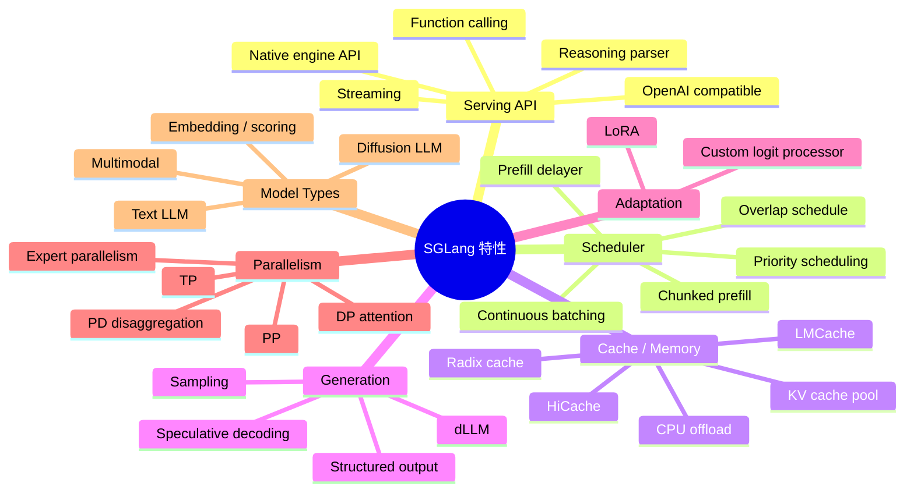
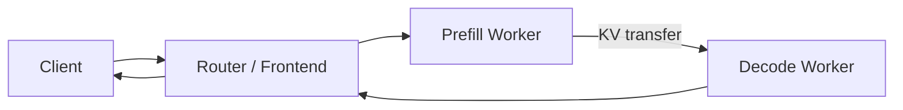
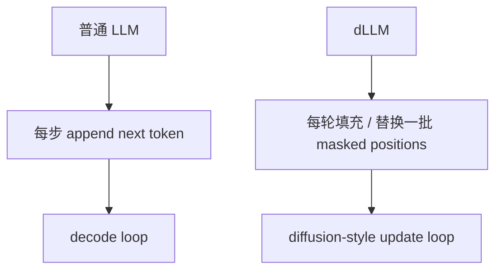
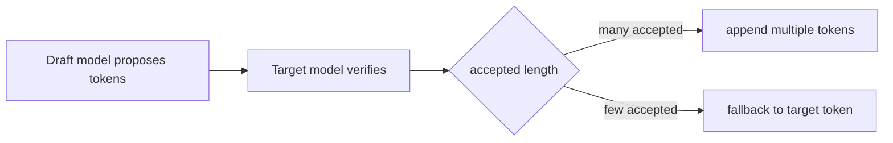
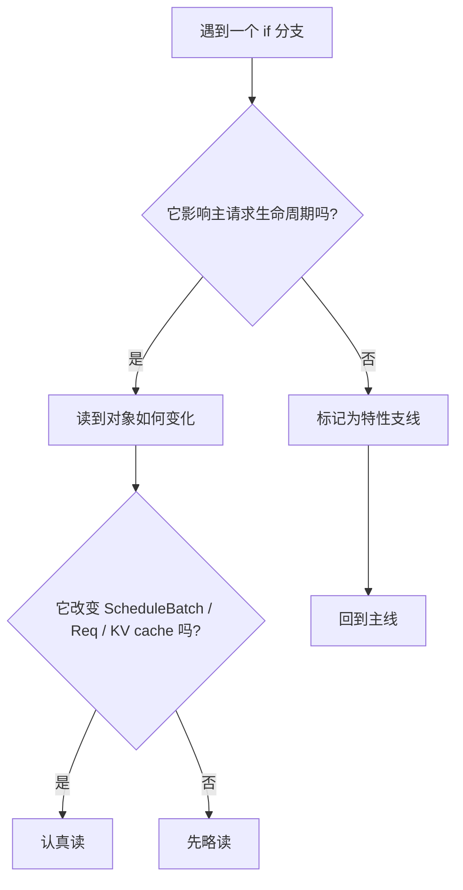

# SGLang 特性地图：读源码前先认识这些分支

这份文档不是用户手册，而是“读源码词典”。你在看 SGLang 源码时，经常会遇到 `dllm_config is not None`、`disaggregation_mode == PREFILL`、`enable_overlap`、`spec_algorithm`、`enable_hierarchical_cache` 这类分支。它们不是主链，但会频繁插进主链，让代码看起来像迷宫。

本讲目标：先知道这些特性分别解决什么问题、会影响哪条路径、第一次读源码时能不能先跳过。

## 总览图

## 读源码时的主线与支线

建议先把 SGLang 分成两层：

第一次读源码时，先走实线。虚线分支先知道“它为什么存在”，不急着逐行读。

## 1. Continuous Batching：连续动态合批

**它是什么**

Continuous batching 是 SGLang 的核心调度能力：请求不是凑齐一批后静态跑完，而是每一轮动态维护 `running_batch`。新请求可以在老请求 decode 过程中插入 prefill，然后加入后续 decode。

**解决什么问题**

- 提高 GPU 利用率。
- 避免短请求被长请求长期阻塞。
- 支撑高吞吐在线 serving。

**读源码入口**

- `/Users/zach/Source/SGLang/python/sglang/srt/managers/scheduler.py:895`
- `/Users/zach/Source/SGLang/python/sglang/srt/managers/scheduler.py:2404`
- `/Users/zach/Source/SGLang/python/sglang/srt/managers/schedule_batch.py:1481`

**第一次能否跳过**

不能。它是 Scheduler 的骨架。

## 2. Chunked Prefill：把长 prompt prefill 切块

**它是什么**

长 prompt 的 prefill 可能占用大量 KV cache 和 GPU 时间。Chunked prefill 会把很长的输入切成多个 chunk 分轮处理。

**解决什么问题**

- 降低超长 prompt 的一次性内存峰值。
- 避免长 prefill 长时间阻塞 decode。
- 和 pipeline parallel / disaggregation 配合时尤其重要。

**你会在代码里看到**

- `chunked_prefill_size`
- `chunked_req`
- `enable_dynamic_chunking`
- `enable_mixed_chunk`
- `ForwardMode.MIXED`

**读源码入口**

- `/Users/zach/Source/SGLang/python/sglang/srt/server_args.py:414`
- `/Users/zach/Source/SGLang/python/sglang/srt/managers/scheduler.py:2597`
- `/Users/zach/Source/SGLang/python/sglang/srt/managers/scheduler.py:2773`

**第一次能否跳过**

可以先跳过细节，但要知道它会影响 `get_new_batch_prefill` 和 `ScheduleBatch.prepare_for_extend`。

## 3. Radix Cache：前缀 KV cache 复用

**它是什么**

Radix cache 是一种 prefix cache。多个请求如果共享前缀 token，就可以复用已经计算过的 KV cache，而不是重新 prefill。

**解决什么问题**

- 多轮对话、相同 system prompt、相同 few-shot 示例可以复用前缀。
- 降低 TTFT。
- 减少重复计算。

**你会在代码里看到**

- `tree_cache`
- `prefix_indices`
- `match_prefix`
- `cache_unfinished_req`
- `disable_radix_cache`
- `radix_eviction_policy`

**读源码入口**

- `/Users/zach/Source/SGLang/python/sglang/srt/mem_cache/registry.py:77`
- `/Users/zach/Source/SGLang/python/sglang/srt/mem_cache/radix_cache.py`
- `/Users/zach/Source/SGLang/python/sglang/srt/managers/schedule_policy.py:887`

**第一次能否跳过**

不能完全跳过。至少要知道：Scheduler 在 prefill 前会尝试匹配 prefix，命中的部分不需要重新算。

## 4. HiCache：分层 KV cache

**它是什么**

HiCache 是 hierarchical cache：把 KV cache 从 GPU 扩展到更大的层级，比如 host memory 或 storage backend。可以理解成“GPU KV cache 不够时，把部分缓存搬到更慢但更大的地方”。

**解决什么问题**

- 支撑更长上下文或更多会话。
- 降低 GPU KV cache 压力。
- 在 cache 命中和换入换出之间做吞吐/延迟权衡。

**你会在代码里看到**

- `enable_hierarchical_cache`
- `hicache_ratio`
- `hicache_size`
- `hicache_write_policy`
- `hicache_storage_backend`
- `HiRadixCache`
- `UnifiedRadixCache.init_hicache`

**读源码入口**

- `/Users/zach/Source/SGLang/python/sglang/srt/server_args.py:673`
- `/Users/zach/Source/SGLang/python/sglang/srt/mem_cache/registry.py:117`
- `/Users/zach/Source/SGLang/python/sglang/srt/mem_cache/hiradix_cache.py`
- `/Users/zach/Source/SGLang/python/sglang/srt/mem_cache/hybrid_cache/hybrid_cache_controller.py`
- `/Users/zach/Source/SGLang/python/sglang/srt/entrypoints/http_server.py:846`

**第一次能否跳过**

可以。读 Scheduler 主线时，把它当成 `tree_cache` 的增强版本即可。

## 5. PD Disaggregation：Prefill/Decode 分离部署

**它是什么**

PD disaggregation 把 prefill 和 decode 拆到不同 worker 或不同机器上。Prefill worker 负责处理 prompt 并产出 KV cache；Decode worker 接收 KV cache 后继续逐 token 生成。

**为什么要拆**

Prefill 和 decode 的计算形态很不一样：

- Prefill：大矩阵、大 token 数、偏吞吐。
- Decode：每轮小 token、延迟敏感、持续迭代。

拆开后可以分别扩容、分别调参。

**模式**

代码里有三种：

- `null`：普通统一模式。
- `prefill`：这个进程只做 prefill worker。
- `decode`：这个进程只做 decode worker。

定义在：

- `/Users/zach/Source/SGLang/python/sglang/srt/disaggregation/utils.py:35`

**你会在代码里看到**

- `disaggregation_mode`
- `DisaggregationMode.PREFILL`
- `DisaggregationMode.DECODE`
- `bootstrap_host`
- `bootstrap_port`
- `bootstrap_room`
- `kv_sender`
- `kv_receiver`
- `disaggregation_transfer_backend`

**传输后端**

目录里能看到多种 backend：

- `fake`：测试/压测用，跳过真实 KV 传输。
- `mooncake`：面向高性能 KV transfer。
- `nixl`
- `mori`
- `ascend`
- `common/base`：抽象层和通用实现。

**读源码入口**

- `/Users/zach/Source/SGLang/python/sglang/srt/server_args.py:645`
- `/Users/zach/Source/SGLang/python/sglang/srt/disaggregation/prefill.py`
- `/Users/zach/Source/SGLang/python/sglang/srt/disaggregation/decode.py`
- `/Users/zach/Source/SGLang/python/sglang/srt/disaggregation/common/conn.py`
- `/Users/zach/Source/SGLang/python/sglang/srt/disaggregation/base/conn.py`

**第一次能否跳过**

可以。如果你不是专门读分布式 serving，先记住：它会让一次请求被拆成“prefill 阶段”和“decode 阶段”，中间多了 KV cache transfer。

## 6. dLLM：Diffusion LLM

**它是什么**

dLLM 指 Diffusion LLM，不是普通 autoregressive LLM。普通 LLM 每次生成下一个 token；dLLM 更像逐步填充或修正 masked tokens。SGLang 对它有单独的调度、batch 和结果处理路径。

**解决什么问题**

支持扩散式语言模型架构，比如代码里列出的：

- `LLaDA2MoeModelLM`
- `SDARForCausalLM`
- `SDARMoeForCausalLM`

**你会在代码里看到**

- `dllm_algorithm`
- `DllmConfig`
- `dllm_manager`
- `ForwardMode.DLLM_EXTEND`
- `get_new_batch_dllm`
- `process_batch_result_dllm`

**读源码入口**

- `/Users/zach/Source/SGLang/python/sglang/srt/server_args.py:700`
- `/Users/zach/Source/SGLang/python/sglang/srt/dllm/config.py:7`
- `/Users/zach/Source/SGLang/python/sglang/srt/dllm/mixin/scheduler.py:21`
- `/Users/zach/Source/SGLang/python/sglang/srt/dllm/algorithm`
- `/Users/zach/Source/SGLang/python/sglang/srt/models/sdar.py`

**它和普通 LLM 最大差异**

**第一次能否跳过**

可以。除非你正在读 `dllm` 目录或看到 `dllm_config is not None`，否则先把它当成“非自回归生成模型的特殊分支”。

## 7. Speculative Decoding：草稿模型加速生成

**它是什么**

Speculative decoding 用一个较便宜的 draft 模型先猜多个 token，再用 target 模型验证。猜对的 token 可以一次接受多个，从而减少 target 模型 forward 次数。

**解决什么问题**

- 提升 decode 吞吐。
- 降低每 token 平均计算成本。

**内置算法**

定义在：

- `/Users/zach/Source/SGLang/python/sglang/srt/speculative/spec_info.py:28`

包括：

- `EAGLE`
- `EAGLE3`
- `FROZEN_KV_MTP`
- `DFLASH`
- `STANDALONE`
- `NGRAM`

**你会在代码里看到**

- `speculative_algorithm`
- `spec_algorithm`
- `draft_model`
- `accept_lens`
- `num_correct_drafts`
- `verify`
- `is_spec_v2`

**典型流程**

**读源码入口**

- `/Users/zach/Source/SGLang/python/sglang/srt/speculative/spec_info.py:28`
- `/Users/zach/Source/SGLang/python/sglang/srt/speculative/eagle_worker.py`
- `/Users/zach/Source/SGLang/python/sglang/srt/speculative/eagle_worker_v2.py`
- `/Users/zach/Source/SGLang/python/sglang/srt/speculative/ngram_worker.py`
- `/Users/zach/Source/SGLang/python/sglang/srt/managers/scheduler_components/batch_result_processor.py:627`

**第一次能否跳过**

可以。读普通生成链路时，看到 `spec_algorithm.is_none()` 就沿着 `none` 分支走。

## 8. Overlap Schedule / CUDA Graph：调度和 GPU 执行优化

**Overlap Schedule 是什么**

把 CPU 调度、结果处理和 GPU forward 尽量重叠，减少空泡。普通模式是“跑完再处理”，overlap 模式更像流水线。

**CUDA Graph 是什么**

把固定形状的 GPU 执行图录下来复用，减少 kernel launch overhead。decode 阶段 batch shape 稳定时尤其有价值。

**你会在代码里看到**

- `disable_overlap_schedule`
- `enable_two_batch_overlap`
- `cuda_graph_max_bs`
- `can_run_cuda_graph`
- `graph_runner.replay`
- `future_map`

**读源码入口**

- `/Users/zach/Source/SGLang/python/sglang/srt/server_args.py:741`
- `/Users/zach/Source/SGLang/python/sglang/srt/managers/scheduler.py:1451`
- `/Users/zach/Source/SGLang/python/sglang/srt/managers/scheduler.py:2985`
- `/Users/zach/Source/SGLang/python/sglang/srt/model_executor/model_runner.py:3367`

**第一次能否跳过**

可以先读非 overlap、非 CUDA graph 分支。等主链通了再回来读性能优化。

## 9. Structured Output / Grammar：结构化输出约束

**它是什么**

让模型输出满足 JSON schema、regex、EBNF 等约束。实现方式通常是在采样前对词表做 mask，只允许合法 token。

**解决什么问题**

- 保证输出 JSON 可解析。
- 工具调用参数更稳定。
- 受控格式生成。

**后端**

`server_args.py` 里有 grammar backend choices：

- `xgrammar`
- `outlines`
- `llguidance`
- `none`

**你会在代码里看到**

- `grammar_backend`
- `grammar`
- `apply_vocab_mask`
- `response_format`
- `json_schema`
- `regex`
- `ebnf`

**读源码入口**

- `/Users/zach/Source/SGLang/python/sglang/srt/server_args.py:568`
- `/Users/zach/Source/SGLang/python/sglang/srt/constrained`
- `/Users/zach/Source/SGLang/python/sglang/srt/entrypoints/openai/protocol.py`
- `/Users/zach/Source/SGLang/python/sglang/srt/sampling`

**第一次能否跳过**

可以。但如果你读 OpenAI chat request conversion，会经常看到 tools / grammar / response_format 相关逻辑。

## 10. Reasoning Parser 与 Function Calling

**Reasoning Parser 是什么**

很多 reasoning 模型会输出“思考内容 + 最终答案”。Reasoning parser 用于解析、分离或约束 reasoning 部分。

**Function Calling 是什么**

把模型输出解析成工具调用格式，例如 OpenAI-compatible `tool_calls`。它常和 structured output、chat template、reasoning parser 交织在一起。

**你会在代码里看到**

- `reasoning_parser`
- `thinking_mode`
- `tool_call_parser`
- `tools`
- `tool_choice`
- `function_call`

**读源码入口**

- `/Users/zach/Source/SGLang/python/sglang/srt/server_args.py:520`
- `/Users/zach/Source/SGLang/python/sglang/srt/entrypoints/openai/serving_chat.py:546`
- `/Users/zach/Source/SGLang/python/sglang/srt/parser`
- `/Users/zach/Source/SGLang/python/sglang/srt/function_call`

**第一次能否跳过**

如果你只读普通文本生成，可以跳过。但读 `/v1/chat/completions` 时，它们会出现在 request conversion 阶段。

## 11. LoRA：运行时加载 adapter

**它是什么**

LoRA 允许在同一个 base model 上加载多个轻量 adapter，不重启服务就切换任务/风格/领域。

**解决什么问题**

- 多租户 adapter serving。
- 低成本模型微调部署。
- 动态加载/卸载 adapter。

**你会在代码里看到**

- `enable_lora`
- `lora_path`
- `lora_id`
- `lora_registry`
- `max_loaded_loras`
- `max_loras_per_batch`
- `lora_backend`
- `load_lora_adapter`

**读源码入口**

- `/Users/zach/Source/SGLang/python/sglang/srt/server_args.py:545`
- `/Users/zach/Source/SGLang/python/sglang/srt/lora`
- `/Users/zach/Source/SGLang/python/sglang/srt/entrypoints/http_server.py:1335`
- `/Users/zach/Source/SGLang/python/sglang/srt/entrypoints/openai/serving_base.py:41`
- `/Users/zach/Source/SGLang/python/sglang/srt/managers/scheduler.py:2633`

**第一次能否跳过**

可以。读 Scheduler 时看到 LoRA 分支，先理解为“同一 batch 里 adapter 数量有限，所以调度时要检查能不能混跑”。

## 12. Multimodal：图像、视频、音频输入

**它是什么**

支持 VLM、audio/video model 等多模态请求。OpenAI chat message 里可能包含 text/image/video/audio parts。

**解决什么问题**

- 服务视觉语言模型。
- 支持图片问答、视频理解、ASR 等。

**你会在代码里看到**

- `image_data`
- `video_data`
- `audio_data`
- `modalities`
- `multimodal_inputs`
- `mm_processor`
- `image_max_dynamic_patch`

**读源码入口**

- `/Users/zach/Source/SGLang/python/sglang/srt/entrypoints/openai/serving_chat.py:486`
- `/Users/zach/Source/SGLang/python/sglang/srt/multimodal`
- `/Users/zach/Source/SGLang/python/sglang/srt/managers/tokenizer_manager.py:735`

**第一次能否跳过**

可以。读纯文本 LLM 时，沿着非 multimodal 分支走。

## 13. Parallelism：TP、PP、DP Attention、EP

**TP：Tensor Parallel**

把单层矩阵计算切到多张 GPU 上。SGLang 里 `TpModelWorker` 就是主 worker。

入口：

- `/Users/zach/Source/SGLang/python/sglang/srt/managers/tp_worker.py`

**PP：Pipeline Parallel**

把不同层放到不同 GPU/节点，形成流水线。常和 chunked prefill 一起调。

入口：

- `/Users/zach/Source/SGLang/python/sglang/srt/managers/scheduler_pp_mixin.py`

**DP Attention**

Data parallel 场景下的一些 attention/MLP 同步优化。代码里会看到 `enable_dp_attention`、`dp_attn_adapter`。

入口：

- `/Users/zach/Source/SGLang/python/sglang/srt/server_args.py:743`
- `/Users/zach/Source/SGLang/python/sglang/srt/managers/scheduler_components/dp_attn.py`

**EP / MoE**

Expert parallelism 面向 MoE 模型，把专家分布到不同 rank。还会有 expert load balancing。

入口：

- `/Users/zach/Source/SGLang/python/sglang/srt/server_args.py:645`
- `/Users/zach/Source/SGLang/python/sglang/srt/eplb`
- `/Users/zach/Source/SGLang/python/sglang/srt/layers/moe`

**第一次能否跳过**

如果本地单卡读主线，绝大多数 parallel 分支都可以先跳过。

## 14. Quantization 与 Kernel Backend

**它是什么**

SGLang 支持不同权重量化、KV cache dtype、attention backend、sampling backend、MoE backend 等。它们主要影响 `ModelRunner` 初始化和模型层 kernel 选择。

**你会在代码里看到**

- `quantization`
- `kv_cache_dtype`
- `attention_backend`
- `decode_attention_backend`
- `prefill_attention_backend`
- `sampling_backend`
- `triton`
- `flashinfer`
- `cutlass`

**读源码入口**

- `/Users/zach/Source/SGLang/python/sglang/srt/server_args.py:396`
- `/Users/zach/Source/SGLang/python/sglang/srt/layers/quantization`
- `/Users/zach/Source/SGLang/python/sglang/srt/layers/attention`
- `/Users/zach/Source/SGLang/python/sglang/srt/model_executor/model_runner.py`

**第一次能否跳过**

可以。除非你在追性能问题，否则先把它看作“底层实现替换”。

## 15. Embedding / Scoring / Rerank

**它是什么**

SGLang 不只做 chat/completions，也支持 embedding、score、rerank、classify 等请求类型。这些请求不一定走生成式 decode loop。

**你会在代码里看到**

- `EmbeddingReqInput`
- `EmbeddingBatchResult`
- `serving_embedding`
- `serving_score`
- `serving_rerank`
- `is_generation`

**读源码入口**

- `/Users/zach/Source/SGLang/python/sglang/srt/entrypoints/openai/serving_embedding.py`
- `/Users/zach/Source/SGLang/python/sglang/srt/entrypoints/openai/serving_score.py`
- `/Users/zach/Source/SGLang/python/sglang/srt/entrypoints/openai/serving_rerank.py`
- `/Users/zach/Source/SGLang/python/sglang/srt/managers/scheduler.py:3097`

**第一次能否跳过**

可以。如果你只研究 chat completion，先关注 `GenerateReqInput`。

## 常见分支速查表

| 代码标志 | 大概含义 | 第一遍读主线怎么处理 |
|---|---|---|
| `self.dllm_config is not None` | Diffusion LLM 特殊路径 | 跳过，走普通 LLM 分支 |
| `disaggregation_mode != NULL` | Prefill/Decode 分离部署 | 跳过，走 unified 模式 |
| `not spec_algorithm.is_none()` | Speculative decoding | 跳过，走 non-spec 分支 |
| `enable_hierarchical_cache` | HiCache 分层缓存 | 当成增强版 radix cache |
| `disable_radix_cache` | 关闭 prefix cache | 理解为不复用前缀 |
| `chunked_req is not None` | 长 prompt 被切块 | 先理解为 prefill 没做完 |
| `enable_overlap` | CPU/GPU 流水重叠 | 先读 non-overlap 分支 |
| `can_run_cuda_graph` | 可复用 CUDA Graph | 先读普通 forward |
| `enable_lora` | adapter serving | 先理解为调度多一个约束 |
| `req.grammar is not None` | 结构化输出约束 | 先理解为采样前 mask 词表 |
| `model_config.is_multimodal` | 多模态模型 | 纯文本阅读时跳过 |
| `is_generation` | 生成 vs embedding/scoring | chat completion 走生成分支 |

## 推荐阅读策略

读 SGLang 最怕“每个 if 都想读懂”。更好的方式是：

1. 先读普通文本生成、非 spec、非 disagg、非 dLLM、非 LoRA、非 multimodal。
2. 第二遍读 Scheduler 和 KV cache。
3. 第三遍再逐个打开特性支线。

## 后续专题建议

建议后面按这个顺序深入：

1. KV cache / Radix cache / HiCache。
2. Speculative decoding。
3. PD disaggregation。
4. LoRA serving。
5. Structured output 与 function calling。
6. dLLM。

这样顺序比较自然：先掌握普通 LLM serving，再看性能优化，最后看特殊模型和特殊部署。
