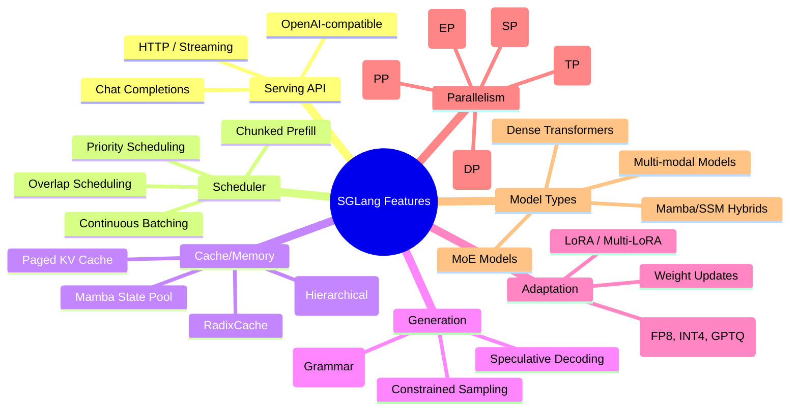
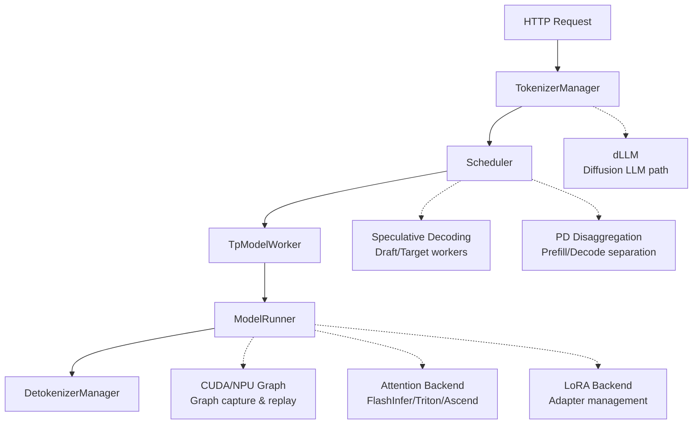

[中文](./00-feature-map.md) | [English](./00-feature-map_EN.md)

# SGLang Feature Map

## 1. Feature Overview



## 2. Main Path vs Branch Paths



## 3. Key Class Call Relationships

| Component | Source Location | Links Out | Links In | Role |
|---|---|---|---|---|
| `Scheduler` | `managers/scheduler.py` | 111 | ~50 | Central scheduling hub |
| `TokenizerManager` | `managers/tokenizer_manager.py` | 55 | ~20 | Request normalization & distribution |
| `ModelRunner` | `model_executor/model_runner.py` | 42 | ~30 | Model execution core |
| `CudaGraphRunner` | `model_executor/cuda_graph_runner.py` | 40 | ~10 | Graph capture & replay |
| `ForwardMode` | `forward_batch_info.py` | ~5 | 48 | Batch mode determination |

## 4. Dependency Relationship Quick Reference

### Runtime Object Dependency Tree

```text
Engine
  ├── TokenizerManager (request normalization)
  ├── Scheduler (batch formation & scheduling)
  │   ├── TpModelWorker (worker adapter)
  │   │   └── ModelRunner (model execution)
  │   ├── SchedulePolicy (priority calculation)
  │   ├── PrefillAdder (budget-managed prefill selection)
  │   ├── tree_cache (KV/Radix/HiCache)
  │   └── BatchResultProcessor (result processing)
  └── DetokenizerManager (output decoding)
```

### Data Object Conversion Chain

```text
GenerateReqInput → TokenizedGenerateReqInput → Req → ScheduleBatch
  → ForwardBatch → ModelRunnerOutput → GenerationBatchResult
```

## 5. Recommended Source Reading Path

| Step | File | Focus |
|---|---|---|
| 1 | `managers/scheduler.py` | `event_loop_normal`, main loop |
| 2 | `managers/schedule_batch.py` | `Req`, `ScheduleBatch` data structures |
| 3 | `managers/tp_worker.py` | `forward_batch_generation` bridge |
| 4 | `model_executor/model_runner.py` | `forward`, `_forward_raw` |
| 5 | `model_executor/forward_batch_info.py` | `ForwardBatch`, `ForwardMode` |
| 6 | `layers/attention/` | Attention backend selection |
| 7 | `mem_cache/` | KV Cache, Radix, HiCache |
| 8 | `distributed/parallel_state.py` | TP/PP/DP groups |
| 9 | `speculative/` | Draft/verify cycle |
| 10 | `disaggregation/` | PD separation |

## 6. Feature Source Location Quick Reference

| Feature | Source Location | First-Pass Reading |
|---|---|---|
| Continuous Batching | `scheduler.py:event_loop_normal` | Skip overlap logic |
| Chunked Prefill | `schedule_policy.py:PrefillAdder` | Focus on budget constraints |
| Overlap Scheduling | `scheduler.py:event_loop_overlap` | Read after normal loop |
| Radix Cache | `mem_cache/radix_cache.py` | Focus on tree structure |
| HiCache | `mem_cache/hicache/` | Focus on eviction policy |
| Speculative Decoding | `speculative/` | Focus on spec_info lifecycle |
| PD Disaggregation | `disaggregation/` | Focus on transfer engine |
| LoRA Serving | `lora/` | Focus on LoRABatchInfo |
| CUDA/NPU Graph | `cuda_graph_runner.py` | Focus on capture/replay |
| Attention Backend | `layers/attention/` | Focus on registry pattern |

## 7. Common Branch Quick Reference

| Code Flag | Meaning | When True |
|---|---|---|
| `is_npu()` | Running on Ascend NPU | `torch_npu` available |
| `enable_overlap` | Overlap scheduling active | Server arg set |
| `enable_lora` | LoRA serving active | `lora_paths` provided |
| `disaggregation_mode` | PD separation mode | NULL/PREFILL/DECODE |
| `is_draft_worker` | This is a draft model worker | Speculative decoding |
| `pp_group.is_last_rank` | Last PP stage | Can do sampling |
| `forward_mode.is_extend()` | Prefill/extend mode | Processing new prompt tokens |
| `forward_mode.is_decode()` | Decode mode | Processing single new token |
