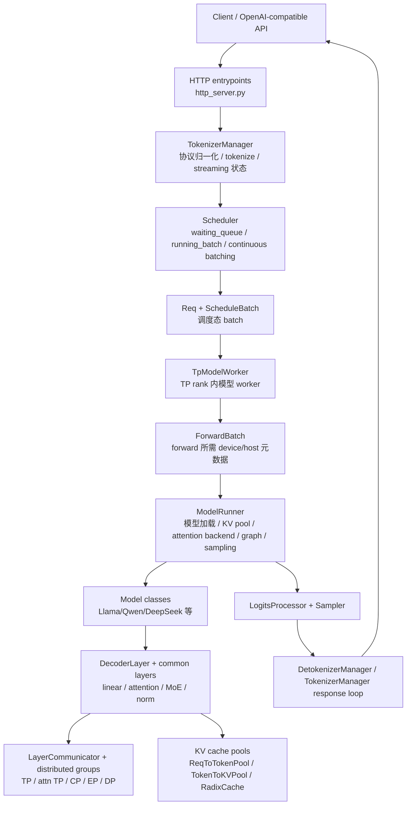

**中文** | [English](./01-public-components-code-walkthrough_EN.md)

# SGLang 公共组件全景与 Code Walkthrough

这一讲不是继续增加一个孤立专题，而是把 SGLang online serving 的高频公共组件按真实调用层次串起来。读完后，你应该能回答三个问题：

- 一个请求从 HTTP 入口到 GPU/NPU forward，会经过哪些稳定组件？
- `Scheduler`、`TpModelWorker`、`ModelRunner`、`ForwardBatch`、`LayerCommunicator` 分别站在哪一层？
- 读源码时应该先看哪些函数，哪些文件只是特性分支或 backend 替换？

## 1. 总体分层

SGLang 的 runtime 主链路可以理解为六层：



这里有一个重要直觉：`Scheduler` 管的是“请求如何排队与组成 batch”，`TpModelWorker` 管的是“这个 batch 交给哪个 tensor-parallel worker 执行”，`ModelRunner` 管的是“如何在当前 rank 上真的跑模型”，`LayerCommunicator` 管的是“每个 decoder layer 内部张量在 TP/EP/CP/DP 之间如何切分、聚合和归一化”。

## 2. 高频公共组件速查表

| 层级 | 高频组件 | 源码定位 | 主要职责 | 下游关系 |
|---|---|---|---|---|
| 入口/API 层 | FastAPI route handlers | `python/sglang/srt/entrypoints/http_server.py`：`openai_v1_chat_completions()`、`openai_v1_completions()`、`generate_request()`、`encode_request()`、`launch_server()` | 接收 OpenAI-compatible、native `/generate`、embedding/classify 等请求，转成内部 request object | 调 `TokenizerManager.generate_request()` |
| 进程启动层 | `Engine` | `python/sglang/srt/entrypoints/engine.py`：`Engine.__init__()`、`_launch_subprocesses()`、`_launch_scheduler_processes()`、`_launch_detokenizer_subprocesses()` | 拉起主进程内 TokenizerManager，以及 Scheduler / Detokenizer / DP controller 子进程 | 建立 IPC socket、port、rank 拓扑 |
| tokenize/control 层 | `TokenizerManager` | `python/sglang/srt/managers/tokenizer_manager.py`：`generate_request()`、`_tokenize_one_request()`、`_batch_tokenize_and_process()`、`_send_one_request()`、`_wait_one_response()`、`handle_loop()`、`_handle_batch_output()` | 统一请求格式、tokenize、多模态预处理、LoRA/grammar 校验、等待流式输出 | 通过 IPC 把 tokenized req 发给 Scheduler |
| 调度层 | `Scheduler` | `python/sglang/srt/managers/scheduler.py`：`run_event_loop()`、`event_loop_normal()`、`event_loop_overlap()`、`process_input_requests()`、`handle_generate_request()`、`get_next_batch_to_run()`、`get_new_batch_prefill()`、`run_batch()`、`process_batch_result()` | 维护 waiting/running/chunked/grammar/PD/LoRA/spec 队列，决定 prefill/decode batch，调用模型 worker | 调 `TpModelWorker.forward_batch_generation()` |
| 调度数据结构 | `Req` / `ScheduleBatch` | `python/sglang/srt/managers/schedule_batch.py`：`Req.__init__()`、`Req.init_next_round_input()`、`Req.update_finish_state()`、`ScheduleBatch.init_new()`、`prepare_for_extend()`、`prepare_for_decode()`、`merge_batch()`、`filter_batch()` | `Req` 表示单请求状态，`ScheduleBatch` 表示一次 forward 的调度态集合 | 被 Scheduler 创建，被 ForwardBatch 消费 |
| worker 层 | `TpModelWorker` | `python/sglang/srt/managers/tp_worker.py`：`TpModelWorker.__init__()`、`_init_model_config()`、`_init_model_runner()`、`forward_batch_generation()`、`forward_batch_split_prefill()` | 包装一个 TP rank 上的 `ModelRunner`，处理 pipeline rank、draft worker、sampling、embedding | 调 `ForwardBatch.init_new()` 和 `ModelRunner.forward()` |
| forward 元数据层 | `ForwardBatch` / `ForwardMode` | `python/sglang/srt/model_executor/forward_batch_info.py`：`ForwardMode`、`ForwardBatch.init_new()`、`prepare_mlp_sync_batch()`、`prepare_attn_tp_scatter_input()`、`post_forward_mlp_sync_batch()` | 把 `ScheduleBatch` 转成模型 forward 所需的 device tensors、positions、seq_lens、spec/LoRA/mm 元数据 | 传给 `ModelRunner`、模型层、attention backend |
| 模型执行层 | `ModelRunner` | `python/sglang/srt/model_executor/model_runner.py`：`__init__()`、`initialize()`、`init_torch_distributed()`、`load_model()`、`init_attention_backend()`、`forward()`、`_forward_raw()`、`forward_decode()`、`forward_extend()`、`sample()` | 初始化分布式、加载模型、创建 KV pool、选择 attention backend、执行 decode/extend/graph/sampling | 调模型类 `forward()`，调用 sampler |
| 模型层 | model classes | `python/sglang/srt/models/llama.py`：`LlamaForCausalLM.forward()`、`LlamaModel.forward()`、`LlamaDecoderLayer.forward()`、`LlamaAttention.forward()`；`python/sglang/srt/models/qwen2.py` 同构 | 具体模型结构：embedding、decoder layers、lm_head、权重加载 | 调 common layers、`RadixAttention`、`LogitsProcessor` |
| layer 公共层 | Linear / Attention / MoE / Norm | `python/sglang/srt/layers/linear.py`：`ColumnParallelLinear.forward()`、`RowParallelLinear.forward()`；`layers/radix_attention.py`：`RadixAttention.forward()`；`layers/moe/router.py`：`FusedMoeRouter.forward()`；`layers/moe/fused_moe_triton/layer.py`：`FusedMoE.forward()` | 把模型结构落到并行 linear、attention、MoE routing、fused kernel | 读写 KV pool，调用通信组 |
| layer 通信层 | `LayerCommunicator` | `python/sglang/srt/layers/communicator.py`：`LayerScatterModes.init_new()`、`LayerCommunicator.__init__()`、`prepare_attn()`、`prepare_mlp()`、`postprocess_layer()`、`should_use_reduce_scatter()`；`communicator_dsa_cp.py`：`DSACPLayerCommunicator` | 决定每层输入/attention/MLP/output 的 scatter/gather/all-reduce/reduce-scatter 模式 | 使用 `get_tp_group()`、`get_attn_tp_group()`、`get_moe_ep_group()` |
| 分布式通信层 | `GroupCoordinator` | `python/sglang/srt/distributed/parallel_state.py`：`GroupCoordinator`、`initialize_model_parallel()`、`get_tp_group()`、`get_attn_tp_group()`、`get_attn_cp_group()`、`get_moe_ep_group()`、`get_moe_dp_group()` | 封装 PyTorch process group、NCCL/HCCL/XPU/NPU communicator、all-reduce/all-gather/reduce-scatter | 被 linear、MoE、LayerCommunicator、ModelRunner 使用 |
| KV/cache 层 | pools + prefix cache | `python/sglang/srt/mem_cache/memory_pool.py`：`ReqToTokenPool`、`MHATokenToKVPool`、`MLATokenToKVPool`；`mem_cache/allocator/base.py`：`BaseTokenToKVPoolAllocator`；`mem_cache/radix_cache.py`：`RadixCache`；`mem_cache/chunk_cache.py`：`ChunkCache` | 管请求到 token slot 的映射、KV page/slot 分配、prefix 命中与 eviction | Scheduler 分配，attention backend 写入/读取 |
| 输出层 | logits / sampling / detokenize | `python/sglang/srt/layers/logits_processor.py`：`LogitsProcessor.forward()`；`layers/sampler.py`：`Sampler.forward()`；`sampling/sampling_batch_info.py`：`SamplingBatchInfo.from_schedule_batch()`；`managers/detokenizer_manager.py`：`event_loop()`、`handle_batch_token_id_out()` | logits 后处理、grammar mask、采样、logprob、增量 detokenize、流式返回 | 回到 TokenizerManager 或 HTTP worker |

## 3. 主链路 Code Walkthrough

下面按一次生成请求的顺序走，读源码时建议每一步只抓“这个函数把状态交给谁”。

### 3.1 HTTP 请求进入

入口在 `python/sglang/srt/entrypoints/http_server.py`：

- `openai_v1_chat_completions()` 和 `openai_v1_completions()` 处理 OpenAI-compatible 请求。
- native `/generate` 入口是 `generate_request()`。
- embedding/classify 入口是 `encode_request()` 和 classify route。
- 这些 route 最终都调用 `_global_state.tokenizer_manager.generate_request(...)`。

这一层只做协议转换、鉴权、异常响应和 stream/non-stream 分支，不直接接触 batch、KV cache 或 GPU。

### 3.2 TokenizerManager 做请求归一化

进入 `python/sglang/srt/managers/tokenizer_manager.py` 的 `TokenizerManager.generate_request()` 后，核心顺序是：

1. `obj.normalize_batch_and_arguments()`：把单请求/批请求字段归一化。
2. `_set_default_priority()`：补默认优先级，后续 Scheduler policy 会用。
3. `_init_req_state()`：在 TokenizerManager 侧建立 request state，用于等待输出、abort、metrics、dump。
4. `_validate_and_resolve_lora()`：解析 LoRA 引用，避免 Scheduler 才发现 adapter 不合法。
5. `_tokenize_one_request()` 或 `_handle_batch_request()`：把文本、多模态输入转成 token ids 和内部 request object。
6. `_send_one_request()` / `_send_batch_request()`：通过 IPC 发给 Scheduler。
7. `_wait_one_response()` 或 `_handle_batch_output()`：等待 Scheduler/Detokenizer 返回增量 token 或最终结果。

读这里时要注意：`TokenizerManager` 是 control plane，持有 tokenizer、request state、streaming 状态，但它不决定 prefill/decode 如何混批。

### 3.3 Scheduler 接收请求并生成 ScheduleBatch

核心在 `python/sglang/srt/managers/scheduler.py`：

- `run_event_loop()` 创建 schedule stream，然后分发到 `event_loop_normal()`、`event_loop_overlap()` 或 PP/PD 特化事件循环。
- `event_loop_normal()` 的骨架是固定的：收请求 -> `process_input_requests()` -> `get_next_batch_to_run()` -> `run_batch()` -> `process_batch_result()`。
- `event_loop_overlap()` 在同一骨架上加入 schedule stream / forward stream 的重叠，把上一轮结果处理与当前轮 GPU forward 交错执行。
- `process_input_requests()` 通过 `_request_dispatcher` 把不同消息类型交给 `handle_generate_request()`、embedding、RPC、profile、weight update、LoRA control 等 handler。
- `handle_generate_request()` 把请求包装为 `Req`，放入 waiting queue、grammar queue、session queue 或 PD 相关队列。
- `get_next_batch_to_run()` 决定下一轮跑 prefill 还是 decode。它会先把上一轮 prefill batch 合并进 `running_batch`，再调用 `get_new_batch_prefill()`，如果没有新 prefill，才从 `running_batch` 取 decode batch。
- `get_new_batch_prefill()` 和 `_get_new_batch_prefill_raw()` 负责 prefix cache 命中、chunked prefill、优先级、内存预算、`PrefillAdder` 选择。
- `run_batch()` 把 `ScheduleBatch` 交给 `model_worker.forward_batch_generation()`，并在 overlap/spec/PDmux/embedding 等模式下选择不同 forward 分支。
- `process_batch_result()` 根据 `ForwardMode` 把结果交给 decode/prefill/prebuilt/idle 的 processor，更新请求状态、释放 cache、发送输出。

`Scheduler` 的关键不在某一个函数，而在 `waiting_queue`、`running_batch`、`last_batch`、`chunked_req`、`tree_cache`、`req_to_token_pool`、`token_to_kv_pool_allocator` 之间的状态迁移。

### 3.4 Req 与 ScheduleBatch 是调度态核心

`python/sglang/srt/managers/schedule_batch.py` 里有两个必须反复看的类：

- `Req`：单请求状态。重点看 `__init__()`、`init_next_round_input()`、`update_finish_state()`、`reset_for_retract()`、`offload_kv_cache()`、`load_kv_cache()`。
- `ScheduleBatch`：一次 forward 的调度态 batch。重点看 `init_new()`、`prepare_for_extend()`、`prepare_for_decode()`、`mix_with_running()`、`check_decode_mem()`、`retract_decode()`、`filter_batch()`、`merge_batch()`。

可以把二者理解为：

```text
Req = 一个用户请求的长期状态
ScheduleBatch = 某一次模型 forward 要处理的一组 Req 的短期视图
ForwardBatch = 这个短期视图被投影到模型执行所需的 tensors 和 metadata
```

### 3.5 TpModelWorker 把调度态 batch 交给模型执行态

`python/sglang/srt/managers/tp_worker.py` 的 `TpModelWorker` 是 Scheduler 和 ModelRunner 的边界：

- `TpModelWorker.__init__()` 记录 `tp_rank`、`pp_rank`、`moe_ep_rank`、`dp_rank`、`gpu_id`，初始化 tokenizer、model config、model runner。
- `_init_model_config()` 从 `ServerArgs` 解析目标模型或 draft 模型的 `ModelConfig`。
- `_init_model_runner()` 创建当前 TP rank 上的 `ModelRunner`。
- `forward_batch_generation()` 是主入口：如果传入的是 `ScheduleBatch`，先调用 `ForwardBatch.init_new(batch, self.model_runner)`；然后调用 `self.model_runner.forward(...)`；最后在最后一个 PP rank 上执行 sampling 或 logprob-only。
- `forward_batch_split_prefill()` 是 PD multiplexing / split prefill 场景的分段 forward 入口。

这一层不负责调度策略，也不负责具体 attention kernel；它负责把 Scheduler 的 batch 转成 ModelRunner 能跑的 batch，并处理 TP/PP rank 相关的返回形式。

### 3.6 ForwardBatch 是模型执行的元数据合同

`python/sglang/srt/model_executor/forward_batch_info.py` 的 `ForwardBatch.init_new()` 很长，因为它承担了调度态到执行态的转换：

- 从 `ScheduleBatch` 拿 `input_ids`、`req_pool_indices`、`seq_lens`、`out_cache_loc`、`extend_lens`、`prefix_lens`。
- 根据 `ForwardMode` 区分 decode、extend、idle、target verify、split prefill。
- 计算 `positions`、`extend_start_loc`、`extend_num_tokens`。
- 携带 `sampling_info`、`spec_info`、LoRA ids、多模态输入、return logprob、hidden states capture 等侧路元数据。
- 在 DP attention / MLP sync 场景准备 `global_num_tokens` 相关 host/device tensor。
- 在 LoRA 开启时调用 `lora_manager.prepare_lora_batch(ret)`。

你可以把 `ForwardBatch` 当成模型层的“执行合同”：模型、attention backend、layer communicator、sampler 都依赖它，而不是再回头读 Scheduler 的复杂状态。

### 3.7 ModelRunner 进入真正 forward

`python/sglang/srt/model_executor/model_runner.py` 是模型执行层中心：

- `ModelRunner.__init__()` 解析 device、rank、parallel size、spec algorithm、page size、model config，然后调用 `init_torch_distributed()`、`init_shared_mooncake_transfer_engine()`、`initialize()`。
- `initialize()` 负责 expert metadata、EPLB、memory saver、模型加载、KV pool、attention backend、CUDA/NPU graph 等初始化。
- `load_model()` 通过 `model_loader` 创建模型类并加载权重。
- `init_attention_backend()` 根据 `server_args.attention_backend`、模型 attention arch、device backend 创建实际 attention backend。
- `forward()` 做外层包装：forward pass id、profiler/canary/expert recorder，然后调用 `_forward_raw()`。
- `_forward_raw()` 根据 `ForwardMode` 分发：decode -> `forward_decode()`，extend -> `forward_extend()`，split prefill -> `forward_split_prefill()`，idle -> `forward_idle()`。
- `forward_decode()` 和 `forward_extend()` 都会先初始化 attention metadata，再调用 `self.model.forward(input_ids, positions, forward_batch, ...)`。
- `sample()` 对 `LogitsProcessorOutput` 做 grammar/logits bias 预处理，再调用 `Sampler` 生成 next token ids。

这一层最适合观察“执行模式”如何分叉：decode 可能命中 cuda graph，extend 可能走 piecewise graph，PDmux 会选择 per-stream backend，speculative 可能有 draft/verify 多步。

### 3.8 模型类和 layer 层执行

以 `python/sglang/srt/models/llama.py` 和 `python/sglang/srt/models/qwen2.py` 为代表：

- `LlamaForCausalLM.forward()` / `Qwen2ForCausalLM.forward()`：顶层 causal LM forward，调用 backbone，再过 `LogitsProcessor`。
- `LlamaModel.forward()` / `Qwen2Model.forward()`：embedding 后遍历 decoder layers。
- `LlamaDecoderLayer.forward()` / `Qwen2DecoderLayer.forward()`：典型结构是 layernorm -> attention -> residual -> layernorm -> MLP/MoE -> residual。
- `LlamaAttention.forward()` / `Qwen2Attention.forward()`：QKV projection、RoPE、调用 `RadixAttention.forward()`。

公共 layer 在 `python/sglang/srt/layers/`：

- `linear.py`：`ColumnParallelLinear.forward()`、`RowParallelLinear.forward()`、`QKVParallelLinear`，负责 TP sharding 后的 GEMM 和必要 all-reduce。
- `radix_attention.py`：`RadixAttention.forward()`，把 q/k/v 和 `ForwardBatch` 交给当前 attention backend，同时处理 KV cache 写入。
- `attention/base_attn_backend.py`：`AttentionBackend.init_forward_metadata()`、`forward_decode()`、`forward_extend()` 是所有 backend 的共同接口。
- `attention/flashinfer_backend.py`、`attention/triton_backend.py` 等：具体 backend 的 metadata 构建和 kernel 调用。
- `moe/router.py`：`FusedMoeRouter.forward()` 做 expert top-k 路由。
- `moe/fused_moe_triton/layer.py`：`FusedMoE.forward()`、`forward_impl()`、`run_moe_core()` 执行 expert dispatch、专家计算、combine。

### 3.9 LayerCommunicator 处理 layer 内张量布局

`python/sglang/srt/layers/communicator.py` 是理解 TP/EP/CP/DP 张量流的关键文件：

- `LayerScatterModes.init_new()` 根据当前 layer 是否稀疏、是否 MoE、是否启用 dense fully-DP、是否 context parallel，计算 `layer_input_mode`、`attn_mode`、`mlp_mode`、`middle_residual_mode`、`layer_output_mode`。
- `LayerCommunicator.__init__()` 接收 input layernorm、post-attention layernorm 和 scatter modes，预先选择通信函数。
- `_post_init_communicate()` 绑定三类函数：进入 attention 前的 simple communicate，attention 后到 MLP 前的 all-reduce + layernorm，MLP 后输出的 summable pair communicate。
- `prepare_attn()` 处理输入 layernorm、必要的 reduce-scatter/all-gather，并把 attention 输入切到 backend 期望的布局。
- `prepare_mlp()` 处理 attention 输出到 MLP/MoE 输入之间的通信与 layernorm。
- `postprocess_layer()` 处理 MLP/MoE 输出和 residual 的聚合、scatter、reduce-scatter。
- `should_use_reduce_scatter()` 判断当前 forward 是否可以把 all-reduce 优化成 reduce-scatter。

如果你正在读某个具体模型的 `DecoderLayer.forward()`，看到它调用 `LayerCommunicator` 时，可以暂时不用陷入所有 backend 分支，只需判断这一层的张量布局从什么模式变成了什么模式。

### 3.10 KV/cache 层贯穿调度和 attention

KV/cache 不是单独的一步，而是贯穿 Scheduler、ForwardBatch、attention backend：

- `ReqToTokenPool`：`python/sglang/srt/mem_cache/memory_pool.py`，保存 req slot 到 token slot 的映射。
- `BaseTokenToKVPoolAllocator`：`python/sglang/srt/mem_cache/allocator/base.py`，定义 KV slot/page 的 alloc/free 接口。
- `MHATokenToKVPool` / `MLATokenToKVPool`：`memory_pool.py`，保存实际 K/V tensor buffer。
- `RadixCache`：`python/sglang/srt/mem_cache/radix_cache.py`，做 prefix match、insert、evict、lock ref。
- `ChunkCache`：`python/sglang/srt/mem_cache/chunk_cache.py`，在不使用 radix tree 或 chunk 场景下提供 cache 接口。

典型路径是：Scheduler 在 prefill/decode 前计算需要多少 token slot，分配 `out_cache_loc`，`ForwardBatch` 携带这些位置进入模型，`RadixAttention.forward()` 和 attention backend 在 forward 时把新的 K/V 写入对应 KV pool。

### 3.11 分布式 rank 与 layer 通信

`python/sglang/srt/distributed/parallel_state.py` 的 `initialize_model_parallel()` 是 rank 分组总入口。它会创建：

- TP group：普通 tensor parallel，给 linear、sampler、部分 all-reduce 用。
- attention TP group：attention 内部的 tensor parallel，可能小于/不同于普通 TP。
- attention CP group：长上下文 prefill 的 context parallel group。
- MoE EP group：expert parallel group，用于专家切分。
- MoE DP group：MoE expert/data parallel 之间的复制或路由维度。
- PP group：pipeline parallel group。

所有 group 都由 `GroupCoordinator` 包装，提供 `all_reduce()`、`reduce_scatter_tensor()`、`all_gather_into_tensor()`、`broadcast_object()`、`send_tensor_dict()`、`recv_tensor_dict()` 等统一接口。上层的 `LayerCommunicator`、`ColumnParallelLinear`、`RowParallelLinear`、MoE dispatcher、Sampler 不直接管理 PyTorch process group，而是通过这些 getter 拿到当前 rank 所在 group。

### 3.12 输出与 detokenize

最后一段链路是：

1. `ModelRunner.sample()` 调 `Sampler.forward()` 生成 next token ids。
2. `TpModelWorker.forward_batch_generation()` 把 next token ids 和 logprob/hidden states 等包装成 `GenerationBatchResult`。
3. `Scheduler.process_batch_result()` 更新 `Req`，判断 stop/max token/abort，决定继续 decode、释放请求或发送输出。
4. `DetokenizerManager.event_loop()` 和 `handle_batch_token_id_out()` 做增量 detokenize。
5. `TokenizerManager.handle_loop()` / `_handle_batch_output()` 接收结果，匹配 request state，向 HTTP stream 返回 chunk 或 final response。

## 4. 按层阅读建议

如果你只想快速建立主干，按这个顺序读：

1. `http_server.py`：`openai_v1_chat_completions()` -> `generate_request()`。
2. `tokenizer_manager.py`：`TokenizerManager.generate_request()` -> `_send_one_request()` -> `_wait_one_response()`。
3. `scheduler.py`：`event_loop_normal()` -> `get_next_batch_to_run()` -> `run_batch()` -> `process_batch_result()`。
4. `schedule_batch.py`：`Req` 和 `ScheduleBatch` 的生命周期方法。
5. `tp_worker.py`：`TpModelWorker.forward_batch_generation()`。
6. `forward_batch_info.py`：`ForwardBatch.init_new()`。
7. `model_runner.py`：`forward()` -> `_forward_raw()` -> `forward_decode()` / `forward_extend()` -> `sample()`。
8. `models/llama.py` 或 `models/qwen2.py`：`ForCausalLM.forward()` -> `Model.forward()` -> `DecoderLayer.forward()` -> `Attention.forward()`。
9. `layers/communicator.py` 和 `layers/radix_attention.py`：layer 内通信与 attention backend 边界。
10. `mem_cache/` 和 `distributed/parallel_state.py`：当你已经知道谁在用 cache 和 group，再回头看这些基础设施。

如果你想读某个高级特性，先找到它“插入主链路”的位置：

- Speculative Decoding：插在 Scheduler `run_batch()`、TpWorker `forward_batch_generation()`、ModelRunner draft/verify 分支、`ForwardBatch.spec_info`。
- PD 分离：插在 Scheduler 事件循环、`disaggregation/prefill.py`、`disaggregation/decode.py`、KV transfer backend。
- LoRA：插在 TokenizerManager adapter 解析、Scheduler 混批约束、`ForwardBatch.init_new()`、`lora_manager.prepare_lora_batch()`、LoRA kernel。
- Router：插在 HTTP/worker 外层，决定请求发给哪个 SGLang worker 或哪个 prefill/decode 角色。

## 5. 本讲和其他讲义的关系

- 想看一次请求的端到端细节：读 [01-entry-routing/01-request-lifecycle.md](../01-entry-routing/01-request-lifecycle.md)。
- 想看 Scheduler 如何组 batch：读 [02-scheduler-runtime/02-scheduler-core.md](../02-scheduler-runtime/02-scheduler-core.md)。
- 想看 KV cache 与 prefix cache：读 [03-cache-memory/03-kv-cache-radix-cache.md](../03-cache-memory/03-kv-cache-radix-cache.md)。
- 想看 ModelRunner 和 attention backend：读 [04-model-execution/04-model-runner-attention.md](../04-model-execution/04-model-runner-attention.md)。
- 想看 layer 内通信和 common layers：读 [05-layer-communication/01-layer-communicator-and-common-layers.md](../05-layer-communication/01-layer-communicator-and-common-layers.md)。
