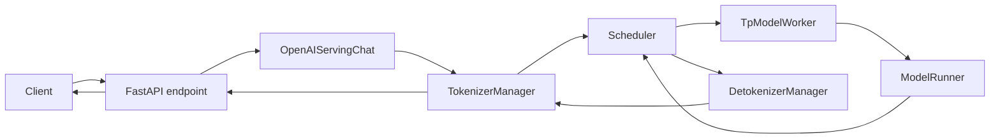
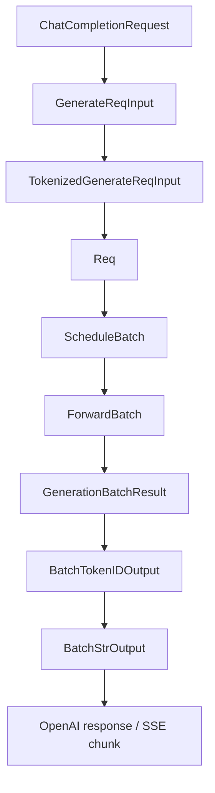
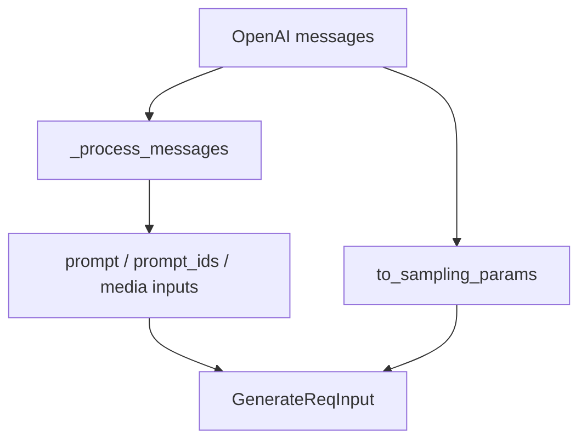
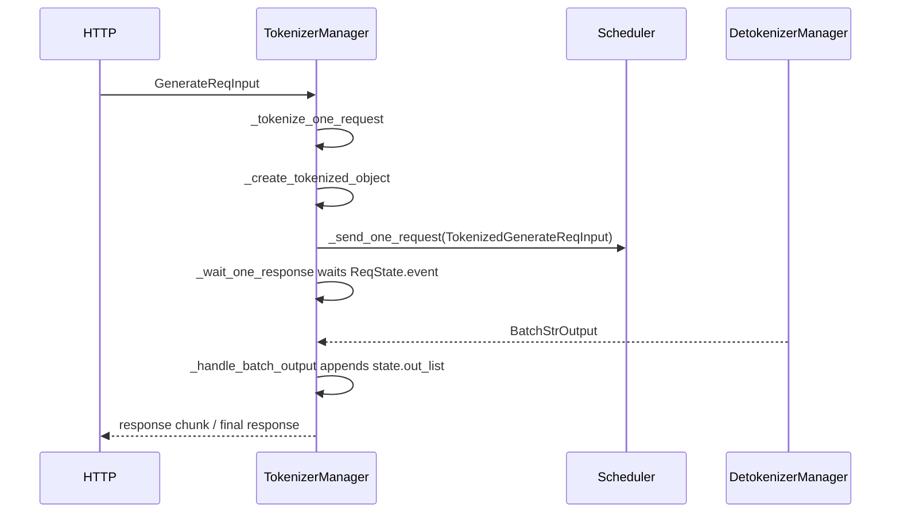
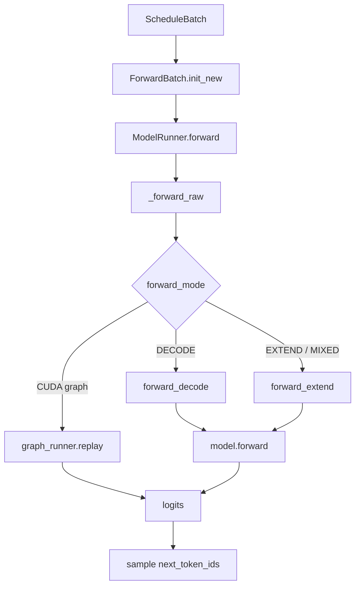
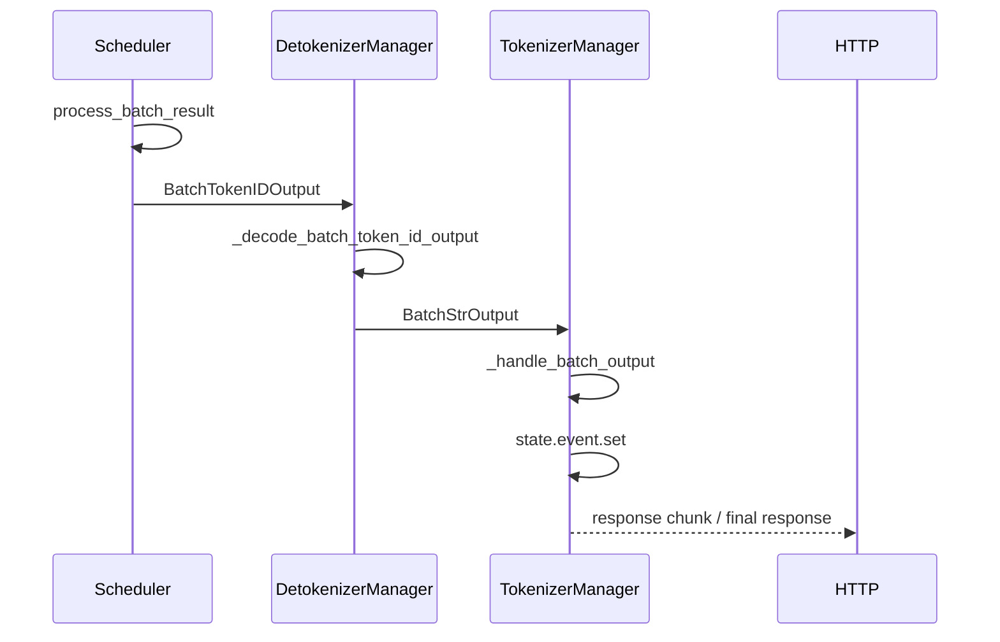

# 第 1 讲：一次 ChatCompletion 请求的完整生命周期

本讲目标：理解一个 OpenAI-compatible `/v1/chat/completions` 请求如何进入 SGLang，如何被转换成内部请求、tokenize、调度、送入模型前向计算，并最终 detokenize 后返回客户端。

## 一句话总览

SGLang 的生成请求主链可以先看成 8 个关口：



对应的数据结构变形是：



## 阶段 1：HTTP 入口

| 文件 | 函数 / 代码段 | 作用 |
|---|---|---|
| `python/sglang/srt/entrypoints/http_server.py` | `openai_v1_chat_completions()` | FastAPI 的 `/v1/chat/completions` 路由入口。 |
| `python/sglang/srt/entrypoints/http_server.py` | `raw_request.app.state.openai_serving_chat.handle_request(...)` | 把 HTTP 请求交给 OpenAI chat adapter。 |

关键代码段：

```python
@app.post("/v1/chat/completions", dependencies=[Depends(validate_json_request)])
async def openai_v1_chat_completions(
    request: ChatCompletionRequest, raw_request: Request
):
    return await raw_request.app.state.openai_serving_chat.handle_request(
        request, raw_request
    )
```

这一层基本不理解模型，也不理解调度，只负责把请求交给 `OpenAIServingChat`。

## 阶段 2：OpenAI 请求转内部请求

| 文件 | 类 / 函数 | 重点代码段 |
|---|---|---|
| `python/sglang/srt/entrypoints/openai/serving_base.py` | `OpenAIServingBase.handle_request()` | 调 `_validate_request()`、`_convert_to_internal_request()`，再按 `stream` 分到 `_handle_streaming_request()` 或 `_handle_non_streaming_request()`。 |
| `python/sglang/srt/entrypoints/openai/serving_chat.py` | `OpenAIServingChat._convert_to_internal_request()` | 构造 `GenerateReqInput`，这是进入 SGLang 内部生成引擎的请求对象。 |
| `python/sglang/srt/entrypoints/openai/serving_chat.py` | `OpenAIServingChat._process_messages()` | 处理 messages、chat template、tools、reasoning parser、多模态输入。 |
| `python/sglang/srt/entrypoints/openai/serving_chat.py` | `request.to_sampling_params(...)` 调用点 | 把 OpenAI 参数转换成 SGLang sampling params。 |

心智模型：



读这里时要关注：`ChatCompletionRequest` 不是直接送给 Scheduler，而是先被 adapter 翻译成 `GenerateReqInput`。

## 阶段 3：TokenizerManager tokenize 并分发

| 文件 | 类 / 函数 | 重点代码段 |
|---|---|---|
| `python/sglang/srt/managers/tokenizer_manager.py` | `TokenizerManager.generate_request()` | 主入口：初始化状态、tokenize、发送请求、等待返回。 |
| `python/sglang/srt/managers/tokenizer_manager.py` | `TokenizerManager._tokenize_one_request()` | 单请求 tokenize，产出 token ids 和 processor 结果。 |
| `python/sglang/srt/managers/tokenizer_manager.py` | `TokenizerManager._create_tokenized_object()` | 构造 `TokenizedGenerateReqInput` 或 embedding 类 tokenized object。 |
| `python/sglang/srt/managers/tokenizer_manager.py` | `TokenizerManager._send_one_request()` | 把 tokenized object 发往 Scheduler。 |
| `python/sglang/srt/managers/tokenizer_manager.py` | `TokenizerManager._wait_one_response()` | HTTP 协程等待 `ReqState.event`，并逐块 yield 结果。 |
| `python/sglang/srt/managers/tokenizer_manager.py` | `TokenizerManager.handle_loop()` / `_handle_batch_output()` | 接收 Detokenizer 返回的 `BatchStrOutput`，写入 `rid_to_state`。 |

这里最重要的不是 tokenizer 细节，而是两个边界：



## 阶段 4：Scheduler 接收、排队、组 batch

| 文件 | 类 / 函数 | 重点代码段 |
|---|---|---|
| `python/sglang/srt/managers/scheduler.py` | `Scheduler.event_loop_normal()` | 普通调度主循环：收请求、处理输入、取 batch、forward、处理结果。 |
| `python/sglang/srt/managers/scheduler.py` | `Scheduler.event_loop_overlap()` | overlap 调度主循环：把结果处理和下一轮 forward 做流水重叠。 |
| `python/sglang/srt/managers/scheduler.py` | `Scheduler.process_input_requests()` | 按请求类型分发到生成、embedding、控制请求等 handler。 |
| `python/sglang/srt/managers/scheduler.py` | `Scheduler.handle_generate_request()` | 把 `TokenizedGenerateReqInput` 包装成内部 `Req`。 |
| `python/sglang/srt/managers/scheduler.py` | `Scheduler._add_request_to_queue()` | 真正把 `Req` 放进 `waiting_queue`。 |
| `python/sglang/srt/managers/scheduler.py` | `Scheduler.get_next_batch_to_run()` | 调度决策中心：先尝试 prefill，再推进 decode。 |
| `python/sglang/srt/managers/scheduler.py` | `Scheduler.run_batch()` | 调 worker forward，拿到 `GenerationBatchResult`。 |

主循环骨架可以简化成：

```python
recv_reqs = self.request_receiver.recv_requests()
self.process_input_requests(recv_reqs)
batch = self.get_next_batch_to_run()
if batch:
    result = self.run_batch(batch)
    self.process_batch_result(batch, result)
```

`Scheduler` 是后续最值得深挖的模块，因为 continuous batching、prefill/decode 切换、radix cache、chunked prefill、overlap schedule 都在这里交汇。

## 阶段 5：TpModelWorker 与 ModelRunner 前向

| 文件 | 类 / 函数 | 重点代码段 |
|---|---|---|
| `python/sglang/srt/managers/tp_worker.py` | `TpModelWorker.forward_batch_generation()` | 从 `ScheduleBatch` 构造 `ForwardBatch`，调用 `ModelRunner.forward()`，再调用 `ModelRunner.sample()`。 |
| `python/sglang/srt/model_executor/forward_batch_info.py` | `ForwardBatch.init_new()` | 把调度层 batch 转成模型前向需要的 tensor 和 metadata。 |
| `python/sglang/srt/model_executor/model_runner.py` | `ModelRunner.forward()` | 外层前向入口，包 profiling/debug 等外围逻辑。 |
| `python/sglang/srt/model_executor/model_runner.py` | `ModelRunner._forward_raw()` | 根据 `ForwardMode` 分发到 CUDA graph、decode、extend、split prefill 等路径。 |
| `python/sglang/srt/model_executor/model_runner.py` | `ModelRunner.forward_decode()` | decode 路径：初始化 attention metadata 后跑模型。 |
| `python/sglang/srt/model_executor/model_runner.py` | `ModelRunner.forward_extend()` | extend/prefill 路径：处理一段新 token。 |
| `python/sglang/srt/model_executor/model_runner.py` | `ModelRunner.sample()` | 从 logits 采样出下一批 token ids。 |



## 阶段 6：结果返回和 detokenize

| 文件 | 类 / 函数 | 重点代码段 |
|---|---|---|
| `python/sglang/srt/managers/scheduler.py` | `Scheduler.process_batch_result()` | 将 worker 结果交给 `BatchResultProcessor`。 |
| `python/sglang/srt/managers/scheduler_components/batch_result_processor.py` | `BatchResultProcessor.process_batch_result_prefill()` | 处理 prefill/extend 后采样出的首 token、finish 状态和 cache。 |
| `python/sglang/srt/managers/scheduler_components/batch_result_processor.py` | `BatchResultProcessor.process_batch_result_decode()` | 处理 decode 每轮追加的 token、finish 状态和输出。 |
| `python/sglang/srt/managers/scheduler_components/output_streamer.py` | `OutputStreamer` 的 token 输出方法 | 把 `BatchTokenIDOutput` 发送给 Detokenizer。 |
| `python/sglang/srt/managers/detokenizer_manager.py` | `DetokenizerManager.event_loop()` | Detokenizer 主循环，接收 Scheduler 的 token id 输出。 |
| `python/sglang/srt/managers/detokenizer_manager.py` | `DetokenizerManager.handle_batch_token_id_out()` | 处理一批 token id 输出。 |
| `python/sglang/srt/managers/detokenizer_manager.py` | `DetokenizerManager._decode_batch_token_id_output()` | token ids 到文本的核心 decode 逻辑。 |
| `python/sglang/srt/managers/tokenizer_manager.py` | `TokenizerManager._handle_batch_output()` | 将文本结果写回对应 `ReqState`，唤醒 HTTP 协程。 |

这里的关键设计：HTTP 请求协程不是轮询 Scheduler，而是在 `ReqState.event` 上等待。Detokenizer 返回后，`TokenizerManager._handle_batch_output()` 把文本放进 `state.out_list`，再 `event.set()` 唤醒等待协程。



## 这一讲的阅读任务

按下面顺序跟读，不要只打开文件，要直接跳到对应函数：

| 顺序 | 文件 | 函数 / 代码段 |
|---:|---|---|
| 1 | `python/sglang/srt/entrypoints/http_server.py` | `openai_v1_chat_completions()` |
| 2 | `python/sglang/srt/entrypoints/openai/serving_base.py` | `OpenAIServingBase.handle_request()` |
| 3 | `python/sglang/srt/entrypoints/openai/serving_chat.py` | `OpenAIServingChat._convert_to_internal_request()`、`_process_messages()` |
| 4 | `python/sglang/srt/managers/tokenizer_manager.py` | `generate_request()`、`_tokenize_one_request()`、`_send_one_request()`、`_wait_one_response()` |
| 5 | `python/sglang/srt/managers/scheduler.py` | `process_input_requests()`、`handle_generate_request()`、`get_next_batch_to_run()` |
| 6 | `python/sglang/srt/managers/tp_worker.py` | `TpModelWorker.forward_batch_generation()` |
| 7 | `python/sglang/srt/model_executor/model_runner.py` | `_forward_raw()`、`forward_decode()`、`forward_extend()`、`sample()` |
| 8 | `python/sglang/srt/managers/detokenizer_manager.py` | `handle_batch_token_id_out()`、`_decode_batch_token_id_output()` |

读完后，你应该能回答：

- `ChatCompletionRequest` 是在哪里变成 `GenerateReqInput` 的？
- `GenerateReqInput` 是在哪里变成 `TokenizedGenerateReqInput` 的？
- `TokenizedGenerateReqInput` 是在哪里变成 `Req` 并进入 `waiting_queue` 的？
- `ScheduleBatch` 是在哪里变成 `ForwardBatch` 的？
- token ids 是在哪里变回文本并唤醒 HTTP 协程的？

## 下一讲预告

下一讲深入 Scheduler：我们会拆 `waiting_queue`、`running_batch`、prefill batch、decode batch，以及为什么 SGLang 可以把多个请求连续合批。
