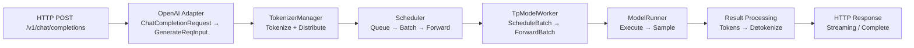

[中文](./01-request-lifecycle.md) | [English](./01-request-lifecycle_EN.md)

# Request Lifecycle: From HTTP to Token and Back

## One-Sentence Overview

A request flows through 8 gates: HTTP Entry → OpenAI Adapter → TokenizerManager → Scheduler → TpModelWorker → ModelRunner → Result Processing → Detokenizer → HTTP Response.

## Stage 1: HTTP Entry

`http_server.py` → `openai_v1_chat_completions()`:
- Receives `ChatCompletionRequest` (messages, model, temperature, etc.)
- Converts to internal `GenerateReqInput`
- Sends to TokenizerManager

## Stage 2: OpenAI to Internal

- `serving_chat.py`: Applies chat template, builds prompt
- Result: `GenerateReqInput` with `text` (prompt string) + sampling params

## Stage 3: TokenizerManager

`tokenizer_manager.py`:
1. `generate_request()` — receives `GenerateReqInput`
2. `_tokenize_one_request()` — applies tokenizer, produces `input_ids`
3. `_send_one_request()` — sends to Scheduler via IPC
4. `_wait_one_response()` — waits for generation result

## Stage 4: Scheduler

`scheduler.py:event_loop_normal()`:
1. `recv_requests()` — receive from IPC
2. `process_input_requests()` — dispatch by type
3. `handle_generate_request()` — create `Req`, validate
4. `_add_request_to_queue()` — append to `waiting_queue`
5. `get_next_batch_to_run()` — form prefill batch
6. `run_batch()` — call model worker
7. `process_batch_result()` — handle output

## Stage 5: TpModelWorker & ModelRunner

`tp_worker.py → model_runner.py`:
1. `forward_batch_generation(batch)` — entry
2. `ForwardBatch.init_new(batch, model_runner)` — convert
3. `model_runner.forward(forward_batch)` — execute
4. `model_runner.sample(...)` — generate next token

## Stage 6: Result Return & Detokenize

1. `process_batch_result()` → `BatchResultProcessor`
2. Prefill: write first token, continue to decode
3. Decode: write token, check stop condition
4. `OutputStreamer` → streaming or complete response
5. `DetokenizerManager` → token IDs to text
6. HTTP response returned to client

## Key Files

| Stage | File | Key Function |
|---|---|---|
| HTTP | `srt/entrypoints/http_server.py` | `openai_v1_chat_completions` |
| Adapter | `srt/serving/serving_chat.py` | `build_chat_prompt` |
| Tokenize | `srt/managers/tokenizer_manager.py` | `generate_request` |
| Schedule | `srt/managers/scheduler.py` | `event_loop_normal` |
| Bridge | `srt/managers/tp_worker.py` | `forward_batch_generation` |
| Execute | `srt/model_executor/model_runner.py` | `forward`, `sample` |
| Result | `srt/managers/scheduler_components/batch_result_processor.py` | `process_batch_result_decode` |
| Detokenize | `srt/managers/detokenizer_manager.py` | `handle_requests` |

## Reading Tasks

1. Trace `openai_v1_chat_completions` → see how OpenAI format arrives
2. Trace `generate_request` → see tokenization and IPC
3. Trace `event_loop_normal` → see the main scheduling loop
4. Trace `forward_batch_generation` → see the bridge
5. Trace `model_runner.forward` → see actual execution
6. Trace `process_batch_result_decode` → see how tokens flow back
7. Trace `OutputStreamer` → see streaming response
8. Draw your own end-to-end sequence diagram
