# 第 9 讲：SGLang Router 架构与源码解析

前面几讲我们一直在讲 TokenizerManager、Scheduler、ModelRunner、KV cache、PD 分离和 LoRA，但有一个词很容易被遗漏：**router**。

在 SGLang 代码里，`router` 不是单一模块，而是出现在多个层次：

- **独立 sgl-router 服务**：Rust 实现的 KV-aware、OpenAI-compatible 请求路由器，负责在多个 SGLang worker 之间选择后端。
- **服务入口路由**：例如 Ollama SmartRouter，把请求转到本地 Ollama 或远端 SGLang。
- **调度模拟路由**：在 schedule simulator 中，把模拟请求分配到某张 GPU。
- **PD 分离 bootstrap route**：Prefill/Decode 分离部署中，用 `/route` 注册和查询 rank 连接信息。
- **MoE expert router**：模型内部把 token 路由到 top-k experts。
- **routed experts 捕获链路**：把 MoE router 选中的专家 ID 返回给用户做观测和调试。

本讲已经把上游 `experimental/sgl-router` 源码补入当前教学仓库，并基于这部分代码重新梳理 router 的真实架构。本地 CodeGraph 的 Python 分析结果已经用于校准 Router 与 Scheduler、PD、MoE 的关系；但 PyPI 版本 CodeGraph 对 Rust 支持有限，所以 `sgl-router` 本身采用 Rust 源码声明索引与主调用链静态整理。下面的“CodeGraph 视角”可以当作 router 的代码图谱来读。

---

## 0. CodeGraph 视角：sgl-router 总架构

源码位置：

```text
experimental/sgl-router/
```

它是一个独立 Rust 服务，README 对它的定位是：

```text
Slim, KV-aware, OpenAI-compatible router for SGLang workers.
```

也就是：

- 对外暴露 OpenAI-compatible HTTP 接口；
- 对内发现一组 SGLang worker；
- 根据 policy 选择 worker；
- 将请求 proxy 到 worker；
- 支持 SSE streaming；
- 支持静态 worker URL 和 Kubernetes EndpointSlice discovery；
- 支持 Prefill/Decode 分离；
- 支持基于 KV cache event 的 cache-aware routing。

### 0.1 模块依赖图

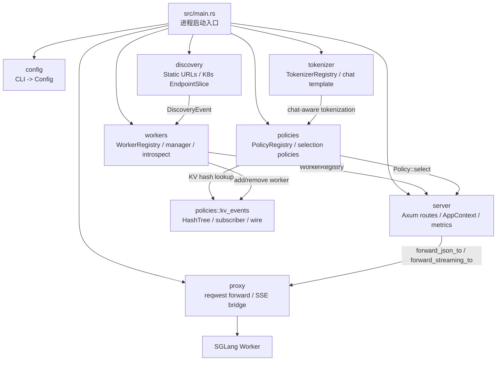

### 0.2 主启动链路

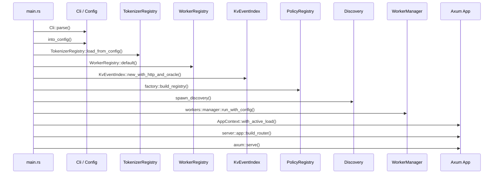

关键源码：

```text
experimental/sgl-router/src/main.rs
函数：main()

核心顺序：
1. Cli::parse()
2. cli.into_config()
3. TokenizerRegistry::load_from_config()
4. WorkerRegistry::default()
5. KvEventIndex::new_with_http_and_oracle()
6. policies::factory::build_registry()
7. discovery::spawn_discovery()
8. workers::manager::run_with_config()
9. Proxy::new()
10. AppContext::with_active_load()
11. server::app::build_router()
12. axum::serve()
```

### 0.3 请求热路径

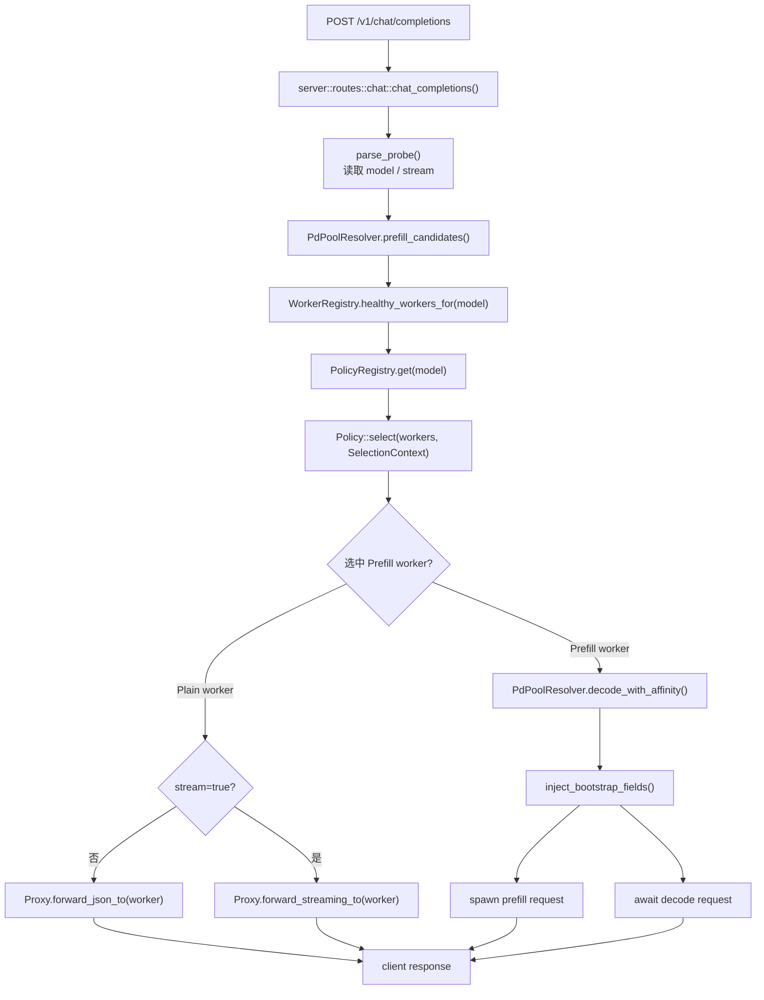

关键源码：

```text
experimental/sgl-router/src/server/routes/chat.rs
函数：chat_completions()
```

这个函数是整个 router 最重要的阅读入口。它把以下能力串起来：

- 解析请求中的 `model` 和 `stream`；
- 根据 PD / plain 模式拿候选 worker；
- 从 `PolicyRegistry` 获取当前模型的路由策略；
- 构造 `SelectionContext`，把 request body 和 sticky routing key 传给 policy；
- 对 plain 模式直接转发；
- 对 PD 模式同时处理 prefill 和 decode；
- 注册 active load guard；
- 记录 metrics、TTFT、request duration；
- 对 streaming 走 SSE passthrough。

---

## 1. sgl-router 关键文件跳转表

| 主题 | 文件 / 函数或类型 | 作用 |
| --- | --- | --- |
| 进程入口 | `experimental/sgl-router/src/main.rs` / `main()` | 解析 CLI、初始化 tokenizer/worker/policy/discovery/proxy/server，并启动 Axum。 |
| 模块出口 | `experimental/sgl-router/src/lib.rs` | 暴露 `config`、`discovery`、`health`、`policies`、`proxy`、`server`、`tokenizer`、`workers`。 |
| CLI 解析 | `src/config/cli.rs` / `Cli::into_config()` | 将命令行参数解析为 `Config`，并处理 static/k8s discovery 互斥关系。 |
| 配置类型 | `src/config/types.rs` / `Config`、`PolicyKind`、`ModelConfig` | 定义单模型 router 配置、policy 种类、cache-aware 和 sticky 参数。 |
| HTTP 路由表 | `src/server/app.rs` / `build_router()` | 注册 `/v1/chat/completions`、`/v1/tokenize`、`/v1/models`、`/metrics`、`/healthz` 等。 |
| 请求上下文 | `src/server/app_context.rs` / `AppContext` | 持有 Config、TokenizerRegistry、Proxy、WorkerRegistry、PolicyRegistry、ActiveLoadRegistry、MetricsRegistry。 |
| Chat 主路径 | `src/server/routes/chat.rs` / `chat_completions()` | 解析请求、选择 worker、处理 PD、转发请求、记录指标。 |
| Worker 描述 | `src/discovery/types.rs` / `WorkerSpec`、`WorkerMode`、`DiscoveryEvent` | discovery backend 发给 manager 的 worker 增删改事件。 |
| Static discovery | `src/discovery/static_urls.rs` / `spawn()` | 把固定 URL 列表转换成 `DiscoveryEvent::Added`。 |
| K8s discovery | `src/discovery/k8s.rs` / `spawn()`、`process_events()` | 监听 EndpointSlice，按 label 分类 Plain/Prefill/Decode worker。 |
| Worker 管理 | `src/workers/manager.rs` / `run_with_config()`、`handle_discovery_event()` | 消费 discovery event，注册/删除 worker，并维护 KV-event index。 |
| Worker 注册表 | `src/workers/registry.rs` / `WorkerRegistry` | 维护 `WorkerId -> Worker` 和 `ModelId -> WorkerId set`，过滤 circuit breaker open 的 worker。 |
| Worker 状态 | `src/workers/worker.rs` / `Worker`、`LoadGuard` | 保存 worker URL、model IDs、mode、active load、circuit breaker。 |
| 策略抽象 | `src/policies/mod.rs` / `Policy`、`SelectionContext`、`PolicyRegistry` | 定义 `select(workers, ctx) -> Worker` 的统一接口。 |
| 策略工厂 | `src/policies/factory.rs` / `build_registry()`、`build_policy()` | 根据 `PolicyKind` 创建 RoundRobin、Random、PowerOfTwo、LoadBased、CacheAwareZmq、Sticky。 |
| PD pool 解析 | `src/policies/registry.rs` / `PdPoolResolver` | 按 Plain / Prefill / Decode 划分 worker 池，支持 decode host affinity。 |
| KV-aware 策略 | `src/policies/cache_aware_zmq.rs` / `CacheAwareZmqPolicy::select()` | 用 tokenizer + block hash + HashTree 判断哪个 worker 更可能命中 KV cache。 |
| KV event index | `src/policies/kv_events/index.rs` / `KvEventIndex` | 管理 HashTree、ZMQ subscriber、worker live set 和 block size oracle。 |
| KV hash tree | `src/policies/kv_events/tree.rs` / `HashTree` | 记录 worker 已缓存 block hash 链，支持 longest prefix match。 |
| HTTP proxy | `src/proxy/mod.rs` / `forward_json_to()`、`forward_streaming_to()` | 将请求转发到 worker，并结合 circuit breaker 记录成功/失败。 |
| SSE bridge | `src/proxy/sse.rs` / `bytes_stream_to_body()` | 将 reqwest bytes stream 桥接成 Axum streaming body。 |
| Tokenizer | `src/tokenizer/mod.rs` / `TokenizerRegistry` | 加载 tokenizer，支持 chat template / DeepSeek-V4 特殊编码，给 cache-aware policy 生成 token 序列。 |

---

## 2. sgl-router 的核心数据结构

### 2.1 Config

```text
experimental/sgl-router/src/config/types.rs
类型：Config
```

`Config` 是进程级配置：

```text
Config
├── server: ServerConfig
├── observability: ObservabilityConfig
├── model: ModelConfig
├── discovery: DiscoveryBackend
├── proxy: ProxyConfig
└── active_load: ActiveLoadConfig
```

注意这个 router 当前是**单模型 router**：

```text
ModelConfig.id
ModelConfig.policy
ModelConfig.tokenizer_path
```

如果一个服务要路由多个模型，需要启动多个 router，或者扩展当前 config / policy registry 的模型维度。

### 2.2 WorkerSpec / Worker / WorkerRegistry

```text
experimental/sgl-router/src/discovery/types.rs
类型：WorkerSpec, WorkerMode, DiscoveryEvent

experimental/sgl-router/src/workers/worker.rs
类型：Worker

experimental/sgl-router/src/workers/registry.rs
类型：WorkerRegistry
```

关系：

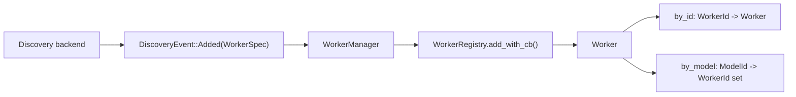

`WorkerMode` 有三种：

```text
Plain
Prefill
Decode
```

Plain 表示普通单池 worker；Prefill/Decode 表示 PD 分离部署中的两个池。

### 2.3 Policy / SelectionContext

```text
experimental/sgl-router/src/policies/mod.rs
trait：Policy
类型：SelectionContext
```

统一策略接口：

```text
fn select(&self, workers: &[Arc<Worker>], ctx: &SelectionContext<'_>) -> Option<Arc<Worker>>
```

`SelectionContext` 携带：

```text
model
request_body
routing_key
```

这些字段使不同策略可以做不同事：

- RoundRobin / Random 只看 workers；
- LoadBased 看 `Worker.active_load()`；
- Sticky 看 `routing_key`；
- CacheAwareZmq 看 `request_body`、tokenizer、KV HashTree；
- PD pool 过滤发生在 policy 之前。

---

## 3. 启动流程：main.rs 如何组装服务

`src/main.rs` 的 `main()` 是最好的入口。

### 3.1 初始化顺序

```text
experimental/sgl-router/src/main.rs
函数：main()
```

它做的事情可以分成七层：

1. **配置层**：`Cli::parse()` 和 `into_config()`。
2. **Tokenizer 层**：`TokenizerRegistry::load_from_config(&cfg)`。
3. **Worker 层**：创建 `WorkerRegistry`。
4. **KV-aware 层**：创建 `BlockSizeOracle` 和 `KvEventIndex`。
5. **Policy 层**：`policies::factory::build_registry()`。
6. **Discovery/Manager 层**：`spawn_discovery()` 和 `workers::manager::run_with_config()`。
7. **Server 层**：创建 `Proxy`、`AppContext`、Axum router，最后 `axum::serve()`。

### 3.2 为什么 KVEventIndex 在 policy registry 之前创建

`CacheAwareZmqPolicy` 需要读 `HashTree` 和 `BlockSizeOracle`：

```text
experimental/sgl-router/src/policies/cache_aware_zmq.rs
类型：CacheAwareZmqPolicy
字段：tree, tokenizers, block_size_oracle
```

而 `KvEventIndex` 正是 `HashTree` 的写入者：

```text
experimental/sgl-router/src/policies/kv_events/index.rs
类型：KvEventIndex
字段：tree, subscribers, live_workers, cursors, block_size_oracle
```

所以 `main()` 里先建 `KvEventIndex`，再把它的 `tree()` 传给 policy factory：

```text
let kv_index = KvEventIndex::new_with_http_and_oracle(...)
let policies = build_registry(&cfg, kv_index.tree(), tokenizers, block_size_oracle)
```

这相当于把“worker 发布的 KV cache 事件”接到了“请求路由策略”里。

---

## 4. HTTP 路由层：Axum 注册了哪些接口

```text
experimental/sgl-router/src/server/app.rs
函数：build_router()
```

注册接口：

```text
GET  /healthz
GET  /readyz
GET  /metrics
GET  /v1/models
POST /v1/tokenize
POST /v1/detokenize
POST /v1/chat/completions
POST /flush_cache
```

其中主业务路径是：

```text
POST /v1/chat/completions
```

它被加了两个 layer：

```text
DefaultBodyLimit::max(MAX_CHAT_BODY_BYTES)
middleware::from_fn(log_413)
```

含义：

- body 最大 1 MiB，避免恶意请求让 router 先分配超大内存；
- 如果被 Axum 拒绝成 413，middleware 会记录方法和 URI，方便排障。

---

## 5. Chat 请求流程：从请求到 worker

核心函数：

```text
experimental/sgl-router/src/server/routes/chat.rs
函数：chat_completions()
```

### 5.1 Plain 模式流程

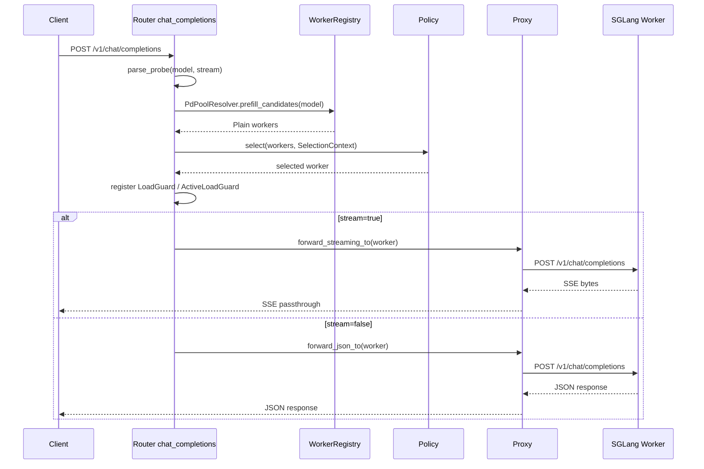

关键点：

- `parse_probe()` 只解析 `model` 和 `stream`，不完整理解 OpenAI schema；
- 真正 schema 仍由后端 SGLang worker 负责；
- router 只需要足够信息来选 worker 和决定是否 SSE 转发；
- `LoadGuard` 和 `ActiveLoadGuard` 用 RAII 生命周期表示请求仍在该 worker 上运行。

### 5.2 PD 分离模式流程

如果 policy 选中的 worker 是 `WorkerMode::Prefill`，router 会再找 decode worker：

```text
experimental/sgl-router/src/policies/registry.rs
函数：PdPoolResolver.decode_with_affinity()
```

然后它会把同一个请求体注入 bootstrap 字段后，分别发给 prefill 和 decode：

```text
bootstrap_host
bootstrap_port
bootstrap_room
```

流程：

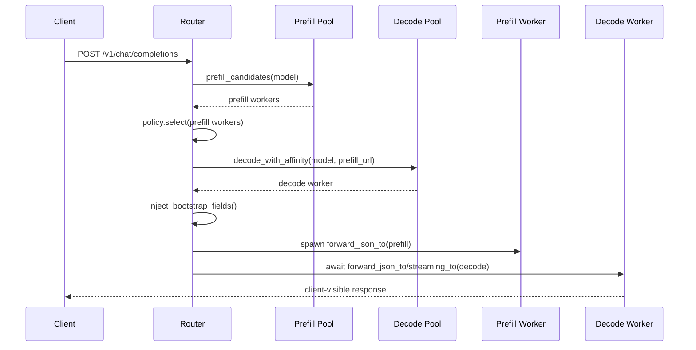

设计点：

- prefill 请求被 `tokio::spawn` 成后台任务；
- client 看到的是 decode worker 的响应；
- prefill 和 decode 使用同一个 `bootstrap_room` 对齐 KV transfer；
- decode worker URL 会通过 `x-sgl-decode-url` header 暴露给 prefill 和响应侧，方便观测 host affinity。

---

## 6. 路由策略：PolicyRegistry 如何选 worker

策略工厂：

```text
experimental/sgl-router/src/policies/factory.rs
函数：build_policy()
函数：build_registry()
```

支持策略：

| PolicyKind | 文件 | 选择逻辑 |
| --- | --- | --- |
| `round_robin` | `src/policies/round_robin.rs` | 原子 counter 轮询。 |
| `random` | `src/policies/random.rs` | 随机选择一个 worker。 |
| `power_of_two` | `src/policies/power_of_two.rs` | 随机抽两个，选 active load 更低的。 |
| `load_based` | `src/policies/load_based.rs` | 全量扫描，选 active load 最低的。 |
| `sticky` | `src/policies/sticky.rs` | 按请求 header 中的 routing key 粘到固定 worker。 |
| `cache_aware_zmq` | `src/policies/cache_aware_zmq.rs` | 基于 KV event HashTree 选择 prefix cache 命中更高的 worker。 |

统一入口：

```text
experimental/sgl-router/src/policies/mod.rs
trait：Policy
函数：select(workers, ctx)
```

### 6.1 Worker 候选集来自哪里

policy 不负责过滤模型、健康状态或 PD 池。它拿到的 `workers` 已经被上游过滤：

```text
chat_completions()
-> PdPoolResolver.prefill_candidates(model)
-> WorkerRegistry.healthy_workers_for(model)
-> policy.select(workers, ctx)
```

这样分层很干净：

- `WorkerRegistry` 管 worker 存在与健康；
- `PdPoolResolver` 管 Plain / Prefill / Decode 池；
- `Policy` 管候选池内部排序和选择。

---

## 7. CacheAwareZmqPolicy：KV-aware 路由如何工作

这是 sgl-router 最有 SGLang 特色的部分。

关键文件：

```text
experimental/sgl-router/src/policies/cache_aware_zmq.rs
类型：CacheAwareZmqPolicy
函数：select()
```

### 7.1 目标

普通负载均衡只关心哪个 worker 空闲。KV-aware routing 还关心：

> 哪个 worker 已经缓存了当前请求 prompt 的最长前缀？

如果请求被路由到已有 KV cache 的 worker，prefill 可以更短，吞吐和延迟都会更好。

### 7.2 选择流程

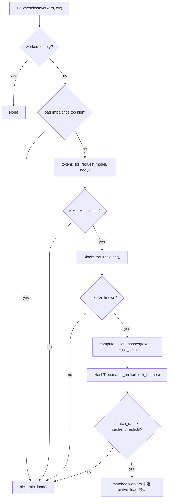

### 7.3 tokenizer 为什么在 router 里

cache-aware routing 要把请求 prompt 变成 token，再按 worker 的 block size 算 block hash。文件：

```text
experimental/sgl-router/src/tokenizer/mod.rs
类型：TokenizerRegistry
函数：load_from_config()
函数：encode_chat()
```

它支持：

- 普通 tokenizer；
- Jinja chat template；
- DeepSeek-V4 的内建 chat encoder；
- chat template 失败时回退 raw prompt text。

原因是 SGLang worker 的 KV cache 是按**实际进入模型的 token 序列**缓存的。如果 router 用 raw prompt hash，而 worker 用 chat template 后的 token hash，KV-aware 匹配就会大量 miss。

### 7.4 KV event 如何进入 HashTree

```text
experimental/sgl-router/src/policies/kv_events/index.rs
类型：KvEventIndex
```

它包含：

```text
HashTree
KvEventSubscriberRegistry
pump_loop
live_workers
cursors
BlockSizeOracle
```

流程：

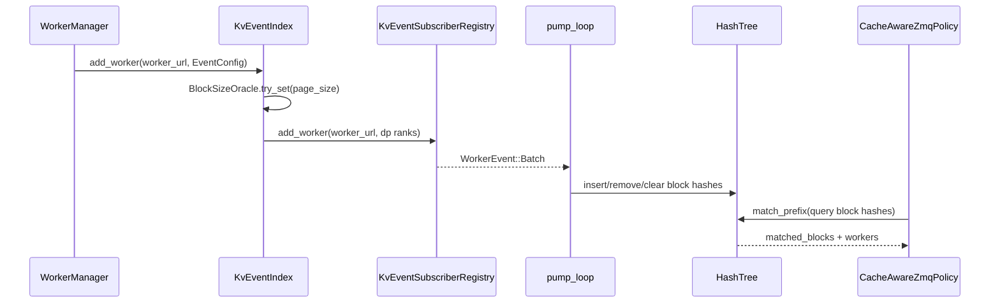

`live_workers` 和 `cursors` 是两个重要保护：

- `live_workers`：worker remove 后，旧 subscriber 里残留的 event 不再污染树；
- `cursors`：同一 worker 的旧 seq 不会重复应用。

---

## 8. Proxy 与 CircuitBreaker

HTTP 转发在：

```text
experimental/sgl-router/src/proxy/mod.rs
类型：Proxy
函数：forward_json_to()
函数：forward_streaming_to()
```

### 8.1 JSON 转发

`forward_json_to()`：

1. 检查 `breaker.allow()`；
2. 解析 worker URL；
3. 过滤并转发请求 header；
4. 设置 `content-type: application/json`；
5. 发送 reqwest POST；
6. 读取完整 body；
7. 根据响应成功/失败更新 circuit breaker；
8. 返回 Axum `Response<Body>`。

### 8.2 Streaming 转发

`forward_streaming_to()`：

1. 检查 circuit breaker；
2. 请求上游时加 `accept: text/event-stream`；
3. 根据 status 处理 breaker；
4. 把 `resp.bytes_stream()` 交给 `sse::bytes_stream_to_body()`；
5. 将上游 SSE bytes 原样桥接给客户端；
6. 用 hook 记录 TTFT 和 stream 完整生命周期。

对应文件：

```text
experimental/sgl-router/src/proxy/sse.rs
函数：bytes_stream_to_body()
```

这里的一个关键设计是：streaming 请求不能在响应 header 返回时就释放 load guard。否则长输出期间 worker 的 active load 会被低估。因此 router 把 guard 移到 SSE pump task 里，等 stream 结束或断开时再 drop。

---

## 9. Discovery 与 WorkerManager

Discovery backend 只负责发现 worker，并产生事件：

```text
experimental/sgl-router/src/discovery/mod.rs
函数：spawn_discovery()
```

两种 backend：

```text
StaticUrls
K8s EndpointSlice
```

### 9.1 Static URLs

```text
experimental/sgl-router/src/discovery/static_urls.rs
函数：spawn()
```

把配置中的 URL 列表转成：

```text
DiscoveryEvent::Added(WorkerSpec)
```

### 9.2 Kubernetes EndpointSlice

```text
experimental/sgl-router/src/discovery/k8s.rs
函数：spawn()
函数：process_events()
函数：extract_workers()
函数：classify_mode()
```

它监听 K8s EndpointSlice，并根据模式把 worker 分类成：

- Plain；
- Prefill；
- Decode。

在 PD 模式下，`--prefill-selector` 和 `--decode-selector` 会分别决定两个池的 worker。

### 9.3 WorkerManager

```text
experimental/sgl-router/src/workers/manager.rs
函数：run_with_config()
函数：run_with_introspector_and_reconcile()
函数：handle_discovery_event()
```

WorkerManager 负责：

- 消费 `DiscoveryEvent`；
- 对新增 worker 做 `/server_info` introspection；
- 把 worker 注册到 `WorkerRegistry`；
- 通知 `KvEventIndex.add_worker()`；
- 在 worker 删除时清理 registry、KV index、active load；
- 定期 reconcile 那些初次 introspection 失败、model_ids 为空的 worker。

---

## 10. PD 分离：router 如何同时处理 prefill 和 decode

PD 分离的关键类：

```text
experimental/sgl-router/src/policies/registry.rs
类型：PdPoolResolver
函数：prefill_candidates()
函数：decode_candidates()
函数：decode_with_affinity()
```

### 10.1 pool 隔离

`PdPoolResolver` 会先判断模型是 plain 还是 PD：

```text
Plain:
  只有 WorkerMode::Plain

PD:
  存在 WorkerMode::Prefill 或 WorkerMode::Decode
```

PD 模式下：

- prefill traffic 只能选 prefill workers；
- decode traffic 只能选 decode workers；
- 如果某个池为空，返回专门错误：
  - `NoPrefillWorkersAvailable`
  - `NoDecodeWorkersAvailable`

这样能避免“prefill 请求误发到 decode worker”的灾难。

### 10.2 decode host affinity

```text
experimental/sgl-router/src/policies/registry.rs
函数：select_decode_with_affinity()
```

选择 decode worker 的优先级：

1. 优先选和 prefill worker 同 host 的 decode worker；
2. 但如果同 host worker breaker open 或负载过高，则跳过；
3. 否则从健康 decode pool 中选 active load 最低的；
4. 如果所有 breaker 都 open，最后退化到 min-load，后续 dispatch 会暴露 breaker open。

这个设计服务于 PD 部署中的网络亲和性：prefill 和 decode 越靠近，KV transfer 越稳定、越便宜。

---

## 11. 与 SGLang Python runtime 的连接点

`sgl-router` 是独立服务，不嵌在 Python runtime 进程里。它通过 HTTP 与 SGLang worker 交互：

```text
router -> worker /v1/chat/completions
router -> worker /server_info
router -> worker KV event ZMQ publisher
```

与 Python 侧对应的概念：

- `/v1/chat/completions`：进入 Python HTTP server，再到 TokenizerManager / Scheduler。
- `/server_info`：用于 introspection，获取模型、PD role、bootstrap port、page size、KV event 配置。
- KV event publisher：Python worker 发布 KV block stored/removed 事件，Rust router 订阅后维护 `HashTree`。
- PD bootstrap 字段：router 注入 `bootstrap_host`、`bootstrap_port`、`bootstrap_room`，Python PD 侧据此完成 KV transfer 配对。

所以它不是替代 Scheduler，而是在 Scheduler 之前做**跨 worker 选择**。

---

## 12. 一张图总结真实 sgl-router

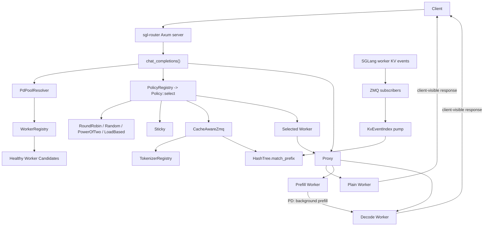

---

## 13. 同名 Router：其他层次的 router

下面几节保留此前整理的 Python 侧 router 相关实现。它们和 `experimental/sgl-router` 不是同一个模块，但名字相近，阅读时容易混淆。

---

## 14. 一张图区分其他四种 Router

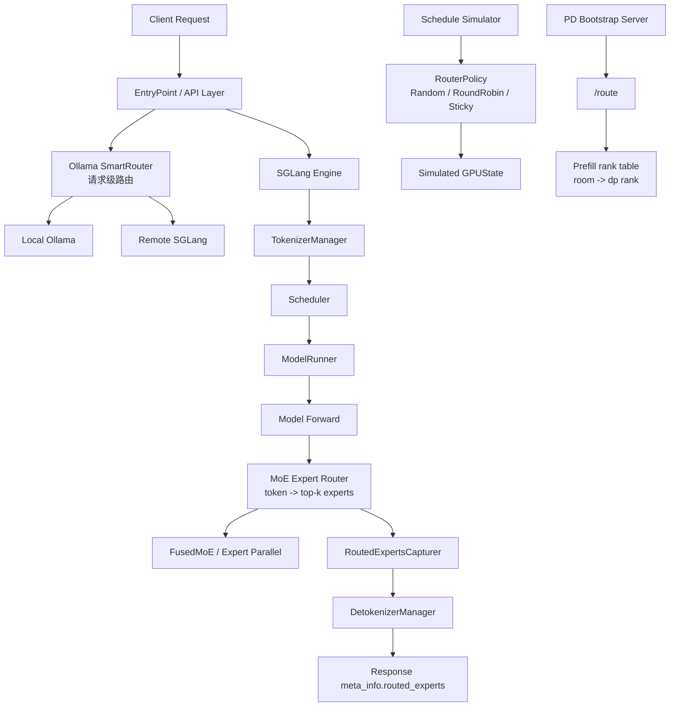

这张图先帮你把概念拆开：

- SmartRouter 是**服务选择器**，决定请求去本地还是远端。
- Schedule simulator router 是**实验工具**，用于研究请求分配策略。
- PD `/route` 是**连接信息注册表**，服务 Prefill/Decode 分离。
- MoE router 是**模型内部计算路径**，决定每个 token 用哪些 experts。

其中最核心、最值得读源码的是 MoE expert router，因为它直接参与 forward，影响性能、专家负载和结果。

---

## 15. Python 侧 router 关键文件跳转表

| 主题 | 文件 / 函数或类 | 作用 |
| --- | --- | --- |
| Ollama SmartRouter | `python/sglang/srt/entrypoints/ollama/smart_router.py` / `SmartRouter` | 用 LLM judge 判断请求复杂度，在本地 Ollama 和远端 SGLang 之间选择。 |
| SmartRouter 分类 | `smart_router.py` / `_classify_with_llm()` | 构造分类 prompt，调用 judge model，返回 SIMPLE / COMPLEX。 |
| SmartRouter 非流式请求 | `smart_router.py` / `chat()` | 决策目标 backend，执行请求，失败时 fallback。 |
| SmartRouter 流式请求 | `smart_router.py` / `chat_stream()` | 与 `chat()` 类似，但直接 yield streaming chunks。 |
| 调度模拟 router 抽象 | `python/sglang/srt/debug_utils/schedule_simulator/routers/base.py` / `RouterPolicy.route()` | 定义模拟请求到 GPU ID 的路由接口。 |
| 随机路由 | `routers/random_router.py` / `RandomRouter.route()` | 随机选择 GPU。 |
| 轮询路由 | `routers/round_robin_router.py` / `RoundRobinRouter.route()` | 按 counter 轮询选择 GPU。 |
| 粘性路由 | `routers/sticky_router.py` / `StickyRouter.route()` | 同一 `group_id` 固定映射到同一 GPU。 |
| 模拟器使用 router | `python/sglang/srt/debug_utils/schedule_simulator/simulator.py` / `_route_requests()` | 调用 `router.route(req)`，把请求放入对应 GPU 的 pending 队列。 |
| PD route 服务 | `python/sglang/srt/disaggregation/common/conn.py` / `_setup_routes()`、`_handle_route()` | 给 bootstrap server 注册 `/route`、`/register_dp_rank`、`/query_dp_ranks`。 |
| MoE router kernel | `python/sglang/srt/layers/moe/router.py` / `fused_moe_router_cudacore_kernel()`、`fused_moe_router_tensorcore_kernel()` | Triton kernel，计算 router logits 并选 top-k experts。 |
| MoE router Python 入口 | `python/sglang/srt/layers/moe/router.py` / `fused_moe_router_shim()`、`FusedMoeRouter.forward_cuda()` | 根据 batch / expert / hidden 形状选择 cudacore 或 tensorcore kernel。 |
| MoE top-k 后处理 | `python/sglang/srt/layers/moe/topk.py` / `_post_process_topk_ids()` | 捕获 routed experts，并处理 DeepEP / shared experts / EPLB 映射。 |
| routed experts 捕获 | `python/sglang/srt/state_capturer/routed_experts.py` / `RoutedExpertsCapturer` | 保存每层每个 token 的 top-k expert IDs，支持 DP / DeepEP 切片。 |
| 输出收集 | `python/sglang/srt/managers/scheduler_components/batch_result_processor.py` / `_maybe_collect_routed_experts()` | 请求结束时从 capturer 中取出 routed experts。 |
| Detokenizer 编码 | `python/sglang/srt/managers/detokenizer_manager.py` / `_b64_encode_per_request()`、`handle_batch_token_id_out()` | 把 routed experts tensor 编成 base64 放入响应。 |
| OpenAI 请求字段 | `python/sglang/srt/entrypoints/openai/protocol.py` / `return_routed_experts`、`routed_experts_start_len` | 用户请求是否返回 routed experts，以及从哪个 token 起返回。 |

---

## 16. Router 的分层心智模型

先给一个非常实用的分类：

```text
请求级 router:
  输入：完整用户请求
  输出：选择哪个服务实例 / backend
  例子：SmartRouter

实验级 router:
  输入：模拟请求 SimRequest
  输出：选择哪个模拟 GPU
  例子：RandomRouter / RoundRobinRouter / StickyRouter

连接级 route:
  输入：rank / room / dp 信息
  输出：Prefill 与 Decode 之间如何建立连接
  例子：PD bootstrap /route

模型级 router:
  输入：hidden states
  输出：top-k expert ids 和 top-k weights
  例子：MoE router

观测级 routed experts:
  输入：MoE router 的 topk_ids
  输出：响应里的 routed_experts metadata
  例子：RoutedExpertsCapturer
```

读源码时要先问：**这个 router 的输入输出是什么？它路由的是请求、GPU、rank，还是 token？**

---

## 17. SmartRouter：请求级路由

### 3.1 它解决什么问题

`SmartRouter` 位于：

```text
python/sglang/srt/entrypoints/ollama/smart_router.py
类：SmartRouter
```

它的目标很直接：

- 简单请求走本地 Ollama，低延迟、低成本；
- 复杂请求走远端 SGLang，使用更强模型；
- 如果目标 backend 失败，fallback 到另一个 backend。

它不是 SGLang 核心 serving pipeline 的必要组件，更像一个轻量级入口示例。

### 3.2 SmartRouter 架构图

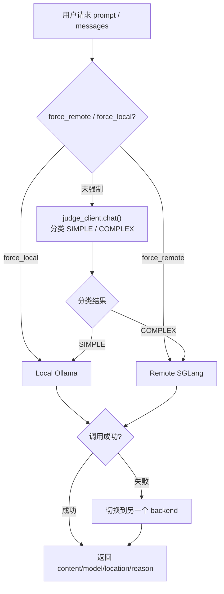

### 3.3 初始化：创建三个 client

```text
python/sglang/srt/entrypoints/ollama/smart_router.py
函数：SmartRouter.__init__()
```

初始化时会创建：

- `local_client`：连接本地 Ollama。
- `remote_client`：连接远端 SGLang，使用 Ollama-compatible API。
- `judge_client`：负责分类请求复杂度，默认复用本地模型。

关键字段：

```text
local_host
remote_host
local_model
remote_model
judge_model
judge_host
```

### 3.4 分类：_classify_with_llm()

```text
python/sglang/srt/entrypoints/ollama/smart_router.py
函数：SmartRouter._classify_with_llm()
```

它做了四步：

1. 把用户 prompt 填入 `CLASSIFICATION_PROMPT`。
2. 调用 `judge_client.chat()`。
3. 要求 judge 只输出 `SIMPLE` 或 `COMPLEX`。
4. 如果 judge 失败，默认走本地。

简化伪代码：

```text
classification_prompt = CLASSIFICATION_PROMPT.format(prompt=prompt[:500])
response = judge_client.chat(model=judge_model, messages=[...], temperature=0)
result = response["message"]["content"].strip().upper()

if "COMPLEX" in result:
    return True, "Complex task"
else:
    return False, "Simple task"
```

这里的返回值是 `(use_remote, reason)`：

- `use_remote=True`：走远端 SGLang；
- `use_remote=False`：走本地 Ollama。

### 3.5 非流式请求：chat()

```text
python/sglang/srt/entrypoints/ollama/smart_router.py
函数：SmartRouter.chat()
```

流程：

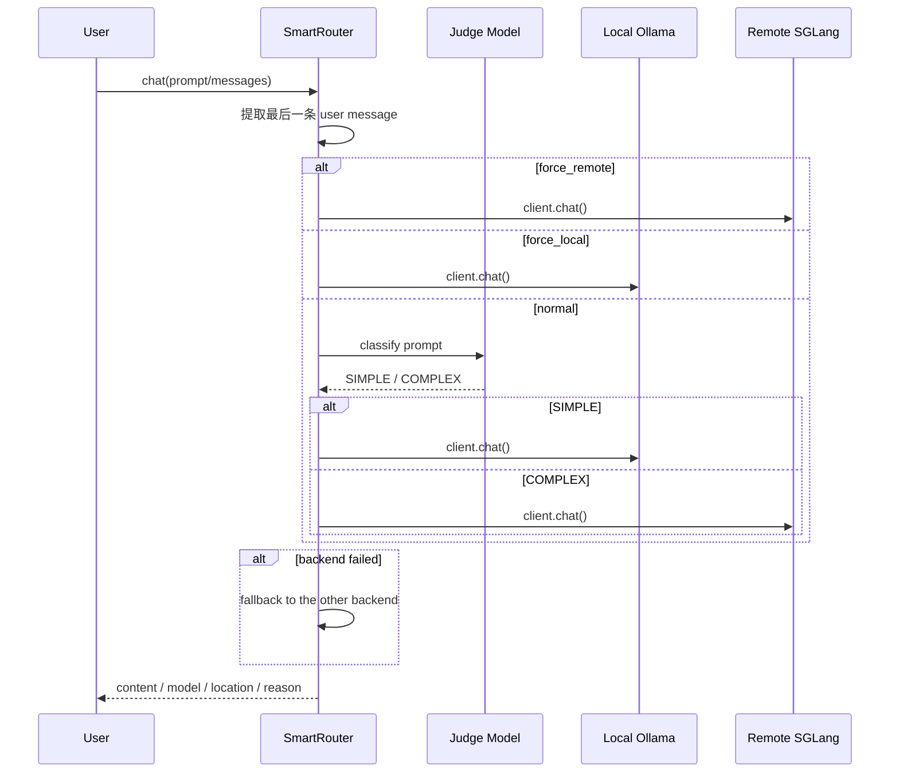

返回结构：

```text
{
  "content": response["message"]["content"],
  "model": model,
  "location": "Local Ollama" or "Remote SGLang",
  "reason": reason,
}
```

### 3.6 流式请求：chat_stream()

```text
python/sglang/srt/entrypoints/ollama/smart_router.py
函数：SmartRouter.chat_stream()
```

它和 `chat()` 的决策逻辑几乎一样，区别在最后一步：

```text
for chunk in client.chat(model=model, messages=messages, stream=True):
    yield chunk
```

所以 SmartRouter 的 streaming 并没有自己做 token 级调度，它只是把选中的 backend 的 streaming chunk 原样转发出去。

### 3.7 SmartRouter 的边界

SmartRouter 很适合教学，但它不是生产级全局负载均衡器。它缺少：

- backend 健康检查和权重；
- 队列长度感知；
- KV cache 命中率感知；
- model / adapter / tenant 维度路由；
- 并发限流；
- retry budget；
- Prometheus metrics。

所以它更像一个“请求分类器 + backend 选择器”的最小实现。

---

## 18. Schedule Simulator Router：调度实验中的请求分配

调度模拟器的 router 位于：

```text
python/sglang/srt/debug_utils/schedule_simulator/routers/
```

这一组实现不参与真实 serving，而是用来研究不同请求分配策略对 GPU 队列和吞吐的影响。

### 4.1 RouterPolicy 抽象

```text
python/sglang/srt/debug_utils/schedule_simulator/routers/base.py
类：RouterPolicy
函数：route(incoming_request: SimRequest) -> int
```

它只定义一个接口：

```text
输入：SimRequest
输出：gpu_id
```

### 4.2 SimRequest

```text
python/sglang/srt/debug_utils/schedule_simulator/request.py
类：SimRequest
```

核心字段：

```text
request_id
input_len
output_len
decoded_tokens
group_id
prefix_len
```

`group_id` 对 sticky router 很关键，它表示一组相关请求。比如多轮会话、共享 prefix 的请求、同一用户请求，都可以用同一个 group。

### 4.3 三种内置策略

```text
python/sglang/srt/debug_utils/schedule_simulator/routers/random_router.py
类：RandomRouter
策略：随机选择 GPU。

python/sglang/srt/debug_utils/schedule_simulator/routers/round_robin_router.py
类：RoundRobinRouter
策略：counter % num_gpus，轮询选择 GPU。

python/sglang/srt/debug_utils/schedule_simulator/routers/sticky_router.py
类：StickyRouter
策略：同一 group_id 固定到同一 GPU；没有 group_id 时随机。
```

对比：

| 策略 | 优点 | 缺点 |
| --- | --- | --- |
| RandomRouter | 简单，天然打散 | 不关心 prefix locality 和负载 |
| RoundRobinRouter | 分布均匀、可预测 | 不关心请求长度和历史状态 |
| StickyRouter | 适合保持会话或 prefix locality | 可能造成热点 GPU |

### 4.4 Simulator 如何使用 Router

```text
python/sglang/srt/debug_utils/schedule_simulator/simulator.py
函数：Simulator._route_requests()
```

核心逻辑：

```text
for req in incoming_requests:
    gpu_id = self.router.route(req)
    if gpu_id < self.num_gpus_per_engine:
        self.gpu_states[gpu_id].pending_requests.append(req)
```

完整模拟流程：

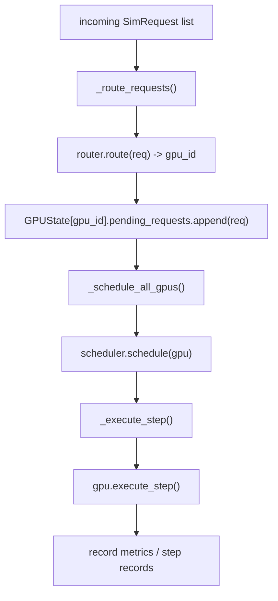

这套 router 是理解真实 Scheduler 之前的实验台。它把“请求应该进入哪个 GPU 队列”这个问题单独抽出来，便于对比不同策略。

---

## 19. PD Bootstrap /route：分离部署中的连接路由

在 PD 分离中，Prefill 侧和 Decode 侧需要知道彼此的 rank、端口、page size、KV cache dtype 等信息。这里也出现了 route。

关键位置：

```text
python/sglang/srt/disaggregation/common/conn.py
函数：_setup_routes()
函数：_handle_route()
函数：_handle_route_put()
函数：_handle_route_get()
```

### 5.1 route API 注册

```text
self.app.router.add_route("*", "/route", self._handle_route)
self.app.router.add_post("/register_dp_rank", self._handle_register_dp_rank)
self.app.router.add_post("/query_dp_ranks", self._handle_query_dp_ranks)
self.app.router.add_get("/health", self._handle_health_check)
```

这不是模型请求的路由，而是 bootstrap server 的 HTTP route。

### 5.2 PUT /route：注册 rank 信息

`_handle_route_put()` 从请求里读取：

```text
attn_tp_size
attn_tp_rank
attn_cp_size
attn_cp_rank
attn_dp_size
attn_dp_rank
pp_size
pp_rank
system_dp_size
system_dp_rank
rank_ip
rank_port
page_size
kv_cache_dtype
```

这些信息会进入内部表：

```text
prefill_port_table
room_to_dp_rank
```

它服务的是第 7 讲提到的 bootstrap / prealloc / transfer 流程：Decode 侧需要根据 room、rank、并行维度，找到对应 Prefill 侧连接点。

### 5.3 与第 7 讲的关系

PD 分离里的 `/route` 可以理解成：

```text
不是“把用户请求路由到哪个模型”
而是“让不同分布式 rank 找到彼此”
```

它处在控制面，负责连接信息，不直接参与 token forward。

---

## 20. MoE Expert Router：模型内部的 token 路由

这一部分是本讲最重要的源码。

MoE router 的输入输出是：

```text
输入：
hidden_states: [num_tokens, hidden_dim]
router_weight: [num_experts, hidden_dim]

输出：
topk_weights: [num_tokens, topk]
topk_ids: [num_tokens, topk]
```

含义：

- `topk_ids[i]`：第 i 个 token 被路由到哪些 expert。
- `topk_weights[i]`：第 i 个 token 对应 expert 的 combine 权重。

### 6.1 MoE Router 总流程图

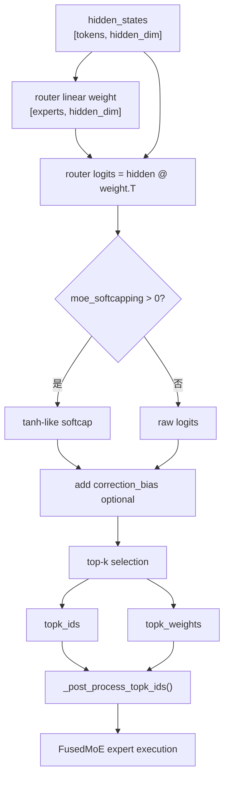

### 6.2 FusedMoeRouter 类

```text
python/sglang/srt/layers/moe/router.py
类：FusedMoeRouter
```

它包装了：

- `router_linear`：gate/router 线性层；
- `topk`：每个 token 选几个 expert；
- `moe_softcapping`：router logits 的 softcap 参数。

入口：

```text
FusedMoeRouter.forward(x, residual)
```

分支：

```text
if x.is_cuda:
    return self.forward_cuda(x, residual)
else:
    return self.forward_vllm(x, residual)
```

当前文件中核心实现是 `forward_cuda()`：

```text
python/sglang/srt/layers/moe/router.py
函数：FusedMoeRouter.forward_cuda()

调用：
fused_moe_router_shim(
    moe_softcapping=self.moe_softcapping,
    hidden_states=x,
    gating_output=self.router_linear.weight,
    topk=self.topk,
    renormalize=False,
)
```

注意：这里传入的 `gating_output` 实际是 router linear 的权重。

### 6.3 fused_moe_router_shim()

```text
python/sglang/srt/layers/moe/router.py
函数：fused_moe_router_shim()
```

这个函数决定使用哪个 Triton kernel：

```text
if (bs >= 512 or num_experts > 8)
   and hidden_dim % BLOCK_SIZE_K == 0
   and not enable_deterministic_inference:
    使用 fused_moe_router_tensorcore()
else:
    使用 fused_moe_router_cudacore()
```

可以理解为：

- batch 大或 expert 多：用 tensorcore 路径，吞吐更好。
- batch 小、shape 不适合、要求 deterministic：用 cudacore 路径，逻辑更直接。

### 6.4 cudacore kernel

```text
python/sglang/srt/layers/moe/router.py
函数：fused_moe_router_cudacore_kernel()
```

它的粒度是：

```text
一个 Triton program 处理一个 token
```

核心步骤：

1. 根据 `pid` 取当前 token 的 hidden vector。
2. 加载所有 expert 的 router weight。
3. 对每个 expert 计算 dot product。
4. 对 logits 做 softcap。
5. 加 correction bias。
6. 选择 top1 / top2 / topk。
7. 写出 `topk_ids` 和 `topk_weights`。

伪代码：

```text
for token in tokens:
    x = hidden_states[token]
    logits = []
    for expert in experts:
        logits[expert] = dot(x, router_weight[expert])

    logits = softcap(logits)
    logits = logits + correction_bias
    ids, weights = topk_softmax(logits, topk)
```

这个 kernel 的优点是简单直接，适合较小 batch 或需要避免 tensorcore 路径的场景。

### 6.5 tensorcore kernel

```text
python/sglang/srt/layers/moe/router.py
函数：fused_moe_router_tensorcore_kernel()
```

它把 router 计算看成矩阵乘：

```text
A = hidden_states       [bs, hidden_dim]
B = router_weight       [num_experts, hidden_dim]
logits = A @ B.T        [bs, num_experts]
```

kernel 以 block 为单位处理多个 token 和多个 expert：

- `BLOCK_SIZE_M`：token 维度 block；
- `BLOCK_SIZE_N`：expert 维度 block；
- `BLOCK_SIZE_K`：hidden_dim 维度 block。

流程：

```text
1. 建立 A tile 和 B tile 指针
2. 循环 K 维度做 tl.dot()
3. 得到 logits block
4. softcap
5. correction bias
6. DP attention workaround：把 NaN 替换成极小值
7. top1 / top2
8. 写出 topk_ids / topk_weights
```

这个路径目前只支持 `topk <= 2`。因此 `fused_moe_router_tensorcore()` 里有：

```text
assert topk <= 2
```

### 6.6 softcap 是什么

router logits 可能过大，softcap 会把它压到一个受控范围：

```text
logits_scaled = logits / moe_softcapping
logits_softcapped = tanh(logits_scaled) * moe_softcapping
```

源码中用指数形式近似实现：

```text
exped = tl.exp(2 * logits_scaled)
logits_softcapped = (exped - 1) / (exped + 1) * moe_softcapping
```

作用是让 router logits 不至于过分尖锐，稳定 top-k 选择和权重分布。

---

## 21. MoE Router 在模型中的接入示例

以 `grok.py` 为例：

```text
python/sglang/srt/models/grok.py
代码段：custom_routing_function = functools.partial(fused_moe_router_shim, self.router_logit_softcapping)
```

模型里会创建：

```text
self.gate = ReplicatedLinear(...)
self.router_logit_softcapping = 30.0
custom_routing_function = functools.partial(
    fused_moe_router_shim, self.router_logit_softcapping
)
self.topk = TopK(
    top_k=top_k,
    renormalize=False,
    layer_id=layer_id,
    custom_routing_function=None if _is_npu else custom_routing_function,
)
self.experts = FusedMoE(...)
```

这里的结构是：

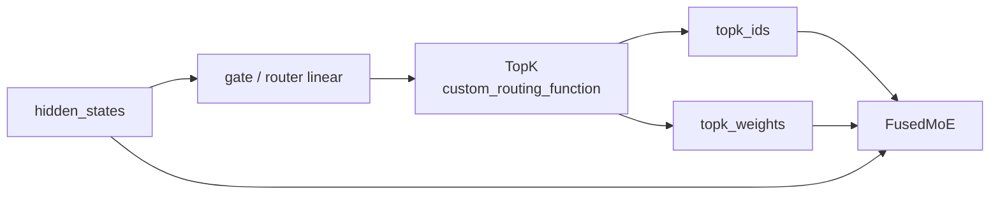

也就是说，MoE router 不是一个孤立模块，它通常被 `TopK` 或模型自定义路径调用，输出再交给 `FusedMoE`。

---

## 22. TopK 后处理：路由结果还要再整理

router kernel 给出 `topk_ids` 和 `topk_weights` 后，SGLang 还会做后处理。

关键位置：

```text
python/sglang/srt/layers/moe/topk.py
函数：_post_process_topk_ids()
```

这段逻辑做几件事：

1. 如果启用了 routed experts 捕获，就调用 capturer 保存 `topk_ids`。
2. CUDA 路径下根据 expert location dispatch info 做 expert ID 映射。
3. DeepEP 场景下区分 routed experts 和 fused shared experts。
4. 如果存在 fused shared experts，要处理额外的 shared expert 列。

对应代码段：

```text
if (cap := get_global_experts_capturer()) is not None:
    cap.capture(layer_id=layer_id, topk_indices=topk_ids)
```

这一行把“模型内部 router 的结果”接到了“用户可观测 metadata”链路上。

---

## 23. RoutedExpertsCapturer：把 expert 路由结果返回给用户

如果请求设置：

```text
return_routed_experts = True
routed_experts_start_len = N
```

SGLang 可以把每个 token 在每层 MoE 中被路由到的 experts 返回。

### 9.1 请求字段入口

```text
python/sglang/srt/entrypoints/openai/protocol.py
字段：return_routed_experts
字段：routed_experts_start_len

python/sglang/srt/managers/io_struct.py
字段：return_routed_experts
字段：routed_experts_start_len
```

`routed_experts_start_len` 表示从哪个 token 位置开始返回 routed experts，避免返回过长 prompt 的全部路由信息。

### 9.2 Capturer 初始化

```text
python/sglang/srt/model_executor/model_runner.py
代码段：RoutedExpertsCapturer.create(...)
```

它会根据模型配置创建 buffer：

```text
num_layers = model_config.hf_text_config.num_hidden_layers
topk_size = model_config.hf_text_config.num_experts_per_tok
max_batch_size = max(chunked_prefill_size * dp_size, max_running_requests * dp_size)
```

### 9.3 Capturer 捕获流程

```text
python/sglang/srt/state_capturer/routed_experts.py
类：RoutedExpertsCapturer
函数：capture(layer_id, topk_indices)
```

普通场景：

```text
topk_indices -> BaseTopkCapturer.capture() -> device cache
```

DeepEP 场景：

```text
local_topk -> attn_tp_all_gather_into_tensor() -> full topk -> device cache
```

为什么 DeepEP 要 all-gather？

因为 DeepEP a2a 路径中，每个 attention TP rank 只看到被 scatter 后的一部分 token / expert 信息。为了让后续按请求取回完整 routed experts，捕获时要先把 attn TP 切片聚合回来。

### 9.4 请求结束时收集

```text
python/sglang/srt/managers/scheduler_components/batch_result_processor.py
函数：BatchResultProcessor._maybe_collect_routed_experts()
```

逻辑：

```text
if not req.return_routed_experts:
    return
capturer = get_global_experts_capturer()
if capturer is None:
    return
req.routed_experts = capturer.get_topk(
    req_pool_idx=req.req_pool_idx,
    seqlen=seqlen,
    req_to_token_pool=self.req_to_token_pool,
    start_len=req.routed_experts_start_len,
)
```

这里用 `req_pool_idx` 和 `req_to_token_pool` 把“请求维度”映射回“token cache 位置”，再从 capturer 的 top-k buffer 中取出该请求对应的 rows。

### 9.5 Detokenizer 编码输出

```text
python/sglang/srt/managers/detokenizer_manager.py
函数：DetokenizerManager._b64_encode_per_request()
函数：DetokenizerManager.handle_batch_token_id_out()
```

routed experts tensor 最后被转成 base64：

```text
pybase64.b64encode(item.numpy().tobytes()).decode("utf-8")
```

然后进入：

```text
BatchStrOutput.routed_experts
```

OpenAI 层再把它放到响应扩展字段中。

---

## 24. routed_experts 完整返回流程

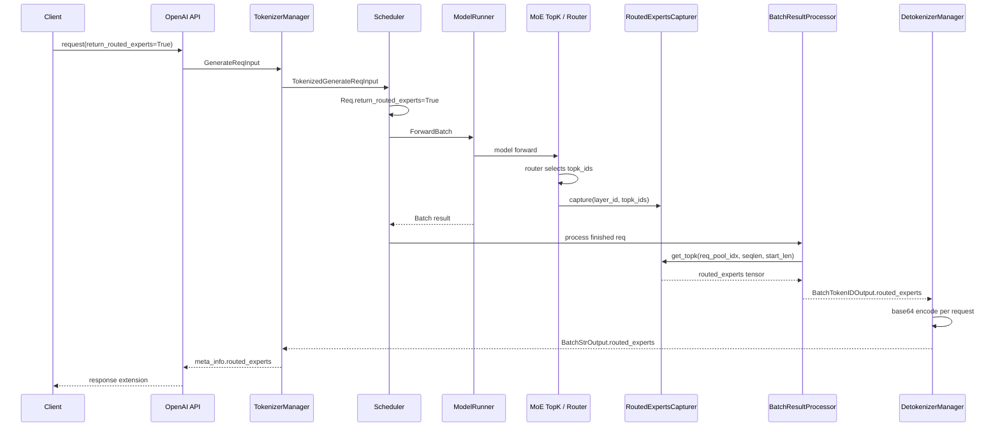

这条链路把模型内部的 MoE 路由决策暴露给外部用户，适合做：

- MoE expert 分布分析；
- 请求级 expert 负载诊断；
- DeepEP / EPLB 调试；
- 模型行为观测。

---

## 25. MoE Router 与 EP / DeepEP / EPLB 的关系

MoE router 输出的是 logical expert IDs，但执行层可能需要 physical expert IDs。

这里有几个概念：

```text
Logical expert:
  模型语义上的 expert 编号。

Physical expert:
  实际放在某个 rank / GPU 上的 expert 副本或位置。

EP:
  Expert Parallel，把 experts 分布到不同 rank。

DeepEP:
  更高性能的 expert parallel 通信路径，涉及 token scatter / gather。

EPLB:
  Expert Parallel Load Balancer，可能调整 logical expert 到 physical expert 的映射。
```

`_post_process_topk_ids()` 中的 expert location dispatch 逻辑，就是把 router 选出来的 expert IDs 调整到执行后端能理解的位置。

简化流程：

```text
router logits
-> topk logical expert ids
-> optional EPLB logical-to-physical remap
-> optional DeepEP scatter/gather
-> FusedMoE execution
```

所以 MoE router 不只是一层 `topk`，它和分布式 expert 布局紧密相关。

---

## 26. 各类 Router 的对照总结

| Router 类型 | 输入 | 输出 | 是否参与真实 forward | 核心文件 |
| --- | --- | --- | --- | --- |
| sgl-router | OpenAI-compatible HTTP request | selected worker / proxied response | 不在单 worker 内 forward；负责 worker 级分发 | `experimental/sgl-router/src/` |
| SmartRouter | 用户 prompt / messages | local 或 remote backend | 否，只在入口转发 | `entrypoints/ollama/smart_router.py` |
| Simulator Router | `SimRequest` | `gpu_id` | 否，调度实验工具 | `debug_utils/schedule_simulator/routers/` |
| PD `/route` | rank / room / dp/tp/pp 信息 | prefill rank 连接表 | 不直接 forward，服务 PD 控制面 | `disaggregation/common/conn.py` |
| MoE Expert Router | hidden states | topk expert IDs / weights | 是，模型 forward 内部路径 | `layers/moe/router.py` |
| RoutedExpertsCapturer | topk expert IDs | response metadata | 不改变计算，只做观测 | `state_capturer/routed_experts.py` |

---

## 27. 推荐阅读顺序

如果你要系统阅读 router 相关源码，建议先读真实 `sgl-router`，再读 Python 侧同名概念：

1. `experimental/sgl-router/src/main.rs` / `main()`
   先看进程如何组装 Config、Tokenizer、WorkerRegistry、PolicyRegistry、Discovery、Proxy 和 Axum。

2. `experimental/sgl-router/src/server/routes/chat.rs` / `chat_completions()`
   这是请求热路径，务必逐段读。

3. `experimental/sgl-router/src/workers/registry.rs` / `WorkerRegistry`
   理解 worker 如何按 model、mode、circuit breaker 被组织。

4. `experimental/sgl-router/src/policies/mod.rs` / `Policy`、`SelectionContext`
   理解所有选择策略的统一接口。

5. `experimental/sgl-router/src/policies/factory.rs` / `build_policy()`
   理解 CLI policy 如何变成运行时对象。

6. `experimental/sgl-router/src/policies/cache_aware_zmq.rs` / `CacheAwareZmqPolicy::select()`
   理解 KV-aware routing 的核心算法。

7. `experimental/sgl-router/src/policies/kv_events/index.rs` 和 `tree.rs`
   理解 KV event 如何变成 HashTree。

8. `experimental/sgl-router/src/policies/registry.rs` / `PdPoolResolver`
   理解 PD pool 隔离和 decode host affinity。

9. `experimental/sgl-router/src/proxy/mod.rs` 和 `proxy/sse.rs`
   理解 JSON / streaming 转发和 circuit breaker 记录。

10. `python/sglang/srt/entrypoints/ollama/smart_router.py` / `SmartRouter`
   先理解最直观的请求级 router。

11. `python/sglang/srt/debug_utils/schedule_simulator/routers/base.py` / `RouterPolicy`
   理解 router 抽象：输入请求，输出目标 GPU。

12. `python/sglang/srt/debug_utils/schedule_simulator/simulator.py` / `_route_requests()`
   看 router 如何影响 pending queue。

13. `python/sglang/srt/disaggregation/common/conn.py` / `_setup_routes()`、`_handle_route_put()`
   理解 PD 分离里的 route 是 rank 连接注册，不是普通请求调度。

14. `python/sglang/srt/layers/moe/router.py` / `fused_moe_router_shim()`
   理解 MoE router 如何选择 cudacore / tensorcore kernel。

15. `python/sglang/srt/layers/moe/router.py` / `fused_moe_router_cudacore_kernel()`
   先读更直观的逐 token kernel。

16. `python/sglang/srt/layers/moe/router.py` / `fused_moe_router_tensorcore_kernel()`
   再读 block GEMM 风格的高性能 kernel。

17. `python/sglang/srt/layers/moe/topk.py` / `_post_process_topk_ids()`
   看 top-k expert IDs 如何与 DeepEP、EPLB、capturer 接上。

18. `python/sglang/srt/state_capturer/routed_experts.py` / `RoutedExpertsCapturer`
   看 routed experts 如何被保存和按请求取回。

19. `python/sglang/srt/managers/scheduler_components/batch_result_processor.py` / `_maybe_collect_routed_experts()`
    看请求结束时如何收集路由结果。

---

## 28. 阅读任务

### 任务 0：追踪真实 sgl-router 请求

从：

```text
experimental/sgl-router/src/server/routes/chat.rs
函数：chat_completions()
```

追踪到：

```text
experimental/sgl-router/src/proxy/mod.rs
函数：forward_json_to()
函数：forward_streaming_to()
```

回答：

```text
一个普通 plain-mode 非 streaming 请求，会经过哪些对象？
SelectionContext 里为什么要带 request_body？
LoadGuard 和 ActiveLoadGuard 何时释放？
```

### 任务 0.1：追踪 cache-aware routing

从：

```text
experimental/sgl-router/src/policies/cache_aware_zmq.rs
函数：CacheAwareZmqPolicy::select()
```

追踪到：

```text
experimental/sgl-router/src/policies/kv_events/tree.rs
函数：HashTree.match_prefix()
```

回答：

```text
router 如何把一个 chat request 转成 block hashes？
为什么 block size 必须由 worker 发布的 page_size 决定？
为什么负载严重不均衡时要跳过 cache lookup？
```

### 任务 0.2：追踪 PD 分离路由

从：

```text
experimental/sgl-router/src/policies/registry.rs
函数：PdPoolResolver.prefill_candidates()
函数：PdPoolResolver.decode_with_affinity()
```

追踪到：

```text
experimental/sgl-router/src/server/routes/chat.rs
函数：inject_bootstrap_fields()
```

回答：

```text
router 如何保证 prefill 请求不会发到 decode worker？
decode host affinity 的优先级是什么？
bootstrap_host/bootstrap_port/bootstrap_room 分别给谁用？
```

### 任务 1：解释 SmartRouter 的失败回退

阅读：

```text
python/sglang/srt/entrypoints/ollama/smart_router.py
函数：SmartRouter.chat()
```

回答：

```text
如果 judge 判断请求应该走 Remote SGLang，
但 remote_client.chat() 抛出异常，
SmartRouter 会如何处理？
返回的 reason 字段是什么？
```

### 任务 2：比较三种模拟 router

阅读：

```text
random_router.py
round_robin_router.py
sticky_router.py
```

回答：

```text
如果有 100 个请求属于同一个 group_id，
三种 router 会如何分配它们？
哪一种最可能保留 prefix locality？
哪一种最可能造成单 GPU 热点？
```

### 任务 3：追踪 MoE router 输出

从下面函数开始：

```text
python/sglang/srt/layers/moe/router.py
函数：fused_moe_router_shim()
```

追踪到：

```text
python/sglang/srt/layers/moe/topk.py
函数：_post_process_topk_ids()
```

回答：

```text
topk_ids 在进入 FusedMoE 执行前，可能经历哪些后处理？
为什么 DeepEP 和 fused shared experts 会让这个步骤变复杂？
```

### 任务 4：追踪 routed_experts 返回

从请求字段：

```text
return_routed_experts=True
```

追踪到响应字段：

```text
meta_info.routed_experts
```

至少经过：

```text
protocol.py
io_struct.py
topk.py
routed_experts.py
batch_result_processor.py
detokenizer_manager.py
tokenizer_manager.py
```

目标是讲清楚：模型内部的 top-k expert IDs 是如何变成响应里的 base64 字符串的。

---

## 29. 本讲心智模型

最后用一句话总结：

> SGLang 里的 router 不是一个模块，而是一组“选择器”：真实 `sgl-router` 选择 worker；SmartRouter 选择 backend；模拟器 router 选择 GPU 队列；PD route 选择连接信息；MoE router 选择 expert。

如果只记一个公式，可以记这个：

```text
sgl-router:
  request + worker registry + policy + KV events -> selected SGLang worker

请求级 router:
  request -> backend / engine

调度实验 router:
  SimRequest -> gpu_id

PD route:
  rank metadata -> connection table

MoE router:
  hidden_states -> topk_ids + topk_weights

routed experts capturer:
  topk_ids -> response metadata
```

读源码时先确认 router 的输入输出，再看它是否参与真实 forward。这样你会发现：

- sgl-router 是跨 worker 的服务级路由器；
- SmartRouter 是入口层示例；
- Simulator router 是实验工具；
- PD `/route` 是分布式连接控制面；
- MoE router 才是模型执行路径中的性能关键点。

---

## 30. 下一讲预告

下一讲继续深入 **独立 Rust `sgl-router` 源码**：

- 启动期如何组装 `TokenizerRegistry`、`WorkerRegistry`、`PolicyRegistry` 与 `KvEventIndex`；
- discovery event 如何通过 worker manager 进入注册表；
- `/v1/chat/completions` 如何选择 Plain / Prefill / Decode worker；
- `cache_aware_zmq` 如何借助 tokenizer、KV event 和 `HashTree` 做 prefix cache-aware routing；
- PD 分离场景下 prefill/decode 两个 worker 之间传递哪些 bootstrap 信息。
