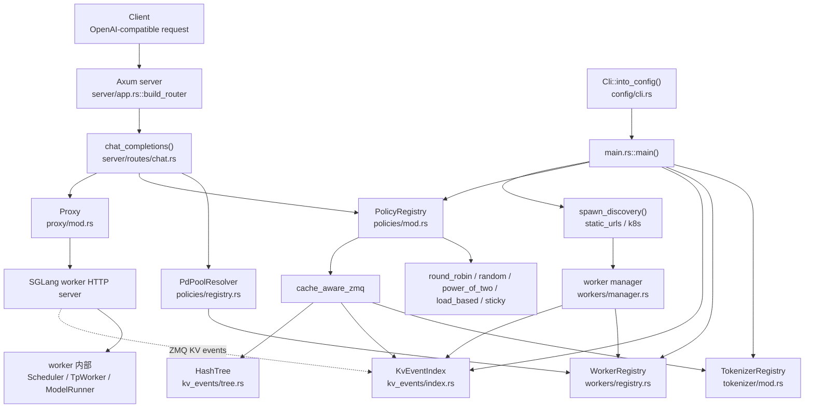
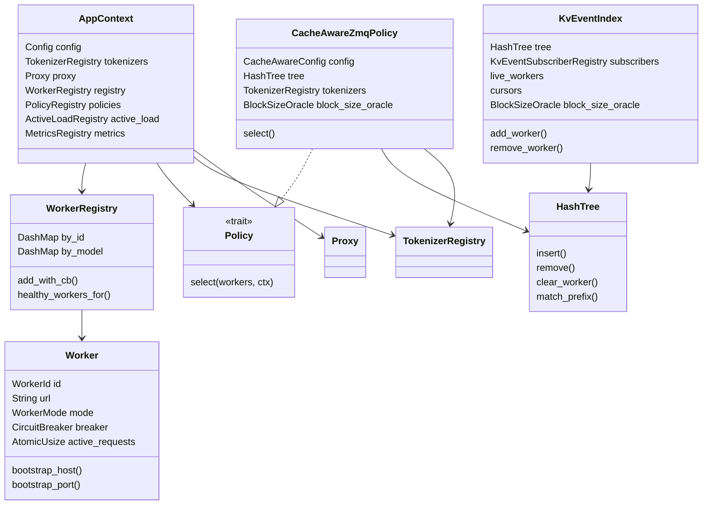
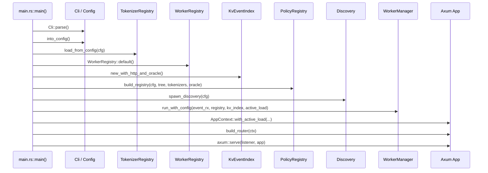
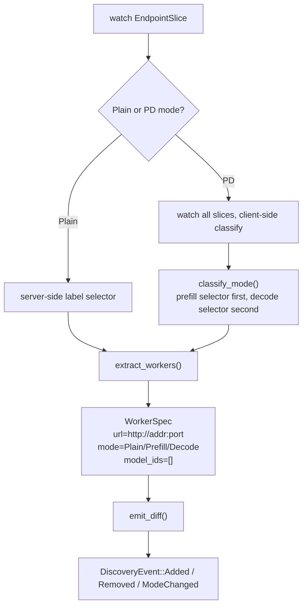
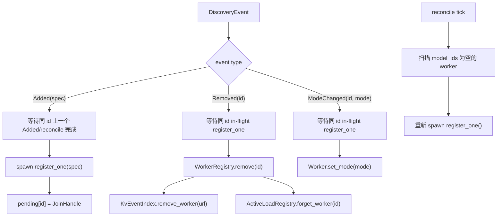
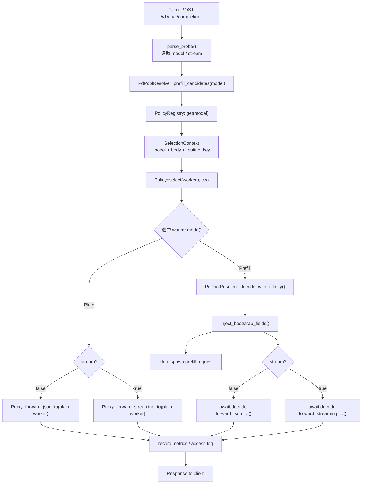
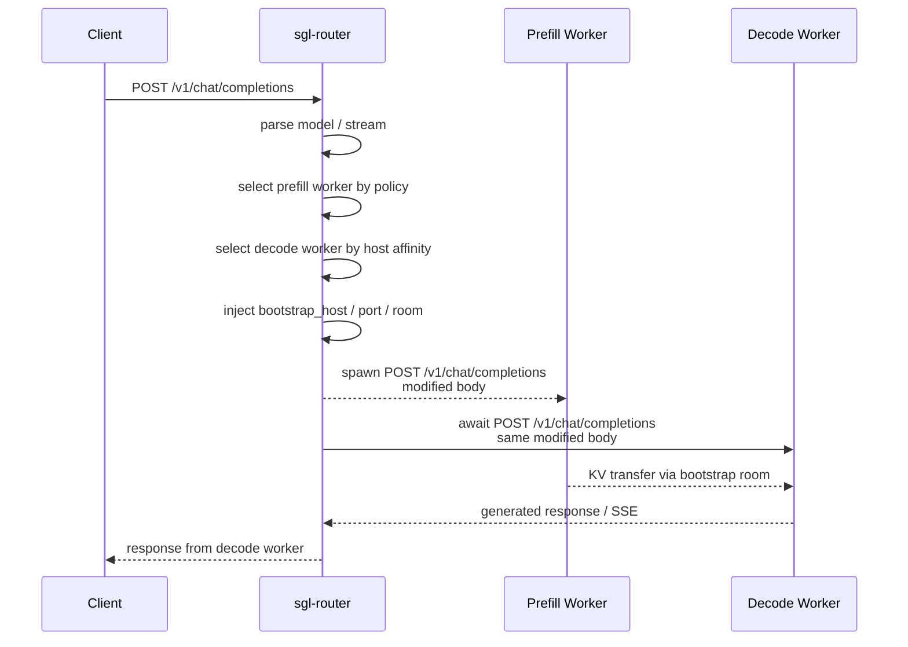
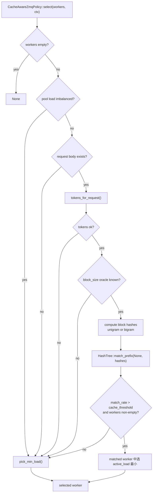
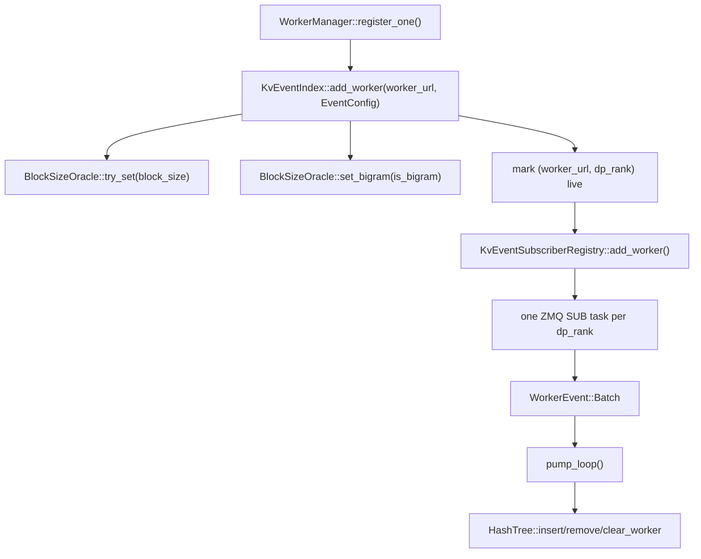
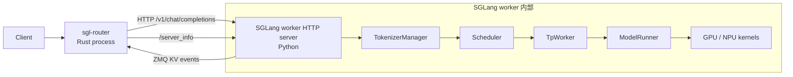

**中文** | [English](./10-sgl-router-source-deep-dive_EN.md)

# 第 10 讲：sgl-router 源码深潜

这一讲专门阅读当前仓库中的 Rust 组件：

```text
experimental/sgl-router/
```

第 9 讲已经说明了 SGLang 里“router”这个词有很多层含义：服务级 worker router、SmartRouter、调度模拟 router、PD bootstrap route、MoE expert router 等。本讲只聚焦 **独立的 `sgl-router` 服务**，也就是一个运行在 SGLang worker 前面的 HTTP 路由进程。

先给出结论：

```text
sgl-router 不是 Scheduler 的一部分。
它是 Scheduler / TpWorker / ModelRunner 外层的 Rust 网关。

Client
  -> sgl-router
  -> 选中的 SGLang worker HTTP server
  -> worker 进程内部的 TokenizerManager / Scheduler / TpWorker / ModelRunner
```

所以它不会直接 import 或调用 Python 里的 `Scheduler`、`TpWorker`、`ModelRunner`。它和 SGLang worker 的关系主要是三条协议通道：

```text
1. HTTP 请求转发：
   /v1/chat/completions
   /flush_cache

2. HTTP 控制面探测：
   /server_info

3. ZMQ KV-cache event：
   worker 发布 BlockStored / BlockRemoved / AllBlocksCleared
   router 订阅后维护 HashTree，用于 cache-aware routing
```

---

## 1. 本讲源码地图

| 主题 | 源码位置 | 重点函数 / 类型 |
| --- | --- | --- |
| 进程启动 | `experimental/sgl-router/src/main.rs` | `main()` |
| HTTP 路由表 | `experimental/sgl-router/src/server/app.rs` | `build_router()` |
| 全局上下文 | `experimental/sgl-router/src/server/app_context.rs` | `AppContext::with_active_load()` |
| Chat 请求主路径 | `experimental/sgl-router/src/server/routes/chat.rs` | `chat_completions()`、`parse_probe()`、`inject_bootstrap_fields()` |
| CLI / 配置 | `experimental/sgl-router/src/config/cli.rs`、`types.rs` | `Cli::into_config()`、`Config`、`PolicyKind`、`K8sDiscoveryMode` |
| discovery 抽象 | `experimental/sgl-router/src/discovery/mod.rs` | `spawn_discovery()` |
| 静态 worker 发现 | `experimental/sgl-router/src/discovery/static_urls.rs` | `spawn()` |
| K8s worker 发现 | `experimental/sgl-router/src/discovery/k8s.rs` | `spawn()`、`process_events()`、`classify_mode()`、`extract_workers()` |
| worker 描述 | `experimental/sgl-router/src/discovery/types.rs` | `WorkerSpec`、`WorkerMode`、`DiscoveryEvent` |
| worker onboarding | `experimental/sgl-router/src/workers/manager.rs` | `run_with_introspector_and_reconcile()`、`handle_discovery_event()`、`register_one()` |
| worker 注册表 | `experimental/sgl-router/src/workers/registry.rs` | `WorkerRegistry::add_with_cb()`、`healthy_workers_for()` |
| worker 状态 | `experimental/sgl-router/src/workers/worker.rs` | `Worker`、`LoadGuard` |
| `/server_info` 探测 | `experimental/sgl-router/src/workers/introspect.rs` | `WorkerIntrospector::fetch()`、`resolve_disaggregation_role()` |
| policy 抽象 | `experimental/sgl-router/src/policies/mod.rs` | `Policy`、`SelectionContext`、`PolicyRegistry` |
| policy 工厂 | `experimental/sgl-router/src/policies/factory.rs` | `build_policy()`、`build_registry()` |
| 普通策略 | `experimental/sgl-router/src/policies/*.rs` | `RoundRobinPolicy`、`RandomPolicy`、`PowerOfTwoChoicesPolicy`、`LoadBasedPolicy`、`StickyPolicy` |
| PD pool 解析 | `experimental/sgl-router/src/policies/registry.rs` | `PdPoolResolver::prefill_candidates()`、`decode_with_affinity()`、`select_decode_with_affinity()` |
| KV-aware 策略 | `experimental/sgl-router/src/policies/cache_aware_zmq.rs` | `CacheAwareZmqPolicy::select()`、`tokens_for_request()` |
| KV event 生命周期 | `experimental/sgl-router/src/policies/kv_events/index.rs` | `KvEventIndex::add_worker()`、`remove_worker()`、`pump_loop()` |
| KV hash tree | `experimental/sgl-router/src/policies/kv_events/tree.rs` | `HashTree::insert()`、`remove()`、`clear_worker()`、`match_prefix()` |
| block hash | `experimental/sgl-router/src/policies/kv_events/hash.rs` | `compute_block_hashes()`、`compute_block_hashes_bigram()` |
| block size 来源 | `experimental/sgl-router/src/policies/kv_events/block_size_oracle.rs` | `BlockSizeOracle::try_set()`、`set_bigram()` |
| ZMQ subscriber | `experimental/sgl-router/src/policies/kv_events/subscriber.rs` | `KvEventSubscriberRegistry::add_worker()`、`WorkerEvent` |
| HTTP proxy | `experimental/sgl-router/src/proxy/mod.rs` | `forward_json_to()`、`forward_streaming_to()` |
| SSE 桥接 | `experimental/sgl-router/src/proxy/sse.rs` | `bytes_stream_to_body()` |
| tokenizer | `experimental/sgl-router/src/tokenizer/mod.rs` | `TokenizerRegistry::load_from_config()`、`encode_chat()` |

---

## 2. 总体架构：控制面和数据面

`sgl-router` 可以分成两条主线：

```text
控制面：
  CLI 配置
  -> discovery 发现 worker
  -> manager 探测 /server_info
  -> WorkerRegistry / KvEventIndex / PolicyRegistry

数据面：
  Client HTTP request
  -> Axum route
  -> chat_completions()
  -> PdPoolResolver + Policy::select()
  -> Proxy 转发到某个 SGLang worker
```

### 2.1 全局架构图



### 2.2 关键类依赖图



---

## 3. 启动过程：`main()` 如何组装 router

入口在：

```text
experimental/sgl-router/src/main.rs
函数：main()
```

主流程可以压缩成下面这段伪代码：

```rust
Cli::parse()
  -> Cli::into_config()
  -> TokenizerRegistry::load_from_config()
  -> WorkerRegistry::default()
  -> BlockSizeOracle::new()
  -> KvEventIndex::new_with_http_and_oracle()
  -> policies::factory::build_registry()
  -> ActiveLoadRegistry::new()
  -> discovery::spawn_discovery()
  -> workers::manager::run_with_config()
  -> Proxy::new()
  -> AppContext::with_active_load()
  -> server::app::build_router()
  -> axum::serve()
```

### 3.1 启动顺序图



这里有几个容易忽略的点。

第一，`KvEventIndex` 无论当前 policy 是否是 `cache_aware_zmq` 都会被构造。它本身很轻，真正的 ZMQ subscriber 只有在 worker 的 `/server_info` 暴露 `kv_events` 后才会注册。

第二，`BlockSizeOracle` 是 `KvEventIndex` 和 `CacheAwareZmqPolicy` 共享的。worker 先通过 `/server_info` 告诉 router 自己的 `page_size`，`KvEventIndex::add_worker()` 调用 `BlockSizeOracle::try_set()` 建立全局 block size，之后 `CacheAwareZmqPolicy::select()` 才能用同一个 block size 对请求 tokens 做 hash。

第三，`PolicyRegistry` 当前是单模型维度的注册表。`Config` 里只有一个 `model: ModelConfig`，所以一个 router 进程服务一个模型；多模型部署通常是多个 router 或扩展配置模型。

---

## 4. 配置层：CLI 如何约束运行形态

配置入口在：

```text
experimental/sgl-router/src/config/cli.rs
函数：Cli::into_config()
```

`sgl-router` 没有额外配置文件，主要通过 CLI flags 组装 `Config`。

关键配置类型在：

```text
experimental/sgl-router/src/config/types.rs
类型：Config、ModelConfig、PolicyKind、DiscoveryBackend、K8sDiscoveryMode
```

### 4.1 Config 的结构

```text
Config
├── server: ServerConfig
├── observability: ObservabilityConfig
├── model: ModelConfig
│   ├── id
│   ├── tokenizer_path
│   ├── policy
│   ├── circuit_breaker
│   ├── cache_aware
│   └── sticky
├── discovery: DiscoveryBackend
├── proxy: ProxyConfig
└── active_load: ActiveLoadConfig
```

`PolicyKind` 支持：

```text
round_robin
random
power_of_two
load_based
cache_aware_zmq
sticky
```

`DiscoveryBackend` 支持两类：

```text
StaticUrls:
  --worker-urls http://w0:30000 http://w1:30000

K8s:
  --service-discovery
  --selector app=sglang

K8s PD:
  --service-discovery
  --prefill-selector app=sglang,role=prefill
  --decode-selector app=sglang,role=decode
```

### 4.2 配置层做了哪些防御

`Cli::into_config()` 不是简单把 flags 塞进结构体，它会提前拒绝很多“看似能跑、实际会静默退化”的配置：

| 检查 | 目的 |
| --- | --- |
| `--worker-urls` 和 `--service-discovery` 互斥 | 避免两个 discovery 后端同时驱动 registry。 |
| 没有 discovery 后端时报错 | router 不应在没有 worker 来源的情况下启动。 |
| cache-aware 参数必须配 `--policy cache_aware_zmq` | 避免用户以为参数生效，但实际被忽略。 |
| sticky 参数必须配 `--policy sticky` | 同上。 |
| sticky fallback 不能是 sticky/cache-aware | 避免递归依赖或缺少 HashTree/tokenizer 依赖。 |
| PD selector 必须同时提供 prefill 和 decode | 避免只有一边池子，运行时请求全失败。 |
| PD selector 不能相同或为空 | 因为 `classify_mode()` 先匹配 prefill，再匹配 decode；相同 selector 会让 decode 池永远为空。 |
| static URL 会去重并校验 scheme | 避免 `http://x` 和 `http://x/` 变成两个 worker。 |

这个配置层是 router 稳定性的第一道防线。

---

## 5. Discovery：worker 是如何进入注册表的

discovery 抽象入口：

```text
experimental/sgl-router/src/discovery/mod.rs
函数：spawn_discovery()
```

它返回：

```text
(mpsc::Receiver<DiscoveryEvent>, JoinHandle)
```

也就是 discovery backend 只负责生产 `DiscoveryEvent`，真正修改 `WorkerRegistry` 的工作交给 `workers/manager.rs`。

### 5.1 WorkerSpec 与 DiscoveryEvent

位置：

```text
experimental/sgl-router/src/discovery/types.rs
类型：WorkerSpec、WorkerMode、DiscoveryEvent
```

核心结构：

```text
WorkerSpec
├── id: WorkerId
├── url: String
├── mode: WorkerMode
├── model_ids: Vec<ModelId>
└── bootstrap_port: Option<u16>

WorkerMode
├── Plain
├── Prefill
└── Decode

DiscoveryEvent
├── Added(WorkerSpec)
├── Removed { id }
└── ModeChanged { id, mode }
```

注意：discovery backend 发出来的 `model_ids` 经常是空的。真实 model id、KV event 端口、PD role 最终以 worker 的 `/server_info` 为准。

### 5.2 static URLs discovery

位置：

```text
experimental/sgl-router/src/discovery/static_urls.rs
函数：spawn()
```

static backend 做的事情很少：

```text
for url in cfg.urls:
  emit DiscoveryEvent::Added(WorkerSpec {
    id = url
    url = url
    mode = Plain
    model_ids = []
    bootstrap_port = None
  })

fan-out 完成后不退出，而是等待 channel 关闭
```

它为什么先标成 `Plain`？因为 static URL 本身不知道这个 worker 是普通 worker、prefill worker 还是 decode worker。后续 `WorkerIntrospector::fetch()` 会读 `/server_info`，如果 worker 自声明 `disaggregation_mode="prefill"` 或 `"decode"`，manager 会覆盖 discovery 的初始分类。

### 5.3 Kubernetes EndpointSlice discovery

位置：

```text
experimental/sgl-router/src/discovery/k8s.rs
函数：spawn()、process_events()、classify_mode()、extract_workers()
```

K8s discovery 的流程：



几个关键细节：

```text
classify_mode()
```

在 plain 模式下直接返回 `WorkerMode::Plain`。在 PD 模式下，它读取 EndpointSlice labels，先匹配 `prefill_selector`，再匹配 `decode_selector`，都不匹配则丢弃该 slice。

```text
extract_workers()
```

把 ready endpoint 转成 `WorkerSpec`。URL 来自：

```text
http://<endpoint address>:<EndpointSlice.ports[0].port or 30000>
```

`WorkerId` 优先用 pod UID：

```text
{namespace}/{pod_uid}
```

这样 pod 重建后即使 IP 被复用，也会被当作新 worker，旧的 circuit breaker / active load 状态不会污染新 pod。

```text
process_events()
```

维护 `per_slice` 和 `prev_union`，对每次 Apply/Delete/InitDone 重新计算全局 worker union，再通过 `emit_diff()` 发出 Added/Removed/ModeChanged。

---

## 6. WorkerManager：discovery event 如何变成可调度 worker

位置：

```text
experimental/sgl-router/src/workers/manager.rs
函数：run_with_introspector_and_reconcile()
函数：handle_discovery_event()
函数：register_one()
```

WorkerManager 是 discovery 与 registry 之间的转换器。

### 6.1 manager 的并发模型

`run_with_introspector_and_reconcile()` 维护一个：

```text
pending: HashMap<WorkerId, JoinHandle<()>>
```

它的意义是保证同一个 worker id 的 Added/Removed/ModeChanged 不会乱序。



为什么 `Added` 要 spawn？因为注册 worker 要访问 `/server_info`，如果一次有很多 worker 上线，串行探测会让注册延迟变成 `N * timeout`。

为什么 `Removed` 要等同 id 的 `Added` 完成？如果不等，可能出现：

```text
1. Added(w) 正在 /server_info，尚未写 registry
2. Removed(w) 到来，发现 registry 里没有 w，于是什么都没删
3. Added(w) 探测完成，写入 registry
4. 已经离开的 worker 被“复活”
```

`pending` 就是为了解决这个竞态。

### 6.2 register_one 的真实工作

位置：

```text
experimental/sgl-router/src/workers/manager.rs
函数：register_one()
```

核心步骤：

```text
1. WorkerIntrospector::fetch(worker_url)
2. 如果 /server_info 返回 served_model_name:
     spec.model_ids = [served_model_name]
3. 如果 /server_info 返回 disaggregation_mode:
     覆盖 spec.mode
     prefill 时填入 bootstrap_port
4. 根据 model config 给 spec 绑定 circuit breaker 配置
5. WorkerRegistry::add_with_cb(spec, cb)
6. 如果启用 kv_index:
     KvEventIndex::add_worker(worker_url, info.event_config)
```

这里 `/server_info` 是非常关键的控制面接口。`WorkerIntrospector::fetch()` 从 worker 读取：

```text
served_model_name
kv_events
speculative_algorithm
disaggregation_mode
disaggregation_bootstrap_port
```

字段用途：

| `/server_info` 字段 | router 用途 |
| --- | --- |
| `served_model_name` | 决定 worker 属于哪个 `ModelId` 的 pool。 |
| `kv_events` | 解析 ZMQ publisher host/port/topic/block_size/dp_size。 |
| `speculative_algorithm` | EAGLE 系列需要 bigram hash，影响 `compute_block_hashes_bigram()`。 |
| `disaggregation_mode` | 覆盖 discovery 的 Plain/Prefill/Decode 初始判断。 |
| `disaggregation_bootstrap_port` | PD prefill worker 的 bootstrap server 端口。 |

---

## 7. WorkerRegistry：调度候选集的数据结构

位置：

```text
experimental/sgl-router/src/workers/registry.rs
类型：WorkerRegistry
函数：add_with_cb()
函数：healthy_workers_for()
```

`WorkerRegistry` 内部有两个索引：

```text
by_id:
  WorkerId -> Arc<Worker>

by_model:
  ModelId -> HashSet<WorkerId>
```

### 7.1 add_with_cb 的关键约束

`add_with_cb()` 做的不是简单插入，它会先检查同一个 model 下是否混入了 plain 和 PD worker。

不允许：

```text
model=m:
  Plain worker
  Prefill worker
```

也不允许：

```text
model=m:
  Decode worker
  Plain worker
```

允许：

```text
model=m:
  Plain + Plain + Plain
```

或者：

```text
model=m:
  Prefill + Prefill + Decode + Decode
```

原因是 `PdPoolResolver` 需要把一个 model 判断为 plain 模式或 PD 模式。如果同一个 model 混了两套形态，请求在部分 worker breaker-open 时会得到错误的 5xx 语义，甚至把 prefill 请求发给 plain worker。

### 7.2 healthy_workers_for

```text
WorkerRegistry::healthy_workers_for(model)
```

会从 `workers_for(model)` 里过滤掉 circuit breaker open 的 worker。注意它调用的是：

```text
breaker.would_allow()
```

而不是：

```text
breaker.allow()
```

这是一个很细的调度点：`allow()` 会在 half-open 状态下“占用一次探测机会”。如果只是枚举候选 worker 时调用 `allow()`，还没真正发送请求就把探测机会用掉了，最后 policy 选中的 worker 反而可能无法转发。真正 claim probe slot 的地方在 `Proxy::forward_*_to()`。

---

## 8. HTTP 路由表：router 对外暴露哪些接口

位置：

```text
experimental/sgl-router/src/server/app.rs
函数：build_router()
```

主要路由：

```text
GET  /healthz
GET  /readyz
GET  /metrics
GET  /v1/models
POST /v1/tokenize
POST /v1/detokenize
POST /v1/chat/completions
POST /flush_cache
```

其中本讲最重要的是：

```text
POST /v1/chat/completions
  -> server/routes/chat.rs::chat_completions()
```

`/v1/chat/completions` 还叠了一个 route-level body limit：

```text
MAX_CHAT_BODY_BYTES = 1 << 20
```

也就是 1 MiB，防止恶意请求让 router 在转发前分配过大 body。

---

## 9. Chat 请求热路径：`chat_completions()`

位置：

```text
experimental/sgl-router/src/server/routes/chat.rs
函数：chat_completions()
```

这是 `sgl-router` 数据面最重要的函数。

### 9.1 总流程



### 9.2 Step 1：只解析最小请求信息

位置：

```text
experimental/sgl-router/src/server/routes/chat.rs
函数：parse_probe()
类型：RequestProbe
```

router 并不会完整理解 OpenAI chat schema，它只需要两个字段：

```text
model
stream
```

其他字段由后端 SGLang worker 负责校验和执行。这样做有两个好处：

```text
1. router 不会因为 OpenAI schema 演进而频繁改动。
2. router 避免把 1 MiB body 全量反序列化成 serde_json::Value，只做轻量探测。
```

不过 `parse_probe()` 仍然会先确保 body 是 JSON object，而不是 `null`、`[]`、字符串或数字。

### 9.3 Step 2：PD pool 隔离

位置：

```text
experimental/sgl-router/src/policies/registry.rs
类型：PdPoolResolver
函数：prefill_candidates()
函数：resolve()
```

`chat_completions()` 不直接从 `WorkerRegistry` 取所有健康 worker，而是通过：

```text
PdPoolResolver::prefill_candidates(&model_id)
```

这样 plain 和 PD 两种部署形态会被统一处理：

```text
plain 部署：
  prefill_candidates() 返回全部 Plain worker

PD 部署：
  prefill_candidates() 只返回 Prefill worker
```

这一步非常重要：如果 PD 部署里把 decode worker 放进 prefill 候选集，请求会被发错角色，后续 bootstrap / KV transfer 也会乱掉。

### 9.4 Step 3：Policy 选择 worker

位置：

```text
experimental/sgl-router/src/policies/mod.rs
trait：Policy
类型：SelectionContext
```

统一接口是：

```rust
fn select(
    &self,
    workers: &[Arc<Worker>],
    ctx: &SelectionContext<'_>,
) -> Option<Arc<Worker>>;
```

`SelectionContext` 带三个信息：

```text
model
request_body
routing_key
```

不同 policy 使用的信息不同：

| Policy | 使用哪些信息 | 选择逻辑 |
| --- | --- | --- |
| `RoundRobinPolicy` | worker 列表 | 原子 counter 取模。 |
| `RandomPolicy` | worker 列表 | 随机选择。 |
| `PowerOfTwoChoicesPolicy` | worker active load | 随机抽两个，选 active_load 小的。 |
| `LoadBasedPolicy` | worker active load | 全局最小 active_load。 |
| `StickyPolicy` | routing_key + fallback policy | 同一个 key 固定到同一 worker，失效时重映射。 |
| `CacheAwareZmqPolicy` | request_body + tokenizer + HashTree + load | 先查 KV prefix overlap，命中足够高则选缓存命中的低负载 worker，否则选 min-load。 |

### 9.5 Step 4：active load 与 stale request

位置：

```text
experimental/sgl-router/src/workers/worker.rs
类型：LoadGuard

experimental/sgl-router/src/policies/active_load.rs
类型：ActiveLoadRegistry、ActiveLoadGuard
```

`chat_completions()` 会创建两类 guard：

```text
Worker::load_guard()
  维护 Worker.active_requests

ActiveLoadRegistry::register()
  维护 per-request prefill_load / decode_load
  并提供 cancellation token
```

普通请求时，guard 的生命周期覆盖整个 upstream HTTP request。

streaming 请求时，guard 会被装进 `stream_guards`，移动到 SSE pump task 内，直到 SSE body 完成或 client disconnect 才 drop。否则 streaming 请求一返回 headers，guard 就会被提前释放，导致长生成过程不计入负载。

stale request janitor 会定期 sweep 超时请求，并触发 `ActiveLoadGuard` 的 cancellation token。`chat_completions()` 用：

```text
tokio::select! {
  r = fetch => r,
  _ = stale_token.cancelled() => Err(ApiError::StaleRequestExpired)
}
```

把这种情况返回成 504，而不是无限挂起。

---

## 10. 普通模式转发：Plain worker 如何处理

当选中的 worker 是：

```text
WorkerMode::Plain
```

请求就直接转发到这个 worker。

### 10.1 非 streaming

位置：

```text
experimental/sgl-router/src/server/routes/chat.rs
函数：chat_completions()
代码段：Plain mode, non-streaming

experimental/sgl-router/src/proxy/mod.rs
函数：Proxy::forward_json_to()
```

流程：

```text
1. 持有 LoadGuard + ActiveLoadGuard
2. POST worker_url + /v1/chat/completions
3. 等待完整 body
4. 根据 HTTP status / body 读取结果更新 circuit breaker
5. 返回完整 JSON response
```

### 10.2 streaming

位置：

```text
experimental/sgl-router/src/server/routes/chat.rs
代码段：Plain mode, streaming

experimental/sgl-router/src/proxy/mod.rs
函数：Proxy::forward_streaming_to()

experimental/sgl-router/src/proxy/sse.rs
函数：bytes_stream_to_body()
```

流程：

```text
1. forward_streaming_to() 请求 worker，并设置 accept: text/event-stream
2. 拿到 reqwest bytes_stream()
3. bytes_stream_to_body() 启动 SSE pump task
4. pump 把 upstream bytes 原样送进 bounded channel
5. Axum Body 从 channel 流式返回给 client
```

SSE pump 的三个关键点：

| 机制 | 作用 |
| --- | --- |
| bounded channel 64 | client 慢时反压 upstream 读取，避免无限堆积内存。 |
| `stream_guards` | 保证 load guard 生命周期覆盖整个 stream。 |
| `on_first_byte` | 第一块成功 upstream chunk 到达时记录 TTFT。 |

---

## 11. PD 分离模式：router 如何同时调度 prefill 和 decode

当 policy 选中的 worker 是：

```text
WorkerMode::Prefill
```

`chat_completions()` 进入 PD disaggregation 分支。

### 11.1 PD worker 池

位置：

```text
experimental/sgl-router/src/policies/registry.rs
函数：PdPoolResolver::resolve()
函数：PdPoolResolver::prefill_candidates()
函数：PdPoolResolver::decode_candidates()
```

PD 模式下，一个 model 的 worker 会被分为：

```text
prefill pool:
  WorkerMode::Prefill

decode pool:
  WorkerMode::Decode
```

请求入口阶段先从 prefill pool 选 prefill worker。选中 prefill 后，再为这次请求选一个 decode worker：

```text
PdPoolResolver::decode_with_affinity(model, prefill_url)
```

### 11.2 decode host affinity

位置：

```text
experimental/sgl-router/src/policies/registry.rs
函数：select_decode_with_affinity()
```

decode 选择规则：

```text
1. 优先选择和 prefill worker 同 host 的 decode worker。
2. 但同 host decode worker 必须 circuit breaker 可用。
3. 同 host decode worker 的 active_load 不能超过 2 * median(decode_pool_load)。
4. 如果没有合适同 host worker，则选健康 decode worker 中 active_load 最小的。
5. 如果所有 breaker 都 open，底层 helper 仍返回 min-load 候选；上层 resolver 通常会把全 open 映射成 NoDecodeWorkersAvailable。
```

这不是传统负载均衡，而是为了尽量让 prefill 和 decode 同机或近端，减少跨主机 KV transfer 成本，同时避免把请求打到已经过热的 decode peer。

### 11.3 PD 请求体注入

位置：

```text
experimental/sgl-router/src/server/routes/chat.rs
函数：inject_bootstrap_fields()
函数：generate_room_id()
```

PD 分支会把原始 OpenAI request body 修改成带 bootstrap 字段的 JSON object：

```json
{
  "model": "...",
  "messages": [...],
  "stream": true,
  "bootstrap_host": "prefill-worker-host",
  "bootstrap_port": 8998,
  "bootstrap_room": 123456789
}
```

字段含义：

| 字段 | 来源 | 用途 |
| --- | --- | --- |
| `bootstrap_host` | prefill worker URL 解析出的 host | decode 侧连接 prefill 的 bootstrap server。 |
| `bootstrap_port` | prefill worker `/server_info` 中的 `disaggregation_bootstrap_port` | bootstrap server 端口。 |
| `bootstrap_room` | router 随机生成的 63-bit u64 | prefill 和 decode 用同一个 room id 匹配本次 KV transfer。 |

### 11.4 PD 分支完整通信过程



这里最重要的设计是：

```text
prefill 请求被 tokio::spawn 成后台任务；
decode 请求是 client-visible 的主请求。
```

为什么不是 `join!(prefill, decode)`？源码注释解释得很清楚：prefill 的 KV transfer 可能需要在 client 断开后继续一段时间。如果 prefill future 和 client 连接强绑定，client cancel 可能导致 engine 的 KV block 引用释放时序出问题。因此 router 让 prefill 请求 detached 到后台任务，client 只等待 decode 侧响应。

### 11.5 PD 分支传递的 header

`chat_completions()` 还会设置：

```text
x-sgl-decode-url: <selected decode worker url>
```

这个 header 不是 engine 必须依赖的数据；真正的 bootstrap 信息在 body 里。header 主要用于观测、日志和测试，也会被 mirror 到最终响应，让外部能看到这次请求选择了哪个 decode peer。

---

## 12. PolicyRegistry：策略是如何挂到 model 上的

位置：

```text
experimental/sgl-router/src/policies/factory.rs
函数：build_policy()
函数：build_registry()
```

启动时 `main()` 调用：

```text
policies::factory::build_registry(cfg, kv_index.tree(), tokenizers, block_size_oracle)
```

内部为 `cfg.model.id` 插入一个 policy：

```text
PolicyRegistry
└── ModelId(cfg.model.id) -> Arc<dyn Policy>
```

普通 policy 只需要自己内部状态；`cache_aware_zmq` 额外依赖：

```text
HashTree
TokenizerRegistry
BlockSizeOracle
```

`sticky` policy 额外依赖一个 fallback policy。fallback 只允许无外部依赖的策略：

```text
round_robin
random
power_of_two
load_based
```

---

## 13. Cache-aware routing：为什么它比普通负载均衡复杂

位置：

```text
experimental/sgl-router/src/policies/cache_aware_zmq.rs
类型：CacheAwareZmqPolicy
函数：select()
函数：tokens_for_request()
```

`cache_aware_zmq` 的目标是：

```text
尽量把请求发到已经持有该 prompt prefix KV cache 的 worker 上。
```

这和普通负载均衡的区别在于，它不仅看 worker 当前忙不忙，还要判断 worker 的 KV cache 是否可能命中。

### 13.1 cache-aware select 算法



可以把它记成四阶段：

```text
1. 负载极不均衡时，缓存命中让位给 min-load。
2. 用 tokenizer 把请求转成 engine 等价 tokens。
3. 用 worker 报告的 block_size 算 block hash，查 HashTree 最长前缀。
4. 命中率超过阈值时选缓存命中的低负载 worker，否则退回 min-load。
```

### 13.2 负载不均衡 fast path

位置：

```text
experimental/sgl-router/src/policies/cache_aware_zmq.rs
函数：CacheAwareZmqPolicy::is_imbalanced()
```

判断条件：

```text
max_load - min_load > balance_abs_threshold
AND
max_load > min_load * balance_rel_threshold
```

这一步是防止 cache-aware routing 把所有相似 prompt 都打到一个 worker，导致缓存命中率高但尾延迟变差。

### 13.3 tokens_for_request：请求如何转成 token 序列

位置：

```text
experimental/sgl-router/src/policies/cache_aware_zmq.rs
函数：tokens_for_request()

experimental/sgl-router/src/tokenizer/mod.rs
函数：TokenizerRegistry::encode_chat()
```

`tokens_for_request()` 支持两条路径。

Chat 请求：

```text
body.messages 存在
AND
TokenizerRegistry 对该 model 有 chat encoder
  -> encode_chat(model, messages)
```

普通文本请求或 fallback：

```text
prompt: "..."
prompt: ["...", "..."]
messages[*].content
text: "..."
  -> 提取文本
  -> adapter::encode()
```

为什么 chat 请求不能简单拼接 `messages[*].content`？因为 SGLang worker 真实缓存的是 **应用 chat template 后的 token 序列**，包含 BOS、role marker、assistant generation prompt 等。如果 router 用 raw content 做 hash，查出来的 block hash 和 worker 发布的 KV cache block hash 对不上，cache-aware routing 会退化成 min-load。

### 13.4 ChatEncoder：Jinja 与 DeepSeek-V4

位置：

```text
experimental/sgl-router/src/tokenizer/mod.rs
类型：ChatEncoder
函数：TokenizerRegistry::resolve_chat_encoder()

experimental/sgl-router/src/tokenizer/chat_template.rs
类型：ChatTemplate

experimental/sgl-router/src/tokenizer/dsv4.rs
函数：render_messages()
```

`TokenizerRegistry` 启动时加载 tokenizer，并尝试找 chat encoder：

```text
1. 从 tokenizer_config.json 找 HuggingFace chat_template。
2. 如果没有 template，但 model id 像 DeepSeek-V4，则使用内置 dsv4 encoder。
3. 都没有则 chat 请求走 raw content fallback。
```

DeepSeek-V4 特殊是因为它没有普通 Jinja template，engine 在 Python 里用代码构造 prompt。router 为了让 cache-aware hash 和 engine 一致，也在 Rust 里实现了同等 prompt rendering。

---

## 14. KV event pipeline：worker 的 KV cache 如何同步到 router

KV-aware routing 需要知道每个 worker 当前缓存了哪些 block hash。这个信息来自 worker 发布的 ZMQ event。

### 14.1 `/server_info` 中的 kv_events

位置：

```text
experimental/sgl-router/src/workers/introspect.rs
函数：WorkerIntrospector::fetch()

experimental/sgl-router/src/policies/kv_events/discovery.rs
类型：EventConfig
```

`/server_info` 里的 `kv_events` 会被解析成：

```text
EventConfig
├── host
├── port_base
├── topic
├── block_size
├── dp_size
└── is_bigram
```

`is_bigram` 来自 `speculative_algorithm` 的判断。EAGLE 系列 speculative decoding 下，worker 的 KV block hash 是对 token bigram 算的，router 查询时也必须用 bigram 版本。

### 14.2 KvEventIndex 的生命周期

位置：

```text
experimental/sgl-router/src/policies/kv_events/index.rs
类型：KvEventIndex
函数：add_worker()
函数：remove_worker()
函数：pump_loop()
```



当 worker 被删除时：

```text
KvEventIndex::remove_worker(worker_url)
  1. 从 live_workers 移除该 worker 的所有 dp_rank
  2. 取消并 join subscriber tasks
  3. HashTree::clear_worker()
  4. 清除 cursor
```

`live_workers` 的作用是防止竞态：worker 已经 remove，但旧 subscriber 之前塞进 mpsc buffer 的 event 还没被 pump 处理。如果 pump 不检查 live set，这些旧 event 会把已经删除的 worker 又写回 HashTree。

### 14.3 ZMQ subscriber

位置：

```text
experimental/sgl-router/src/policies/kv_events/subscriber.rs
类型：KvEventSubscriberRegistry
类型：WorkerEvent
```

每个 `(worker_url, dp_rank)` 一条 ZMQ SUB：

```text
tcp://{host}:{port_base + dp_rank}
```

消息是三帧：

```text
1. topic_bytes
2. seq_bytes: i64 big-endian
3. payload: msgpack KvEventBatch
```

subscriber 不直接改 HashTree，而是把解码后的 `WorkerEvent` 发到 mpsc channel。真正修改树的是单独的 `pump_loop()`。

### 14.4 pump_loop 如何处理事件

位置：

```text
experimental/sgl-router/src/policies/kv_events/index.rs
函数：pump_loop()
```

事件类型：

```text
WorkerEvent::PublisherReset
  -> 清除该 worker 的 seq cursor

WorkerEvent::Batch { worker, seq, batch }
  -> 如果 worker 不在 live_workers，丢弃
  -> 如果 seq <= last_applied，丢弃
  -> 对 batch.events 逐个应用：
       BlockStored       -> HashTree::insert()
       BlockRemoved      -> HashTree::remove()
       AllBlocksCleared  -> HashTree::clear_worker()
  -> 更新 cursor
```

这里的 cursor 是为了过滤重复或乱序 event。publisher reset 后允许 seq 从 1 重新开始。

---

## 15. HashTree：cache-aware routing 的索引结构

位置：

```text
experimental/sgl-router/src/policies/kv_events/tree.rs
类型：HashTree
函数：insert()
函数：remove()
函数：clear_worker()
函数：match_prefix()
```

`HashTree` 是一个 block-hash keyed radix tree。每个非 root 节点代表一个 block hash，一条从 root 到深度 N 的路径代表 N 个连续 block hash。

### 15.1 节点内容

内部节点 `Node` 里有：

```text
block_hash: i64
parent: Option<NodeId>
workers: HashSet<KvWorkerId>
children: HashMap<i64, NodeId>
last_used: AtomicU64
```

其中 `workers` 表示哪些 `(worker_url, dp_rank)` 持有这个前缀链末尾的 block。

`TreeState` 还维护：

```text
nodes: NodeId -> Node
by_hash: block_hash -> HashSet<NodeId>
```

`by_hash` 是反向索引。原因是 `BlockRemoved` 事件通常只带 `block_hashes`，没有完整 parent context。如果没有 `by_hash`，删除某个 hash 时只能全树扫描。

### 15.2 insert

```text
HashTree::insert(worker, parent_hash, block_hashes)
```

逻辑：

```text
1. 通过 parent_hash 找插入起点。
2. 如果 parent_hash 不存在或歧义无法解决，则从 root 开始。
3. 沿 block_hashes 逐层创建或复用 child。
4. 每个访问到的节点都把 worker 加入 workers 集合。
```

注意它不是只在最后一个节点记录 worker，而是在整条链的每个节点都记录。这样请求只匹配到前几个 block 时，也能知道哪些 worker 持有这个 prefix。

### 15.3 remove / clear_worker

```text
HashTree::remove(worker, block_hashes)
```

会从所有含这些 hash 的节点里移除 worker；如果节点没有 worker 且没有 child，就向上级联剪枝。

```text
HashTree::clear_worker(worker)
```

会从整棵树所有节点移除这个 worker，通常用于 worker 下线或 `AllBlocksCleared`。

### 15.4 match_prefix

```text
HashTree::match_prefix(parent_hash, block_hashes)
```

返回：

```text
MatchResult
├── matched_blocks: usize
└── workers: HashSet<KvWorkerId>
```

`CacheAwareZmqPolicy::select()` 调用时通常传：

```text
parent_hash = None
```

它会从 root 开始沿请求的 block hash 序列往下走，直到某个 block hash 没有 child。返回最深匹配节点上的 workers。

`match_prefix()` 只拿 read lock，`last_used` 用 `AtomicU64` 更新。这是为了让请求热路径尽量不被写锁串行化。

---

## 16. block hash：router 如何复刻 worker 的哈希算法

位置：

```text
experimental/sgl-router/src/policies/kv_events/hash.rs
函数：compute_block_hashes()
函数：compute_block_hashes_bigram()
```

普通路径：

```text
tokens -> 按 block_size 分块
每块:
  sha256(parent_full_digest + token_bytes_le...)
  取 digest 前 8 字节解释成 signed i64
```

关键点是 parent 不是上一个 block 的 i64，而是上一个 block 的完整 32-byte SHA256 digest。i64 是有损截断，不能反推出完整 digest。

bigram 路径：

```text
tokens: [t0, t1, t2, ...]
logical units:
  (t0,t1), (t1,t2), (t2,t3), ...
再按 block_size 分块 hash
```

EAGLE 系列 worker 会发布 bigram hash，所以 router 在 `BlockSizeOracle::is_bigram()` 为 true 时必须使用 `compute_block_hashes_bigram()`。

---

## 17. Proxy 与 CircuitBreaker

位置：

```text
experimental/sgl-router/src/proxy/mod.rs
类型：Proxy
函数：forward_json_to()
函数：forward_streaming_to()

experimental/sgl-router/src/health/circuit_breaker.rs
类型：CircuitBreaker
```

### 17.1 CircuitBreaker 状态机

状态：

```text
Closed
Open { opened_at }
HalfOpen { probe_in_flight }
```

调用关系：

```text
WorkerRegistry::healthy_workers_for()
  -> breaker.would_allow()

Proxy::forward_json_to()/forward_streaming_to()
  -> breaker.allow()
  -> upstream request
  -> record_success() or record_failure()
```

这样候选枚举不消耗 half-open probe，真实转发才消耗。

### 17.2 forward_json_to

```text
Proxy::forward_json_to(worker_url, breaker, path, headers, body)
```

做的事：

```text
1. breaker.allow()，如果不允许直接返回 BreakerOpen。
2. parse worker URL，失败则 record_failure。
3. reqwest POST。
4. 过滤并转发允许的 request headers。
5. 非 streaming 请求设置 request_timeout。
6. 等待完整 body。
7. 5xx 或 body 中途断开则 record_failure，否则 record_success。
8. 返回 Axum Response。
```

### 17.3 forward_streaming_to

streaming 不设置总 request timeout，因为长生成是正常情况。它只依赖 connect timeout 和 upstream stream 自身。

它把 `reqwest::Response::bytes_stream()` 交给：

```text
proxy/sse.rs::bytes_stream_to_body()
```

并把两个 hook 传进去：

```text
on_complete:
  stream 正常完成 -> breaker.record_success()
  stream 中途错误 -> breaker.record_failure()

on_first_byte:
  记录 TTFT
```

---

## 18. 可观测性：metrics、access log、错误语义

`chat_completions()` 在请求结束后记录：

```text
request outcome:
  success / error / cancelled

worker mode:
  plain / prefill / decode

HTTP status
request duration
TTFT for streaming
```

cache-aware policy 会记录：

```text
sgl_router_overlap_blocks
```

active-load registry 会记录：

```text
sgl_router_active_load{kind="prefill_tokens"}
sgl_router_active_load{kind="decode_blocks"}
```

sticky policy 会记录：

```text
NoRoutingKey / Hit / Assigned / Remap
```

错误语义上，PD resolver 会区分：

```text
NoHealthyWorkers
NoPrefillWorkersAvailable
NoDecodeWorkersAvailable
```

这比统一返回“没有 worker”更有诊断价值。prefill 池挂了和 decode 池挂了，对运维处理完全不同。

---

## 19. 与 SGLang Python runtime 的关系

可以用这张图来理解 router 与 Python runtime 的边界：



`sgl-router` 的调度粒度是：

```text
把一个 HTTP 请求发给哪个 SGLang worker。
```

`Scheduler` 的调度粒度是：

```text
在一个 worker 内部，把请求放入哪个 batch、何时 prefill、何时 decode、如何分配 KV cache。
```

`TpWorker / ModelRunner` 的执行粒度是：

```text
在一个 worker/rank 内部，执行模型 forward、attention、sampling、通信和 kernel。
```

所以：

```text
sgl-router:
  跨 worker / 跨实例 / 跨 pod 的请求级路由

Scheduler:
  单 worker 内部的请求队列与 batch 调度

TpWorker:
  单 TP rank 或每个 model worker 进程里的执行封装

ModelRunner:
  真正组织模型 forward、KV cache、attention backend 的执行器
```

---

## 20. 一次完整请求的源码串讲

下面把前面的内容串成一条完整路径。

### 20.1 启动期

```text
main.rs::main()
  -> Cli::into_config()
  -> TokenizerRegistry::load_from_config()
  -> WorkerRegistry::default()
  -> KvEventIndex::new_with_http_and_oracle()
  -> factory::build_registry()
  -> spawn_discovery()
  -> workers::manager::run_with_config()
  -> AppContext::with_active_load()
  -> build_router()
```

### 20.2 worker 加入

```text
static_urls::spawn() 或 k8s::process_events()
  -> DiscoveryEvent::Added(WorkerSpec)
  -> manager::handle_discovery_event()
  -> spawn manager::register_one()
  -> WorkerIntrospector::fetch(/server_info)
  -> WorkerRegistry::add_with_cb()
  -> KvEventIndex::add_worker()
  -> KvEventSubscriberRegistry::add_worker()
  -> ZMQ subscriber tasks start
```

### 20.3 KV event 更新

```text
SGLang worker ZMQ PUB
  -> subscriber receives multipart frames
  -> decode_event_batch()
  -> WorkerEvent::Batch
  -> KvEventIndex::pump_loop()
  -> HashTree::insert/remove/clear_worker()
```

### 20.4 请求进入

```text
Client POST /v1/chat/completions
  -> build_router() route
  -> chat_completions()
  -> parse_probe()
  -> PdPoolResolver::prefill_candidates()
  -> PolicyRegistry::get(model)
  -> Policy::select()
```

### 20.5 如果是 cache-aware policy

```text
CacheAwareZmqPolicy::select()
  -> is_imbalanced()
  -> tokens_for_request()
  -> TokenizerRegistry::encode_chat() or raw tokenize
  -> BlockSizeOracle::get()
  -> compute_block_hashes() or compute_block_hashes_bigram()
  -> HashTree::match_prefix()
  -> choose matched min-load worker or fallback min-load
```

### 20.6 如果是 PD

```text
selected prefill worker
  -> PdPoolResolver::decode_with_affinity()
  -> inject_bootstrap_fields()
  -> spawn prefill forward_json_to()
  -> await decode forward_json_to() or forward_streaming_to()
```

### 20.7 返回

```text
Proxy response
  -> circuit breaker success/failure
  -> metrics / access log
  -> optional x-sgl-decode-url header
  -> client response
```

---

## 21. 代码阅读任务

### 任务 1：画出启动期对象图

从下面函数开始：

```text
experimental/sgl-router/src/main.rs
函数：main()
```

回答：

```text
AppContext 里持有哪些对象？
哪些对象会被 request hot path 读取？
哪些对象只在 discovery/control plane 中更新？
```

### 任务 2：追踪一个 worker 的生命周期

从下面函数开始：

```text
experimental/sgl-router/src/discovery/static_urls.rs
函数：spawn()
```

或：

```text
experimental/sgl-router/src/discovery/k8s.rs
函数：process_events()
```

追踪到：

```text
experimental/sgl-router/src/workers/manager.rs
函数：register_one()
```

回答：

```text
worker 的 model_id 是在哪里确定的？
worker 的 Plain/Prefill/Decode mode 是谁最终说了算？
worker 下线时，除了 WorkerRegistry，还要清理哪些 side state？
```

### 任务 3：追踪普通 chat 请求

从下面函数开始：

```text
experimental/sgl-router/src/server/routes/chat.rs
函数：chat_completions()
代码段：Plain mode, non-streaming
```

追踪到：

```text
experimental/sgl-router/src/proxy/mod.rs
函数：Proxy::forward_json_to()
```

回答：

```text
请求什么时候占用 active_load？
circuit breaker 是在候选枚举时改变状态，还是在真实转发时改变状态？
非 streaming 请求什么时候记录 request duration？
```

### 任务 4：追踪 cache-aware routing

从下面函数开始：

```text
experimental/sgl-router/src/policies/cache_aware_zmq.rs
函数：CacheAwareZmqPolicy::select()
```

同时阅读：

```text
experimental/sgl-router/src/policies/kv_events/index.rs
函数：pump_loop()

experimental/sgl-router/src/policies/kv_events/tree.rs
函数：HashTree::match_prefix()

experimental/sgl-router/src/policies/kv_events/hash.rs
函数：compute_block_hashes()
```

回答：

```text
router 为什么必须知道 worker 的 block_size？
为什么 chat request 要先应用 chat template？
为什么 EAGLE speculative decoding 会影响 block hash？
match_rate 没超过 cache_threshold 时会发生什么？
```

### 任务 5：追踪 PD 分离请求

从下面函数开始：

```text
experimental/sgl-router/src/server/routes/chat.rs
函数：chat_completions()
代码段：PD-disagg dispatch
```

同时阅读：

```text
experimental/sgl-router/src/policies/registry.rs
函数：PdPoolResolver::decode_with_affinity()
函数：select_decode_with_affinity()

experimental/sgl-router/src/server/routes/chat.rs
函数：inject_bootstrap_fields()
```

回答：

```text
prefill worker 和 decode worker 分别如何选择？
bootstrap_host / bootstrap_port / bootstrap_room 分别来自哪里？
为什么 prefill 请求是 tokio::spawn，而 decode 请求由 handler await？
x-sgl-decode-url 的作用是什么？
```

---

## 22. 本讲心智模型

可以用一句话记住 `sgl-router`：

```text
sgl-router 是一个“worker 级请求调度器”：
它在 SGLang worker 集群前面，根据 worker 健康状态、负载、PD 角色、
sticky key 以及 KV-cache prefix 命中情况，选择一个或一组 worker，
然后用 HTTP/SSE 把请求转发出去。
```

再和前面几讲建立连接：

```text
sgl-router 解决的是：
  这个请求应该进入哪个 SGLang worker？

Scheduler 解决的是：
  进入 worker 后，这个请求如何进入 waiting/running batch？

TpWorker / ModelRunner 解决的是：
  batch 内部如何在设备、rank、attention backend 和 kernel 上执行？

KV event / HashTree 解决的是：
  router 怎样知道哪个 worker 更可能命中 prefix cache？

PD resolver 解决的是：
  prefill/decode 分离时，请求应该打到哪个 prefill，decode 又应该跟谁配对？
```

如果只背一条主链路，就背这个：

```text
DiscoveryEvent
  -> WorkerManager::register_one()
  -> WorkerRegistry + KvEventIndex
  -> chat_completions()
  -> PdPoolResolver
  -> Policy::select()
  -> Proxy::forward_json_to()/forward_streaming_to()
  -> SGLang worker 内部 Scheduler / ModelRunner
```
