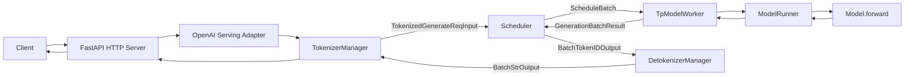
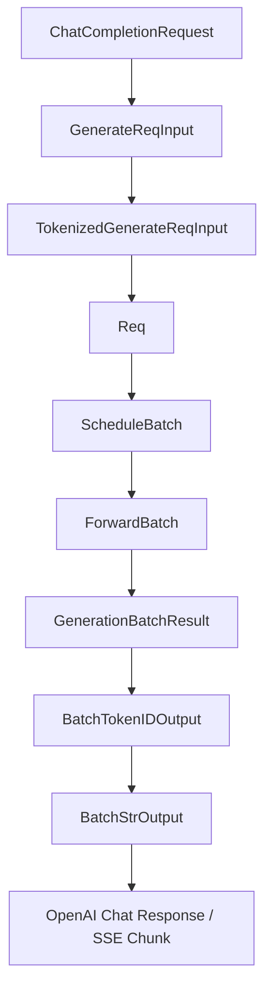
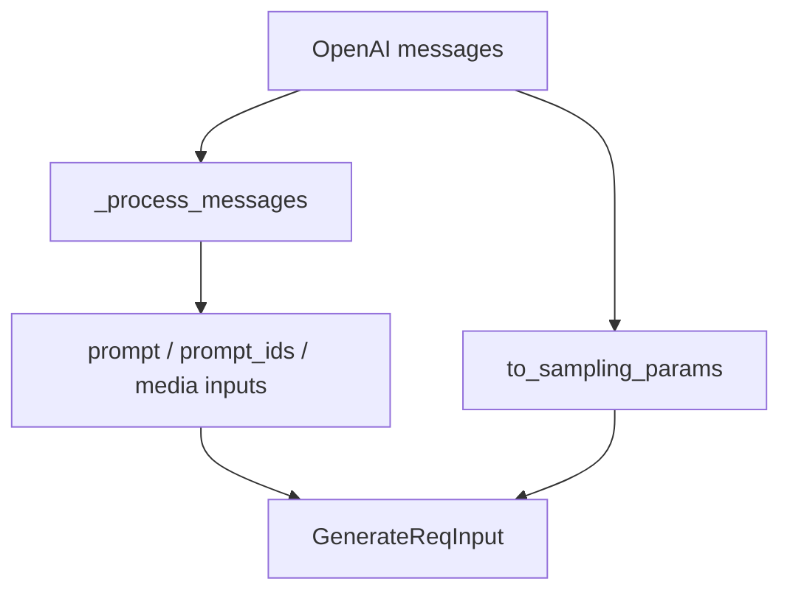
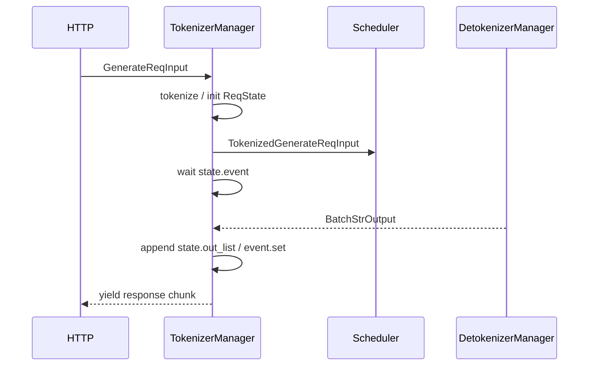
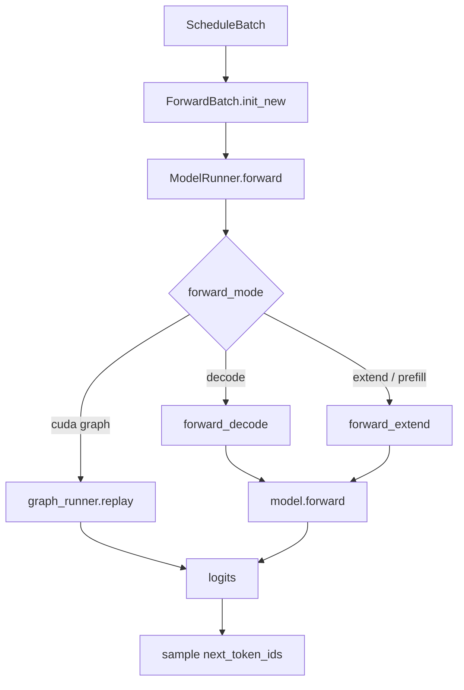
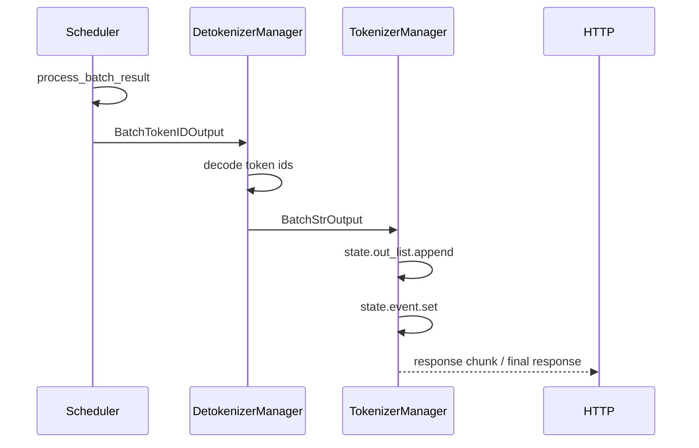

# 第 1 讲：一次 ChatCompletion 请求的完整生命周期

本讲目标：理解一个 OpenAI-compatible `/v1/chat/completions` 请求如何进入 SGLang，如何被 tokenized、调度、送入模型前向计算，并最终 detokenize 后返回给客户端。

## 一句话总览

SGLang 的推理服务可以先理解成三个协作角色：

- `TokenizerManager`：HTTP 侧的请求转换、tokenize、等待结果。
- `Scheduler`：核心调度器，负责排队、continuous batching、prefill/decode 切换。
- `DetokenizerManager`：把模型输出 token ids 变成文本，再送回 HTTP 侧。



## 关键数据结构流



读源码时，先盯住这条数据结构变形链。函数很多，但主线其实是这些对象不断被丰富、排队、拆分、合并和返回。

## 阶段 1：HTTP 入口

入口在：

- `/Users/zach/Source/SGLang/python/sglang/srt/entrypoints/http_server.py:1506`

核心逻辑：

```python
@app.post("/v1/chat/completions", dependencies=[Depends(validate_json_request)])
async def openai_v1_chat_completions(
    request: ChatCompletionRequest, raw_request: Request
):
    return await raw_request.app.state.openai_serving_chat.handle_request(
        request, raw_request
    )
```

这一层只做一件事：把 FastAPI 收到的 `ChatCompletionRequest` 交给 OpenAI serving adapter。

## 阶段 2：OpenAI 请求转内部请求

公共入口：

- `/Users/zach/Source/SGLang/python/sglang/srt/entrypoints/openai/serving_base.py:73`

`OpenAIServingBase.handle_request` 的职责：

1. 校验 OpenAI 请求。
2. 调用 `_convert_to_internal_request`。
3. 根据 `stream` 决定走 streaming 或 non-streaming。

ChatCompletion 的具体转换在：

- `/Users/zach/Source/SGLang/python/sglang/srt/entrypoints/openai/serving_chat.py:457`

这里会做几件非常关键的事：

- `_process_messages`：处理 messages、chat template、tools、reasoning parser、多模态输入。
- `request.to_sampling_params`：把 OpenAI 参数转换成 SGLang 的采样参数。
- 构造 `GenerateReqInput`：这是进入 SGLang 内部引擎的第一种核心请求对象。



## 阶段 3：TokenizerManager tokenize 并分发

主入口：

- `/Users/zach/Source/SGLang/python/sglang/srt/managers/tokenizer_manager.py:543`

`TokenizerManager.generate_request` 做的事可以拆成四步：

1. 创建或确认后台 `handle_loop`，用于接收 detokenizer 返回。
2. normalize 请求参数，初始化 `rid_to_state`。
3. tokenize 请求，得到 `TokenizedGenerateReqInput`。
4. 通过 ZMQ 发给 Scheduler，然后等待响应。

关键位置：

- tokenize 单请求：`/Users/zach/Source/SGLang/python/sglang/srt/managers/tokenizer_manager.py:735`
- 发送给 Scheduler：`/Users/zach/Source/SGLang/python/sglang/srt/managers/tokenizer_manager.py:1250`
- 等待单请求响应：`/Users/zach/Source/SGLang/python/sglang/srt/managers/tokenizer_manager.py:1352`

这里的心智模型：



## 阶段 4：Scheduler 接收、排队、组 batch

主循环：

- `/Users/zach/Source/SGLang/python/sglang/srt/managers/scheduler.py:1425`

核心循环长这样：

```python
while True:
    recv_reqs = self.request_receiver.recv_requests()
    self.process_input_requests(recv_reqs)
    batch = self.get_next_batch_to_run()
    if batch:
        result = self.run_batch(batch)
        self.process_batch_result(batch, result)
```

这就是 SGLang 推理引擎的中枢。

关键位置：

- 分发输入请求：`/Users/zach/Source/SGLang/python/sglang/srt/managers/scheduler.py:1543`
- 构造内部 `Req`：`/Users/zach/Source/SGLang/python/sglang/srt/managers/scheduler.py:1900`
- 加入等待队列：`/Users/zach/Source/SGLang/python/sglang/srt/managers/scheduler.py:2156`
- 选择下一个 batch：`/Users/zach/Source/SGLang/python/sglang/srt/managers/scheduler.py:2404`
- 跑 batch：`/Users/zach/Source/SGLang/python/sglang/srt/managers/scheduler.py:2965`

Scheduler 是后续最值得深挖的模块，因为这里藏着：

- continuous batching
- prefill/decode 调度
- radix cache
- chunked prefill
- overlap schedule
- speculative decoding 结果处理
- 分布式和 disaggregation 调度

## 阶段 5：TpModelWorker 与 ModelRunner 前向

Scheduler 不直接调用模型，而是通过 worker。

入口：

- `/Users/zach/Source/SGLang/python/sglang/srt/managers/tp_worker.py:447`

`TpModelWorker.forward_batch_generation` 负责：

1. 从 `ScheduleBatch` 构造 `ForwardBatch`。
2. 调用 `ModelRunner.forward`。
3. 对 logits 做 sampling，得到下一批 token ids。
4. 返回 `GenerationBatchResult`。

`ModelRunner.forward` 在：

- `/Users/zach/Source/SGLang/python/sglang/srt/model_executor/model_runner.py:3235`

它会根据 `forward_batch.forward_mode` 分发：

- decode：`/Users/zach/Source/SGLang/python/sglang/srt/model_executor/model_runner.py:3060`
- extend/prefill：`/Users/zach/Source/SGLang/python/sglang/srt/model_executor/model_runner.py:3109`



## 阶段 6：结果返回和 detokenize

Scheduler 处理模型结果：

- `/Users/zach/Source/SGLang/python/sglang/srt/managers/scheduler.py:3167`

decode 结果处理会更新每个 `Req`：

- 追加 `output_ids`
- 判断是否 finished
- 更新 grammar/logprob/hidden states
- 调用 output streamer

发送到 Detokenizer：

- `/Users/zach/Source/SGLang/python/sglang/srt/managers/scheduler_components/output_streamer.py:120`

Detokenizer 主循环：

- `/Users/zach/Source/SGLang/python/sglang/srt/managers/detokenizer_manager.py:143`

token ids 转文本：

- `/Users/zach/Source/SGLang/python/sglang/srt/managers/detokenizer_manager.py:353`

最后 TokenizerManager 收回结果：

- `/Users/zach/Source/SGLang/python/sglang/srt/managers/tokenizer_manager.py:1738`
- `/Users/zach/Source/SGLang/python/sglang/srt/managers/tokenizer_manager.py:1753`

这里要注意一个设计点：HTTP 请求协程不是一直主动轮询 Scheduler，而是在 `ReqState.event` 上等待。Detokenizer 返回后，`TokenizerManager.handle_loop` 把文本放进 `state.out_list`，然后 `event.set()` 唤醒 HTTP 侧等待协程。



## 这一讲的阅读任务

请按顺序打开这些文件，并只关注主链，不要被旁枝参数带跑：

1. `/Users/zach/Source/SGLang/python/sglang/srt/entrypoints/http_server.py:1506`
2. `/Users/zach/Source/SGLang/python/sglang/srt/entrypoints/openai/serving_base.py:73`
3. `/Users/zach/Source/SGLang/python/sglang/srt/entrypoints/openai/serving_chat.py:457`
4. `/Users/zach/Source/SGLang/python/sglang/srt/managers/tokenizer_manager.py:543`
5. `/Users/zach/Source/SGLang/python/sglang/srt/managers/scheduler.py:1425`
6. `/Users/zach/Source/SGLang/python/sglang/srt/managers/tp_worker.py:447`
7. `/Users/zach/Source/SGLang/python/sglang/srt/model_executor/model_runner.py:3235`
8. `/Users/zach/Source/SGLang/python/sglang/srt/managers/detokenizer_manager.py:143`

读完后，你应该能用自己的话回答：

- `ChatCompletionRequest` 是在哪里变成 `GenerateReqInput` 的？
- `GenerateReqInput` 是在哪里变成 token ids 的？
- Scheduler 的主循环在哪？
- `ScheduleBatch` 是在哪里变成 `ForwardBatch` 的？
- token ids 是在哪里变回文本的？

## 下一讲预告

下一讲建议深入 Scheduler：我们会拆 `waiting_queue`、`running_batch`、prefill batch、decode batch，以及为什么 SGLang 可以把多个请求连续合批。
