# 第 2 讲：Scheduler 调度核心

本讲目标：理解 SGLang 的 Scheduler 如何把离散请求变成连续执行的 GPU batch。重点不是背完每个优化分支，而是先抓住三个状态：`waiting_queue`、`last_batch`、`running_batch`。

## 一句话总览

Scheduler 每一轮都做同一件事：

1. 收新请求。
2. 把新请求放进 `waiting_queue`。
3. 优先尝试从 `waiting_queue` 组一个新的 prefill batch。
4. 如果没有新的 prefill batch，就推进已有 `running_batch` 做 decode。
5. forward 之后更新请求状态，并把输出 token 送去 detokenize。

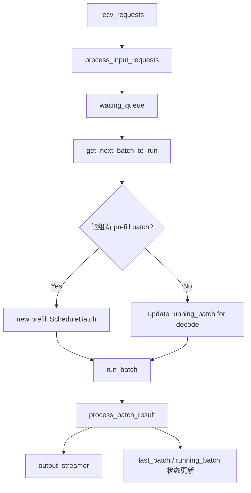

## 三个核心状态

Scheduler 的运行状态初始化在：

- `/Users/zach/Source/SGLang/python/sglang/srt/managers/scheduler.py:895`

核心字段：

- `waiting_queue`：还没进入 GPU prefill 的 `Req` 列表。
- `running_batch`：已经完成 prefill、正在逐 token decode 的请求集合。
- `last_batch`：上一轮刚跑完的 batch，用于把 prefill 后还没结束的请求合并进 `running_batch`。

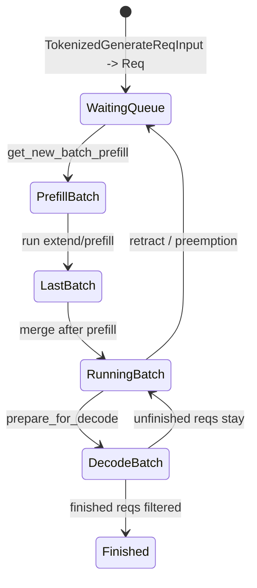

这个状态机是读 Scheduler 的钥匙。先记住：**新请求先进 `waiting_queue`，prefill 后进入 `running_batch`，之后每轮 decode 一步。**

## 主循环：普通模式与 overlap 模式

普通调度循环在：

- `/Users/zach/Source/SGLang/python/sglang/srt/managers/scheduler.py:1425`

它的骨架非常直：

```python
recv_reqs = self.request_receiver.recv_requests()
self.process_input_requests(recv_reqs)
batch = self.get_next_batch_to_run()
if batch:
    result = self.run_batch(batch)
    self.process_batch_result(batch, result)
```

Overlap 调度循环在：

- `/Users/zach/Source/SGLang/python/sglang/srt/managers/scheduler.py:1451`

普通模式是“处理上一轮结果 -> 跑下一轮 forward”；overlap 模式会把上一轮结果处理和当前轮 GPU forward 做流水重叠，用 `result_queue` 暂存结果。

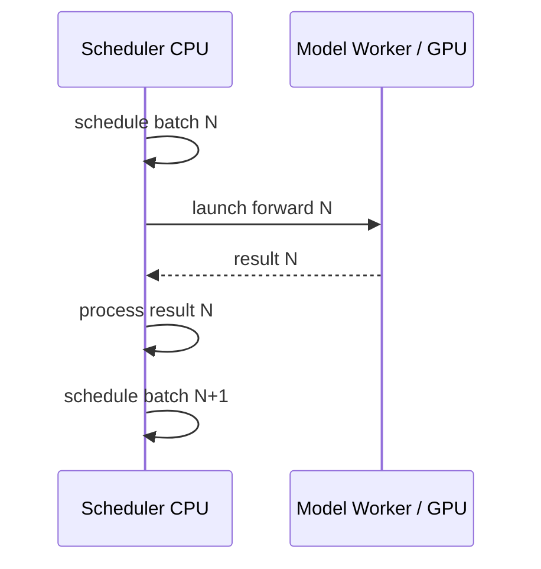

Overlap 后更像：

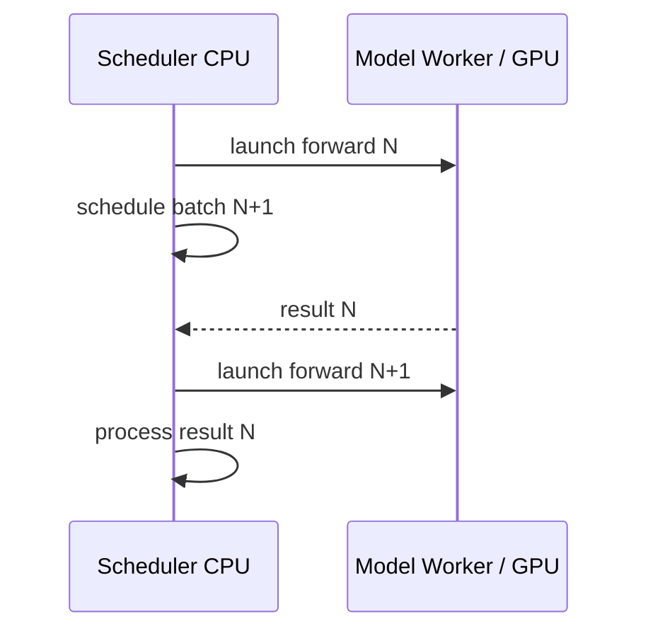

第一遍读源码时可以先看普通模式，等主链通了再回来看 overlap。

## 输入请求如何进入等待队列

输入请求分发在：

- `/Users/zach/Source/SGLang/python/sglang/srt/managers/scheduler.py:1543`

生成请求会被 dispatch 到：

- `/Users/zach/Source/SGLang/python/sglang/srt/managers/scheduler.py:1900`

这里会把 `TokenizedGenerateReqInput` 包成内部 `Req`。`Req` 比前面的对象更接近调度器需要的形态：它包含 input ids、sampling params、priority、stream、LoRA、grammar、多模态信息、finish 状态和 KV cache 管理字段。

真正加入队列在：

- `/Users/zach/Source/SGLang/python/sglang/srt/managers/scheduler.py:2156`

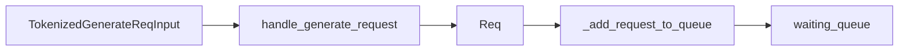

## get_next_batch_to_run：调度决策中心

核心函数：

- `/Users/zach/Source/SGLang/python/sglang/srt/managers/scheduler.py:2404`

它的优先级可以简化成：

1. 先把上一轮 prefill batch 里未完成的请求合并进 `running_batch`。
2. 尝试从 `waiting_queue` 组新的 prefill batch。
3. 如果能组 prefill，就优先跑 prefill。
4. 如果不能组 prefill，就推进 `running_batch` 做 decode。

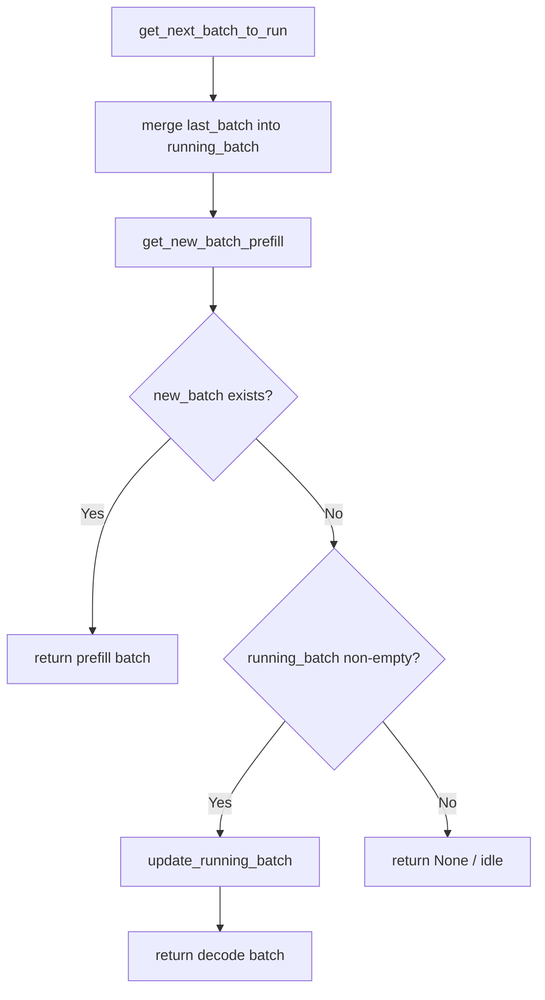

这解释了 continuous batching 的核心：**正在 decode 的请求不会阻塞新请求 prefill；Scheduler 每轮都会尝试插入新的 prefill batch，再回到 decode。**

## Prefill：从 waiting_queue 选请求

入口：

- `/Users/zach/Source/SGLang/python/sglang/srt/managers/scheduler.py:2532`

真正逻辑在：

- `/Users/zach/Source/SGLang/python/sglang/srt/managers/scheduler.py:2552`

这部分做的事情很多，但可以分成五层：

1. 处理 grammar ready、hierarchical cache、priority preemption 等前置状态。
2. 如果 `running_batch.batch_is_full` 或没有等待请求，直接不组 prefill。
3. 创建 `PrefillAdder`，用它检查 token 预算、KV cache 容量、chunked prefill 限制。
4. 遍历 `waiting_queue`，把能跑的请求放进 `can_run_list`。
5. 用 `ScheduleBatch.init_new` 构造 batch，并 `prepare_for_extend`。

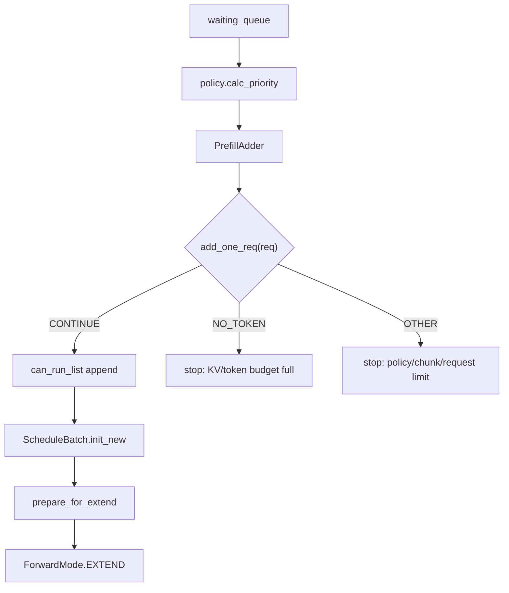

`PrefillAdder` 在：

- `/Users/zach/Source/SGLang/python/sglang/srt/managers/schedule_policy.py:405`

它维护几个预算：

- `rem_total_tokens`：总 KV token 预算。
- `cur_rem_tokens`：当前 batch 可用 token 预算。
- `rem_input_tokens`：prefill 输入 token 预算，对应 `max_prefill_tokens`。
- `rem_chunk_tokens`：chunked prefill 的 chunk 预算。
- `can_run_list`：本轮可以进 prefill 的请求。
- `preempt_list`：被抢占、需要回队列的请求。

核心检查在：

- `/Users/zach/Source/SGLang/python/sglang/srt/managers/schedule_policy.py:828`

`add_one_req` 会检查：

- prefill delayer 是否允许这轮 prefill。
- `prefill_max_requests` 是否达到。
- 新请求的 `extend_input_len + max_new_tokens + page_size` 是否超过剩余 KV 预算。
- hybrid SWA / chunked prefill 等特殊预算。
- prefix cache 节点锁定与 host cache load-back。

## ScheduleBatch：调度器的 batch 容器

类定义：

- `/Users/zach/Source/SGLang/python/sglang/srt/managers/schedule_batch.py:1481`

`ScheduleBatch` 是 Scheduler 层的 batch，不是模型层最终 forward 使用的 batch。它保存：

- `reqs`：这一批请求。
- `req_to_token_pool` / `token_to_kv_pool_allocator` / `tree_cache`：内存和 cache 资源。
- `forward_mode`：这轮是 `EXTEND`、`DECODE`、`MIXED`、`IDLE` 等。
- `batch_is_full`：是否认为 running batch 已满，避免重复做昂贵 prefill 检查。
- `chunked_req` / `decoding_reqs`：chunked prefill 和 mixed batch 辅助字段。

新 prefill batch 由：

- `/Users/zach/Source/SGLang/python/sglang/srt/managers/schedule_batch.py:1649`

构造后调用：

- `/Users/zach/Source/SGLang/python/sglang/srt/managers/schedule_batch.py:1813`

`prepare_for_extend` 会：

1. 设置 `forward_mode = EXTEND`。
2. 计算每个请求的 `prefix_lens`、`extend_lens`、`seq_lens`。
3. 为 extend/prefill 分配 KV cache。
4. 准备 input ids、multimodal inputs、sampling info 等字段。

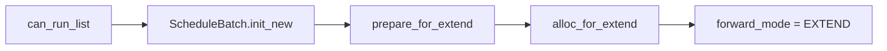

## Decode：推进 running_batch

如果这一轮没有新的 prefill batch，Scheduler 会尝试 decode：

- `/Users/zach/Source/SGLang/python/sglang/srt/managers/scheduler.py:2502`

先调用：

- `/Users/zach/Source/SGLang/python/sglang/srt/managers/scheduler.py:2823`

`update_running_batch` 做三件事：

1. `filter_batch`：移除已经完成或被排除的请求。
2. `check_decode_mem`：检查下一步 decode 是否有足够 KV cache。
3. 如果不够，`retract_decode` 把部分请求撤回，释放 KV cache。

内存检查在：

- `/Users/zach/Source/SGLang/python/sglang/srt/managers/schedule_batch.py:2261`

撤回逻辑在：

- `/Users/zach/Source/SGLang/python/sglang/srt/managers/schedule_batch.py:2274`

准备 decode 在：

- `/Users/zach/Source/SGLang/python/sglang/srt/managers/schedule_batch.py:2383`

`prepare_for_decode` 会：

- 设置 `forward_mode = DECODE`。
- 为每个请求分配一个新 token 的 KV cache 位置。
- 更新 `seq_lens`、`kv_committed_len`、`kv_allocated_len`。

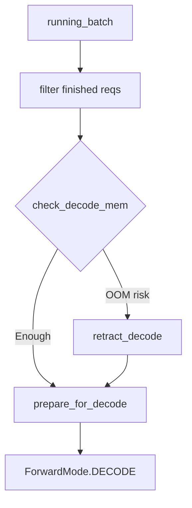

## run_batch：真正发起 forward

入口：

- `/Users/zach/Source/SGLang/python/sglang/srt/managers/scheduler.py:2965`

生成模型路径最终会调用：

- `/Users/zach/Source/SGLang/python/sglang/srt/managers/scheduler.py:3064`

核心是：

```python
resolve_forward_inputs(batch, self.future_map)
batch_result = self.model_worker.forward_batch_generation(batch, **kwargs)
```

`resolve_forward_inputs` 把 Scheduler 阶段准备好的输入解析成 forward 可以消费的 tensor；`model_worker.forward_batch_generation` 进入上一讲的 `TpModelWorker -> ModelRunner` 路径。

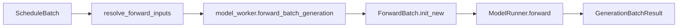

## process_batch_result：把 token 写回 Req

总入口：

- `/Users/zach/Source/SGLang/python/sglang/srt/managers/scheduler.py:3167`

Prefill 结果处理：

- `/Users/zach/Source/SGLang/python/sglang/srt/managers/scheduler_components/batch_result_processor.py:178`

Decode 结果处理：

- `/Users/zach/Source/SGLang/python/sglang/srt/managers/scheduler_components/batch_result_processor.py:588`

prefill 和 decode 都会更新 `Req.output_ids` 与 finish 状态，但含义略不同：

- prefill：处理 prompt extend 后采样出的第一个 token。
- decode：每轮追加一个或多个新 token，然后判断请求是否结束。

decode 结束处会调用：

- `/Users/zach/Source/SGLang/python/sglang/srt/managers/scheduler_components/batch_result_processor.py:691`

也就是把当前可输出内容交给 `output_streamer`，继续走 Detokenizer。

## Continuous batching 的核心直觉

传统 batch 推理像这样：

```mermaid
gantt
  title 传统静态 batch：短请求等长请求
  dateFormat X
  axisFormat %s
  section Batch
  Req A :0, 5
  Req B :0, 12
  Req C :0, 8
```

SGLang 的 continuous batching 更像这样：

```mermaid
gantt
  title Continuous batching：每轮动态维护 running_batch
  dateFormat X
  axisFormat %s
  section Req A
  prefill :0, 1
  decode :1, 5
  section Req B
  prefill :0, 1
  decode :1, 12
  section Req C
  prefill :3, 4
  decode :4, 9
  section Req D
  prefill :6, 7
  decode :7, 11
```

关键点：新请求不必等所有老请求结束。Scheduler 可以在 decode 过程中插入新请求 prefill，然后把它合并进后续 decode 队伍。

## 第一遍读 Scheduler 时可以忽略什么

为了不被复杂度淹没，第一遍可以先跳过：

- disaggregation prefill/decode
- DLLM
- HiSparse
- pipeline parallel microbatch
- speculative decoding 细节
- LoRA overlap loading
- overlap schedule 的 stream 隔离细节

但不要跳过：

- `waiting_queue`
- `running_batch`
- `last_batch`
- `get_next_batch_to_run`
- `get_new_batch_prefill`
- `update_running_batch`
- `ScheduleBatch.prepare_for_extend`
- `ScheduleBatch.prepare_for_decode`

这几个点连起来，就是 Scheduler 的骨架。

## 这一讲的阅读任务

请按顺序打开：

1. `/Users/zach/Source/SGLang/python/sglang/srt/managers/scheduler.py:895`
2. `/Users/zach/Source/SGLang/python/sglang/srt/managers/scheduler.py:1425`
3. `/Users/zach/Source/SGLang/python/sglang/srt/managers/scheduler.py:2404`
4. `/Users/zach/Source/SGLang/python/sglang/srt/managers/scheduler.py:2532`
5. `/Users/zach/Source/SGLang/python/sglang/srt/managers/schedule_policy.py:405`
6. `/Users/zach/Source/SGLang/python/sglang/srt/managers/schedule_policy.py:828`
7. `/Users/zach/Source/SGLang/python/sglang/srt/managers/schedule_batch.py:1813`
8. `/Users/zach/Source/SGLang/python/sglang/srt/managers/schedule_batch.py:2383`
9. `/Users/zach/Source/SGLang/python/sglang/srt/managers/scheduler_components/batch_result_processor.py:588`

读完后，用自己的话回答：

- 为什么 Scheduler 会优先尝试新 prefill，再做 decode？
- `waiting_queue` 里的请求什么时候进入 `running_batch`？
- `PrefillAdder` 主要在检查哪些资源？
- `prepare_for_extend` 和 `prepare_for_decode` 的差别是什么？
- decode 内存不够时，SGLang 怎么避免直接 OOM？

## 下一讲预告

下一讲建议读 KV cache 与 Radix Cache。Scheduler 为什么能高效插入新请求，很大一部分原因来自 prefix cache 和 KV cache allocator 的配合。
