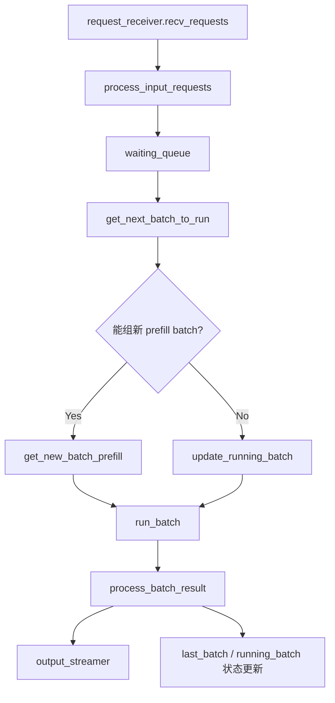
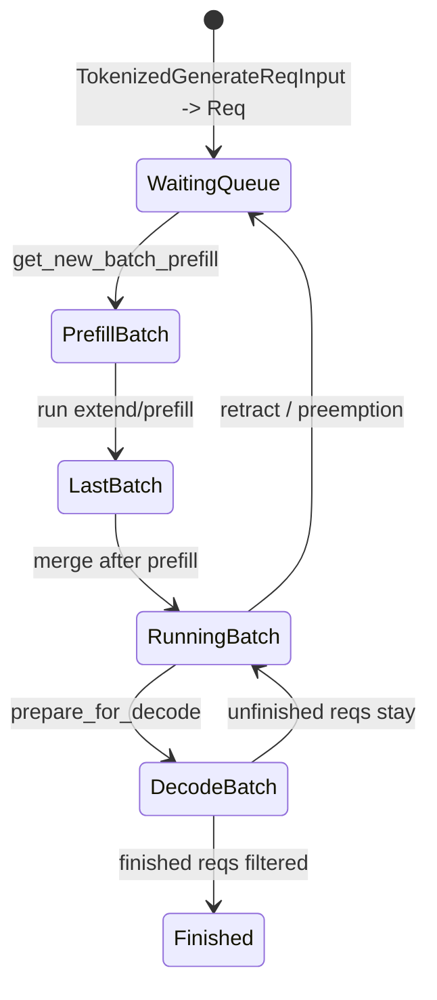
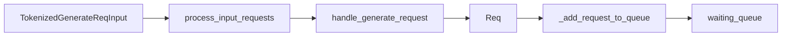
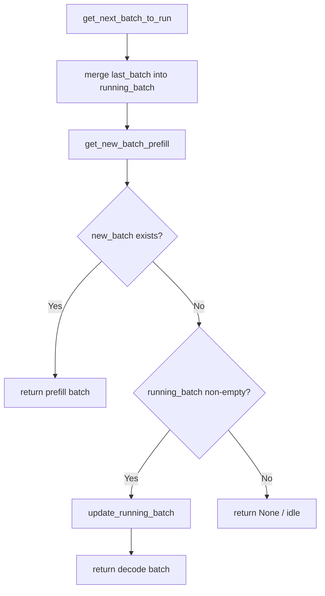
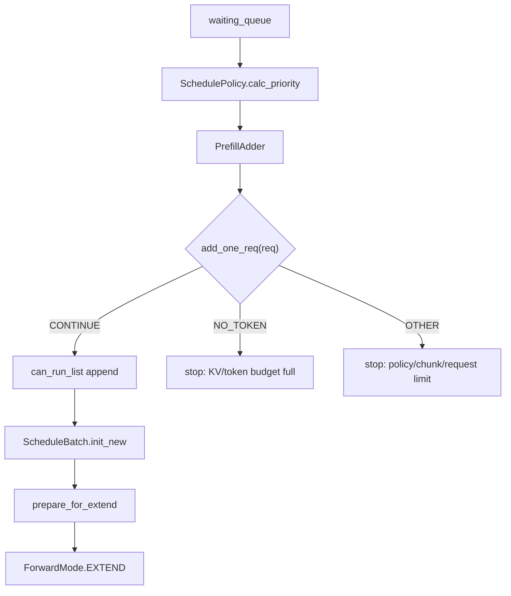
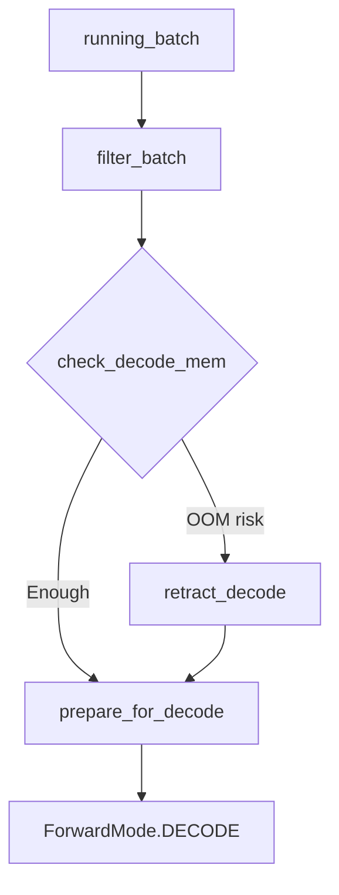
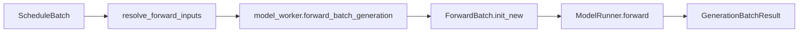

# 第 2 讲：Scheduler 调度核心

本讲目标：理解 SGLang 的 Scheduler 如何把离散请求变成连续执行的 GPU batch。重点不是背完每个优化分支，而是抓住三个状态：`waiting_queue`、`last_batch`、`running_batch`。

## 一句话总览

Scheduler 每轮做同一件事：

1. 收新请求。
2. 把新请求放进 `waiting_queue`。
3. 优先尝试从 `waiting_queue` 组一个新的 prefill batch。
4. 如果没有新的 prefill batch，就推进已有 `running_batch` 做 decode。
5. forward 之后更新请求状态，并把输出 token 送去 detokenize。



## 1. 三个核心状态

| 文件 | 类 / 函数 | 重点代码段 |
|---|---|---|
| `python/sglang/srt/managers/scheduler.py` | `Scheduler.__init__()` | 初始化 scheduler 所需组件。 |
| `python/sglang/srt/managers/scheduler.py` | `Scheduler.init_running_status()` | 初始化 `waiting_queue`、`running_batch`、`last_batch` 等运行状态。 |

核心字段：

- `waiting_queue`：还没进入 GPU prefill 的 `Req` 列表。
- `running_batch`：已经完成 prefill、正在逐 token decode 的请求集合。
- `last_batch`：上一轮刚跑完的 batch，用于把 prefill 后还没结束的请求合并进 `running_batch`。



## 2. 主循环：普通模式与 overlap 模式

| 文件 | 函数 | 重点代码段 |
|---|---|---|
| `python/sglang/srt/managers/scheduler.py` | `Scheduler.run_event_loop()` | 根据 overlap、MLX 等配置选择具体 event loop。 |
| `python/sglang/srt/managers/scheduler.py` | `Scheduler.event_loop_normal()` | 普通循环：收请求、调度、forward、处理结果。 |
| `python/sglang/srt/managers/scheduler.py` | `Scheduler.event_loop_overlap()` | overlap 循环：使用 `result_queue` 让 GPU forward 和 CPU 结果处理重叠。 |

普通模式骨架：

```python
recv_reqs = self.request_receiver.recv_requests()
self.process_input_requests(recv_reqs)
batch = self.get_next_batch_to_run()
if batch:
    result = self.run_batch(batch)
    self.process_batch_result(batch, result)
```

第一遍读源码时可以先看 `event_loop_normal()`，等主链通了再回来看 `event_loop_overlap()`。

## 3. 输入请求如何进入等待队列

| 文件 | 函数 | 重点代码段 |
|---|---|---|
| `python/sglang/srt/managers/scheduler.py` | `Scheduler.process_input_requests()` | 从 ZMQ 收到的对象按类型 dispatch，例如生成、embedding、abort、flush cache。 |
| `python/sglang/srt/managers/scheduler.py` | `Scheduler.handle_generate_request()` | 把 `TokenizedGenerateReqInput` 转成内部 `Req`，填充 sampling、priority、LoRA、grammar、多模态字段。 |
| `python/sglang/srt/managers/scheduler.py` | `Scheduler.init_req_max_new_tokens()` | 计算并校验请求可生成 token 数。 |
| `python/sglang/srt/managers/scheduler.py` | `Scheduler._add_request_to_queue()` | 真正加入 `waiting_queue`，必要时处理 priority / queued limit。 |



这一段回答的是用户例子里的问题：**输入请求分发在 `process_input_requests()`；生成请求具体 dispatch 到 `handle_generate_request()`；进入等待队列在 `_add_request_to_queue()`。**

## 4. `get_next_batch_to_run()`：调度决策中心

| 文件 | 函数 / 代码段 | 作用 |
|---|---|---|
| `python/sglang/srt/managers/scheduler.py` | `Scheduler.get_next_batch_to_run()` | 先合并上一轮 prefill 结果，再尝试新 prefill，最后 fallback 到 decode。 |
| `python/sglang/srt/managers/schedule_batch.py` | `ScheduleBatch.merge_batch()` | 将 prefill 后未完成的请求合并到 `running_batch`。 |
| `python/sglang/srt/managers/scheduler.py` | `Scheduler.get_new_batch_prefill()` | 尝试从 `waiting_queue` 组 prefill batch。 |
| `python/sglang/srt/managers/scheduler.py` | `Scheduler.update_running_batch()` | 没有新 prefill 时推进 decode batch。 |



这解释了 continuous batching 的核心：正在 decode 的请求不会阻塞新请求 prefill；Scheduler 每轮都会尝试插入新的 prefill batch，再回到 decode。

## 5. Prefill：从 `waiting_queue` 选请求

| 文件 | 函数 / 类 | 重点代码段 |
|---|---|---|
| `python/sglang/srt/managers/scheduler.py` | `Scheduler.get_new_batch_prefill()` | prefill 入口，处理 grammar ready、队列状态和 wrapper 逻辑。 |
| `python/sglang/srt/managers/scheduler.py` | `Scheduler._get_new_batch_prefill_raw()` | prefill 选请求的核心：算 prefix、创建 `PrefillAdder`、遍历 `waiting_queue`。 |
| `python/sglang/srt/managers/schedule_policy.py` | `SchedulePolicy.calc_priority()` | 根据 FCFS、LPM、DFS weight、priority 等策略重排等待队列。 |
| `python/sglang/srt/managers/schedule_policy.py` | `PrefillAdder.__init__()` | 初始化 token/KV/chunk 预算。 |
| `python/sglang/srt/managers/schedule_policy.py` | `PrefillAdder.add_one_req()` | 判断单个请求能否进入本轮 prefill。 |
| `python/sglang/srt/managers/schedule_batch.py` | `ScheduleBatch.init_new()` | 用 `can_run_list` 创建 `ScheduleBatch`。 |
| `python/sglang/srt/managers/schedule_batch.py` | `ScheduleBatch.prepare_for_extend()` | 设置 `ForwardMode.EXTEND`，分配 prefill/extend KV cache。 |



`PrefillAdder.add_one_req()` 是资源约束最集中的地方，重点看这些字段如何被消耗：

- `rem_total_tokens`
- `cur_rem_tokens`
- `rem_input_tokens`
- `rem_chunk_tokens`
- `can_run_list`
- `preempt_list`

## 6. `ScheduleBatch`：调度器的 batch 容器

| 文件 | 类 / 函数 | 重点代码段 |
|---|---|---|
| `python/sglang/srt/managers/schedule_batch.py` | `class Req` | 单个内部请求，保存 `origin_input_ids`、`output_ids`、`prefix_indices`、finish 状态等。 |
| `python/sglang/srt/managers/schedule_batch.py` | `Req.init_next_round_input()` | prefill 前做 prefix match，计算本轮实际需要处理的 suffix。 |
| `python/sglang/srt/managers/schedule_batch.py` | `class ScheduleBatch` | Scheduler 层 batch，保存 `reqs`、pool、tree cache、forward mode。 |
| `python/sglang/srt/managers/schedule_batch.py` | `ScheduleBatch.init_new()` | 从 `Req` 列表构造新的 batch。 |
| `python/sglang/srt/managers/schedule_batch.py` | `ScheduleBatch.prepare_for_extend()` | prefill/extend 前准备 input ids、seq lens、KV slot。 |
| `python/sglang/srt/managers/schedule_batch.py` | `ScheduleBatch.prepare_for_decode()` | decode 前为每个 running req 分配下一 token 的 KV slot。 |

`ScheduleBatch` 不是模型最终消费的 batch。模型层真正消费的是下一讲会讲到的 `ForwardBatch`。

## 7. Decode：推进 `running_batch`

| 文件 | 函数 | 重点代码段 |
|---|---|---|
| `python/sglang/srt/managers/scheduler.py` | `Scheduler.update_running_batch()` | 过滤完成请求、检查 decode 内存、必要时 retract。 |
| `python/sglang/srt/managers/schedule_batch.py` | `ScheduleBatch.filter_batch()` | 移除 finished 或被排除的请求。 |
| `python/sglang/srt/managers/schedule_batch.py` | `ScheduleBatch.check_decode_mem()` | 检查下一 decode step 是否有足够 KV slot。 |
| `python/sglang/srt/managers/schedule_batch.py` | `ScheduleBatch.retract_decode()` | 内存不足时撤回部分请求，释放 KV cache，放回等待队列。 |
| `python/sglang/srt/managers/schedule_batch.py` | `ScheduleBatch.prepare_for_decode()` | 设置 `ForwardMode.DECODE`，为每个请求分配新 token 的 KV slot。 |



## 8. `run_batch()`：真正发起 forward

| 文件 | 函数 / 代码段 | 作用 |
|---|---|---|
| `python/sglang/srt/managers/scheduler.py` | `Scheduler.run_batch()` | Scheduler 调 worker forward 的总入口。 |
| `python/sglang/srt/managers/scheduler.py` | `resolve_forward_inputs(batch, self.future_map)` 调用点 | 把前面准备的 future inputs 解析成 forward 可以消费的输入。 |
| `python/sglang/srt/managers/scheduler.py` | `self.model_worker.forward_batch_generation(batch, **kwargs)` 调用点 | 进入 `TpModelWorker -> ForwardBatch -> ModelRunner` 路径。 |
| `python/sglang/srt/managers/tp_worker.py` | `TpModelWorker.forward_batch_generation()` | worker 侧真正执行模型 forward 和 sampling。 |



## 9. `process_batch_result()`：把 token 写回 `Req`

| 文件 | 函数 / 类 | 重点代码段 |
|---|---|---|
| `python/sglang/srt/managers/scheduler.py` | `Scheduler.process_batch_result()` | 根据 batch 类型把结果交给 result processor。 |
| `python/sglang/srt/managers/scheduler_components/batch_result_processor.py` | `BatchResultProcessor.process_batch_result_prefill()` | 处理 prefill 结果，更新 `Req.output_ids`、finish、cache。 |
| `python/sglang/srt/managers/scheduler_components/batch_result_processor.py` | `BatchResultProcessor.process_batch_result_decode()` | 处理 decode 结果，追加 token 并判断结束。 |
| `python/sglang/srt/managers/scheduler_components/batch_result_processor.py` | 输出到 `output_streamer` 的调用点 | 把可输出 token id 交给 Detokenizer。 |
| `python/sglang/srt/managers/scheduler_components/output_streamer.py` | `OutputStreamer` | 统一处理 token id 输出、streaming、skip special token 等输出前逻辑。 |

prefill 和 decode 都会更新 `Req.output_ids` 与 finish 状态：

- prefill：处理 prompt extend 后采样出的第一个 token。
- decode：每轮追加一个或多个新 token，然后判断请求是否结束。

## 10. 第一遍读 Scheduler 时可以忽略什么

先跳过：

- disaggregation prefill/decode
- DLLM
- HiSparse
- pipeline parallel microbatch
- speculative decoding 细节
- LoRA overlap loading
- overlap schedule 的 stream 隔离细节

不要跳过：

- `Scheduler.process_input_requests()`
- `Scheduler.handle_generate_request()`
- `Scheduler._add_request_to_queue()`
- `Scheduler.get_next_batch_to_run()`
- `Scheduler.get_new_batch_prefill()` / `_get_new_batch_prefill_raw()`
- `Scheduler.update_running_batch()`
- `ScheduleBatch.prepare_for_extend()`
- `ScheduleBatch.prepare_for_decode()`
- `Scheduler.run_batch()`
- `Scheduler.process_batch_result()`

## 这一讲的阅读任务

| 顺序 | 文件 | 函数 / 代码段 |
|---:|---|---|
| 1 | `python/sglang/srt/managers/scheduler.py` | `event_loop_normal()` |
| 2 | `python/sglang/srt/managers/scheduler.py` | `process_input_requests()`、`handle_generate_request()`、`_add_request_to_queue()` |
| 3 | `python/sglang/srt/managers/scheduler.py` | `get_next_batch_to_run()` |
| 4 | `python/sglang/srt/managers/scheduler.py` | `get_new_batch_prefill()`、`_get_new_batch_prefill_raw()` |
| 5 | `python/sglang/srt/managers/schedule_policy.py` | `SchedulePolicy.calc_priority()`、`PrefillAdder.add_one_req()` |
| 6 | `python/sglang/srt/managers/schedule_batch.py` | `Req.init_next_round_input()`、`ScheduleBatch.prepare_for_extend()` |
| 7 | `python/sglang/srt/managers/scheduler.py` | `update_running_batch()` |
| 8 | `python/sglang/srt/managers/schedule_batch.py` | `check_decode_mem()`、`retract_decode()`、`prepare_for_decode()` |
| 9 | `python/sglang/srt/managers/scheduler.py` | `run_batch()`、`process_batch_result()` |

读完后，用自己的话回答：

- 为什么 Scheduler 会优先尝试新 prefill，再做 decode？
- `waiting_queue` 里的请求什么时候进入 `running_batch`？
- `PrefillAdder.add_one_req()` 主要在检查哪些资源？
- `prepare_for_extend()` 和 `prepare_for_decode()` 的差别是什么？
- decode 内存不够时，SGLang 怎么避免直接 OOM？

## 下一讲预告

下一讲读 KV cache 与 Radix Cache。Scheduler 为什么能高效插入新请求，很大一部分原因来自 prefix cache 和 KV cache allocator 的配合。
