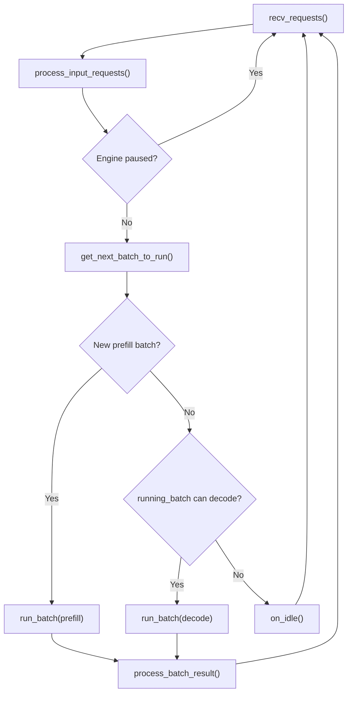
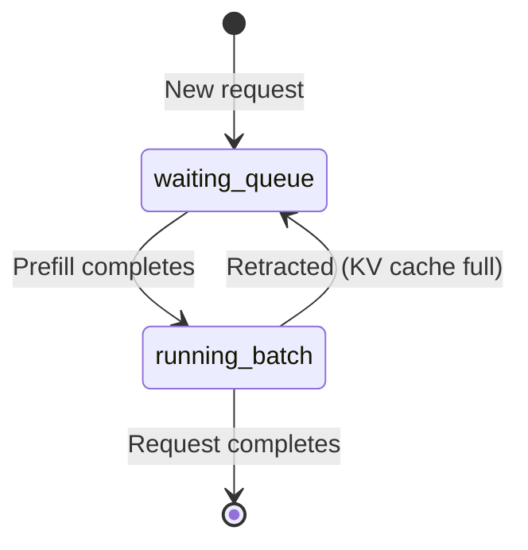

[中文](./02-scheduler-core.md) | [English](./02-scheduler-core_EN.md)

# Scheduler Core: Continuous Batching & Batch Formation

## One-Sentence Overview

Every round, the Scheduler: receives new requests → tries to form a prefill batch → if no prefill, advances decode → forwards → processes results.



## Three Core States

| State | Type | Description |
|---|---|---|
| `waiting_queue` | `List[Req]` | Requests waiting to be prefilled |
| `running_batch` | `ScheduleBatch` | Requests that have completed prefill, currently decoding |
| `last_batch` | `ScheduleBatch` | Previous round's batch (used to merge prefill → running) |

State transition:



## Main Loop

**Normal mode**: `recv → process → get_batch → run → process_result → loop`

**Overlap mode**: `recv → process → get_batch → launch_forward → process_previous_result → loop`

## How Requests Enter waiting_queue

```text
recv_requests() 
  → process_input_requests()
    → TypeBasedDispatcher dispatches by type
      → handle_generate_request() creates Req
        → _add_request_to_queue() appends to waiting_queue
```

## get_next_batch_to_run() — Scheduling Decision Center

1. Check timeouts, abort expired requests
2. Handle chunked_req / dllm / hisparse special states
3. If `last_batch` was extend, filter + merge into `running_batch`
4. `get_new_batch_prefill()` — try to form prefill batch
5. If prefill exists → return prefill batch
6. If no prefill, `running_batch` not empty → `update_running_batch()` → return decode batch
7. Otherwise → return `None`

## Prefill: Selecting from waiting_queue

`_get_new_batch_prefill_raw()`:
1. `SchedulePolicy.calc_priority()` — sort waiting queue
2. Create `PrefillAdder` — budget controller (token count, KV cache, request slots, LoRA limits)
3. Iterate waiting_queue, `add_one_req()` each
4. Create `ScheduleBatch.init_new()` → `prepare_for_extend()`
5. Optional: mix with running batch (mixed chunked prefill)

## Decode: Advancing running_batch

`update_running_batch()`:
1. `filter_batch()` — remove completed requests
2. `check_decode_mem()` — verify KV cache space
3. `retract_decode()` — if memory insufficient, retract some requests
4. `prepare_for_decode()` — prepare next-token inputs

## run_batch() & process_batch_result()

- `run_batch()`: Calls `model_worker.forward_batch_generation()` 
- `process_batch_result()`: Dispatches to `BatchResultProcessor`
  - Prefill: write first token, update cache
  - Decode: write token, check stop conditions

## Reading Tasks

1. Find `event_loop_normal` and trace one complete iteration
2. Find `get_next_batch_to_run` and understand prefill vs decode decision
3. Find `_get_new_batch_prefill_raw` and understand budget constraints
4. Find `update_running_batch` and understand memory pressure handling
5. Find `process_batch_result_decode` and trace token output
