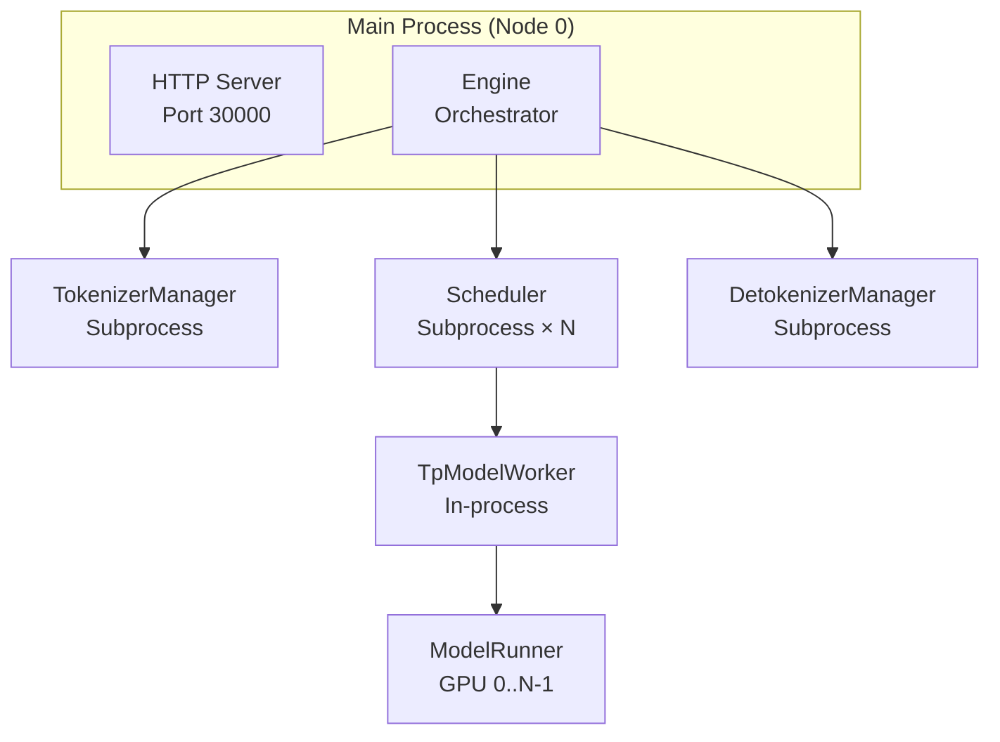
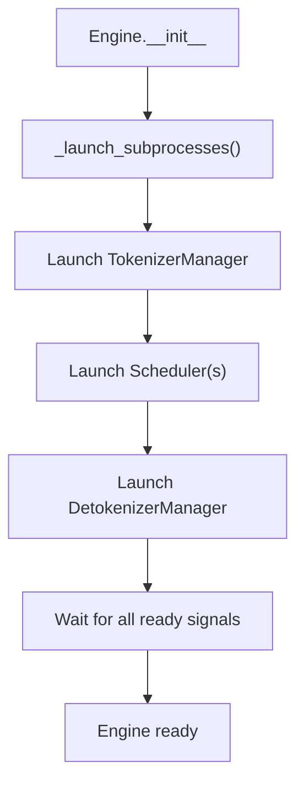

[中文](./06-multiprocess-distributed.md) | [English](./06-multiprocess-distributed_EN.md)

# Multi-Process & Distributed Architecture

## Overall Diagram



## Three Core Components

| Component | Role | Key Function |
|---|---|---|
| `Engine` | Orchestrator | `_launch_subprocesses()` starts all workers |
| `TokenizerManager` | Request normalization | Tokenize, apply chat template, send to Scheduler |
| `DetokenizerManager` | Output decoding | Token IDs → text, streaming |

## Engine._launch_subprocesses()



## IPC Directions

```text
TokenizerManager → Scheduler: tokenized requests
Scheduler → TokenizerManager: generation results, abort signals
Scheduler → DetokenizerManager: raw token IDs
DetokenizerManager → TokenizerManager: detokenized text
```

## Parallelism Dimensions

SGLang supports 9 parallelism types:

| Type | Split Dimension | Communication | Class |
|---|---|---|---|
| TP | Weight matrices | All-reduce per layer | `GroupCoordinator` |
| PP | Model layers | Send/recv activations | `GroupCoordinator` |
| DP | Batch size | All-reduce gradients* | `DataParallelController` |
| DP Attention | Batch + Attention | All-gather KV | `DataParallelAttn` |
| EP | Experts | All-to-all dispatch | `MoECommunicator` |
| SP/CP | Sequence length | All-to-all attention | `SequenceParallel` |
| MoE DP | MoE batch | All-reduce | `MoEDataParallel` |
| ATTN CP | Attention context | All-to-all | `AttentionCP` |

(*DP has no communication during inference, only training.)

## Rank Hierarchy

```text
world_rank → tp_rank + pp_rank + dp_rank
  tp_rank → attention_tp_rank + moe_tp_rank
  dp_rank → attention_dp_rank + moe_dp_rank
```

## How Requests Flow Between Ranks

**TP**: All ranks receive the same input, compute partial results, all-reduce
**PP**: Request flows through stages; only last stage samples
**DP**: Different requests go to different DP groups
**DP Attention**: Attention KV shared across DP ranks via all-gather
**EP**: Tokens routed between expert-holding ranks via all-to-all

## Multi-Node

- Node 0 runs HTTP server + all managers
- Other nodes only run Scheduler + ModelRunner
- `PortArgs` manages IPC addresses per node
- Node rank determines which GPUs each process uses

## Common Confusions

1. **DP vs DP Attention**: DP splits batch across model replicas (no communication); DP Attention splits batch but shares attention KV (has communication)
2. **TP vs EP**: TP splits weight matrices within a layer; EP places different experts on different GPUs
3. **Rank vs GPU**: Multiple ranks can share a GPU (e.g., TP+PP on same GPU)
4. **Why DetokenizerManager is separate**: Detokenization is CPU-bound and should not block Scheduler's GPU scheduling loop
