# 第 3 讲：KV Cache、Radix Cache 与 HiCache

本讲目标：理解 SGLang 如何管理 KV cache，为什么 prefix cache 能减少 prefill 成本，以及 Scheduler 为什么总是在调度前后操作 `tree_cache`、`req_to_token_pool`、`token_to_kv_pool_allocator`。

## 一句话总览

SGLang 的 cache 系统可以分成三层：

- `KVCache`：真正保存每层 attention 的 K/V tensor。
- `ReqToTokenPool`：记录“某个请求的第 i 个 token 对应哪个 KV slot”。
- `RadixCache / tree_cache`：用 token 前缀作为 key，记录可复用的 KV slot 序列。

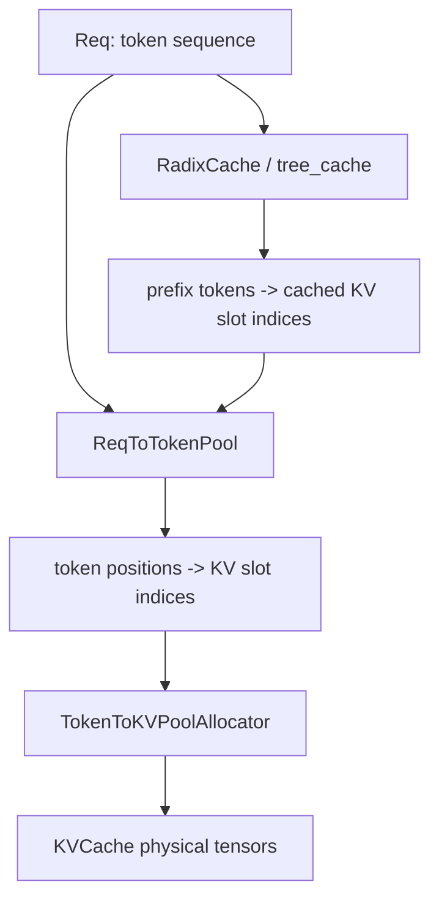

一句更直白的话：**KVCache 放数据，ReqToTokenPool 记地址，RadixCache 负责查前缀能不能复用。**

## 1. Memory Pool：物理 KV 存储和地址表

| 文件 | 类 / 函数 | 重点代码段 |
|---|---|---|
| `python/sglang/srt/mem_cache/memory_pool.py` | `class ReqToTokenPool` | 保存 `req_to_token[req_pool_idx, token_position] = kv_slot_index`。 |
| `python/sglang/srt/mem_cache/memory_pool.py` | `ReqToTokenPool.alloc()` | 给一组 `Req` 分配 request slot，也就是 `req.req_pool_idx`。 |
| `python/sglang/srt/mem_cache/memory_pool.py` | `ReqToTokenPool.write()` | 把 token position 到 KV slot 的映射写进二维表。 |
| `python/sglang/srt/mem_cache/memory_pool.py` | `class KVCache` | KV pool 抽象基类，定义 `get_key_buffer()`、`get_value_buffer()`、`set_kv_buffer()`。 |
| `python/sglang/srt/mem_cache/memory_pool.py` | `class MHATokenToKVPool` | 普通 MHA/GQA 模型常见的 KV tensor 实现。 |
| `python/sglang/srt/mem_cache/memory_pool.py` | `MHATokenToKVPool.set_kv_buffer()` | attention backend 写入某层新 K/V 的位置。 |

核心关系：

```python
req_to_token[req_pool_idx, token_position] = kv_slot_index
```

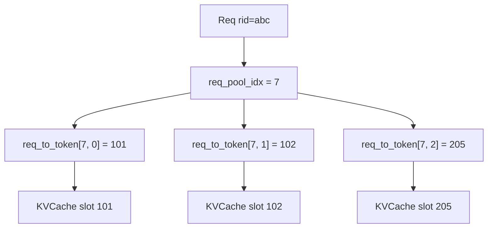

## 2. ModelRunner 初始化 cache

| 文件 | 类 / 函数 | 重点代码段 |
|---|---|---|
| `python/sglang/srt/model_executor/model_runner_kv_cache_mixin.py` | `ModelRunnerKVCacheMixin.init_memory_pool()` | cache 初始化总入口，计算可用 token 容量并调用 `_init_pools()`。 |
| `python/sglang/srt/model_executor/model_runner_kv_cache_mixin.py` | `ModelRunnerKVCacheMixin._init_pools()` | 初始化 `req_to_token_pool`、`token_to_kv_pool`、`token_to_kv_pool_allocator`。 |
| `python/sglang/srt/model_executor/model_runner_kv_cache_mixin.py` | `_resolve_memory_pool_config()` | 根据模型、dtype、page size、SWA/MLA/Mamba 等配置决定 pool 形态。 |
| `python/sglang/srt/model_executor/model_runner_kv_cache_mixin.py` | `_apply_memory_pool_config()` | 把 memory pool config 落到 `ModelRunner` 实例字段上。 |

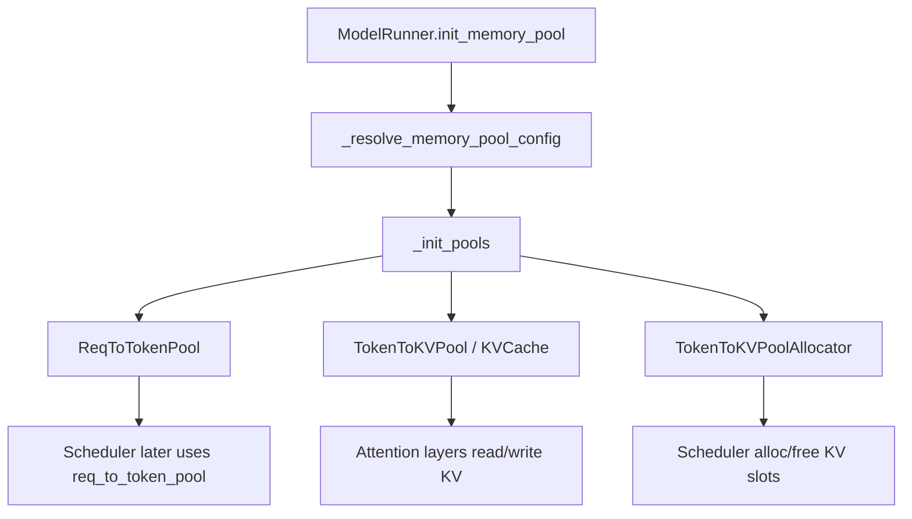

第一次读源码只要知道：allocator 管理 KV slot 的空闲、分配、释放、evict；attention backend 通过 KV pool 读写真实 K/V tensor。

## 3. `build_kv_cache()`：把 pool 和 tree cache 组装起来

| 文件 | 函数 / 类 | 重点代码段 |
|---|---|---|
| `python/sglang/srt/mem_cache/kv_cache_builder.py` | `build_kv_cache()` | 从 worker 取 memory pool，构造 `CacheInitParams`，调用 `create_tree_cache()`。 |
| `python/sglang/srt/mem_cache/kv_cache_builder.py` | `KVCacheBuildResult` | 返回 `req_to_token_pool`、`token_to_kv_pool_allocator`、`tree_cache` 等结果。 |
| `python/sglang/srt/mem_cache/registry.py` | `TreeCacheBuildContext` | tree cache 创建所需上下文。 |
| `python/sglang/srt/mem_cache/registry.py` | `create_tree_cache()` | tree cache 创建总入口。 |
| `python/sglang/srt/mem_cache/registry.py` | `default_radix_cache_factory()` | 默认选择 `RadixCache`、`ChunkCache`、HiCache、SWA/Mamba cache 等实现。 |

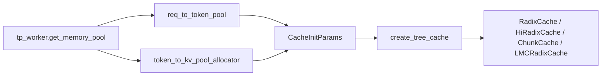

## 4. RadixCache：prefix -> KV slot indices

| 文件 | 类 / 函数 | 重点代码段 |
|---|---|---|
| `python/sglang/srt/mem_cache/radix_cache.py` | `class RadixKey` | prefix key，包含 token ids 和 `extra_key`。 |
| `python/sglang/srt/mem_cache/radix_cache.py` | `RadixKey.match()` | 计算两个 key 的公共前缀长度。 |
| `python/sglang/srt/mem_cache/radix_cache.py` | `class TreeNode` | radix tree 节点，保存 `key`、`value`、`children`、`lock_ref` 等。 |
| `python/sglang/srt/mem_cache/radix_cache.py` | `class RadixCache` | 压缩前缀树主体。 |
| `python/sglang/srt/mem_cache/radix_cache.py` | `RadixCache.match_prefix()` | 查找可复用 prefix，返回 `MatchResult`。 |
| `python/sglang/srt/mem_cache/radix_cache.py` | `RadixCache.insert()` | 将 token prefix 和 KV slots 插入 radix tree。 |
| `python/sglang/srt/mem_cache/radix_cache.py` | `RadixCache._match_prefix_helper()` / `_split_node()` | radix tree 查找和节点分裂的核心内部逻辑。 |

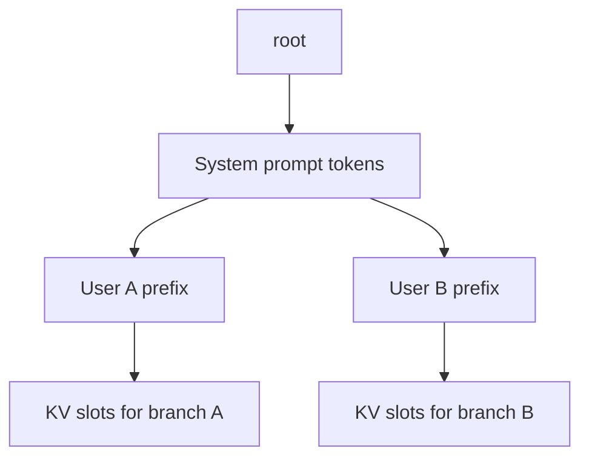

`RadixKey.extra_key` 很重要：它可以隔离不同 LoRA、cache salt 或其他不应该共享 KV 的请求。

## 5. Prefix match：请求进入 prefill 前先查 cache

| 文件 | 类 / 函数 | 重点代码段 |
|---|---|---|
| `python/sglang/srt/managers/schedule_batch.py` | `class Req` | 保存 `prefix_indices`、`last_node`、`host_hit_length`、`cache_protected_len` 等 prefix match 结果。 |
| `python/sglang/srt/managers/schedule_batch.py` | `Req.init_next_round_input()` | 构造 `fill_ids`，调用 `tree_cache.match_prefix(...)`，计算 `extend_input_len`。 |
| `python/sglang/srt/managers/schedule_batch.py` | `Req._compute_max_prefix_len()` | 限制 prefix match 的最大长度，通常不会匹配最后一个待生成位置。 |
| `python/sglang/srt/mem_cache/radix_cache.py` | `RadixCache.match_prefix()` | 返回 `MatchResult`，其中 `device_indices` 是可复用 KV slots。 |
| `python/sglang/srt/managers/schedule_policy.py` | `match_prefix_for_req()` | 调度策略里批量计算 prefix match 的辅助函数。 |

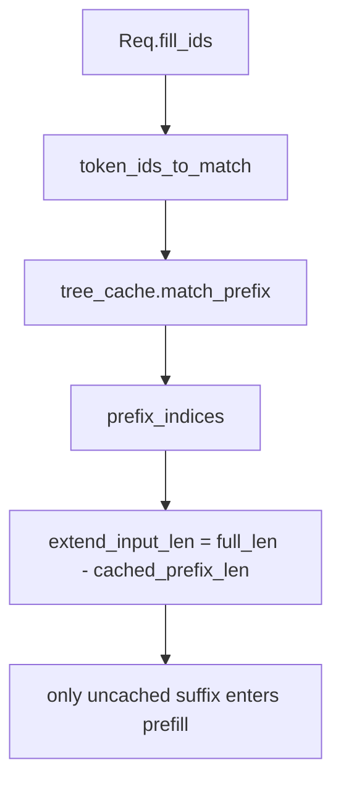

关键直觉：`prefix_indices` 是“已经算过、可以复用的 KV slot 序列”；prefill 只需要处理未命中的 suffix。

## 6. Prefill 分配：只给未命中的 suffix 分配 KV

| 文件 | 函数 | 重点代码段 |
|---|---|---|
| `python/sglang/srt/managers/scheduler.py` | `Scheduler._get_new_batch_prefill_raw()` | 调 `req.init_next_round_input(self.tree_cache)`，决定每个请求还需 prefill 多少 token。 |
| `python/sglang/srt/managers/schedule_batch.py` | `ScheduleBatch.prepare_for_extend()` | 计算 `input_ids = fill_ids[len(prefix_indices):]`、`extend_lens`、`prefix_lens`。 |
| `python/sglang/srt/mem_cache/common.py` | `alloc_req_slots()` | 为请求分配 `req_pool_idx`。 |
| `python/sglang/srt/mem_cache/common.py` | `alloc_for_extend()` | 为未命中 suffix 分配 KV slots，并把 prefix + suffix 写入 req table。 |
| `python/sglang/srt/mem_cache/common.py` | `write_cache_indices()` | 写 `req_to_token_pool`：把 token 位置映射到 KV slots。 |
| `python/sglang/srt/mem_cache/common.py` | `alloc_token_slots()` / `alloc_paged_token_slots_extend()` | 普通或 paged KV slot 分配。 |

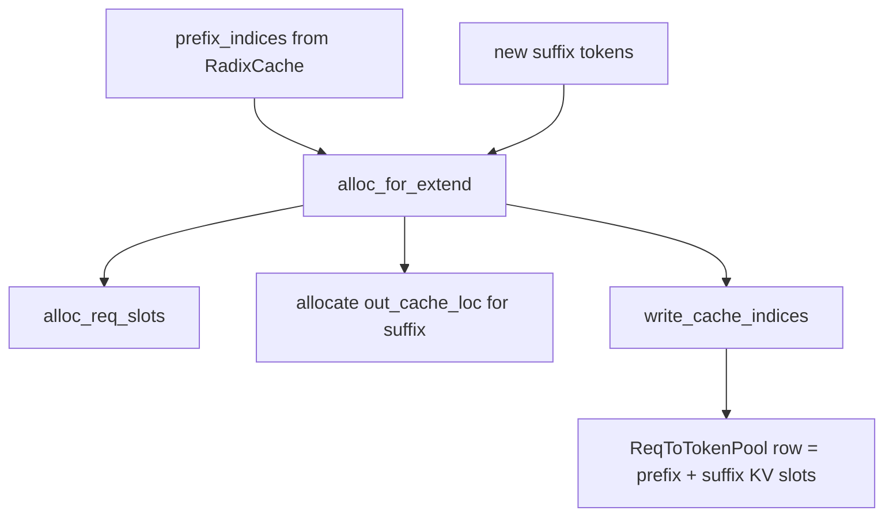

## 7. Decode 分配：每轮每个请求追加一个 KV slot

| 文件 | 函数 | 重点代码段 |
|---|---|---|
| `python/sglang/srt/managers/schedule_batch.py` | `ScheduleBatch.prepare_for_decode()` | decode 前准备 `forward_mode`、`seq_lens`、`out_cache_loc`。 |
| `python/sglang/srt/mem_cache/common.py` | `alloc_for_decode()` | 按 batch size 分配新 token KV slots，并写入 req table。 |
| `python/sglang/srt/mem_cache/common.py` | `alloc_paged_token_slots_decode()` | paged KV cache 下 decode slot 分配。 |

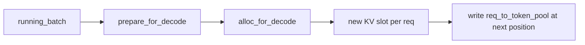

decode 阶段不再做大段 prefix match；每轮只为每个 running request 的新 token 分配一个位置。

## 8. Forward 时 attention 怎么找到历史 KV

| 文件 | 类 / 函数 | 重点代码段 |
|---|---|---|
| `python/sglang/srt/model_executor/forward_batch_info.py` | `class ForwardBatch` | 保存 `req_pool_indices`、`seq_lens`、`out_cache_loc`。 |
| `python/sglang/srt/model_executor/forward_batch_info.py` | `ForwardBatch.init_new()` | 从 `ScheduleBatch` 拷贝这些字段给模型前向。 |
| `python/sglang/srt/layers/attention/torch_flex_backend.py` | `TorchFlexAttnBackend.forward_decode()` / `forward_extend()` | 示例 backend：用 pool 和 batch metadata 读写 KV。 |
| `python/sglang/srt/mem_cache/memory_pool.py` | `KVCache.get_key_buffer()` / `get_value_buffer()` | attention backend 读取真实 K/V tensor。 |

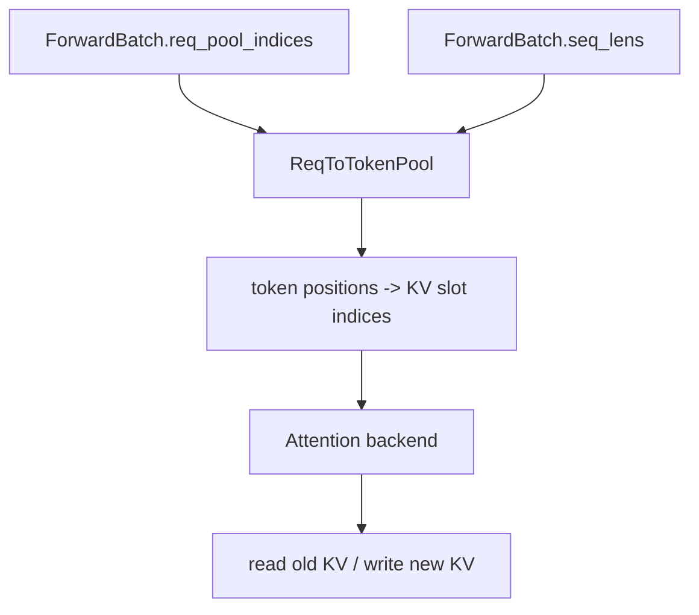

模型层不需要知道 Radix tree 怎么长；它只需要 `ForwardBatch` 和 KV pool 暴露出的 slot 映射。

## 9. 请求结束或中间暂停时，KV 如何回到 RadixCache

| 文件 | 函数 | 重点代码段 |
|---|---|---|
| `python/sglang/srt/mem_cache/common.py` | `maybe_cache_unfinished_req()` | prefill 后请求未完成时，按条件调用 tree cache 缓存。 |
| `python/sglang/srt/mem_cache/radix_cache.py` | `RadixCache.cache_unfinished_req()` | 把未完成请求当前 prefix 插入 radix tree，并更新 `prefix_indices` / lock。 |
| `python/sglang/srt/mem_cache/common.py` | `release_kv_cache()` | 请求完成、撤回或释放时，决定插入 tree cache 还是直接释放。 |
| `python/sglang/srt/mem_cache/radix_cache.py` | `RadixCache.cache_finished_req()` | 已完成请求的 KV 插入 radix tree 或释放。 |
| `python/sglang/srt/mem_cache/radix_cache.py` | `RadixCache.insert()` | 具体插入 radix tree 的实现。 |

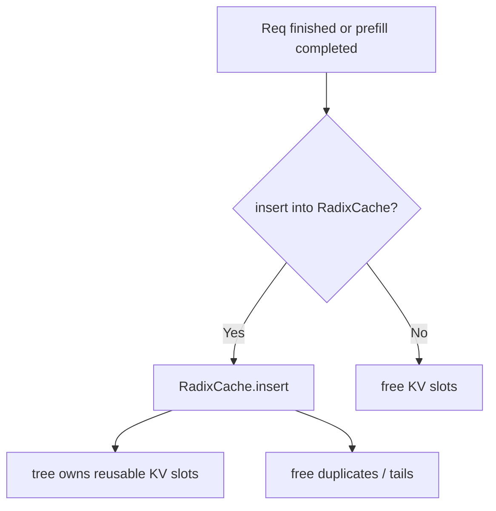

## 10. Eviction：KV 不够时从 tree cache 淘汰

| 文件 | 函数 | 重点代码段 |
|---|---|---|
| `python/sglang/srt/mem_cache/common.py` | `evict_from_tree_cache()` | allocator 空间不足时调用 tree cache eviction。 |
| `python/sglang/srt/mem_cache/radix_cache.py` | `RadixCache.evict()` | 从可淘汰 leaves 中按策略释放 KV slots。 |
| `python/sglang/srt/mem_cache/radix_cache.py` | `RadixCache.inc_lock_ref()` | 请求使用某个 prefix node 时加锁，防止被 evict。 |
| `python/sglang/srt/mem_cache/radix_cache.py` | `RadixCache.dec_lock_ref()` | 请求释放或迁移时解锁。 |
| `python/sglang/srt/mem_cache/radix_cache.py` | `RadixCache._delete_leaf()` / `_update_leaf_status()` | leaf 删除和 evictable 状态维护。 |

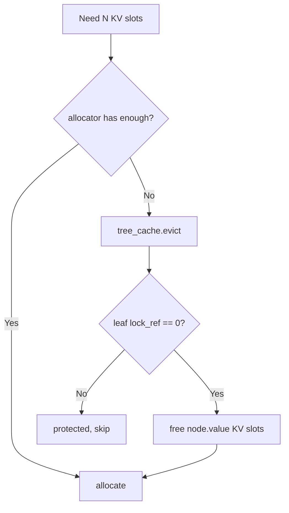

`lock_ref > 0` 的节点不能淘汰，因为它们正在被请求引用。

## 11. HiCache：把 RadixCache 扩展到 host/storage

| 文件 | 类 / 函数 | 重点代码段 |
|---|---|---|
| `python/sglang/srt/mem_cache/registry.py` | `create_tree_cache()` | HiCache 也是从这个入口创建。 |
| `python/sglang/srt/mem_cache/registry.py` | `default_radix_cache_factory()` | 根据 `enable_hierarchical_cache` 等配置选择 HiCache 实现。 |
| `python/sglang/srt/mem_cache/hiradix_cache.py` | `HiRadixCache` 相关类/方法 | 管理 device + host/storage 层级命中。 |
| `python/sglang/srt/mem_cache/hybrid_cache/hybrid_cache_controller.py` | hybrid cache controller 相关类/方法 | 统一管理 hybrid / hierarchical cache 行为。 |
| `python/sglang/srt/managers/schedule_policy.py` | `PrefillAdder.add_one_req()` | host hit 后可能触发 load-back 预算与锁定逻辑。 |
| `python/sglang/srt/managers/schedule_batch.py` | `ScheduleBatch.prepare_for_extend()` | 统计 device/host/storage cached tokens。 |

HiCache 让 `MatchResult` 多了这些意义：

- `device_indices`：GPU 上已经可用的 KV。
- `host_hit_length`：host/cache storage 命中的长度。
- `best_match_node`：可用于发起 host-to-device load-back 的节点。

第一次读可以把 HiCache 理解为：RadixCache 的 value 不只可能在 GPU，也可能在 host/storage；命中后需要搬回 GPU 才能继续 forward。

## 12. 和 Scheduler 的连接点

| 位置 | 具体源码定位 | 做什么 |
|---|---|---|
| `req.init_next_round_input(self.tree_cache)` | `python/sglang/srt/managers/schedule_batch.py` / `Req.init_next_round_input()` | 对请求做 prefix match，算出还要 prefill 的 suffix。 |
| `PrefillAdder.add_one_req(req)` | `python/sglang/srt/managers/schedule_policy.py` / `PrefillAdder.add_one_req()` | 检查 KV/token 预算，锁住命中的 prefix node。 |
| `ScheduleBatch.prepare_for_extend()` | `python/sglang/srt/managers/schedule_batch.py` / `ScheduleBatch.prepare_for_extend()` | 为 prefill suffix 分配 KV slot。 |
| `ScheduleBatch.prepare_for_decode()` | `python/sglang/srt/managers/schedule_batch.py` / `ScheduleBatch.prepare_for_decode()` | 为每个 decode step 分配新 KV slot。 |
| `process_batch_result_prefill()` | `python/sglang/srt/managers/scheduler_components/batch_result_processor.py` / `BatchResultProcessor.process_batch_result_prefill()` | prefill 后把未完成请求缓存起来。 |
| `release_kv_cache()` | `python/sglang/srt/mem_cache/common.py` / `release_kv_cache()` | 请求完成或撤回时释放/插入 KV。 |
| `evict_from_tree_cache()` | `python/sglang/srt/mem_cache/common.py` / `evict_from_tree_cache()` | 空间不足时淘汰可复用但未锁定的 cache。 |

## 这一讲的阅读任务

| 顺序 | 文件 | 函数 / 代码段 |
|---:|---|---|
| 1 | `python/sglang/srt/mem_cache/memory_pool.py` | `ReqToTokenPool`、`ReqToTokenPool.alloc()`、`KVCache.set_kv_buffer()` |
| 2 | `python/sglang/srt/model_executor/model_runner_kv_cache_mixin.py` | `init_memory_pool()`、`_init_pools()` |
| 3 | `python/sglang/srt/mem_cache/kv_cache_builder.py` | `build_kv_cache()`、`KVCacheBuildResult` |
| 4 | `python/sglang/srt/mem_cache/registry.py` | `create_tree_cache()`、`default_radix_cache_factory()` |
| 5 | `python/sglang/srt/mem_cache/radix_cache.py` | `RadixKey`、`TreeNode`、`RadixCache.match_prefix()`、`insert()` |
| 6 | `python/sglang/srt/managers/schedule_batch.py` | `Req.init_next_round_input()`、`ScheduleBatch.prepare_for_extend()` |
| 7 | `python/sglang/srt/mem_cache/common.py` | `alloc_for_extend()`、`write_cache_indices()`、`alloc_for_decode()` |
| 8 | `python/sglang/srt/mem_cache/radix_cache.py` | `cache_unfinished_req()`、`cache_finished_req()`、`evict()` |
| 9 | `python/sglang/srt/mem_cache/radix_cache.py` | `inc_lock_ref()`、`dec_lock_ref()` |

读完后，用自己的话回答：

- `ReqToTokenPool` 和 `TokenToKVPoolAllocator` 分别管什么？
- `RadixCache.match_prefix()` 返回的 `prefix_indices` 是什么？
- 为什么 `prepare_for_extend()` 只需要处理 `fill_ids[len(prefix_indices):]`？
- decode 阶段为什么每轮只分配一个新 KV slot？
- `lock_ref` 为什么能防止正在使用的 prefix 被 evict？
- HiCache 比普通 RadixCache 多了什么？

## 下一讲预告

下一讲进入 `ModelRunner 与 attention backend`：看 `ForwardBatch` 如何被模型层消费，attention backend 如何使用 `ReqToTokenPool` 读取历史 KV，并把新 token 的 KV 写进 cache。
