# 第 3 讲：KV Cache、Radix Cache 与 HiCache

本讲目标：理解 SGLang 如何管理 KV cache，为什么 prefix cache 能减少 prefill 成本，以及 Scheduler 为什么总是在调度前后反复操作 `tree_cache`、`req_to_token_pool`、`token_to_kv_pool_allocator`。

## 一句话总览

SGLang 的 cache 系统可以分成三层：

- `KVCache`：真正保存每层 attention 的 K/V tensor。
- `ReqToTokenPool`：记录“某个请求的第 i 个 token 对应哪个 KV slot”。
- `RadixCache / tree_cache`：用 token 前缀作为 key，记录可复用的 KV slot 序列。

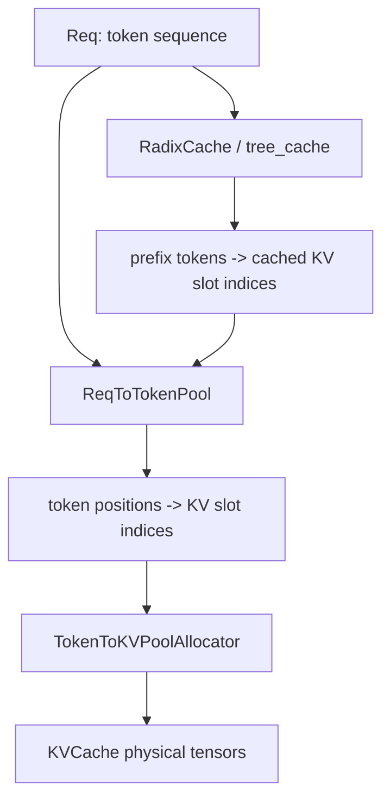

一句更直白的话：**KVCache 放数据，ReqToTokenPool 记地址，RadixCache 负责查前缀能不能复用。**

## 先区分两个问题

读 cache 代码时最容易混淆两个问题：

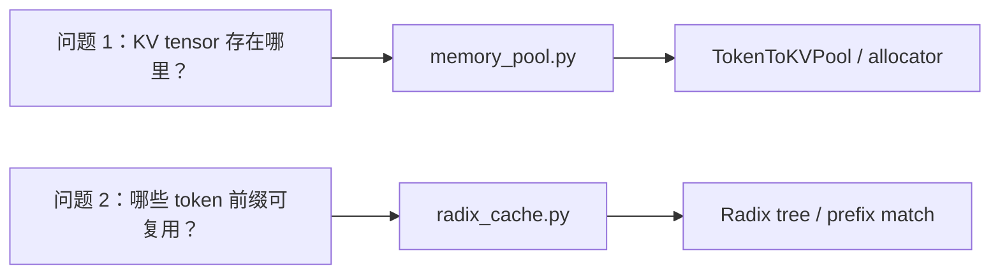

它们互相配合，但不是同一个东西。

## 1. Memory Pool：物理 KV 存储和地址表

源码开头已经写得很清楚：

- `/Users/zach/Source/SGLang/python/sglang/srt/mem_cache/memory_pool.py:15`

SGLang 有两层 memory pool：

- `ReqToTokenPool`：request -> token locations。
- `TokenToKVPoolAllocator`：管理 token location -> physical KV cache。
- `KVCache`：真正持有 K/V tensor。

### ReqToTokenPool

定义在：

- `/Users/zach/Source/SGLang/python/sglang/srt/mem_cache/memory_pool.py:138`

它内部有一个二维表：

```python
req_to_token[req_pool_idx, token_position] = kv_slot_index
```

也就是说，一个请求拿到 `req_pool_idx` 后，它每个 token 的 KV slot 都写在这张表里。

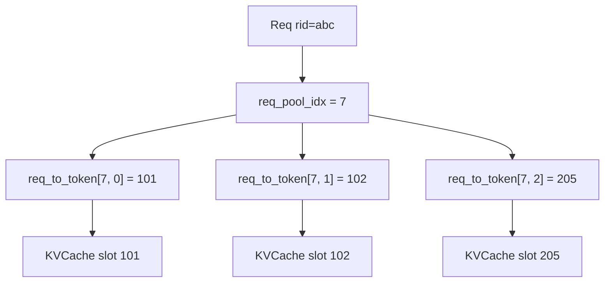

`ReqToTokenPool.alloc` 在：

- `/Users/zach/Source/SGLang/python/sglang/srt/mem_cache/memory_pool.py:170`

它给请求分配 request slot，也就是 `req.req_pool_idx`。

### TokenToKVPoolAllocator

allocator 的具体类很多，例如：

- `TokenToKVPoolAllocator`
- `PagedTokenToKVPoolAllocator`
- `SWATokenToKVPoolAllocator`
- NPU / platform-specific allocator

初始化选择在：

- `/Users/zach/Source/SGLang/python/sglang/srt/model_executor/model_runner_kv_cache_mixin.py:706`

普通情况下：

- `page_size == 1`：使用普通 token allocator。
- `page_size > 1`：使用 paged allocator。
- sliding window / hybrid 模型：使用 SWA 或 hybrid allocator。

第一次读源码只要知道：**allocator 管理 KV slot 的空闲、分配、释放、evict。**

## 2. ModelRunner 初始化 cache

cache 的底层 pool 在 ModelRunner 初始化阶段创建。

入口：

- `/Users/zach/Source/SGLang/python/sglang/srt/model_executor/model_runner_kv_cache_mixin.py:953`

更具体地：

- 初始化 `req_to_token_pool`：`/Users/zach/Source/SGLang/python/sglang/srt/model_executor/model_runner_kv_cache_mixin.py:285`
- 初始化 `token_to_kv_pool`：`/Users/zach/Source/SGLang/python/sglang/srt/model_executor/model_runner_kv_cache_mixin.py:371`
- 初始化 `token_to_kv_pool_allocator`：`/Users/zach/Source/SGLang/python/sglang/srt/model_executor/model_runner_kv_cache_mixin.py:706`

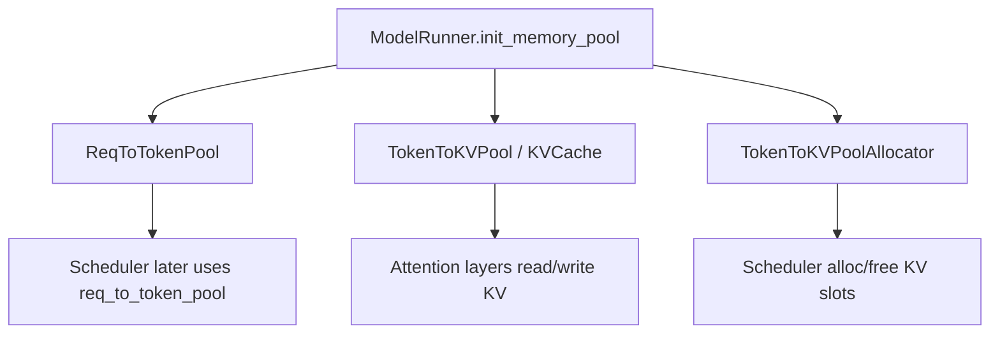

## 3. build_kv_cache：把 pool 和 tree_cache 组装起来

KV cache 构建结果在：

- `/Users/zach/Source/SGLang/python/sglang/srt/mem_cache/kv_cache_builder.py:11`

核心构建函数：

- `/Users/zach/Source/SGLang/python/sglang/srt/mem_cache/kv_cache_builder.py:131`

它会：

1. 从 `tp_worker.get_memory_pool()` 取出底层 pool。
2. 判断是否禁用 radix cache。
3. 构造 `CacheInitParams`。
4. 调用 `create_tree_cache` 创建 `tree_cache`。

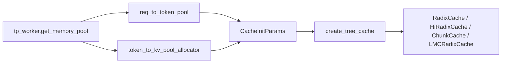

`create_tree_cache` 在：

- `/Users/zach/Source/SGLang/python/sglang/srt/mem_cache/registry.py:166`

默认选择链在：

- `/Users/zach/Source/SGLang/python/sglang/srt/mem_cache/registry.py:77`

常见选择：

- 普通情况：`RadixCache`
- chunked prefill 且禁用 radix：`ChunkCache`
- `enable_hierarchical_cache`：`HiRadixCache` 或 `UnifiedRadixCache.init_hicache`
- SWA 模型：`SWARadixCache`
- Mamba/SSM 模型：`MambaRadixCache`
- LMCache：`LMCRadixCache`

第一次读普通 LLM，可以只看 `RadixCache`。

## 4. RadixCache：prefix -> KV slot indices

核心文件：

- `/Users/zach/Source/SGLang/python/sglang/srt/mem_cache/radix_cache.py:260`

Radix cache 是一棵压缩前缀树。key 是 token ids，value 是这些 token 对应的 KV slot indices。

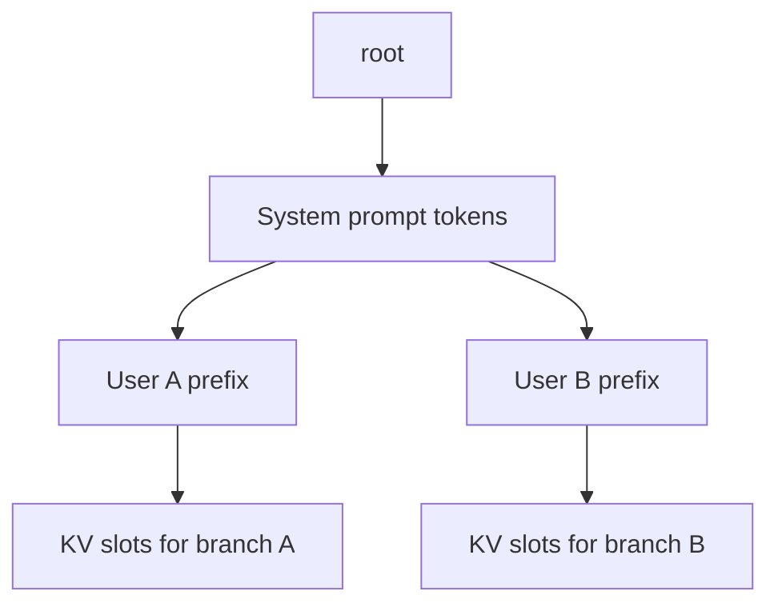

### RadixKey

定义在：

- `/Users/zach/Source/SGLang/python/sglang/srt/mem_cache/radix_cache.py:56`

`RadixKey` 不只包含 token ids，还包含 `extra_key`。这个 `extra_key` 很重要：它可以隔离不同 LoRA、cache salt 或其他不应该共享 KV 的请求。

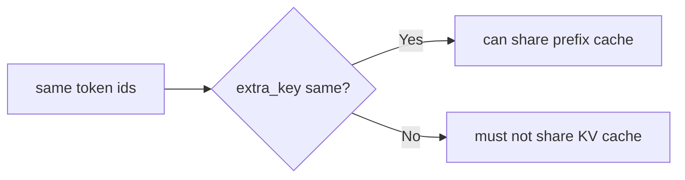

### TreeNode

定义在：

- `/Users/zach/Source/SGLang/python/sglang/srt/mem_cache/radix_cache.py:198`

节点里重要字段：

- `key`：这一段 token prefix。
- `value`：这一段 token 对应的 KV slot indices。
- `children`：后续分支。
- `lock_ref`：是否正在被请求引用，防止被 evict。
- `last_access_time`、`hit_count`、`priority`：用于 eviction 策略。

## 5. Prefix match：请求进入 prefill 前先查 cache

`Req` 里保存 prefix match 结果的字段在：

- `/Users/zach/Source/SGLang/python/sglang/srt/managers/schedule_batch.py:803`

包括：

- `prefix_indices`：命中的 KV slot indices。
- `last_node`：命中的最后一个 device node。
- `last_host_node` / `best_match_node`：HiCache 场景的 host/storage 相关节点。
- `host_hit_length`：host cache 命中的 token 数。
- `cache_protected_len`：已经被 tree cache 保护的长度。

真正做 prefix match 的地方：

- `/Users/zach/Source/SGLang/python/sglang/srt/managers/schedule_batch.py:1044`

关键逻辑：

1. `fill_ids = origin_input_ids + output_ids`
2. 取最多 `input_len - 1` 做 prefix match。
3. 调用 `tree_cache.match_prefix(...)`。
4. 把结果写回 `req.prefix_indices`、`req.last_node` 等字段。
5. `extend_input_len = len(fill_ids) - len(prefix_indices)`。

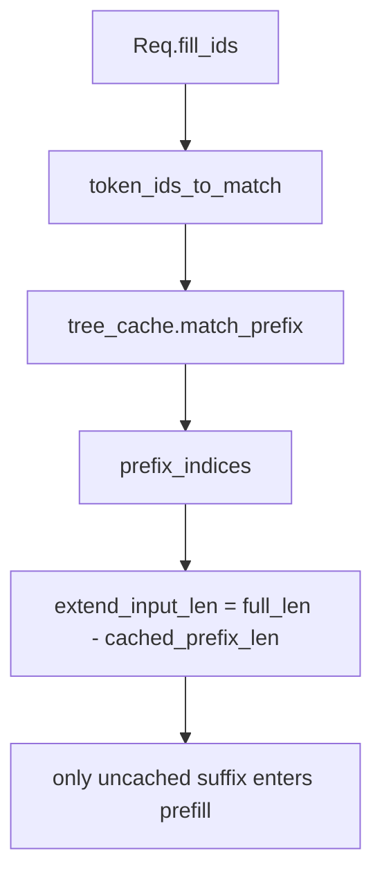

`RadixCache.match_prefix` 在：

- `/Users/zach/Source/SGLang/python/sglang/srt/mem_cache/radix_cache.py:333`

它返回 `MatchResult`，其中 `device_indices` 就是可复用的 KV slot。

## 6. Prefill 分配：只给未命中的 suffix 分配 KV

Scheduler 在组 prefill batch 时，会先调用：

- `/Users/zach/Source/SGLang/python/sglang/srt/managers/scheduler.py:2675`

也就是 `req.init_next_round_input(self.tree_cache)`。这一步决定每个请求到底还需要 prefill 多少 token。

随后 `ScheduleBatch.prepare_for_extend`：

- `/Users/zach/Source/SGLang/python/sglang/srt/managers/schedule_batch.py:1813`

会计算：

- `input_ids = fill_ids[len(prefix_indices):]`
- `extend_num_tokens`
- `prefix_lens`
- `extend_lens`

然后调用：

- `/Users/zach/Source/SGLang/python/sglang/srt/mem_cache/common.py:280`

`alloc_for_extend` 做三件事：

1. 为请求分配 `req_pool_idx`。
2. 为未命中的 extend tokens 分配 KV slots。
3. 把“cached prefix slots + newly allocated suffix slots”写入 `ReqToTokenPool`。

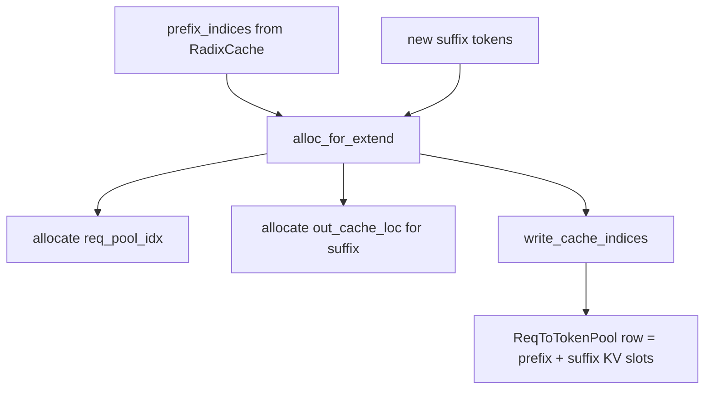

关键代码：

- `alloc_req_slots`：`/Users/zach/Source/SGLang/python/sglang/srt/mem_cache/common.py:249`
- `alloc_for_extend`：`/Users/zach/Source/SGLang/python/sglang/srt/mem_cache/common.py:280`
- `write_cache_indices`：`/Users/zach/Source/SGLang/python/sglang/srt/mem_cache/common.py:62`

## 7. Decode 分配：每轮每个请求追加一个 KV slot

decode 阶段不再做大段 prefix match。它每轮为每个 running request 的新 token 分配一个 KV slot。

入口：

- `/Users/zach/Source/SGLang/python/sglang/srt/managers/schedule_batch.py:2383`

这里调用：

- `/Users/zach/Source/SGLang/python/sglang/srt/mem_cache/common.py:375`

`alloc_for_decode` 做的事：

1. 按 batch size 分配新 token 的 KV slots。
2. 写入 `req_to_token_pool[req_pool_idx, current_seq_len]`。
3. 更新 `seq_lens`、`kv_committed_len`、`kv_allocated_len`。

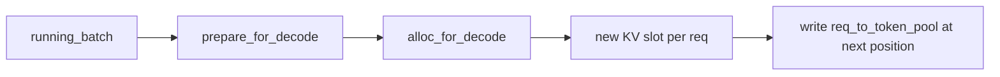

## 8. Forward 时 attention 怎么找到历史 KV

Scheduler 准备好 `ReqToTokenPool` 后，模型前向就能通过 `req_pool_indices` 和 `seq_lens` 找到每个请求的历史 KV。

相关注释在：

- `/Users/zach/Source/SGLang/python/sglang/srt/model_executor/forward_batch_info.py:288`

心智模型：

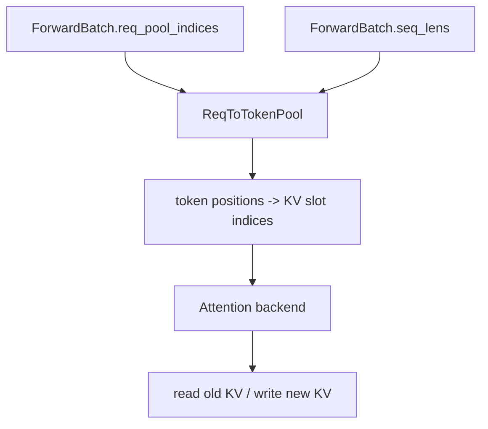

也就是说，模型层不需要知道 Radix tree 怎么长；它只需要知道每个请求的 KV slot 映射。

## 9. 请求结束或中间暂停时，KV 如何回到 RadixCache

### 未完成请求

当 prefill 后请求还没结束，会把已经算出的 prefix 插入 radix cache，供后续复用。

辅助函数：

- `/Users/zach/Source/SGLang/python/sglang/srt/mem_cache/common.py:55`

实际实现：

- `/Users/zach/Source/SGLang/python/sglang/srt/mem_cache/radix_cache.py:460`

`cache_unfinished_req` 会：

1. 用 `req.fill_ids` 构造 `RadixKey`。
2. 从 `ReqToTokenPool` 取出对应 KV slots。
3. 插入 Radix tree。
4. 释放重复的 KV slots。
5. 重新 match prefix，更新 `req.prefix_indices`。
6. 更新 lock ref，保护新命中的 tree node。

### 已完成请求

请求结束时释放或缓存 KV：

- `/Users/zach/Source/SGLang/python/sglang/srt/mem_cache/common.py:418`

它调用：

- `/Users/zach/Source/SGLang/python/sglang/srt/mem_cache/radix_cache.py:413`

`cache_finished_req` 会把完成请求的 KV 插入 Radix tree，或者在禁用 cache 时直接释放。

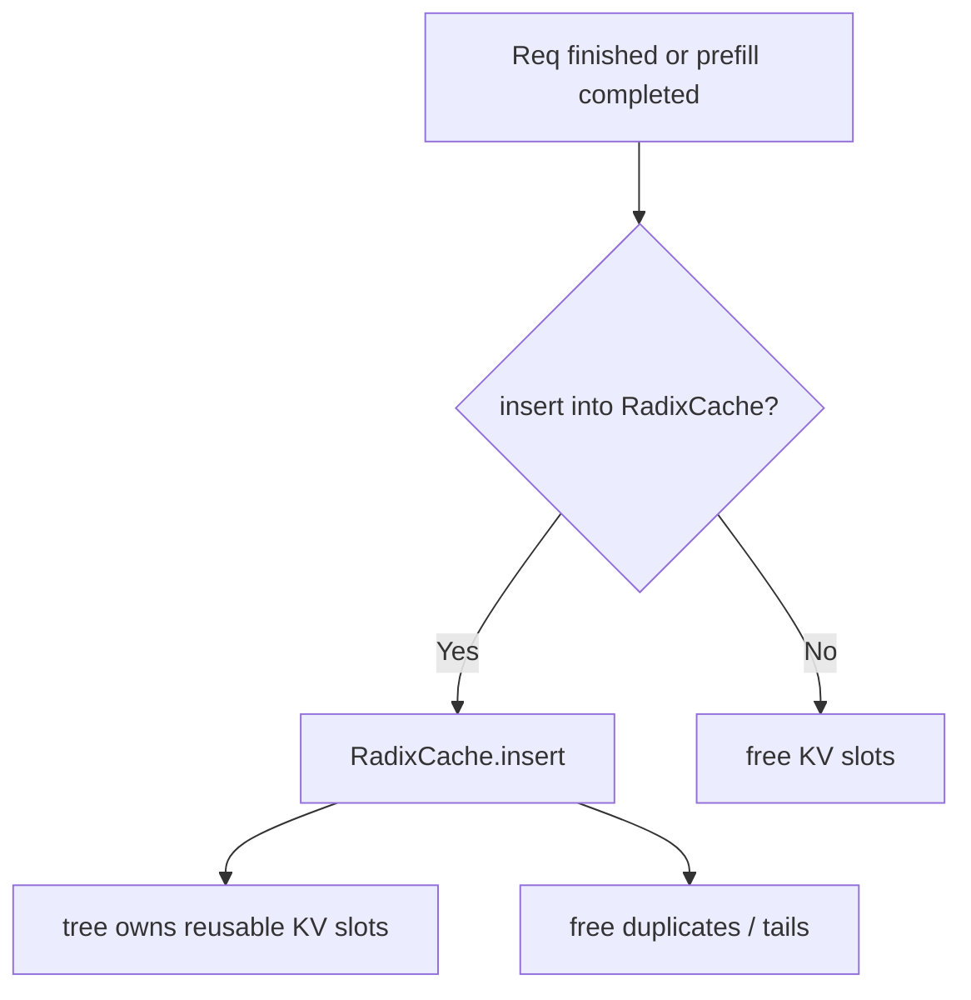

## 10. Eviction：KV 不够时从 tree_cache 淘汰

分配 KV slot 前，SGLang 会尝试从 tree cache 里 evict 可淘汰节点。

入口：

- `/Users/zach/Source/SGLang/python/sglang/srt/mem_cache/common.py:181`

`evict_from_tree_cache` 检查 allocator 可用空间，不够就调用：

- `/Users/zach/Source/SGLang/python/sglang/srt/mem_cache/radix_cache.py:533`

`RadixCache.evict` 会从 `evictable_leaves` 中按策略淘汰 leaf，把对应 KV slots 还给 allocator。

哪些节点不能淘汰？`lock_ref > 0` 的节点。正在被请求使用的 prefix 会被保护。

锁引用：

- 加锁：`/Users/zach/Source/SGLang/python/sglang/srt/mem_cache/radix_cache.py:562`
- 解锁：`/Users/zach/Source/SGLang/python/sglang/srt/mem_cache/radix_cache.py:577`

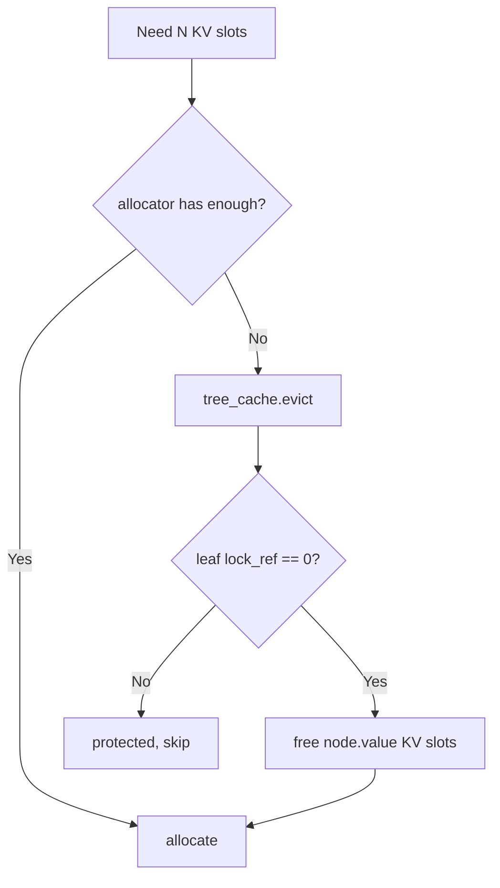

## 11. HiCache：把 RadixCache 扩展到 host/storage

HiCache 是 hierarchical cache。普通 RadixCache 主要管理 GPU 上的 KV；HiCache 会进一步管理 host memory 或 storage backend 中的 KV。

创建入口：

- `/Users/zach/Source/SGLang/python/sglang/srt/mem_cache/registry.py:117`
- `/Users/zach/Source/SGLang/python/sglang/srt/mem_cache/registry.py:124`

实现入口：

- `/Users/zach/Source/SGLang/python/sglang/srt/mem_cache/hiradix_cache.py:72`
- `/Users/zach/Source/SGLang/python/sglang/srt/mem_cache/hybrid_cache/hybrid_cache_controller.py`

HiCache 让 `MatchResult` 多了这些意义：

- `device_indices`：GPU 上已经可用的 KV。
- `host_hit_length`：host/cache storage 命中的长度。
- `best_match_node`：可用于发起 host->device load-back 的节点。

Scheduler 看到 host hit 后，会在 `PrefillAdder` 中触发 load-back：

- `/Users/zach/Source/SGLang/python/sglang/srt/managers/schedule_policy.py:897`

而 `prepare_for_extend` 会统计 device/host/storage cached tokens：

- `/Users/zach/Source/SGLang/python/sglang/srt/managers/schedule_batch.py:1906`

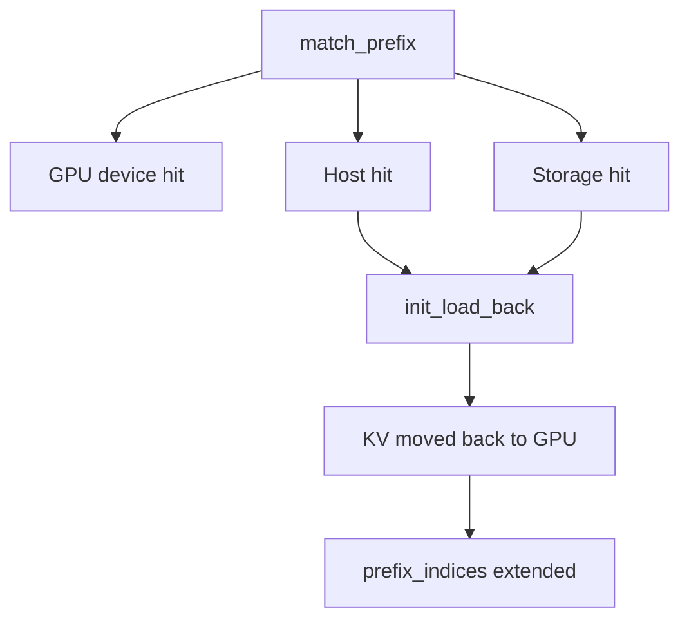

第一次读可以把 HiCache 理解为：**RadixCache 的 value 不只可能在 GPU，也可能在 host/storage；命中后需要异步搬回 GPU。**

## 12. 一次请求里的 cache 生命周期

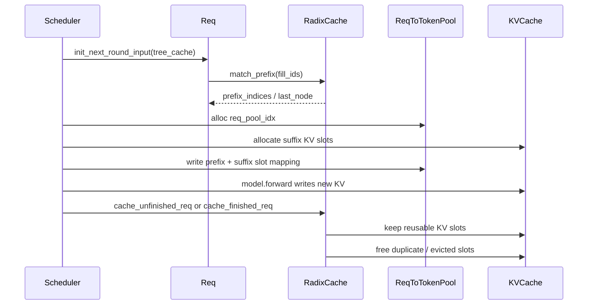

## 13. 和 Scheduler 的连接点

你在 Scheduler 里看到 cache 相关逻辑时，可以这样理解：

| 位置 | 做什么 |
|---|---|
| `req.init_next_round_input(self.tree_cache)` | 对请求做 prefix match，算出还要 prefill 的 suffix |
| `PrefillAdder.add_one_req` | 检查 KV/token 预算，锁住命中的 prefix node |
| `ScheduleBatch.prepare_for_extend` | 为 prefill suffix 分配 KV slot |
| `ScheduleBatch.prepare_for_decode` | 为每个 decode step 分配新 KV slot |
| `process_batch_result_prefill` | prefill 后把未完成请求缓存起来 |
| `release_kv_cache` | 请求完成或撤回时释放/插入 KV |
| `evict_from_tree_cache` | 空间不足时淘汰可复用但未锁定的 cache |

## 14. 第一次阅读时建议忽略的复杂分支

先忽略：

- `MambaRadixCache`
- `SWARadixCache`
- `HiMambaRadixCache`
- `LMCRadixCache`
- `UnifiedRadixCache`
- disaggregation decode 的特殊 req pool
- speculative decoding 的 bigram key
- DSA / DeepSeek V4 compressed KV pool

先专注普通路径：

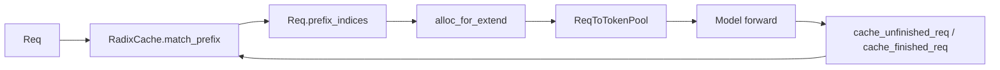

## 这一讲的阅读任务

请按顺序打开：

1. `/Users/zach/Source/SGLang/python/sglang/srt/mem_cache/memory_pool.py:15`
2. `/Users/zach/Source/SGLang/python/sglang/srt/model_executor/model_runner_kv_cache_mixin.py:285`
3. `/Users/zach/Source/SGLang/python/sglang/srt/mem_cache/kv_cache_builder.py:131`
4. `/Users/zach/Source/SGLang/python/sglang/srt/mem_cache/registry.py:77`
5. `/Users/zach/Source/SGLang/python/sglang/srt/mem_cache/radix_cache.py:260`
6. `/Users/zach/Source/SGLang/python/sglang/srt/managers/schedule_batch.py:1044`
7. `/Users/zach/Source/SGLang/python/sglang/srt/mem_cache/common.py:280`
8. `/Users/zach/Source/SGLang/python/sglang/srt/mem_cache/common.py:375`
9. `/Users/zach/Source/SGLang/python/sglang/srt/mem_cache/radix_cache.py:460`
10. `/Users/zach/Source/SGLang/python/sglang/srt/mem_cache/radix_cache.py:533`

读完后，用自己的话回答：

- `ReqToTokenPool` 和 `TokenToKVPoolAllocator` 分别管什么？
- `RadixCache.match_prefix` 返回的 `prefix_indices` 是什么？
- 为什么 `prepare_for_extend` 只需要处理 `fill_ids[len(prefix_indices):]`？
- decode 阶段为什么每轮只分配一个新 KV slot？
- `lock_ref` 为什么能防止正在使用的 prefix 被 evict？
- HiCache 比普通 RadixCache 多了什么？

## 下一讲预告

下一讲建议进入 `ModelRunner 与 attention backend`：看 `ForwardBatch` 如何被模型层消费，attention backend 如何使用 `ReqToTokenPool` 读取历史 KV，并把新 token 的 KV 写进 cache。
