# 第 4 讲：ModelRunner 与 Attention Backend

这一讲接在第 2 讲的 `ScheduleBatch` 和第 3 讲的 KV cache 之后：Scheduler 已经决定“下一批跑什么”，KV cache 已经决定“token 存在哪里”，接下来就要进入真正的模型前向计算。

本讲目标：

- 看懂 `ScheduleBatch -> ForwardBatch` 这个边界为什么存在。
- 看懂 `ModelRunner.forward()` 如何根据 `ForwardMode` 分发到 decode / extend。
- 看懂模型层里的 `RadixAttention` 如何通过 `ForwardContext` 找到当前 attention backend。
- 看懂 attention backend 如何读 `req_to_token_pool`、写 `token_to_kv_pool`，并把输出交回模型。

---

## 0. 一张总图

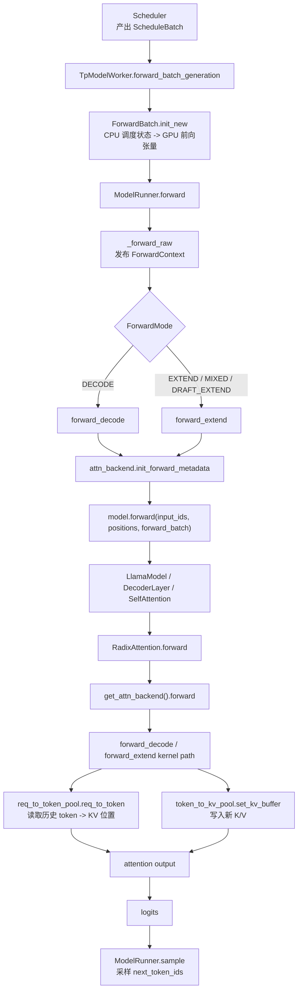

一句话版：

> Scheduler 决定 batch；`ForwardBatch` 把 batch 变成模型前向需要的张量；`ModelRunner` 负责分发和上下文；模型层只算 Q/K/V；attention backend 负责根据 KV cache metadata 跑真正的 attention kernel。

---

## 1. 关键文件跳转表

| 主题 | 文件 | 具体定位 |
|---|---|---|
| worker 入口 | `python/sglang/srt/managers/tp_worker.py` | `TpModelWorker.forward_batch_generation()` |
| 前向 batch 数据结构 | `python/sglang/srt/model_executor/forward_batch_info.py` | `ForwardMode`、`ForwardBatch.init_new()`、`compute_position()`、`compute_position_torch()` |
| 模型执行器 | `python/sglang/srt/model_executor/model_runner.py` | `ModelRunner.forward()`、`_forward_raw()`、`forward_decode()`、`forward_extend()`、`sample()` |
| 前向上下文 | `python/sglang/srt/model_executor/forward_context.py` | `ForwardContext`、`forward_context()`、`get_attn_backend()`、`get_token_to_kv_pool()`、`get_req_to_token_pool()` |
| attention 抽象接口 | `python/sglang/srt/layers/attention/base_attn_backend.py` | `AttentionBackend.forward()`、`forward_decode()`、`forward_extend()` |
| attention 层入口 | `python/sglang/srt/layers/radix_attention.py` | `RadixAttention.forward()`、`unified_attention_with_output()` |
| 一个易读 backend | `python/sglang/srt/layers/attention/torch_flex_backend.py` | `TorchFlexAttnBackend.init_forward_metadata()`、`forward_extend()`、`forward_decode()` |
| Llama 模型示例 | `python/sglang/srt/models/llama.py` | `LlamaForCausalLM.forward()`、`LlamaModel.forward()`、`LlamaAttention.forward()` |

---

## 2. 为什么需要 `ForwardBatch`

在 SGLang 里有一个非常重要的分层：

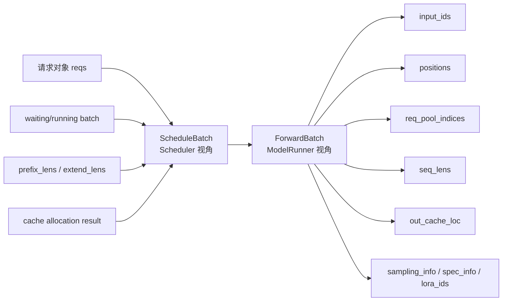

源码在 `forward_batch_info.py` 开头已经直接点明了这个关系：

- `ScheduleBatch` 属于 Scheduler，更多是 CPU 侧的调度状态。
- `ForwardBatch` 属于 ModelRunner，更多是 GPU 前向需要的低层张量。
- `ForwardBatch.init_new()` 是两者之间的转换边界。

你可以把它理解成：

> Scheduler 排好队之后，还不能直接喂给模型；必须打包成模型、attention backend、sampler 都能共同理解的一张“前向执行单”。

---

## 3. `ForwardBatch` 里最值得记的字段

先不要陷入所有字段。读 SGLang 前向路径时，优先记住这几个：

| 字段 | 含义 | 谁最关心 |
|---|---|---|
| `forward_mode` | 当前是 prefill/extend、decode、mixed、idle、spec verify 等哪种前向 | `ModelRunner`、attention backend |
| `input_ids` | 本轮真正送入模型的 token | 模型 embedding |
| `positions` | RoPE / positional embedding 需要的位置 | 模型 attention |
| `req_pool_indices` | 每个请求在 `req_to_token_pool` 里的行号 | attention backend |
| `seq_lens` | 每个请求当前总长度 | attention backend、sampler |
| `out_cache_loc` | 本轮新 token 的 K/V 应该写到 `token_to_kv_pool` 的哪些槽位 | attention backend |
| `extend_prefix_lens` | extend/prefill 时，每个请求已有 prefix 长度 | attention backend |
| `extend_seq_lens` | extend/prefill 时，每个请求本轮扩展 token 数 | attention backend |
| `sampling_info` | temperature、top_p、grammar 等采样参数 | sampler |
| `spec_info` | speculative decoding 相关 metadata | spec 路径、attention backend |

这几个字段刚好把前三讲串起来：

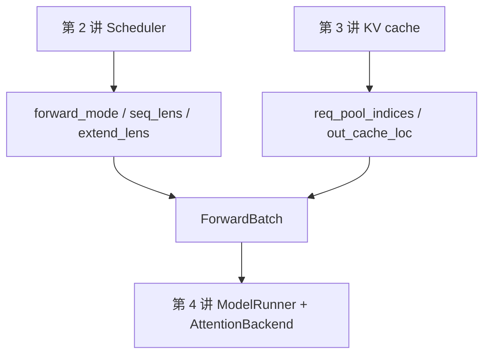

---

## 4. `ForwardBatch.init_new()`：从调度状态变成前向张量

入口在 `TpModelWorker.forward_batch_generation()`：

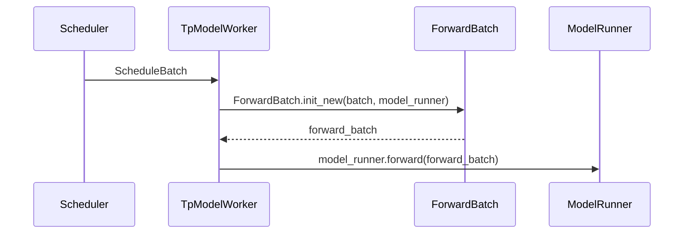

`ForwardBatch.init_new()` 做的事情可以分成四类：

1. **拷贝调度结果**
   - `forward_mode`
   - `input_ids`
   - `req_pool_indices`
   - `seq_lens`
   - `out_cache_loc`

2. **准备 extend/decode 差异字段**
   - decode：通常每个请求只前进一个 token。
   - extend：一个请求可能一次处理多个 suffix token，所以需要 `extend_prefix_lens`、`extend_seq_lens`、`extend_start_loc`。

3. **计算 positions**
   - decode：`positions = seq_lens - 1`，并做 clamp。
   - extend：调用 `compute_position()`，把每个请求的 prefix 长度和 extend 长度展开成 token 级 position。

4. **挂载额外能力 metadata**
   - LoRA：`lora_ids`
   - speculative decoding：`spec_info`
   - multimodal：`mm_inputs`
   - dLLM：特殊 position 逻辑
   - logprob / grammar / sampling：采样相关参数

### extend 的 position 例子

假设一个 batch 有两个请求：

| 请求 | prefix_len | extend_len | positions |
|---|---:|---:|---|
| req A | 5 | 3 | `[5, 6, 7]` |
| req B | 10 | 2 | `[10, 11]` |

那么拼成一个扁平 token batch：

```text
input_ids:  [A5, A6, A7, B10, B11]
positions:  [5,  6,  7,  10,  11]
```

这就是为什么 extend 路径里不只是 batch size，而是还要关心 `extend_num_tokens`。

---

## 5. `ModelRunner.forward()`：真正的模型执行总控

`ModelRunner.forward()` 本身更像一个外壳，负责 profiling、expert recorder、debugger 等外围逻辑。真正的分发在 `_forward_raw()`。

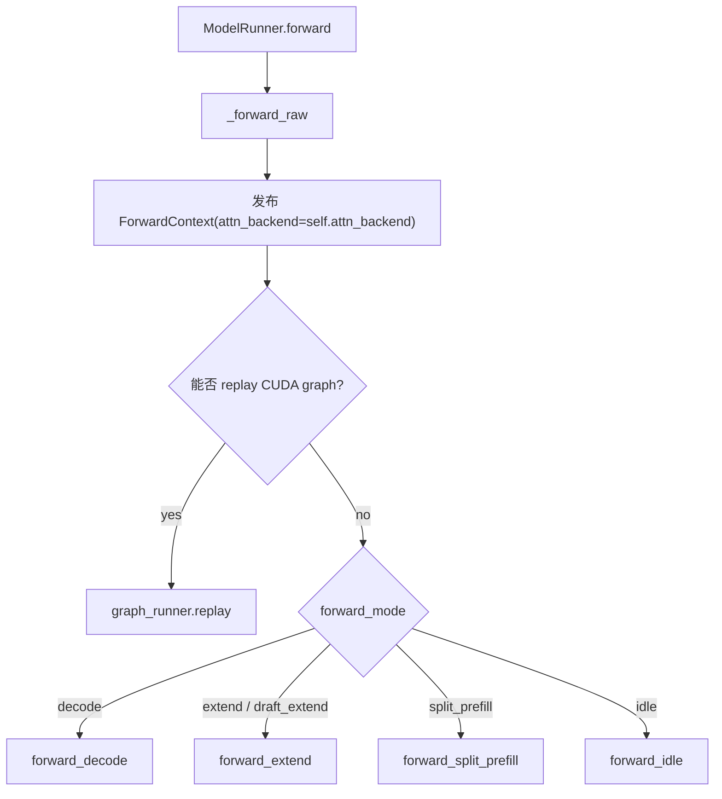

这里最关键的是两个动作：

### 5.1 发布 `ForwardContext`

`_forward_raw()` 会把当前 `attn_backend` 放进 `ForwardContext`。之后模型深处的 attention layer 不需要显式传 backend，只要调用：

```python
get_attn_backend()
```

就能拿到本轮 forward 应该使用的 backend。

这是一种“动态上下文”设计：模型层只关心“我要算 attention”，不用关心这次到底是 FlashInfer、Triton、Torch Flex、MLA、DSA 还是 PDmux 路径。

### 5.2 根据 `ForwardMode` 分发

`ForwardMode` 是这一讲的核心开关：

| mode | 典型含义 | 路径 |
|---|---|---|
| `DECODE` | 每个请求生成下一个 token | `forward_decode()` |
| `EXTEND` | prefill 或处理一段新 token | `forward_extend()` |
| `MIXED` | 混合 prefill/decode，某些 backend 特化支持 | 通常走 extend 类路径 |
| `TARGET_VERIFY` | speculative decoding verify | decode 类路径 |
| `DRAFT_EXTEND` | speculative decoding draft | extend 类路径 |
| `DLLM_EXTEND` | diffusion LLM 特殊 extend | dLLM 分支 |
| `IDLE` | 空跑/同步占位 | `forward_idle()` |

---

## 6. decode 和 extend 的核心差异

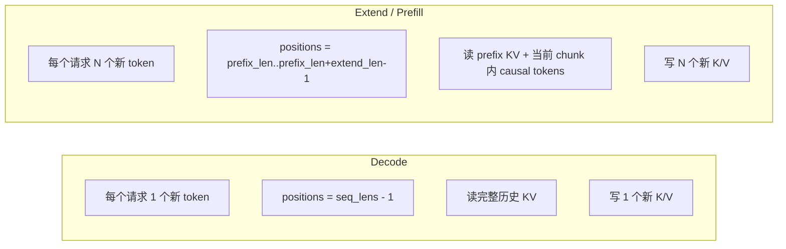

`ModelRunner.forward_decode()` 的关键动作：

1. 可选调用 `model.prepare_forward_batch()`。
2. 调用 `attn_backend.init_forward_metadata(forward_batch)`。
3. 调用 `model.forward(input_ids, positions, forward_batch)`。

`ModelRunner.forward_extend()` 的关键动作：

1. 处理 pipeline parallel、multimodal embedding、embedding model 等额外参数。
2. 判断能不能走 piecewise CUDA graph。
3. 调用 `attn_backend.init_forward_metadata(forward_batch)`。
4. 调用 `model.forward(input_ids, positions, forward_batch)`。

所以 decode/extend 的共同骨架是：

```text
准备 metadata -> 跑模型 forward -> attention backend 在模型层内部被调用
```

---

## 7. 模型层：以 Llama 为例

Llama 的调用链非常适合作为第一条跟读路线：

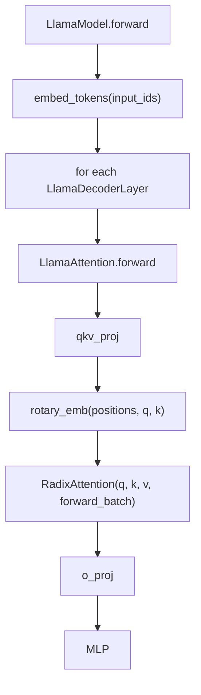

在 `LlamaAttention.forward()` 里，模型层做的是传统 transformer attention 前半段：

1. `qkv_proj(hidden_states)` 得到 Q/K/V。
2. `rotary_emb(positions, q, k)` 给 Q/K 加 RoPE。
3. 调用 `self.attn(q, k, v, forward_batch)`。
4. 对 attention output 做 `o_proj`。

注意：Llama 模型本身并不直接操作 KV cache。KV cache 的读写被藏在 `RadixAttention` 和 attention backend 里。

---

## 8. `RadixAttention`：attention 层的统一入口

`RadixAttention.forward()` 的核心逻辑非常短：

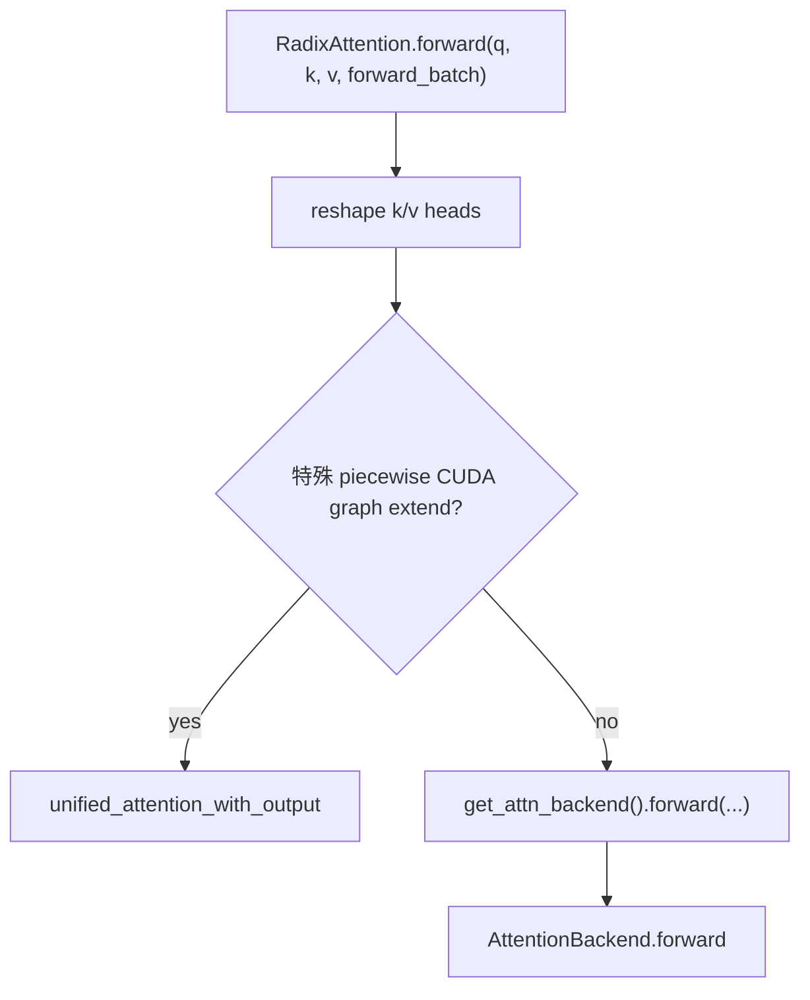

最重要的设计点：

> `RadixAttention` 不是一个固定 kernel；它是模型层和多种 attention backend 之间的适配层。

这也是为什么 SGLang 可以支持很多后端：

- Triton
- FlashInfer
- Torch native / Torch Flex
- MLA / DSA 特化路径
- CUDA graph replay
- PDmux 等多流后端

模型层不用为每种 backend 写一套 transformer block。它只要在 attention 位置调用 `RadixAttention`。

---

## 9. `AttentionBackend.forward()`：按 mode 再分发一次

抽象基类 `AttentionBackend` 的 `forward()` 负责把 attention 请求再按 mode 分发：

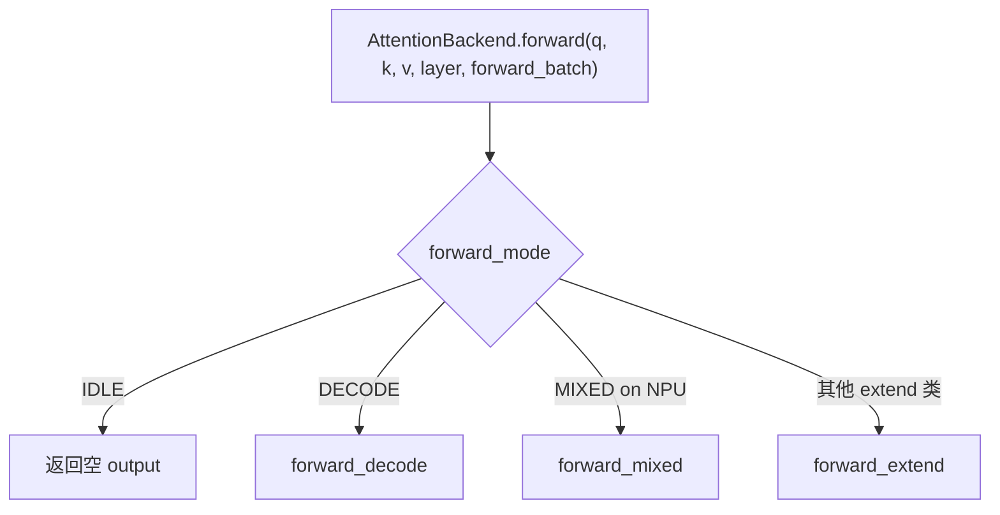

这层分发和 `ModelRunner` 的分发不是重复，而是粒度不同：

- `ModelRunner` 分发的是“整次模型 forward”。
- `AttentionBackend` 分发的是“某一层 attention kernel 怎么跑”。

---

## 10. 一个具体 backend：`TorchFlexAttnBackend`

`TorchFlexAttnBackend` 不一定是生产中最高性能的路径，但它很适合教学，因为代码比高度融合 kernel 更容易看懂。

它初始化时保存两个池：

```text
self.req_to_token_pool = model_runner.req_to_token_pool
self.token_to_kv_pool = model_runner.token_to_kv_pool
```

也就是说，attention backend 天然知道：

- 每个请求的 token 对应哪些 KV 槽位。
- 每一层的 K/V buffer 存在哪里。

### 10.1 写 KV cache

decode 和 extend 都会先把当前层新算出来的 K/V 写入 cache：

```text
token_to_kv_pool.set_kv_buffer(
  layer,
  forward_batch.out_cache_loc,
  k,
  v,
)
```

这里的 `out_cache_loc` 来自 Scheduler / KV allocator，是第 3 讲讲过的“本轮新 token 分配到的物理槽位”。

### 10.2 读历史 KV

backend 跑 attention 时需要这些信息：

```text
token_to_kv_pool.get_key_buffer(layer.layer_id)
token_to_kv_pool.get_value_buffer(layer.layer_id)
req_to_token_pool.req_to_token
forward_batch.req_pool_indices
forward_batch.seq_lens
```

可以把它想成一个二级寻址：

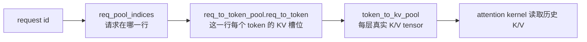

这就是第 3 讲 KV cache 和第 4 讲 attention backend 之间最核心的接口。

---

## 11. decode 路径细读

decode 的特点是：每个请求只追加一个 token。

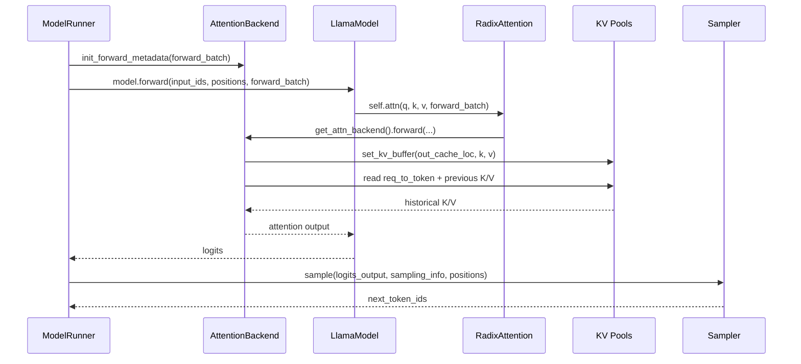

decode 时最值得观察三个字段：

- `seq_lens`：告诉 backend 每个请求历史长度是多少。
- `req_pool_indices`：告诉 backend 每个请求在 page table 的哪一行。
- `out_cache_loc`：告诉 backend 新 token 的 K/V 写到哪里。

### decode 的直觉

```text
对于每个请求：
  Q = 当前新 token 的 query
  K/V = 历史所有 token 的 cached K/V + 当前新 token 的 K/V
  输出 = 当前 token attend 到整个上下文后的 hidden state
```

所以 decode 的计算量主要来自“请求数 × 上下文长度”，而不是输入 token 数，因为输入 token 数基本等于 batch size。

---

## 12. extend / prefill 路径细读

extend 的特点是：一个请求本轮可能有多个新 token。最典型场景是 prefill，也就是用户刚发来 prompt，需要一次性处理一段 prompt tokens。

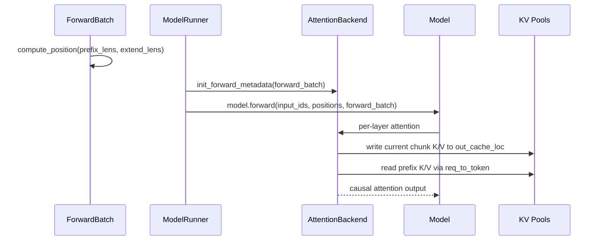

extend 时最值得观察这些字段：

- `extend_prefix_lens`：每个请求已有多少 token 可以复用。
- `extend_seq_lens`：每个请求本轮新增多少 token。
- `extend_start_loc`：每个请求在扁平 `input_ids` 里的起始位置。
- `positions`：每个新 token 在完整上下文里的绝对位置。

### extend 的直觉

```text
对于每个请求：
  prefix 部分可能已经在 KV cache 中
  本轮 extend tokens 会产生新的 K/V
  attention 要保证 causal mask：
    第 i 个新 token 只能看 prefix + 当前 chunk 中 <= i 的 token
```

所以 extend 需要比 decode 更复杂的 metadata：它不是“每个请求 1 个 query”，而是“每个请求一段 query”。

---

## 13. `init_forward_metadata()` 到底在准备什么

不同 backend 的 metadata 不同，但目标相同：

> 把 `ForwardBatch` 里的通用信息，转换成当前 kernel 最喜欢的格式。

可能包括：

- block table / page table
- sequence length tensor
- causal mask / block mask
- prefix 和 extend 的边界
- CUDA graph capture/replay 需要的固定 buffer
- speculative decoding 的 tree mask
- MLA / DSA / sliding window attention 的特化索引

以 `TorchFlexAttnBackend` 为例：

- extend 时为每条 sequence 创建 causal block mask。
- decode 时为每条 sequence 创建 decode block mask。

高性能 backend 也做类似事情，只是会把 metadata 打包成更适合 GPU kernel 的布局。

---

## 14. 采样发生在哪里

模型 forward 只负责输出 logits，真正生成 next token 在 `TpModelWorker.forward_batch_generation()` 的后半段：

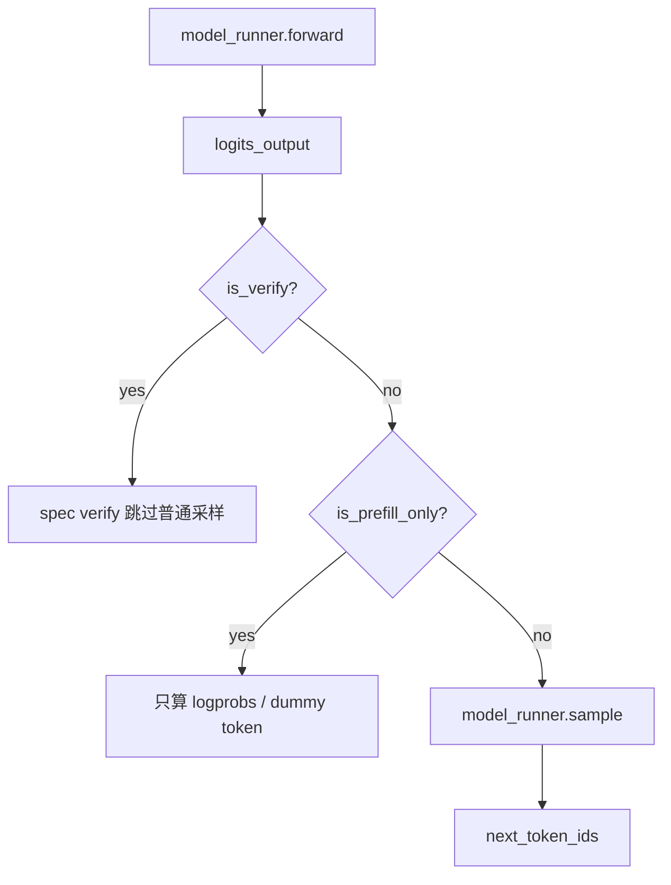

`ModelRunner.sample()` 会使用：

- `logits_output`
- `sampling_info`
- `return_logprob`
- `top_logprobs_nums`
- `token_ids_logprobs`
- decode 时用 `positions`
- prefill/extend 时用 `seq_lens - 1`

这说明一个边界：

> attention backend 负责算 hidden states / logits；sampler 负责从 logits 变成 token。

---

## 15. 和前三讲的连接

到这里，SGLang 的主链路可以重新拼起来：

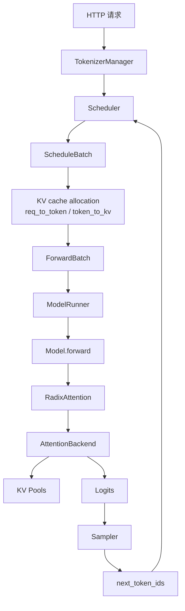

这个循环会不断发生：

1. 新请求先进入 prefill/extend。
2. prefill 结束后请求进入 running batch。
3. 后续每轮 decode 生成一个 token。
4. Scheduler 根据资源、KV cache、结束条件不断更新队列。
5. Detokenizer 把 token 流式发回上层。

---

## 16. 常见困惑

### 16.1 `RadixAttention` 名字里有 Radix，它是不是 Radix Cache？

不是一回事。

- `RadixCache` 是 prefix cache 数据结构，用来复用 prompt prefix。
- `RadixAttention` 是 attention layer 适配器，用来把模型 Q/K/V 转给当前 attention backend。

它们会在 KV cache metadata 上发生联系，但不是同一个类。

### 16.2 为什么不直接在模型里写 attention kernel？

因为 SGLang 要支持很多执行后端和优化：

- 不同硬件
- 不同 attention kernel
- CUDA graph
- speculative decoding
- disaggregation / PDmux
- MLA / DSA / sliding window
- chunked prefill

如果模型层直接绑定某个 kernel，就很难组合这些优化。

### 16.3 为什么 `ModelRunner` 和 `AttentionBackend` 都要根据 mode 分发？

它们管的层级不同：

- `ModelRunner`：决定整次 forward 怎么跑。
- `AttentionBackend`：决定每一层 attention kernel 怎么跑。

### 16.4 `out_cache_loc` 为什么在 forward 前就已经有了？

因为 KV cache 的物理槽位必须在模型计算前分配好。否则 attention backend 不知道本轮新 K/V 应该写到哪里。

这部分由 Scheduler / memory pool 在前一阶段完成。

---

## 17. 本讲阅读任务

按下面顺序打开源码，尝试自己跟读一遍：

| 顺序 | 文件 | 函数 / 代码段 | 阅读重点 |
|---:|---|---|---|
| 1 | `python/sglang/srt/managers/tp_worker.py` | `TpModelWorker.forward_batch_generation()` | 找 `ForwardBatch.init_new()` 调用点；看 `model_runner.forward()` 和 `model_runner.sample()` 的顺序。 |
| 2 | `python/sglang/srt/model_executor/forward_batch_info.py` | `ForwardMode`、`ForwardBatch.init_new()`、`compute_position()` | 看 decode 和 extend 的 position 计算差异，以及 `req_pool_indices`、`seq_lens`、`out_cache_loc` 怎么从 `ScheduleBatch` 来。 |
| 3 | `python/sglang/srt/model_executor/model_runner.py` | `ModelRunner._forward_raw()` | 看它怎么发布 `ForwardContext`，怎么按 `forward_mode` 调 `forward_decode()` / `forward_extend()`。 |
| 4 | `python/sglang/srt/model_executor/model_runner.py` | `ModelRunner.forward_decode()`、`ModelRunner.forward_extend()` | 找 `attn_backend.init_forward_metadata(forward_batch)` 和 `model.forward(...)` 的调用位置。 |
| 5 | `python/sglang/srt/models/llama.py` | `LlamaForCausalLM.forward()`、`LlamaModel.forward()`、`LlamaAttention.forward()` | 看 embedding、decoder layer、Q/K/V、RoPE 和 `self.attn(q, k, v, forward_batch)` 的顺序。 |
| 6 | `python/sglang/srt/layers/radix_attention.py` | `RadixAttention.forward()` | 看如何调用 `get_attn_backend().forward(...)`。 |
| 7 | `python/sglang/srt/layers/attention/base_attn_backend.py` | `AttentionBackend.forward()` | 看 attention backend 如何按 `forward_mode` 分发到 `forward_decode()` / `forward_extend()`。 |
| 8 | `python/sglang/srt/layers/attention/torch_flex_backend.py` | `TorchFlexAttnBackend.forward_decode()`、`forward_extend()` | 找 `token_to_kv_pool.set_kv_buffer()`、`get_key_buffer()`、`get_value_buffer()` 和 `req_to_token_pool.req_to_token`。 |

---

## 18. 你应该带走的心智模型

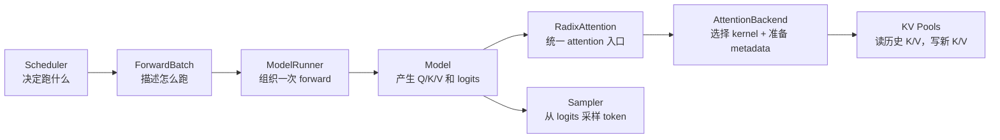

如果你能用自己的话解释下面这句话，就说明这一讲过关了：

> `ForwardBatch` 把 Scheduler 的决定翻译成模型前向需要的张量；`ModelRunner` 发布当前 attention backend 并按 mode 调度；模型层通过 `RadixAttention` 进入 backend；backend 根据 `req_to_token_pool` 找历史 KV，根据 `out_cache_loc` 写新 KV，最后 logits 再交给 sampler 生成下一个 token。

---

## 19. 下一讲预告

下一讲建议进入 **Speculative Decoding**：

- draft worker 和 target worker 分别做什么？
- `spec_info` 如何进入 `ForwardBatch`？
- verify 阶段为什么会跳过普通 sampler？
- tree mask / target verify / draft extend 和普通 decode/extend 有什么关系？

Speculative decoding 会把本讲的 `ForwardMode`、attention metadata、sampling 边界全部串起来，是理解 SGLang 高性能推理的下一块拼图。
