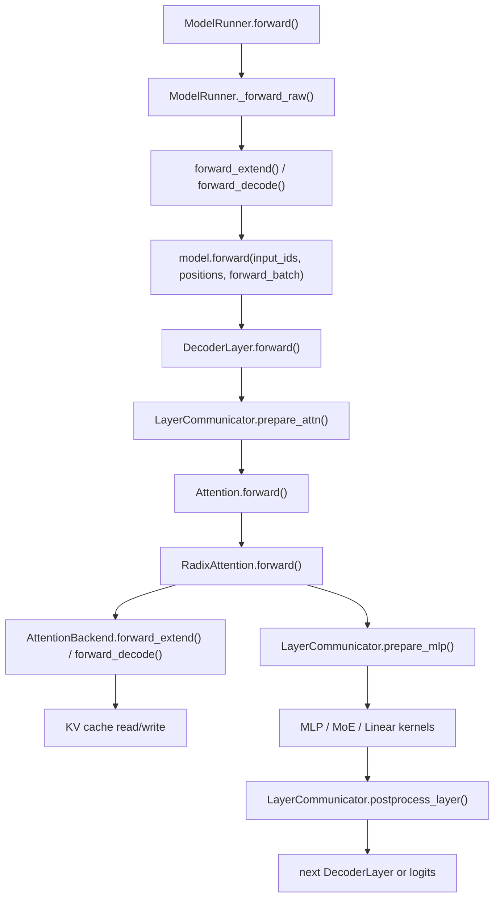

**中文** | [English](./01-layer-communicator-and-common-layers_EN.md)

# Layer 层、LayerCommunicator 与通用算子源码导读

这一讲顺着一个 decoder layer 的执行过程，解释 SGLang 的 layer 层公共组件如何配合：模型层只写 `DecoderLayer.forward()` 的结构，真正和 TP/EP/CP/DP 张量布局、attention backend、MoE dispatch、KV cache 写入相关的逻辑，大多落在 `python/sglang/srt/layers/` 和 `python/sglang/srt/distributed/`。

## 1. Layer 层在整体架构中的位置



读这一层时，最容易混淆的是“模型结构”和“执行布局”。模型结构是 Llama/Qwen/DeepSeek 等文件里的 `DecoderLayer.forward()`；执行布局则由 `LayerCommunicator`、parallel groups、attention backend 和 common layers 共同决定。

## 2. 源码定位总表

| 主题 | 源码定位 | 重点函数/代码段 | 看什么 |
|---|---|---|---|
| 模型调用 layer | `python/sglang/srt/models/llama.py` | `LlamaForCausalLM.forward()`、`LlamaModel.forward()`、`LlamaDecoderLayer.forward()`、`LlamaAttention.forward()` | 一层 decoder 的结构如何调用 common layers |
| Qwen 示例 | `python/sglang/srt/models/qwen2.py` | `Qwen2ForCausalLM.forward()`、`Qwen2Model.forward()`、`Qwen2DecoderLayer.forward()`、`Qwen2Attention.forward()` | 与 Llama 类似的通用模式 |
| layer 通信模式 | `python/sglang/srt/layers/communicator.py` | `LayerScatterModes.init_new()`、`_compute_mlp_mode()`、`_compute_layer_output_mode()` | 每层输入、attention、MLP、输出处于 full/scattered/TP-attn-full 哪种布局 |
| layer 通信执行 | `python/sglang/srt/layers/communicator.py` | `LayerCommunicator.__init__()`、`_post_init_communicate()`、`prepare_attn()`、`prepare_mlp()`、`postprocess_layer()`、`should_use_reduce_scatter()` | 什么时候 all-reduce、all-gather、reduce-scatter、layernorm fusion |
| DSA/CP 特化通信 | `python/sglang/srt/layers/communicator_dsa_cp.py` | `DSACPLayerCommunicator.__init__()`、`_post_init_communicate()`、`_gather_hidden_states_and_residual()`、`_scatter_hidden_states()` | DSA context parallel 场景下如何覆盖默认通信 |
| attention wrapper | `python/sglang/srt/layers/radix_attention.py` | `RadixAttention.forward()`、`unified_attention_with_output()` | QKV 进入 backend 前如何 reshape、如何保存 KV cache、如何走 graph custom op |
| attention backend 接口 | `python/sglang/srt/layers/attention/base_attn_backend.py` | `AttentionBackend.init_forward_metadata()`、`forward()`、`forward_decode()`、`forward_extend()`、`forward_mixed()` | 所有 attention backend 共同需要实现的抽象 |
| FlashInfer backend | `python/sglang/srt/layers/attention/flashinfer_backend.py` | `FlashInferAttnBackend.init_forward_metadata()`、`forward_extend()`、`forward_decode()` | FlashInfer 如何构建 metadata、区分 prefill/decode |
| Triton backend | `python/sglang/srt/layers/attention/triton_backend.py` | `TritonAttnBackend.init_forward_metadata()`、`forward_extend()`、`forward_decode()` | Triton kernel 路径和 metadata 组织 |
| tensor parallel linear | `python/sglang/srt/layers/linear.py` | `ColumnParallelLinear.forward()`、`RowParallelLinear.forward()`、`QKVParallelLinear` | 权重按列/行切分后，输出是否需要 gather/all-reduce |
| MoE router | `python/sglang/srt/layers/moe/router.py` | `FusedMoeRouter.forward()`、`forward_cuda()`、`forward_torch()` | token 到 expert 的 top-k 路由 |
| MoE compute | `python/sglang/srt/layers/moe/fused_moe_triton/layer.py` | `FusedMoE.forward()`、`forward_impl()`、`run_moe_core()` | expert dispatch、专家 GEMM、combine |
| 分布式 group | `python/sglang/srt/distributed/parallel_state.py` | `GroupCoordinator`、`initialize_model_parallel()`、`get_tp_group()`、`get_attn_tp_group()`、`get_attn_cp_group()`、`get_moe_ep_group()`、`get_moe_dp_group()` | layer 通信背后的 rank group |

## 3. DecoderLayer.forward 的阅读模型

不同模型文件写法不完全相同，但典型 decoder layer 都会做这些事：

```text
hidden_states / residual
  -> input layernorm
  -> QKV projection
  -> RoPE / position encoding
  -> RadixAttention.forward()
  -> attention output projection
  -> post-attention layernorm
  -> MLP 或 MoE
  -> residual 合并
```

在没有复杂并行时，这看起来就是普通 Transformer block；但在 SGLang 中，输入张量可能处于 TP 切分、attention TP 切分、context parallel 切分、MoE expert parallel 切分、DP attention padding 等状态。`LayerCommunicator` 的作用就是让每个子模块在它期望的张量布局上执行。

## 4. LayerScatterModes：先决定每个阶段的布局

入口在 `python/sglang/srt/layers/communicator.py` 的 `LayerScatterModes.init_new()`。

它会计算五个布局：

- `layer_input_mode`：进入当前 layer 时 hidden/residual 的布局。
- `attn_mode`：attention 计算期望的布局，当前默认是 `TP_ATTN_FULL`。
- `mlp_mode`：MLP 或 MoE 期望的布局；稀疏 MoE、dense fully-DP、context parallel 会改变它。
- `middle_residual_mode`：attention 后 residual 处于什么布局。
- `layer_output_mode`：当前 layer 输出给下一层时的布局。

关键函数：

- `_compute_layer_input_mode()`：第 0 层输入来自模型输入；其他层输入等于上一层输出。
- `_compute_mlp_mode()`：如果当前层是稀疏 MoE，会根据 MoE A2A backend、cutlass/flashinfer MoE、CP all-gather 等选 `SCATTERED`、`MOE_FULL` 或 `FULL`。
- `_compute_middle_residual_mode()`：保证 attention 输出和 residual 能在 MLP 前对齐。
- `_compute_layer_output_mode()`：如果下一层仍能接受 scattered，就保持 scattered；否则 gather 回 TP-attn-full 或模型输出布局。

读这段时不要急着追所有 enum。先问一个问题：当前层的 MLP/MoE 是想看到“全量 token”还是“本 rank 的切片 token”？

## 5. LayerCommunicator：把布局决策落实成通信

`LayerCommunicator.__init__()` 接收 `LayerScatterModes`、`input_layernorm`、`post_attention_layernorm` 和少量 feature flag，然后调用 `_post_init_communicate()` 预先选好三个通信函数：

1. `self._communicate_simple_fn`：进入 attention 前使用。
2. `self._communicate_with_all_reduce_and_layer_norm_fn`：attention 后、MLP 前使用。
3. `self._communicate_summable_tensor_pair_fn`：MLP/MoE 后、输出给下一层前使用。

这种设计的好处是：模型层不需要在 `DecoderLayer.forward()` 里到处写 if/else 判断 TP/EP/CP；它只需要在固定位置调用：

```text
prepare_attn()
attention()
prepare_mlp()
mlp_or_moe()
postprocess_layer()
```

### 5.1 prepare_attn()

`prepare_attn()` 做四类事：

- 如果 attention TP context 标记输入已 scattered，先调用 `_tp_reduce_scatter()`。
- 执行 input layernorm，并在条件允许时使用 all-reduce + RMSNorm fusion。
- 调 `self._communicate_simple_fn(...)` 把 hidden_states 调整到 attention backend 期望布局。
- 如果有 `qkv_latent_func`，把 attention inputs 暂存到 `get_attn_tp_context()`，供特定 backend 复用。

这里经常出现的通信包括 all-reduce、all-gather、reduce-scatter。具体走哪一个，不在 `prepare_attn()` 里硬编码，而是由 `_communicate_simple_fn` 的选择结果决定。

### 5.2 prepare_mlp()

`prepare_mlp()` 在 attention 之后、MLP/MoE 之前调用。它把 attention 输出和 residual 交给 `_communicate_with_all_reduce_and_layer_norm_fn(...)`：

- attention 输出可能还处于 attention TP 布局，需要合并或重分布。
- residual 需要和 hidden_states 对齐。
- post-attention layernorm 可能和 all-reduce fusion 到一起。
- MoE 层可能希望输入是 scattered，而 dense MLP 可能希望输入是 full。

这一步决定了 MLP/MoE 看到的 token 形态。

### 5.3 postprocess_layer()

`postprocess_layer()` 在 MLP/MoE 后调用。它处理 hidden_states 和 residual 的最终合并，并准备输出给下一层：

- 如果下一层可以接收 scattered，当前层可以避免 gather。
- 如果当前层是最后一层，需要回到模型输出布局。
- 如果启用了 reduce-scatter 优化，`should_use_reduce_scatter()` 会判断是否能把 all-reduce 拆成 reduce-scatter。
- DSA CP、MLA CP、DP reduce-scatterv、TBO 等特性都会影响这里。

这一段是 layer 层性能优化最集中的位置之一，因为它决定了通信量和下一层输入布局。

## 6. Attention：RadixAttention 到 backend

模型里的 attention module 通常先做 QKV projection 和 RoPE，然后调用 `RadixAttention.forward()`。

`python/sglang/srt/layers/radix_attention.py` 的 `RadixAttention.forward()` 负责：

- 把 `k`、`v` reshape 成当前 TP rank 的 head 形态。
- 判断是否处于 extend 且存在 `ForwardContext`，如果是，走 `unified_attention_with_output()` 这类 graph-friendly 路径。
- 否则调用 `get_attn_backend().forward(q, k, v, self, forward_batch, save_kv_cache, **kwargs)`。

真正 kernel 路径由 backend 决定。共同抽象在 `attention/base_attn_backend.py`：

- `init_forward_metadata(forward_batch)`：每次 forward 前准备 backend metadata，比如 page table、seq_lens、start_loc、indices。
- `forward_extend(...)`：prefill/extend 路径，通常一次处理多个新 token。
- `forward_decode(...)`：decode 路径，通常每个 request 一个新 token，但 batch 很大。
- `forward_mixed(...)`：部分 backend 支持 mixed prefill/decode。

FlashInfer 和 Triton backend 都实现这套接口，只是 metadata 形态和 kernel 调用不同。

## 7. Linear：ColumnParallel 与 RowParallel

`python/sglang/srt/layers/linear.py` 是 TP 模型最常见的公共层。

### 7.1 ColumnParallelLinear

`ColumnParallelLinear.forward()` 的直觉是：

```text
输入 X 在各 rank 一样
权重 W 按输出维度切分
每个 rank 算一段 Y
必要时 gather 输出
```

它常用于 QKV projection、gate/up projection 等输出维度可切分的地方。读代码时看两个点：

- 当前 layer 是否要求 gather output。
- quantization method 是否替换了默认 matmul。

### 7.2 RowParallelLinear

`RowParallelLinear.forward()` 的直觉是：

```text
输入 X 按 hidden/input 维度切分
权重 W 按输入维度切分
每个 rank 算 partial output
必要时 all-reduce 合并
```

它常用于 attention output projection、down projection。读代码时重点看 `skip_all_reduce` 和 `forward_batch`，因为 layer communicator 或融合路径可能已经接管通信。

## 8. MoE：router、dispatch、expert compute、combine

MoE 层可以分成三段：

1. 路由：`python/sglang/srt/layers/moe/router.py` 的 `FusedMoeRouter.forward()` 计算每个 token 的 top-k expert。
2. dispatch/compute/combine：`python/sglang/srt/layers/moe/fused_moe_triton/layer.py` 的 `FusedMoE.forward()`、`forward_impl()`、`run_moe_core()`。
3. 分布式专家并行：token dispatcher、EP group、MoE DP group、A2A backend 决定 token 如何跨 rank 发给 expert。

MoE 和 `LayerCommunicator` 的关系是：如果 MoE 层希望输入 scattered，就不应该在 MLP 前过早 gather；如果 expert parallel 需要 A2A，则 token dispatch/combine 可能由 MoE 内部完成，而不是 `LayerCommunicator` 完成。

## 9. 分布式 group 如何支撑 layer

`python/sglang/srt/distributed/parallel_state.py` 中的 `initialize_model_parallel()` 创建多个 group：

```text
world group
  -> tp group
  -> pp group
  -> attention tp group
  -> attention cp group
  -> moe ep group
  -> moe dp group
  -> moe tp group
```

`GroupCoordinator` 包装每个 process group，并提供统一通信接口：

- `all_reduce()`
- `reduce_scatter_tensor()`
- `all_gather_into_tensor()`
- `broadcast_object()`
- `send_tensor_dict()` / `recv_tensor_dict()`
- `barrier()`

Layer 层通常不会自己构造 process group，而是通过 `get_tp_group()`、`get_attn_tp_group()`、`get_attn_cp_group()`、`get_moe_ep_group()` 等函数拿到当前 rank 所属 group。这样模型代码可以在 CUDA、ROCm、NPU、XPU 等 backend 下复用同一套 layer 抽象。

## 10. 一次 DecoderLayer 的源码走读顺序

建议你按下面顺序读代码：

1. 打开 `python/sglang/srt/models/llama.py` 或 `python/sglang/srt/models/qwen2.py`，找到 `DecoderLayer.forward()`。
2. 看它在哪里做 input layernorm、attention、post-attention layernorm、MLP/MoE。
3. 如果模型使用 `LayerCommunicator`，跳到 `layers/communicator.py` 的 `prepare_attn()`，理解进入 attention 前的通信。
4. 回到模型 attention，进入 `LlamaAttention.forward()` 或 `Qwen2Attention.forward()`，看 QKV projection 和 RoPE。
5. 进入 `layers/radix_attention.py` 的 `RadixAttention.forward()`，看 attention backend 的调用边界。
6. 进入具体 backend 的 `init_forward_metadata()` 和 `forward_extend()` / `forward_decode()`。
7. 回到 `LayerCommunicator.prepare_mlp()`，看 attention 输出如何进入 MLP/MoE。
8. 如果是 dense MLP，读 `linear.py` 的 `ColumnParallelLinear.forward()` / `RowParallelLinear.forward()`。
9. 如果是 MoE，读 `moe/router.py` 的 `FusedMoeRouter.forward()` 和 `moe/fused_moe_triton/layer.py` 的 `FusedMoE.forward()`。
10. 最后回到 `LayerCommunicator.postprocess_layer()`，看输出如何交给下一层。

## 11. 常见阅读误区

- 不要一开始就钻进某个 attention backend 的 kernel。先确认 `ForwardBatch` 里有哪些 metadata，以及 backend 是 decode 还是 extend。
- 不要把 TP 和 attention TP 混为一谈。普通 TP group 用于模型权重切分，attention TP/CP 可能是为了长上下文或 attention 专门重新分组。
- 不要把 MoE router 和 HTTP router 混淆。`FusedMoeRouter` 是 token -> expert 的模型层路由；`sgl-router` 是请求 -> worker 的 serving 层路由。
- 不要只看模型文件。SGLang 的性能关键经常在 common layers、communicator、KV cache 和 backend metadata。

## 12. 和前后章节的衔接

- 上一层：`ModelRunner.forward()` 如何进入模型层，见 [04-model-execution/04-model-runner-attention.md](../04-model-execution/04-model-runner-attention.md)。
- 同层总览：公共组件全景，见 [00-overview/01-public-components-code-walkthrough.md](../00-overview/01-public-components-code-walkthrough.md)。
- 下一层：KV cache 的 slot/page 与 prefix cache，见 [03-cache-memory/03-kv-cache-radix-cache.md](../03-cache-memory/03-kv-cache-radix-cache.md)。
