# 第 5 讲：Speculative Decoding

这一讲接在第 4 讲的 `ModelRunner` 与 attention backend 之后。前面我们已经知道普通 decode 每轮通常只为每个请求生成 1 个 token；Speculative Decoding 要解决的问题是：**能不能先用便宜的 draft 路径猜多个 token，再用 target 模型一次性验证，从而减少昂贵 target forward 的次数？**

本讲目标：

- 看懂 SGLang 里 speculative decoding 的整体架构：target worker、draft worker、`spec_info`、verify。
- 看懂 `ForwardMode.TARGET_VERIFY`、`DRAFT_EXTEND`、`DRAFT_EXTEND_V2` 与普通 decode/extend 的关系。
- 看懂 EAGLE/EAGLE3、Standalone、NGRAM、DFLASH 等算法如何通过统一接口接入。
- 看懂 spec v1 和 spec v2 的差异，尤其是 overlap 模式下为什么 `next_draft_input`、`accept_lens`、`future_map` 很重要。
- 看懂被接受 token 如何回写到 `Req.output_ids`、KV cache 和指标里。

---

## 0. 一张总图

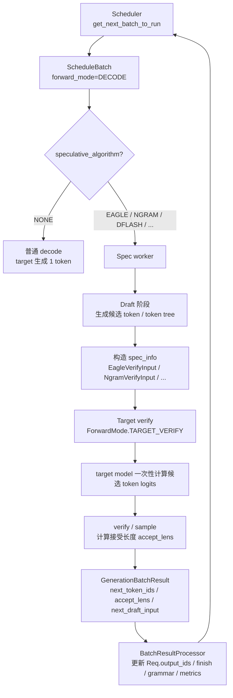

一句话版：

> Speculative decoding 把一次 decode 拆成 “draft 猜多个候选 token” 和 “target 一次性验证候选 token”。如果 draft 猜得准，一次 target forward 可以接受多个 token；如果猜错，也至少接受 target 校验出的 bonus token，保证输出分布仍由 target 模型决定。

---

## 1. 关键文件跳转表

| 主题 | 文件 | 具体定位 |
|---|---|---|
| speculative 算法枚举与工厂 | `python/sglang/srt/speculative/spec_info.py` | `SpeculativeAlgorithm`、`SpecInputType`、`SpecInput` |
| 插件式算法注册 | `python/sglang/srt/speculative/spec_registry.py` | `CustomSpecAlgo`、`register_algorithm()`、`get_spec()` |
| spec worker 抽象接口 | `python/sglang/srt/speculative/base_spec_worker.py` | `BaseDraftWorker`、`BaseSpecWorker` |
| Scheduler 创建 draft worker | `python/sglang/srt/managers/scheduler.py` | `Scheduler.maybe_init_draft_worker()`、`Scheduler.init_model_worker()` |
| Scheduler overlap / spec v2 | `python/sglang/srt/managers/scheduler.py` | `Scheduler.run_batch()`、`_overlap_forward_isolation()`、`launch_batch_sample_if_needed()` |
| target worker 前向入口 | `python/sglang/srt/managers/tp_worker.py` | `TpModelWorker.forward_batch_generation()` |
| Forward mode 定义 | `python/sglang/srt/model_executor/forward_batch_info.py` | `ForwardMode.TARGET_VERIFY`、`DRAFT_EXTEND`、`DRAFT_EXTEND_V2` |
| batch 是否走 spec v2 | `python/sglang/srt/managers/schedule_batch.py` | `ScheduleBatch.is_spec_v2`、`prepare_for_decode()` |
| EAGLE v2 draft/verify | `python/sglang/srt/speculative/eagle_worker_v2.py` | `EagleDraftWorker.draft()`、`draft_forward()`、`EAGLEWorkerV2.verify()` |
| EAGLE verify input | `python/sglang/srt/speculative/eagle_info.py` | `EagleVerifyInput.prepare_for_verify()`、`verify()`、`sample()` |
| EAGLE v2 spec_info mixin | `python/sglang/srt/speculative/eagle_info_v2.py` | `prepare_for_v2_draft()`、`prepare_for_v2_verify()` |
| NGRAM speculative | `python/sglang/srt/speculative/ngram_worker.py` | `_prepare_draft_tokens()`、`_prepare_for_speculative_decoding()` |
| NGRAM verify input | `python/sglang/srt/speculative/ngram_info.py` | `NgramVerifyInput.prepare_for_verify()`、`verify()` |
| 结果结构 | `python/sglang/srt/managers/utils.py` | `GenerationBatchResult.next_draft_input`、`accept_lens`、`speculative_num_draft_tokens` |
| 结果处理 | `python/sglang/srt/managers/scheduler_components/batch_result_processor.py` | `_resolve_spec_overlap_tokens()`、`process_batch_result_decode()` |
| adaptive spec | `python/sglang/srt/speculative/adaptive_spec_params.py` | `AdaptiveSpeculativeParams.update()` |

---

## 2. 先理解算法角色：target、draft、verify

Speculative decoding 里有三个角色：

| 角色 | 做什么 | 在 SGLang 里的典型对象 |
|---|---|---|
| target model | 原始大模型，负责最终分布正确性 | `TpModelWorker` / `ModelRunner` |
| draft model / draft path | 更便宜地提出候选 token | `EagleDraftWorker`、`NGRAMWorker`、`DFlashWorker` 等 |
| verify | 用 target 一次性检查候选 token 是否可接受 | `EagleVerifyInput`、`NgramVerifyInput`、`DFlashVerifyInput` |

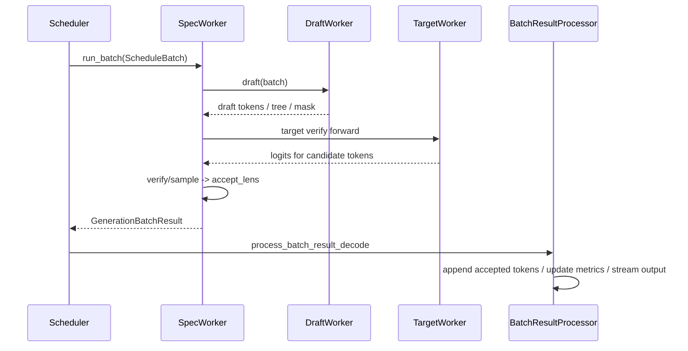

这里最容易误解的一点是：**draft 只负责提出候选，最终接受哪些 token 仍然由 target logits 决定。** 这也是 speculative decoding 可以保持目标模型输出分布正确的原因。

---

## 3. `SpeculativeAlgorithm`：统一入口

源码位置：`python/sglang/srt/speculative/spec_info.py:SpeculativeAlgorithm`

SGLang 支持的内置算法包括：

| 算法 | 典型含义 |
|---|---|
| `EAGLE` / `EAGLE3` | 用 draft model 或 EAGLE head 基于 hidden states 预测候选 token tree |
| `FROZEN_KV_MTP` | MTP 风格的 draft/verify 变体 |
| `STANDALONE` | 独立 draft model |
| `NGRAM` | 基于 ngram corpus 匹配候选 token，不需要神经 draft 模型 |
| `DFLASH` | DFlash speculative 路径 |
| `NONE` | 不启用 speculative decoding |

`SpeculativeAlgorithm.from_string()` 把 server args 里的字符串转成算法对象。之后 Scheduler、ModelRunner、CUDA graph、attention backend 都不直接看字符串，而是调用：

- `is_none()`
- `is_speculative()`
- `is_eagle()`
- `is_ngram()`
- `is_dflash()`
- `supports_spec_v2()`
- `create_worker()`

### 为什么要有 `create_worker()`

`create_worker()` 是算法到 worker 类的工厂：

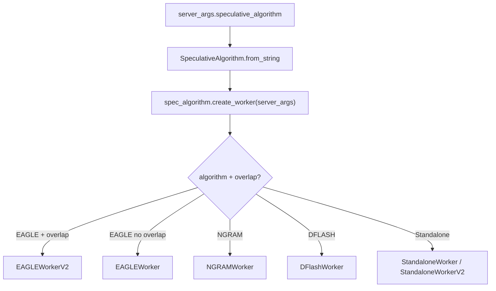

这让 Scheduler 不需要知道每个算法的类名，只要问 `spec_algorithm` 创建什么 worker。

---

## 4. Scheduler 如何接入 speculative decoding

关键入口：

| 文件 | 函数 | 作用 |
|---|---|---|
| `scheduler.py` | `Scheduler.maybe_init_draft_worker()` | 如果启用 speculative，创建 draft/spec worker |
| `scheduler.py` | `Scheduler.init_model_worker()` | 普通模式 `model_worker = tp_worker`；spec 模式 `model_worker = draft_worker` |
| `scheduler.py` | `Scheduler.run_batch()` | 后续执行 batch 时统一调用 `self.model_worker.forward_batch_generation()` |

流程如下：

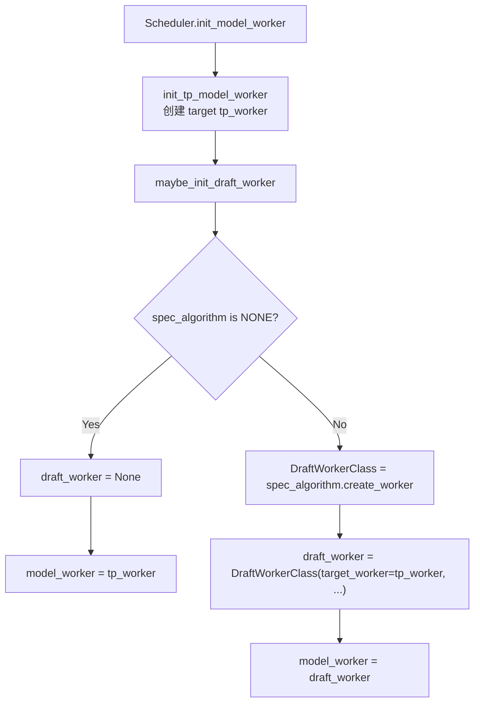

这一步非常关键：开启 speculative 后，Scheduler 的 `self.model_worker` 不再是普通 `TpModelWorker`，而是一个 spec worker。这个 spec worker 内部再持有：

- `target_worker`：原始大模型 worker。
- `draft_worker` 或 draft runner：提出候选 token。

所以 Scheduler 主循环不用大改，它仍然做：

```python
batch = self.get_next_batch_to_run()
result = self.run_batch(batch)
self.process_batch_result(batch, result)
```

只是 `run_batch()` 里调用的 worker 变成了 spec worker。

---

## 5. `ForwardMode` 中的 spec 模式

源码位置：`python/sglang/srt/model_executor/forward_batch_info.py:ForwardMode`

普通生成主要用：

- `EXTEND`：prefill / extend prompt。
- `DECODE`：每轮生成 token。
- `MIXED`：chunked prefill 场景中 prefill 与 decode 混合。

Speculative decoding 增加了这些 mode：

| mode | 谁用 | 含义 |
|---|---|---|
| `TARGET_VERIFY` | target model | target 一次性验证 draft 候选 token |
| `DRAFT_EXTEND` | draft model | draft 模型执行 extend |
| `DRAFT_EXTEND_V2` | spec v2 draft path | v2 中固定 shape / overlap 友好的 draft extend |

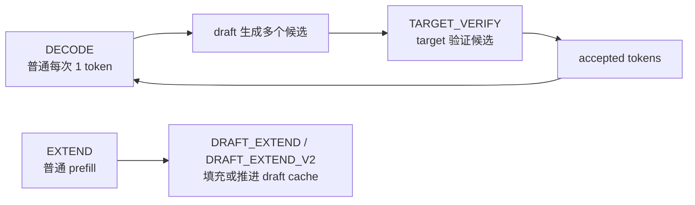

注意 `ForwardMode.is_extend()` 会把 `TARGET_VERIFY` 也视为 extend 类路径。这是因为 target verify 本质上是在同一请求后面追加多个候选 token，并用 attention mask / tree mask 控制候选之间的可见关系；它不像普通 decode 那样每个请求只输入 1 个 token。

---

## 6. Spec v1 与 Spec v2 的差异

源码定位：

- `schedule_batch.py:ScheduleBatch.is_spec_v2`
- `scheduler.py:Scheduler._overlap_forward_isolation()`
- `scheduler.py:Scheduler.run_batch()`
- `batch_result_processor.py:process_batch_result_decode()`

SGLang 里可以粗略分成两代路径：

| 维度 | spec v1 | spec v2 |
|---|---|---|
| 常见条件 | 非 overlap 路径 | overlap schedule 开启且算法支持 `supports_spec_v2()` |
| batch 标记 | `batch.spec_algorithm` 非 NONE，但 `batch.is_spec_v2 == False` | `batch.enable_overlap and spec_algorithm != NONE` |
| 输出处理 | verify 阶段内部可能直接更新 `Req.output_ids`、finish、grammar | worker 返回 `next_token_ids + accept_lens`，由普通 decode 后处理统一更新 |
| Scheduler 负担 | 更接近 worker 内部自包含 | 需要 `future_map`、`next_draft_input`、batch 字段隔离 |
| overlap 支持 | 弱 | 重点支持 |

spec v2 的设计目标是让 speculative decoding 与 overlap schedule 更自然地结合：

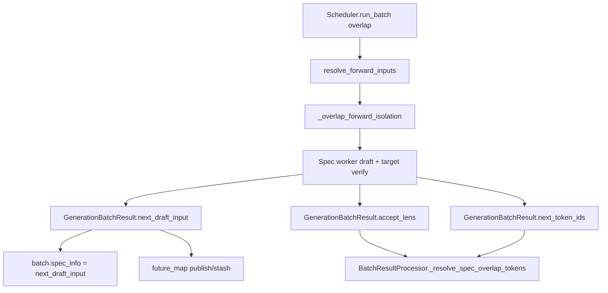

`_overlap_forward_isolation()` 的存在也和 spec v2 有关：v2 worker 在 forward 过程中会重绑或修改 `ScheduleBatch` 的一些字段，比如 `input_ids`、`seq_lens`、`spec_info`。Scheduler 需要在 forward 后恢复调度侧视图，避免下一轮调度读到被 worker 临时改过的状态。

---

## 7. EAGLE v2：draft 阶段

核心文件：

- `python/sglang/srt/speculative/eagle_worker_v2.py`
- `python/sglang/srt/speculative/eagle_info.py`
- `python/sglang/srt/speculative/eagle_info_v2.py`

EAGLE v2 的 draft 阶段入口是：

| 文件 | 函数 | 作用 |
|---|---|---|
| `eagle_worker_v2.py` | `EagleDraftWorker.draft()` | 准备 draft forward，生成候选树，并返回 `EagleVerifyInput` |
| `eagle_worker_v2.py` | `EagleDraftWorker.draft_forward()` | 多步 draft forward，每一步选择 top-k token |
| `eagle_info_v2.py` | `EagleDraftInputV2Mixin.prepare_for_v2_draft()` | 把 batch 转换成 draft forward 需要的 `ForwardBatch` |
| `eagle_utils.py` | `build_tree_kernel_efficient()` | 根据 draft 结果构造 verify 所需 tree mask、positions、retrieve index |

流程：

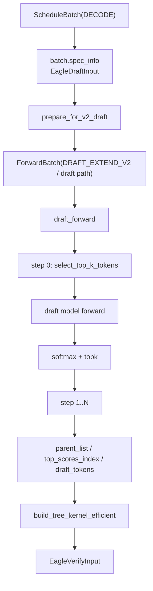

`draft_forward()` 每一步做的事情可以理解成：

1. 从上一轮 hidden states / logits 中选 top-k token。
2. 把选出的 token 作为 draft 模型下一步输入。
3. 跑 draft model forward。
4. 再从 draft logits 中选 top-k。
5. 记录 token、score、parent，最后组织成一棵候选树。

### top-k 与 tree

如果 `topk=1`，候选结构退化成一条链：

```text
t1 -> t2 -> t3 -> ...
```

如果 `topk>1`，候选会变成树：

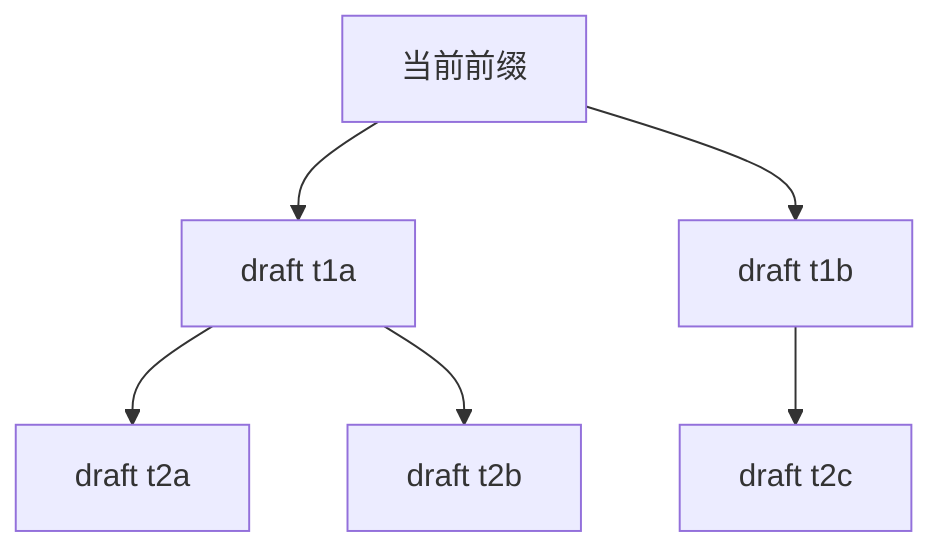

target verify 不能让候选 token 互相随便看见，所以需要 tree mask。

---

## 8. EAGLE v2：target verify 阶段

核心入口：`python/sglang/srt/speculative/eagle_worker_v2.py:EAGLEWorkerV2.verify()`

这个函数做了三件大事：

1. 把 draft 阶段得到的 `EagleVerifyInput` 转成 target verify `ForwardBatch`。
2. 调用 target worker 做一次 `ForwardMode.TARGET_VERIFY` forward。
3. 根据 target logits 计算接受长度，并生成下一轮 draft 输入。

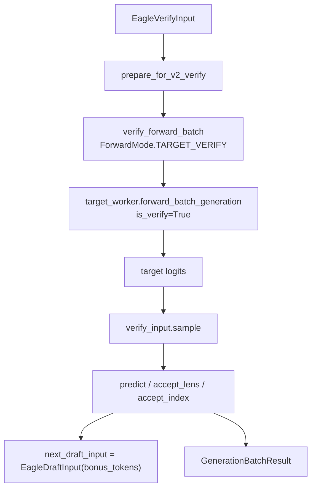

`TpModelWorker.forward_batch_generation(..., is_verify=True)` 有一个专门分支：

```python
if is_verify:
    # Skip sampling; spec_v2 worker fires its own publish post-verify.
    return batch_result
```

也就是说，target verify 只负责算 logits，不走普通 `model_runner.sample()`。接受哪些 token 由 `verify_input.sample()` 处理，因为 speculative verification 要同时看 draft token、target logits、tree mask、grammar mask、sampling 参数和接受规则。

---

## 9. `EagleVerifyInput` 里有什么

源码位置：`python/sglang/srt/speculative/eagle_info.py:EagleVerifyInput`

重要字段：

| 字段 | 含义 |
|---|---|
| `draft_token` | draft 生成的候选 token，展平成一个 token batch |
| `custom_mask` | tree mask，控制候选 token 的 attention 可见性 |
| `positions` | 每个候选 token 的 position |
| `retrieve_index` | verify 后从候选树中取回被接受路径的索引 |
| `retrieve_next_token` / `retrieve_next_sibling` | 用于遍历候选树的辅助结构 |
| `spec_steps` | draft 步数 |
| `topk` | 每步保留多少候选 |
| `draft_token_num` | 每个请求被 target verify 的候选 token 数 |
| `capture_hidden_mode` | 是否需要捕获 hidden states 给下一轮 draft |
| `grammar` | 结构化输出场景下的 grammar 对象 |

### `prepare_for_verify()`

`EagleVerifyInput.prepare_for_verify()` 会临时改写 `ScheduleBatch`：

1. `batch.input_ids = self.draft_token`
2. 为 draft token 分配 `batch.out_cache_loc`
3. 更新 `req_to_token_pool.req_to_token`
4. 必要时设置 Mamba track 信息

这说明 target verify 虽然是“验证”，但它仍然会像 extend 一样把多个候选 token 放进模型 forward，所以必须分配 KV cache 位置。

---

## 10. 接受规则：`accept_lens`、bonus token 与正确性

Speculative decoding 的输出可以分成两类：

- accepted draft tokens：draft 猜中并被 target 接受的 token。
- bonus token：target 在第一个不接受位置给出的 token，保证至少推进 1 token。

在 spec v2 中，`EAGLEWorkerV2.verify()` 返回：

| 字段 | 含义 |
|---|---|
| `next_token_ids` | target verify 后的预测 token，展平保存 |
| `accept_lens` | 每个请求实际接受多少 token，包含 bonus token |
| `speculative_num_draft_tokens` | 每个请求候选 token 的 stride |
| `next_draft_input` | 下一轮 draft 所需的输入，通常包含 bonus token |
| `new_seq_lens` | verify 后每个请求的新长度 |

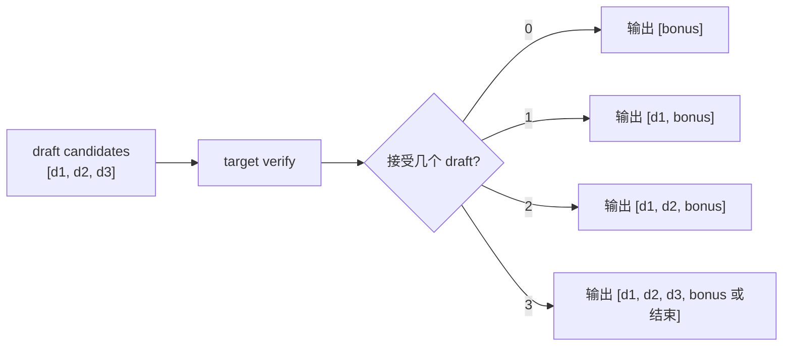

`accept_lens` 包含 bonus，所以：

```text
num_correct_drafts = accept_len - 1
```

这也是 `BatchResultProcessor._resolve_spec_overlap_tokens()` 中的处理：

- `result.num_correct_drafts = sum(accept_lens) - len(batch.reqs)`
- `result.num_correct_drafts_per_req_cpu = [x - 1 for x in accept_lens]`

---

## 11. spec v2 的结果如何回到普通 decode 后处理

源码位置：

- `python/sglang/srt/managers/scheduler_components/batch_result_processor.py:_resolve_spec_overlap_tokens()`
- `python/sglang/srt/managers/scheduler_components/batch_result_processor.py:process_batch_result_decode()`

spec v2 的巧妙之处是：worker 返回多个 token，但后处理尽量复用普通 decode 逻辑。

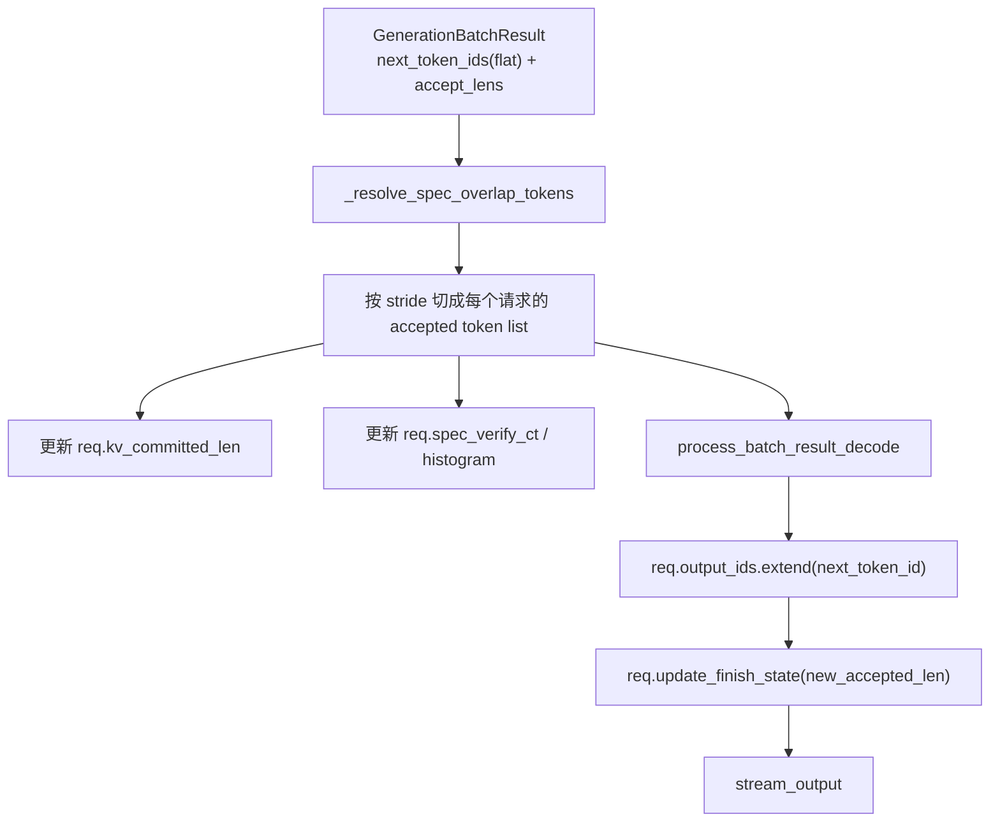

普通 decode 是：

```python
req.output_ids.append(next_token_id)
new_accepted_len = 1
```

spec v2 是：

```python
req.output_ids.extend(next_token_id)
new_accepted_len = len(next_token_id)
```

这就是为什么第 4 讲里提到 verify 阶段会跳过普通 sampler：verify 返回的不是一个普通 token，而是一段已经根据 target logits 验证过的 token 序列。

---

## 12. KV cache：为什么 speculative 会“多分配再回收”

Speculative decoding 会一次验证多个候选 token，因此 KV cache 也会为候选 token 分配位置。但最后不是所有候选都会被接受。

在 `Req` 里能看到相关概念：

| 字段/函数 | 含义 |
|---|---|
| `kv_committed_len` | 已经确认被请求序列使用的 KV 长度 |
| `kv_allocated_len` | 实际分配过的 KV 长度 |
| `pop_committed_kv_cache()` | 标记 committed KV 已释放 |
| `pop_overallocated_kv_cache()` | 释放 over-allocated KV，也就是 speculative 多分配但未使用的部分 |

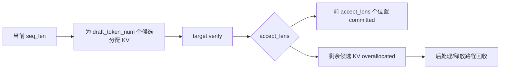

spec v2 的 `_resolve_spec_overlap_tokens()` 会根据 `accept_lens` 修正 `req.kv_committed_len`：

- 请求完成时，因为 decode 前预占了 bonus slot，需要减掉未使用的部分。
- 请求未完成时，`kv_committed_len += accept_lens[i] - 1`。

这里的 `-1` 来自注释里的提示：`prepare_for_decode` 已经预占了 bonus slot。

---

## 13. NGRAM speculative：不用模型也能 draft

NGRAM 路径的核心文件：

- `python/sglang/srt/speculative/ngram_worker.py`
- `python/sglang/srt/speculative/ngram_info.py`
- `python/sglang/srt/speculative/cpp_ngram/`

NGRAM 的 draft 不来自神经网络，而是来自历史 token corpus 匹配：

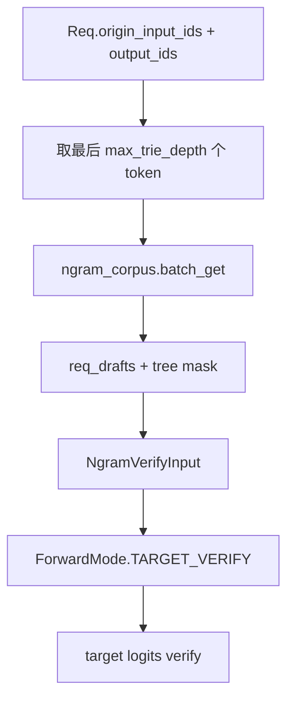

关键函数：

| 文件 | 函数 | 作用 |
|---|---|---|
| `ngram_worker.py` | `_prepare_draft_tokens()` | 从 corpus 中为每个请求查候选 token |
| `ngram_worker.py` | `_prepare_for_speculative_decoding()` | 构造 tree mask、positions、retrieve index，并设置 `batch.forward_mode = TARGET_VERIFY` |
| `ngram_info.py` | `NgramVerifyInput.prepare_for_verify()` | 分配候选 token 的 KV cache，并更新 `req_to_token_pool` |
| `ngram_info.py` | `NgramVerifyInput.verify()` | 根据 target logits 验证候选，并更新请求输出 |

NGRAM 的好处是 draft 成本很低，不需要额外 draft model；缺点是候选质量依赖 corpus 命中，泛化能力通常不如模型型 draft。

---

## 14. Attention backend 为什么也要懂 spec

第 4 讲里说过，attention backend 根据 `ForwardMode` 准备 metadata。Speculative decoding 会让 attention 看到更复杂的输入：

- `TARGET_VERIFY`：一个请求后面接多个候选 token。
- tree mask：候选 token 之间不是普通 causal mask。
- `DRAFT_EXTEND` / `DRAFT_EXTEND_V2`：draft worker 也需要自己的 attention backend。
- CUDA graph：target verify 常常希望固定 shape replay。

所以 SGLang 在多个地方都传递 `spec_info`：

| 层 | 看到什么 |
|---|---|
| `ScheduleBatch` | `batch.spec_algorithm`、`batch.spec_info` |
| `ForwardBatch` | `forward_batch.spec_algorithm`、`forward_batch.spec_info` |
| attention backend | 根据 `forward_mode` 和 `spec_info` 构造 verify mask / KV index |
| CUDA graph runner | 根据算法创建 `EagleVerifyInput`、`NgramVerifyInput` 等固定 shape spec_info |

`SpecInput` 还提供了统一判断：

- `is_draft_input()`
- `is_verify_input()`
- `get_spec_adjust_token_coefficient()`

这些接口让不同算法的 spec input 在 attention backend 和 graph runner 中可以走统一分发。

---

## 15. 与 overlap / future_map 的关系

spec v2 与 overlap 结合时，Scheduler 需要处理两种“下一轮输入”：

1. target verify 接受的 token 序列：用于输出处理和更新请求状态。
2. 下一轮 draft 所需的输入：用于下次 draft 阶段继续猜。

相关字段：

| 字段 | 位置 | 含义 |
|---|---|---|
| `GenerationBatchResult.next_token_ids` | `managers/utils.py` | verify 后的 token，可能是展平的多 token |
| `GenerationBatchResult.accept_lens` | `managers/utils.py` | 每个请求接受 token 数，含 bonus |
| `GenerationBatchResult.next_draft_input` | `managers/utils.py` | 下一轮 draft 需要的 `EagleDraftInput` |
| `GenerationBatchResult.new_seq_lens` | `managers/utils.py` | verify 后的新 seq_lens |
| `future_map` | `scheduler.py` / `overlap_utils.py` | 跨 stream、跨 iteration 传递下一轮输入和 seq_lens |

`Scheduler.run_batch()` 在 overlap + spec v2 下会做：

```python
batch.spec_info = batch_result.next_draft_input
batch.spec_info.future_indices = future_indices
```

这一步的含义是：当前 verify 完成后，下一轮 decode/draft 不再从普通 `next_token_ids` 单 token 路径开始，而是从 spec worker 返回的 `next_draft_input` 继续。

---

## 16. Grammar 与 speculative decoding

结构化输出会让 speculative decoding 更复杂，因为 draft token 不能违反 grammar。

在 EAGLE v2 verify 中可以看到：

1. 如果 `batch.has_grammar`，会把 `retrieve_next_token`、`retrieve_next_sibling`、`draft_tokens` 拷到 CPU。
2. 调用 `generate_token_bitmask()` 生成 vocabulary mask。
3. 把 mask 应用到 verify sampling 阶段。
4. Scheduler 在某些 spec + grammar + overlap 场景下会临时关闭 overlap，避免状态同步问题。

对应定位：

- `scheduler.py:Scheduler.is_disable_overlap_for_batch()`
- `eagle_worker_v2.py:EAGLEWorkerV2.verify()`
- `eagle_info.py:EagleVerifyInput.verify()` / `sample()`

心智模型：

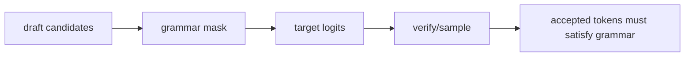

---

## 17. 指标与 adaptive speculative

Speculative decoding 是否有效，关键看接受长度。

SGLang 会记录：

| 指标 | 含义 |
|---|---|
| `spec_verify_ct` | 某请求经历了多少次 verify |
| `spec_num_correct_drafts` | 接受了多少 draft token，不含 bonus |
| `spec_correct_drafts_histogram` | 每次 verify 接受 0/1/2/... 个 draft token 的分布 |
| `speculative_accept_length` | 平均接受长度 |
| `speculative_accept_rate` | draft token 接受率 |

相关位置：

- `schedule_batch.py:Req.update_spec_correct_drafts_histogram()`
- `batch_result_processor.py:_resolve_spec_overlap_tokens()`
- `batch_result_processor.py:process_batch_result_decode()`
- `io_struct.py:SpeculativeDecodingMetricsMixin`
- `load_snapshot.py` 中的 speculative load metrics

adaptive speculative 的思路在 `adaptive_spec_params.py:AdaptiveSpeculativeParams`：

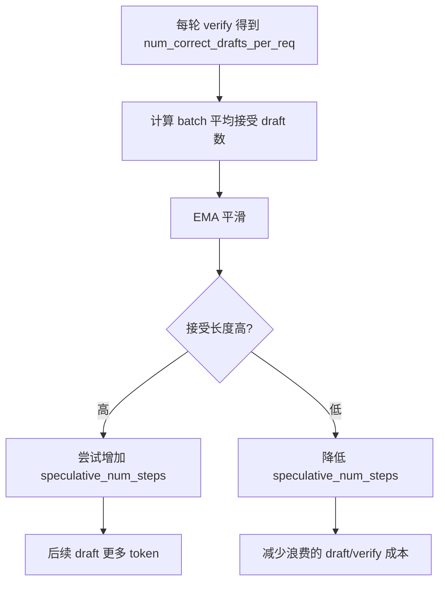

简单说：

> draft 猜得准，就多猜几步；draft 经常猜错，就少猜几步。

---

## 18. 常见困惑

### 18.1 Speculative decoding 会改变模型输出质量吗？

正确实现下不应该改变 target 模型分布。draft 只是提出候选，最终接受由 target logits 和采样规则决定。draft 猜错时，target 会给出 bonus token 继续推进。

### 18.2 为什么 target verify 跳过普通 sampler？

普通 sampler 假设每个请求只需要采一个 next token。target verify 面对的是一组候选 token/tree，需要计算接受路径和接受长度，所以由 `EagleVerifyInput.sample()` 或对应算法的 verify 逻辑处理。

### 18.3 为什么 verify 看起来像 extend？

因为 verify 会把多个 draft token 一次性送进 target model，并为它们分配 KV cache、positions 和 attention mask。这在张量形态上更像 extend，而不是普通单 token decode。

### 18.4 为什么需要 tree mask？

当 top-k draft 形成候选树时，不同分支的 token 不能相互看到。tree mask 用来保证 target verify 的 attention 可见关系与候选树结构一致。

### 18.5 为什么 spec v2 要特别处理 overlap？

overlap 允许 Scheduler 在 GPU forward 还没完全结束时准备下一轮调度。spec v2 forward 中会产生下一轮 draft 输入、更新 seq_lens，并临时改写 batch 字段，所以需要 `future_map`、stream event 和 `_overlap_forward_isolation()` 保证状态不串。

---

## 19. 本讲阅读任务

按下面顺序打开源码，跟读一遍：

| 顺序 | 文件 | 函数 / 代码段 | 阅读重点 |
|---:|---|---|---|
| 1 | `python/sglang/srt/speculative/spec_info.py` | `SpeculativeAlgorithm`、`create_worker()`、`SpecInput` | 看算法如何统一注册和创建 worker。 |
| 2 | `python/sglang/srt/managers/scheduler.py` | `Scheduler.maybe_init_draft_worker()`、`init_model_worker()` | 看开启 spec 后 `model_worker` 如何变成 draft/spec worker。 |
| 3 | `python/sglang/srt/model_executor/forward_batch_info.py` | `ForwardMode` | 找 `TARGET_VERIFY`、`DRAFT_EXTEND`、`DRAFT_EXTEND_V2` 与普通 mode 的关系。 |
| 4 | `python/sglang/srt/managers/schedule_batch.py` | `ScheduleBatch.is_spec_v2`、`prepare_for_decode()` | 看 overlap + spec 如何进入 v2 路径。 |
| 5 | `python/sglang/srt/speculative/eagle_worker_v2.py` | `EagleDraftWorker.draft()`、`draft_forward()` | 看 draft token tree 如何生成。 |
| 6 | `python/sglang/srt/speculative/eagle_info.py` | `EagleVerifyInput.prepare_for_verify()` | 看 draft tokens 如何变成 target verify 的 input_ids、out_cache_loc 和 mask。 |
| 7 | `python/sglang/srt/speculative/eagle_worker_v2.py` | `EAGLEWorkerV2.verify()` | 看 target verify forward、grammar mask、sample、accept_lens 和 next_draft_input。 |
| 8 | `python/sglang/srt/managers/tp_worker.py` | `TpModelWorker.forward_batch_generation(is_verify=True)` | 看 target verify 为什么跳过普通 sampler。 |
| 9 | `python/sglang/srt/managers/scheduler_components/batch_result_processor.py` | `_resolve_spec_overlap_tokens()`、`process_batch_result_decode()` | 看 accepted tokens 如何回写到 `Req.output_ids`、KV committed len 和 metrics。 |
| 10 | `python/sglang/srt/speculative/ngram_worker.py` | `_prepare_draft_tokens()`、`_prepare_for_speculative_decoding()` | 对比 NGRAM 和 EAGLE 的 draft 来源差异。 |

---

## 20. 你应该带走的心智模型

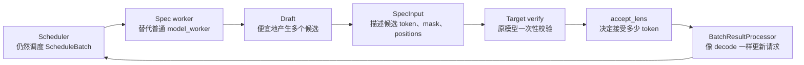

如果你能用自己的话解释下面这句话，就说明这一讲过关了：

> SGLang 的 speculative decoding 没有改掉 Scheduler 的主循环，而是把 `model_worker` 替换成 spec worker；spec worker 先用 draft 路径产生候选，再用 target 的 `TARGET_VERIFY` forward 一次性校验候选，最后把被接受的多个 token 包装成 `GenerationBatchResult`，交回普通 decode 后处理更新请求、KV cache 和输出流。

---

## 21. 下一讲预告

下一讲建议进入 **多进程 / 多卡 / 分布式执行**：

- Scheduler、TokenizerManager、DetokenizerManager 如何通过 IPC 协作？
- TP / DP / PP / EP rank 如何影响 worker 初始化？
- DP attention、pipeline parallel、disaggregation 分别改变了哪段路径？
- 多卡场景下 batch、KV cache、attention metadata 如何保持一致？

