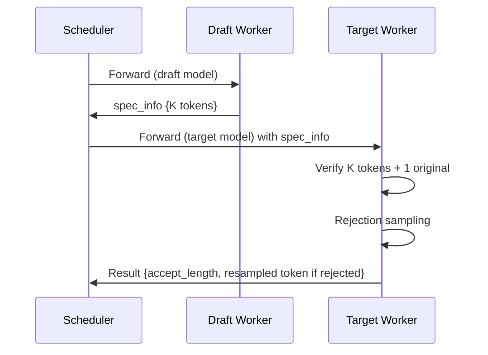

[中文](./05-speculative-decoding.md) | [English](./05-speculative-decoding_EN.md)

# Speculative Decoding in SGLang

## 1. Architecture

```text
Normal serving: Scheduler → TpModelWorker(target) → ModelRunner → output
Spec decoding:  Scheduler → TpModelWorker(draft) + TpModelWorker(target)
                  Draft proposes K tokens → Target verifies → Accept/Reject
```

## 2. Draft Worker

- Loads a smaller draft model (EAGLE, or separate small model)
- `TpModelWorker._init_model_config()` uses `speculative_draft_model_path`
- Forward generates K candidate tokens

## 3. spec_info Data Structure

```python
spec_info = {
    "draft_tokens": Tensor[B, K],     # Proposed token IDs
    "draft_probs": Tensor[B, K, V],   # Draft probabilities per token
    "accept_length": Tensor[B],       # How many accepted per request
    "retrieve_index": Tensor[B],      # Resume position after verify
}
```

## 4. Verify Cycle



## 5. KV Cache Management

- Draft KV is written during draft forward
- Target reads draft KV during verification
- Only accepted tokens' KV is permanently committed
- Rejected tokens' KV pages are freed

## 6. Code References

- `python/sglang/srt/speculative/` — Speculative decoding core
- `python/sglang/srt/managers/scheduler.py` — `spec_info` handling
- `python/sglang/srt/managers/tp_worker.py` — Draft/target dispatch
- `python/sglang/srt/model_executor/model_runner.py` — Spec-aware forward
