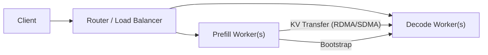

[中文](./07-disaggregation-pd.md) | [English](./07-disaggregation-pd_EN.md)

# PD Disaggregation (Prefill/Decode Separation)

## 1. Why Separate Prefill and Decode?

Prefill and decode have fundamentally different resource profiles:

| Aspect | Prefill | Decode |
|---|---|---|
| Compute | Heavy (many tokens at once) | Light (one token per request) |
| Memory | Moderate (temporary activations) | Heavy (KV Cache reads) |
| Bottleneck | Compute-bound | Memory-bandwidth-bound |
| GPU Utilization | High (large matmuls) | Low (small ops, many launches) |

By separating them, you can:
- Provision prefill nodes with more compute
- Provision decode nodes with more memory bandwidth
- Avoid prefill spikes blocking ongoing decodes
- Scale prefill and decode independently

## 2. Architecture

## 3. Bootstrap Process

1. Client sends request to prefill worker
2. Prefill worker selects a decode worker
3. `POST /route` — register connection
4. Decode worker pre-allocates KV Cache slots (`prealloc_queue`)
5. Prefill worker computes prompt KV
6. KV Cache transferred to decode worker
7. Decode worker begins generating tokens

## 4. KV Transfer Engine

| Backend | Protocol | Best For |
|---|---|---|
| Mooncake | RDMA | High-speed InfiniBand clusters |
| AscendTransferEngine | SDMA / device_rdma | Ascend NPU clusters |
| NIXL | Network | General-purpose networking |

## 5. SGLang Implementation

Key source files:
- `python/sglang/srt/disaggregation/` — Core disaggregation logic
- `python/sglang/srt/disaggregation/ascend/transfer_engine.py` — Ascend-specific transfer
- `python/sglang/srt/managers/scheduler.py` — `disaggregation_mode` branching

Key state:
- `disagg_prefill_bootstrap_queue` — Prefill-side pending connections
- `disagg_decode_prealloc_queue` — Decode-side pre-allocated slots
- `ASCEND_MF_STORE_URL` — Ascend transfer engine store address
- `ASCEND_MF_TRANSFER_PROTOCOL` — `device_rdma` or `sdma`
