# 第 6 讲：多进程 / 多卡 / 分布式执行

这一讲接在第 5 讲之后。前五讲已经把单个请求从 HTTP、Tokenizer、Scheduler、KV cache、ModelRunner、Speculative Decoding 串起来了；现在要回答一个更工程化的问题：

> SGLang 真正服务时，不是一个 Python 函数在跑，而是一组进程、一组 GPU rank、一组 ZMQ/Torch distributed 通信在协作。它们分别是谁？请求和 batch 如何跨进程、跨 rank 流动？

本讲目标：

- 看懂 SGLang 标准引擎由哪些进程组成：HTTP/Engine/Tokenizer、Scheduler、Detokenizer、可选 DP Controller。
- 看懂 `PortArgs` 如何定义 IPC / TCP 通道。
- 看懂 TP / PP / DP / DP attention / CP / EP / MoE DP 这些 rank 如何影响 Scheduler 和 ModelRunner。
- 看懂 rank0 Scheduler 如何收请求，再广播给同一个并行组里的其它 rank。
- 看懂多节点下为什么非 0 节点不跑 tokenizer/detokenizer。
- 看懂 DP attention 为什么需要 DataParallelController 和 MLP sync。

---

## 0. 一张总图

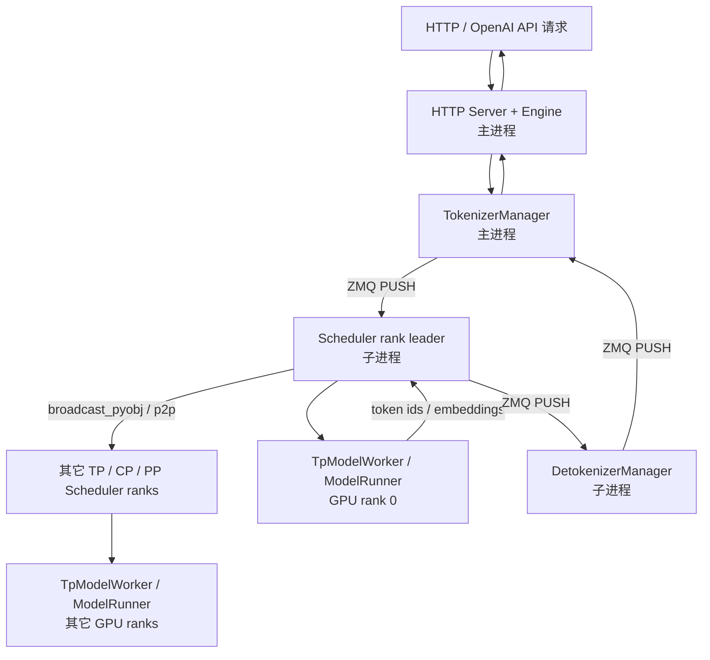

如果开启 DP：

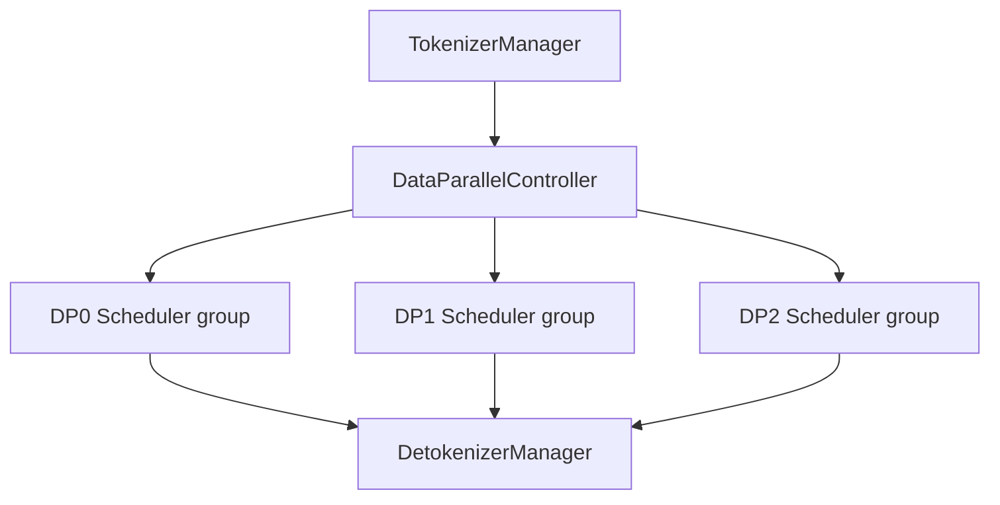

一句话版：

> TokenizerManager 负责把外部请求变成内部 tokenized 请求；Scheduler rank leader 接收请求并在并行组内广播；每个 GPU rank 上的 Scheduler/Worker 按相同 batch 元信息执行自己那份模型分片；DetokenizerManager 再把 token 输出变成文本。

---

## 1. 关键文件跳转表

| 主题 | 文件 | 具体定位 |
|---|---|---|
| Python Engine 入口 | `python/sglang/srt/entrypoints/engine.py` | `Engine`、`_launch_subprocesses()` |
| HTTP server 入口 | `python/sglang/srt/entrypoints/http_server.py` | `launch_server()` |
| 进程启动：Scheduler | `python/sglang/srt/entrypoints/engine.py` | `_launch_scheduler_processes()` |
| 进程启动：Detokenizer | `python/sglang/srt/entrypoints/engine.py` | `_launch_detokenizer_subprocesses()` |
| 进程间通道定义 | `python/sglang/srt/server_args.py` | `PortArgs`、`PortArgs.init_new()` |
| Tokenizer 主进程 | `python/sglang/srt/managers/tokenizer_manager.py` | `TokenizerManager`、请求状态 `ReqState` |
| Detokenizer 子进程 | `python/sglang/srt/managers/detokenizer_manager.py` | `DetokenizerManager.__init__()`、`event_loop()` |
| Scheduler 子进程 | `python/sglang/srt/managers/scheduler.py` | `run_scheduler_process()`、`configure_scheduler_process()` |
| Scheduler IPC | `python/sglang/srt/managers/scheduler_components/ipc_channels.py` | `SchedulerIpcChannels.create()` |
| Scheduler 收请求 | `python/sglang/srt/managers/scheduler_components/request_receiver.py` | `SchedulerRequestReceiver.recv_requests()` |
| TP worker | `python/sglang/srt/managers/tp_worker.py` | `TpModelWorker.__init__()`、`forward_batch_generation()` |
| 分布式初始化 | `python/sglang/srt/distributed/parallel_state.py` | `init_distributed_environment()`、`initialize_model_parallel()` |
| rank 映射 | `python/sglang/srt/entrypoints/engine.py` | `_calculate_rank_ranges()`、`_compute_parallelism_ranks()` |
| DP controller | `python/sglang/srt/managers/data_parallel_controller.py` | `run_data_parallel_controller_process()`、`launch_tensor_parallel_group()` |
| DP attention | `python/sglang/srt/layers/dp_attention.py` | `compute_dp_attention_world_info()`、`set_attention_dp_info()` |
| DP Scheduler sync | `python/sglang/srt/managers/scheduler_components/dp_attn.py` | `prepare_mlp_sync_batch_raw()`、`MLPSyncBatchInfo` |
| PP Scheduler mixin | `python/sglang/srt/managers/scheduler_pp_mixin.py` | pipeline parallel event loop / microbatch 相关逻辑 |

---

## 2. 标准引擎的三个核心组件

`Engine` 的类注释已经直接说明了标准 SRT 引擎的组成：

| 组件 | 进程 | 主要职责 |
|---|---|---|
| HTTP Server / Engine | 主进程 | 提供 API、初始化引擎、维护事件循环 |
| TokenizerManager | 主进程 | tokenization、请求状态管理、把 tokenized 请求送给 Scheduler |
| Scheduler | 子进程，一个或多个 | 调度 batch、执行模型 forward、输出 token ids |
| DetokenizerManager | 子进程，一个或多个 | 把 token ids 增量 decode 成文本，返回 TokenizerManager |

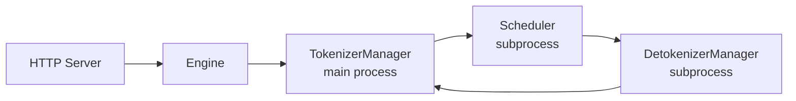

注意：TokenizerManager 和 Engine 在主进程里，不是独立子进程。Scheduler 和 DetokenizerManager 是 multiprocessing 子进程。

---

## 3. `Engine._launch_subprocesses()`：服务启动主线

源码定位：`python/sglang/srt/entrypoints/engine.py:Engine._launch_subprocesses()`

启动顺序：

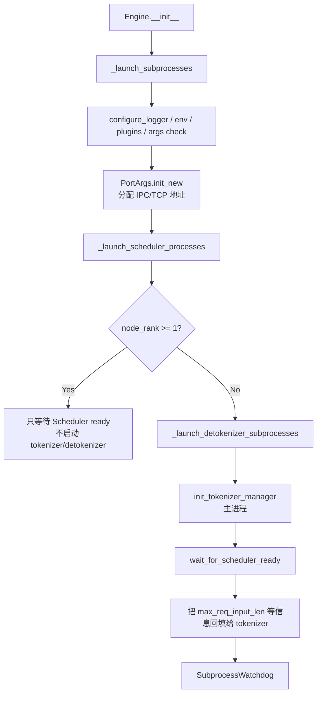

两个细节很重要：

1. **先启动 Scheduler，再启动 Detokenizer/Tokenizer。**
   Scheduler 需要加载模型，通常最慢。Engine 会通过 pipe 等待 Scheduler ready。

2. **多节点时，只有 `node_rank == 0` 跑 tokenizer/detokenizer。**
   非 0 节点只启动本节点的 Scheduler rank，然后阻塞等待；外部请求从 0 节点进入，再通过分布式通信同步到其它节点。

---

## 4. `PortArgs`：进程间通信地址表

源码定位：`python/sglang/srt/server_args.py:PortArgs`

`PortArgs` 保存了几类通信地址：

| 字段 | 用途 |
|---|---|
| `tokenizer_ipc_name` | Detokenizer / Scheduler 结果返回 TokenizerManager |
| `scheduler_input_ipc_name` | TokenizerManager 发送请求给 Scheduler rank leader |
| `detokenizer_ipc_name` | Scheduler 发送 token id 输出给 DetokenizerManager |
| `rpc_ipc_name` | Engine 与 Scheduler 的 RPC 控制请求 |
| `metrics_ipc_name` | Scheduler 发送 metrics |
| `nccl_port` | Torch distributed / NCCL 初始化 |
| `tokenizer_worker_ipc_name` | multi-tokenizer worker 模式 |
| `load_collector_ipc_name` | DP attention TCP 模式下负载快照收集 |

### 普通模式：本机 IPC

当没有启用 DP attention 时，`PortArgs.init_new()` 会创建多个：

```text
ipc://<tempfile>
```

这些是本机 ZMQ IPC 地址，适合单机多进程。

### DP attention 模式：TCP

启用 DP attention 时，`PortArgs` 会使用 TCP 地址：

```text
tcp://host:port
```

原因是 DP attention 可能跨节点，也需要 DP Controller 给不同 DP rank 分配不同的 worker port。

---

## 5. IPC 方向：请求和结果怎么流动

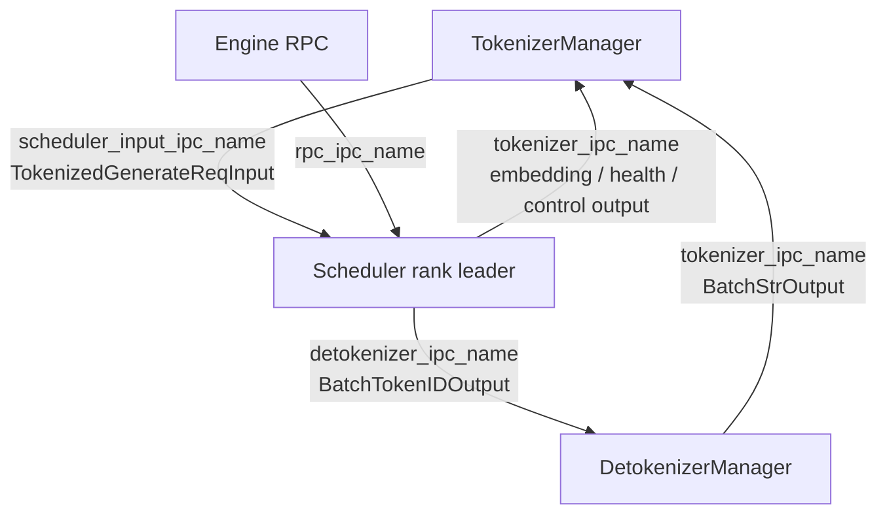

Scheduler 侧通道创建在 `SchedulerIpcChannels.create()`：

- 只有 rank leader 绑定 `recv_from_tokenizer` 和 `recv_from_rpc`。
- 非 leader rank 的 `recv_from_tokenizer` 是 `None`。
- rank leader 可以把结果发给 tokenizer 或 detokenizer。

这里的 rank leader 不是笼统的 “GPU 0”，而是满足并行维度条件的 rank：

- 普通 TP 场景：通常是 `tp_rank == 0`。
- DP attention 场景：更细地看 `attn_tp_rank == 0 and attn_cp_rank == 0`。
- PP 场景：第一个 pipeline stage 收请求，后续 stage 从前一 stage 接收对象。

---

## 6. Scheduler 进程如何启动

标准 `dp_size == 1` 时，`Engine._launch_scheduler_processes()` 会按 `pp_rank_range` 和 `tp_rank_range` 启动多个 Scheduler 子进程：

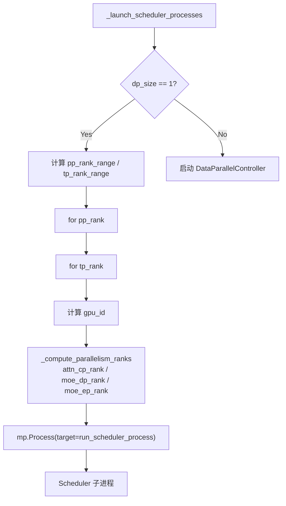

每个 Scheduler 进程会收到：

- `gpu_id`
- `tp_rank`
- `attn_cp_rank`
- `moe_dp_rank`
- `moe_ep_rank`
- `pp_rank`
- `dp_rank`
- `PortArgs`
- pipe writer

这些 rank 会继续传入 `Scheduler.__init__()` 和 `TpModelWorker.__init__()`。

---

## 7. Scheduler 子进程内部做什么

入口：`python/sglang/srt/managers/scheduler.py:run_scheduler_process()`

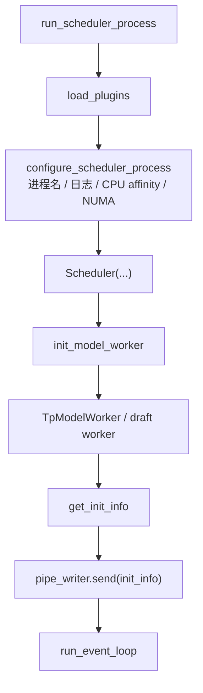

`configure_scheduler_process()` 会把进程名设置成类似：

```text
sglang::scheduler_DP0_PP0_TP1_EP0
```

这不是装饰性日志。多 GPU、多 rank 场景下定位问题时，进程名和日志前缀是你判断哪个 rank 出问题的第一线索。

---

## 8. Tensor Parallel：同一个 batch，不同 rank 算不同分片

TP 场景下，多个 Scheduler 进程对应多个 GPU rank。它们需要看到一致的请求和 batch 元信息，然后各自执行模型分片。

请求同步发生在：

`python/sglang/srt/managers/scheduler_components/request_receiver.py:SchedulerRequestReceiver.recv_requests()`

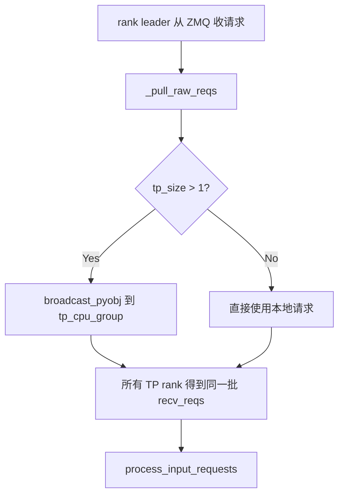

普通 TP 场景中：

- `tp_rank == 0` 从 TokenizerManager 收请求。
- 其它 TP rank 不直接连 tokenizer。
- rank0 通过 CPU group 把 Python 请求对象广播给其它 TP rank。
- 所有 rank 在各自进程里执行相同的调度逻辑，保持 batch 结构一致。
- 模型层的参数、attention heads、MLP 等按 TP 分片执行。

第 4 讲讲过的 `ForwardBatch`、attention backend、`tensor_model_parallel_all_reduce` 等逻辑，就运行在这组 TP rank 上。

---

## 9. Pipeline Parallel：请求在 PP stage 之间传递

PP 维度把模型层分成多个 pipeline stage。`SchedulerRequestReceiver._pull_raw_reqs()` 中可以看到：

- `pp_rank == 0` 的 leader 从 tokenizer/RPC 收请求。
- `pp_rank > 0` 的 leader 通过 `point_to_point_pyobj()` 从前一个 PP stage 接收请求对象。

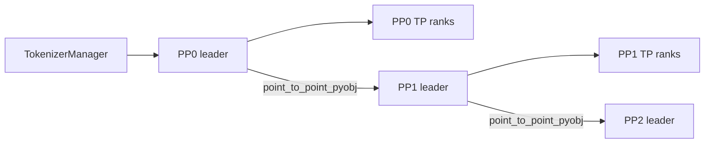

PP 的完整 event loop 在 `scheduler_pp_mixin.py` 中。第一遍读源码时不建议直接从 PP loop 开始，因为它会把调度、microbatch、pipeline send/recv 混在一起。先理解普通 Scheduler，再看 PP 会轻松很多。

---

## 10. 分布式 group：World / TP / PP / ATTN / MoE

核心文件：`python/sglang/srt/distributed/parallel_state.py`

分布式初始化分两层：

1. `init_distributed_environment()`
   - 调 `torch.distributed.init_process_group()`
   - 创建 `_WORLD`
   - 设置 local rank
   - 可选创建 global TCPStore

2. `initialize_model_parallel()`
   - 根据 world size、TP、PP、attention DP/CP、MoE EP/DP 创建子 group

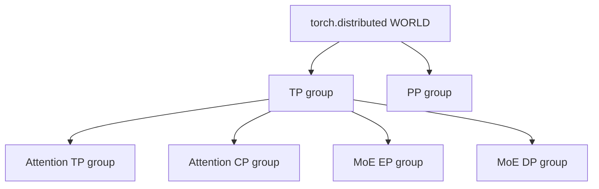

常见 group：

| group | 含义 |
|---|---|
| world group | 所有分布式 rank |
| TP group | tensor parallel rank 组 |
| PP group | pipeline parallel rank 组 |
| ATTN TP group | attention tensor parallel 组 |
| ATTN CP group | attention context parallel 组 |
| MoE EP group | expert parallel 组 |
| MoE DP group | MoE data parallel 组 |

`initialize_model_parallel()` 的注释给了一个很好例子：8 GPU、TP=2、PP=4 时，会创建 4 个 TP group 和 2 个 PP group。

---

## 11. Rank 计算：为什么一个 tp_rank 会拆出多个 rank

在 `Engine._launch_scheduler_processes()` 和 `DataParallelController.launch_tensor_parallel_group()` 中，`tp_rank` 会进一步拆成：

- `attn_cp_rank`
- `moe_dp_rank`
- `moe_ep_rank`

这是因为 “tensor parallel” 是一个总 GPU 维度，但 attention 和 MoE 可能有不同的切法。

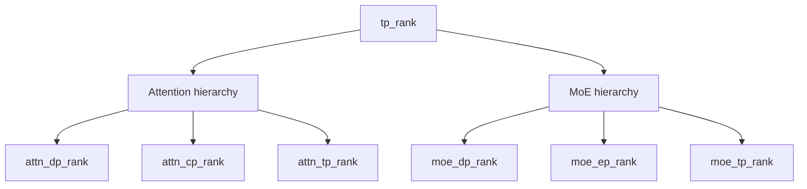

在 DP attention 场景下，`compute_dp_attention_world_info()` 会从 `tp_rank`、`tp_size`、`dp_size`、`attn_cp_size` 推导：

- attention TP size
- attention TP rank
- attention DP rank
- attention CP rank

所以不要把 `tp_rank` 简单理解成“第几张卡”。它更像一个总 rank，后续会被不同并行策略重新解释。

---

## 12. DataParallelController：DP 模式下的请求路由器

当 `server_args.dp_size > 1` 时，标准 Engine 不再直接启动所有 Scheduler，而是先启动：

`python/sglang/srt/managers/data_parallel_controller.py:run_data_parallel_controller_process()`

DP Controller 的职责：

1. 启动多个 DP worker group。
2. 为每个 DP rank 管理一个 ZMQ worker socket。
3. 从 TokenizerManager 收请求。
4. 根据策略把请求路由到某个 DP rank。
5. 收集/维护 worker status 和 load。

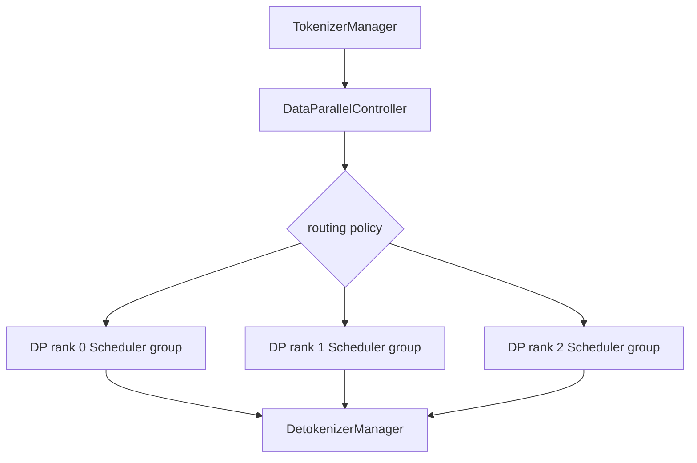

你会在 DP Controller 里看到几类路由：

- `round_robin_scheduler()`
- `maybe_external_dp_rank_routing()`
- `follow_bootstrap_room_scheduler()`
- 结合 load snapshot 的调度

这和 TP 不同：TP 是同一个请求被广播给同组所有 rank 共同算；DP 是不同请求被分配给不同 DP group。

---

## 13. DP attention：不是普通 DP

DP attention 比普通请求级 DP 更复杂。它让 attention 层按 DP/TP/CP 组合切分，同时 MLP 侧可能仍需要同步 token 信息。

核心文件：

- `python/sglang/srt/layers/dp_attention.py`
- `python/sglang/srt/managers/scheduler_components/dp_attn.py`

DP attention 下，Scheduler 每轮 batch 决策后可能调用：

```text
dp_attn_adapter.maybe_prepare_mlp_sync_batch(...)
```

底层对应 `prepare_mlp_sync_batch_raw()`。

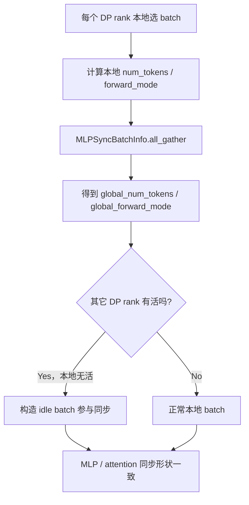

为什么需要 idle batch？

因为某些分布式 collective 要求所有相关 rank 都进入同一类通信。如果某个 DP rank 没请求，但其它 DP rank 正在跑 forward，它也可能需要进入同步路径，否则会死锁或 shape 不一致。

---

## 14. 请求接收：rank leader 与广播

`SchedulerRequestReceiver.recv_requests()` 可以分四步看：

1. `_pull_raw_reqs()`
2. `input_blocker.handle()`
3. `_broadcast_reqs_across_ranks()`
4. `_apply_mm_receiver()` 与 `_finalize_shm_features()`

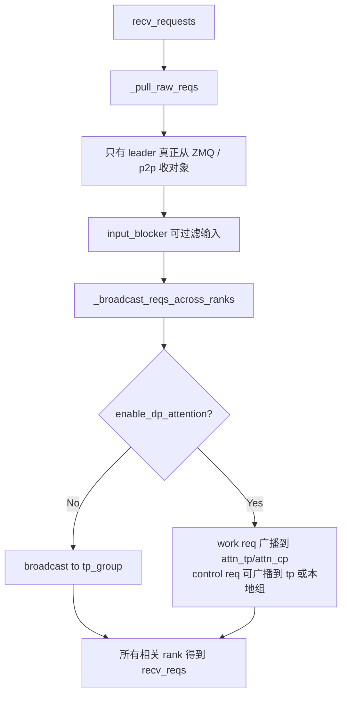

DP attention 下会把请求分为：

- work requests：真正生成/embedding 请求。
- control requests：flush、abort、profile、logging、RPC 等控制请求。

这样可以减少全 TP group 的昂贵同步。

---

## 15. DetokenizerManager：为什么单独一个进程

Scheduler 输出的是 token id，而 HTTP 层需要文本增量。DetokenizerManager 单独成进程有几个好处：

1. 把 tokenizer decode 的 CPU 工作从 GPU Scheduler 进程中挪走。
2. 支持增量 decode、stop string trim、工具调用 parser 等逻辑。
3. Scheduler 可以专注 GPU 调度和 forward。

核心函数：

| 文件 | 函数 | 作用 |
|---|---|---|
| `detokenizer_manager.py` | `DetokenizerManager.__init__()` | 初始化 IPC、tokenizer、状态、dispatcher |
| `detokenizer_manager.py` | `event_loop()` | 从 Scheduler 收 token id 输出，dispatch 后发回 TokenizerManager |
| `detokenizer_manager.py` | `handle_batch_token_id_out()` | 处理生成 token ids，增量 decode 成文本 |
| `detokenizer_manager.py` | `trim_matched_stop()` | 根据 stop string / stop token 裁剪输出 |

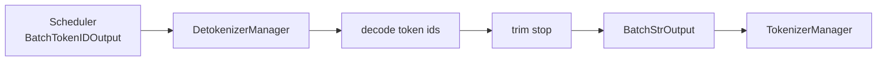

---

## 16. Multi-tokenizer / Multi-detokenizer

SGLang 还支持多个 tokenizer worker 或 detokenizer worker。

相关入口：

- `Engine._launch_detokenizer_subprocesses()`
- `MultiTokenizerRouter`
- `run_multi_detokenizer_router_process()`

当 `detokenizer_worker_num > 1` 时：

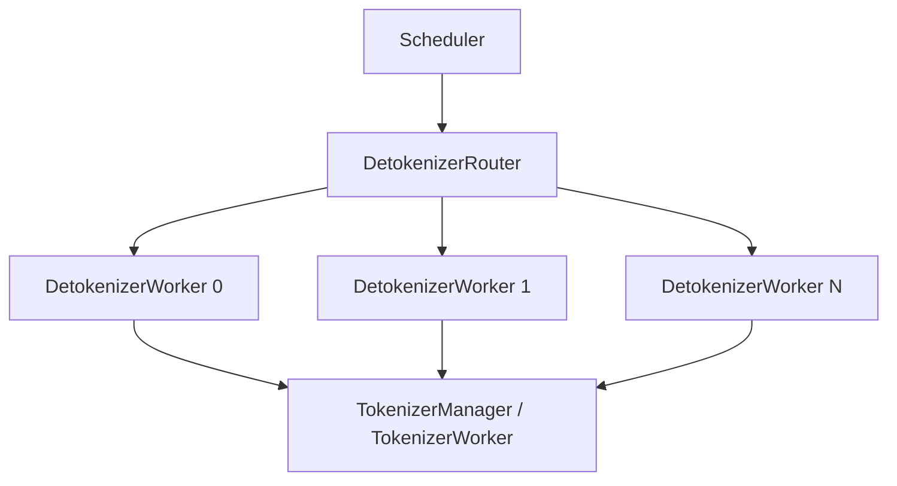

当 `tokenizer_worker_num > 1` 时，HTTP worker 会有自己的 TokenizerManager/TokenizerWorker，主进程通过 shared memory 写入 `PortArgs`、`ServerArgs`、`scheduler_info`。这部分是为了提升高并发场景下的 CPU tokenization/JSON 处理吞吐。

---

## 17. 多节点：node 0 负责入口，其它节点只跑计算 rank

在 `Engine._launch_subprocesses()` 中：

```python
if server_args.node_rank >= 1:
    scheduler_init_result.wait_for_ready()
    launch_dummy_health_check_server(...)
    scheduler_init_result.wait_for_completion()
```

含义是：

- node 0：运行 HTTP、TokenizerManager、DetokenizerManager、Scheduler ranks。
- node 1..N：只运行本节点 Scheduler ranks，并启动 dummy health check server。

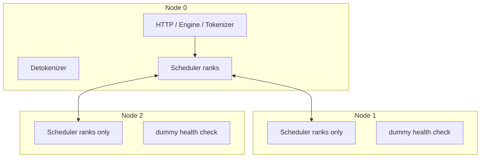

这样做可以避免每个节点都暴露完整 API 服务，也避免请求入口分散导致状态管理复杂。

---

## 18. 模型 worker：rank 信息如何进入 ModelRunner

`TpModelWorker.__init__()` 接收：

- `tp_rank`
- `moe_ep_rank`
- `pp_rank`
- `attn_cp_rank`
- `moe_dp_rank`
- `dp_rank`
- `is_draft_worker`
- `req_to_token_pool`
- `token_to_kv_pool_allocator`

然后创建 `ModelRunner`：

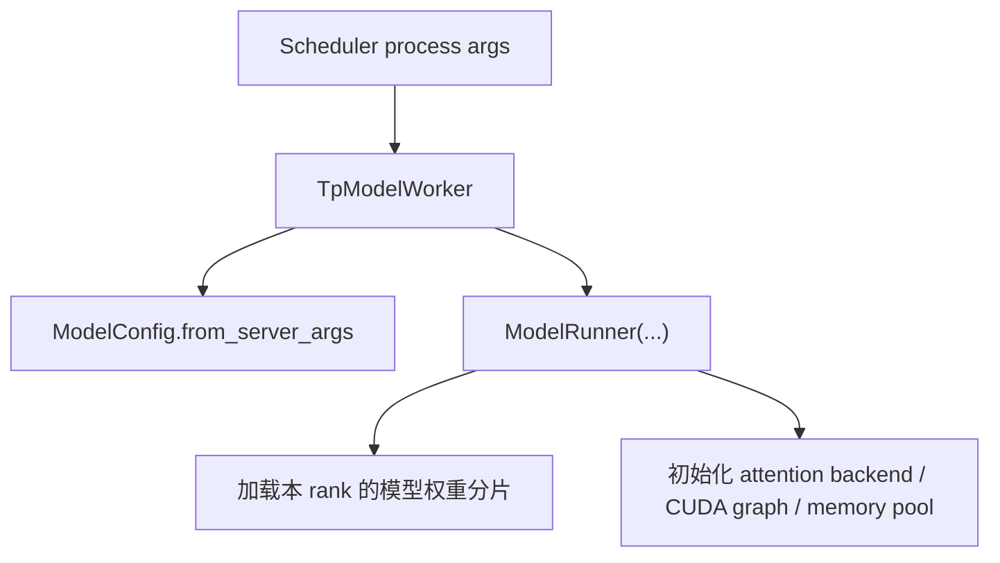

在 TP 下，每个 rank 的 `ModelRunner` 只持有自己那部分权重或 heads；在 PP 下，每个 rank 只持有部分层；在 EP/MoE 下，每个 rank 只持有部分专家或参与专家通信。

---

## 19. 数据路径与控制路径要分开看

学习 SGLang 分布式时，最好把两类路径分开：

### 数据路径

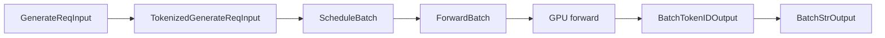

### 控制路径

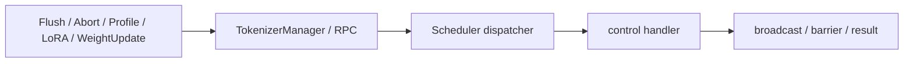

控制请求经常需要广播到多个 rank 或做 barrier；数据请求则更关注 batch、KV cache 和 forward。

---

## 20. 常见困惑

### 20.1 Scheduler 是一个进程还是多个进程？

一个 GPU rank 通常对应一个 Scheduler 子进程。TP/PP/DP 等并行度越高，Scheduler 进程越多。它们不是互相独立的 HTTP server，而是共同服务一个模型实例。

### 20.2 为什么只有 rank0 从 tokenizer 收请求？

因为 Python 请求对象只需要从 ZMQ 读一次。随后通过 `broadcast_pyobj` 或 p2p 传给其它 rank，保证所有相关 rank 看到一致的调度输入。

### 20.3 DP 和 TP 的区别是什么？

TP 是同一个请求由多个 rank 合作计算一个模型分片；DP 是不同请求可以被路由到不同 worker group。DP attention 又是更细的 attention/MLP 组合切分，不等同于简单复制模型。

### 20.4 为什么 Detokenizer 要单独进程？

decode 文本、stop 裁剪、工具调用解析都是 CPU 工作。单独进程可以避免阻塞 Scheduler 的 GPU 调度热路径。

### 20.5 为什么多节点非 0 节点不跑 tokenizer？

请求入口集中在 node 0，非 0 节点只贡献计算 rank。这样 API、状态、detokenization 和外部连接都更容易管理。

### 20.6 为什么 DP attention 需要 idle batch？

分布式 collective 要求相关 rank 同步进入。某个 DP rank 没有本地请求时，也可能需要用 idle batch 参与形状同步，避免其它 rank 在 collective 上等待它。

---

## 21. 本讲阅读任务

按下面顺序打开源码，跟读一遍：

| 顺序 | 文件 | 函数 / 代码段 | 阅读重点 |
|---:|---|---|---|
| 1 | `python/sglang/srt/entrypoints/engine.py` | `Engine` 类注释、`Engine.__init__()` | 看标准引擎由哪些组件组成。 |
| 2 | `python/sglang/srt/entrypoints/engine.py` | `_launch_subprocesses()` | 看启动顺序：PortArgs、Scheduler、Detokenizer、Tokenizer。 |
| 3 | `python/sglang/srt/server_args.py` | `PortArgs`、`PortArgs.init_new()` | 看普通 IPC 和 DP attention TCP 模式的地址差异。 |
| 4 | `python/sglang/srt/entrypoints/engine.py` | `_launch_scheduler_processes()` | 看 tp/pp rank 如何映射到 GPU 和 Scheduler 子进程。 |
| 5 | `python/sglang/srt/managers/scheduler.py` | `run_scheduler_process()`、`configure_scheduler_process()` | 看 Scheduler 子进程如何初始化并进入 event loop。 |
| 6 | `python/sglang/srt/managers/scheduler_components/ipc_channels.py` | `SchedulerIpcChannels.create()` | 看哪些 rank 绑定 ZMQ socket，哪些 rank 只是空 sender。 |
| 7 | `python/sglang/srt/managers/scheduler_components/request_receiver.py` | `SchedulerRequestReceiver.recv_requests()` | 看 rank leader 如何收请求并广播给 TP/CP/PP ranks。 |
| 8 | `python/sglang/srt/distributed/parallel_state.py` | `init_distributed_environment()`、`initialize_model_parallel()` | 看 world、TP、PP、attention、MoE groups 如何创建。 |
| 9 | `python/sglang/srt/managers/data_parallel_controller.py` | `launch_tensor_parallel_group()`、`round_robin_scheduler()` | 看 DP worker group 如何启动和路由。 |
| 10 | `python/sglang/srt/managers/scheduler_components/dp_attn.py` | `prepare_mlp_sync_batch_raw()` | 看 DP attention 为什么需要 all_gather 和 idle batch。 |
| 11 | `python/sglang/srt/managers/detokenizer_manager.py` | `DetokenizerManager.event_loop()`、`handle_batch_token_id_out()` | 看 token id 如何变回文本。 |

---

## 22. 你应该带走的心智模型

```mermaid
flowchart TD
  A["Engine 负责拉起进程"] --> B["PortArgs 定义通信地址"]
  B --> C["TokenizerManager 负责入口 tokenization"]
  C --> D["Scheduler rank leader 收请求"]
  D --> E["TP/CP/PP ranks 广播或 p2p 同步请求"]
  E --> F["ModelRunner 在每个 GPU rank 上执行本地分片"]
  F --> G["Scheduler rank leader 汇总/发送输出"]
  G --> H["DetokenizerManager 解码文本"]
  H --> C
```

如果你能用自己的话解释下面这句话，就说明这一讲过关了：

> SGLang 的分布式执行不是让每个 GPU 各自跑一个完整服务，而是由 Engine 拉起一组协作进程；TokenizerManager 统一入口，Scheduler rank leader 收请求并广播到并行组，多个 GPU rank 按 TP/PP/DP/EP 等 group 执行各自模型分片，最后由 DetokenizerManager 把 token 输出还原成文本。

---

## 23. 下一讲预告

下一讲建议进入 **Disaggregation / PD 分离**：

- prefill worker 和 decode worker 为什么要拆开？
- bootstrap、prealloc、transfer queue 分别做什么？
- KV cache 如何从 prefill worker 传到 decode worker？
- Mooncake / NIXL / ZMQ 等 transfer backend 在代码里如何接入？
- PD disaggregation 与 Scheduler 主循环、KV cache 生命周期有什么关系？

