# 第 7 讲：Disaggregation / PD 分离

这一讲接在第 6 讲之后。第 6 讲已经解释了一个统一模型实例内部的多进程、多卡、TP/PP/DP/EP rank 关系；这一讲开始看更高一层的部署拆分：

> Prefill 和 Decode 为什么可以拆成两类 server？请求在两个 server 之间如何交接？KV cache 又是怎么从 prefill 侧传到 decode 侧的？

本讲目标：

- 看懂 `disaggregation_mode = prefill / decode / null` 分别代表什么。
- 看懂 PD 分离中一个请求的生命周期。
- 看懂 prefill server 的 Bootstrap Queue、Waiting Queue、Inflight Queue。
- 看懂 decode server 的 PreallocQueue、TransferQueue、WaitingQueue、RunningBatch。
- 看懂 bootstrap、prealloc、metadata、KV sender/receiver、KV manager 的关系。
- 看懂 Mooncake / NIXL / Mori / Ascend / Fake 这些 transfer backend 如何接入统一抽象。
- 看懂 PD 分离和 Scheduler、Req、ScheduleBatch、KV cache pool、Radix cache 的关系。

---

## 0. 一张总图

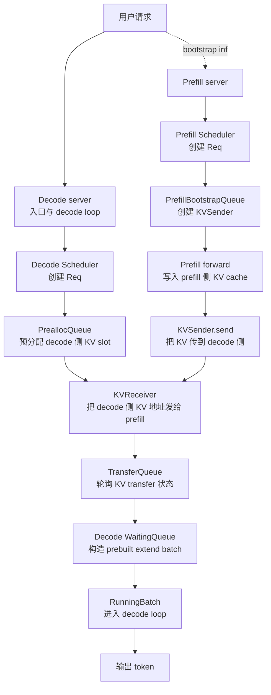

一句话版：

> PD 分离把 prompt prefill 和 token decode 拆到两个 server。decode server 负责请求入口、KV 预分配和后续 decode；prefill server 负责计算 prompt 的 KV cache，并通过 KV transfer backend 把 KV 写到 decode server 已经预留好的位置。

---

## 1. 关键文件跳转表

| 主题 | 文件 | 具体定位 |
|---|---|---|
| Scheduler 中的模式初始化 | `python/sglang/srt/managers/scheduler.py` | `Scheduler.__init__()` 中 `self.disaggregation_mode = DisaggregationMode(...)`；prefill/decode 初始化分支 |
| 请求入口如何写入 bootstrap 信息 | `python/sglang/srt/managers/scheduler.py` | `Scheduler.handle_generate_request()`、`handle_batch_generate_request()` |
| prefill 侧生命周期 | `python/sglang/srt/disaggregation/prefill.py` | 文件头生命周期注释、`PrefillBootstrapQueue`、`SchedulerDisaggregationPrefillMixin` |
| prefill 侧 bootstrap 队列 | `python/sglang/srt/disaggregation/prefill.py` | `PrefillBootstrapQueue.__init__()`、`_init_kv_manager()`、`create_sender()`、`add()` |
| prefill 侧 bootstrap 状态处理 | `python/sglang/srt/disaggregation/prefill.py` | `SchedulerDisaggregationPrefillMixin.handle_pending_bootstrap()`、`check_bootstrap()` |
| decode 侧生命周期 | `python/sglang/srt/disaggregation/decode.py` | 文件头生命周期注释、`DecodeRequest`、`SchedulerDisaggregationDecodeMixin` |
| decode 侧 req pool | `python/sglang/srt/disaggregation/decode.py` | `DecodeReqToTokenPool`、`HybridMambaDecodeReqToTokenPool` |
| decode 侧 prealloc/transfer 队列 | `python/sglang/srt/disaggregation/decode.py` | `PreallocQueue`、`TransferQueue` 相关 `add()` / poll 逻辑 |
| decode 侧 batch mixin | `python/sglang/srt/disaggregation/decode_schedule_batch_mixin.py` | `ScheduleBatchDisaggregationDecodeMixin` |
| KV transfer 抽象 | `python/sglang/srt/disaggregation/base/conn.py` | `KVArgs`、`KVPoll`、`BaseKVManager`、`BaseKVSender`、`BaseKVReceiver`、`BaseKVBootstrapServer` |
| 通用 KV manager | `python/sglang/srt/disaggregation/common/conn.py` | `CommonKVManager.__init__()`、`register_to_bootstrap()`、`try_ensure_parallel_info()` |
| transfer backend 注册 | `python/sglang/srt/disaggregation/utils.py` | `KVClassType`、`get_kv_class()` |
| Mooncake 后端 | `python/sglang/srt/disaggregation/mooncake/conn.py` | `MooncakeKVManager`、`MooncakeKVSender`、`MooncakeKVReceiver`、`MooncakeKVBootstrapServer` |
| NIXL / Mori / Ascend 后端 | `python/sglang/srt/disaggregation/nixl/conn.py`、`mori/conn.py`、`ascend/conn.py` | 各自的 `KVManager`、`KVSender`、`KVReceiver`、`KVBootstrapServer` |
| ServerArgs 配置 | `python/sglang/srt/server_args.py` | `disaggregation_mode`、`disaggregation_bootstrap_port`、transfer backend 相关字段 |

---

## 2. PD 分离解决什么问题

LLM serving 里 prefill 和 decode 的计算形态很不一样：

| 阶段 | 输入形态 | 计算特点 | 资源压力 |
|---|---|---|---|
| Prefill | prompt 的多个 token | 大 batch、大 token 数、attention 写入整段 KV | 算力和显存带宽压力大，单次延迟峰值高 |
| Decode | 每个请求每轮 1 个或少量 token | 高频小步循环，强依赖 KV cache | 低延迟、连续调度、KV cache 常驻 |

统一部署时，一个 Scheduler 同时处理 prefill 和 decode。PD 分离把两者拆开：

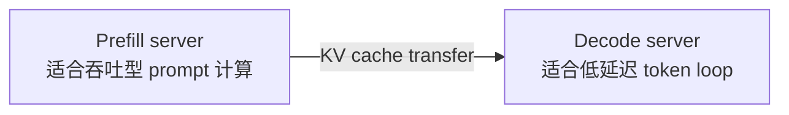

这样做的收益：

- prefill server 可以专门处理长 prompt、chunked prefill、prefix 计算。
- decode server 可以专注持续 decode，减少大 prefill 对低延迟 token loop 的干扰。
- prefill 和 decode 可以独立扩缩容。
- 在大模型或长上下文场景中，可以把 KV cache transfer 作为部署层的显式数据流管理。

代价也很明确：

- 必须引入 bootstrap 协议，让两侧知道同一个请求对应哪个 transfer room。
- decode 侧必须先预留 KV cache 位置，否则 prefill 侧不知道要把 KV 写到哪里。
- 必须处理 transfer backend 的失败、超时、abort、重试。
- Scheduler 的 waiting/running 状态不再只有普通队列，还多了 bootstrap、prealloc、transfer 等中间队列。

---

## 3. 三种 `DisaggregationMode`

核心枚举在 `python/sglang/srt/disaggregation/utils.py` 的 `DisaggregationMode`。

| 模式 | 含义 | Scheduler 行为 |
|---|---|---|
| `NULL` | 不启用 PD 分离 | 普通 SGLang 主线：请求在同一个 Scheduler 中 prefill + decode。 |
| `PREFILL` | 当前实例是 prefill server | 负责 prompt prefill，计算 KV cache，并把 KV transfer 到 decode server。 |
| `DECODE` | 当前实例是 decode server | 负责请求入口、预分配 decode KV slot、接收 prefill KV，然后进入 decode loop。 |

Scheduler 初始化时会根据 `server_args.disaggregation_mode` 建立不同对象：

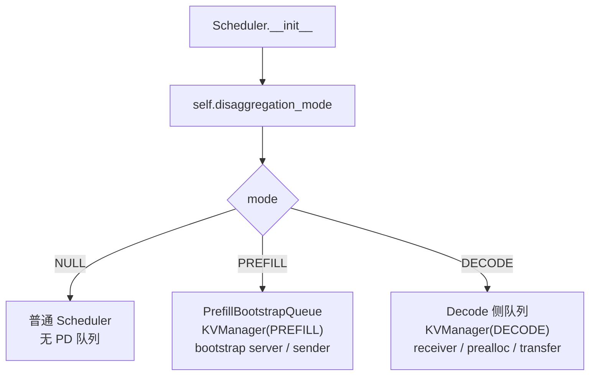

在第 6 讲的多进程模型里，一个 Scheduler 子进程绑定一个 GPU rank；在 PD 模式下，这个 Scheduler 还会额外带上 prefill 或 decode 的职责。

---

## 4. 请求里的 bootstrap 信息

PD 分离要让 prefill 和 decode 两个 server 对同一个请求达成共识，需要几个关键字段：

| 字段 | 所在对象 | 作用 |
|---|---|---|
| `bootstrap_host` | `Req` / request input | prefill 或 decode 对端的 host。 |
| `bootstrap_port` | `Req` / request input | bootstrap server 的端口，默认来自 `server_args.disaggregation_bootstrap_port`。 |
| `bootstrap_room` | `Req` / request input | 一次请求对应的 room id，用来匹配 sender 和 receiver。 |
| `pending_bootstrap` | `Req` | prefill 侧表示 sender 还没有完成握手/预分配。 |
| `disagg_kv_sender` | `Req` | prefill 侧持有的 KV sender。 |
| `metadata_buffer_index` | `Req` / `DecodeRequest` | 用于传输辅助 metadata 的 buffer slot。 |
| `kv_committed_len` | `Req` | decode 侧已经确认可用的 KV 长度。 |

`Scheduler.handle_generate_request()` 会补默认 `bootstrap_port`，并检查 PD 模式下请求是否携带足够 bootstrap 信息。`handle_batch_generate_request()` 再根据模式把请求放入不同队列。

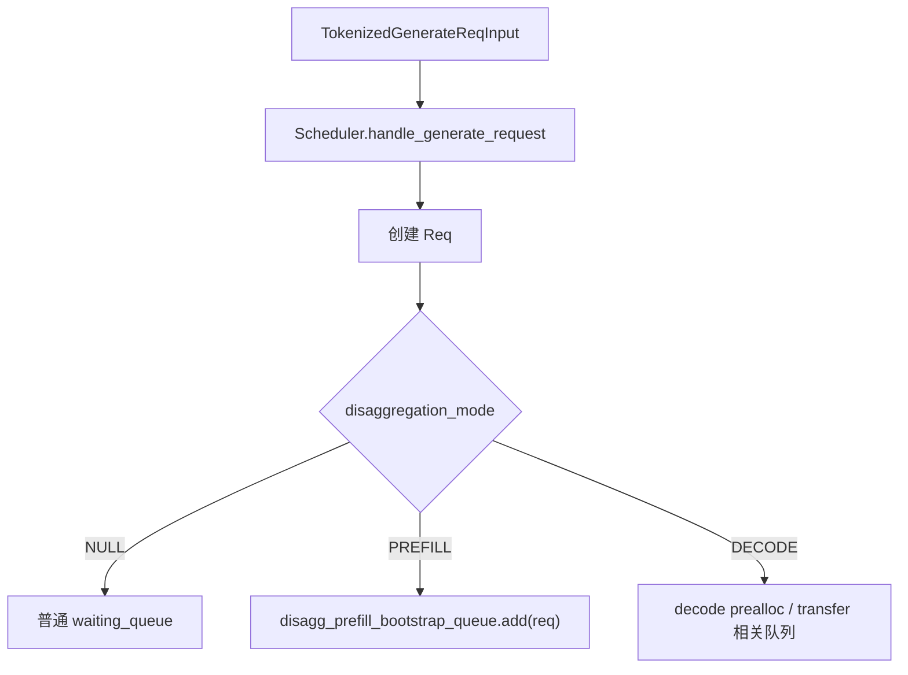

---

## 5. KV transfer 抽象层

PD 分离的关键不是 HTTP，而是 KV cache 如何从一个 GPU/rank 写到另一个 GPU/rank。SGLang 把这个能力抽象成几组类。

### 5.1 `KVArgs`

`KVArgs` 描述当前 rank 的 KV cache 内存布局：

| 字段 | 含义 |
|---|---|
| `engine_rank` | 当前 prefill/decode rank。 |
| `kv_data_ptrs` / `kv_data_lens` / `kv_item_lens` | KV cache buffer 的地址、长度、单 item 大小。 |
| `aux_data_ptrs` / `aux_data_lens` / `aux_item_lens` | 辅助 metadata buffer。 |
| `state_types` / `state_data_ptrs` | Mamba、SWA、DSA 等额外状态缓存。 |
| `kv_head_num` / `total_kv_head_num` | 当前 rank 与全局 KV head 数。 |
| `page_size` | paged KV cache 的 page 大小。 |
| `system_dp_rank` | 系统级 DP rank。 |
| `pp_rank` / `prefill_start_layer` / `prefill_end_layer` | PP 场景下当前 prefill stage 负责的层范围。 |

Prefill 侧的 `PrefillBootstrapQueue._init_kv_manager()` 会从 `token_to_kv_pool.get_contiguous_buf_infos()` 取出这些 buffer 信息，然后创建 `KVManager`。

Decode 侧也会创建自己的 `KVManager`，但它的角色是 receiver：告诉 prefill 侧“请把 KV 写到我这里的这些地址/indices”。

### 5.2 `KVPoll`

`KVPoll` 是 transfer 状态机：

| 状态 | 含义 |
|---|---|
| `Failed` | transfer 失败。 |
| `Bootstrapping` | sender/receiver 正在握手。 |
| `WaitingForInput` | receiver 已准备好，等待 prefill 侧真正产生 KV。 |
| `Transferring` | KV 正在传输。 |
| `Success` | KV 已传输完成，decode 可继续。 |

### 5.3 `BaseKVManager / BaseKVSender / BaseKVReceiver`

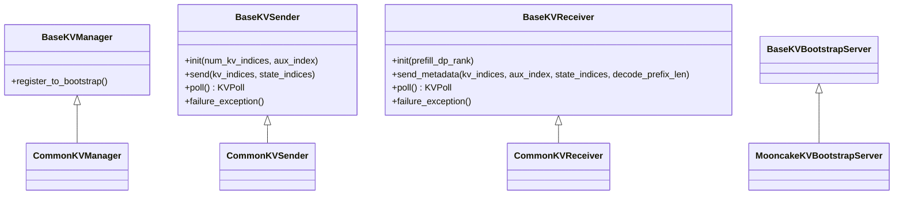

角色分工：

| 对象 | 在 prefill 侧 | 在 decode 侧 |
|---|---|---|
| `KVManager` | 管理 prefill 侧 KV buffer，注册到 bootstrap server。 | 管理 decode 侧 KV buffer，查询 prefill parallel info。 |
| `KVSender` | 持有一个请求的 sender，负责把 prefill KV 发出去。 | 不使用。 |
| `KVReceiver` | 不使用。 | 持有一个请求的 receiver，负责把 decode 侧 KV indices/metadata 发给 prefill，并轮询 transfer。 |
| `KVBootstrapServer` | 暴露 prefill server 的 parallel / KV 信息。 | decode 侧通过 bootstrap 地址查询 prefill 信息。 |

### 5.4 backend 注册

`python/sglang/srt/disaggregation/utils.py:get_kv_class()` 根据 transfer backend 返回具体类：

| backend | Manager | Sender | Receiver | BootstrapServer |
|---|---|---|---|---|
| Mooncake | `MooncakeKVManager` | `MooncakeKVSender` | `MooncakeKVReceiver` | `MooncakeKVBootstrapServer` |
| NIXL | `NixlKVManager` | `NixlKVSender` | `NixlKVReceiver` | `NixlKVBootstrapServer` |
| Mori | `MoriKVManager` | `MoriKVSender` | `MoriKVReceiver` | `MoriKVBootstrapServer` |
| Ascend | `AscendKVManager` | `AscendKVSender` | `AscendKVReceiver` | `AscendKVBootstrapServer` |
| Fake | `FakeKVManager` | `FakeKVSender` | `FakeKVReceiver` | Fake/testing backend |

第一遍读源码时不要一上来读 Mooncake/NIXL 的底层传输细节。先理解 `BaseKVSender.init/send/poll` 与 `BaseKVReceiver.init/send_metadata/poll` 这两个抽象，后端只是把这几个动作落到不同通信库上。

---

## 6. Prefill server 生命周期

`python/sglang/srt/disaggregation/prefill.py` 文件头已经给了最好的主线：

```text
1. Bootstrap Queue
2. Waiting Queue
3. Inflight Queue
```

展开后是：

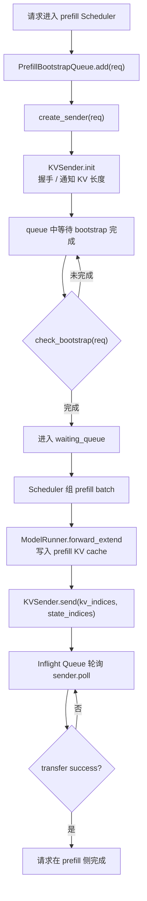

### 6.1 Bootstrap Queue

`PrefillBootstrapQueue` 的职责是“在真正 prefill forward 之前，把 transfer 的控制面准备好”。

关键函数：

| 函数 | 做什么 |
|---|---|
| `__init__()` | 保存 KV pool、metadata buffer、rank、bootstrap port、scheduler，并创建 `kv_manager`。 |
| `_init_kv_manager()` | 从 `token_to_kv_pool`、draft KV pool、metadata buffer 中收集指针和长度，构造 `KVArgs`，再通过 `get_kv_class()` 创建 backend manager。 |
| `create_sender(req, num_kv_heads)` | 为单个请求创建 `KVSender`，绑定 `bootstrap_addr`、`bootstrap_room`、目标 TP rank 等信息。 |
| `ensure_metadata_buffer(req)` | 为请求分配辅助 metadata buffer slot。 |
| `add(req, num_kv_heads)` | 把请求加入 bootstrap queue，等待 sender/receiver 握手和 decode 侧预分配完成。 |

`create_sender()` 里最关键的是这段关系：

```text
req.disagg_kv_sender = kv_sender_class(
    mgr=self.kv_manager,
    bootstrap_addr=f"{req.bootstrap_host}:{self.bootstrap_port}",
    bootstrap_room=req.bootstrap_room,
    dest_tp_ranks=[self.tp_rank],
    pp_rank=self.pp_rank,
)
```

它说明 sender 是“按请求”创建的，而 manager 是“按 rank / scheduler”创建的。

### 6.2 Waiting Queue

当 `check_bootstrap(req)` 返回完成后，请求进入普通 waiting queue。此时它和普通 prefill 请求很像：Scheduler 会把它放进 `ScheduleBatch`，执行 extend/prefill forward。

不同点在于：

- 这个请求已经有 `disagg_kv_sender`。
- 它可能有 `metadata_buffer_index`。
- prefill 完成后不能直接进入本地 decode，而是要发 KV 给 decode 侧。

### 6.3 Inflight Queue

prefill forward 写完 KV cache 后，prefill 侧会调用 sender 的 `send()`，把指定 `kv_indices` 对应的 KV 传输给 decode。

Inflight Queue 负责轮询 transfer：

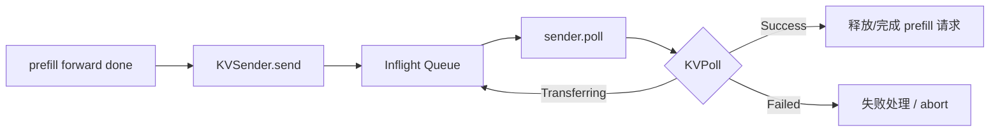

---

## 7. Decode server 生命周期

`python/sglang/srt/disaggregation/decode.py` 文件头把 decode 侧分成四段：

```text
1. PreallocQueue
2. TransferQueue
3. WaitingQueue
4. RunningBatch
```

展开后是：

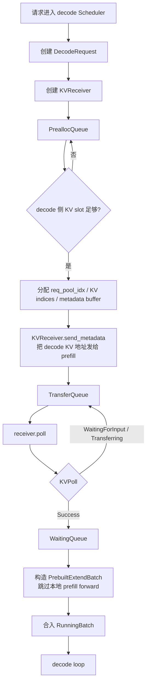

### 7.1 `DecodeReqToTokenPool`

普通 `ReqToTokenPool` 的容量约束是：

```text
#pre-allocated + #transfer + #running <= max_running_requests
```

decode 侧为了让 prefill 尽早开始，需要提前预分配一些还没进入 running batch 的请求。因此 `DecodeReqToTokenPool` 扩展了容量：

```text
#running <= max_running_requests
#pre-allocated + #transfer <= pre_alloc_size
```

这也是 decode 侧和普通 Scheduler 最大的内存池差异之一：decode server 需要容纳“正在等 KV transfer 的请求”。

### 7.2 PreallocQueue

PreallocQueue 的职责：

1. 创建或持有 `KVReceiver`。
2. 等待 decode 侧 KV cache 有足够空间。
3. 分配 `req_pool_idx` 与 KV indices。
4. 调用 `receiver.send_metadata(...)`，把 decode 侧地址告诉 prefill。
5. 把请求移动到 TransferQueue。

### 7.3 TransferQueue

TransferQueue 负责轮询 receiver：

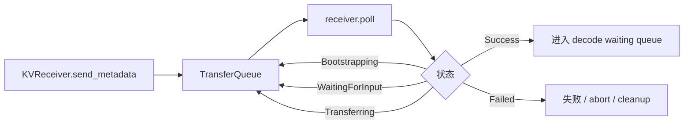

这里最重要的概念是：decode 侧并不计算 prompt prefill，但它要先知道 prompt 的 KV cache 已经被写入自己的 KV pool。只有 `KVPoll.Success` 后，请求才能进入后续 decode。

### 7.4 WaitingQueue 到 RunningBatch

当 transfer 成功后，decode 侧会构造一个“prebuilt extend batch”。它不是为了重新跑 prefill，而是为了把请求的 metadata、seq len、KV indices、prefix 状态等放到 Scheduler 能理解的 batch 结构里。

然后请求合入 `running_batch`，之后就和普通 decode 请求一样，每轮生成新 token。

---

## 8. Prefill 与 Decode 的镜像关系

| 维度 | Prefill server | Decode server |
|---|---|---|
| 请求入口 | 接收带 bootstrap 信息的 prefill 请求 | 通常作为用户入口，创建 decode 请求 |
| 核心队列 | Bootstrap Queue、Waiting Queue、Inflight Queue | PreallocQueue、TransferQueue、WaitingQueue、RunningBatch |
| KV 对象 | `KVSender` | `KVReceiver` |
| KVManager 角色 | 暴露 prefill KV buffer，注册 bootstrap server | 查询 prefill parallel info，管理 decode KV buffer |
| 计算动作 | 真的执行 prompt prefill forward | 不重新算 prompt prefill，只接收 KV |
| 完成条件 | prefill forward + KV transfer success | KV transfer success 后进入 decode loop |
| 失败处理 | sender failure / bootstrap timeout / abort | receiver failure / prealloc 不足 / transfer timeout / abort |

可以把它想成一次“搬家”：

- Decode 侧先准备好房间和门牌号：KV slot、metadata buffer、bootstrap room。
- Prefill 侧负责生产家具：prompt KV cache。
- Transfer backend 负责把家具搬到 decode 侧指定房间。
- Decode 侧确认家具到位后，开始正常生活：进入 decode loop。

---

## 9. 和 Scheduler 主循环的关系

PD 分离并没有换掉 Scheduler，而是让 Scheduler 在不同模式下多维护几类队列。

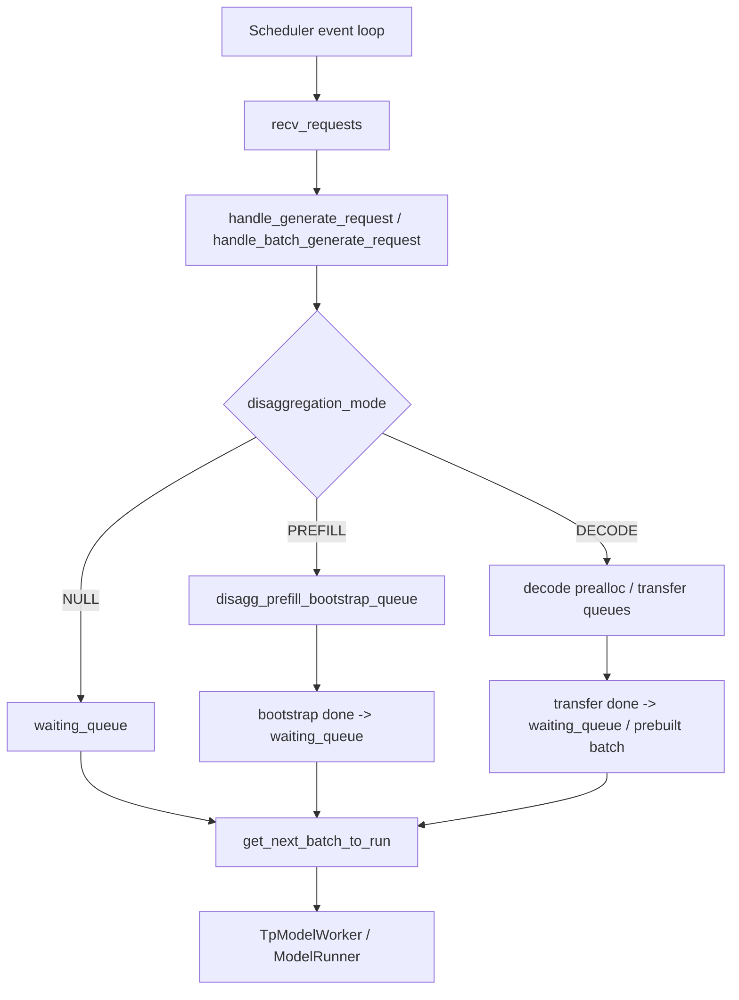

### 9.1 `is_idle()` 为什么要看更多队列

普通模式下，Scheduler 是否 idle 主要看 waiting/running queue。PD 模式下还要看：

- prefill 的 bootstrap queue
- prefill 的 inflight transfer
- decode 的 prealloc queue
- decode 的 transfer queue

否则会出现“Scheduler 以为自己空闲，但其实还有请求在等待 KV transfer”的错误判断。

### 9.2 abort 为什么更复杂

普通请求 abort 只需要从 waiting/running 中移除并释放 KV。PD 请求可能处在：

- prefill bootstrap queue
- prefill waiting queue
- prefill inflight transfer
- decode prealloc queue
- decode transfer queue
- decode running batch

不同阶段需要清理的对象不同：metadata buffer、req pool slot、KV slot、sender/receiver 状态、bootstrap room 状态都可能要处理。

---

## 10. 和 KV Cache / Radix Cache 的关系

PD 分离不是替代 KV cache，而是改变 KV cache 的生产位置和消费位置。

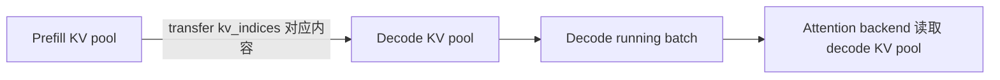

### 10.1 prefill 侧

prefill 侧会正常执行 prompt forward，因此它会：

- 分配 prefill 侧 KV cache slot。
- 写入 prompt 的 KV。
- 根据 `kv_indices` 把这些 KV 发送出去。
- transfer 完成后释放或回收 prefill 侧请求资源。

### 10.2 decode 侧

decode 侧需要提前分配目标 KV slot，因为 transfer 要写入这些 slot：

- `DecodeReqToTokenPool` 记录请求到 token slot 的映射。
- KV allocator 分配 decode 侧目标 KV indices。
- `KVReceiver.send_metadata()` 把这些 indices 通知 prefill。
- transfer 完成后，decode attention backend 就能像普通请求一样读取这些 KV。

### 10.3 Radix cache / HiCache

PD 模式也会遇到 prefix cache：

- decode 侧可能先做 prefix match，判断哪些 KV 已经可以复用。
- prefill 侧可能只需要计算未命中的部分。
- HiCache 模式下，decode 侧还有 restore/load-back 相关状态，`decode_hicache_mixin.py` 会参与 prealloc/transfer 流程。

第一遍读 PD 时，可以先按“没有 prefix cache 命中”的路径理解。第二遍再叠加 Radix/HiCache。

---

## 11. 和 TP / PP / DP 的关系

PD 分离本身不是 TP/PP/DP 的替代品。prefill server 和 decode server 内部仍然可以各自使用 TP、PP、DP、EP。

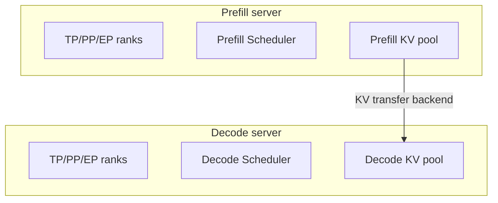

几个关键点：

| 并行 | 在 PD 中的影响 |
|---|---|
| TP | prefill 和 decode 侧可能都有 TP rank。transfer backend 需要知道目标 TP rank 和 KV head 分片。 |
| PP | prefill 侧每个 PP stage 可能只负责部分 layer，因此 `KVArgs` 里有 `pp_rank`、`prefill_start_layer`、`prefill_end_layer`。 |
| DP | 多个 prefill/decode 副本时，bootstrap room 和 routing 必须确保同一请求的两端匹配。 |
| DP attention / CP | transfer 时要考虑 attention TP/CP 的 KV 切分方式，metadata 里要保留足够信息。 |
| EP / MoE | MoE 不直接改变 KV cache 的语义，但会影响模型 rank 和 forward 执行过程。 |

`KVArgs` 中的 `kv_head_num`、`total_kv_head_num`、`pp_rank`、`prefill_start_layer`、`prefill_end_layer` 就是在为这些并行组合提供信息。

---

## 12. 一次 PD 请求的完整时序

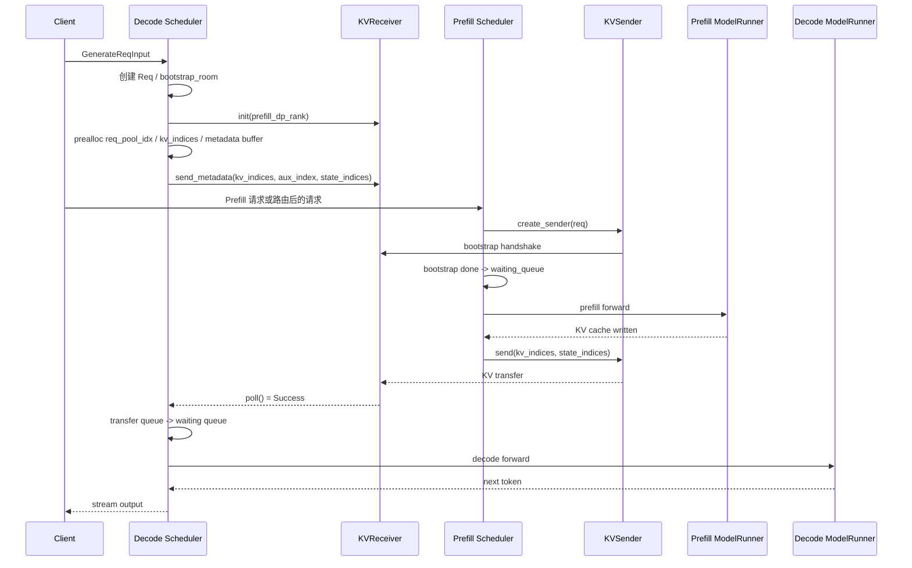

---

## 12.1 更细的模块通信视角

上一张时序图是逻辑视角；真正读源码时，需要再把它拆成几类通信：

| 通信类型 | 谁和谁通信 | 传递内容 | 代码入口 |
|---|---|---|---|
| 请求入口 IPC | `TokenizerManager -> Decode Scheduler` 或 `TokenizerManager -> Prefill Scheduler` | `TokenizedGenerateReqInput` / `BatchTokenizedGenerateReqInput`，包含 token ids、sampling params、bootstrap fields | `SchedulerRequestReceiver.recv_requests()`、`Scheduler.handle_generate_request()` |
| Scheduler 内部队列移动 | Scheduler event loop 内部 | `Req`、`DecodeRequest`、`ScheduleBatch` | `handle_batch_generate_request()`、`PrefillBootstrapQueue.add()`、`DecodePreallocQueue.add()` |
| bootstrap 信息查询 | decode 侧 `KVManager -> prefill bootstrap server` | prefill parallel info、dp rank、tp/pp 拓扑、bootstrap room routing | `CommonKVManager.try_ensure_parallel_info()`、后端 `KVBootstrapServer` |
| decode 到 prefill 的 metadata 通知 | `KVReceiver -> KVSender / prefill manager` | decode 侧 `kv_indices`、`aux_index`、`state_indices`、`decode_prefix_len` | `BaseKVReceiver.send_metadata()`、`DecodePreallocQueue` 中调用 `kv_receiver.send_metadata(...)` |
| prefill 到 decode 的 KV 数据传输 | `KVSender -> KVReceiver / decode KV buffer` | page-aligned KV cache blocks、Mamba/SWA/DSA state、aux metadata | `BaseKVSender.send()`、`SchedulerDisaggregationPrefillMixin.send_kv_chunk()` |
| transfer 状态轮询 | prefill / decode 各自队列轮询 sender/receiver | `KVPoll.Bootstrapping / WaitingForInput / Transferring / Success / Failed` | `poll_and_all_reduce*()`、`DecodeTransferQueue`、`process_disagg_prefill_inflight_queue()` |
| 输出回流 IPC | `Decode Scheduler -> DetokenizerManager -> TokenizerManager` | `BatchTokenIDOutput`、`BatchStrOutput`、finish reason、logprob | `SchedulerOutputStreamer`、`DetokenizerManager.handle_batch_token_id_out()` |

注意这里有两条路径：

- **控制路径**：请求对象、bootstrap room、metadata、状态轮询。
- **数据路径**：真正的 KV cache block / state buffer 传输。

PD 分离难读，就是因为这两条路径交织在一起：decode 侧先走控制路径告诉 prefill “我的 KV 位置在哪里”，prefill 侧完成计算后才走数据路径把 KV 写过去。

---

## 12.2 端到端调用流程：从 decode 入口到首个 decode token

下面按“谁调用谁”展开一次最典型的请求。为了便于第一遍阅读，这里先假设：

- 请求从 decode server 入口进入。
- prefill server 也会收到对应请求或由上层路由到对应 prefill 实例。
- 无 HiCache restore。
- 无 PP。
- 无 optimistic prefill retry。
- transfer backend 只看抽象，不展开 Mooncake/NIXL 线程细节。

### 阶段 A：Decode server 接收请求并进入 prealloc

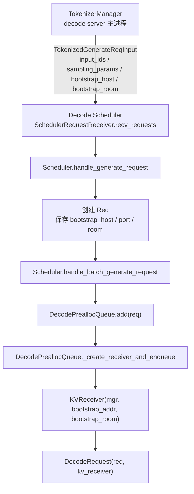

这一阶段传递的主要内容：

| 对象 | 关键字段 | 用途 |
|---|---|---|
| `TokenizedGenerateReqInput` | `input_ids`、`sampling_params`、`bootstrap_host`、`bootstrap_port`、`bootstrap_room` | 从 tokenizer 侧进入 decode Scheduler 的请求对象。 |
| `Req` | `origin_input_ids`、`sampling_params`、`bootstrap_*` | Scheduler 内部的请求状态。 |
| `DecodeRequest` | `req`、`kv_receiver`、`metadata_buffer_index` | decode PD 队列内部对象，把普通 `Req` 和 transfer receiver 绑在一起。 |
| `KVReceiver` | `bootstrap_addr`、`bootstrap_room` | 后续负责通知 prefill 侧目标 KV 地址，并轮询 transfer。 |

对应源码定位：

- `python/sglang/srt/managers/scheduler_components/request_receiver.py` / `SchedulerRequestReceiver.recv_requests()`
- `python/sglang/srt/managers/scheduler.py` / `Scheduler.handle_generate_request()`
- `python/sglang/srt/managers/scheduler.py` / `Scheduler.handle_batch_generate_request()`
- `python/sglang/srt/disaggregation/decode.py` / `DecodePreallocQueue.add()`
- `python/sglang/srt/disaggregation/decode.py` / `DecodePreallocQueue._create_receiver_and_enqueue()`

### 阶段 B：Decode server 查询 prefill 信息并预分配目标 KV

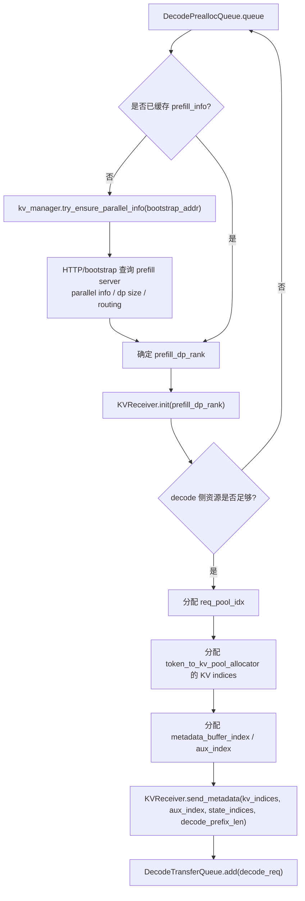

这一阶段最关键的动作不是传 KV，而是告诉 prefill：

```text
请把 bootstrap_room = X 的请求，对应的 prompt KV，
写到 decode 侧这些 kv_indices / aux_index / state_indices 上。
```

传递内容拆开看：

| 内容 | 从哪来 | 发给谁 | 作用 |
|---|---|---|---|
| `prefill_dp_rank` | `CommonKVManager.try_ensure_parallel_info()` 或 room routing | `KVReceiver.init()` | 确定请求应该找哪个 prefill DP rank。 |
| `kv_indices` | decode 侧 KV allocator | prefill sender | prefill 侧 transfer 的目标位置。 |
| `aux_index` / `metadata_buffer_index` | `ReqToMetadataIdxAllocator` | prefill sender | 用于写 output token、cached tokens、logprob、bootstrap room 校验等 metadata。 |
| `state_indices` | Mamba/SWA/DSA 等状态池 | prefill sender | 除普通 KV 之外的模型状态传输目标。 |
| `decode_prefix_len` | decode prefix match / cache 状态 | prefill sender | 告诉 prefill 哪部分 prefix 已在 decode 侧可复用。 |

源码定位：

- `python/sglang/srt/disaggregation/decode.py` / `DecodePreallocQueue._resolve_prefill_dp_rank()`
- `python/sglang/srt/disaggregation/common/conn.py` / `CommonKVManager.try_ensure_parallel_info()`
- `python/sglang/srt/disaggregation/decode.py` / `DecodePreallocQueue` 中调用 `kv_receiver.init(...)`
- `python/sglang/srt/disaggregation/decode.py` / `DecodePreallocQueue` 中调用 `kv_receiver.send_metadata(...)`
- `python/sglang/srt/disaggregation/decode.py` / `DecodeTransferQueue.add()`

### 阶段 C：Prefill server 接收请求并创建 sender

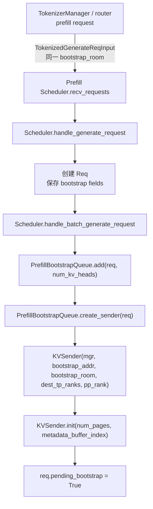

prefill 侧和 decode 侧都持有同一个 `bootstrap_room`。它们不是通过 Python 对象共享状态，而是通过 bootstrap server / transfer backend 把 room 映射到对应 sender/receiver 状态。

`PrefillBootstrapQueue.create_sender()` 传给 sender 的信息：

| 参数 | 含义 |
|---|---|
| `mgr=self.kv_manager` | 当前 prefill rank 的 KV manager，知道本 rank KV buffer 指针。 |
| `bootstrap_addr=f"{req.bootstrap_host}:{self.bootstrap_port}"` | decode 或 bootstrap 对端地址。 |
| `bootstrap_room=req.bootstrap_room` | 请求级 transfer room。 |
| `dest_tp_ranks=[self.tp_rank]` | 目标 TP rank。 |
| `pp_rank=self.pp_rank` | PP 场景下当前 prefill stage。 |

源码定位：

- `python/sglang/srt/disaggregation/prefill.py` / `PrefillBootstrapQueue.add()`
- `python/sglang/srt/disaggregation/prefill.py` / `PrefillBootstrapQueue.create_sender()`
- `python/sglang/srt/disaggregation/prefill.py` / `PrefillBootstrapQueue._process_req()`

### 阶段 D：Prefill event loop 等 bootstrap 完成，然后跑 prefill forward

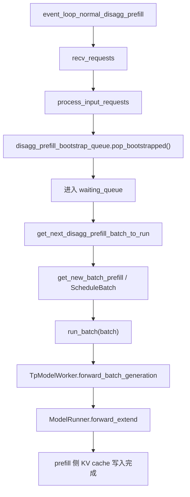

这一阶段是普通 prefill forward 和 PD 控制面的交汇点：

- `pop_bootstrapped()` 只把 sender/receiver 握手完成的请求放进 waiting queue。
- `get_next_disagg_prefill_batch_to_run()` 仍然复用 Scheduler 的 prefill batch 构造。
- `run_batch()` 仍然进入 `TpModelWorker -> ModelRunner`。
- 模型 forward 写入的是 prefill server 本地 KV cache。

源码定位：

- `python/sglang/srt/disaggregation/prefill.py` / `SchedulerDisaggregationPrefillMixin.event_loop_normal_disagg_prefill()`
- `python/sglang/srt/disaggregation/prefill.py` / `SchedulerDisaggregationPrefillMixin.get_next_disagg_prefill_batch_to_run()`
- `python/sglang/srt/managers/tp_worker.py` / `TpModelWorker.forward_batch_generation()`
- `python/sglang/srt/model_executor/model_runner.py` / `ModelRunner.forward_extend()`

### 阶段 E：Prefill forward 结束后发送 KV 和 metadata

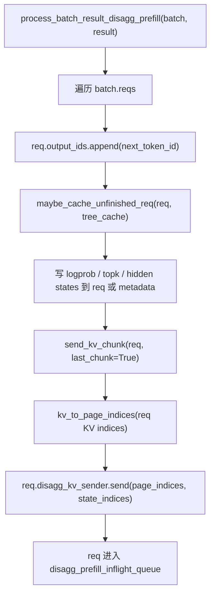

这一阶段传递的内容分两类：

| 类型 | 内容 | 目的 |
|---|---|---|
| KV 数据 | `page_indices` 对应的 K/V cache block | 让 decode 侧得到 prompt KV。 |
| 辅助 metadata | `next_token_id`、`cached_tokens`、logprob、top-k、hidden states、`bootstrap_room` | 让 decode 侧恢复请求状态，并校验 metadata 没串 room。 |

`send_kv_chunk()` 会处理 page 对齐、state indices、是否应该发送当前 chunk 等细节。对于 chunked prefill，它可能不是只调用一次；对于普通 prefill，通常最后一个 chunk 会 `last_chunk=True`。

源码定位：

- `python/sglang/srt/disaggregation/prefill.py` / `SchedulerDisaggregationPrefillMixin.process_batch_result_disagg_prefill()`
- `python/sglang/srt/disaggregation/prefill.py` / `SchedulerDisaggregationPrefillMixin.send_kv_chunk()`
- `python/sglang/srt/disaggregation/base/conn.py` / `BaseKVSender.send()`

### 阶段 F：Prefill 侧 inflight 队列轮询 transfer 完成

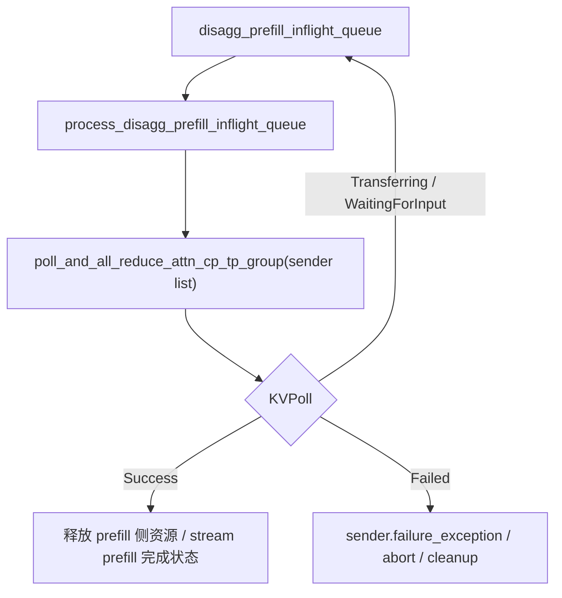

为什么要 `all_reduce`？

在 TP、attention TP、CP 等多 rank 场景下，一个请求的 transfer 状态必须在相关 rank 上一致。否则某些 rank 以为请求完成，另一些 rank 仍在等待，就会造成队列分歧或 collective 卡住。

源码定位：

- `python/sglang/srt/disaggregation/prefill.py` / `SchedulerDisaggregationPrefillMixin.process_disagg_prefill_inflight_queue()`
- `python/sglang/srt/disaggregation/utils.py` / `poll_and_all_reduce_attn_cp_tp_group()`

### 阶段 G：Decode 侧 transfer queue 确认成功并 commit 到 Req

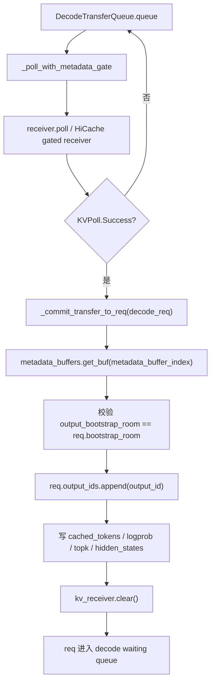

`_commit_transfer_to_req()` 是 decode 侧很关键的函数。它不是只看 KV 是否到了，还要把 prefill 侧生成的请求状态合并回 decode 侧 `Req`。

commit 的主要内容：

| 内容 | 从哪里来 | 写到哪里 |
|---|---|---|
| `output_id` | metadata buffer | `decode_req.req.output_ids` |
| `cached_tokens` | metadata buffer | `req.cached_tokens`、`req.already_computed` |
| `output_token_logprobs_*` | metadata buffer | `req.logprob` |
| `output_topk_*` | metadata buffer | speculative decoding 相关字段 |
| `output_hidden_states` | metadata buffer | `req.hidden_states_tensor` |
| `output_bootstrap_room` | metadata buffer | 用于校验是否发生 metadata buffer 串写 |

源码定位：

- `python/sglang/srt/disaggregation/decode.py` / `DecodeTransferQueue._poll_with_metadata_gate()`
- `python/sglang/srt/disaggregation/decode.py` / `DecodeTransferQueue._commit_transfer_to_req()`

### 阶段 H：Decode 侧构造 prebuilt batch，进入正常 decode loop

```mermaid
flowchart TD
  A["transfer success 的 Req"] --> B["decode waiting queue"]
  B --> C["构造 PrebuiltExtendBatch / prepare_for_prebuilt"]
  C --> D["合并到 running_batch"]
  D --> E["ScheduleBatch.prepare_for_decode"]
  E --> F["TpModelWorker.forward_batch_generation"]
  F --> G["ModelRunner.forward_decode"]
  G --> H["Sampler.sample"]
  H --> I["SchedulerOutputStreamer -> DetokenizerManager"]
```

这里“prebuilt extend”容易误解：decode 侧不是重新跑 prompt prefill，而是把已经 transfer 完成的 KV 和请求 metadata 接回 Scheduler 的 batch 结构中。之后请求就像普通 running request 一样，每轮 decode 一个 token。

源码定位：

- `python/sglang/srt/disaggregation/decode.py` / `SchedulerDisaggregationDecodeMixin`
- `python/sglang/srt/disaggregation/decode_schedule_batch_mixin.py` / `ScheduleBatchDisaggregationDecodeMixin`
- `python/sglang/srt/managers/schedule_batch.py` / `ScheduleBatch.prepare_for_decode()`
- `python/sglang/srt/model_executor/model_runner.py` / `ModelRunner.forward_decode()`

---

## 12.3 两个 server 的 event loop 对照

### Prefill server event loop

```mermaid
flowchart TD
  A["event_loop_normal_disagg_prefill"] --> B["recv_requests"]
  B --> C["process_input_requests"]
  C --> D["pop_bootstrapped -> waiting_queue"]
  D --> E["get_next_disagg_prefill_batch_to_run"]
  E --> F{"batch?"}
  F -->|"有"| G["run_batch"]
  G --> H["process_batch_result_disagg_prefill"]
  H --> I["send_kv_chunk / inflight_queue"]
  F -->|"无"| J["on_idle"]
  I --> K["process_disagg_prefill_inflight_queue"]
  J --> K
  K --> A
```

### Decode server event loop

```mermaid
flowchart TD
  A["event_loop_normal_disagg_decode"] --> B["recv_requests"]
  B --> C["process_input_requests"]
  C --> D["DecodePreallocQueue<br/>resolve prefill info + alloc KV + send_metadata"]
  D --> E["DecodeTransferQueue<br/>poll receiver + commit metadata"]
  E --> F["resolved reqs -> waiting/prebuilt"]
  F --> G["get_next_batch_to_run"]
  G --> H{"batch?"}
  H -->|"有"| I["run_batch<br/>decode forward"]
  I --> J["process_batch_result<br/>stream token"]
  H -->|"无"| K["on_idle"]
  J --> A
  K --> A
```

两个 loop 的本质差异：

| 对照项 | Prefill server | Decode server |
|---|---|---|
| 请求进入后的第一站 | `PrefillBootstrapQueue` | `DecodePreallocQueue` |
| 什么时候能跑模型 | bootstrap 完成后 | transfer 成功并 commit 后 |
| 模型 forward 模式 | prefill / extend | decode |
| forward 后做什么 | 发送 KV，进入 inflight queue | 采样 next token，输出给用户 |
| 队列中轮询谁 | `KVSender.poll()` | `KVReceiver.poll()` |

---

## 12.4 传递内容总表

| 阶段 | 发送方 | 接收方 | 载体 / 对象 | 关键字段 / 内容 | 目的 |
|---|---|---|---|---|---|
| 请求进入 decode | `TokenizerManager` | `Decode Scheduler` | `TokenizedGenerateReqInput` | token ids、sampling params、rid、bootstrap fields | 创建 decode 侧 `Req`。 |
| 请求进入 prefill | `TokenizerManager` / router | `Prefill Scheduler` | `TokenizedGenerateReqInput` | 同一 prompt、同一 `bootstrap_room` | 创建 prefill 侧 `Req`。 |
| prefill 信息查询 | `Decode KVManager` | `Prefill bootstrap server` | HTTP / backend control request | prefill dp size、parallel info、routing info | 确定 receiver 应该连哪个 prefill rank。 |
| receiver 初始化 | `DecodePreallocQueue` | `KVReceiver` | 方法调用 | `prefill_dp_rank` | 让 receiver 绑定正确 prefill 对端。 |
| decode 侧 metadata 通知 | `KVReceiver` | `KVSender` / prefill backend | backend metadata 消息 | `kv_indices`、`aux_index`、`state_indices`、`decode_prefix_len` | 告诉 prefill KV 要写到哪里。 |
| prefill forward | `Prefill Scheduler` | `ModelRunner` | `ScheduleBatch -> ForwardBatch` | input ids、positions、cache loc | 计算 prompt KV。 |
| KV 数据传输 | `KVSender` | `KVReceiver` / decode KV buffer | backend 数据传输 | page indices 对应 KV block、state buffer | 把 prefill 侧 KV 写到 decode 侧。 |
| metadata commit | `DecodeTransferQueue` | decode `Req` | `MetadataBuffers.get_buf()` | output token、cached tokens、logprob、topk、hidden states、bootstrap room | 恢复请求状态，确认 transfer 属于正确请求。 |
| decode 输出 | `Decode Scheduler` | `DetokenizerManager` | `BatchTokenIDOutput` | token ids、finish reason、logprob | 返回用户可读文本前的 token 输出。 |

---

## 12.5 源码跟读清单：按调用顺序走一遍

如果你要在 IDE 里按调用链阅读，建议按下面顺序点开：

| 顺序 | 调用点 | 读什么 |
|---:|---|---|
| 1 | `SchedulerRequestReceiver.recv_requests()` | 看 tokenized 请求如何进入 decode/prefill Scheduler。 |
| 2 | `Scheduler.handle_generate_request()` | 看 `bootstrap_host/port/room` 如何写入 `Req`。 |
| 3 | `Scheduler.handle_batch_generate_request()` | 看 `DisaggregationMode.PREFILL/DECODE` 如何分流。 |
| 4 | `DecodePreallocQueue.add()` | 看 decode 侧如何创建 `DecodeRequest` 和 `KVReceiver`。 |
| 5 | `DecodePreallocQueue._resolve_prefill_dp_rank()` | 看如何根据 prefill info / bootstrap room 选择 prefill DP rank。 |
| 6 | `DecodePreallocQueue` 中 `kv_receiver.send_metadata(...)` | 看 decode 侧把哪些目标 KV 信息发给 prefill。 |
| 7 | `PrefillBootstrapQueue.add()` | 看 prefill 侧如何创建 `KVSender`。 |
| 8 | `event_loop_normal_disagg_prefill()` | 看 prefill loop 如何等待 bootstrap 完成后再组 batch。 |
| 9 | `process_batch_result_disagg_prefill()` | 看 prefill forward 后如何写 metadata、调用 `send_kv_chunk()`。 |
| 10 | `send_kv_chunk()` | 看 page indices / state indices 如何交给 `KVSender.send()`。 |
| 11 | `DecodeTransferQueue._poll_with_metadata_gate()` | 看 decode 侧如何判断 transfer 是否真的可 commit。 |
| 12 | `DecodeTransferQueue._commit_transfer_to_req()` | 看 metadata 如何合并回 decode 侧 `Req`。 |
| 13 | `ScheduleBatchDisaggregationDecodeMixin` | 看 transfer 成功后的请求如何变成 prebuilt batch。 |
| 14 | `ModelRunner.forward_decode()` | 看请求回到普通 decode forward。 |

---

## 13. 失败、超时和重试

PD 分离把一次请求拆成两个 server 的协作，因此失败场景比普通模式多。

| 场景 | 可能原因 | 相关代码 |
|---|---|---|
| bootstrap 超时 | prefill 或 decode 侧没有及时完成握手 | `KVPoll.Bootstrapping`、sender/receiver `failure_exception()` |
| decode 侧 prealloc 不足 | KV cache 不够，无法给请求预留位置 | decode `PreallocQueue`、`DecodeReqToTokenPool.available_size()` |
| transfer 失败 | 后端连接失败、对端退出、IB/NIXL/Mooncake 错误 | backend `KVSender.poll()`、`KVReceiver.poll()` |
| abort | 用户取消请求或 Scheduler 控制请求 | `prepare_abort()`、prefill/decode 各自队列清理 |
| optimistic prefill retry | prefill 先做乐观计算，但 bootstrap 没及时完成，需要回退 | `should_force_retry()`、`handle_pending_bootstrap()` |

读源码时要注意：很多失败处理不会直接抛到最外层，而是先把状态写成 `KVPoll.Failed`，然后由队列轮询阶段统一清理。

---

## 14. 第一遍阅读建议：先走最简单路径

建议第一遍假设：

- 单节点。
- 无 PP。
- 无 DP attention。
- 无 HiCache restore。
- 无 prefix cache 命中。
- transfer backend 先当作抽象，不深入 Mooncake/NIXL 细节。

最简路径：

```mermaid
flowchart TD
  A["Decode request"] --> B["Decode prealloc KV slot"]
  B --> C["Receiver.send_metadata"]
  C --> D["Prefill create_sender"]
  D --> E["Prefill forward"]
  E --> F["Sender.send KV"]
  F --> G["Receiver.poll success"]
  G --> H["Decode running batch"]
```

掌握这条路径后，再打开复杂分支：

1. chunked prefill 与 optimistic retry。
2. PP 下 layer 范围和 `prefill_start_layer/end_layer`。
3. HiCache restore。
4. Mooncake/NIXL 的真实 transfer 线程。
5. 多 DP prefill/decode routing。

---

## 15. 常见困惑

### 15.1 PD 分离是不是把模型切成两半？

不是。PD 分离不是 layer 级切分。prefill server 和 decode server 通常都可以加载模型，只是它们服务的阶段不同：prefill server 负责 prompt prefill，decode server 负责后续 autoregressive decode。

### 15.2 decode server 为什么要先分配 KV？

因为 prefill 侧要把 KV 写入 decode 侧指定位置。没有目标 KV indices，transfer backend 不知道该写到 decode 侧哪个 slot。

### 15.3 prefill server 算完 prompt 后还会 decode 吗？

PD 模式下通常不会。prefill 侧计算 prompt KV，并把 KV transfer 出去；decode 侧接收 KV 后负责后续 token loop。

### 15.4 bootstrap room 是什么？

可以理解为一次请求的 transfer 房间号。sender 和 receiver 通过同一个 `bootstrap_room` 找到彼此，并区分不同请求的 transfer 状态。

### 15.5 为什么需要 metadata buffer？

KV cache 之外还有辅助状态需要同步，例如 request 校验信息、Mamba/SWA/DSA 等状态，或者 transfer 所需的额外 metadata。`MetadataBuffers` 和 `metadata_buffer_index` 就是为这些信息准备的。

### 15.6 PD 和 Radix cache 会不会冲突？

不会，但状态更复杂。Radix cache 关注 prefix KV 是否可复用；PD transfer 关注 KV 在 prefill 和 decode 两侧如何交接。decode 侧如果已有 prefix KV，可以减少 prefill 侧需要计算和传输的部分。

---

## 16. 本讲阅读任务

按下面顺序打开源码：

| 顺序 | 文件 | 函数 / 代码段 | 阅读重点 |
|---:|---|---|---|
| 1 | `python/sglang/srt/server_args.py` | `disaggregation_mode`、`disaggregation_bootstrap_port`、transfer backend 参数 | 先看有哪些启动开关。 |
| 2 | `python/sglang/srt/managers/scheduler.py` | `Scheduler.__init__()` 中 disaggregation 初始化分支 | 看 Scheduler 如何按 prefill/decode 模式创建不同队列。 |
| 3 | `python/sglang/srt/managers/scheduler.py` | `handle_generate_request()`、`handle_batch_generate_request()` | 看请求如何携带 bootstrap 信息并进入不同队列。 |
| 4 | `python/sglang/srt/disaggregation/base/conn.py` | `KVArgs`、`KVPoll`、`BaseKVSender`、`BaseKVReceiver` | 先理解统一抽象，不急着读后端实现。 |
| 5 | `python/sglang/srt/disaggregation/utils.py` | `KVClassType`、`get_kv_class()` | 看 backend 如何映射到 manager/sender/receiver。 |
| 6 | `python/sglang/srt/disaggregation/prefill.py` | `PrefillBootstrapQueue` | 看 prefill 侧如何创建 sender、准备 KVArgs、等待 bootstrap。 |
| 7 | `python/sglang/srt/disaggregation/prefill.py` | `SchedulerDisaggregationPrefillMixin.handle_pending_bootstrap()`、`check_bootstrap()` | 看 prefill 请求如何从 bootstrap queue 进入 waiting queue。 |
| 8 | `python/sglang/srt/disaggregation/decode.py` | `DecodeReqToTokenPool`、`DecodeRequest` | 看 decode 侧为什么需要预分配 request/token pool。 |
| 9 | `python/sglang/srt/disaggregation/decode.py` | PreallocQueue / TransferQueue 相关 `add()` 和 poll 逻辑 | 看 decode 侧如何等待 KV transfer 完成。 |
| 10 | `python/sglang/srt/disaggregation/mooncake/conn.py` | `MooncakeKVSender`、`MooncakeKVReceiver`、`MooncakeKVManager` | 第二遍再读真实 backend 的线程和网络细节。 |

---

## 17. 你应该带走的心智模型

```mermaid
flowchart TD
  A["Decode 侧先接请求"] --> B["预分配 decode KV slot"]
  B --> C["Receiver 把目标 KV indices 发给 Prefill"]
  C --> D["Prefill 侧计算 prompt KV"]
  D --> E["Sender 把 KV 写入 Decode 侧目标位置"]
  E --> F["Decode 确认 transfer success"]
  F --> G["请求进入 decode running batch"]
```

如果你能用自己的话解释下面这句话，就说明这一讲过关了：

> PD 分离不是把模型层切开，而是把请求生命周期切成 prefill server 和 decode server 两段；decode 侧先预留 KV cache 位置并通过 receiver 发出 metadata，prefill 侧计算 prompt KV 后通过 sender 传输到这些位置，transfer 成功后 decode 侧才开始正常的 token-by-token decode。

---

## 18. 下一讲预告

下一讲建议进入 **LoRA Serving / Adapter 热加载**：

- LoRA adapter 在请求、Scheduler、ModelRunner 中如何传递？
- 为什么 LoRA 会影响 batch 混排？
- `LoRAManager` 如何加载、缓存、卸载 adapter？
- LoRA 与 TP、CUDA graph、MoE buffer 有什么关系？
- 在线加载 LoRA 和权重热更新有什么区别？
