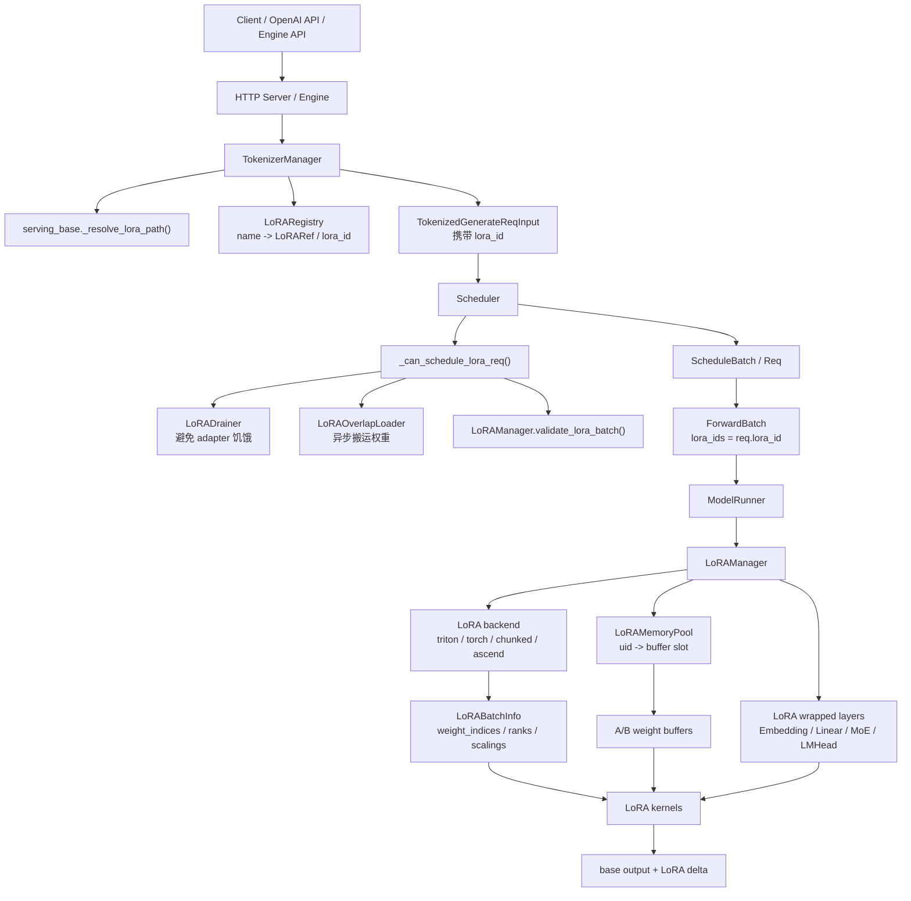
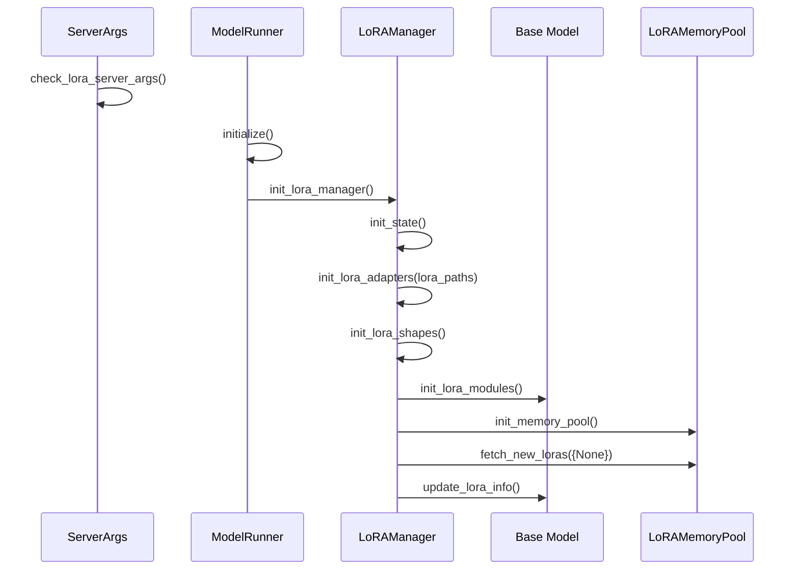
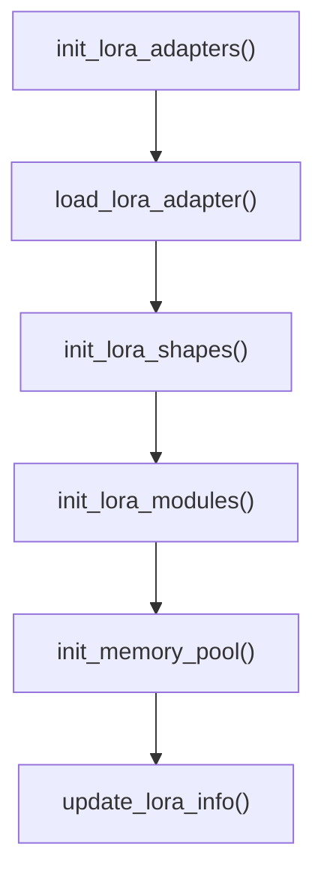
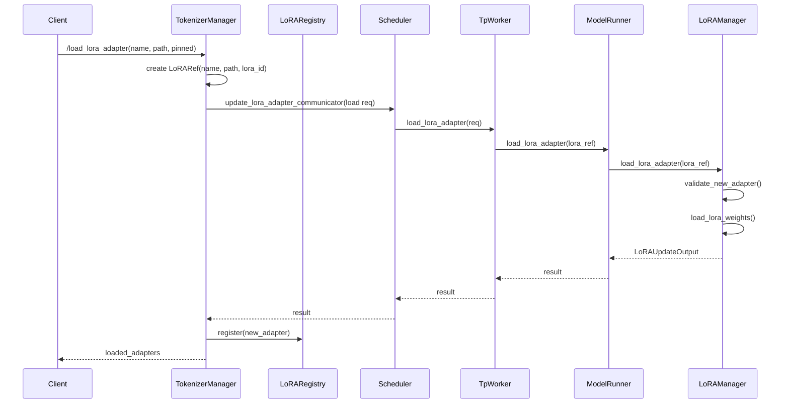
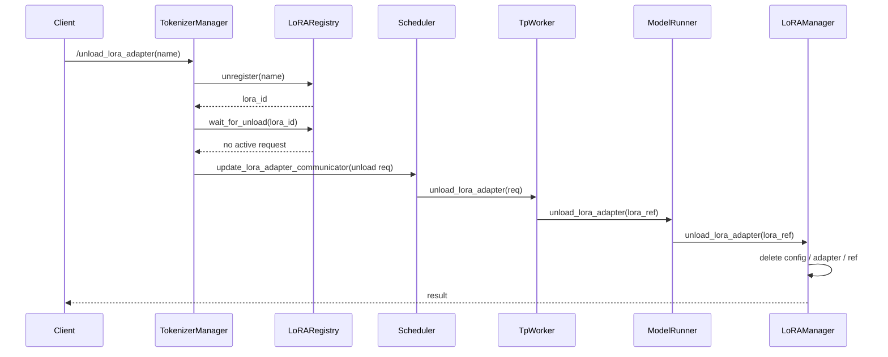
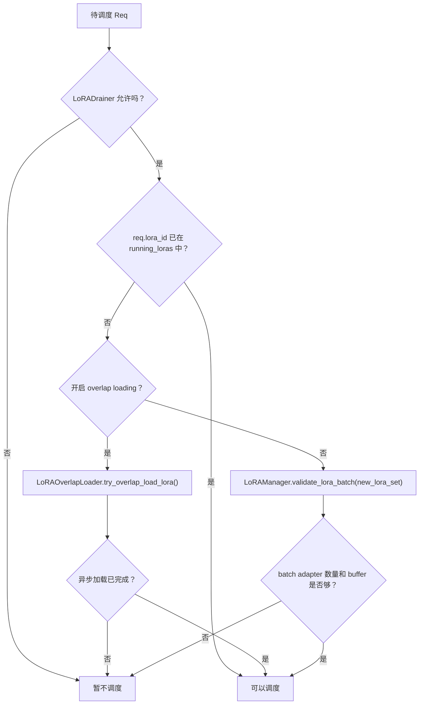
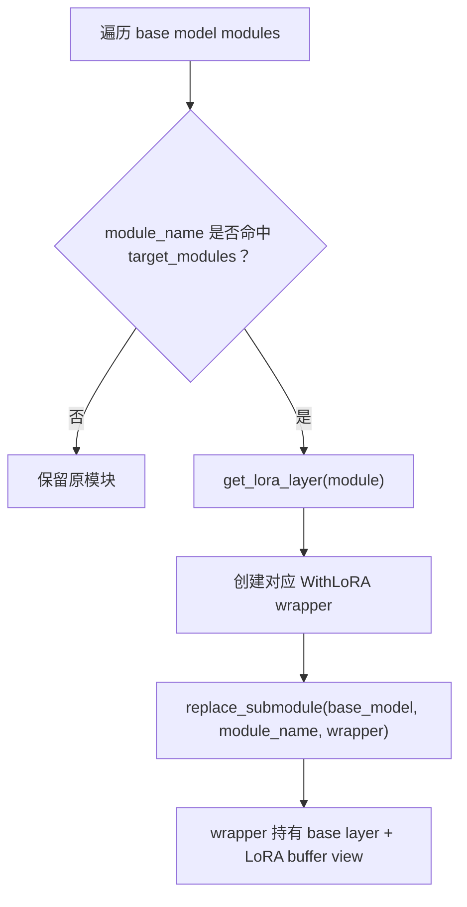
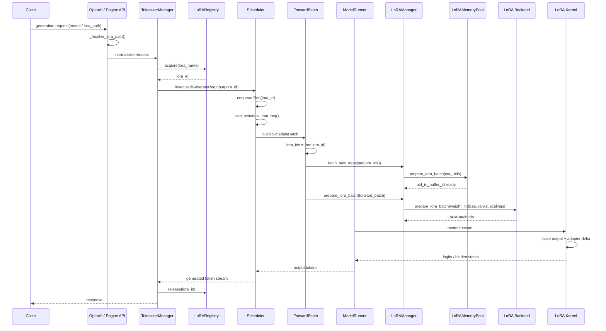

# 第 8 讲：LoRA Serving / Adapter 热加载

这一讲进入 SGLang 的 LoRA serving。它不是单纯“把 LoRA 权重加载进模型”这么简单，而是在一个正在服务的 base model 上，同时处理：

- 多个 adapter 的注册、引用、淘汰和卸载；
- 每个请求选择不同 adapter；
- Scheduler 把不同 adapter 的请求混到同一个 batch 时的容量约束；
- ModelRunner 在 forward 前准备 LoRA batch metadata；
- LoRA kernel 在 GPU 上把 base model 输出和 adapter delta 合并。

可以先把它理解成一句话：

> LoRA Serving = 控制面管理 adapter 生命周期 + 调度面控制 batch 中 adapter 种类 + 执行面把 adapter 权重映射到 LoRA kernel。

---

## 0. 全局架构图



这张图里最重要的分层是：

- **TokenizerManager / LoRARegistry**：决定某个 adapter 是否存在，是否允许新请求继续使用它。
- **Scheduler**：决定一个请求当前能不能被调度，因为一个 batch 里能同时出现的 LoRA adapter 数量有限。
- **TpWorker / ModelRunner / LoRAManager**：真正加载权重、包装模型层、准备 GPU buffer。
- **LoRA backend / LoRA layers**：真正执行 LoRA A/B 矩阵乘和结果融合。

---

## 1. 关键文件跳转表

| 主题 | 文件 / 函数或代码段 | 作用 |
| --- | --- | --- |
| LoRA 参数校验 | `python/sglang/srt/server_args.py` / `ServerArgs.check_lora_server_args()` | 解析 `--lora-paths`、校验 `max_loras_per_batch`、`max_loaded_loras`、`lora_target_modules` 等。 |
| 请求侧 adapter 解析 | `python/sglang/srt/entrypoints/openai/serving_base.py` / `_resolve_lora_path()` | 从请求的 `model` 或显式 `lora_path` 中解析要使用的 adapter。 |
| TokenizerManager 初始化 | `python/sglang/srt/managers/tokenizer_manager.py` / `init_lora()` | 在 tokenizer 进程中创建 LoRA registry、缓存初始 adapter 信息。 |
| 动态加载控制面 | `python/sglang/srt/managers/tokenizer_control_mixin.py` / `load_lora_adapter()`、`load_lora_adapter_from_tensors()`、`unload_lora_adapter()` | 处理 `/load_lora_adapter`、`/unload_lora_adapter` 等控制请求。 |
| adapter 注册表 | `python/sglang/srt/lora/lora_registry.py` / `LoRARef`、`LoRARegistry` | 维护 name 到 lora_id 的映射、并发引用计数、LRU 淘汰。 |
| Scheduler LoRA 入口 | `python/sglang/srt/managers/scheduler.py` / `init_lora_drainer()`、`init_lora_overlap_loader()`、`_can_schedule_lora_req()` | 判断 LoRA 请求是否能进入当前 batch。 |
| Scheduler 控制请求 | `python/sglang/srt/managers/scheduler.py` / `load_lora_adapter()`、`load_lora_adapter_from_tensors()`、`unload_lora_adapter()` | 把控制面请求转交给 `TpWorker`。 |
| Worker 转发 | `python/sglang/srt/managers/tp_worker.py` / `BaseTpWorker.load_lora_adapter()`、`load_lora_adapter_from_tensors()`、`unload_lora_adapter()` | 在 TP worker 侧调用 `ModelRunner`。 |
| 执行层 LoRA 管理 | `python/sglang/srt/model_executor/model_runner.py` / `init_lora_manager()`、`load_lora_adapter()`、`unload_lora_adapter()` | 初始化和调用 `LoRAManager`。 |
| LoRA 核心管理器 | `python/sglang/srt/lora/lora_manager.py` / `LoRAManager` | 加载 adapter、推断 target modules、包装模型层、准备 batch。 |
| GPU buffer 池 | `python/sglang/srt/lora/mem_pool.py` / `LoRAMemoryPool.prepare_lora_batch()` | 把当前 batch 需要的 adapter 放进有限 buffer slot。 |
| LoRA 层包装 | `python/sglang/srt/lora/layers.py` / `get_lora_layer()`、`BaseLayerWithLoRA` 及其子类 | 把 embedding、linear、MoE、lm_head 替换成支持 LoRA 的 wrapper。 |
| batch 元信息 | `python/sglang/srt/lora/utils.py` / `LoRABatchInfo`、`MoELoRABatchInfo` | 描述每条 request 对应哪个 adapter slot、rank、scaling。 |
| 后端准备 | `python/sglang/srt/lora/backend/triton_backend.py` / `prepare_lora_batch()` | 构造 kernel 需要的分段信息和 device tensor。 |
| ForwardBatch 接入 | `python/sglang/srt/model_executor/forward_batch_info.py` / `ForwardBatch.init_new()` 中 “Init lora information” 代码段 | 从 `ScheduleBatch.reqs` 取出 `lora_ids`，在 forward 前准备 LoRA。 |

---

## 2. LoRA 在 SGLang 中到底解决什么问题

LoRA serving 的目标是：**不复制 base model，只在同一个服务实例上为不同请求套用不同 adapter**。

例如：

- 请求 A 使用 base model；
- 请求 B 使用 adapter `sql-assistant`；
- 请求 C 使用 adapter `medical-qa`；
- 请求 D 使用 adapter `sql-assistant`。

如果每个 adapter 都启动一个独立模型服务，显存和运维成本都会很高。SGLang 的做法是：

1. base model 常驻 GPU；
2. LoRA adapter 的权重按需加载；
3. 每个请求携带 `lora_id`；
4. batch forward 时，每条 request 都能指向不同的 LoRA buffer slot；
5. kernel 根据 `LoRABatchInfo` 给不同 token 使用不同 adapter。

这带来一个新的调度约束：一个 batch 里不能无限混入 adapter。因为 GPU 上为 LoRA 准备的 buffer slot 数量有限，对应参数是 `max_loras_per_batch`。

---

## 3. 启动阶段：从 ServerArgs 到 LoRAManager

### 3.1 参数入口

LoRA 相关参数集中在 `ServerArgs` 中，核心字段包括：

```text
python/sglang/srt/server_args.py
代码段：ServerArgs.check_lora_server_args()

enable_lora
enable_lora_overlap_loading
max_lora_rank
lora_target_modules
lora_paths
max_loaded_loras
max_loras_per_batch
lora_eviction_policy
lora_backend
max_lora_chunk_size
experts_shared_outer_loras
lora_use_virtual_experts
lora_strict_loading
lora_drain_wait_threshold
```

`check_lora_server_args()` 做了几类事情：

1. 如果传了 `--lora-paths`，默认打开 `enable_lora`。
2. 把 `lora_paths` 解析成 `LoRARef`，包括 `lora_name`、`lora_path`、`lora_id`、`pinned`。
3. 校验 `max_loaded_loras >= max_loras_per_batch`。
4. 如果没有初始 adapter，就要求用户显式提供 `max_lora_rank` 和 `lora_target_modules`，因为系统仍然需要提前知道要包装哪些模型层。
5. 限制 LoRA 和 speculative decoding 的组合，目前只兼容 NGRAM speculative decoding。
6. 校验 overlap loading 的额外限制：它需要把 adapter 权重 pin 在 CPU 内存中，因此 `max_loaded_loras` 不能过大。

这里有一个容易忽略的点：**即使启动时没有加载任何 adapter，只要打开动态 LoRA，也必须知道最大 rank 和目标模块**。原因是模型层包装和 buffer 形状需要在初始化阶段完成，不能等第一个请求来了再临时改模型结构。

### 3.2 初始化链路



对应源码位置：

```text
python/sglang/srt/model_executor/model_runner.py
函数：ModelRunner.initialize()
关键代码段：if server_args.enable_lora: self.init_lora_manager()

python/sglang/srt/model_executor/model_runner.py
函数：ModelRunner.init_lora_manager()
作用：创建 LoRAManager，把 model、hf_config、TP rank、LoRA backend、target modules 等传进去。

python/sglang/srt/lora/lora_manager.py
函数：LoRAManager.init_state()
作用：加载初始 adapter、推断 LoRA 形状、包装模型层、创建 memory pool、更新各 LoRA layer 的 buffer 指针。
```

### 3.3 LoRAManager 初始化做了什么

`LoRAManager.init_state()` 可以拆成五步：



每一步的含义：

- `init_lora_adapters()`：把启动参数中的 adapter 先加载成 CPU 侧的 `LoRAAdapter` 对象。
- `init_lora_shapes()`：根据 adapter config 或显式参数推断 `target_modules`、`max_lora_rank`、embedding/lm_head 的额外形状。
- `init_lora_modules()`：遍历 base model，把被 LoRA 命中的模块替换成支持 LoRA 的 wrapper。
- `init_memory_pool()`：创建 GPU 侧 A/B buffer 池，并把 base model 对应的 `None` slot 放进去。
- `update_lora_info()`：让每个 LoRA wrapper 拿到 memory pool 中对应的 buffer 视图。

这一层的核心思想是：**模型结构只改一次，adapter 权重可以多次加载和替换**。

---

## 4. 请求阶段：一个请求如何带上 lora_id

### 4.1 从请求参数解析 adapter

OpenAI 接口层会根据请求中的 `model` 或显式 LoRA 字段解析 adapter。关键位置：

```text
python/sglang/srt/entrypoints/openai/serving_base.py
函数：OpenAIServingBase._resolve_lora_path()
作用：决定这次请求应该使用哪个 LoRA path / adapter。
```

之后 TokenizerManager 会把 adapter name 映射成稳定的 `lora_id`。这里依赖 `LoRARegistry`：

```text
python/sglang/srt/lora/lora_registry.py
类：LoRARef
关键字段：lora_id, lora_name, lora_path, pinned

python/sglang/srt/lora/lora_registry.py
类：LoRARegistry
关键函数：register(), unregister(), acquire(), release(), wait_for_unload(), lru_lora_name()
```

`lora_id` 不是随便的整数。`LoRARef.deterministic_id()` 使用 `uuid5` 根据 `lora_name` 和 `lora_path` 生成稳定 ID。这样多进程、多节点之间可以用同一个 adapter 标识，不依赖某个进程本地的自增编号。

### 4.2 请求进入 Scheduler

请求进入 Scheduler 后，`Req` 对象会携带 `lora_id`。后面构造 `ForwardBatch` 时，会直接从每个请求上取：

```text
python/sglang/srt/model_executor/forward_batch_info.py
函数：ForwardBatch.init_new()
代码段：lora_ids=[req.lora_id for req in batch.reqs]
```

这意味着 LoRA 对执行层来说不是“整个 batch 一个 adapter”，而是：

```text
batch.reqs[0].lora_id = None
batch.reqs[1].lora_id = adapter_A
batch.reqs[2].lora_id = adapter_B
batch.reqs[3].lora_id = adapter_A
```

最终 `ForwardBatch.lora_ids` 会保留这组列表，后端再把它转换成 kernel 能消费的 `weight_indices`。

---

## 5. LoRARegistry：控制面的一致性核心

`LoRARegistry` 位于 TokenizerManager 进程中，它是 adapter 名称可见性的“单一入口”。

### 5.1 为什么需要 Registry

动态卸载 adapter 时，最大的问题是：

> 如果 adapter 正在被请求使用，能不能马上卸载它？

答案是不能。否则后端可能已经把请求排进了 Scheduler 或正在 forward，突然卸载会导致执行层找不到权重。

所以 SGLang 把卸载拆成两步：

1. 从 registry 中 `unregister()`，阻止新请求再获取这个 adapter。
2. 等所有已经 `acquire()` 的请求 `release()` 后，再真正通知后端卸载。

对应代码：

```text
python/sglang/srt/managers/tokenizer_control_mixin.py
函数：_unload_lora_adapter_locked()

核心顺序：
1. self.lora_registry.unregister(obj.lora_name)
2. self.lora_registry.wait_for_unload(lora_id)
3. self.update_lora_adapter_communicator(obj)
```

### 5.2 Registry 的数据结构

```text
python/sglang/srt/lora/lora_registry.py
类：LoRARegistry

核心成员：
_registry: OrderedDict[str, LoRARef]
_counters: Dict[str, ConcurrentCounter]
_lock: RWLock
```

含义：

- `_registry`：从 `lora_name` 到 `LoRARef` 的映射，同时保留 LRU 顺序。
- `_counters`：每个 `lora_id` 的并发引用计数。
- `_lock`：读写锁，保证注册、注销、引用计数更新不互相踩踏。

### 5.3 acquire / release 的语义

```text
python/sglang/srt/lora/lora_registry.py
函数：LoRARegistry.acquire()
```

`acquire()` 的作用不是加载权重，而是：

1. 确认 adapter name 当前存在；
2. 返回对应 `lora_id`；
3. 增加引用计数；
4. 更新 LRU 顺序。

```text
python/sglang/srt/lora/lora_registry.py
函数：LoRARegistry.release()
```

`release()` 表示请求已经结束，可以把这个 adapter 的活跃引用数减一。

这个设计非常关键：**TokenizerManager 管 adapter 的可见性，ModelRunner 管 adapter 的权重和 GPU buffer**。两边不是一个对象，但通过 `lora_id` 对齐。

---

## 6. 动态加载与卸载流程

### 6.1 加载 adapter

动态加载入口包括：

```text
python/sglang/srt/entrypoints/http_server.py
接口：/load_lora_adapter
接口：/load_lora_adapter_from_tensors

python/sglang/srt/entrypoints/engine.py
函数：Engine.load_lora_adapter()
函数：Engine.load_lora_adapter_from_tensors()
```

控制面调用链：



重点是注册时机：

```text
python/sglang/srt/managers/tokenizer_control_mixin.py
函数：load_lora_adapter()
代码段：Register the LoRA adapter only after loading is successful.
```

也就是说，只有后端进程真正加载成功后，TokenizerManager 才把这个 adapter 注册到 `LoRARegistry`。这样客户端不会拿到一个“名字存在但后端还没准备好”的 adapter。

### 6.2 从 tensor 加载 adapter

`load_lora_adapter_from_tensors()` 的控制面类似，但 `TpWorker` 多做了一步 tensor 反序列化：

```text
python/sglang/srt/managers/tp_worker.py
函数：BaseTpWorker.load_lora_adapter_from_tensors()
作用：
1. 反序列化 obj.serialized_tensors；
2. 处理 flattened tensor bucket；
3. 调用 ModelRunner.load_lora_adapter_from_tensors()。
```

这一条路径适合外部系统直接把 LoRA 权重内容传给 SGLang，而不是让 SGLang 从文件路径读取。

### 6.3 卸载 adapter

卸载流程比加载更讲究顺序：



这个顺序背后的设计原则：

- 先从 registry 删除，阻止新的请求引用它；
- 再等待旧请求结束；
- 最后让后端释放 adapter。

这就是 LoRA 热卸载中最重要的一致性保护。

### 6.4 LRU 自动淘汰

如果设置了 `max_loaded_loras`，加载新 adapter 后可能超过上限。TokenizerManager 会循环淘汰 LRU adapter：

```text
python/sglang/srt/managers/tokenizer_control_mixin.py
函数：load_lora_adapter()
代码段：while self.lora_registry.num_registered_loras > self.server_args.max_loaded_loras

调用：
1. self.lora_registry.lru_lora_name(exclude_pinned=True)
2. self._unload_lora_adapter_locked(...)
```

`pinned=True` 的 adapter 不会被 LRU 淘汰。适合常用 adapter 或必须常驻的业务 adapter。

---

## 7. Scheduler：LoRA 请求为什么有时不能立刻调度

LoRA 请求进入 Scheduler 后，不仅要满足 token budget、KV cache、grammar、priority 等条件，还要满足 LoRA batch 约束。

核心函数：

```text
python/sglang/srt/managers/scheduler.py
函数：Scheduler._can_schedule_lora_req(req, running_loras)
```

它的判断逻辑可以简化成：



### 7.1 running_loras 是什么

`running_loras` 表示当前正在运行 batch 中已经占用的 adapter 集合。假设：

```text
running_loras = {None, adapter_A, adapter_B}
max_loras_per_batch = 3
```

此时：

- 新请求使用 `adapter_A`：可以调度，因为 adapter 已经在 batch 中。
- 新请求使用 `adapter_C`：通常不能调度，因为会让当前 batch 需要 4 种 adapter。

这就是 LoRA 对 continuous batching 的额外限制。

### 7.2 validate_lora_batch()

```text
python/sglang/srt/lora/lora_manager.py
函数：LoRAManager.validate_lora_batch(lora_ids)
```

它主要检查：

1. `len(lora_ids) <= max_loras_per_batch`；
2. pinned adapter 占用的 slot 是否过多；
3. memory pool 是否还有可用 slot；
4. 当前 batch 的 adapter 集合是否能放入 GPU buffer。

注意这里的 `lora_ids` 包含 `None`。`None` 表示 base model，不使用 LoRA，但它也可能占一个 buffer 语义位置，因为 batch 中可能混有 base 请求和 LoRA 请求。

### 7.3 LoRADrainer：解决 adapter 饥饿

如果某些 adapter 的请求一直进不来，可能出现饥饿。例如当前 batch 长时间被 adapter A/B 占满，adapter C 的请求在等待队列里堆积。

关键文件：

```text
python/sglang/srt/lora/lora_drainer.py
类：LoRADrainer
函数：update_draining_state()
函数：can_schedule()
```

`LoRADrainer` 维护每个 adapter 的：

- 等待请求数；
- 最大等待时间；
- 正在运行请求的最大剩余 token 数；
- 当前 adapter 是否正在为另一个 adapter “drain”。

它的策略是：

1. 如果某个等待 adapter 超过 `lora_drain_wait_threshold`，认为它 starving。
2. 在当前 running adapters 中挑一个剩余 token 较少的 adapter 标记为 draining。
3. 被标记为 draining 的 adapter 不再无限接收新请求，从而让它尽快跑完释放 LoRA slot。

这不是卸载 adapter，而是调度层面的“让出 batch adapter 名额”。

### 7.4 LoRAOverlapLoader：边调度边异步搬权重

关键文件：

```text
python/sglang/srt/lora/lora_overlap_loader.py
类：LoRAOverlapLoader
函数：try_overlap_load_lora()
函数：_try_start_overlap_load()
```

默认情况下，如果一个 batch 需要新 adapter，`ForwardBatch.init_new()` 会在 forward 前同步调用：

```text
model_runner.lora_manager.fetch_new_loras(set(ret.lora_ids))
```

开启 `enable_lora_overlap_loading` 后，Scheduler 会更早尝试异步加载：

1. `_can_schedule_lora_req()` 发现请求需要新 adapter；
2. `LoRAOverlapLoader.try_overlap_load_lora()` 检查该 adapter 是否已经在 memory pool；
3. 如果没有，就在单独 CUDA stream 上调用 `LoRAManager.fetch_new_loras()`；
4. 当前轮调度先不放行这个请求；
5. 之后事件完成，当前 stream 等待 event，adapter 被视为可用。

它优化的是 CPU/GPU 权重搬运和调度等待之间的重叠。

---

## 8. ForwardBatch：LoRA 如何进入一次 forward

`ForwardBatch.init_new()` 是 LoRA 从调度层进入模型执行层的关键位置。

```text
python/sglang/srt/model_executor/forward_batch_info.py
函数：ForwardBatch.init_new()
代码段：Init lora information
```

核心逻辑：

```text
1. lora_ids = [req.lora_id for req in batch.reqs]
2. 如果 enable_lora 且未开启 overlap loading：
     model_runner.lora_manager.fetch_new_loras(set(ret.lora_ids))
3. model_runner.lora_manager.prepare_lora_batch(ret)
```

可以把它拆成两步：

### 8.1 fetch_new_loras()

```text
python/sglang/srt/lora/lora_manager.py
函数：LoRAManager.fetch_new_loras(new_loras, running_loras=set())
```

作用：确保当前 batch 需要的 adapter 权重已经在 `LoRAMemoryPool` 的 GPU buffer slot 中。

它会调用：

```text
python/sglang/srt/lora/mem_pool.py
函数：LoRAMemoryPool.prepare_lora_batch()
```

这个函数会：

1. 找空 slot；
2. 如果没有空 slot，就按 eviction policy 找可淘汰 adapter；
3. 避免淘汰当前 batch 需要的 adapter；
4. 避免淘汰 pinned adapter；
5. 把 adapter 的 A/B 权重拷贝到对应 buffer。

### 8.2 prepare_lora_batch()

```text
python/sglang/srt/lora/lora_manager.py
函数：LoRAManager.prepare_lora_batch(forward_batch)
```

它不是搬运 adapter 权重，而是构造 batch metadata。对每条 request：

- 找到 `lora_id` 对应的 memory pool slot；
- 填入 `weight_indices`；
- 填入 adapter rank；
- 填入 scaling；
- 调用 backend 的 `prepare_lora_batch()`。

简化示例：

```text
ForwardBatch.lora_ids = [None, adapter_A, adapter_B, adapter_A]

LoRAMemoryPool.uid_to_buffer_id:
None      -> 0
adapter_A -> 1
adapter_B -> 2

weight_indices = [0, 1, 2, 1]
```

后续 kernel 不需要知道 adapter 名称，只需要知道每条 request 应该读第几个 buffer slot。

---

## 9. LoRABatchInfo：kernel 看懂 batch 的说明书

关键文件：

```text
python/sglang/srt/lora/utils.py
类：LoRABatchInfo
```

核心字段：

```text
use_cuda_graph
bs
num_segments
seg_indptr
weight_indices
lora_ranks
scalings
max_len
seg_lens
permutation
has_active_lora
moe_lora_info
```

可以把它理解成 LoRA kernel 的“说明书”：

- `weight_indices`：每条 request 使用哪个 adapter slot。
- `lora_ranks`：每个 slot 对应 rank。
- `scalings`：每个 slot 对应缩放系数。
- `seg_lens / seg_indptr`：prefill 阶段每条 request 的 token 段边界。
- `permutation`：某些 backend 为了更高效计算会重排 token。
- `moe_lora_info`：MoE LoRA 的额外路由信息。

Triton backend 中对应准备函数：

```text
python/sglang/srt/lora/backend/triton_backend.py
函数：TritonLoRABackend.prepare_lora_batch()
```

它会把 Python list 转成 pinned CPU tensor，再异步 copy 到 device tensor。这样做是为了尽量避免 CPU/GPU 同步。

---

## 10. LoRA 层包装：base model 如何“长出” adapter 能力

LoRA 不会在每次请求时重新修改模型结构。SGLang 在初始化时就把目标模块替换成 wrapper。

关键文件：

```text
python/sglang/srt/lora/layers.py
函数：get_lora_layer()
类：
BaseLayerWithLoRA
VocabParallelEmbeddingWithLoRA
ParallelLMHeadWithLoRA
ColumnParallelLinearWithLoRA
MergedColumnParallelLinearWithLoRA
QKVParallelLinearWithLoRA
RowParallelLinearWithLoRA
ReplicatedLinearWithLoRA
FusedMoEWithLoRA
```

包装发生在：

```text
python/sglang/srt/lora/lora_manager.py
函数：LoRAManager.init_lora_modules()
函数：LoRAManager.set_lora_module(module_name, module)
```

流程：



不同 layer 类型需要不同切分方式。例如：

- `ColumnParallelLinearWithLoRA`：输出维度按 TP 切分；
- `RowParallelLinearWithLoRA`：输入维度按 TP 切分；
- `QKVParallelLinearWithLoRA`：Q/K/V 可能有合并权重，需要特殊切片；
- `FusedMoEWithLoRA`：还要处理 expert routing 和 MoE LoRA buffer；
- `VocabParallelEmbeddingWithLoRA` / `ParallelLMHeadWithLoRA`：涉及词表并行和 embedding/lm_head 的特殊形状。

所以 SGLang 不是写一个通用 `x @ A @ B` 就完事，而是按模型并行和层类型分别实现。

---

## 11. LoRAMemoryPool：有限 GPU slot 如何复用

LoRA adapter 可能很多，但 GPU 上当前 batch 能用的 LoRA slot 是有限的。

关键文件：

```text
python/sglang/srt/lora/mem_pool.py
类：LoRAMemoryPool
函数：prepare_lora_batch()
```

它维护两个方向的映射：

```text
uid_to_buffer_id:
adapter uid -> GPU buffer slot

buffer_id_to_uid:
GPU buffer slot -> adapter uid
```

当新 batch 到来时：

1. 已在 buffer 的 adapter 直接复用；
2. 不在 buffer 的 adapter 需要找 slot；
3. 优先使用空 slot；
4. 没有空 slot 时按 eviction policy 淘汰；
5. 不能淘汰当前 batch 需要的 adapter；
6. 不能淘汰 pinned adapter；
7. 尽量优先淘汰真实 adapter，而不是 `None` base slot。

这里的 `None` 代表 base model。它不是一个真正的 LoRA adapter，但为了统一 batch metadata，SGLang 也会把它纳入同一套 slot 语义中。

---

## 12. TP 并行下 LoRA 权重如何切

在 TP 场景下，base model 的线性层本来就被切到不同 GPU rank 上。LoRA 权重必须以同样方式切分，否则每个 rank 上的矩阵形状对不上。

关键函数分散在：

```text
python/sglang/srt/lora/layers.py
方法名：slice_lora_a_weights()
方法名：slice_lora_b_weights()
```

典型理解方式：

- Column parallel：输出维度切分，所以 LoRA B 往往需要按输出维度切。
- Row parallel：输入维度切分，所以 LoRA A 往往需要按输入维度切。
- QKV merged：Q/K/V 合在一块，需要按 attention head 和 KV head 的规则切。
- MoE：还要按 expert 和 rank 的本地 expert 分布处理。

因此 LoRA 的加载不仅是“读 adapter 文件”，还包括：

1. 判断 adapter 的 target module；
2. 对齐 base model 中真实模块名称；
3. 根据 TP rank 切出当前 GPU 应该持有的那部分 A/B 权重；
4. 放进当前 rank 的 memory pool。

这也是为什么 `LoRAManager` 初始化时需要知道 `tp_size` 和 `tp_rank`。

---

## 13. CUDA Graph 与 MoE LoRA

### 13.1 CUDA Graph

CUDA Graph 要求运行时形状和部分 buffer 地址稳定。因此 LoRA 需要提前准备 graph 运行时会用到的 batch info buffer。

关键位置：

```text
python/sglang/srt/model_executor/model_runner.py
函数：ModelRunner._init_lora_cuda_graph_moe_buffers()

python/sglang/srt/lora/lora_manager.py
函数：LoRAManager.init_cuda_graph_batch_info()
函数：LoRAManager.init_cuda_graph_moe_buffers()
```

在 CUDA graph replay 时，不能随意新建一堆 device tensor，所以 backend 会复用预分配的 `LoRABatchInfo`，只更新里面的有效长度、weight indices、rank 和 scaling。

### 13.2 MoE LoRA

MoE 场景下，LoRA 不只面对“每条 request 一个 adapter”，还要面对“每个 token 被 router 分到不同 expert”。

关键文件：

```text
python/sglang/srt/lora/lora_moe_runners.py
python/sglang/srt/lora/triton_ops/fused_moe_lora_kernel.py
python/sglang/srt/lora/layers.py / FusedMoEWithLoRA
```

MoE LoRA 需要额外处理：

- token 到 expert 的排序；
- expert 对应的 LoRA A/B 权重；
- adapter 维度和 expert 维度的组合；
- virtual experts；
- shared outer loras。

可以把 MoE LoRA 理解成普通 LoRA 的增强版：普通 LoRA 只根据 request 选择 adapter，MoE LoRA 还要根据 token 的 expert routing 选择 expert 权重。

---

## 14. 完整调用流程：一次 LoRA 请求如何跑完



注意这条链路里有两个“prepare_lora_batch”：

- `LoRAMemoryPool.prepare_lora_batch()`：准备 adapter 权重所在的 GPU buffer。
- `LoRA backend.prepare_lora_batch()`：准备 kernel 执行需要的 batch metadata。

名字相同，但层次不同。

---

## 15. LoRA Serving 与其他 SGLang 模块的关系

### 15.1 与 Scheduler

LoRA 增加了一个调度维度：

```text
普通请求调度：token budget + KV cache + prefix cache + decode/preempt 等
LoRA 请求调度：以上全部 + batch 内 adapter 种类限制
```

关键函数：

```text
python/sglang/srt/managers/scheduler.py
函数：Scheduler._can_schedule_lora_req()
```

### 15.2 与 KV Cache

LoRA 不改变 KV cache 的基本结构。KV cache 存的是某个请求在某个模型权重条件下的中间状态。由于 adapter 会影响 hidden states，通常不能把不同 LoRA adapter 的 prefix cache 当作完全等价的 base prefix 随意复用。

阅读时要区分：

- KV cache 管 token 序列对应的 attention 中间状态；
- LoRA memory pool 管 adapter A/B 权重；
- 两者都是 GPU 资源池，但服务对象不同。

### 15.3 与 Speculative Decoding

`ServerArgs.check_lora_server_args()` 中明确限制：

```text
LoRA currently only compatible with NGRAM speculative decoding.
```

原因是非 NGRAM speculative decoding 往往涉及 draft model 和 target model 的一致性问题。如果 draft/target 的 LoRA adapter 不一致，verify 语义会复杂很多。

### 15.4 与 DP / TP

动态 LoRA 加载当前有 DP 限制：

```text
python/sglang/srt/managers/tokenizer_control_mixin.py
函数：load_lora_adapter()
代码段：assert self.server_args.dp_size == 1
```

也就是说，动态加载路径目前要求 `dp_size == 1`。TP 则是 LoRA 执行层必须处理的常规场景，因为每个 TP rank 都需要加载自己那一片 adapter 权重。

---

## 16. 常见误区

### 误区 1：LoRA adapter 注册了就一定在 GPU 上

不一定。Registry 表示 adapter 对请求可见，GPU memory pool 表示 adapter 当前是否在可执行 buffer slot 中。中间还可能发生 eviction 和 fetch。

### 误区 2：一个 batch 只能用一个 LoRA

不是。SGLang 支持一个 batch 中多个请求使用不同 adapter，但 adapter 种类数量受 `max_loras_per_batch` 限制。

### 误区 3：动态 unload 可以马上释放

不能。卸载前必须先 unregister，阻止新请求；再等待旧请求 release；最后通知后端卸载。

### 误区 4：LoRA 只改 ModelRunner

不是。LoRA 横跨：

- API 层的 adapter 选择；
- TokenizerManager 的 registry；
- Scheduler 的 batch 约束；
- TpWorker 的控制请求转发；
- ModelRunner 的执行入口；
- LoRAManager 的权重管理；
- LoRA backend 和 kernel 的真正计算。

---

## 17. 推荐阅读顺序

如果你现在要读源码，建议按这个顺序：

1. `python/sglang/srt/server_args.py` / `check_lora_server_args()`  
   先理解 LoRA 的配置边界。

2. `python/sglang/srt/lora/lora_registry.py` / `LoRARegistry`  
   理解 adapter name、lora_id、引用计数和 LRU。

3. `python/sglang/srt/managers/tokenizer_control_mixin.py` / `load_lora_adapter()`、`unload_lora_adapter()`  
   理解动态加载/卸载的控制面。

4. `python/sglang/srt/managers/scheduler.py` / `_can_schedule_lora_req()`  
   理解 LoRA 如何影响 batch 调度。

5. `python/sglang/srt/model_executor/forward_batch_info.py` / `ForwardBatch.init_new()` 的 LoRA 代码段  
   理解 `Req.lora_id` 如何变成 `ForwardBatch.lora_ids`。

6. `python/sglang/srt/lora/lora_manager.py` / `LoRAManager`  
   理解 adapter 加载、模块包装、memory pool、batch prepare 的主逻辑。

7. `python/sglang/srt/lora/layers.py`  
   理解不同层类型如何应用 LoRA。

8. `python/sglang/srt/lora/backend/triton_backend.py` 和 `python/sglang/srt/lora/triton_ops/`  
   最后再看真正 kernel，避免一开始陷入实现细节。

---

## 18. 阅读任务

### 任务 1：追踪一个 adapter 的生命周期

从 `/load_lora_adapter` 开始，沿着下面函数链画出你自己的调用图：

```text
http_server.py / load_lora_adapter()
tokenizer_control_mixin.py / load_lora_adapter()
scheduler.py / load_lora_adapter()
tp_worker.py / load_lora_adapter()
model_runner.py / load_lora_adapter()
lora_manager.py / load_lora_adapter()
lora_registry.py / register()
```

重点观察：为什么 registry 注册发生在后端加载成功之后。

### 任务 2：追踪一个 LoRA 请求的 forward

从 `Req.lora_id` 开始，追到 kernel 前：

```text
schedule_batch.py / Req
forward_batch_info.py / ForwardBatch.init_new()
lora_manager.py / fetch_new_loras()
mem_pool.py / LoRAMemoryPool.prepare_lora_batch()
lora_manager.py / prepare_lora_batch()
backend/triton_backend.py / prepare_lora_batch()
layers.py / apply_lora()
```

重点观察：`lora_id` 是如何变成 `weight_indices` 的。

### 任务 3：解释 max_loras_per_batch

尝试回答：

```text
如果 max_loras_per_batch = 2，
当前 running_loras = {adapter_A, adapter_B}，
等待队列中下一个请求是 adapter_C，
Scheduler 为什么不能直接把它加入当前 batch？
```

答案应该同时包含：

- batch 内 adapter 种类限制；
- memory pool slot 限制；
- continuous batching 中 running batch 的一致性。

---

## 19. 本讲心智模型

这一讲可以用下面的心智模型收束：

```text
LoRARegistry:
  管“这个 adapter 是否对新请求可见”

Scheduler:
  管“这个 LoRA 请求现在能不能进入 batch”

LoRAMemoryPool:
  管“这个 adapter 的 A/B 权重是否在 GPU slot 里”

LoRABatchInfo:
  管“这个 batch 中每条 request 应该使用哪个 slot、rank、scaling”

LoRA layer / backend / kernel:
  管“如何把 base output 和 LoRA delta 算出来”
```

所以阅读 LoRA Serving 时，不要只盯着 `lora_manager.py`。真正完整的链路是：

```text
API adapter 选择
-> TokenizerManager registry
-> Scheduler LoRA-aware batching
-> ForwardBatch.lora_ids
-> LoRAManager fetch / prepare
-> LoRAMemoryPool slot
-> LoRABatchInfo
-> LoRA wrapped layers
-> LoRA backend kernels
```

---

## 20. 下一讲预告

下一讲可以继续看 **Structured Output / Grammar 约束生成**：

- 请求如何携带 regex / JSON schema / grammar；
- TokenizerManager 如何构建 grammar backend；
- Scheduler 如何把 grammar 状态放进 batch；
- sampling 阶段如何用 grammar mask 限制可选 token；
- grammar 约束与 streaming、speculative decoding、batching 的关系。
