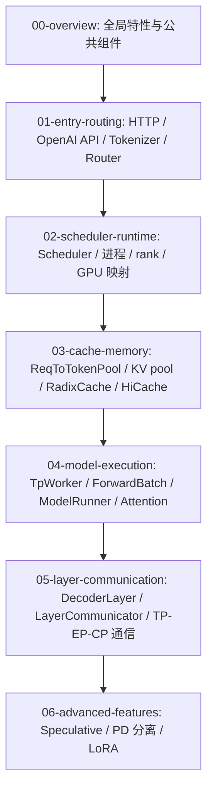

**中文** | [English](./README_EN.md)

# SGLang 源码阅读笔记

这组笔记用于配合 Codex 一起阅读 SGLang 源码。现在目录已经从“按讲次平铺”调整为“按源码层次归档”：先看全局组件，再沿入口、调度、缓存、模型执行、layer/通信和高级特性逐层下钻。

## 分层阅读地图

## 目录结构

- [00-overview](./00-overview/)
  - [00-feature-map.md](./00-overview/00-feature-map.md)：SGLang 常见特性词典，解释 dLLM、PD disaggregation、Speculative Decoding、HiCache、LoRA 等分支含义。
  - [01-public-components-code-walkthrough.md](./00-overview/01-public-components-code-walkthrough.md)：按源码层次梳理高频公共组件、调用关系、关键函数和端到端 code walkthrough。
- [01-entry-routing](./01-entry-routing/)
  - [01-request-lifecycle.md](./01-entry-routing/01-request-lifecycle.md)：从 `/v1/chat/completions` 到 GPU forward，再返回 HTTP 响应。
  - [09-router.md](./01-entry-routing/09-router.md)：理解 SGLang 中多层 router 的含义，包括 SmartRouter、调度模拟路由、PD bootstrap route、MoE expert router 和 routed experts 返回链路。
  - [10-sgl-router-source-deep-dive.md](./01-entry-routing/10-sgl-router-source-deep-dive.md)：深入阅读 `experimental/sgl-router`，讲清楚启动期 discovery、worker registry、KV-aware routing、PD prefill/decode 调度、Proxy/SSE 与 SGLang worker 的通信边界。
- [02-scheduler-runtime](./02-scheduler-runtime/)
  - [02-scheduler-core.md](./02-scheduler-runtime/02-scheduler-core.md)：理解 Scheduler 如何排队、组 prefill/decode batch，并支撑 continuous batching。
  - [06-multiprocess-distributed.md](./02-scheduler-runtime/06-multiprocess-distributed.md)：理解 Engine 如何拉起 Tokenizer/Scheduler/Detokenizer，TP/PP/DP/DP attention 如何组织 rank 与通信。
- [03-cache-memory](./03-cache-memory/)
  - [03-kv-cache-radix-cache.md](./03-cache-memory/03-kv-cache-radix-cache.md)：理解 KV cache 内存池、Radix prefix cache、HiCache 与 Scheduler 的配合。
- [04-model-execution](./04-model-execution/)
  - [04-model-runner-attention.md](./04-model-execution/04-model-runner-attention.md)：理解 `ForwardBatch`、`ModelRunner` 前向分发、`RadixAttention` 与 attention backend 如何读写 KV cache。
- [05-layer-communication](./05-layer-communication/)
  - [01-layer-communicator-and-common-layers.md](./05-layer-communication/01-layer-communicator-and-common-layers.md)：顺着 `DecoderLayer.forward()` 讲清楚 layer 层、`LayerCommunicator`、TP/EP/CP 通信、attention backend、linear/MoE kernel 的配合。
- [06-advanced-features](./06-advanced-features/)
  - [05-speculative-decoding.md](./06-advanced-features/05-speculative-decoding.md)：理解 draft worker、target verify、`spec_info`、EAGLE/NGRAM、spec v1/v2 与接受 token 后处理。
  - [07-disaggregation-pd.md](./06-advanced-features/07-disaggregation-pd.md)：理解 Prefill/Decode 分离部署、bootstrap/prealloc/transfer 队列、KV sender/receiver 和 transfer backend。
  - [08-lora-serving.md](./06-advanced-features/08-lora-serving.md)：理解 LoRA adapter 注册、热加载/卸载、Scheduler 混批约束、LoRAMemoryPool、LoRABatchInfo 和 LoRA kernel 执行路径。

## 推荐阅读路线

1. 先读 [公共组件全景](./00-overview/01-public-components-code-walkthrough.md)，建立 `TokenizerManager -> Scheduler -> TpModelWorker -> ModelRunner -> LayerCommunicator` 的主链路。
2. 再读 [请求生命周期](./01-entry-routing/01-request-lifecycle.md)，把一次 OpenAI API 请求串起来。
3. 接着读 [Scheduler 核心](./02-scheduler-runtime/02-scheduler-core.md)、[KV Cache](./03-cache-memory/03-kv-cache-radix-cache.md)、[ModelRunner 与 attention](./04-model-execution/04-model-runner-attention.md)。
4. 如果你正在看 decoder layer、MoE、TP/EP/CP 通信，进入 [Layer 层导读](./05-layer-communication/01-layer-communicator-and-common-layers.md)。
5. 最后按需要阅读 [Speculative Decoding](./06-advanced-features/05-speculative-decoding.md)、[PD 分离](./06-advanced-features/07-disaggregation-pd.md)、[LoRA Serving](./06-advanced-features/08-lora-serving.md) 和 [Router](./01-entry-routing/09-router.md)。

## 怎么使用这些笔记

1. 先看每一讲开头的 Mermaid 图，获得全局感。
2. 再按“源码定位”打开对应文件和函数。
3. 最后完成“阅读任务”，用自己的话复述这一段流程。
4. 遇到看不懂的函数，优先问两个问题：
   - 这个函数改变了哪个核心数据结构？
   - 它把请求送到了哪个进程、队列、batch、rank 或通信组？

## 当前源码索引状态

- 当前已用本地 CodeGraph 对 `python/sglang/srt/managers`、`python/sglang/srt/model_executor`、`python/sglang/srt/disaggregation`、`python/sglang/srt/lora`、`python/sglang/srt/layers/moe` 生成结构索引。
- CodeGraph 与生成的 HTML/CSV 均保存在本地忽略目录 `codegraph_out/`，只作为教学校准材料，不提交到远端仓库。
- PyPI 版本 CodeGraph 对 Rust 支持有限，因此 `experimental/sgl-router` 使用静态 Rust 声明索引辅助校准；router 教学已经结合该索引调整。
- 后续阅读时，可以把 `00-overview` 当成总导航，再进入各层细节。
