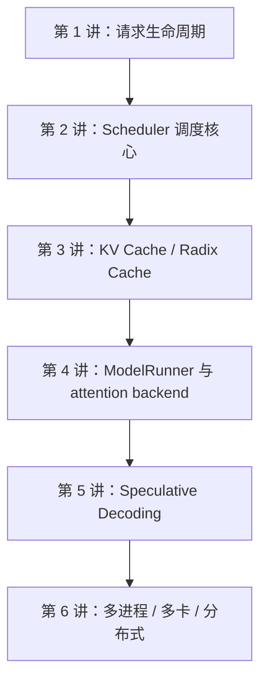

# SGLang 源码阅读笔记

这组笔记用于配合 Codex 一起阅读 SGLang 源码。目标不是把每个文件逐行翻译，而是先抓住框架主干，再沿着关键数据结构、调度路径和性能机制逐层深入。

## 阅读路线

## 已生成内容

- [00-feature-map.md](./00-feature-map.md)：SGLang 常见特性词典，解释 dLLM、PD disaggregation、Speculative Decoding、HiCache、LoRA 等分支含义。
- [01-request-lifecycle.md](./01-request-lifecycle.md)：从 `/v1/chat/completions` 到 GPU forward，再返回 HTTP 响应。
- [02-scheduler-core.md](./02-scheduler-core.md)：理解 Scheduler 如何排队、组 prefill/decode batch，并支撑 continuous batching。
- [03-kv-cache-radix-cache.md](./03-kv-cache-radix-cache.md)：理解 KV cache 内存池、Radix prefix cache、HiCache 与 Scheduler 的配合。

## 怎么使用这些笔记

1. 先看每一讲开头的 Mermaid 图，获得全局感。
2. 再按“关键文件跳转表”打开源码。
3. 最后完成“阅读任务”，用自己的话复述这一段流程。
4. 遇到看不懂的函数，优先问两个问题：
   - 这个函数改变了哪个核心数据结构？
   - 它把请求送到了哪个进程、队列或 batch？

## 当前源码索引状态

- CodeGraph 数据库：`.codegraph/codegraph.db`
- 当前仓库已建立 knowledge graph。
- 若要在 Codex 中使用 CodeGraph MCP，需要重启 Codex 会话，让新的 MCP 配置生效。
