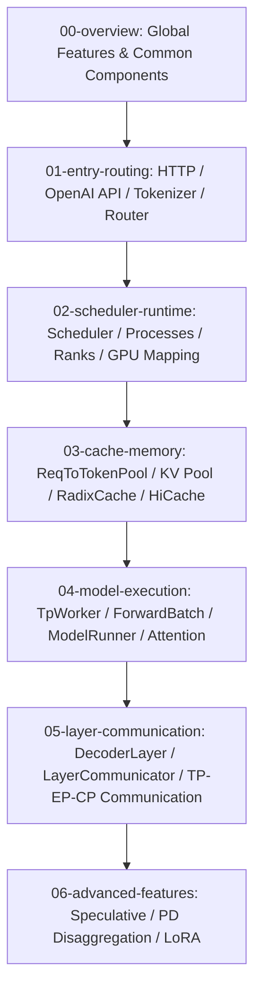

[中文](./README.md) | [English](./README_EN.md)

# SGLang Source Code Reading Notes

This set of notes is designed for reading SGLang source code alongside Codex. The directory has been reorganized from "sequential lectures" to "archived by source layer": start with global components, then drill down layer by layer through entry points, scheduling, caching, model execution, layer/communication, and advanced features.

## Layered Reading Map

## Directory Structure

- [00-overview](./00-overview/)
  - [00-feature-map.md](./00-overview/00-feature-map.md): SGLang feature dictionary, explaining branches like dLLM, PD disaggregation, Speculative Decoding, HiCache, LoRA.
  - [01-public-components-code-walkthrough.md](./00-overview/01-public-components-code-walkthrough.md): High-frequency common components organized by source layer, with call relationships, key functions, and end-to-end code walkthrough.
- [01-entry-routing](./01-entry-routing/)
  - [01-request-lifecycle.md](./01-entry-routing/01-request-lifecycle.md): From `/v1/chat/completions` to GPU forward, then back to HTTP response.
  - [09-router.md](./01-entry-routing/09-router.md): Understanding SGLang's multi-layered router concepts, including SmartRouter, scheduling simulation routing, PD bootstrap route, MoE expert router, and routed experts return path.
  - [10-sgl-router-source-deep-dive.md](./01-entry-routing/10-sgl-router-source-deep-dive.md): Deep dive into `experimental/sgl-router`, covering startup discovery, worker registry, KV-aware routing, PD prefill/decode scheduling, Proxy/SSE, and SGLang worker communication boundaries.
- [02-scheduler-runtime](./02-scheduler-runtime/)
  - [02-scheduler-core.md](./02-scheduler-runtime/02-scheduler-core.md): Understanding how the Scheduler queues requests, forms prefill/decode batches, and supports continuous batching.
  - [06-multiprocess-distributed.md](./02-scheduler-runtime/06-multiprocess-distributed.md): Understanding how the Engine launches Tokenizer/Scheduler/Detokenizer, and how TP/PP/DP/DP attention organizes ranks and communication.
- [03-cache-memory](./03-cache-memory/)
  - [03-kv-cache-radix-cache.md](./03-cache-memory/03-kv-cache-radix-cache.md): Understanding the KV cache memory pool, Radix prefix cache, HiCache, and their coordination with the Scheduler.
- [04-model-execution](./04-model-execution/)
  - [04-model-runner-attention.md](./04-model-execution/04-model-runner-attention.md): Understanding `ForwardBatch`, `ModelRunner` forward dispatch, `RadixAttention`, and how the attention backend reads/writes KV cache.
- [05-layer-communication](./05-layer-communication/)
  - [01-layer-communicator-and-common-layers.md](./05-layer-communication/01-layer-communicator-and-common-layers.md): Following `DecoderLayer.forward()` to explain the layer hierarchy, `LayerCommunicator`, TP/EP/CP communication, attention backend, and linear/MoE kernel coordination.
- [06-advanced-features](./06-advanced-features/)
  - [05-speculative-decoding.md](./06-advanced-features/05-speculative-decoding.md): Understanding draft worker, target verify, `spec_info`, EAGLE/NGRAM, spec v1/v2, and accept token post-processing.
  - [07-disaggregation-pd.md](./06-advanced-features/07-disaggregation-pd.md): Understanding Prefill/Decode disaggregation deployment, bootstrap/prealloc/transfer queues, KV sender/receiver, and transfer backend.
  - [08-lora-serving.md](./06-advanced-features/08-lora-serving.md): Understanding LoRA adapter registration, hot-load/unload, Scheduler mixed-batch constraints, LoRAMemoryPool, LoRABatchInfo, and LoRA kernel execution paths.

## Recommended Reading Route

1. Start with [Public Components Overview](./00-overview/01-public-components-code-walkthrough.md) to establish the main chain: `TokenizerManager -> Scheduler -> TpModelWorker -> ModelRunner -> LayerCommunicator`.
2. Then read [Request Lifecycle](./01-entry-routing/01-request-lifecycle.md) to trace a complete OpenAI API request end-to-end.
3. Next, read [Scheduler Core](./02-scheduler-runtime/02-scheduler-core.md), [KV Cache](./03-cache-memory/03-kv-cache-radix-cache.md), and [ModelRunner & Attention](./04-model-execution/04-model-runner-attention.md).
4. If you're looking at decoder layers, MoE, or TP/EP/CP communication, go to [Layer Communication Guide](./05-layer-communication/01-layer-communicator-and-common-layers.md).
5. Finally, read [Speculative Decoding](./06-advanced-features/05-speculative-decoding.md), [PD Disaggregation](./06-advanced-features/07-disaggregation-pd.md), [LoRA Serving](./06-advanced-features/08-lora-serving.md), and [Router](./01-entry-routing/09-router.md) as needed.

## How to Use These Notes

1. First look at the Mermaid diagrams at the beginning of each section to gain a global perspective.
2. Then use the "source location" references to open the corresponding files and functions.
3. Finally, complete the "reading tasks" by retelling the flow in your own words.
4. When encountering unfamiliar functions, prioritize two questions:
   - Which core data structure does this function modify?
   - Which process, queue, batch, rank, or communication group does it send the request to?

## Current Source Index Status

- Structural indices have been generated using local CodeGraph for `python/sglang/srt/managers`, `python/sglang/srt/model_executor`, `python/sglang/srt/disaggregation`, `python/sglang/srt/lora`, `python/sglang/srt/layers/moe`.
- CodeGraph and generated HTML/CSV files are saved in the local ignored directory `codegraph_out/`, used only as teaching calibration material, not committed to remote repositories.
- The PyPI version of CodeGraph has limited Rust support, so `experimental/sgl-router` uses a static Rust declaration index for calibration; router teaching has been adjusted accordingly.
- For future reading, use `00-overview` as the main navigation hub, then dive into each layer's details.
