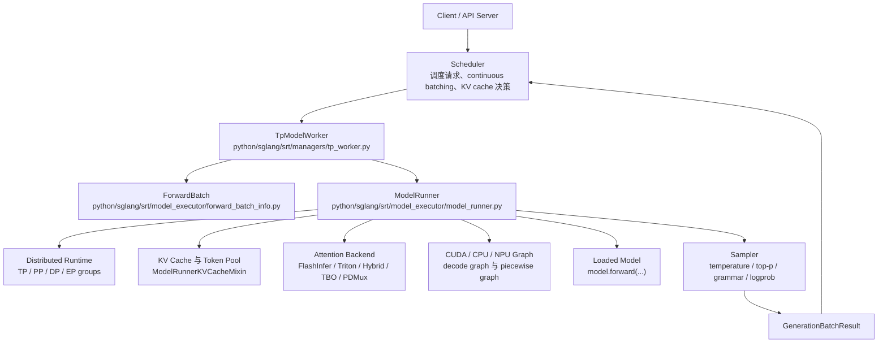
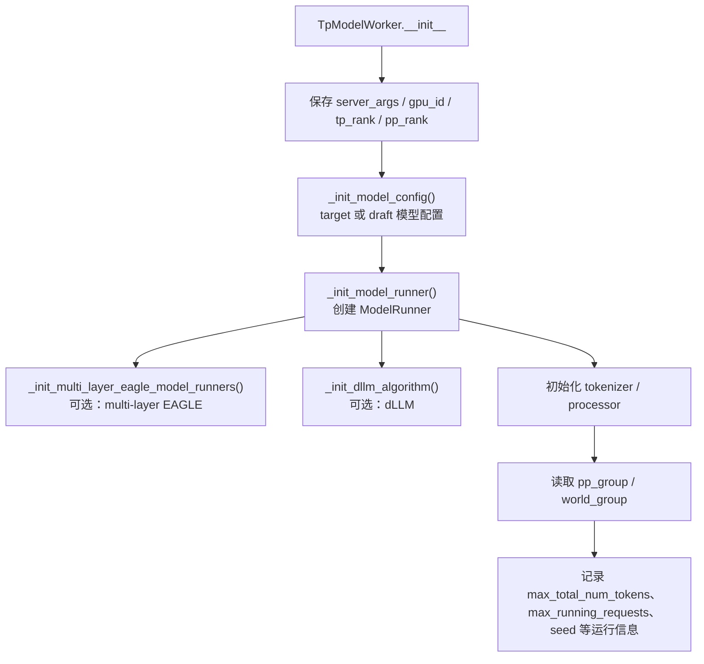
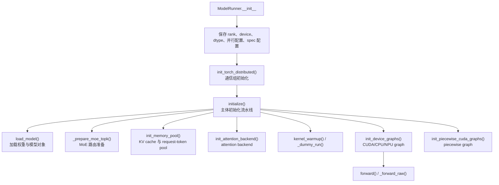
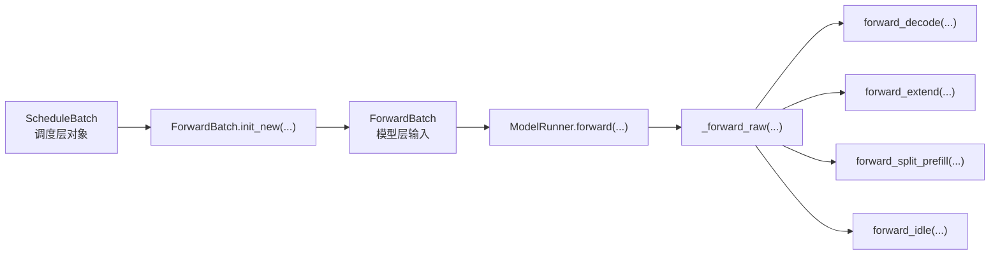

# 架构总览

## 两个文件的位置

`tp_worker.py` 位于 `python/sglang/srt/managers/`，属于 runtime manager 层。它直接承接 Scheduler 发来的 batch，并把请求送入模型执行层。

`model_runner.py` 位于 `python/sglang/srt/model_executor/`，属于模型执行层。它把模型、分布式通信、KV cache、attention backend、CUDA graph 和 sampling 组织成一个统一的运行时。

## 总体架构图

## 角色分工

| 组件 | 主要职责 | 代码定位 |
| --- | --- | --- |
| `BaseTpWorker` | 定义 Scheduler 可调用的 worker 接口，并把权重更新、LoRA、memory pool 等能力委托给 `ModelRunner` | `tp_worker.py` 的 `BaseTpWorker` |
| `TpModelWorker` | 初始化 `ModelConfig`、`ModelRunner`、tokenizer/processor、PP/TP group，并处理 generation/split prefill 路径 | `tp_worker.py` 的 `TpModelWorker` |
| `ForwardBatch` | 把调度层的 batch 转成模型层需要的张量视图，包括 input ids、positions、KV cache loc、sampling info | `forward_batch_info.py` 的 `ForwardBatch` |
| `ModelRunner` | 执行层总控：分布式初始化、加载模型、建 KV cache、建 attention backend、forward dispatch、sampling | `model_runner.py` 的 `ModelRunner` |
| `AttentionBackend` | 根据 batch 元数据准备 attention kernel 需要的 workspace/metadata | `model_runner.py` 的 `init_attention_backend()` 和 `_get_attention_backend()` |
| `Sampler` | 对 logits 做采样或 logprob 计算 | `model_runner.py` 的 `sample()` 与 `compute_logprobs_only()` |

## TpModelWorker 的架构

`TpModelWorker` 的关键点不是直接跑模型，而是处理“当前 worker 在整个并行拓扑中的身份”。例如：

- 当前 worker 是否是 draft worker，决定加载 target 模型还是 draft 模型。
- 当前 PP rank 是否是最后一级，决定是否可以采样。
- 当前是否启用 overlap、grammar、speculative decoding 或 dLLM，决定生成路径如何分支。
- 当前是否处于 split prefill，决定复用还是新建 `ForwardBatch`。

## ModelRunner 的架构

`ModelRunner` 是一个“执行环境容器”。它不只是 `model.forward()` 的薄包装，而是在真正执行前把这些状态都准备好：

- 分布式通信组：TP、PP、DP、attention DP/CP、MoE EP/DP。
- 模型权重与 dtype/quantization/LoRA/远端权重更新。
- KV cache 与请求到 token 的映射池。
- prefill/decode attention backend。
- CUDA graph 或其他设备 graph。
- MoE、speculative decoding、HiSparse、HiCache、ngram embedding 等可选路径。

## 请求进入后的数据层次

`ScheduleBatch` 偏向调度视角，记录请求、cache、采样配置、是否 prefill-only 等状态。

`ForwardBatch` 偏向模型视角，记录具体 tensor、positions、cache loc、attention metadata、spec info、sampling info。

这也是理解 SGLang runtime 的一条主线：Scheduler 负责“哪些请求一起跑”，`TpModelWorker` 负责“当前 rank 怎么接住这个 batch”，`ModelRunner` 负责“怎么把这个 batch 高效跑完”。
