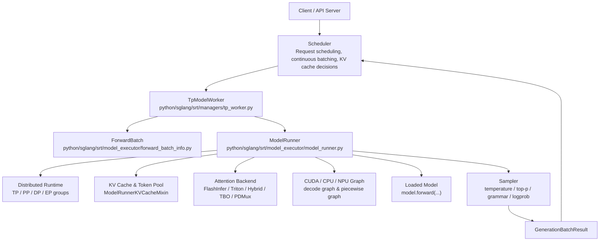
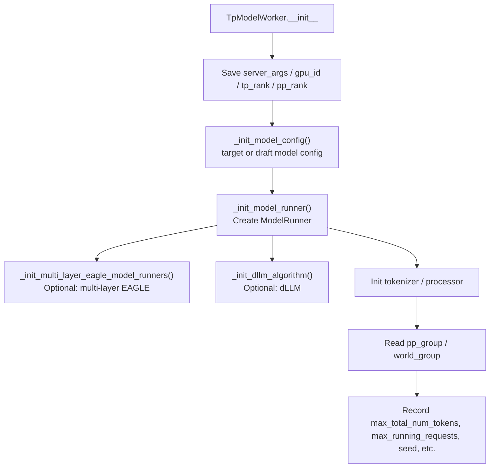
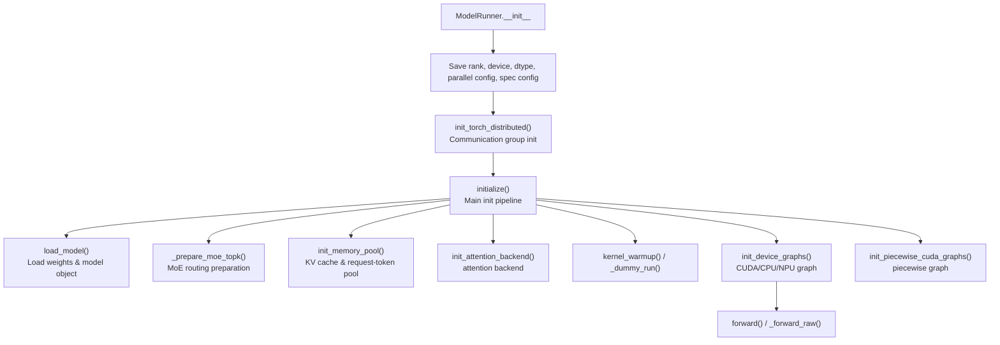
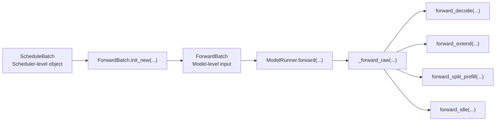

[中文](./01-architecture.md) | [English](./01-architecture_EN.md)

# Architecture Overview

## Two Files' Locations

`tp_worker.py` is at `python/sglang/srt/managers/`, belonging to the runtime manager layer. It directly receives batches from the Scheduler and passes requests into the model execution layer.

`model_runner.py` is at `python/sglang/srt/model_executor/`, belonging to the model execution layer. It organizes model, distributed communication, KV cache, attention backend, CUDA graph, and sampling into a unified runtime.

## Overall Architecture

## Role Division

| Component | Main Responsibility | Code Location |
| --- | --- | --- |
| `BaseTpWorker` | Defines the worker interface callable by Scheduler, delegates weight updates, LoRA, memory pool, etc. to `ModelRunner` | `tp_worker.py`: `BaseTpWorker` |
| `TpModelWorker` | Initializes `ModelConfig`, `ModelRunner`, tokenizer/processor, PP/TP groups; handles generation/split prefill paths | `tp_worker.py`: `TpModelWorker` |
| `ForwardBatch` | Converts scheduler-level batch into model-level tensor views: input ids, positions, KV cache loc, sampling info | `forward_batch_info.py`: `ForwardBatch` |
| `ModelRunner` | Execution layer orchestrator: distributed init, model loading, KV cache building, attention backend building, forward dispatch, sampling | `model_runner.py`: `ModelRunner` |
| `AttentionBackend` | Prepares workspace/metadata needed by attention kernels based on batch metadata | `model_runner.py`: `init_attention_backend()` & `_get_attention_backend()` |
| `Sampler` | Performs sampling or logprob computation on logits | `model_runner.py`: `sample()` & `compute_logprobs_only()` |

## TpModelWorker Architecture

The key point of `TpModelWorker` is not running the model directly, but handling "this worker's identity in the overall parallel topology." For example:

- Whether this worker is a draft worker determines if it loads the target or draft model.
- Whether this PP rank is the last stage determines if it can sample.
- Whether overlap, grammar, speculative decoding, or dLLM is enabled determines how generation paths branch.
- Whether split prefill is active determines if `ForwardBatch` is reused or newly created.

## ModelRunner Architecture

`ModelRunner` is an "execution environment container." It's not just a thin wrapper around `model.forward()` — it prepares all these states before actual execution:

- Distributed communication groups: TP, PP, DP, attention DP/CP, MoE EP/DP.
- Model weights with dtype/quantization/LoRA/remote weight updates.
- KV cache and request-to-token mapping pools.
- Prefill/decode attention backend.
- CUDA graph or other device graphs.
- MoE, speculative decoding, HiSparse, HiCache, ngram embedding, and other optional paths.

## Data Hierarchy After Request Entry

`ScheduleBatch` leans toward the scheduling perspective, recording requests, cache, sampling config, whether prefill-only, etc.

`ForwardBatch` leans toward the model perspective, recording concrete tensors, positions, cache loc, attention metadata, spec info, sampling info.

This is also a main thread for understanding SGLang runtime: Scheduler decides "which requests run together," `TpModelWorker` handles "how this rank receives the batch," and `ModelRunner` handles "how to efficiently execute this batch."
