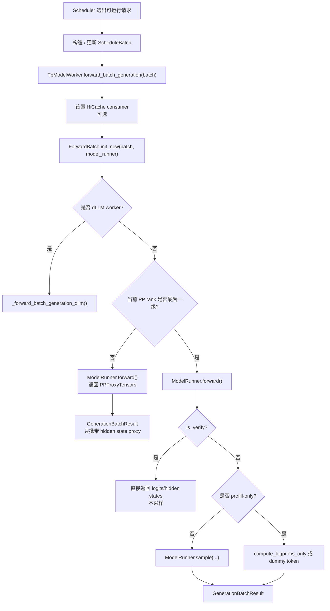
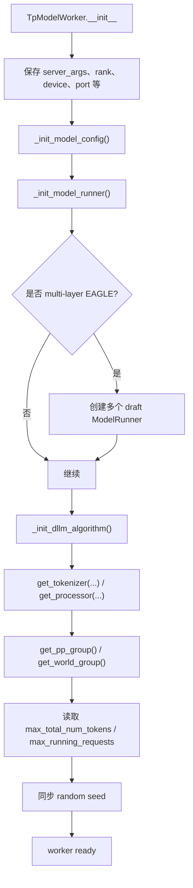
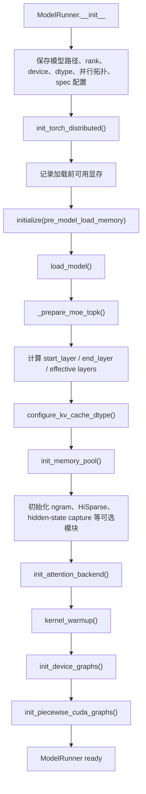
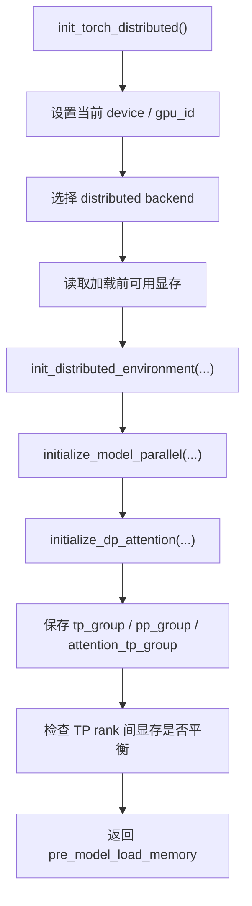
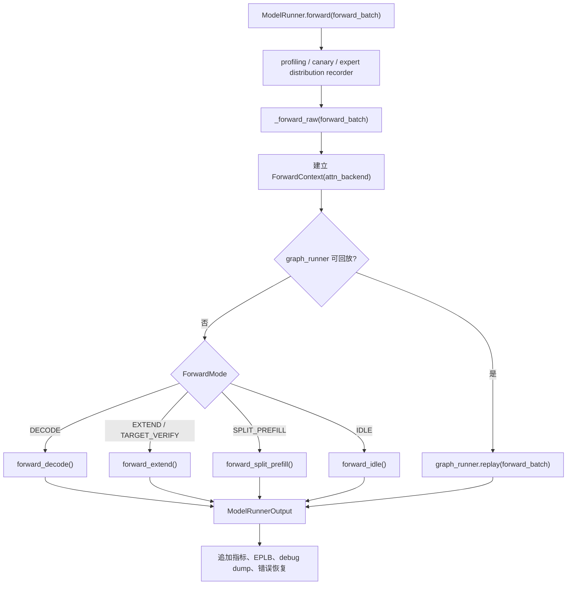
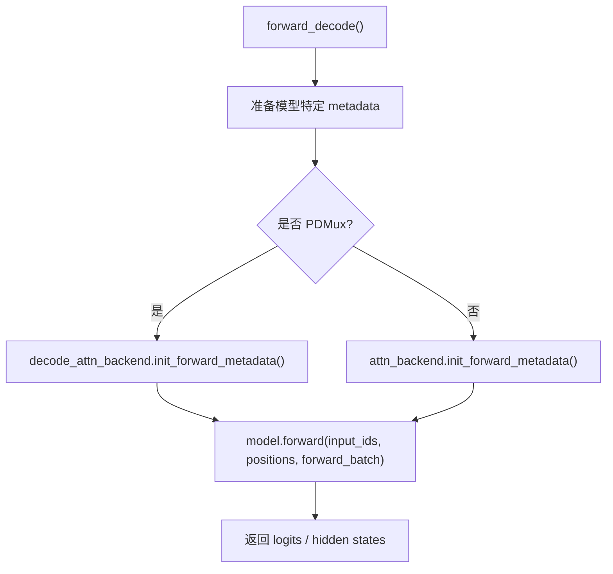
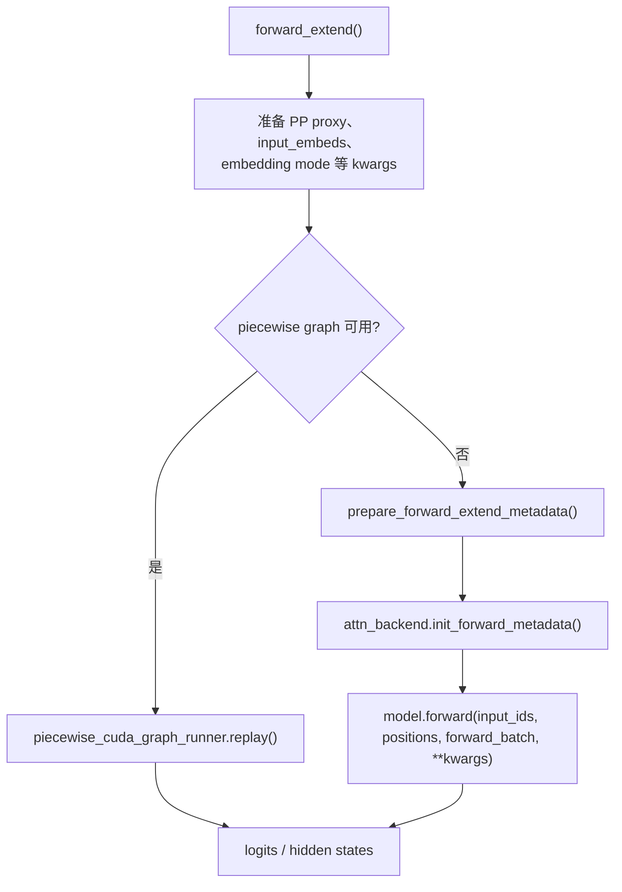
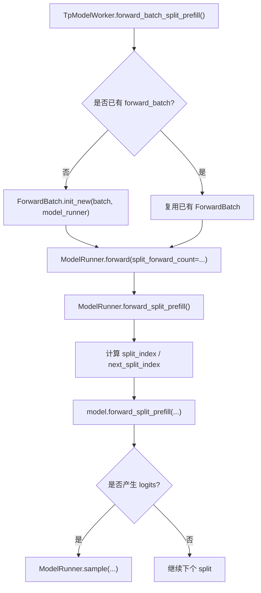
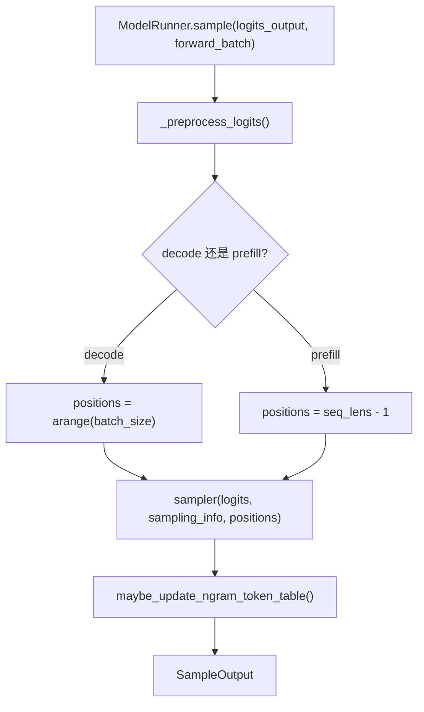

# 详细流程图

## 1. 从 Scheduler 到模型执行

关键代码段：

- `TpModelWorker.forward_batch_generation()`：生成入口。
- `ForwardBatch.init_new(batch, self.model_runner)`：调度 batch 到模型 batch 的转换。
- `self.pp_group.is_last_rank`：区分 PP 中间级和最后一级。
- `self.model_runner.sample(...)`：只有最后一级且需要生成 token 时才采样。

## 2. TpModelWorker 初始化

`TpModelWorker` 初始化期间会立即创建 `ModelRunner`。因此模型加载、显存池、attention backend 等昂贵初始化，大多是在 `ModelRunner.__init__()` 和 `ModelRunner.initialize()` 中发生的。

## 3. ModelRunner 初始化主流程

关键代码段：

- `ModelRunner.__init__()`：收集运行时配置并触发初始化。
- `init_torch_distributed()`：初始化通信组。
- `initialize()`：主体初始化编排。
- `load_model()`：加载权重和模型对象。
- `init_memory_pool()`：来自 `ModelRunnerKVCacheMixin`，建立 KV cache 与 token pool。
- `init_attention_backend()`：建立 prefill/decode attention backend。
- `init_device_graphs()`：捕获 decode graph。

## 4. 分布式初始化流程

这一步决定当前进程在所有并行维度中的位置。后续 `ModelRunner.forward()` 能否走 PP proxy、attention TP scatter/gather、MoE EP、DP attention，都依赖这里建立的通信组。

## 5. forward() 到 _forward_raw() 的分发

`forward()` 更像“外壳”，负责观测、容错和平衡逻辑。真正选择 decode/prefill/idle/split 的地方是 `_forward_raw()`。

## 6. decode 路径

decode 通常每个请求推进一个 token，形状更稳定，所以最容易被 `init_device_graphs()` 捕获并在 `_forward_raw()` 中回放。

## 7. extend / prefill 路径

extend/prefill 处理 prompt token 或新扩展 token，token 数和 prefix 长度更动态，所以通常比 decode 更难完全 graph 化。

## 8. split prefill 路径

split prefill 的核心是把一次长 prefill 拆成多个片段，让显存压力和单步延迟更可控。

## 9. sampling 流程

`sample()` 不只是从 logits 里取 token。它还会处理 grammar、logit bias、temperature/top-p/top-k、return_logprob，以及 ngram embedding token table 的维护。
