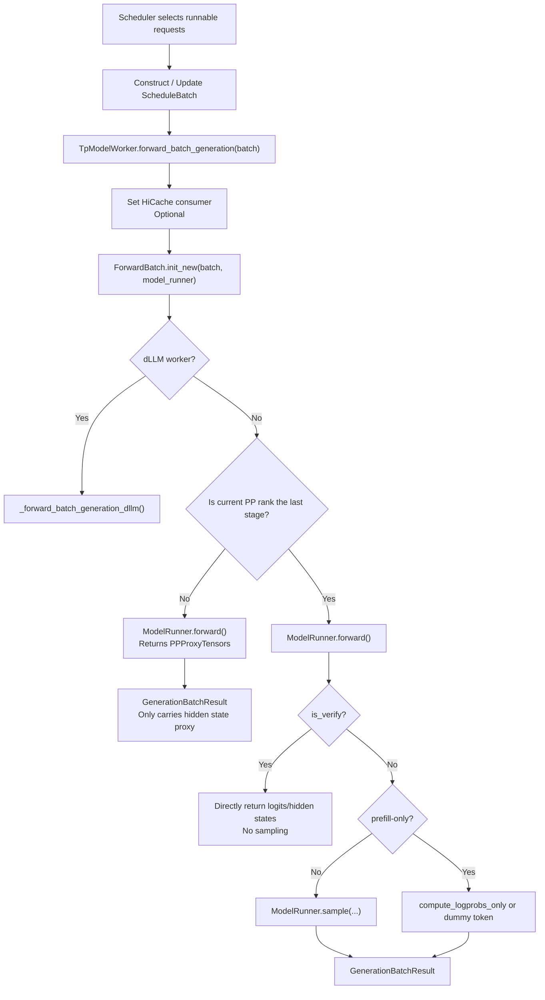
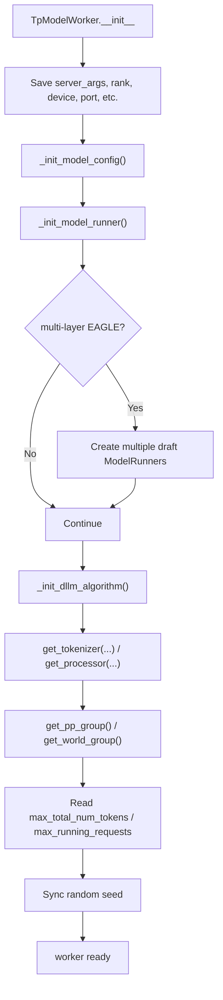

[中文](./02-flowcharts.md) | [English](./02-flowcharts_EN.md)

# Detailed Flowcharts

## 1. From Scheduler to Model Execution

Key code segments:

- `TpModelWorker.forward_batch_generation()`: Generation entry point.
- `ForwardBatch.init_new(batch, self.model_runner)`: Conversion from scheduler batch to model batch.
- `self.pp_group.is_last_rank`: Distinguishes PP intermediate stages from the last stage.
- `self.model_runner.sample(...)`: Only samples when it's the last stage and needs token generation.

## 2. TpModelWorker Initialization

