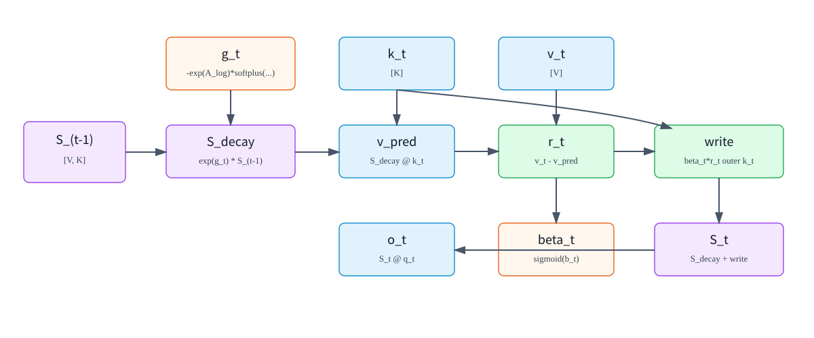

# 01. GDN 数学原理：Gated Delta Rule 与状态矩阵

## 1. GDN 想解决的问题

标准 causal attention 会为每层保存历史 K/V：

```text
K_cache: [context_len, num_kv_heads, head_dim]
V_cache: [context_len, num_kv_heads, head_dim]
```

上下文越长，KV Cache 越大。GDN 换一种思路：不保存每个历史 token 的 K/V，而是维护一个按 head 存储的状态矩阵。

```text
S_t[h] : [V, K]
```

其中：

| 符号 | 含义 |
|---|---|
| `t` | 当前 token 位置 |
| `h` | value head id |
| `K` | key/query head dimension |
| `V` | value head dimension |
| `S_t[h]` | 第 `h` 个 value head 在处理完 token `t` 后的 recurrent state |

每来一个新 token，GDN 做三件事：

```text
1. 用 gate 衰减旧状态
2. 用 key 从状态里读出当前 value 的预测
3. 把预测误差写回状态，再用 query 读出输出
```



## 2. 单个 token、单个 head 的核心公式

先只看一个 value head，省略 batch 和 head 下标。当前 token 有：

```text
q_t: [K]
k_t: [K]
v_t: [V]
S_(t-1): [V,K]
g_t: scalar, <= 0
beta_t: scalar, in (0,1)
```

GDN 的 recurrent update 可以写成：

```text
遗忘旧状态:
    S_decay = exp(g_t) * S_(t-1)

预测当前 value:
    v_pred = S_decay @ k_t

计算残差:
    r_t = v_t - v_pred

控制写入强度:
    u_t = beta_t * r_t

写入状态:
    S_t = S_decay + u_t outer k_t

读取输出:
    o_t = S_t @ (q_t * scale)
```

变量含义：

| 变量 | 形状 | 含义 |
|---|---:|---|
| `q_t` | `[K]` | 当前 token 的查询向量，用来从状态中读信息 |
| `k_t` | `[K]` | 当前 token 的键向量，用来定位应该写入状态的方向 |
| `v_t` | `[V]` | 当前 token 要写入的 value 信息 |
| `S_(t-1)` | `[V,K]` | 处理当前 token 之前的状态 |
| `g_t` | scalar | 遗忘 gate；越负，旧状态衰减越强 |
| `beta_t` | scalar | 写入 gate；越接近 1，当前 residual 写入越强 |
| `v_pred` | `[V]` | 旧状态沿 `k_t` 方向预测出来的 value |
| `r_t` | `[V]` | 当前 value 与旧状态预测的差值 |
| `u_t` | `[V]` | 被 `beta_t` 调制后的写入向量 |
| `o_t` | `[V]` | 当前 head 的输出 |

其中：

```text
u_t outer k_t : [V,1] @ [1,K] -> [V,K]
```

所以它可以加回 `S_decay [V,K]`。

## 3. 为什么叫 delta rule

Delta rule 的直觉是：不要把 `v_t` 原封不动写入状态，而是只写入“旧状态还没有解释好的部分”。

```text
r_t = v_t - S_decay @ k_t
```

读法：

```text
如果旧状态已经能用 k_t 预测出 v_t，
那么 residual 很小，本次写入就很小。

如果旧状态预测错了，
那么 residual 大，状态会沿 k_t 方向补上这部分差值。
```

这和普通线性 attention 的外积累加不同。普通线性 attention 更像：

```text
S_t = S_(t-1) + v_t outer k_t
```

GDN 则是：

```text
S_t = exp(g_t) * S_(t-1)
      + beta_t * (v_t - exp(g_t) * S_(t-1) @ k_t) outer k_t
```

这里多了两个关键机制：

| 机制 | 作用 |
|---|---|
| `exp(g_t)` | 自适应遗忘旧状态 |
| `v_t - S_decay @ k_t` | 只写入预测误差，而不是重复写入已有信息 |

## 4. `g_t` 从哪里来

在 SGLang 的 GDN 实现中，`g_t` 由 `A_log`、`a_t` 和 `dt_bias` 计算：

```text
g_t = -exp(A_log) * softplus(a_t + dt_bias)
```

| 变量 | 形状 | 是否可训练 | 含义 |
|---|---:|---:|---|
| `A_log` | `[HV]` | 是 | 每个 value head 一个 log-space decay 参数 |
| `a_t` | `[HV]` | 否 | 当前 token 的 gate 激活，由 `in_proj_a` 投影得到 |
| `dt_bias` | `[HV]` | 是 | 每个 value head 一个时间步偏置 |
| `softplus(a_t + dt_bias)` | `[HV]` | 否 | 正数时间步/衰减强度 |
| `g_t` | `[HV]` | 否 | 非正数 gate，控制旧状态衰减 |

为什么这样参数化？

```text
exp(A_log) > 0
softplus(a_t + dt_bias) > 0
g_t <= 0
0 < exp(g_t) <= 1
```

这保证状态衰减因子不会大于 1，避免无约束放大旧状态。

`softplus` 定义为：

```text
softplus(x) = log(1 + exp(x))
```

当 `x` 很大时，`softplus(x) ≈ x`；当 `x` 很小时，它仍然保持正数。

## 5. `beta_t` 从哪里来

`beta_t` 由另一个投影激活 `b_t` 得到：

```text
beta_t = sigmoid(b_t)
```

| 变量 | 形状 | 是否可训练 | 含义 |
|---|---:|---:|---|
| `b_t` | `[HV]` | 否 | 当前 token 的写入 gate 激活，由 `in_proj_b` 投影得到 |
| `beta_t` | `[HV]` | 否 | 写入强度，取值在 `(0,1)` |

`b_t` 本身不是参数，但生成它的投影矩阵是可训练参数。

## 6. 多 head 与 GQA 风格映射

GDN 常见配置里 key head 数和 value head 数可以不同。设：

```text
H  = num_key_heads
HV = num_value_heads
R  = HV / H
```

如果 `HV > H`，多个 value heads 共享同一个 key head：

```text
key_head_id = value_head_id // R
```

在 SGLang 的 recurrent kernel 中可以看到同样的映射逻辑：

```text
i_h = i_hv // (HV // H)
```

所以每个 value head 有自己的状态 `S[h_v]`，但它读取的 `q/k` 可能来自对应的 key head group。

## 7. 为什么需要 Q/K L2 normalization

SGLang GDN kernels 在执行时常打开：

```text
use_qk_l2norm_in_kernel=True
```

即：

```text
q_t = q_t / sqrt(sum(q_t^2) + eps)
k_t = k_t / sqrt(sum(k_t^2) + eps)
```

然后：

```text
q_t = q_t * (1 / sqrt(K))
```

这样做的作用：

| 作用 | 说明 |
|---|---|
| 稳定状态读写 | `S @ k` 和 `S @ q` 不会因为向量范数过大而剧烈放大 |
| 让 beta 更可控 | 写入残差主要受方向和 gate 控制 |
| 接近 attention scale 的直觉 | `1/sqrt(K)` 与普通 attention 中的缩放类似 |

## 8. GDN 与标准 attention 的差别

标准 attention：

```text
score_tj = q_t dot k_j
alpha_tj = softmax(score_tj)
o_t = sum_j alpha_tj * v_j
```

GDN：

```text
S_t = recurrent_update(S_(t-1), k_t, v_t, g_t, beta_t)
o_t = S_t @ q_t
```

| 维度 | 标准 attention | GDN |
|---|---|---|
| 历史保存 | 保存每个历史 token 的 K/V | 保存固定大小状态矩阵 |
| 读历史方式 | 对所有历史 token 做 softmax 加权 | 用 query 从状态矩阵读 |
| 状态大小 | 随上下文长度线性增长 | 与上下文长度无关 |
| 表达能力 | 精确 token-to-token 检索强 | 更像压缩记忆和线性递推 |
| serving 重点 | KV Cache 管理和 attention kernel | recurrent state、conv state、chunk/recurrent kernel |

## 9. 一个最小数值例子

设：

```text
K = 2
V = 3
S_(t-1): [3,2]
k_t: [2]
v_t: [3]
q_t: [2]
```

计算：

```text
S_decay = exp(g_t) * S_(t-1)       # [3,2]
v_pred = S_decay @ k_t             # [3]
r_t = v_t - v_pred                 # [3]
u_t = beta_t * r_t                 # [3]
u_t outer k_t                      # [3,2]
S_t = S_decay + u_t outer k_t      # [3,2]
o_t = S_t @ q_t                    # [3]
```

这个 head 输出 `[3]`，多 head 情况下把所有 value heads 的输出拼接为：

```text
O_t: [HV, V]
flatten(O_t): [HV * V]
```

然后进入 output gate/norm 和 out projection。

## 10. 小结

1. GDN 的核心状态是 `S_t [V,K]`，它是每个请求运行时状态，不是模型参数。
2. `g_t` 控制遗忘，`beta_t` 控制写入，二者都由 token 激活和可训练参数共同计算。
3. Delta rule 写入的是 `v_t - S_decay @ k_t`，也就是旧状态没有解释好的残差。
4. GDN 的 memory 不随上下文长度增长，但它把历史压缩进状态矩阵，和精确 KV attention 有不同取舍。
5. 多 value heads 可以共享 key head，SGLang kernel 通过 `i_h = i_hv // (HV // H)` 完成映射。
