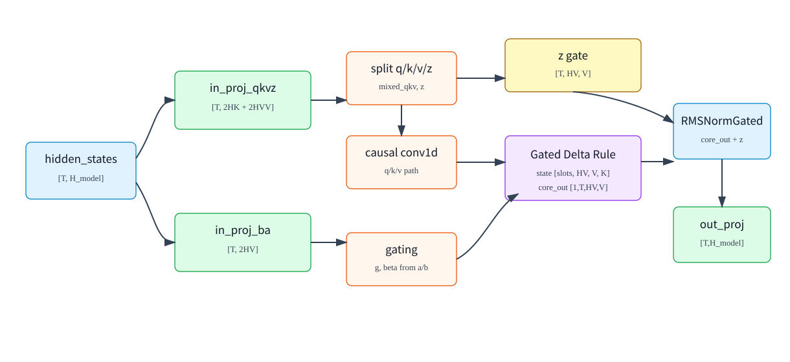

# 02. GDN 层内数据流与 shape

## 1. 符号约定

这一讲用下面的符号描述 GDN 层。它们对应 Qwen3-Next/SGLang 实现中的字段。

| 符号 | 代码字段 | 含义 |
|---|---|---|
| `T` | `seq_len` 或 packed token 数 | 当前 forward 中实际 token 总数 |
| `B` | `batch_size` | decode 时活跃请求数 |
| `H_model` | `hidden_size` | 主干 hidden 宽度 |
| `H` | `num_k_heads` | GDN key/query head 数 |
| `HV` | `num_v_heads` | GDN value head 数 |
| `K` | `head_k_dim` | 每个 q/k head 的维度 |
| `V` | `head_v_dim` | 每个 value head 的维度 |
| `C` | `conv_kernel_size` | causal conv1d 的窗口大小 |
| `R` | `HV / H` | 每个 key head 对应几个 value head |

Qwen3-Next 默认配置中常见：

```text
H_model = 2048
H = 16
HV = 32
K = 128
V = 128
C = 4
R = 2
```

因此：

```text
key_dim   = H * K  = 16 * 128 = 2048
value_dim = HV * V = 32 * 128 = 4096
```

## 2. 层内总览



GDN 层从主干 hidden states 开始：

```text
hidden_states: [T, H_model]
```

然后分成几条路径：

```text
hidden_states
  -> in_proj_qkvz -> q, k, v, z
  -> in_proj_ba   -> b, a

q/k/v -> causal conv1d -> GDN recurrent/chunk kernel -> core_attn_out
z     -> output gate / RMSNormGated
core_attn_out + z -> out_proj -> layer output
```

## 3. 输入投影：`in_proj_qkvz`

SGLang 中 `Qwen3GatedDeltaNet` 创建：

```text
in_proj_qkvz:
    input_size  = hidden_size
    output part = [key_dim, key_dim, value_dim, value_dim]
```

所以：

```text
projected_states_qkvz: [T, 2*key_dim + 2*value_dim]
```

用默认配置代入：

```text
2*key_dim + 2*value_dim
= 2*2048 + 2*4096
= 12288
```

投影后的四段含义：

| 段 | 逻辑 shape | 含义 |
|---|---:|---|
| `q` | `[T,H,K]` | query |
| `k` | `[T,H,K]` | key |
| `v` | `[T,HV,V]` | value |
| `z` | `[T,HV,V]` | output gate/norm 的 gate 输入 |

其中 `z` 不进入 recurrent state update，它用于调制 GDN 输出。

## 4. 输入投影：`in_proj_ba`

`in_proj_ba` 输出两组 gate 激活：

```text
in_proj_ba:
    input_size  = hidden_size
    output part = [HV, HV]
```

所以：

```text
projected_states_ba: [T, 2*HV]
b: [T,HV]
a: [T,HV]
```

| 激活 | 后续计算 | 含义 |
|---|---|---|
| `a` | `g = -exp(A_log) * softplus(a + dt_bias)` | 控制状态遗忘 |
| `b` | `beta = sigmoid(b)` | 控制 residual 写入强度 |

注意：`a` 和 `b` 是 token 激活，不是参数。`in_proj_ba.weight` 是参数。

## 5. packed checkpoint 与 split/reshape

为了加载和运行更高效，checkpoint 中 GDN 投影可能是 packed 格式。SGLang 的 `load_weights()` 会把：

```text
in_proj_qkv -> in_proj_qkvz 的前 3 段
in_proj_z   -> in_proj_qkvz 的第 4 段
in_proj_b   -> in_proj_ba 的第 1 段
in_proj_a   -> in_proj_ba 的第 2 段
```

加载进 fused module。

投影输出经过 split/reshape 后得到：

```text
mixed_qkv: [T, 2*key_dim + value_dim]
z:         [T, HV, V]
b:         [T, HV]
a:         [T, HV]
```

默认配置：

```text
mixed_qkv: [T, 8192]
z:         [T, 32, 128]
b/a:       [T, 32]
```

`mixed_qkv` 是 q/k/v 的扁平拼接：

```text
mixed_qkv = concat(flatten(q), flatten(k), flatten(v))
```

## 6. causal conv1d

GDN 在 q/k/v 路径上加一个短 causal conv：

```text
conv_dim = 2*key_dim + value_dim
conv_kernel_size = C
```

对 packed q/k/v：

```text
mixed_qkv_before_conv: [T, conv_dim]
mixed_qkv_after_conv:  [T, conv_dim]
```

decode 时每个请求只来一个 token，所以 conv 需要保存窗口状态：

```text
conv_states: [num_slots, conv_dim, C-1] 或 backend 定义的等价布局
```

prefill 时可以对整段序列一次做 causal conv；decode 时用 `causal_conv1d_update` 更新每个请求的 conv state。

## 7. conv 后 split 为 q/k/v

conv 后再 split：

```text
query: [1,T,H,K]
key:   [1,T,H,K]
value: [1,T,HV,V]
```

为什么第一维是 `1`？在线 serving 常把不同长度请求 packed 成一个 token 维度：

```text
query_start_loc: [N+1]
```

用于描述每条请求在 packed token 序列里的起止位置。此时 batch 维常写成 `1`，真正的请求边界由 `cu_seqlens/query_start_loc` 表示。

## 8. 计算 `g` 和 `beta`

对于 prefill/extend，SGLang 会调用 fused gating：

```text
g, beta = fused_gdn_gating(A_log, a, b, dt_bias)
```

逻辑 shape：

```text
a:     [T,HV]
b:     [T,HV]
A_log: [HV]
dt_bias:[HV]

g:     [1,T,HV]
beta:  [1,T,HV]
```

公式：

```text
g[t,h] = -exp(A_log[h]) * softplus(a[t,h] + dt_bias[h])
beta[t,h] = sigmoid(b[t,h])
```

decode packed fast path 会把这个计算融合进 recurrent kernel，避免单独 materialize `q/k/v/g/beta`。

## 9. recurrent state shape

GDN 的状态池在 serving 中和 Mamba state 放在同类 memory pool 中。逻辑上：

```text
ssm_states: [num_slots, HV, V, K]
```

| 维度 | 含义 |
|---|---|
| `num_slots` | 请求状态槽位数，由请求池管理 |
| `HV` | value head 数 |
| `V` | value head dim |
| `K` | key/query head dim |

单个请求、单层的状态大小：

```text
HV * V * K
```

默认配置：

```text
32 * 128 * 128 = 524288 elements
```

如果用 BF16，约：

```text
524288 * 2 bytes = 1 MB per linear-attention layer per request slot
```

它看起来不小，但关键是它不随历史 token 数增长。

## 10. GDN kernel 输出

GDN recurrent/chunk kernel 输出：

```text
core_attn_out: [1,T,HV,V]
```

随后会 reshape：

```text
core_attn_out: [T, HV, V]
z:             [T, HV, V]
```

然后进入 gated norm：

```text
normed = RMSNormGated(core_attn_out, z)
normed: [T, HV, V]
```

再 flatten：

```text
normed_flat: [T, HV*V] = [T, value_dim]
```

最后 out projection：

```text
out_proj: [value_dim -> hidden_size]
output:   [T, H_model]
```

这个输出再回到 decoder layer 的残差/MLP/MoE 路径。

## 11. decode 的端到端流程

decode 每条请求通常一个新 token：

```text
hidden_states: [B,H_model]
```

流程：

```text
1. in_proj_qkvz:
       [B,H_model] -> [B,2*key_dim+2*value_dim]

2. in_proj_ba:
       [B,H_model] -> [B,2*HV]

3. split:
       mixed_qkv: [B,2*key_dim+value_dim]
       z:         [B,HV,V]
       a,b:       [B,HV]

4. causal_conv1d_update:
       mixed_qkv + conv_states -> mixed_qkv_after_conv [B,conv_dim]
       conv_states 原地更新

5. packed recurrent kernel:
       读取 ssm_states[cache_indices]
       计算 q/k/v/g/beta
       更新 ssm_states[cache_indices]
       输出 core_attn_out [1,B,HV,V]

6. RMSNormGated(core_attn_out, z):
       [B,HV,V]

7. out_proj:
       [B,HV*V] -> [B,H_model]
```

## 12. prefill/extend 的端到端流程

prefill/extend 一次处理多 token：

```text
hidden_states: [T,H_model]
query_start_loc: [N+1]
```

流程：

```text
1. 投影得到 mixed_qkv/z/a/b
2. 对 packed q/k/v 做 causal conv1d
3. split 为 q [1,T,H,K], k [1,T,H,K], v [1,T,HV,V]
4. 计算 g [1,T,HV], beta [1,T,HV]
5. chunk_gated_delta_rule 并行处理长序列
6. 写回每条请求的 final recurrent state
7. 输出 [1,T,HV,V]
8. gated norm + out projection -> [T,H_model]
```

prefill 不能像 decode 那样每 token 一个 kernel 顺序跑，否则长 prompt 会很慢。因此使用 chunk 并行算法，把序列切成块，在块内用三角结构求解，在块间合并状态。

## 13. target verify 的特殊点

投机解码 target verify 中，一条请求会带多个 draft token。GDN 需要临时推进状态，但不能把所有 draft token 都直接写入正式状态。

SGLang 的思路是：

```text
正式 ssm_states:
    保存已经提交 token 的状态

intermediate_states_buffer:
    保存 draft tree/verify 过程中的临时状态

disable_state_update=True:
    verify 时不直接提交最终状态
```

等 token 接受/拒绝结果确定后，再按 accepted path 提交正确状态。这一点和 KV Cache 的“临时 KV”管理类似，只是对象从 K/V page 变成 recurrent state。

## 14. shape 总表

| 阶段 | 张量 | shape |
|---|---|---:|
| 输入 | `hidden_states` | `[T,H_model]` |
| qkvz 投影 | `projected_states_qkvz` | `[T,2*H*K+2*HV*V]` |
| ba 投影 | `projected_states_ba` | `[T,2*HV]` |
| split 后 | `mixed_qkv` | `[T,2*H*K+HV*V]` |
| split 后 | `z` | `[T,HV,V]` |
| split 后 | `a,b` | `[T,HV]` |
| conv 后 | `mixed_qkv` | `[T,2*H*K+HV*V]` |
| recurrent 输入 | `q,k` | `[1,T,H,K]` |
| recurrent 输入 | `v` | `[1,T,HV,V]` |
| gating | `g,beta` | `[1,T,HV]` |
| state pool | `ssm_states` | `[num_slots,HV,V,K]` |
| recurrent 输出 | `core_attn_out` | `[1,T,HV,V]` |
| gate/norm 后 | `normed` | `[T,HV,V]` |
| flatten | `normed_flat` | `[T,HV*V]` |
| out projection | `output` | `[T,H_model]` |

## 15. 小结

1. GDN 层从 hidden states 投影出六类激活：`q/k/v/z/a/b`。
2. `q/k/v` 经过短 causal conv 后进入 recurrent/chunk kernel。
3. `a/b` 生成 `g/beta`，控制状态遗忘和写入。
4. `z` 不写入状态，而是在输出阶段调制 `core_attn_out`。
5. GDN 状态是 `[num_slots,HV,V,K]`，按请求槽位保存，不随 token 数增长。
