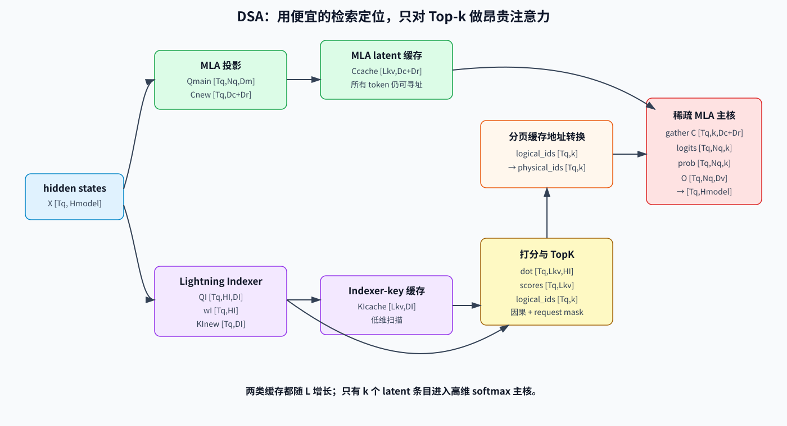
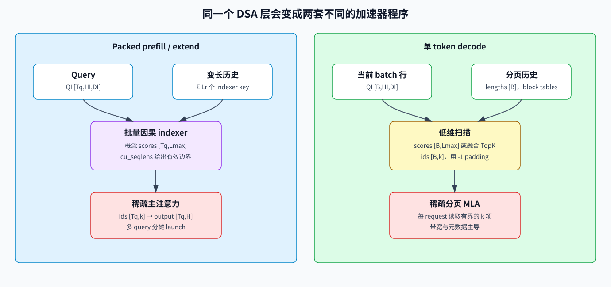

# DeepSeek Sparse Attention：在 MLA Cache 上学习检索

## 1. DSA 要解决的问题

MLA 缩窄了每个历史 cache entry，但稠密 MLA 仍让每个 query 访问所有历史 entry：

```text
MLA：更窄的 entry x 全部历史位置
```

上下文很长时，读取的 entry 数和 core attention 计算量仍随上下文长度增长。DeepSeek Sparse Attention（DSA）增加了一个学习得到的检索阶段：

```text
轻量 indexer 扫描历史
  -> 选出 top-k token entry
  -> 昂贵的 MLA core 只读取选中 entry
```

因此 DSA 优化的是 **position 轴**，MLA 主要优化 **feature/cache-width 轴**。

## 2. DSA 构建在 MLA 之上

DeepSeek-V3.2 在 MLA 的 MQA 执行模式上实例化 DSA。每个历史 token 仍产生一个共享的 MLA latent KV entry，所有 query head 复用该 entry。

```text
历史 token s
  -> MLA latent entry c_s
  -> indexer key kI_s

query token t
  -> main MLA query heads
  -> 轻量 indexer queries 与 head weights
```

Indexer 与主 Attention 使用不同投影、承担不同职责。Indexer score 只负责选位置；最终输出仍由这些位置上的主 MLA logits 与 softmax 决定。



## 3. 统一符号

| 符号 | 含义 |
|---|---|
| `L` | 可见序列长度 |
| `k` | 每 query 选择的 entry 数，`k << L` |
| `HI` | indexer query head 数 |
| `DI` | indexer head dimension |
| `h_t` | query token `t` 的 hidden state，`[H]` |
| `qI_t,j` | 第 `j` 个 indexer query，`[DI]` |
| `kI_s` | 历史 token `s` 的共享 indexer key，`[DI]` |
| `wI_t,j` | 第 `j` 个 indexer head 的标量权重 |
| `I_t,s` | query `t` 与历史 token `s` 的标量 index score |
| `c_s` | token `s` 的 MLA latent KV entry |

## 4. Lightning Indexer

Indexer 计算标量检索分数：

```text
I_t,s = sum_(j=1..HI) wI_t,j * ReLU(qI_t,j dot kI_s)
```

对含 `Tq` 个 query token、`Lkv` 个候选 entry 的 packed batch：

```text
QI:       [Tq, HI, DI]
KI_cache: [Lkv, DI]
head_w:   [Tq, HI]

dot:      [Tq, Lkv, HI]
ReLU + 沿 HI 加权求和
scores:   [Tq, Lkv]
```

### 4.1 逐个投影跟踪 Shape 变化

indexer 同时接收模型 hidden state 与 MLA 的低秩 query 激活。SGLang 源码中有代表性的投影路径是：

```text
hidden x:   [Tq,Hmodel]
q_lora:     [Tq,Dq]

QI_flat = q_lora @ WqI^T
WqI:        [HI*DI,Dq]
QI_flat:    [Tq,HI*DI]
QI:         [Tq,HI,DI]

KI = LayerNorm(x @ WkI^T)
WkI:        [DI,Hmodel]
KI:         [Tq,DI]             # 每个 token 一个共享 key

head_w = x @ WwI^T
WwI:        [HI,Hmodel]
head_w:     [Tq,HI]
```

indexer query 有 `HI` 个 head，但 key 是共享的。把 key 广播到 query head 后：

```text
QI[:,None,:,:]:        [Tq,1,HI,DI]
KI_cache[None,:,:, :]: [1,Lkv,1,DI]
dot 结果:               [Tq,Lkv,HI]
```

经过 `ReLU`，再乘 `head_w[:,None,:] [Tq,1,HI]`，最后沿 `HI` 归约：

```text
weighted: [Tq,Lkv,HI]
scores:   [Tq,Lkv]
```

正因为这里归约了 indexer head，top-k 才会为每个 query token 返回一组位置，而不是为每个主 Attention head 分别返回位置。

### 4.2 Indexer 的 RoPE 拆分

indexer head 可以包含位置与非位置两个子空间：

```text
QI: [Tq,HI,DI]
  -> QI_rope [Tq,HI,Dr]
  -> QI_nope [Tq,HI,DI-Dr]

KI: [Tq,DI]
  -> KI_rope [Tq,Dr]
  -> KI_nope [Tq,DI-Dr]
```

只对指定的 `Dr` 个通道应用 RoPE，再拼接回 `DI`。本仓库可见的 NPU 路径中，一个代表性 shape 是 `HI=64`、`DI=128`、`Dr=64`：投影先得到 `[Tq,64,128]`，拆成两个 64 通道部分，旋转位置部分，再恢复为 `[Tq,64,128]`。

### 4.3 一个小型数值排序例子

设 `HI=2`、`DI=2`，有四个候选 key：

```text
qI_0 = [1, 0]       head weight w_0 = 0.75
qI_1 = [0, 1]       head weight w_1 = 0.25

kI_0 = [ 2, 1]
kI_1 = [-1, 4]
kI_2 = [ 1,-2]
kI_3 = [ 0, 3]
```

逐 head 点积为：

```text
候选 0: [2, 1]  -> ReLU -> [2,1]
候选 1: [-1,4]  -> ReLU -> [0,4]
候选 2: [1,-2]  -> ReLU -> [1,0]
候选 3: [0, 3]  -> ReLU -> [0,3]
```

加权后的标量分数是：

```text
I_0 = 0.75*2 + 0.25*1 = 1.75
I_1 = 0.75*0 + 0.25*4 = 1.00
I_2 = 0.75*1 + 0.25*0 = 0.75
I_3 = 0.75*0 + 0.25*3 = 0.75
```

当 `k=2` 时，候选 0 与候选 1 被选中。注意，负证据是在 head 加权归约之前被 ReLU 消除的；把 ReLU 移到归约之后会定义另一个函数。

ReLU 是训练期评分函数的一部分，不是可以任意替换的实现细节。Indexer 的 head 更少、维度更小，并可使用低精度，因此完整扫描远比对所有 entry 执行主 Attention 便宜。

## 5. 细粒度 Top-k 选择

对 query token `t`：

```text
S_t = TopK(I_t, :, k)
selected_cache_t = {c_s | s in S_t}
```

主路径输出为：

```text
u_t = MLA_Attention(h_t, selected_cache_t)
```

由此得到四个重要结论：

1. Selection 是 **query-dependent**，不同 query token 可以检索不同位置；
2. Indexer 把多个 head 聚合成每个历史位置一个标量分数；
3. 所有主 query head 在 MQA 模式下消费同一组选中的 MLA entry；
4. Top-k 改变了 softmax 的 support，不等价于先算稠密 softmax 再丢弃小权重。

## 6. 复杂度：必须分开计算主 Attention 与 Indexer

忽略常数：

| 组件 | 全序列 Prefill | 单 token Decode |
|---|---:|---:|
| 稠密 MLA core | `O(L^2 * Dmain)` | `O(L * Dmain)` |
| DSA indexer | `O(L^2 * HI * DI)` | `O(L * HI * DI)` |
| DSA 稀疏主 core | `O(L * k * Dmain)` | `O(k * Dmain)` |

Indexer 对完整序列仍是二次复杂度，单 token decode 仍需线性扫描历史。DSA 有效的原因是 indexer 常数被刻意做得远小于主 MLA，并且昂贵的主 core 只消费 `k` 个 entry。

DeepSeek-V3.2 官方训练配置为每个 query 选择 2048 个 entry。这是模型配置，不是 DSA 的通用常数。

## 7. Cache 中保存什么

DSA 不能只保留本轮 top-k entry。未来 query 可能选择任意旧位置，因此持久历史包括：

```text
主 latent cache：每 token 一个 MLA entry c_s
indexer cache：   每 token 一个 indexer key kI_s
```

Top-k indices 是每次 forward 的 metadata，决定当前 query 读取哪些 entry，但它们不是历史状态本身。

与稠密 MLA 相比，DSA 增加了 indexer-key 存储，同时把每 query 的主 entry 读取数限制为固定 `k`。Cache 容量仍随上下文长度增长。

## 8. 为什么 DSA 需要训练

事后随意做 top-k 可能删除模型依赖的信息。DeepSeek-V3.2 使用两个阶段：

### 8.1 稠密 Indexer Warm-up

- 保持主 Attention 稠密；
- 冻结主模型，只训练 indexer；
- 跨 head 聚合主 Attention score 并归一化，得到目标分布；
- 最小化该目标与 indexer 分布之间的 KL divergence。

### 8.2 稀疏继续训练

- 启用 top-k selection；
- 训练主模型，使其适应稀疏可见性；
- 在选中位置上继续用辅助对齐 loss 训练 indexer；
- 从主计算图 detach indexer input，使 language-model loss 与 indexer loss 走分离的优化路径。

因此 DSA 是原生训练的模型结构，不只是 serving 阶段的 KV eviction heuristic。



## 9. Prefill 数据流

对 packed query tokens：

```text
hidden states
  -> 构造并保存新 MLA latent entry
  -> 构造并保存新 indexer key
  -> 对因果历史计算 indexer score
  -> 每 query 做 top-k，并填充无效 slot
  -> 把逻辑 token index 转为 cache 地址
  -> sparse MLA attention
  -> output projection
```

实现必须处理 causal mask、变长序列、top-k padding、选中 token 的负载不均衡，以及 sparse kernel 能否在不物化稠密 gather 的情况下直接消费 paged cache。

当可见序列不长于 `k` 时，selection 会退化为全部有效位置。短序列使用 dense path 或顺序 index path 可能比启动完整稀疏流水更快。

## 10. Decode 数据流

每请求新增一个 token 时：

```text
1. 把当前 hidden state 投影成主 MLA query，以及 indexer query/weight。
2. 向主 latent cache 和 indexer-key cache 追加当前 entry。
3. 扫描有效 indexer key，为每个历史 token 产生一个 score。
4. 选择 k 个逻辑位置；history < k 时用 -1 填充无效 slot。
5. 通过 page table 翻译逻辑位置。
6. 在选中的物理 entry 上执行 sparse MLA core。
```

这条路径把低维的全历史扫描与高维但有界的 Attention 读取分开。

## 11. Paged Cache 与 Graph Replay 契约

生产实现不能把论文里的 token id 直接传给 paged kernel：

```text
logical top-k token index
  -> request page table
  -> physical cache index
  -> sparse attention metadata
```

Graph capture 通常要求输出 buffer 保持固定 `[graph_batch, k]` shape。运行时 sequence length、page table、indexer cache length 与 selected index 必须在不改变已捕获 tensor 地址的前提下刷新；`-1` sentinel 标记无效 top-k slot。

## 12. SGLang 源码地图

| 源码 | 职责 |
|---|---|
| [`python/sglang/srt/models/deepseek_v2.py`](../../../../python/sglang/srt/models/deepseek_v2.py) | 在 MLA 层中加入 `Indexer`，并在模型层间传递 top-k indices |
| [`python/sglang/srt/layers/attention/dsa/dsa_indexer.py`](../../../../python/sglang/srt/layers/attention/dsa/dsa_indexer.py) | Indexer projection、key cache、score path 与 top-k 生成 |
| [`python/sglang/srt/layers/attention/dsa/dsa_topk_backend.py`](../../../../python/sglang/srt/layers/attention/dsa/dsa_topk_backend.py) | Top-k 实现分发与 fused transform |
| [`python/sglang/srt/layers/attention/dsa/transform_index.py`](../../../../python/sglang/srt/layers/attention/dsa/transform_index.py) | 通过 paged-cache table 转换选中的逻辑 index |
| [`python/sglang/srt/layers/attention/dsa_backend.py`](../../../../python/sglang/srt/layers/attention/dsa_backend.py) | Prefill/decode metadata 与 sparse MLA backend 分发 |
| [`python/sglang/srt/layers/attention/attention_registry.py`](../../../../python/sglang/srt/layers/attention/attention_registry.py) | 注册 `dsa`；只把 `nsa` 保留为废弃 backend 别名 |

实现分别为 index scoring、top-k 和 sparse core attention 提供选择。只优化其中一个阶段，可能只是把瓶颈移动到下一阶段。

## 13. 当前快照中的 Ascend NPU 路径

当前源码快照包含显式 Ascend 路径：

- `dsa_indexer.py` 使用 `torch_npu.npu_rotary_mul` 处理 indexer RoPE，并用 `torch_npu.npu_lightning_indexer` 进行 index selection；
- [`python/sglang/srt/hardware_backend/npu/modules/deepseek_v2_attention_mla_npu.py`](../../../../python/sglang/srt/hardware_backend/npu/modules/deepseek_v2_attention_mla_npu.py) 把 `forward_dsa_prepare_npu` 与 `forward_dsa_core_npu` 分开；
- `AttnForwardMethod.DSA_NPU` 为 DSA 提供独立的 model-forward 路由，而不是把它当作普通稠密 MLA。

进行 NPU 性能分析时，至少应分别测量四段：

```text
indexer projection/rope
index score + top-k
logical-to-physical index transform
sparse main attention + output projection
```

还要观察以 Vector 计算为主的 top-k/address work 与以 Cube 计算为主的 projection/attention work 之间的同步。Core attention 算子很快，也无法掩盖在它之前串行执行的 indexer 或 metadata 流水。

## 14. DSA 与 NSA 的区别

| 维度 | DSA | Native Sparse Attention（NSA） |
|---|---|---|
| 主选择单元 | 细粒度 token 级 MLA entry | 细粒度 token block |
| 全局粗粒度路径 | 轻量 indexer 扫描 token key | 显式 compressed-token attention branch |
| 局部路径 | 选中 token；以 MLA 为基础 | 独立 sliding-window branch |
| 组合方式 | 一组选中 entry 进入主 core | compression、selection、window 输出经 gate 组合 |

二者都是原生可训练的稀疏 Attention，但数据流与 cache 契约不同。

## 15. 常见误区

1. **“DSA 让所有 Attention 计算都变成 `O(L*k)`。”** 昂贵主 core 是这样，轻量 indexer 仍扫描全部候选历史。
2. **“Cache 只需保存选中的 entry。”** 未来 query 可能选择过去未被选中的 entry，因此完整 latent 与 indexer 历史必须可寻址。
3. **“Indexer score 就是 Attention score。”** 它是检索分数；选中 entry 还会进入独立 MLA core 和 softmax。
4. **“任意稠密 checkpoint 都能无训练加入 DSA。”** 公开方案先 warm up indexer，再继续稀疏训练。
5. **“SGLang 的 `nsa` 别名说明 DSA 等于 NSA。”** 它只是废弃配置别名，不是算法等价关系。

## 16. 正确性与性能检查清单

1. Top-k candidate 遵守因果边界和每请求序列边界。
2. 所有下游 transform 与 kernel 都正确处理无效 slot sentinel。
3. 逻辑 index 通过正确请求的 page table 转成物理地址。
4. 主 latent cache 与 indexer-key cache 同步推进。
5. 短历史使用全部有效 entry，不重复位置，也不读未来位置。
6. 量化 indexer ranking 要用 top-k recall 对比高精度参考，不能只比较 logit error。
7. Sparse output 应与模型训练时的 reference path 比较，不能假设它等于 dense MLA。
8. 分别 profile indexer、top-k、transform、sparse core 与 graph metadata。

## 17. 一次 Forward 的完整 Tensor 账本

设 packed prefill 含 `R` 个 request，总计 `Tq` 个新 query token；所有 request 一共可见 `Tkv` 个已缓存/新 KV 条目，`Lmax` 是单 request 最大历史长度。

| 阶段 | 张量 | 逻辑 shape | 是否持久化 |
|---|---|---:|---|
| 输入 | hidden states | `[Tq,Hmodel]` | 否 |
| MLA query 降投影 | `q_lora` | `[Tq,Dq]` | 否 |
| 主 query heads | `Qmain` | `[Tq,Nq,Dmain]` | 否 |
| 新 MLA latent | `Cnew` | `[Tq,Dc+Dr]` | 是，追加 |
| Indexer query | `QI` | `[Tq,HI,DI]` | 否 |
| Indexer head 权重 | `head_w` | `[Tq,HI]` | 否 |
| 新 index key | `KInew` | `[Tq,DI]` | 是，追加 |
| Indexer 历史 | `KIcache` | `[Tkv,DI]` 加 request 元数据 | 是 |
| 概念 score | `scores` | `[Tq,Lmax]` | workspace 或被融合消除 |
| 选中逻辑 ID | `topk_ids` | `[Tq,k]` | forward 元数据 |
| 选中物理 ID | `page_ids` | `[Tq,k]` | forward 元数据 |
| 选中 latent 条目 | `Csel` | `[Tq,k,Dc+Dr]` | 通常直接读取，不物化 |
| 主 logits | `Alogit` | `[Tq,Nq,k]` | workspace 或分块保存 |
| 主概率 | `P` | `[Tq,Nq,k]` | 最好 online/分块处理 |
| Head 输出 | `Ohead` | `[Tq,Nq,Dv]` | 否 |
| Layer 输出 | `O` | `[Tq,Hmodel]` | 否 |

“逻辑 shape”不代表真的分配了稠密张量。融合 indexer 可以流式读取 key tile，只保留当前 top-k 候选；稀疏注意力 kernel 可以根据物理 page ID 直接读取 latent，而不构造 `Csel`。

## 18. 带 Shape 断言的参考伪代码

下面的伪代码优先表达语义，而非性能：

```python
def dsa_reference(x, q_lora, latent_cache, index_cache, valid_mask, k):
    # x:             [Tq, Hmodel]
    # q_lora:        [Tq, Dq]
    # latent_cache:  [Tq, Lkv, Dlatent]  # 概念上的逐 query 视图
    # index_cache:   [Tq, Lkv, DI]       # 概念上的逐 query 视图
    # valid_mask:    [Tq, Lkv]

    Tq, Lkv, DI = index_cache.shape
    q_i = linear_q_index(q_lora).view(Tq, HI, DI)       # [Tq,HI,DI]
    w_i = linear_head_weight(x)                         # [Tq,HI]

    dots = einsum("thd,tld->tlh", q_i, index_cache)    # [Tq,Lkv,HI]
    score = (relu(dots) * w_i[:, None, :]).sum(-1)     # [Tq,Lkv]
    score = where(valid_mask, score, -inf)

    actual_k = min(k, Lkv)
    ids = topk(score, actual_k, dim=-1).indices         # [Tq,actual_k]
    chosen_is_valid = gather(valid_mask, dim=-1, index=ids)
    ids = where(chosen_is_valid, ids, -1)               # 将短序列补位失效化
    ids = pad_to_k_with_minus_one(ids, k)               # [Tq,k]

    selected = batched_gather(latent_cache, ids)        # [Tq,k,Dlatent]
    out = sparse_mla(q_lora, selected, ids >= 0)        # [Tq,Nq,Dv]
    return out, ids
```

生产代码会把概念上的逐 query cache 视图替换为 packed/paged pool，但结果必须遵守完全相同的 request 与因果边界。

## 19. 为什么 Top-k 会改变 Softmax 数学

稠密注意力在全部有效位置 `V_t` 上归一化：

```text
p_dense(s) = exp(a_s) / sum_(u in V_t) exp(a_u)
```

DSA 先用另一套 score 函数得到选中集合 `S_t`，主核再只在该集合上归一化：

```text
p_dsa(s) = exp(a_s) / sum_(u in S_t) exp(a_u),  s in S_t
p_dsa(s) = 0,                                  s not in S_t
```

即使主 logit `a_s` 不变，移除候选也会改变分母。这既解释了为什么需要稀疏续训，也解释了为什么不能用极严格的逐元素误差，把稀疏结果和稠密 MLA 当成正确性目标。Kernel 正确性应对齐训练后的稀疏参考路径；模型质量则应在任务层面评估。

## 20. Cache 字节数与 Decode 流量例子

假设某一层使用：

```text
Dc + Dr = 576 个 latent 元素/token，BF16
DI = 128 个 index 元素/token，INT8 并带 block scale
L = 128K tokens
k = 2048
```

忽略对齐和 scale：

```text
latent 容量 = 131072 * 576 * 2 bytes ≈ 144 MiB
index 容量  = 131072 * 128 * 1 byte  ≈ 16 MiB
```

完整容量仍随 `L` 增长，但主核每个 query 的 latent 读取被约束在：

```text
2048 * 576 * 2 bytes ≈ 2.25 MiB
```

如果没有 cache/片上局部性复用或分布式扫描，indexer 仍需为这个 query 扫描约 16 MiB 量化 key。这个例子把优化目标讲清楚了：DSA 用便宜、窄的顺序扫描，换取昂贵 latent-attention 读取的大幅减少。

## 21. 从症状开始调试

| 症状 | 首先检查的张量/不变量 |
|---|---|
| 单 request 正确，混合长度错误 | `query_start_loc`、sequence length、因果/request mask |
| `L<=k` 正确，超过 `k` 后错误 | 全量可见 shortcut 与真实 top-k 路径 |
| eager 正确，graph replay 错误 | lengths/page tables/top-k buffer 是否刷新，地址是否稳定 |
| index 量化后质量大降 | top-k recall、tie 处理、scale 布局、RoPE 顺序 |
| indexer 很快但端到端很慢 | index transform、gather 局部性、稀疏主核、stream 同步 |
| prefix cache 输出不稳定 | 主 latent 与 indexer cache 是否在不同边界提交 |
| NPU 只在长上下文出错 | sentinel、page 地址转换宽度、top-k 顺序、累加精度 |

## 22. 练习

1. 当 `Tq=32`、`HI=64`、`DI=128`、`Lkv=8192` 时，写出未融合 indexer 的每个中间 shape。
2. 当 `L=128K`、`k=2048` 时，计算稠密 MLA 与 DSA 主核 logit 数量之比。
3. 解释为什么不能在一次 query 后淘汰所有未选 token。
4. 设计一个不物化 `[Tq,Lkv]` score 的流式 top-k。
5. 对 page size 64 的分页缓存，根据 request block table 推导逻辑 token 130 的物理地址。

## 23. 参考资料

- [DeepSeek-V3.2: Pushing the Frontier of Open Large Language Models](https://arxiv.org/abs/2512.02556)
- [DeepSeek-V3.2-Exp 官方仓库](https://github.com/deepseek-ai/DeepSeek-V3.2-Exp)
- [Native Sparse Attention](https://arxiv.org/abs/2502.11089)
- [本仓库 MLA 教程](./04-multi-head-latent-attention.md)
