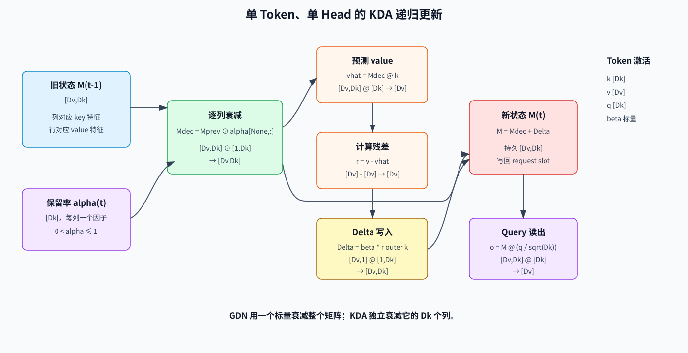
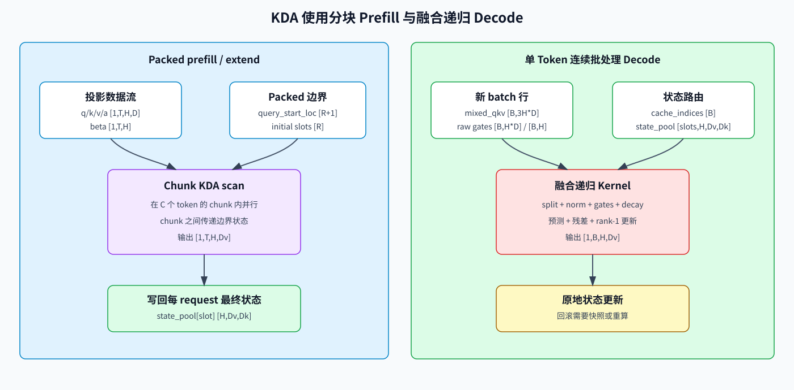

# Kimi Delta Attention（KDA）：线性注意力的细粒度门控

Kimi Delta Attention（KDA）是 Kimi Linear 中的递归线性注意力组件。它在 Gated DeltaNet（GDN）基础上加入了**按 key 通道划分的遗忘门**。

这一处变化对系统实现很重要：

- 稠密与稀疏 softmax attention 把历史保存为序列缓存；
- GDN 与 KDA 把历史折叠到固定大小的递归状态中；
- KDA 可以让不同 key 空间特征以不同速度遗忘。

本章将推导递归公式，对照 SGLang 源码，并解释为什么 prefill 与 decode 需要不同 kernel。

## 1. 从遍历 Token 的注意力到递归状态

普通因果注意力保存过去的 key 和 value：

```text
o_t = softmax(q_t K_{<=t}^T) V_{<=t}
```

其缓存随序列长度增长。线性注意力则用矩阵概括历史。采用便于实现的矩阵方向：

```text
M_t in R[d_v, d_k]
o_t = M_t q_t
```

状态大小取决于 head 维度，而不取决于已经处理的 token 数量。

## 2. 为什么使用 Delta Rule？

朴素的累加状态会不断写入外积：

```text
M_t = M_{t-1} + v_t outer k_t
```

这种写法难以正确覆盖旧信息，因为新 key 可能和状态中已经存储的相近方向发生冲突。Delta rule 先询问当前状态对 `k_t` 的预测，再只写入残差：

```text
v_hat_t = M_{t-1} k_t
r_t = v_t - v_hat_t
M_t = M_{t-1} + beta_t * (r_t outer k_t)
```

`beta_t` 控制写入强度。

## 3. GDN 与 KDA 的区别

GDN 在 delta 更新前加入衰减，但其衰减门对每个 token、每个 head 是标量。KDA 把它替换为 key 通道上的向量：

| 门控 | GDN | KDA |
|---|---|---|
| 每 token/head 的遗忘因子 | 标量 `alpha_t` | 向量 `alpha_t in R[d_k]` |
| 状态列 | 同步衰减 | 独立衰减 |
| 递归状态 | 固定大小 | 固定大小 |

细粒度门控允许一个特征长期稳定，同时让另一个特征快速刷新。

## 4. 形状账本

对一个 token 和一个 head，设：

- `q_t, k_t in R[d_k]`；
- `v_t in R[d_v]`；
- `a_t in R[d_k]`：原始遗忘门激活；
- `alpha_t in (0, 1]^{d_k}`：逐通道保留率；
- `beta_t in (0, 1)`：标量 delta 写入强度；
- `M_t in R[d_v, d_k]`：递归状态；
- `o_t in R[d_v]`：归一化与输出门之前的输出。

对一批 token，实现通常把张量排布为 `[T, H, D]`；递归状态由每个 request、layer 与 KV head 独立持有。

## 5. KDA 递归公式

采用 SGLang 便于存储的状态方向，计算步骤为：

```text
g_t       = -exp(A_log) * softplus(a_t + dt_bias)
alpha_t   = exp(g_t)
M_decay   = M_{t-1} * alpha_t[None, :]
v_hat_t   = M_decay k_t
r_t       = v_t - v_hat_t
M_t       = M_decay + beta_t * (r_t outer k_t)
o_t       = M_t (q_t / sqrt(d_k))
```

由于 `g_t <= 0`，`alpha_t` 位于 `(0, 1]`。`M` 的每一列都会获得不同的保留因子。

KDA 技术报告使用转置后的方向 `S_t in R[d_k, d_v]`：

```text
S_t = (I - beta_t k_t k_t^T) Diag(alpha_t) S_{t-1}
      + beta_t k_t v_t^T
o_t = S_t^T q_t
```

两种形式转置后等价。比较代码与公式之前，必须先确认状态矩阵的方向。



### 5.1 从论文形式推导实现形式

从技术报告的 `S[d_k,d_v]` 公式开始：

```text
S_t = (I - beta k k^T) Diag(alpha) S_prev + beta k v^T
```

对每个因子转置，并反转乘法顺序：

```text
M_t = S_t^T
    = M_prev Diag(alpha) (I - beta k k^T) + beta v k^T
```

定义逐列衰减后的状态：

```text
M_decay = M_prev Diag(alpha)
```

展开可得：

```text
M_t = M_decay - beta (M_decay k) k^T + beta v k^T
    = M_decay + beta (v - M_decay k) k^T
```

这正是便于存储的“衰减 → 预测 → 残差 → 外积更新”顺序。改变矩阵方向没有引入近似。

### 5.2 逐元素解释

对 value 行 `r` 与 key 列 `c`：

```text
M_decay[r,c] = M_prev[r,c] * alpha[c]
M_t[r,c] = M_decay[r,c] + beta * residual[r] * k[c]
```

因此 KDA 有两个独立控制轴：

- `alpha[c]` 决定历史 key 特征 `c` 保留多少；
- `residual[r] * k[c]` 决定当前 token 如何改变矩阵单元 `(r,c)`。

GDN 的标量 `alpha` 无法为不同列选择不同生命周期。

## 6. 投影、短卷积与输出门

KDA 不只有递归公式。典型 layer 会执行：

```text
hidden states
  -> Q/K/V 投影
  -> 对投影流做短因果卷积
  -> Q/K 归一化
  -> 遗忘门 alpha 与写入门 beta
  -> 递归 KDA 主核
  -> 归一化
  -> 可学习输出门
  -> 输出投影
```

短卷积在递归压缩前提供精确的局部顺序信息。因此，服务状态同时包含 KDA 矩阵与卷积尾部。

### 6.1 SGLang 中的投影 Shape

设 `Hk` 为 KDA head 数，`Dk` 为 q/k head 宽度，`Dv` 为 value 宽度，`C` 为短卷积 kernel size。从 packed hidden states 开始：

```text
X: [T,Hmodel]
```

逻辑投影输出为：

```text
q_flat:       [T,Hk*Dk]  -> q [T,Hk,Dk]
k_flat:       [T,Hk*Dk]  -> k [T,Hk,Dk]
v_flat:       [T,Hk*Dv]  -> v [T,Hk,Dv]
beta_raw:     [T,Hk]     -> beta [T,Hk]
forget_raw:   [T,Hk*Dk]  -> a [T,Hk,Dk]
output_gate:  [T,Hk*Dv]  -> z [T,Hk,Dv]
```

源码中的 forget gate 与 output gate 使用分解投影。以 forget 路径为例：

```text
f_a = X @ Wfa^T:       [T,Dk]
a_flat = f_a @ Wfb^T:  [T,Hk*Dk]
a = reshape(a_flat):   [T,Hk,Dk]
```

这样可以减少投影成本，同时仍为每个 token、head 与 key 通道产生一个遗忘激活。融合投影可以一次生成 q/k/v、`beta` 与低秩 gate 中间量，但逻辑张量不变。

### 6.2 短卷积 Shape

卷积前拼接投影后的 q/k/v：

```text
mixed_qkv: [T,Hk*(2*Dk + Dv)]
```

当 kernel 宽度为 `C` 时，每个 request slot 保留：

```text
conv_state: [Hk*(2*Dk + Dv), C-1]
```

Prefill 对每条 packed 序列执行因果卷积。Decode 使用旧的 `C-1` 列与新投影行，返回一个宽度不变的过滤后行，并移动卷积状态。

### 6.3 从主核到输出的 Shape

卷积并 reshape 后：

```text
q/k:       [1,T,Hk,Dk]
v:         [1,T,Hk,Dv]
a:         [1,T,Hk,Dk]
beta:      [1,T,Hk]
state pool:[slots,Hk,Dv,Dk]
core out:  [1,T,Hk,Dv]
```

输出门与归一化保持 `[T,Hk,Dv]`，随后展平并投影：

```text
gated: [T,Hk,Dv]
flat:  [T,Hk*Dv]
Wout:  [Hmodel,Hk*Dv]
out:   [T,Hmodel]
```

## 7. 内存与计算复杂度

对每一层、每个 request，持久状态约为：

```text
KDA 状态：H_kv * d_v * d_k 个元素
卷积状态：projected_channels * (kernel_size - 1) 个元素
```

它与序列长度无关。每 token 的递归工作量为 `O(H_kv * d_v * d_k)`，而不是扫描所有历史 token。

这并不代表 KDA 会自动变快。状态矩阵可能很大，性能取决于能否让它在片上停留足够久、把逐元素门控与矩阵/向量运算融合，以及避免大量微小 kernel launch。

## 8. Prefill：分块并行训练与推理

长 prefill 若逐 token 应用递归，会让加速器利用率很低。因此 KDA 使用分块算法并行处理 token block，同时在块之间传递边界状态。

prefill kernel 必须保留完全相同的因果递归：

```text
state_in -> chunk(tokens i ... i+C-1) -> outputs + state_out
```

关键调优变量包括 chunk 大小、head 维度、累加精度、状态流量，以及门控乘积的物化成本。应把分块输出与最终状态都和逐 token 参考实现比较。

## 9. Decode：融合的递归更新

Decode 中，每个 request 一次只有一个或少数新 token。高效路径会融合整条递归：

```text
衰减状态 -> 预测 -> 残差 -> rank-1 更新 -> 读取输出
```

若拆成多个 kernel，就会反复读写完整状态矩阵。融合 kernel 能减少高带宽内存流量与 launch 开销。

连续批处理还带来状态路由问题：每个 decode 行必须装载并更新正确 request 的状态。request 压缩与槽位复用必须原子地更新这一映射。



## 10. Kimi Linear 是混合架构

Kimi Linear 并未把每个注意力层都替换为 KDA。公开架构采用 KDA 层与 Multi-Head Latent Attention（MLA）层 `3:1` 的排列模式。

两条路径承担不同角色：

- KDA 提供固定大小的长历史状态与线性时间扫描；
- 间隔出现的 MLA 层保留对缓存序列条目的精确内容寻址路径。

因此，端到端内存仍会在 MLA 层随上下文长度增长，但比每层都使用 softmax attention 慢得多。

## 11. 服务状态语义

分页 KV cache 的直觉不足以描述递归层。一个 KDA request 拥有可变状态：

```text
每层矩阵状态 M
每层卷积尾部
序列位置与可选缓存 dtype 元数据
```

这会改变多种服务功能：

- **前缀缓存**必须在精确 token 边界快照或共享状态；
- **推测解码**在 draft token 被拒绝时必须回滚或重算状态；
- **request 迁移**不仅传输 KV page，还要传输递归与卷积状态；
- **beam search**在分叉时复制状态，并避免意外别名；
- **CUDA/NPU 图重放**要求稳定的状态缓冲区地址与有界 batch shape。

原地更新有利于性能，但也让回滚语义成为无法回避的显式问题。

## 12. 张量并行

KDA head 可以在张量并行 rank 间划分。每个 rank 持有本地 Q/K/V 投影与递归状态，输出投影再遵守模型的行/列并行契约。

关键规则是：

1. 状态 head 数与 gate head 数采用相同分片；
2. request 状态不能在 rank 间意外共享；
3. checkpoint head 布局与运行时 sharding 一致；
4. 输出归约恰好执行一次。

由于递归更新在 head 内局部完成，其主核通常不需要逐 token all-reduce。

## 13. SGLang 源码地图

在本教程对应的源码快照中：

- 架构配置：[`kimi_linear.py`](../../../../python/sglang/srt/configs/kimi_linear.py)；
- layer/模型编排：[`kimi_linear.py`](../../../../python/sglang/srt/models/kimi_linear.py)；
- prefill/decode 调度：[`kda_backend.py`](../../../../python/sglang/srt/layers/attention/linear/kda_backend.py)；
- Triton 递归实现：[`kda_triton.py`](../../../../python/sglang/srt/layers/attention/linear/kernels/kda_triton.py)；
- FLA 封装：[`kda.py`](../../../../python/sglang/srt/layers/attention/fla/kda.py)；
- 融合递归 fallback：[`fused_recurrent.py`](../../../../python/sglang/srt/layers/attention/fla/fused_recurrent.py)；
- 可选 CuTe DSL kernel：[`cutedsl_kda.py`](../../../../python/sglang/jit_kernel/cutedsl_kda.py)；
- 递归状态尺寸：[`mamba_utils.py`](../../../../python/sglang/srt/configs/mamba_utils.py)。

模型文件最适合用来核对 gate shape、短卷积状态、KDA/MLA 层选择与张量并行所有权。

## 14. Ascend NPU 优化视角

当前 SGLang 快照已有 NPU 专用的因果卷积调用，KDA 主核则通过可用的线性注意力 kernel 路径调度。后端支持在持续演进，不应仅凭类名推断支持程度；需要验证确切的 SGLang、`torch_npu`、CANN 与 `sgl_kernel_npu` 组合。

在 Ascend 上 profile 时，应拆分：

1. Q/K/V 与 gate 投影；
2. 因果卷积更新；
3. 归一化与 gate 激活；
4. KDA prefill 或递归主核；
5. 输出归一化、门控与投影；
6. 连续批处理下的状态 gather/scatter。

高价值融合目标包括：gate 激活+衰减、衰减+delta 更新+读出，以及卷积更新+状态写回。需要跟踪每个生成 token 的状态读写字节数；只看 kernel 时长可能掩盖带宽受限设计。

## 15. KDA 与稀疏、压缩注意力对比

| 属性 | DSA | CSA | KDA |
|---|---|---|---|
| 历史表示 | token 级潜在缓存 | 压缩序列缓存 | 固定递归矩阵 |
| 访问方式 | 内容选择 top-k | 压缩 top-k | 状态读取/更新 |
| 持久大小随长度变化 | 线性 | 降低后的线性 | 常量 |
| 精确检索某个历史条目 | 选中的潜在条目 | 选中的压缩条目 | 没有显式条目 |
| 核心系统问题 | 不规则 gather | 压缩+异构缓存 | 可变状态路由 |

这些机制解决不同瓶颈，也可能在混合模型家族中共存。

## 16. 常见误解

1. **“KDA 就是 KV cache 更小的 softmax attention。”** 它是递归线性注意力更新，KDA 层没有可按 token 寻址的 KV 历史。
2. **“GDN 与 KDA 使用相同的门。”** GDN 使用 head 级标量衰减，KDA 使用逐 key 通道向量。
3. **“常量内存意味着整个 prompt 的计算量也是常量。”** 每 token 工作量为常量，因此总 prefill 工作量仍随 prompt 长度线性增长。
4. **“只保存状态矩阵就能恢复 request。”** 还需要短卷积尾部与位置元数据。
5. **“推测 token 被拒绝时只需减少序列长度。”** 原地递归状态必须回滚或重算。
6. **“Kimi Linear 的所有层都是 KDA。”** 该架构交错使用 KDA 与 MLA。

## 17. 正确性与性能检查清单

1. `alpha` 按 key 通道生成，并作用于正确的状态轴。
2. 代码与推导始终使用一致的 `M[d_v, d_k]` 或 `S[d_k, d_v]` 方向。
3. 分块 prefill 与递归参考实现的输出和最终状态一致。
4. request 准入、退出与压缩后，decode 状态路由仍然正确。
5. 前缀复用与推测回滚包含卷积状态。
6. 累加精度经过超长序列验证。
7. TP 分片与 checkpoint 的 head、gate 布局一致。
8. profile 报告状态带宽、融合边界与图重放覆盖率。

## 18. 完整 Tensor 账本

| 阶段 | 张量 | 逻辑 shape | 是否持久化 |
|---|---|---:|---|
| Layer 输入 | `X` | `[T,Hmodel]` | 否 |
| Q/K 投影 | `q/k` | `[T,Hk,Dk]` | 否 |
| V 投影 | `v` | `[T,Hk,Dv]` | 否 |
| 写入门激活 | `beta_raw` | `[T,Hk]` | 否 |
| 遗忘激活 | `a` | `[T,Hk,Dk]` | 否 |
| 输出门激活 | `z` | `[T,Hk,Dv]` | 否 |
| Packed conv 输入 | `mixed_qkv` | `[T,Hk*(2Dk+Dv)]` | 否 |
| 卷积缓存 | `conv_state` | `[slots,Hk*(2Dk+Dv),C-1]` | 是 |
| 保留率 log | `g` | `[1,T,Hk,Dk]` | 否，可被融合 |
| 保留率 | `alpha=exp(g)` | `[1,T,Hk,Dk]` | 否，可被融合 |
| Delta gate | `beta` | `[1,T,Hk]` | 否，可被融合 |
| 递归缓存 | `M` | `[slots,Hk,Dv,Dk]` | 是 |
| 主核输出 | `Ocore` | `[1,T,Hk,Dv]` | 否 |
| 门控/归一化输出 | `Onorm` | `[T,Hk,Dv]` | 否 |
| Layer 输出 | `O` | `[T,Hmodel]` | 否 |

Decode 时 `T=B`，`cache_indices [B]` 把第 `b` 行映射到持久 slot。Packed prefill 时，`query_start_loc [R+1]` 标识 `R` 个 request 各自的 token 区间。

## 19. 为什么 Prefill 需要 Chunk 代数

递归具有因果依赖：

```text
M_1 = F(M_0, token_1)
M_2 = F(M_1, token_2)
...
M_L = F(M_(L-1), token_L)
```

直接循环会启动或执行 `L` 个相互依赖的小更新。Chunk 算法保留 chunk 之间的依赖，同时暴露 chunk 内矩阵计算：

```text
chunk 0: M_0  + tokens [0:C]   -> outputs_0, boundary M_C
chunk 1: M_C  + tokens [C:2C]  -> outputs_1, boundary M_2C
...
```

在 chunk 内，kernel 把衰减乘积、delta 相互作用与三角因果依赖重排成 tile。关键正确性条件不是内部算法名称，而是：

```text
chunk_output == recurrent_reference_output
chunk_final_state == recurrent_reference_final_state
```

两者都必须比较。输出一致但最终状态错误，会让下一个 decode token 立即出错。

## 20. 数值更新实例

设 `Dk=Dv=2`：

```text
M_prev = [[ 1.0, 0.5],
          [-0.5, 1.0]]
alpha  = [0.8, 0.25]
k      = [0.6, 0.8]
v      = [1.0,-0.5]
beta   = 0.5
q      = [0.8, 0.6]
```

逐列衰减：

```text
M_decay = [[ 0.8, 0.125],
           [-0.4, 0.250]]
```

预测与残差：

```text
v_hat = M_decay @ k = [0.58,-0.04]
r = v - v_hat       = [0.42,-0.46]
```

Delta 与新状态：

```text
beta * (r outer k)
  = [[ 0.126, 0.168],
     [-0.138,-0.184]]

M = [[ 0.926, 0.293],
     [-0.538, 0.066]]
```

在后续输出门/归一化之前读出：

```text
o = M @ (q / sqrt(2)) ≈ [0.648,-0.276]
```

这个例子清楚展示了两个动作：旧状态列按不同因子缩小，然后用一个 rank-one 矩阵写入预测误差。

## 21. 内存与带宽实例

当 `Hk=32`、`Dk=Dv=128`：

```text
每 request/layer 状态元素数 = 32 * 128 * 128 = 524,288
BF16 状态容量               = 1 MiB/request/layer
```

当 `B=64` 时，一层拥有 64 MiB 活跃状态容量。朴素 decode 若为衰减、预测、更新与输出分别读写完整矩阵，会把流量放大多次。融合递归 kernel 的目标是读入一个状态 tile，完成全部计算，再只写回一次。

状态大小不随序列长度变化，但不代表状态本身很小。可以和 KV layer 比较交叉长度：

```text
L_cross * Nkv * (Dk + Dv) = Hk * Dv * Dk
```

当 `Nkv=Hk` 且 `Dk=Dv=128` 时，按元素数计算的 `L_cross=64` token。长上下文优势来自不再继续线性增长；实际字节数取决于 KV/state dtype 与混合层数量。

## 22. 递归参考伪代码

```python
def kda_step(M, q, k, v, a, beta_raw, A_log, dt_bias):
    # M:       [Hk,Dv,Dk]
    # q/k:     [Hk,Dk]
    # v:       [Hk,Dv]
    # a:       [Hk,Dk]
    # beta_raw:[Hk]
    g = -exp(A_log) * softplus(a + dt_bias)       # [Hk,Dk]
    alpha = exp(g)                                # [Hk,Dk]
    beta = sigmoid(beta_raw)                      # [Hk]

    Mdec = M * alpha[:, None, :]                  # [Hk,Dv,Dk]
    pred = einsum("hvk,hk->hv", Mdec, k)         # [Hk,Dv]
    residual = v - pred                           # [Hk,Dv]
    delta = beta[:, None, None] * einsum(
        "hv,hk->hvk", residual, k
    )                                             # [Hk,Dv,Dk]
    Mnew = Mdec + delta
    out = einsum("hvk,hk->hv", Mnew, q/sqrt(Dk)) # [Hk,Dv]
    return out, Mnew
```

参考实现应使用 FP32 累加。对低精度 kernel 做长随机序列对比时，要在多个检查点同时比较 output 与 state。

## 23. 调试与练习

| 症状 | 首先检查的边界 |
|---|---|
| Token 1 正确，之后逐渐漂移 | 状态方向、gate 作用轴、累加精度 |
| Prefill 输出正确，第一个 decode 错误 | 最终 prefill state 或 convolution tail 未提交 |
| 单 request 正确，连续批处理错误 | `cache_indices`、slot 复用、压缩映射 |
| 只在推测拒绝后失败 | 原地 state/conv 回滚 |
| 复用 GDN kernel 后 KDA 质量崩溃 | 错把逐 key gate 广播成标量 gate |
| 性能不受 context 长度影响但仍很慢 | 状态带宽、launch 数、融合缺失 |
| TP 输出缩放错误 | 重复归约或本地 head 所有权不一致 |

练习：

1. 从报告的 `S[d_k,d_v]` 形式开始，逐步转置得到 `M[d_v,d_k]`。
2. 对 `Hk=16`、`Dk=128`、`Dv=128`，计算 BF16 与 FP32 状态字节数。
3. 展开两个 KDA step，指出 token 1 在何处影响 token 2 的输出。
4. 解释为什么保存 `M` 但不保存卷积尾部，无法复现下一个 token。
5. 为 draft length 4 设计推测状态 checkpoint，并避免复制无关 request 的整个状态池。

## 24. 参考资料

- [Kimi Linear: An Expressive, Efficient Attention Architecture](https://arxiv.org/abs/2510.26692)
- [MoonshotAI/Kimi-Linear 官方仓库](https://github.com/MoonshotAI/Kimi-Linear)
- [本仓库的 Gated DeltaNet 教程](../Gated_Delta_Network/README.md)
- [本仓库的 MLA 教程](./04-multi-head-latent-attention.md)
