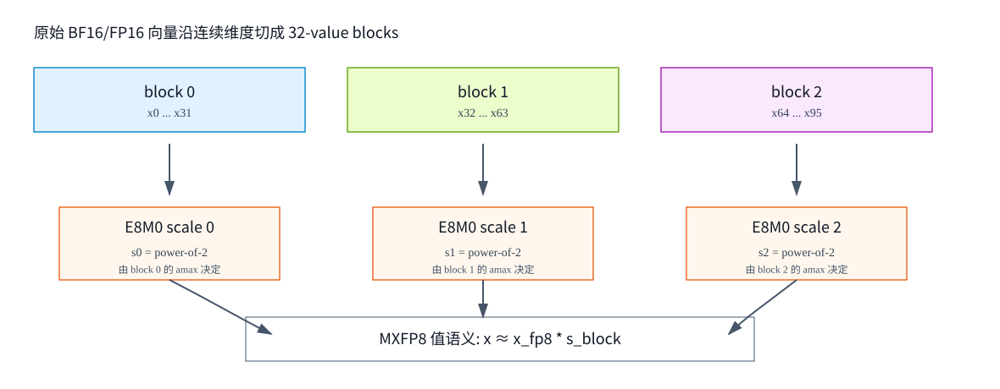
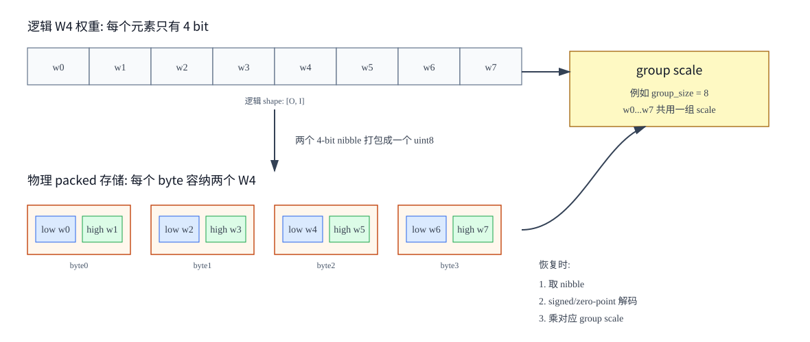

# 02. 位宽记号、FP8/MXFP8 与 packed W4

## 1. 为什么量化命名容易混乱

量化名通常把三类信息挤在一起：

```text
谁被量化:       W / A / C / KV / MoE / communication
量成多少 bit:   4 / 8 / 16
用什么格式:     INT / FP8 / MXFP8 / NF4 / FP4 / NVFP4 / MXFP4
```

但不同框架命名并不完全统一。因此读一个名字时要先拆字段，再回到 quant config 和 kernel contract。

## 2. `WnAm` 的基本读法

| 名称 | 读法 | 常见含义 |
|---|---|---|
| `W16A16` | weight 16-bit, activation 16-bit | BF16/FP16 baseline |
| `W8A16` | weight 8-bit, activation 16-bit | weight-only INT8/FP8 |
| `W4A16` | weight 4-bit, activation 16-bit | GPTQ/AWQ/Marlin 常见 |
| `W8A8` | weight 8-bit, activation 8-bit | INT8 或 FP8 GEMM |
| `W4A8` | weight 4-bit, activation 8-bit | 部分 MoE 或硬件专用 kernel |
| `W4A4` | weight 4-bit, activation 4-bit | 更激进，通常强依赖硬件、校准和 fused kernel |
| `W4AFP8` | weight 4-bit, activation FP8 | 混合精度 MoE 中可见 |

重要细节：`A` 通常指 Linear/GEMM 输入 activation，不代表模型里所有中间张量都被同样量化。比如 residual、norm、softmax、router logits、sampling logits 可能仍用 BF16/FP32。

## 3. `C8` 的含义

在 msModelSlim 的命名规范中，量化模式格式是：

```text
W{weight_bit}A{activation_bit}[C{cache_bit}][S]
```

| 字段 | 含义 |
|---|---|
| `W{weight_bit}` | 权重量化位数 |
| `A{activation_bit}` | 激活值量化位数 |
| `C{cache_bit}` | KV Cache 量化位数，可选 |
| `S` | 稀疏量化，可选 |

所以：

```text
W4A4C8
```

应读成：

```text
权重 4-bit
activation 4-bit
KV Cache 8-bit
```

如果另一个框架把 `C` 用作 compute、communication 或 cache 的缩写，则必须以该框架文档为准。但在大模型量化支持矩阵里，`C8` 明确表示 KV Cache 8-bit。

## 4. `W4A4C8-MXFP8` 怎么读

这个名字可以拆成两层：

```text
W4A4C8:
    W4  = weight 4-bit
    A4  = activation 4-bit
    C8  = KV Cache 8-bit

MXFP8:
    指明其中 8-bit 浮点路径采用 microscaling FP8 格式
```

更完整的读法是：

```text
这个方案希望把权重和 GEMM activation 主体压到 4-bit，
同时把 KV Cache 或某些 8-bit 路径压成 MXFP8。
MXFP8 不是把 W4/A4 改成 8-bit，而是说明某个 8-bit 浮点组件的具体表示方式。
```

实际落地时必须确认三件事：

| 需要确认 | 原因 |
|---|---|
| `C8` 是否确实指 KV Cache | 不同生态可能命名不一致 |
| MXFP8 应用于 KV、activation、weight scale 还是 GEMM operand | suffix 只给方向，真正对象由 config 和 kernel 决定 |
| checkpoint 里 scale 的 dtype 和 shape | MXFP8 常有 `uint8`/E8M0 scale，shape 必须和 block size 对齐 |

一个可能的数据组成是：

```text
weight_packed:     4-bit payload，通常装在 uint8/int32 容器
weight_scale:      per-group/per-block scale
activation_quant:  运行时动态 4-bit 或相关硬件格式
kv_cache:          8-bit MXFP8 payload + E8M0 block scale
output:            BF16/FP16，或 kernel 指定 dtype
```

不要把 `W4A4C8-MXFP8` 理解成一个单一 dtype。它是多类张量的量化协议。

## 5. INT 格式：INT8、INT4、UINT4

### 5.1 INT8

INT8 有 256 个编码。signed INT8 常见范围：

```text
-128 到 127
```

unsigned INT8 范围：

```text
0 到 255
```

INT8 的优势是硬件支持成熟，activation 动态量化也相对稳定。

### 5.2 INT4 / UINT4

4-bit 只有 16 个编码。

| 格式 | 常见范围 | 说明 |
|---|---:|---|
| signed INT4 | `-8..7` | 二补码友好 |
| symmetric INT4 | `-7..7` 或 `-8..7` | 取决于 kernel 是否使用所有编码 |
| UINT4 | `0..15` | 常与 zero point 搭配 |

INT4 很少作为独立 tensor dtype 存在，通常被打包到 `uint8`、`int32` 或硬件专用 packed dtype 中。

## 6. FP8：E4M3 与 E5M2

FP8 是 8-bit 浮点格式。常见两种：

| 格式 | 字段 | 特点 | 常见用途 |
|---|---|---|---|
| E4M3 | 1 sign + 4 exponent + 3 mantissa | 精度更高，范围较小 | forward activation、weight |
| E5M2 | 1 sign + 5 exponent + 2 mantissa | 范围更大，精度较低 | gradient、范围更大的张量 |

直觉：

```text
exponent 位数越多，能表示的数值范围越大；
mantissa 位数越多，在同一数量级内的刻度越细。
```

FP8 仍然经常需要 scale：

```text
x ≈ x_fp8 * scale
```

如果整个 tensor 只有一个 FP32 scale，遇到 outlier 时仍可能损失小值精度。因此出现了 block scaling 和 MXFP8。

## 7. MXFP8：microscaling FP8

MXFP8 把张量切成很多小 block，每个 block 共享一个局部 scale。



NVIDIA Transformer Engine 对 MXFP8 的核心语义是：

```text
x = x_fp8 * s_block
```

| 项 | 含义 |
|---|---|
| `x_fp8` | FP8 元素，通常是 E4M3 |
| `s_block` | 当前 block 的 E8M0 scale |
| block size | 常见为 32 个连续值 |
| E8M0 | 8-bit exponent、0 mantissa，只表达 2 的幂次 scale |

为什么 E8M0 可以当 scale？因为它只存指数：

```text
s_block = 2^(e - bias)
```

如果一个 block 内最大绝对值是 `amax_block`，可以选择一个 scale 让最大值刚好落进 FP8 范围：

```text
scale ≈ amax_block / max_fp8
```

读法：

```text
每 32 个值先找局部最大值；
根据这个局部最大值选一个 2 的幂次 scale；
这 32 个值都除以 scale 后 cast 成 FP8；
GEMM 时再把 FP8 值和 block scale 一起消费。
```

### 7.1 MXFP8 与普通 FP8 block scaling 的区别

| 方案 | scale 粒度 | scale dtype | 典型特征 |
|---|---|---|---|
| per-tensor FP8 | 整个 tensor | FP32 | 简单，但 outlier 影响大 |
| FP8 block scaling | 可配置 block | 通常 FP32 或实现自定 | 更细，但 metadata 更重 |
| MXFP8 | 1D block，常见 32 | E8M0/UE8M0 | scale 紧凑，硬件可直接支持 |

### 7.2 rowwise 与 columnwise

MXFP8 的 block 是有方向的：

```text
rowwise:    每行连续 32 个元素共享 scale
columnwise: 每列连续 32 个元素共享 scale
```

同一个原始矩阵的 rowwise MXFP8 和 columnwise MXFP8 不是简单转置关系，因为 block 分组方向不同，scale 也不同。需要哪个布局取决于 GEMM kernel 读取 A/B operand 的方式。

## 8. FP4、MXFP4、NVFP4、NF4

4-bit 不一定是整数，也可以是浮点或非均匀码本。

| 格式 | 本质 | 典型用途 |
|---|---|---|
| INT4/UINT4 | 均匀整数格点 + scale | GPTQ、AWQ、W4A16 |
| FP4 E2M1 | 4-bit 浮点元素 | MXFP4、NVFP4 路径 |
| MXFP4 | FP4 payload + E8M0 block scale | Blackwell/部分 MoE FP4 kernel |
| NVFP4 | NVIDIA FP4 block scaling 格式 | Blackwell FP4 训练/推理相关 |
| NF4 | NormalFloat 4-bit，非均匀码本 | QLoRA 微调常见 |

NF4 和 INT4 的关键区别：

```text
INT4:
    16 个格点通常均匀分布

NF4:
    16 个码本值按正态分布分位数设计，零附近更密
```

NF4 适合冻结 base model 做 QLoRA 微调；若目标是生产推理吞吐，常需要确认是否有高性能 4-bit GEMM kernel，不能只看显存。

## 9. packed W4 是什么

4-bit 值不能自然占据一个字节的一半地址，所以要打包。



### 9.1 两个 W4 放进一个 uint8

设两个 4-bit 值：

```text
a: 0..15
b: 0..15
```

打包成一个 byte：

```text
packed = a | (b << 4)
```

解包：

```text
a = packed & 0x0F
b = (packed >> 4) & 0x0F
```

这里 `0x0F` 的二进制是：

```text
0000 1111
```

它用来取低 4 个 bit。

### 9.2 signed INT4 的解码

如果 packed nibble 存的是 signed INT4，解包后还要从 `0..15` 映射到 `-8..7`：

```text
raw = nibble
signed = raw if raw < 8 else raw - 16
```

例子：

| nibble | signed |
|---:|---:|
| `0` | `0` |
| `1` | `1` |
| `7` | `7` |
| `8` | `-8` |
| `15` | `-1` |

如果是 UINT4 + zero point，则不做二补码映射，而是：

```text
x_hat = (raw - zero_point) * scale
```

### 9.3 物理形状与逻辑形状

逻辑权重：

```text
W_logical: [O, I]
```

如果每个 `uint8` 存两个 W4，物理存储可能是：

```text
W_packed_uint8: [O, I / 2]
```

如果每个 `int32` 存八个 W4，物理存储可能是：

```text
W_packed_int32: [O, I / 8]
```

这就是 `pack_factor` 的含义：

```text
pack_factor = container_bits / value_bits
```

| 容器 | value bits | pack factor |
|---|---:|---:|
| `uint8` | 4 | 2 |
| `int32` | 4 | 8 |
| `int32` | 8 | 4 |
| `int32` | 2 | 16 |

### 9.4 为什么 packed 会影响 tensor parallel 分片

如果一个 Linear 权重按输出维分片：

```text
W_logical: [O, I]
TP rank 0: O 的前半
TP rank 1: O 的后半
```

当 packed 维正好是分片维，offset 和 size 必须按 `pack_factor` 缩小：

```text
logical_shard_size = 4096
physical_shard_size = logical_shard_size / pack_factor
```

否则 loader 会从 checkpoint 中切错位置。很多量化模型加载失败、shape mismatch 或生成质量异常，都来自逻辑 shape 和 packed physical shape 混淆。

## 10. scale、scale_inv、global scale、block scale

量化 checkpoint 里常见的 scale 名字有：

| 名称 | 常见含义 |
|---|---|
| `scale` | 反量化乘回去的比例 |
| `scale_inv` | 量化时除以的比例，或者 `1/scale`，具体看实现 |
| `weight_scale` | 权重量化 scale |
| `input_scale` | activation 或输入 scale |
| `weight_scale_inv` | block FP8/MXFP8 中常见，kernel 可能期望 inverse scale |
| `global_scale` | 全局归一化因子，常与 block scale 相乘 |
| `amax` | 校准时观测到的最大绝对值 |

不要只按变量名猜方向。要看 kernel 公式：

```text
有的 kernel:
    x_fp = q * scale

有的 kernel:
    q = x * scale_inv
    x_fp = q / scale_inv
```

如果把 `scale` 和 `scale_inv` 用反，模型不会只“慢一点”，而是直接输出崩坏。

## 11. 常见命名快速表

| 名称 | 应先理解成 |
|---|---|
| `W4A16` | 4-bit 权重，activation 保持 FP16/BF16 |
| `W4A8` | 4-bit 权重，8-bit activation |
| `W8A8` | 8-bit 权重和 8-bit activation，可为 INT8 或 FP8 |
| `W8A8C8` | W8A8 + KV Cache 8-bit |
| `W4A4C8` | W4A4 + KV Cache 8-bit |
| `W4AFP8` | 权重 4-bit，activation 或 MoE 输入路径 FP8 |
| `MXFP8` | FP8 payload + per-32 E8M0 block scale |
| `MXFP4` | FP4 payload + per-32 E8M0 block scale |
| `NVFP4` | NVIDIA FP4 block scaling 格式 |
| `NF4` | QLoRA 常用 NormalFloat 4-bit 码本 |
| `packed W4` | 多个 4-bit 权重塞进 `uint8`/`int32` 容器 |
| `group_size=128` | 每 128 个输入维共享一组权重 scale |
| `block_size=[1,32]` | 常见 MXFP8 权重 block，沿 K 维每 32 个值一个 scale |

## 12. 小结

1. `W/A/C` 说明量化对象，数字说明 bit-width，后缀说明具体数值格式或 kernel 协议。
2. `W4A4C8-MXFP8` 不是一个单 dtype，而是多张量量化方案。
3. packed W4 会改变物理 shape，loader、TP 分片、kernel 都必须按 packed shape 处理。
4. MXFP8 的关键不是“8-bit”，而是“FP8 元素 + 每 32 个值一个 E8M0 block scale”。
5. 读量化模型时，永远把名字、配置、checkpoint tensor shape、kernel 参数四者对齐。
